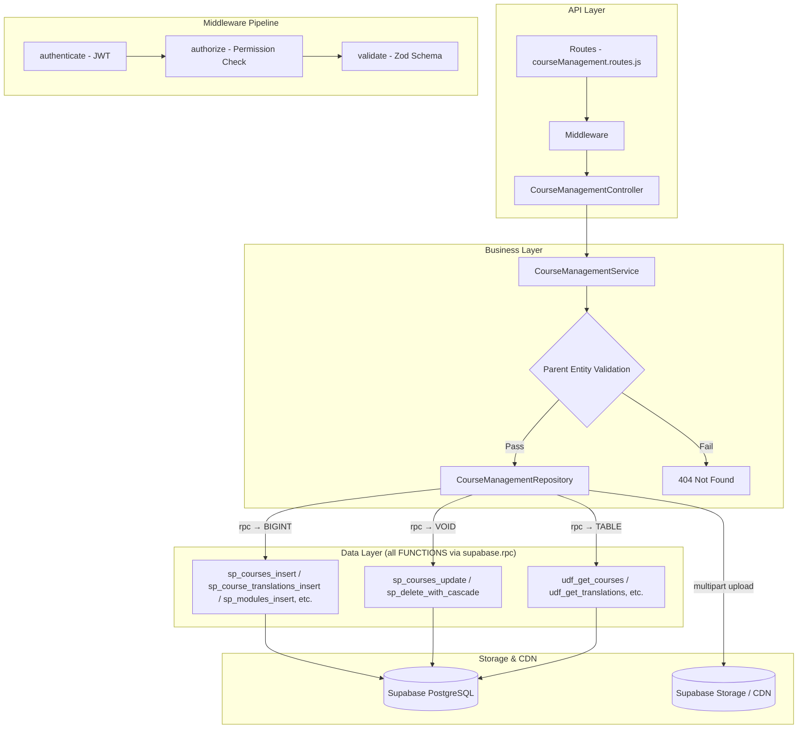

# GrowUpMore API — Course Management Module

## Postman Testing Guide

**Base URL:** `http://localhost:5001`
**API Prefix:** `/api/v1/course-management`
**Content-Type:** `application/json` or `multipart/form-data` for file uploads
**Authentication:** All endpoints require `Bearer <access_token>` in Authorization header

---

## Architecture Flow



---

## Prerequisites

Before testing, ensure:

1. **Authentication**: Login via `POST /api/v1/auth/login` to obtain `access_token`
2. **Permissions**: Run `phase09_course_management_permissions_seed.sql` in Supabase SQL Editor
3. **Master Data**: Ensure Languages, Sub-Categories, Subjects, Chapters, Topics exist (from earlier phases)
4. **File Storage**: Supabase Storage buckets configured for course media (trailers, thumbnails, banners, etc.)
5. **Instructor Account**: At least one active instructor user account exists

---

## Complete Endpoint Reference

### Test Order (follow this sequence in Postman)

| # | Endpoint | Permission | Purpose |
|---|----------|-----------|---------|
| 1 | `POST /courses` | `course.create` | Create a course (with optional files) |
| 2 | `GET /courses` | `course.read` | List all courses with filters |
| 3 | `GET /courses/:id` | `course.read` | Get course by ID |
| 4 | `PATCH /courses/:id` | `course.update` | Update course details |
| 5 | `DELETE /courses/:id` | `course.delete` | Soft delete course |
| 6 | `POST /courses/:id/restore` | `course.update` | Restore soft-deleted course |
| 7 | `POST /course-translations` | `course_translation.create` | Create course translation (multipart) |
| 8 | `PATCH /course-translations/:id` | `course_translation.update` | Update course translation |
| 9 | `DELETE /course-translations/:id` | `course_translation.delete` | Soft delete translation |
| 10 | `POST /course-translations/:id/restore` | `course_translation.update` | Restore translation |
| 11 | `POST /course-modules` | `course_module.create` | Create course module |
| 12 | `GET /course-modules` | `course_module.read` | List course modules |
| 13 | `GET /course-modules/:id` | `course_module.read` | Get module by ID |
| 14 | `PATCH /course-modules/:id` | `course_module.update` | Update module |
| 15 | `DELETE /course-modules/:id` | `course_module.delete` | Soft delete module |
| 16 | `POST /course-modules/:id/restore` | `course_module.update` | Restore module |
| 17 | `POST /course-module-translations` | `course_module_translation.create` | Create module translation (multipart) |
| 18 | `PATCH /course-module-translations/:id` | `course_module_translation.update` | Update module translation |
| 19 | `DELETE /course-module-translations/:id` | `course_module_translation.delete` | Soft delete module translation |
| 20 | `POST /course-module-translations/:id/restore` | `course_module_translation.update` | Restore module translation |
| 21 | `POST /course-module-topics` | `course_module_topic.create` | Create course module topic |
| 22 | `GET /course-module-topics` | `course_module_topic.read` | List course module topics |
| 23 | `GET /course-module-topics/:id` | `course_module_topic.read` | Get topic by ID |
| 24 | `PATCH /course-module-topics/:id` | `course_module_topic.update` | Update topic |
| 25 | `DELETE /course-module-topics/:id` | `course_module_topic.delete` | Soft delete single topic |
| 26 | `POST /course-module-topics/bulk-delete` | `course_module_topic.delete` | Bulk delete topics |
| 27 | `POST /course-module-topics/:id/restore` | `course_module_topic.update` | Restore single topic |
| 28 | `POST /course-module-topics/bulk-restore` | `course_module_topic.update` | Bulk restore topics |
| 29 | `POST /course-sub-categories` | `course_sub_category.create` | Create course sub-category link |
| 30 | `PATCH /course-sub-categories/:id` | `course_sub_category.update` | Update sub-category link |
| 31 | `DELETE /course-sub-categories/:id` | `course_sub_category.delete` | Soft delete sub-category link |
| 32 | `POST /course-sub-categories/:id/restore` | `course_sub_category.update` | Restore sub-category link |
| 33 | `POST /course-subjects` | `course_subject.create` | Create course subject link |
| 34 | `PATCH /course-subjects/:id` | `course_subject.update` | Update subject link |
| 35 | `DELETE /course-subjects/:id` | `course_subject.delete` | Soft delete subject link |
| 36 | `POST /course-subjects/:id/restore` | `course_subject.update` | Restore subject link |
| 37 | `POST /course-chapters` | `course_chapter.create` | Create course chapter link |
| 38 | `PATCH /course-chapters/:id` | `course_chapter.update` | Update chapter link |
| 39 | `DELETE /course-chapters/:id` | `course_chapter.delete` | Soft delete chapter link |
| 40 | `POST /course-chapters/:id/restore` | `course_chapter.update` | Restore chapter link |
| 41 | `POST /course-instructors` | `course_instructor.create` | Create course instructor link |
| 42 | `PATCH /course-instructors/:id` | `course_instructor.update` | Update instructor link |
| 43 | `DELETE /course-instructors/:id` | `course_instructor.delete` | Soft delete instructor link |
| 44 | `POST /course-instructors/:id/restore` | `course_instructor.update` | Restore instructor link |
| 45 | `POST /bundles` | `bundle.create` | Create bundle |
| 46 | `GET /bundles` | `bundle.read` | List bundles with filters |
| 47 | `GET /bundles/:id` | `bundle.read` | Get bundle by ID |
| 48 | `PATCH /bundles/:id` | `bundle.update` | Update bundle |
| 49 | `DELETE /bundles/:id` | `bundle.delete` | Cascade delete bundle (with translations + courses) |
| 50 | `DELETE /bundles/:id/single` | `bundle.delete` | Single delete bundle only |
| 51 | `POST /bundles/:id/restore` | `bundle.update` | Cascade restore bundle |
| 52 | `POST /bundles/:id/restore-single` | `bundle.update` | Single restore bundle |
| 53 | `POST /bundle-translations` | `bundle_translation.create` | Create bundle translation (multipart) |
| 54 | `PATCH /bundle-translations/:id` | `bundle_translation.update` | Update bundle translation |
| 55 | `POST /bundle-translations/bulk-delete` | `bundle_translation.delete` | Bulk delete translations |
| 56 | `POST /bundle-translations/bulk-restore` | `bundle_translation.update` | Bulk restore translations |
| 57 | `POST /bundle-courses` | `bundle_course.create` | Create bundle-course link |
| 58 | `GET /bundle-courses` | `bundle_course.read` | List bundle courses |
| 59 | `GET /bundle-courses/:id` | `bundle_course.read` | Get bundle-course by ID |
| 60 | `PATCH /bundle-courses/:id` | `bundle_course.update` | Update bundle-course link |
| 61 | `DELETE /bundle-courses/:id` | `bundle_course.delete` | Single delete bundle-course |
| 62 | `POST /bundle-courses/bulk-delete` | `bundle_course.delete` | Bulk delete bundle-courses |
| 63 | `POST /bundle-courses/:id/restore` | `bundle_course.update` | Single restore bundle-course |
| 64 | `POST /bundle-courses/bulk-restore` | `bundle_course.update` | Bulk restore bundle-courses |

---

## Common Headers (All Requests)

| Key | Value |
|-----|-------|
| Authorization | Bearer `<access_token>` |
| Content-Type | `application/json` (default) or `multipart/form-data` (for file uploads) |

> **File Uploads Note:** Endpoints that accept multipart form-data will process file uploads (trailerVideo, trailerThumbnail, video, brochure, webThumbnail, webBanner, appThumbnail, appBanner, videoThumbnail, thumbnail, banner, icon, image). Files are stored in Supabase Storage and returned as secure download URLs. Max file size is typically 50MB per file.

---

## 1. COURSES

### 1.1 Create Course (JSON, no files)

**`POST /api/v1/course-management/courses`**

**Permission:** `course.create`

**Headers:**
```
Authorization: Bearer {{access_token}}
Content-Type: application/json
```

**Request Body:**

| Field | Type | Required | Description |
|-------|------|----------|-------------|
| instructorId | number | Yes | ID of the course instructor |
| courseLanguageId | number | Yes | Language ID for the course |
| isInstructorCourse | boolean | No | Whether course is instructor-specific (default: false) |
| code | string | No | Unique course code |
| slug | string | No | URL-friendly slug |
| difficultyLevel | string | No | beginner, intermediate, advanced |
| courseStatus | string | No | draft, review, published, archived, suspended (default: draft) |
| durationHours | number | No | Course duration in hours |
| price | number | No | Price in specified currency |
| originalPrice | number | No | Original price before discount |
| discountPercentage | number | No | Discount percentage (0-100) |
| currency | string | No | Currency code (USD, INR, etc.) |
| isFree | boolean | No | Whether course is free (default: false) |
| isNew | boolean | No | Mark as new course (default: false) |
| newUntil | date | No | Date until which course is marked as new |
| isFeatured | boolean | No | Feature on homepage (default: false) |
| isBestseller | boolean | No | Mark as bestseller (default: false) |
| hasPlacementAssistance | boolean | No | Includes placement assistance (default: false) |
| hasCertificate | boolean | No | Includes certificate (default: false) |
| maxStudents | number | No | Maximum students allowed |
| refundDays | number | No | Refund policy in days |
| isActive | boolean | No | Active status (default: true) |
| publishedAt | timestamp | No | Publication timestamp |
| contentUpdatedAt | timestamp | No | Last content update timestamp |

**Example Request:**
```json
{
  "instructorId": 2,
  "courseLanguageId": 1,
  "isInstructorCourse": false,
  "code": "WEB-DEV-101",
  "slug": "web-development-basics",
  "difficultyLevel": "beginner",
  "courseStatus": "draft",
  "durationHours": 40,
  "price": 4999,
  "originalPrice": 6999,
  "discountPercentage": 29,
  "currency": "INR",
  "isFree": false,
  "isNew": true,
  "newUntil": "2026-06-30",
  "isFeatured": true,
  "isBestseller": false,
  "hasPlacementAssistance": false,
  "hasCertificate": true,
  "maxStudents": 500,
  "refundDays": 30,
  "isActive": true,
  "publishedAt": "2026-04-01T00:00:00Z"
}
```

**Expected Response (201):**
```json
{
  "success": true,
  "message": "Course created successfully",
  "data": {
    "id": 1
  }
}
```

**Postman Tests:**
```javascript
pm.test("Status is 201", () => pm.response.to.have.status(201));
const json = pm.response.json();
pm.test("Has course ID", () => pm.expect(json.data.id).to.be.a("number"));
pm.collectionVariables.set("courseId", json.data.id);
```

---

### 1.2 Create Course (Multipart with Files)

**`POST /api/v1/course-management/courses`**

**Headers:**
```
Authorization: Bearer {{access_token}}
Content-Type: multipart/form-data
```

**Body (Form-data):**

```
Key: courseData (form field, type: text)
Value: {
  "instructorId": 3,
  "courseLanguageId": 1,
  "code": "DATA-SCI-201",
  "slug": "data-science-advanced",
  "difficultyLevel": "advanced",
  "courseStatus": "review",
  "durationHours": 60,
  "price": 7999,
  "currency": "INR",
  "isFeatured": true,
  "hasCertificate": true,
  "maxStudents": 300,
  "refundDays": 45,
  "isActive": true
}

Key: trailerVideo (file, type: file)
Value: [VIDEO file - .mp4, .webm, max 100MB: course-trailer.mp4]

Key: trailerThumbnail (file, type: file)
Value: [IMAGE file - .jpg, .png, .webp, max 5MB: trailer-thumb.jpg]

Key: video (file, type: file)
Value: [VIDEO file - .mp4, max 100MB: course-intro.mp4]

Key: brochure (file, type: file)
Value: [PDF file - max 10MB: course-brochure.pdf]
```

**Expected Response (201):**
```json
{
  "success": true,
  "message": "Course created successfully",
  "data": {
    "id": 2,
    "trailerVideoUrl": "https://storage.supabase.co/courses/trailers/course-trailer-uuid.mp4",
    "trailerThumbnailUrl": "https://storage.supabase.co/courses/thumbnails/trailer-thumb-uuid.jpg",
    "videoUrl": "https://storage.supabase.co/courses/videos/course-intro-uuid.mp4",
    "brochureUrl": "https://storage.supabase.co/courses/brochures/course-brochure-uuid.pdf"
  }
}
```

---

### 1.3 List Courses

**`GET /api/v1/course-management/courses`**

**Permission:** `course.read`

**Headers:**
```
Authorization: Bearer {{access_token}}
```

**Query Parameters:**

| Parameter | Type | Default | Description |
|-----------|------|---------|-------------|
| `page` | number | 1 | Page number |
| `limit` | number | 20 | Items per page |
| `search` | string | — | Search by course code or name |
| `sortBy` | string | id | Sort column (id, code, difficultyLevel, price, etc.) |
| `sortDir` | string | ASC | Sort direction (ASC/DESC) |
| `difficultyLevel` | string | — | Filter: beginner, intermediate, advanced |
| `courseStatus` | string | — | Filter: draft, review, published, archived, suspended |
| `isFree` | boolean | — | Filter by free status |
| `currency` | string | — | Filter by currency |
| `isInstructorCourse` | boolean | — | Filter by instructor-specific courses |
| `courseId` | number | — | Filter by specific course ID |
| `languageId` | number | — | Filter by language |
| `isActive` | boolean | — | Filter by active status |

**Example:** `GET /api/v1/course-management/courses?page=1&limit=15&difficultyLevel=intermediate&courseStatus=published&isActive=true`

**Expected Response (200):**
```json
{
  "success": true,
  "message": "Courses retrieved successfully",
  "data": [
    {
      "id": 1,
      "code": "WEB-DEV-101",
      "slug": "web-development-basics",
      "difficulty_level": "beginner",
      "course_status": "published",
      "duration_hours": 40,
      "price": 4999,
      "original_price": 6999,
      "discount_percentage": 29,
      "currency": "INR",
      "is_free": false,
      "is_featured": true,
      "has_certificate": true,
      "instructor_id": 2,
      "instructor_name": "Amit Kumar",
      "is_active": true,
      "total_count": 5
    }
  ],
  "meta": {
    "page": 1,
    "limit": 15,
    "totalCount": 5,
    "totalPages": 1
  }
}
```

---

### 1.4 Get Course by ID

**`GET /api/v1/course-management/courses/:id`**

**Permission:** `course.read`

**Headers:**
```
Authorization: Bearer {{access_token}}
```

**Example:** `GET /api/v1/course-management/courses/{{courseId}}`

**Expected Response (200):**
```json
{
  "success": true,
  "message": "Course retrieved successfully",
  "data": {
    "id": 1,
    "code": "WEB-DEV-101",
    "slug": "web-development-basics",
    "instructor_id": 2,
    "instructor_name": "Amit Kumar",
    "language_id": 1,
    "language_name": "English",
    "is_instructor_course": false,
    "difficulty_level": "beginner",
    "course_status": "published",
    "duration_hours": 40,
    "price": 4999,
    "original_price": 6999,
    "discount_percentage": 29,
    "currency": "INR",
    "is_free": false,
    "is_new": true,
    "new_until": "2026-06-30",
    "is_featured": true,
    "is_bestseller": false,
    "has_placement_assistance": false,
    "has_certificate": true,
    "max_students": 500,
    "refund_days": 30,
    "is_active": true,
    "published_at": "2026-04-01T00:00:00Z",
    "content_updated_at": "2026-04-02T10:30:00Z",
    "created_at": "2026-04-01T08:15:00Z",
    "updated_at": "2026-04-02T10:30:00Z",
    "deleted_at": null
  }
}
```

---

### 1.5 Update Course

**`PATCH /api/v1/course-management/courses/:id`**

**Permission:** `course.update`

**Headers:**
```
Authorization: Bearer {{access_token}}
Content-Type: application/json
```

**Example:** `PATCH /api/v1/course-management/courses/{{courseId}}`

**Request Body:** (same fields as create, all optional except when required by business logic)

```json
{
  "difficultyLevel": "intermediate",
  "courseStatus": "review",
  "price": 5999,
  "discountPercentage": 25,
  "isFeatured": false,
  "hasPlacementAssistance": true
}
```

**Expected Response (200):**
```json
{
  "success": true,
  "message": "Course updated successfully",
  "data": {
    "id": 1
  }
}
```

---

### 1.6 Delete Course (Soft Delete)

**`DELETE /api/v1/course-management/courses/:id`**

**Permission:** `course.delete`

**Headers:**
```
Authorization: Bearer {{access_token}}
```

**Example:** `DELETE /api/v1/course-management/courses/{{courseId}}`

**Expected Response (200):**
```json
{
  "success": true,
  "message": "Course deleted successfully",
  "data": {}
}
```

---

### 1.7 Restore Course

**`POST /api/v1/course-management/courses/:id/restore`**

**Permission:** `course.update`

**Headers:**
```
Authorization: Bearer {{access_token}}
Content-Type: application/json
```

**Example:** `POST /api/v1/course-management/courses/{{courseId}}/restore`

**Request Body (Optional):**
```json
{
  "restoreTranslations": true
}
```

**Expected Response (200):**
```json
{
  "success": true,
  "message": "Course restored successfully",
  "data": {
    "id": 1
  }
}
```

---

## 2. COURSE TRANSLATIONS

### 2.1 Create Course Translation (Multipart with Files)

**`POST /api/v1/course-management/course-translations`**

**Permission:** `course_translation.create`

**Headers:**
```
Authorization: Bearer {{access_token}}
Content-Type: multipart/form-data
```

**Body (Form-data):**

```
Key: translationData (form field, type: text)
Value: {
  "courseId": 1,
  "languageId": 2,
  "title": "वेब डेवलपमेंट की मूलबातें",
  "shortIntro": "शुरुआत से एचटीएमएल, सीएसएस, जावास्क्रिप्ट सीखें",
  "longIntro": "यह कोर्स आपको वेब डेवलपमेंट के सभी आवश्यक कौशल सिखाता है। हम HTML, CSS, JavaScript, और React कवर करेंगे।",
  "tagline": "अपने पहले वेबसाइट बनाएं",
  "videoTitle": "कोर्स परिचय वीडियो",
  "videoDescription": "इस वीडियो में कोर्स के अवलोकन और सीखने के परिणाम जानें।",
  "videoDurationMinutes": 5,
  "tags": ["web-development", "html", "css", "javascript"],
  "isNewTitle": true,
  "prerequisites": ["Basic computer literacy", "Text editor knowledge"],
  "skillsGain": ["HTML5 fundamentals", "CSS3 styling", "JavaScript ES6+", "Responsive Design"],
  "whatYouWillLearn": ["Build responsive websites", "Use modern development tools", "Understand web standards"],
  "courseIncludes": ["40 hours of video", "10 projects", "Downloadable resources"],
  "courseIsFor": ["Career changers", "Beginners", "Students"],
  "applyForDesignations": ["Junior Web Developer", "Front-end Developer"],
  "demandInCountries": ["India", "USA", "Canada"],
  "salaryStandard": ["5-8 LPA in India", "$50k-80k in USA"],
  "futureCourses": ["Advanced React", "Full-stack Development"],
  "metaTitle": "Web Development Basics - Complete Course",
  "metaDescription": "Learn web development from scratch with HTML, CSS, and JavaScript",
  "metaKeywords": "web development, html, css, javascript",
  "canonicalUrl": "https://growupmore.com/courses/web-dev-basics",
  "ogSiteName": "GrowUpMore",
  "ogTitle": "Web Development Basics",
  "ogDescription": "Master web development fundamentals",
  "ogType": "course",
  "ogImage": "https://cdn.growupmore.com/og-image.jpg",
  "ogUrl": "https://growupmore.com/courses/web-dev-basics",
  "twitterSite": "@growupmorelearn",
  "twitterTitle": "Web Development Basics",
  "twitterDescription": "Learn web development from scratch",
  "twitterImage": "https://cdn.growupmore.com/twitter-image.jpg",
  "twitterCard": "summary_large_image",
  "robotsDirective": "index, follow",
  "focusKeyword": "web development basics",
  "structuredData": {
    "type": "Course",
    "provider": "GrowUpMore"
  },
  "isActive": true
}

Key: webThumbnail (file, type: file)
Value: [IMAGE - .jpg, .png, .webp, max 5MB: web-thumb.jpg]

Key: webBanner (file, type: file)
Value: [IMAGE - .jpg, .png, .webp, max 10MB: web-banner.jpg]

Key: appThumbnail (file, type: file)
Value: [IMAGE - .jpg, .png, .webp, max 3MB: app-thumb.jpg]

Key: appBanner (file, type: file)
Value: [IMAGE - .jpg, .png, .webp, max 5MB: app-banner.jpg]

Key: videoThumbnail (file, type: file)
Value: [IMAGE - .jpg, .png, .webp, max 5MB: video-thumb.jpg]
```

**Expected Response (201):**
```json
{
  "success": true,
  "message": "Course translation created successfully",
  "data": {
    "id": 5,
    "webThumbnailUrl": "https://storage.supabase.co/courses/web-thumbnails/web-thumb-uuid.jpg",
    "webBannerUrl": "https://storage.supabase.co/courses/web-banners/web-banner-uuid.jpg",
    "appThumbnailUrl": "https://storage.supabase.co/courses/app-thumbnails/app-thumb-uuid.jpg",
    "appBannerUrl": "https://storage.supabase.co/courses/app-banners/app-banner-uuid.jpg",
    "videoThumbnailUrl": "https://storage.supabase.co/courses/video-thumbnails/video-thumb-uuid.jpg"
  }
}
```

---

### 2.2 Update Course Translation

**`PATCH /api/v1/course-management/course-translations/:id`**

**Permission:** `course_translation.update`

**Headers:**
```
Authorization: Bearer {{access_token}}
Content-Type: multipart/form-data
```

**Example:** `PATCH /api/v1/course-management/course-translations/{{translationId}}`

**Request Body:** (same fields as create, except courseId and languageId)

```json
{
  "title": "Updated Course Title",
  "shortIntro": "Updated short introduction",
  "metaTitle": "Updated Meta Title",
  "isActive": true
}
```

**Expected Response (200):**
```json
{
  "success": true,
  "message": "Course translation updated successfully",
  "data": {
    "id": 5
  }
}
```

---

### 2.3 Delete Course Translation

**`DELETE /api/v1/course-management/course-translations/:id`**

**Permission:** `course_translation.delete`

**Headers:**
```
Authorization: Bearer {{access_token}}
```

**Example:** `DELETE /api/v1/course-management/course-translations/{{translationId}}`

**Expected Response (200):**
```json
{
  "success": true,
  "message": "Course translation deleted successfully",
  "data": {}
}
```

---

### 2.4 Restore Course Translation

**`POST /api/v1/course-management/course-translations/:id/restore`**

**Permission:** `course_translation.update`

**Headers:**
```
Authorization: Bearer {{access_token}}
```

**Example:** `POST /api/v1/course-management/course-translations/{{translationId}}/restore`

**Expected Response (200):**
```json
{
  "success": true,
  "message": "Course translation restored successfully",
  "data": {
    "id": 5
  }
}
```

---

## 3. COURSE MODULES

### 3.1 Create Course Module

**`POST /api/v1/course-management/course-modules`**

**Permission:** `course_module.create`

**Headers:**
```
Authorization: Bearer {{access_token}}
Content-Type: application/json
```

**Request Body:**

| Field | Type | Required | Description |
|-------|------|----------|-------------|
| courseId | number | Yes | Parent course ID |
| slug | string | No | URL-friendly slug |
| displayOrder | number | No | Display order in course |
| estimatedMinutes | number | No | Estimated time to complete |
| isActive | boolean | No | Active status (default: true) |

**Example Request:**
```json
{
  "courseId": 1,
  "slug": "module-01-html-basics",
  "displayOrder": 1,
  "estimatedMinutes": 180,
  "isActive": true
}
```

**Expected Response (201):**
```json
{
  "success": true,
  "message": "Course module created successfully",
  "data": {
    "id": 1
  }
}
```

---

### 3.2 List Course Modules

**`GET /api/v1/course-management/course-modules`**

**Permission:** `course_module.read`

**Query Parameters:**

| Parameter | Type | Default | Description |
|-----------|------|---------|-------------|
| `page` | number | 1 | Page number |
| `limit` | number | 20 | Items per page |
| `search` | string | — | Search by slug |
| `sortBy` | string | display_order | Sort column |
| `sortDir` | string | ASC | Sort direction |
| `courseId` | number | — | Filter by course ID |
| `courseModuleId` | number | — | Filter by module ID |
| `languageId` | number | — | Filter by language |
| `filterCourseId` | number | — | Alternative course filter |
| `isActive` | boolean | — | Filter by active status |

**Example:** `GET /api/v1/course-management/course-modules?courseId=1&limit=10&sortBy=display_order`

**Expected Response (200):**
```json
{
  "success": true,
  "message": "Course modules retrieved successfully",
  "data": [
    {
      "id": 1,
      "course_id": 1,
      "slug": "module-01-html-basics",
      "display_order": 1,
      "estimated_minutes": 180,
      "is_active": true,
      "total_count": 4
    }
  ],
  "meta": {
    "page": 1,
    "limit": 10,
    "totalCount": 4,
    "totalPages": 1
  }
}
```

---

### 3.3 Get Course Module by ID

**`GET /api/v1/course-management/course-modules/:id`**

**Permission:** `course_module.read`

**Example:** `GET /api/v1/course-management/course-modules/{{moduleId}}`

**Expected Response (200):**
```json
{
  "success": true,
  "message": "Course module retrieved successfully",
  "data": {
    "id": 1,
    "course_id": 1,
    "course_code": "WEB-DEV-101",
    "slug": "module-01-html-basics",
    "display_order": 1,
    "estimated_minutes": 180,
    "is_active": true,
    "created_at": "2026-04-01T08:00:00Z",
    "updated_at": "2026-04-01T08:00:00Z",
    "deleted_at": null
  }
}
```

---

### 3.4 Update Course Module

**`PATCH /api/v1/course-management/course-modules/:id`**

**Permission:** `course_module.update`

**Example:** `PATCH /api/v1/course-management/course-modules/{{moduleId}}`

**Request Body:**
```json
{
  "displayOrder": 2,
  "estimatedMinutes": 200,
  "isActive": true
}
```

**Expected Response (200):**
```json
{
  "success": true,
  "message": "Course module updated successfully",
  "data": {
    "id": 1
  }
}
```

---

### 3.5 Delete Course Module

**`DELETE /api/v1/course-management/course-modules/:id`**

**Permission:** `course_module.delete`

**Example:** `DELETE /api/v1/course-management/course-modules/{{moduleId}}`

**Expected Response (200):**
```json
{
  "success": true,
  "message": "Course module deleted successfully",
  "data": {}
}
```

---

### 3.6 Restore Course Module

**`POST /api/v1/course-management/course-modules/:id/restore`**

**Permission:** `course_module.update`

**Request Body (Optional):**
```json
{
  "restoreTranslations": true
}
```

**Expected Response (200):**
```json
{
  "success": true,
  "message": "Course module restored successfully",
  "data": {
    "id": 1
  }
}
```

---

## 4. COURSE MODULE TRANSLATIONS

### 4.1 Create Course Module Translation (Multipart)

**`POST /api/v1/course-management/course-module-translations`**

**Permission:** `course_module_translation.create`

**Headers:**
```
Authorization: Bearer {{access_token}}
Content-Type: multipart/form-data
```

**Body (Form-data):**

```
Key: translationData (form field, type: text)
Value: {
  "courseModuleId": 1,
  "languageId": 1,
  "name": "HTML Basics",
  "shortIntro": "Learn HTML fundamentals",
  "description": "In this module, we cover HTML structure, tags, forms, and semantic HTML5.",
  "tags": ["html", "fundamentals", "web"],
  "metaTitle": "HTML Basics Module",
  "metaDescription": "Complete HTML module with examples",
  "metaKeywords": "html, web development",
  "canonicalUrl": "https://growupmore.com/courses/web-dev/html-basics",
  "ogTitle": "HTML Basics",
  "ogDescription": "Learn HTML5 from scratch",
  "ogImage": "https://cdn.growupmore.com/html-og.jpg",
  "twitterTitle": "HTML Basics",
  "twitterDescription": "Master HTML fundamentals",
  "twitterImage": "https://cdn.growupmore.com/html-twitter.jpg",
  "robotsDirective": "index, follow",
  "focusKeyword": "html basics",
  "structuredData": {
    "type": "Course Module"
  },
  "isActive": true
}

Key: icon (file, type: file)
Value: [IMAGE - .svg, .png, .jpg, max 2MB: html-icon.svg]

Key: image (file, type: file)
Value: [IMAGE - .png, .jpg, .webp, max 5MB: html-module-image.jpg]
```

**Expected Response (201):**
```json
{
  "success": true,
  "message": "Course module translation created successfully",
  "data": {
    "id": 3,
    "iconUrl": "https://storage.supabase.co/courses/icons/html-icon-uuid.svg",
    "imageUrl": "https://storage.supabase.co/courses/module-images/html-module-image-uuid.jpg"
  }
}
```

---

### 4.2 Update Course Module Translation

**`PATCH /api/v1/course-management/course-module-translations/:id`**

**Permission:** `course_module_translation.update`

**Request Body:** (same fields as create, except courseModuleId and languageId)

```json
{
  "name": "HTML & HTML5 Fundamentals",
  "description": "Updated description with more details",
  "metaTitle": "Updated Meta Title"
}
```

**Expected Response (200):**
```json
{
  "success": true,
  "message": "Course module translation updated successfully",
  "data": {
    "id": 3
  }
}
```

---

### 4.3 Delete Course Module Translation

**`DELETE /api/v1/course-management/course-module-translations/:id`**

**Permission:** `course_module_translation.delete`

**Expected Response (200):**
```json
{
  "success": true,
  "message": "Course module translation deleted successfully",
  "data": {}
}
```

---

### 4.4 Restore Course Module Translation

**`POST /api/v1/course-management/course-module-translations/:id/restore`**

**Permission:** `course_module_translation.update`

**Expected Response (200):**
```json
{
  "success": true,
  "message": "Course module translation restored successfully",
  "data": {
    "id": 3
  }
}
```

---

## 5. COURSE MODULE TOPICS

### 5.1 Create Course Module Topic

**`POST /api/v1/course-management/course-module-topics`**

**Permission:** `course_module_topic.create`

**Headers:**
```
Authorization: Bearer {{access_token}}
Content-Type: application/json
```

**Request Body:**

| Field | Type | Required | Description |
|-------|------|----------|-------------|
| courseModuleId | number | Yes | Parent module ID |
| topicId | number | No | Linked topic ID from master data |
| displayOrder | number | No | Display order |
| customTitle | string | No | Override topic title |
| customDescription | string | No | Override topic description |
| estimatedMinutes | number | No | Estimated completion time |
| isPreview | boolean | No | Available for free preview (default: false) |
| note | string | No | Internal notes |
| isActive | boolean | No | Active status (default: true) |

**Example Request:**
```json
{
  "courseModuleId": 1,
  "topicId": 10,
  "displayOrder": 1,
  "customTitle": "HTML Document Structure",
  "customDescription": "Learn how to create a proper HTML document structure",
  "estimatedMinutes": 30,
  "isPreview": true,
  "note": "Free preview content for course preview",
  "isActive": true
}
```

**Expected Response (201):**
```json
{
  "success": true,
  "message": "Course module topic created successfully",
  "data": {
    "id": 1
  }
}
```

---

### 5.2 List Course Module Topics

**`GET /api/v1/course-management/course-module-topics`**

**Permission:** `course_module_topic.read`

**Query Parameters:**

| Parameter | Type | Default | Description |
|-----------|------|---------|-------------|
| `page` | number | 1 | Page number |
| `limit` | number | 20 | Items per page |
| `search` | string | — | Search by title |
| `sortBy` | string | display_order | Sort column |
| `sortDir` | string | ASC | Sort direction |
| `courseModuleId` | number | — | Filter by module |
| `topicId` | number | — | Filter by topic |
| `filterCourseModuleId` | number | — | Alternative module filter |
| `isPreview` | boolean | — | Filter by preview status |
| `hasTopic` | boolean | — | Filter by topic presence |
| `isActive` | boolean | — | Filter by active status |

**Example:** `GET /api/v1/course-management/course-module-topics?courseModuleId=1&isPreview=true`

**Expected Response (200):**
```json
{
  "success": true,
  "message": "Course module topics retrieved successfully",
  "data": [
    {
      "id": 1,
      "course_module_id": 1,
      "module_slug": "module-01-html-basics",
      "topic_id": 10,
      "topic_name": "HTML Document Structure",
      "display_order": 1,
      "custom_title": "HTML Document Structure",
      "estimated_minutes": 30,
      "is_preview": true,
      "is_active": true,
      "total_count": 5
    }
  ],
  "meta": {
    "page": 1,
    "limit": 20,
    "totalCount": 5,
    "totalPages": 1
  }
}
```

---

### 5.3 Get Course Module Topic by ID

**`GET /api/v1/course-management/course-module-topics/:id`**

**Permission:** `course_module_topic.read`

**Expected Response (200):**
```json
{
  "success": true,
  "message": "Course module topic retrieved successfully",
  "data": {
    "id": 1,
    "course_module_id": 1,
    "topic_id": 10,
    "topic_name": "HTML Document Structure",
    "display_order": 1,
    "custom_title": "HTML Document Structure",
    "custom_description": "Learn how to create a proper HTML document structure",
    "estimated_minutes": 30,
    "is_preview": true,
    "note": "Free preview content for course preview",
    "is_active": true,
    "created_at": "2026-04-01T08:00:00Z",
    "updated_at": "2026-04-01T08:00:00Z"
  }
}
```

---

### 5.4 Update Course Module Topic

**`PATCH /api/v1/course-management/course-module-topics/:id`**

**Permission:** `course_module_topic.update`

**Request Body:**
```json
{
  "displayOrder": 2,
  "customTitle": "Updated HTML Document Structure",
  "estimatedMinutes": 35,
  "isPreview": false
}
```

**Expected Response (200):**
```json
{
  "success": true,
  "message": "Course module topic updated successfully",
  "data": {
    "id": 1
  }
}
```

---

### 5.5 Delete Course Module Topic (Single)

**`DELETE /api/v1/course-management/course-module-topics/:id`**

**Permission:** `course_module_topic.delete`

**Expected Response (200):**
```json
{
  "success": true,
  "message": "Course module topic deleted successfully",
  "data": {}
}
```

---

### 5.6 Bulk Delete Course Module Topics

**`POST /api/v1/course-management/course-module-topics/bulk-delete`**

**Permission:** `course_module_topic.delete`

**Request Body:**
```json
{
  "ids": [1, 2, 3, 4, 5]
}
```

**Expected Response (200):**
```json
{
  "success": true,
  "message": "Course module topics deleted successfully",
  "data": {
    "deletedCount": 5
  }
}
```

---

### 5.7 Restore Course Module Topic (Single)

**`POST /api/v1/course-management/course-module-topics/:id/restore`**

**Permission:** `course_module_topic.update`

**Expected Response (200):**
```json
{
  "success": true,
  "message": "Course module topic restored successfully",
  "data": {
    "id": 1
  }
}
```

---

### 5.8 Bulk Restore Course Module Topics

**`POST /api/v1/course-management/course-module-topics/bulk-restore`**

**Permission:** `course_module_topic.update`

**Request Body:**
```json
{
  "ids": [1, 2, 3, 4, 5]
}
```

**Expected Response (200):**
```json
{
  "success": true,
  "message": "Course module topics restored successfully",
  "data": {
    "restoredCount": 5
  }
}
```

---

## 6. COURSE SUB-CATEGORIES

### 6.1 Create Course Sub-Category Link

**`POST /api/v1/course-management/course-sub-categories`**

**Permission:** `course_sub_category.create`

**Request Body:**

| Field | Type | Required | Description |
|-------|------|----------|-------------|
| courseId | number | Yes | Course ID |
| subCategoryId | number | Yes | Sub-category ID from master data |
| isPrimary | boolean | No | Primary category flag (default: false) |
| displayOrder | number | No | Display order |
| isActive | boolean | No | Active status (default: true) |

**Example Request:**
```json
{
  "courseId": 1,
  "subCategoryId": 5,
  "isPrimary": true,
  "displayOrder": 1,
  "isActive": true
}
```

**Expected Response (201):**
```json
{
  "success": true,
  "message": "Course sub-category created successfully",
  "data": {
    "id": 1
  }
}
```

---

### 6.2 Update Course Sub-Category Link

**`PATCH /api/v1/course-management/course-sub-categories/:id`**

**Permission:** `course_sub_category.update`

**Request Body:**
```json
{
  "isPrimary": false,
  "displayOrder": 2,
  "isActive": true
}
```

**Expected Response (200):**
```json
{
  "success": true,
  "message": "Course sub-category updated successfully",
  "data": {
    "id": 1
  }
}
```

---

### 6.3 Delete Course Sub-Category Link

**`DELETE /api/v1/course-management/course-sub-categories/:id`**

**Permission:** `course_sub_category.delete`

**Expected Response (200):**
```json
{
  "success": true,
  "message": "Course sub-category deleted successfully",
  "data": {}
}
```

---

### 6.4 Restore Course Sub-Category Link

**`POST /api/v1/course-management/course-sub-categories/:id/restore`**

**Permission:** `course_sub_category.update`

**Expected Response (200):**
```json
{
  "success": true,
  "message": "Course sub-category restored successfully",
  "data": {
    "id": 1
  }
}
```

---

## 7. COURSE SUBJECTS

### 7.1 Create Course Subject Link

**`POST /api/v1/course-management/course-subjects`**

**Permission:** `course_subject.create`

**Request Body:**

| Field | Type | Required | Description |
|-------|------|----------|-------------|
| courseId | number | Yes | Course ID |
| moduleId | number | Yes | Module ID from master data |
| subjectId | number | Yes | Subject ID from master data |
| displayOrder | number | No | Display order |
| note | string | No | Internal notes |
| isActive | boolean | No | Active status (default: true) |

**Example Request:**
```json
{
  "courseId": 1,
  "moduleId": 2,
  "subjectId": 8,
  "displayOrder": 1,
  "note": "Core subject for this course",
  "isActive": true
}
```

**Expected Response (201):**
```json
{
  "success": true,
  "message": "Course subject created successfully",
  "data": {
    "id": 1
  }
}
```

---

### 7.2 Update Course Subject Link

**`PATCH /api/v1/course-management/course-subjects/:id`**

**Permission:** `course_subject.update`

**Request Body:**
```json
{
  "displayOrder": 2,
  "note": "Updated notes about this subject"
}
```

**Expected Response (200):**
```json
{
  "success": true,
  "message": "Course subject updated successfully",
  "data": {
    "id": 1
  }
}
```

---

### 7.3 Delete Course Subject Link

**`DELETE /api/v1/course-management/course-subjects/:id`**

**Permission:** `course_subject.delete`

**Expected Response (200):**
```json
{
  "success": true,
  "message": "Course subject deleted successfully",
  "data": {}
}
```

---

### 7.4 Restore Course Subject Link

**`POST /api/v1/course-management/course-subjects/:id/restore`**

**Permission:** `course_subject.update`

**Expected Response (200):**
```json
{
  "success": true,
  "message": "Course subject restored successfully",
  "data": {
    "id": 1
  }
}
```

---

## 8. COURSE CHAPTERS

### 8.1 Create Course Chapter Link

**`POST /api/v1/course-management/course-chapters`**

**Permission:** `course_chapter.create`

**Request Body:**

| Field | Type | Required | Description |
|-------|------|----------|-------------|
| courseSubjectId | number | Yes | Course subject link ID |
| chapterId | number | Yes | Chapter ID from master data |
| displayOrder | number | No | Display order |
| isFreeTrial | boolean | No | Available in free trial (default: false) |
| note | string | No | Internal notes |
| isActive | boolean | No | Active status (default: true) |

**Example Request:**
```json
{
  "courseSubjectId": 1,
  "chapterId": 15,
  "displayOrder": 1,
  "isFreeTrial": true,
  "note": "First chapter available for free trial users",
  "isActive": true
}
```

**Expected Response (201):**
```json
{
  "success": true,
  "message": "Course chapter created successfully",
  "data": {
    "id": 1
  }
}
```

---

### 8.2 Update Course Chapter Link

**`PATCH /api/v1/course-management/course-chapters/:id`**

**Permission:** `course_chapter.update`

**Request Body:**
```json
{
  "displayOrder": 2,
  "isFreeTrial": false,
  "note": "Updated chapter information"
}
```

**Expected Response (200):**
```json
{
  "success": true,
  "message": "Course chapter updated successfully",
  "data": {
    "id": 1
  }
}
```

---

### 8.3 Delete Course Chapter Link

**`DELETE /api/v1/course-management/course-chapters/:id`**

**Permission:** `course_chapter.delete`

**Expected Response (200):**
```json
{
  "success": true,
  "message": "Course chapter deleted successfully",
  "data": {}
}
```

---

### 8.4 Restore Course Chapter Link

**`POST /api/v1/course-management/course-chapters/:id/restore`**

**Permission:** `course_chapter.update`

**Expected Response (200):**
```json
{
  "success": true,
  "message": "Course chapter restored successfully",
  "data": {
    "id": 1
  }
}
```

---

## 9. COURSE INSTRUCTORS

### 9.1 Create Course Instructor Link

**`POST /api/v1/course-management/course-instructors`**

**Permission:** `course_instructor.create`

**Request Body:**

| Field | Type | Required | Description |
|-------|------|----------|-------------|
| courseId | number | Yes | Course ID |
| instructorId | number | Yes | Instructor user ID |
| instructorRole | string | No | lead, co_instructor, teaching_assistant, guest (default: lead) |
| contribution | string | No | Contribution description |
| revenueSharePct | number | No | Revenue share percentage (0-100) |
| joinDate | date | No | Join date |
| leaveDate | date | No | Leave date (if applicable) |
| displayOrder | number | No | Display order |
| isVisible | boolean | No | Visible in course credits (default: true) |
| isActive | boolean | No | Active status (default: true) |

**Example Request:**
```json
{
  "courseId": 1,
  "instructorId": 2,
  "instructorRole": "lead",
  "contribution": "Course design and primary instruction",
  "revenueSharePct": 70,
  "joinDate": "2026-01-15",
  "displayOrder": 1,
  "isVisible": true,
  "isActive": true
}
```

**Expected Response (201):**
```json
{
  "success": true,
  "message": "Course instructor created successfully",
  "data": {
    "id": 1
  }
}
```

---

### 9.2 Update Course Instructor Link

**`PATCH /api/v1/course-management/course-instructors/:id`**

**Permission:** `course_instructor.update`

**Request Body:**
```json
{
  "instructorRole": "co_instructor",
  "revenueSharePct": 50,
  "displayOrder": 2
}
```

**Expected Response (200):**
```json
{
  "success": true,
  "message": "Course instructor updated successfully",
  "data": {
    "id": 1
  }
}
```

---

### 9.3 Delete Course Instructor Link

**`DELETE /api/v1/course-management/course-instructors/:id`**

**Permission:** `course_instructor.delete`

**Expected Response (200):**
```json
{
  "success": true,
  "message": "Course instructor deleted successfully",
  "data": {}
}
```

---

### 9.4 Restore Course Instructor Link

**`POST /api/v1/course-management/course-instructors/:id/restore`**

**Permission:** `course_instructor.update`

**Expected Response (200):**
```json
{
  "success": true,
  "message": "Course instructor restored successfully",
  "data": {
    "id": 1
  }
}
```

---

## 10. BUNDLES

### 10.1 Create Bundle

**`POST /api/v1/course-management/bundles`**

**Permission:** `bundle.create`

**Headers:**
```
Authorization: Bearer {{access_token}}
Content-Type: application/json
```

**Request Body:**

| Field | Type | Required | Description |
|-------|------|----------|-------------|
| bundleOwner | string | Yes | system or instructor |
| instructorId | number | Conditional | Required if bundleOwner = instructor |
| code | string | No | Unique bundle code |
| slug | string | No | URL-friendly slug |
| price | number | No | Bundle price |
| originalPrice | number | No | Original price before discount |
| discountPercentage | number | No | Discount percentage (0-100) |
| validityDays | number | No | Days the bundle is valid |
| startsAt | timestamp | No | Bundle start date |
| expiresAt | timestamp | No | Bundle expiry date |
| isFeatured | boolean | No | Featured status (default: false) |
| displayOrder | number | No | Display order |
| isActive | boolean | No | Active status (default: true) |

**Example Request:**
```json
{
  "bundleOwner": "system",
  "code": "WEBDEV-BUNDLE-001",
  "slug": "web-development-complete-bundle",
  "price": 9999,
  "originalPrice": 14999,
  "discountPercentage": 33,
  "validityDays": 365,
  "startsAt": "2026-04-01T00:00:00Z",
  "expiresAt": "2027-04-01T00:00:00Z",
  "isFeatured": true,
  "displayOrder": 1,
  "isActive": true
}
```

**Expected Response (201):**
```json
{
  "success": true,
  "message": "Bundle created successfully",
  "data": {
    "id": 1
  }
}
```

---

### 10.2 List Bundles

**`GET /api/v1/course-management/bundles`**

**Permission:** `bundle.read`

**Query Parameters:**

| Parameter | Type | Default | Description |
|-----------|------|---------|-------------|
| `page` | number | 1 | Page number |
| `limit` | number | 20 | Items per page |
| `search` | string | — | Search by code or name |
| `sortBy` | string | id | Sort column |
| `sortDir` | string | ASC | Sort direction |
| `bundleOwner` | string | — | Filter: system, instructor |
| `isFeatured` | boolean | — | Filter by featured status |
| `bundleId` | number | — | Filter by specific bundle |
| `languageId` | number | — | Filter by language |
| `isActive` | boolean | — | Filter by active status |

**Example:** `GET /api/v1/course-management/bundles?page=1&limit=10&bundleOwner=system&isFeatured=true`

**Expected Response (200):**
```json
{
  "success": true,
  "message": "Bundles retrieved successfully",
  "data": [
    {
      "id": 1,
      "code": "WEBDEV-BUNDLE-001",
      "slug": "web-development-complete-bundle",
      "bundle_owner": "system",
      "price": 9999,
      "original_price": 14999,
      "discount_percentage": 33,
      "validity_days": 365,
      "is_featured": true,
      "is_active": true,
      "total_count": 3
    }
  ],
  "meta": {
    "page": 1,
    "limit": 10,
    "totalCount": 3,
    "totalPages": 1
  }
}
```

---

### 10.3 Get Bundle by ID

**`GET /api/v1/course-management/bundles/:id`**

**Permission:** `bundle.read`

**Expected Response (200):**
```json
{
  "success": true,
  "message": "Bundle retrieved successfully",
  "data": {
    "id": 1,
    "code": "WEBDEV-BUNDLE-001",
    "slug": "web-development-complete-bundle",
    "bundle_owner": "system",
    "instructor_id": null,
    "price": 9999,
    "original_price": 14999,
    "discount_percentage": 33,
    "validity_days": 365,
    "starts_at": "2026-04-01T00:00:00Z",
    "expires_at": "2027-04-01T00:00:00Z",
    "is_featured": true,
    "display_order": 1,
    "is_active": true,
    "created_at": "2026-04-01T08:00:00Z",
    "updated_at": "2026-04-01T08:00:00Z",
    "deleted_at": null
  }
}
```

---

### 10.4 Update Bundle

**`PATCH /api/v1/course-management/bundles/:id`**

**Permission:** `bundle.update`

**Request Body:**
```json
{
  "price": 8999,
  "discountPercentage": 40,
  "isFeatured": false,
  "isActive": true
}
```

**Expected Response (200):**
```json
{
  "success": true,
  "message": "Bundle updated successfully",
  "data": {
    "id": 1
  }
}
```

---

### 10.5 Delete Bundle (Cascade)

**`DELETE /api/v1/course-management/bundles/:id`**

**Permission:** `bundle.delete`

**Note:** Cascade delete removes the bundle and all associated translations and bundle-course links.

**Expected Response (200):**
```json
{
  "success": true,
  "message": "Bundle deleted successfully (cascade)",
  "data": {}
}
```

---

### 10.6 Delete Bundle (Single)

**`DELETE /api/v1/course-management/bundles/:id/single`**

**Permission:** `bundle.delete`

**Note:** Single delete removes only the bundle record, preserving translations and bundle-course links.

**Expected Response (200):**
```json
{
  "success": true,
  "message": "Bundle deleted successfully",
  "data": {}
}
```

---

### 10.7 Restore Bundle (Cascade)

**`POST /api/v1/course-management/bundles/:id/restore`**

**Permission:** `bundle.update`

**Note:** Cascade restore restores the bundle and all associated deleted translations and bundle-course links.

**Expected Response (200):**
```json
{
  "success": true,
  "message": "Bundle restored successfully (cascade)",
  "data": {
    "id": 1
  }
}
```

---

### 10.8 Restore Bundle (Single)

**`POST /api/v1/course-management/bundles/:id/restore-single`**

**Permission:** `bundle.update`

**Note:** Single restore restores only the bundle record.

**Expected Response (200):**
```json
{
  "success": true,
  "message": "Bundle restored successfully",
  "data": {
    "id": 1
  }
}
```

---

## 11. BUNDLE TRANSLATIONS

### 11.1 Create Bundle Translation (Multipart)

**`POST /api/v1/course-management/bundle-translations`**

**Permission:** `bundle_translation.create`

**Headers:**
```
Authorization: Bearer {{access_token}}
Content-Type: multipart/form-data
```

**Body (Form-data):**

```
Key: translationData (form field, type: text)
Value: {
  "bundleId": 1,
  "languageId": 1,
  "title": "Web Development Complete Bundle",
  "description": "Master web development with HTML, CSS, JavaScript, React, and more",
  "shortDescription": "Complete web dev bundle with all courses",
  "highlights": ["40 hours of content", "5 complete courses", "Life-time access", "Certificate included"],
  "tags": ["web-development", "bundle", "discount"],
  "metaTitle": "Web Development Complete Bundle - GrowUpMore",
  "metaDescription": "Learn full-stack web development with our complete bundle",
  "metaKeywords": "web development, html, css, javascript, react, bundle",
  "canonicalUrl": "https://growupmore.com/bundles/web-dev-complete",
  "ogTitle": "Web Development Bundle",
  "ogDescription": "Master web development with our complete course bundle",
  "ogImage": "https://cdn.growupmore.com/bundle-og.jpg",
  "twitterTitle": "Web Development Bundle",
  "twitterDescription": "Complete web development learning bundle",
  "twitterImage": "https://cdn.growupmore.com/bundle-twitter.jpg",
  "robotsDirective": "index, follow",
  "focusKeyword": "web development bundle",
  "structuredData": {
    "type": "Bundle",
    "courses": 5
  },
  "isActive": true
}

Key: thumbnail (file, type: file)
Value: [IMAGE - .jpg, .png, .webp, max 5MB: bundle-thumb.jpg]

Key: banner (file, type: file)
Value: [IMAGE - .jpg, .png, .webp, max 10MB: bundle-banner.jpg]
```

**Expected Response (201):**
```json
{
  "success": true,
  "message": "Bundle translation created successfully",
  "data": {
    "id": 2,
    "thumbnailUrl": "https://storage.supabase.co/bundles/thumbnails/bundle-thumb-uuid.jpg",
    "bannerUrl": "https://storage.supabase.co/bundles/banners/bundle-banner-uuid.jpg"
  }
}
```

---

### 11.2 Update Bundle Translation

**`PATCH /api/v1/course-management/bundle-translations/:id`**

**Permission:** `bundle_translation.update`

**Request Body:**
```json
{
  "title": "Updated Bundle Title",
  "description": "Updated description",
  "shortDescription": "Updated short desc",
  "highlights": ["50 hours", "6 courses", "Lifetime", "Certificate"]
}
```

**Expected Response (200):**
```json
{
  "success": true,
  "message": "Bundle translation updated successfully",
  "data": {
    "id": 2
  }
}
```

---

### 11.3 Bulk Delete Bundle Translations

**`POST /api/v1/course-management/bundle-translations/bulk-delete`**

**Permission:** `bundle_translation.delete`

**Request Body:**
```json
{
  "ids": [2, 3, 4]
}
```

**Expected Response (200):**
```json
{
  "success": true,
  "message": "Bundle translations deleted successfully",
  "data": {
    "deletedCount": 3
  }
}
```

---

### 11.4 Bulk Restore Bundle Translations

**`POST /api/v1/course-management/bundle-translations/bulk-restore`**

**Permission:** `bundle_translation.update`

**Request Body:**
```json
{
  "ids": [2, 3, 4]
}
```

**Expected Response (200):**
```json
{
  "success": true,
  "message": "Bundle translations restored successfully",
  "data": {
    "restoredCount": 3
  }
}
```

---

## 12. BUNDLE COURSES

### 12.1 Create Bundle Course Link

**`POST /api/v1/course-management/bundle-courses`**

**Permission:** `bundle_course.create`

**Request Body:**

| Field | Type | Required | Description |
|-------|------|----------|-------------|
| bundleId | number | Yes | Bundle ID |
| courseId | number | Yes | Course ID |
| displayOrder | number | No | Display order in bundle |
| isActive | boolean | No | Active status (default: true) |

**Example Request:**
```json
{
  "bundleId": 1,
  "courseId": 1,
  "displayOrder": 1,
  "isActive": true
}
```

**Expected Response (201):**
```json
{
  "success": true,
  "message": "Bundle course created successfully",
  "data": {
    "id": 1
  }
}
```

---

### 12.2 List Bundle Courses

**`GET /api/v1/course-management/bundle-courses`**

**Permission:** `bundle_course.read`

**Query Parameters:**

| Parameter | Type | Default | Description |
|-----------|------|---------|-------------|
| `page` | number | 1 | Page number |
| `limit` | number | 20 | Items per page |
| `search` | string | — | Search by course name |
| `sortBy` | string | display_order | Sort column |
| `sortDir` | string | ASC | Sort direction |
| `bundleId` | number | — | Filter by bundle |
| `courseId` | number | — | Filter by course |
| `isActive` | boolean | — | Filter by active status |

**Example:** `GET /api/v1/course-management/bundle-courses?bundleId=1&sortBy=display_order`

**Expected Response (200):**
```json
{
  "success": true,
  "message": "Bundle courses retrieved successfully",
  "data": [
    {
      "id": 1,
      "bundle_id": 1,
      "course_id": 1,
      "course_code": "WEB-DEV-101",
      "course_title": "Web Development Basics",
      "display_order": 1,
      "is_active": true,
      "total_count": 5
    }
  ],
  "meta": {
    "page": 1,
    "limit": 20,
    "totalCount": 5,
    "totalPages": 1
  }
}
```

---

### 12.3 Get Bundle Course by ID

**`GET /api/v1/course-management/bundle-courses/:id`**

**Permission:** `bundle_course.read`

**Expected Response (200):**
```json
{
  "success": true,
  "message": "Bundle course retrieved successfully",
  "data": {
    "id": 1,
    "bundle_id": 1,
    "course_id": 1,
    "course_code": "WEB-DEV-101",
    "course_title": "Web Development Basics",
    "display_order": 1,
    "is_active": true,
    "created_at": "2026-04-01T08:00:00Z",
    "updated_at": "2026-04-01T08:00:00Z",
    "deleted_at": null
  }
}
```

---

### 12.4 Update Bundle Course Link

**`PATCH /api/v1/course-management/bundle-courses/:id`**

**Permission:** `bundle_course.update`

**Request Body:**
```json
{
  "displayOrder": 2,
  "isActive": true
}
```

**Expected Response (200):**
```json
{
  "success": true,
  "message": "Bundle course updated successfully",
  "data": {
    "id": 1
  }
}
```

---

### 12.5 Delete Bundle Course Link (Single)

**`DELETE /api/v1/course-management/bundle-courses/:id`**

**Permission:** `bundle_course.delete`

**Expected Response (200):**
```json
{
  "success": true,
  "message": "Bundle course deleted successfully",
  "data": {}
}
```

---

### 12.6 Bulk Delete Bundle Courses

**`POST /api/v1/course-management/bundle-courses/bulk-delete`**

**Permission:** `bundle_course.delete`

**Request Body:**
```json
{
  "ids": [1, 2, 3, 4, 5]
}
```

**Expected Response (200):**
```json
{
  "success": true,
  "message": "Bundle courses deleted successfully",
  "data": {
    "deletedCount": 5
  }
}
```

---

### 12.7 Restore Bundle Course Link (Single)

**`POST /api/v1/course-management/bundle-courses/:id/restore`**

**Permission:** `bundle_course.update`

**Expected Response (200):**
```json
{
  "success": true,
  "message": "Bundle course restored successfully",
  "data": {
    "id": 1
  }
}
```

---

### 12.8 Bulk Restore Bundle Courses

**`POST /api/v1/course-management/bundle-courses/bulk-restore`**

**Permission:** `bundle_course.update`

**Request Body:**
```json
{
  "ids": [1, 2, 3, 4, 5]
}
```

**Expected Response (200):**
```json
{
  "success": true,
  "message": "Bundle courses restored successfully",
  "data": {
    "restoredCount": 5
  }
}
```

---

## Error Handling

### Common HTTP Status Codes

| Status | Scenario | Response |
|--------|----------|----------|
| 200 | Success (GET, PATCH, DELETE, POST non-create) | `{ "success": true, "message": "...", "data": {...} }` |
| 201 | Resource created | `{ "success": true, "message": "...", "data": {...} }` |
| 400 | Bad request (validation error) | `{ "success": false, "message": "...", "errors": {...} }` |
| 401 | Unauthorized (missing/invalid token) | `{ "success": false, "message": "Unauthorized" }` |
| 403 | Forbidden (insufficient permissions) | `{ "success": false, "message": "Permission denied" }` |
| 404 | Resource not found | `{ "success": false, "message": "Resource not found" }` |
| 409 | Conflict (duplicate record, etc.) | `{ "success": false, "message": "Conflict: ..." }` |
| 500 | Server error | `{ "success": false, "message": "Internal server error" }` |

### Example Error Response

```json
{
  "success": false,
  "statusCode": 400,
  "message": "Validation failed",
  "errors": {
    "courseId": ["Course ID is required"],
    "languageId": ["Language ID must be a positive integer"]
  }
}
```

---

## File Upload Best Practices

1. **File Size Limits:**
   - Images (PNG, JPG, WebP): Max 5-10MB
   - Videos (MP4, WebM): Max 100MB
   - PDF: Max 10MB

2. **Multipart Form-Data Structure:**
   - Always include a JSON field with metadata (e.g., `courseData`, `translationData`)
   - File fields use their field names (e.g., `trailerVideo`, `thumbnail`)
   - Postman automatically sets `Content-Type: multipart/form-data` with boundary

3. **File URL Storage:**
   - All file URLs are returned in the API response
   - URLs are permanent and CDN-accessible
   - File storage is managed by Supabase Storage

4. **File Deletion:**
   - When a course/bundle is soft-deleted, associated files remain in storage
   - When permanently deleted (not soft delete), files are removed from storage
   - Use cascade operations for clean removal of all related files

---

## Testing Checklist

- [ ] Authenticate and obtain `access_token`
- [ ] Set `access_token` in Postman environment variable
- [ ] Test all COURSES endpoints (create, list, get, update, delete, restore)
- [ ] Test all COURSE TRANSLATIONS endpoints with file uploads
- [ ] Test all COURSE MODULES endpoints with translations
- [ ] Test MODULE TOPICS with bulk operations
- [ ] Test COURSE SUB-CATEGORIES, SUBJECTS, CHAPTERS links
- [ ] Test COURSE INSTRUCTORS with revenue sharing
- [ ] Test all BUNDLES endpoints with cascade/single operations
- [ ] Test BUNDLE TRANSLATIONS with multipart uploads
- [ ] Test BUNDLE COURSES with bulk delete/restore
- [ ] Verify all error scenarios (404, 403, 400, 409)
- [ ] Validate pagination on all list endpoints
- [ ] Test filter combinations on GET endpoints
- [ ] Verify soft-delete and restore functionality
- [ ] Check that deleted records return 404 on subsequent GET

---

## Postman Environment Variables

Create a Postman environment with these variables:

```json
{
  "baseUrl": "http://localhost:5001",
  "apiPrefix": "/api/v1/course-management",
  "access_token": "{{paste_token_here}}",
  "courseId": "{{set_by_create_test}}",
  "translationId": "{{set_by_translation_create}}",
  "moduleId": "{{set_by_module_create}}",
  "topicId": "{{set_by_topic_create}}",
  "bundleId": "{{set_by_bundle_create}}",
  "bundleCourseId": "{{set_by_bundle_course_create}}"
}
```

---

## Notes

- All endpoints require JWT authentication via `Bearer <access_token>` header
- Soft-delete is the default; records remain in database with `deleted_at` timestamp
- Restore operations can optionally restore related translations/links (see `restoreTranslations` parameter)
- Bulk operations process multiple IDs in a single request for efficiency
- Cascade operations automatically handle parent-child relationships
- File uploads should use Postman's form-data editor for multipart requests
- Query parameters are case-sensitive; use exact names as specified
- Pagination defaults to page 1, limit 20 if not specified
- SortDir values are case-insensitive (asc/desc both work)
