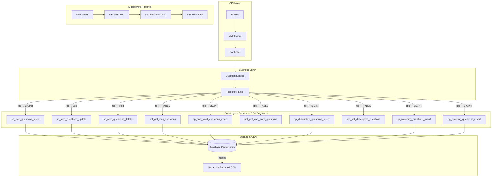

# GrowUpMore API — Phase 10: Question Bank Module

## Postman Testing Guide

**Base URL:** `http://localhost:5001`
**API Prefix:** `/api/v1/question-bank`
**Content-Type:** `application/json` (or `multipart/form-data` for image uploads)
**Authentication:** All endpoints require `Bearer <access_token>` in Authorization header

---

## Architecture Flow



---

## Common Headers (All Requests)

| Key | Value |
|-----|-------|
| Authorization | Bearer `<access_token>` |
| Content-Type | application/json (except multipart requests) |

---

## Complete Endpoint Reference

### Test Order (follow this sequence in Postman)

| # | Endpoint | Permission | Purpose |
|---|----------|-----------|---------|
| **MCQ Questions** |
| 1 | `POST /mcq-questions` | create:question | Create MCQ question |
| 2 | `POST /mcq-questions/:id/restore` | restore:question | Restore MCQ question |
| 3 | `GET /mcq-questions` | read:question | List MCQ questions with filters |
| 4 | `GET /mcq-questions/:id` | read:question | Get MCQ question by ID |
| 5 | `PATCH /mcq-questions/:id` | update:question | Update MCQ question |
| 6 | `DELETE /mcq-questions/:id` | delete:question | Soft delete MCQ question |
| **MCQ Options** |
| 7 | `POST /mcq-options` | create:question | Create MCQ option |
| 8 | `POST /mcq-options/:id/restore` | restore:question | Restore MCQ option |
| 9 | `PATCH /mcq-options/:id` | update:question | Update MCQ option |
| 10 | `DELETE /mcq-options/:id` | delete:question | Soft delete MCQ option |
| **MCQ Question Translations** |
| 11 | `POST /mcq-question-translations` | create:question | Create MCQ question translation (with images) |
| 12 | `POST /mcq-question-translations/:id/restore` | restore:question | Restore MCQ question translation |
| 13 | `PATCH /mcq-question-translations/:id` | update:question | Update MCQ question translation |
| 14 | `DELETE /mcq-question-translations/:id` | delete:question | Soft delete MCQ question translation |
| **MCQ Option Translations** |
| 15 | `POST /mcq-option-translations` | create:question | Create MCQ option translation (with image) |
| 16 | `POST /mcq-option-translations/:id/restore` | restore:question | Restore MCQ option translation |
| 17 | `PATCH /mcq-option-translations/:id` | update:question | Update MCQ option translation |
| 18 | `DELETE /mcq-option-translations/:id` | delete:question | Soft delete MCQ option translation |
| **One-Word Questions** |
| 19 | `POST /one-word-questions` | create:question | Create one-word question |
| 20 | `POST /one-word-questions/:id/restore` | restore:question | Restore one-word question |
| 21 | `GET /one-word-questions` | read:question | List one-word questions with filters |
| 22 | `GET /one-word-questions/:id` | read:question | Get one-word question by ID |
| 23 | `PATCH /one-word-questions/:id` | update:question | Update one-word question |
| 24 | `DELETE /one-word-questions/:id` | delete:question | Soft delete one-word question |
| **One-Word Question Translations** |
| 25 | `POST /one-word-question-translations` | create:question | Create one-word question translation (with images) |
| 26 | `POST /one-word-question-translations/:id/restore` | restore:question | Restore one-word question translation |
| 27 | `PATCH /one-word-question-translations/:id` | update:question | Update one-word question translation |
| 28 | `DELETE /one-word-question-translations/:id` | delete:question | Soft delete one-word question translation |
| **One-Word Synonyms** |
| 29 | `POST /one-word-synonyms` | create:question | Create one-word synonym |
| 30 | `POST /one-word-synonyms/:id/restore` | restore:question | Restore one-word synonym |
| 31 | `DELETE /one-word-synonyms/:id` | delete:question | Soft delete one-word synonym |
| **One-Word Synonym Translations** |
| 32 | `POST /one-word-synonym-translations` | create:question | Create one-word synonym translation |
| 33 | `POST /one-word-synonym-translations/:id/restore` | restore:question | Restore one-word synonym translation |
| 34 | `PATCH /one-word-synonym-translations/:id` | update:question | Update one-word synonym translation |
| 35 | `DELETE /one-word-synonym-translations/:id` | delete:question | Soft delete one-word synonym translation |
| **Descriptive Questions** |
| 36 | `POST /descriptive-questions` | create:question | Create descriptive question |
| 37 | `POST /descriptive-questions/:id/restore` | restore:question | Restore descriptive question |
| 38 | `GET /descriptive-questions` | read:question | List descriptive questions with filters |
| 39 | `GET /descriptive-questions/:id` | read:question | Get descriptive question by ID |
| 40 | `PATCH /descriptive-questions/:id` | update:question | Update descriptive question |
| 41 | `DELETE /descriptive-questions/:id` | delete:question | Soft delete descriptive question |
| **Descriptive Question Translations** |
| 42 | `POST /descriptive-question-translations` | create:question | Create descriptive question translation (with 6 images) |
| 43 | `POST /descriptive-question-translations/:id/restore` | restore:question | Restore descriptive question translation |
| 44 | `PATCH /descriptive-question-translations/:id` | update:question | Update descriptive question translation |
| 45 | `DELETE /descriptive-question-translations/:id` | delete:question | Soft delete descriptive question translation |
| **Matching Questions** |
| 46 | `POST /matching-questions` | create:question | Create matching question |
| 47 | `POST /matching-questions/:id/restore` | restore:question | Restore matching question |
| 48 | `GET /matching-questions` | read:question | List matching questions with filters |
| 49 | `GET /matching-questions/:id` | read:question | Get matching question by ID |
| 50 | `PATCH /matching-questions/:id` | update:question | Update matching question |
| 51 | `DELETE /matching-questions/:id` | delete:question | Soft delete matching question |
| **Matching Pairs** |
| 52 | `POST /matching-pairs` | create:question | Create matching pair |
| 53 | `POST /matching-pairs/:id/restore` | restore:question | Restore matching pair |
| 54 | `PATCH /matching-pairs/:id` | update:question | Update matching pair |
| 55 | `DELETE /matching-pairs/:id` | delete:question | Soft delete matching pair |
| **Ordering Questions** |
| 56 | `POST /ordering-questions` | create:question | Create ordering question |
| 57 | `POST /ordering-questions/:id/restore` | restore:question | Restore ordering question |
| 58 | `GET /ordering-questions` | read:question | List ordering questions with filters |
| 59 | `GET /ordering-questions/:id` | read:question | Get ordering question by ID |
| 60 | `PATCH /ordering-questions/:id` | update:question | Update ordering question |
| 61 | `DELETE /ordering-questions/:id` | delete:question | Soft delete ordering question |
| **Ordering Items** |
| 62 | `POST /ordering-items` | create:question | Create ordering item |
| 63 | `POST /ordering-items/:id/restore` | restore:question | Restore ordering item |
| 64 | `PATCH /ordering-items/:id` | update:question | Update ordering item |
| 65 | `DELETE /ordering-items/:id` | delete:question | Soft delete ordering item |

---

## 1. MCQ Questions — Create

```
POST http://localhost:5001/api/v1/question-bank/mcq-questions
```

**Headers:**

| Key | Value |
|-----|-------|
| Authorization | Bearer `<access_token>` |
| Content-Type | application/json |

**Request Body:**

| Field | Type | Required | Rules |
|-------|------|----------|-------|
| topicId | integer | Yes | Valid topic ID (Foreign Key) |
| mcqType | string | No | Enum: `single` (default), `multiple` |
| code | string | No | Unique question code, max 100 chars |
| points | number | No | Default: 1, min 0.5, max 100 |
| displayOrder | integer | No | Default: 0, min 0 |
| difficultyLevel | string | No | Enum: `easy`, `medium`, `hard` |
| isMandatory | boolean | No | Default: false |
| isActive | boolean | No | Default: true |

**Example Request:**

```json
{
  "topicId": 5,
  "mcqType": "single",
  "code": "MCQ_001_BASIC_BIOLOGY",
  "points": 2,
  "displayOrder": 1,
  "difficultyLevel": "medium",
  "isMandatory": true,
  "isActive": true
}
```

**Response — 201 Created:**

```json
{
  "success": true,
  "message": "MCQ question created successfully",
  "data": {
    "mcqQuestionId": 42,
    "topicId": 5,
    "mcqType": "single",
    "code": "MCQ_001_BASIC_BIOLOGY",
    "points": 2,
    "displayOrder": 1,
    "difficultyLevel": "medium",
    "isMandatory": true,
    "isActive": true,
    "createdAt": "2026-04-05T10:30:00.000Z",
    "updatedAt": "2026-04-05T10:30:00.000Z",
    "deletedAt": null
  }
}
```

**Notes:**
- `topicId` is required and must reference a valid topic
- `mcqType` determines if students can select one or multiple correct options
- Points are used for scoring in assessments
- Soft delete: `deletedAt` is null for active records

---

## 2. MCQ Questions — Restore

```
POST http://localhost:5001/api/v1/question-bank/mcq-questions/:id/restore
```

**Headers:**

| Key | Value |
|-----|-------|
| Authorization | Bearer `<access_token>` |
| Content-Type | application/json |

**Request Body:**

| Field | Type | Required | Default |
|-------|------|----------|---------|
| restoreTranslations | boolean | No | true |
| restoreOptions | boolean | No | true |

**Example Request:**

```json
{
  "restoreTranslations": true,
  "restoreOptions": true
}
```

**Response — 200 OK:**

```json
{
  "success": true,
  "message": "MCQ question restored successfully",
  "data": {
    "mcqQuestionId": 42,
    "topicId": 5,
    "mcqType": "single",
    "isActive": true,
    "deletedAt": null,
    "restoredAt": "2026-04-05T10:35:00.000Z"
  }
}
```

**Notes:**
- Restores soft-deleted MCQ question and optionally all related translations and options
- Set `restoreOptions: true` to restore all MCQ options that were deleted with the question

---

## 3. MCQ Questions — List with Filters

```
GET http://localhost:5001/api/v1/question-bank/mcq-questions
```

**Headers:**

| Key | Value |
|-----|-------|
| Authorization | Bearer `<access_token>` |
| Content-Type | application/json |

**Query Parameters:**

| Parameter | Type | Default | Rules |
|-----------|------|---------|-------|
| page | integer | 1 | Min 1 |
| limit | integer | 20 | Min 1, max 100 |
| search | string | - | Searches in question text and code |
| sortBy | string | created_at | Options: `question_text`, `created_at`, `points`, `displayOrder` |
| sortDir | string | desc | Options: `asc`, `desc` |
| topicId | integer | - | Filter by topic |
| mcqType | string | - | Options: `single`, `multiple` |
| difficultyLevel | string | - | Options: `easy`, `medium`, `hard` |
| isMandatory | boolean | - | Filter by mandatory status |
| languageId | integer | - | Filter by language (English translations only) |
| isActive | boolean | true | Filter by active status |
| searchFields | string | - | Comma-separated: `question_text`, `code` |

**Example Request:**

```
GET http://localhost:5001/api/v1/question-bank/mcq-questions?page=1&limit=20&topicId=5&mcqType=single&difficultyLevel=medium&sortBy=question_text&sortDir=asc
```

**Response — 200 OK:**

```json
{
  "success": true,
  "message": "MCQ questions retrieved successfully",
  "data": [
    {
      "mcqQuestionId": 42,
      "topicId": 5,
      "mcqType": "single",
      "code": "MCQ_001_BASIC_BIOLOGY",
      "points": 2,
      "displayOrder": 1,
      "difficultyLevel": "medium",
      "isMandatory": true,
      "isActive": true,
      "translationCount": 3,
      "optionCount": 4,
      "createdAt": "2026-04-05T10:30:00.000Z"
    }
  ],
  "meta": {
    "page": 1,
    "limit": 20,
    "totalCount": 5,
    "totalPages": 1
  }
}
```

**Notes:**
- `translationCount`: Number of language translations available
- `optionCount`: Number of answer options for this MCQ
- Pagination is applied automatically

---

## 4. MCQ Questions — Get by ID

```
GET http://localhost:5001/api/v1/question-bank/mcq-questions/:id
```

**Headers:**

| Key | Value |
|-----|-------|
| Authorization | Bearer `<access_token>` |
| Content-Type | application/json |

**Example Request:**

```
GET http://localhost:5001/api/v1/question-bank/mcq-questions/42
```

**Response — 200 OK:**

```json
{
  "success": true,
  "message": "MCQ question retrieved successfully",
  "data": {
    "mcqQuestionId": 42,
    "topicId": 5,
    "mcqType": "single",
    "code": "MCQ_001_BASIC_BIOLOGY",
    "points": 2,
    "displayOrder": 1,
    "difficultyLevel": "medium",
    "isMandatory": true,
    "isActive": true,
    "translations": [
      {
        "mcqQuestionTranslationId": 101,
        "languageId": 1,
        "languageName": "English",
        "questionText": "What is photosynthesis?",
        "explanation": "The process by which plants convert light energy...",
        "hint": "Think about green leaves and sunlight",
        "image1": "https://cdn.growupmore.com/questions/mcq_42_img1.jpg",
        "image2": null,
        "isActive": true
      }
    ],
    "options": [
      {
        "mcqOptionId": 201,
        "isCorrect": true,
        "displayOrder": 1,
        "translations": [
          {
            "mcqOptionTranslationId": 301,
            "languageId": 1,
            "optionText": "Conversion of light energy to chemical energy",
            "image": null
          }
        ]
      }
    ]
  }
}
```

**Notes:**
- Returns full nested structure with all translations and options
- Includes images with full CDN URLs

---

## 5. MCQ Questions — Update

```
PATCH http://localhost:5001/api/v1/question-bank/mcq-questions/:id
```

**Headers:**

| Key | Value |
|-----|-------|
| Authorization | Bearer `<access_token>` |
| Content-Type | application/json |

**Request Body (all fields optional):**

```json
{
  "mcqType": "multiple",
  "points": 3,
  "difficultyLevel": "hard",
  "displayOrder": 2,
  "isActive": false
}
```

**Response — 200 OK:**

```json
{
  "success": true,
  "message": "MCQ question updated successfully",
  "data": {
    "mcqQuestionId": 42,
    "mcqType": "multiple",
    "points": 3,
    "difficultyLevel": "hard",
    "displayOrder": 2,
    "isActive": false,
    "updatedAt": "2026-04-05T10:40:00.000Z"
  }
}
```

---

## 6. MCQ Questions — Delete (Soft Delete)

```
DELETE http://localhost:5001/api/v1/question-bank/mcq-questions/:id
```

**Headers:**

| Key | Value |
|-----|-------|
| Authorization | Bearer `<access_token>` |
| Content-Type | application/json |

**Example Request:**

```
DELETE http://localhost:5001/api/v1/question-bank/mcq-questions/42
```

**Response — 200 OK:**

```json
{
  "success": true,
  "message": "MCQ question deleted successfully",
  "data": {
    "mcqQuestionId": 42,
    "deletedAt": "2026-04-05T10:45:00.000Z",
    "deletedCount": 1,
    "cascadeDeleted": {
      "translations": 3,
      "options": 4,
      "optionTranslations": 12
    }
  }
}
```

**Notes:**
- Soft delete: Record marked with `deletedAt` timestamp
- Cascade delete: All related translations and options also soft-deleted
- Can be restored using `/restore` endpoint

---

## 7. MCQ Options — Create

```
POST http://localhost:5001/api/v1/question-bank/mcq-options
```

**Headers:**

| Key | Value |
|-----|-------|
| Authorization | Bearer `<access_token>` |
| Content-Type | application/json |

**Request Body:**

| Field | Type | Required | Rules |
|-------|------|----------|-------|
| mcqQuestionId | integer | Yes | Valid MCQ question ID |
| isCorrect | boolean | No | Default: false |
| displayOrder | integer | No | Default: 0 |
| isActive | boolean | No | Default: true |

**Example Request:**

```json
{
  "mcqQuestionId": 42,
  "isCorrect": true,
  "displayOrder": 1,
  "isActive": true
}
```

**Response — 201 Created:**

```json
{
  "success": true,
  "message": "MCQ option created successfully",
  "data": {
    "mcqOptionId": 201,
    "mcqQuestionId": 42,
    "isCorrect": true,
    "displayOrder": 1,
    "isActive": true,
    "createdAt": "2026-04-05T10:30:00.000Z"
  }
}
```

**Notes:**
- At least one option must have `isCorrect: true` per question
- `displayOrder` determines the visual sequence in UI

---

## 8. MCQ Options — Restore

```
POST http://localhost:5001/api/v1/question-bank/mcq-options/:id/restore
```

**Headers:**

| Key | Value |
|-----|-------|
| Authorization | Bearer `<access_token>` |
| Content-Type | application/json |

**Request Body:**

```json
{
  "restoreTranslations": true
}
```

**Response — 200 OK:**

```json
{
  "success": true,
  "message": "MCQ option restored successfully",
  "data": {
    "mcqOptionId": 201,
    "deletedAt": null,
    "restoredAt": "2026-04-05T10:35:00.000Z"
  }
}
```

---

## 9. MCQ Options — Update

```
PATCH http://localhost:5001/api/v1/question-bank/mcq-options/:id
```

**Headers:**

| Key | Value |
|-----|-------|
| Authorization | Bearer `<access_token>` |
| Content-Type | application/json |

**Request Body (all fields optional):**

```json
{
  "isCorrect": true,
  "displayOrder": 2
}
```

**Response — 200 OK:**

```json
{
  "success": true,
  "message": "MCQ option updated successfully",
  "data": {
    "mcqOptionId": 201,
    "isCorrect": true,
    "displayOrder": 2,
    "updatedAt": "2026-04-05T10:40:00.000Z"
  }
}
```

---

## 10. MCQ Options — Delete (Soft Delete)

```
DELETE http://localhost:5001/api/v1/question-bank/mcq-options/:id
```

**Headers:**

| Key | Value |
|-----|-------|
| Authorization | Bearer `<access_token>` |
| Content-Type | application/json |

**Response — 200 OK:**

```json
{
  "success": true,
  "message": "MCQ option deleted successfully",
  "data": {
    "mcqOptionId": 201,
    "deletedAt": "2026-04-05T10:45:00.000Z",
    "cascadeDeleted": {
      "translations": 3
    }
  }
}
```

---

## 11. MCQ Question Translations — Create (with Images)

```
POST http://localhost:5001/api/v1/question-bank/mcq-question-translations
```

**Headers:**

| Key | Value |
|-----|-------|
| Authorization | Bearer `<access_token>` |
| Content-Type | multipart/form-data |

**Form Fields:**

| Field | Type | Required | Rules |
|-------|------|----------|-------|
| mcqQuestionId | integer | Yes | Valid MCQ question ID |
| languageId | integer | Yes | Valid language ID |
| questionText | string | Yes | Max 1000 chars |
| explanation | string | No | Max 2000 chars |
| hint | string | No | Max 500 chars |
| isActive | boolean | No | Default: true |
| image1 | file | No | JPG, PNG, max 2MB |
| image2 | file | No | JPG, PNG, max 2MB |

**Example Request (using form-data):**

```
POST http://localhost:5001/api/v1/question-bank/mcq-question-translations

Form Data:
- mcqQuestionId: 42
- languageId: 1
- questionText: "What is photosynthesis?"
- explanation: "The process by which plants convert light energy into chemical energy..."
- hint: "Think about green leaves and sunlight"
- isActive: true
- image1: [file: photosynthesis.jpg]
- image2: [file: chloroplast.jpg]
```

**Response — 201 Created:**

```json
{
  "success": true,
  "message": "MCQ question translation created successfully",
  "data": {
    "mcqQuestionTranslationId": 101,
    "mcqQuestionId": 42,
    "languageId": 1,
    "languageName": "English",
    "questionText": "What is photosynthesis?",
    "explanation": "The process by which plants convert light energy into chemical energy...",
    "hint": "Think about green leaves and sunlight",
    "image1": "https://cdn.growupmore.com/questions/mcq_42_img1_20260405_a1b2c3.jpg",
    "image2": "https://cdn.growupmore.com/questions/mcq_42_img2_20260405_d4e5f6.jpg",
    "isActive": true,
    "createdAt": "2026-04-05T10:30:00.000Z"
  }
}
```

**Notes:**
- Images are uploaded to Supabase Storage and served via CDN
- Image URLs are permanent and unique
- `languageId` = 1 is typically English; verify with master data
- Only one translation per language per question
- Both images optional; can upload one or both

---

## 12. MCQ Question Translations — Restore

```
POST http://localhost:5001/api/v1/question-bank/mcq-question-translations/:id/restore
```

**Headers:**

| Key | Value |
|-----|-------|
| Authorization | Bearer `<access_token>` |
| Content-Type | application/json |

**Request Body:**

```json
{}
```

**Response — 200 OK:**

```json
{
  "success": true,
  "message": "MCQ question translation restored successfully",
  "data": {
    "mcqQuestionTranslationId": 101,
    "deletedAt": null,
    "restoredAt": "2026-04-05T10:35:00.000Z"
  }
}
```

---

## 13. MCQ Question Translations — Update

```
PATCH http://localhost:5001/api/v1/question-bank/mcq-question-translations/:id
```

**Headers:**

| Key | Value |
|-----|-------|
| Authorization | Bearer `<access_token>` |
| Content-Type | multipart/form-data |

**Form Fields (all optional):**

| Field | Type | Rules |
|-------|------|-------|
| questionText | string | Max 1000 chars |
| explanation | string | Max 2000 chars |
| hint | string | Max 500 chars |
| isActive | boolean | - |
| image1 | file | JPG, PNG, max 2MB |
| image2 | file | JPG, PNG, max 2MB |
| allowClearImage1 | boolean | Set true to delete image1 |
| allowClearImage2 | boolean | Set true to delete image2 |
| allowClearExplanation | boolean | Set true to clear explanation |
| allowClearHint | boolean | Set true to clear hint |

**Example Request:**

```
PATCH http://localhost:5001/api/v1/question-bank/mcq-question-translations/101

Form Data:
- questionText: "What is photosynthesis? (UPDATED)"
- explanation: "Updated explanation..."
- image1: [file: new_photosynthesis.jpg]
- allowClearImage2: true
```

**Response — 200 OK:**

```json
{
  "success": true,
  "message": "MCQ question translation updated successfully",
  "data": {
    "mcqQuestionTranslationId": 101,
    "questionText": "What is photosynthesis? (UPDATED)",
    "explanation": "Updated explanation...",
    "image1": "https://cdn.growupmore.com/questions/mcq_42_img1_20260405_x9y8z7.jpg",
    "image2": null,
    "updatedAt": "2026-04-05T10:40:00.000Z"
  }
}
```

**Notes:**
- To remove an image, use `allowClearImage1` or `allowClearImage2`
- To remove explanation, use `allowClearExplanation`
- Images are replaced, not appended

---

## 14. MCQ Question Translations — Delete (Soft Delete)

```
DELETE http://localhost:5001/api/v1/question-bank/mcq-question-translations/:id
```

**Headers:**

| Key | Value |
|-----|-------|
| Authorization | Bearer `<access_token>` |
| Content-Type | application/json |

**Response — 200 OK:**

```json
{
  "success": true,
  "message": "MCQ question translation deleted successfully",
  "data": {
    "mcqQuestionTranslationId": 101,
    "deletedAt": "2026-04-05T10:45:00.000Z"
  }
}
```

---

## 15. MCQ Option Translations — Create (with Image)

```
POST http://localhost:5001/api/v1/question-bank/mcq-option-translations
```

**Headers:**

| Key | Value |
|-----|-------|
| Authorization | Bearer `<access_token>` |
| Content-Type | multipart/form-data |

**Form Fields:**

| Field | Type | Required | Rules |
|-------|------|----------|-------|
| mcqOptionId | integer | Yes | Valid MCQ option ID |
| languageId | integer | Yes | Valid language ID |
| optionText | string | Yes | Max 500 chars |
| isActive | boolean | No | Default: true |
| image | file | No | JPG, PNG, max 2MB |

**Example Request:**

```
POST http://localhost:5001/api/v1/question-bank/mcq-option-translations

Form Data:
- mcqOptionId: 201
- languageId: 1
- optionText: "Conversion of light energy to chemical energy"
- isActive: true
- image: [file: option_image.jpg]
```

**Response — 201 Created:**

```json
{
  "success": true,
  "message": "MCQ option translation created successfully",
  "data": {
    "mcqOptionTranslationId": 301,
    "mcqOptionId": 201,
    "languageId": 1,
    "languageName": "English",
    "optionText": "Conversion of light energy to chemical energy",
    "image": "https://cdn.growupmore.com/options/mcq_opt_201_img_20260405_m1n2o3.jpg",
    "isActive": true,
    "createdAt": "2026-04-05T10:30:00.000Z"
  }
}
```

**Notes:**
- One translation per language per option
- Image is optional; can be null if not required

---

## 16. MCQ Option Translations — Restore

```
POST http://localhost:5001/api/v1/question-bank/mcq-option-translations/:id/restore
```

**Headers:**

| Key | Value |
|-----|-------|
| Authorization | Bearer `<access_token>` |
| Content-Type | application/json |

**Request Body:**

```json
{}
```

**Response — 200 OK:**

```json
{
  "success": true,
  "message": "MCQ option translation restored successfully",
  "data": {
    "mcqOptionTranslationId": 301,
    "deletedAt": null,
    "restoredAt": "2026-04-05T10:35:00.000Z"
  }
}
```

---

## 17. MCQ Option Translations — Update

```
PATCH http://localhost:5001/api/v1/question-bank/mcq-option-translations/:id
```

**Headers:**

| Key | Value |
|-----|-------|
| Authorization | Bearer `<access_token>` |
| Content-Type | multipart/form-data |

**Form Fields (all optional):**

```
- optionText: string (max 500 chars)
- isActive: boolean
- image: file (JPG, PNG, max 2MB)
- allowClearImage: boolean (set true to delete image)
```

**Response — 200 OK:**

```json
{
  "success": true,
  "message": "MCQ option translation updated successfully",
  "data": {
    "mcqOptionTranslationId": 301,
    "optionText": "Updated option text",
    "image": null,
    "updatedAt": "2026-04-05T10:40:00.000Z"
  }
}
```

---

## 18. MCQ Option Translations — Delete (Soft Delete)

```
DELETE http://localhost:5001/api/v1/question-bank/mcq-option-translations/:id
```

**Headers:**

| Key | Value |
|-----|-------|
| Authorization | Bearer `<access_token>` |
| Content-Type | application/json |

**Response — 200 OK:**

```json
{
  "success": true,
  "message": "MCQ option translation deleted successfully",
  "data": {
    "mcqOptionTranslationId": 301,
    "deletedAt": "2026-04-05T10:45:00.000Z"
  }
}
```

---

## 19. One-Word Questions — Create

```
POST http://localhost:5001/api/v1/question-bank/one-word-questions
```

**Headers:**

| Key | Value |
|-----|-------|
| Authorization | Bearer `<access_token>` |
| Content-Type | application/json |

**Request Body:**

| Field | Type | Required | Rules |
|-------|------|----------|-------|
| topicId | integer | Yes | Valid topic ID |
| questionType | string | No | Enum: `one_word` (default), `number`, `date` |
| code | string | No | Unique code, max 100 chars |
| points | number | No | Default: 1, min 0.5, max 100 |
| isCaseSensitive | boolean | No | Default: false |
| isTrimWhitespace | boolean | No | Default: true |
| displayOrder | integer | No | Default: 0 |
| difficultyLevel | string | No | Enum: `easy`, `medium`, `hard` |
| isMandatory | boolean | No | Default: false |
| isActive | boolean | No | Default: true |

**Example Request:**

```json
{
  "topicId": 5,
  "questionType": "one_word",
  "code": "OW_001_CAPITAL",
  "points": 1,
  "isCaseSensitive": false,
  "isTrimWhitespace": true,
  "displayOrder": 1,
  "difficultyLevel": "easy",
  "isMandatory": false,
  "isActive": true
}
```

**Response — 201 Created:**

```json
{
  "success": true,
  "message": "One-word question created successfully",
  "data": {
    "oneWordQuestionId": 51,
    "topicId": 5,
    "questionType": "one_word",
    "code": "OW_001_CAPITAL",
    "points": 1,
    "isCaseSensitive": false,
    "isTrimWhitespace": true,
    "displayOrder": 1,
    "difficultyLevel": "easy",
    "isMandatory": false,
    "isActive": true,
    "createdAt": "2026-04-05T10:30:00.000Z"
  }
}
```

**Notes:**
- `questionType: number` expects numeric answers (e.g., "42")
- `questionType: date` expects date format answers
- `isCaseSensitive`: If true, "Paris" != "paris"
- `isTrimWhitespace`: If true, "Paris " == "Paris"

---

## 20. One-Word Questions — Restore

```
POST http://localhost:5001/api/v1/question-bank/one-word-questions/:id/restore
```

**Headers:**

| Key | Value |
|-----|-------|
| Authorization | Bearer `<access_token>` |
| Content-Type | application/json |

**Request Body:**

```json
{
  "restoreTranslations": true,
  "restoreSynonyms": true
}
```

**Response — 200 OK:**

```json
{
  "success": true,
  "message": "One-word question restored successfully",
  "data": {
    "oneWordQuestionId": 51,
    "deletedAt": null,
    "restoredAt": "2026-04-05T10:35:00.000Z"
  }
}
```

---

## 21. One-Word Questions — List with Filters

```
GET http://localhost:5001/api/v1/question-bank/one-word-questions
```

**Headers:**

| Key | Value |
|-----|-------|
| Authorization | Bearer `<access_token>` |
| Content-Type | application/json |

**Query Parameters:**

| Parameter | Type | Default | Rules |
|-----------|------|---------|-------|
| page | integer | 1 | Min 1 |
| limit | integer | 25 | Min 1, max 100 |
| search | string | - | Searches in question text and code |
| sortBy | string | created_at | Options: `question_text`, `created_at` |
| sortDir | string | desc | Options: `asc`, `desc` |
| topicId | integer | - | Filter by topic |
| questionType | string | - | Options: `one_word`, `number`, `date` |
| difficultyLevel | string | - | Options: `easy`, `medium`, `hard` |
| isMandatory | boolean | - | Filter by mandatory status |
| isCaseSensitive | boolean | - | Filter by case sensitivity |
| languageId | integer | - | Filter by language |
| isActive | boolean | true | Filter by active status |
| searchFields | string | - | Comma-separated: `question_text`, `code` |

**Example Request:**

```
GET http://localhost:5001/api/v1/question-bank/one-word-questions?page=1&limit=25&topicId=5&questionType=one_word&difficultyLevel=easy
```

**Response — 200 OK:**

```json
{
  "success": true,
  "message": "One-word questions retrieved successfully",
  "data": [
    {
      "oneWordQuestionId": 51,
      "topicId": 5,
      "questionType": "one_word",
      "code": "OW_001_CAPITAL",
      "points": 1,
      "displayOrder": 1,
      "difficultyLevel": "easy",
      "isCaseSensitive": false,
      "translationCount": 2,
      "synonymCount": 3,
      "createdAt": "2026-04-05T10:30:00.000Z"
    }
  ],
  "meta": {
    "page": 1,
    "limit": 25,
    "totalCount": 12,
    "totalPages": 1
  }
}
```

---

## 22. One-Word Questions — Get by ID

```
GET http://localhost:5001/api/v1/question-bank/one-word-questions/:id
```

**Headers:**

| Key | Value |
|-----|-------|
| Authorization | Bearer `<access_token>` |
| Content-Type | application/json |

**Response — 200 OK:**

```json
{
  "success": true,
  "message": "One-word question retrieved successfully",
  "data": {
    "oneWordQuestionId": 51,
    "topicId": 5,
    "questionType": "one_word",
    "code": "OW_001_CAPITAL",
    "points": 1,
    "isCaseSensitive": false,
    "isTrimWhitespace": true,
    "difficultyLevel": "easy",
    "translations": [
      {
        "oneWordQuestionTranslationId": 111,
        "languageId": 1,
        "languageName": "English",
        "questionText": "What is the capital of France?",
        "correctAnswer": "Paris",
        "explanation": "Paris is the capital city of France...",
        "hint": "Think of the City of Light",
        "image1": "https://cdn.growupmore.com/questions/ow_51_img1.jpg",
        "image2": null,
        "isActive": true
      }
    ],
    "synonyms": [
      {
        "oneWordSynonymId": 601,
        "displayOrder": 1,
        "translations": [
          {
            "oneWordSynonymTranslationId": 701,
            "languageId": 1,
            "synonymText": "Lutetia"
          }
        ]
      }
    ]
  }
}
```

**Notes:**
- Returns all translations and synonyms for the question
- Synonyms are alternate correct answers

---

## 23. One-Word Questions — Update

```
PATCH http://localhost:5001/api/v1/question-bank/one-word-questions/:id
```

**Headers:**

| Key | Value |
|-----|-------|
| Authorization | Bearer `<access_token>` |
| Content-Type | application/json |

**Request Body (all fields optional):**

```json
{
  "isCaseSensitive": true,
  "points": 2,
  "difficultyLevel": "medium"
}
```

**Response — 200 OK:**

```json
{
  "success": true,
  "message": "One-word question updated successfully",
  "data": {
    "oneWordQuestionId": 51,
    "isCaseSensitive": true,
    "points": 2,
    "difficultyLevel": "medium",
    "updatedAt": "2026-04-05T10:40:00.000Z"
  }
}
```

---

## 24. One-Word Questions — Delete (Soft Delete)

```
DELETE http://localhost:5001/api/v1/question-bank/one-word-questions/:id
```

**Headers:**

| Key | Value |
|-----|-------|
| Authorization | Bearer `<access_token>` |
| Content-Type | application/json |

**Response — 200 OK:**

```json
{
  "success": true,
  "message": "One-word question deleted successfully",
  "data": {
    "oneWordQuestionId": 51,
    "deletedAt": "2026-04-05T10:45:00.000Z",
    "cascadeDeleted": {
      "translations": 2,
      "synonyms": 3,
      "synonymTranslations": 6
    }
  }
}
```

---

## 25. One-Word Question Translations — Create (with Images)

```
POST http://localhost:5001/api/v1/question-bank/one-word-question-translations
```

**Headers:**

| Key | Value |
|-----|-------|
| Authorization | Bearer `<access_token>` |
| Content-Type | multipart/form-data |

**Form Fields:**

| Field | Type | Required | Rules |
|-------|------|----------|-------|
| oneWordQuestionId | integer | Yes | Valid one-word question ID |
| languageId | integer | Yes | Valid language ID |
| questionText | string | Yes | Max 500 chars |
| correctAnswer | string | Yes | Max 200 chars |
| explanation | string | No | Max 2000 chars |
| hint | string | No | Max 500 chars |
| isActive | boolean | No | Default: true |
| image1 | file | No | JPG, PNG, max 2MB |
| image2 | file | No | JPG, PNG, max 2MB |

**Example Request:**

```
POST http://localhost:5001/api/v1/question-bank/one-word-question-translations

Form Data:
- oneWordQuestionId: 51
- languageId: 1
- questionText: "What is the capital of France?"
- correctAnswer: "Paris"
- explanation: "Paris has been the capital since..."
- hint: "City of Light"
- isActive: true
- image1: [file: paris.jpg]
```

**Response — 201 Created:**

```json
{
  "success": true,
  "message": "One-word question translation created successfully",
  "data": {
    "oneWordQuestionTranslationId": 111,
    "oneWordQuestionId": 51,
    "languageId": 1,
    "languageName": "English",
    "questionText": "What is the capital of France?",
    "correctAnswer": "Paris",
    "explanation": "Paris has been the capital since...",
    "hint": "City of Light",
    "image1": "https://cdn.growupmore.com/questions/ow_51_img1_20260405_p1q2r3.jpg",
    "image2": null,
    "isActive": true,
    "createdAt": "2026-04-05T10:30:00.000Z"
  }
}
```

**Notes:**
- `correctAnswer` is case-insensitive by default (unless question specifies)
- Synonyms are checked in addition to `correctAnswer`
- Both images optional

---

## 26. One-Word Question Translations — Restore

```
POST http://localhost:5001/api/v1/question-bank/one-word-question-translations/:id/restore
```

**Headers:**

| Key | Value |
|-----|-------|
| Authorization | Bearer `<access_token>` |
| Content-Type | application/json |

**Request Body:**

```json
{}
```

**Response — 200 OK:**

```json
{
  "success": true,
  "message": "One-word question translation restored successfully",
  "data": {
    "oneWordQuestionTranslationId": 111,
    "deletedAt": null,
    "restoredAt": "2026-04-05T10:35:00.000Z"
  }
}
```

---

## 27. One-Word Question Translations — Update

```
PATCH http://localhost:5001/api/v1/question-bank/one-word-question-translations/:id
```

**Headers:**

| Key | Value |
|-----|-------|
| Authorization | Bearer `<access_token>` |
| Content-Type | multipart/form-data |

**Form Fields (all optional):**

```
- questionText: string (max 500 chars)
- correctAnswer: string (max 200 chars)
- explanation: string (max 2000 chars)
- hint: string (max 500 chars)
- isActive: boolean
- image1: file (JPG, PNG, max 2MB)
- image2: file (JPG, PNG, max 2MB)
- allowClearImage1: boolean (set true to delete image1)
- allowClearImage2: boolean (set true to delete image2)
- allowClearExplanation: boolean (set true to clear explanation)
- allowClearHint: boolean (set true to clear hint)
```

**Response — 200 OK:**

```json
{
  "success": true,
  "message": "One-word question translation updated successfully",
  "data": {
    "oneWordQuestionTranslationId": 111,
    "questionText": "What is the capital of France? (UPDATED)",
    "correctAnswer": "Paris",
    "updatedAt": "2026-04-05T10:40:00.000Z"
  }
}
```

---

## 28. One-Word Question Translations — Delete (Soft Delete)

```
DELETE http://localhost:5001/api/v1/question-bank/one-word-question-translations/:id
```

**Headers:**

| Key | Value |
|-----|-------|
| Authorization | Bearer `<access_token>` |
| Content-Type | application/json |

**Response — 200 OK:**

```json
{
  "success": true,
  "message": "One-word question translation deleted successfully",
  "data": {
    "oneWordQuestionTranslationId": 111,
    "deletedAt": "2026-04-05T10:45:00.000Z"
  }
}
```

---

## 29. One-Word Synonyms — Create

```
POST http://localhost:5001/api/v1/question-bank/one-word-synonyms
```

**Headers:**

| Key | Value |
|-----|-------|
| Authorization | Bearer `<access_token>` |
| Content-Type | application/json |

**Request Body:**

| Field | Type | Required | Rules |
|-------|------|----------|-------|
| oneWordQuestionId | integer | Yes | Valid one-word question ID |
| displayOrder | integer | No | Default: 0 |
| isActive | boolean | No | Default: true |

**Example Request:**

```json
{
  "oneWordQuestionId": 51,
  "displayOrder": 1,
  "isActive": true
}
```

**Response — 201 Created:**

```json
{
  "success": true,
  "message": "One-word synonym created successfully",
  "data": {
    "oneWordSynonymId": 601,
    "oneWordQuestionId": 51,
    "displayOrder": 1,
    "isActive": true,
    "createdAt": "2026-04-05T10:30:00.000Z"
  }
}
```

**Notes:**
- Synonyms are alternate correct answers
- Must be translated for each language
- `displayOrder` for UI sequencing (typically not shown to students)

---

## 30. One-Word Synonyms — Restore

```
POST http://localhost:5001/api/v1/question-bank/one-word-synonyms/:id/restore
```

**Headers:**

| Key | Value |
|-----|-------|
| Authorization | Bearer `<access_token>` |
| Content-Type | application/json |

**Request Body:**

```json
{
  "restoreTranslations": true
}
```

**Response — 200 OK:**

```json
{
  "success": true,
  "message": "One-word synonym restored successfully",
  "data": {
    "oneWordSynonymId": 601,
    "deletedAt": null,
    "restoredAt": "2026-04-05T10:35:00.000Z"
  }
}
```

---

## 31. One-Word Synonyms — Delete (Soft Delete)

```
DELETE http://localhost:5001/api/v1/question-bank/one-word-synonyms/:id
```

**Headers:**

| Key | Value |
|-----|-------|
| Authorization | Bearer `<access_token>` |
| Content-Type | application/json |

**Response — 200 OK:**

```json
{
  "success": true,
  "message": "One-word synonym deleted successfully",
  "data": {
    "oneWordSynonymId": 601,
    "deletedAt": "2026-04-05T10:45:00.000Z",
    "cascadeDeleted": {
      "translations": 2
    }
  }
}
```

---

## 32. One-Word Synonym Translations — Create

```
POST http://localhost:5001/api/v1/question-bank/one-word-synonym-translations
```

**Headers:**

| Key | Value |
|-----|-------|
| Authorization | Bearer `<access_token>` |
| Content-Type | application/json |

**Request Body:**

| Field | Type | Required | Rules |
|-------|------|----------|-------|
| oneWordSynonymId | integer | Yes | Valid synonym ID |
| languageId | integer | Yes | Valid language ID |
| synonymText | string | Yes | Max 200 chars |
| isActive | boolean | No | Default: true |

**Example Request:**

```json
{
  "oneWordSynonymId": 601,
  "languageId": 1,
  "synonymText": "Lutetia",
  "isActive": true
}
```

**Response — 201 Created:**

```json
{
  "success": true,
  "message": "One-word synonym translation created successfully",
  "data": {
    "oneWordSynonymTranslationId": 701,
    "oneWordSynonymId": 601,
    "languageId": 1,
    "languageName": "English",
    "synonymText": "Lutetia",
    "isActive": true,
    "createdAt": "2026-04-05T10:30:00.000Z"
  }
}
```

**Notes:**
- One translation per language per synonym
- Synonym text follows same case-sensitivity rules as question

---

## 33. One-Word Synonym Translations — Restore

```
POST http://localhost:5001/api/v1/question-bank/one-word-synonym-translations/:id/restore
```

**Headers:**

| Key | Value |
|-----|-------|
| Authorization | Bearer `<access_token>` |
| Content-Type | application/json |

**Request Body:**

```json
{}
```

**Response — 200 OK:**

```json
{
  "success": true,
  "message": "One-word synonym translation restored successfully",
  "data": {
    "oneWordSynonymTranslationId": 701,
    "deletedAt": null,
    "restoredAt": "2026-04-05T10:35:00.000Z"
  }
}
```

---

## 34. One-Word Synonym Translations — Update

```
PATCH http://localhost:5001/api/v1/question-bank/one-word-synonym-translations/:id
```

**Headers:**

| Key | Value |
|-----|-------|
| Authorization | Bearer `<access_token>` |
| Content-Type | application/json |

**Request Body (all fields optional):**

```json
{
  "synonymText": "Lutetia Parisiorum",
  "isActive": false
}
```

**Response — 200 OK:**

```json
{
  "success": true,
  "message": "One-word synonym translation updated successfully",
  "data": {
    "oneWordSynonymTranslationId": 701,
    "synonymText": "Lutetia Parisiorum",
    "isActive": false,
    "updatedAt": "2026-04-05T10:40:00.000Z"
  }
}
```

---

## 35. One-Word Synonym Translations — Delete (Soft Delete)

```
DELETE http://localhost:5001/api/v1/question-bank/one-word-synonym-translations/:id
```

**Headers:**

| Key | Value |
|-----|-------|
| Authorization | Bearer `<access_token>` |
| Content-Type | application/json |

**Response — 200 OK:**

```json
{
  "success": true,
  "message": "One-word synonym translation deleted successfully",
  "data": {
    "oneWordSynonymTranslationId": 701,
    "deletedAt": "2026-04-05T10:45:00.000Z"
  }
}
```

---

## 36. Descriptive Questions — Create

```
POST http://localhost:5001/api/v1/question-bank/descriptive-questions
```

**Headers:**

| Key | Value |
|-----|-------|
| Authorization | Bearer `<access_token>` |
| Content-Type | application/json |

**Request Body:**

| Field | Type | Required | Rules |
|-------|------|----------|-------|
| topicId | integer | Yes | Valid topic ID |
| answerType | string | No | Enum: `short_answer` (default), `long_answer`, `essay` |
| code | string | No | Unique code, max 100 chars |
| points | number | No | Default: 5, min 1, max 100 |
| minWords | integer | No | Min answer length (0-1000) |
| maxWords | integer | No | Max answer length (minWords-5000) |
| displayOrder | integer | No | Default: 0 |
| difficultyLevel | string | No | Enum: `easy`, `medium`, `hard` |
| isMandatory | boolean | No | Default: false |
| isActive | boolean | No | Default: true |

**Example Request:**

```json
{
  "topicId": 5,
  "answerType": "short_answer",
  "code": "DESC_001_PHOTOSYNTHESIS",
  "points": 5,
  "minWords": 50,
  "maxWords": 150,
  "displayOrder": 1,
  "difficultyLevel": "medium",
  "isMandatory": true,
  "isActive": true
}
```

**Response — 201 Created:**

```json
{
  "success": true,
  "message": "Descriptive question created successfully",
  "data": {
    "descriptiveQuestionId": 71,
    "topicId": 5,
    "answerType": "short_answer",
    "code": "DESC_001_PHOTOSYNTHESIS",
    "points": 5,
    "minWords": 50,
    "maxWords": 150,
    "displayOrder": 1,
    "difficultyLevel": "medium",
    "isMandatory": true,
    "isActive": true,
    "createdAt": "2026-04-05T10:30:00.000Z"
  }
}
```

**Notes:**
- `answerType` affects grading UI and expectations
- `minWords` and `maxWords` validate student answers
- Points typically higher for descriptive questions (5-25 range)

---

## 37. Descriptive Questions — Restore

```
POST http://localhost:5001/api/v1/question-bank/descriptive-questions/:id/restore
```

**Headers:**

| Key | Value |
|-----|-------|
| Authorization | Bearer `<access_token>` |
| Content-Type | application/json |

**Request Body:**

```json
{
  "restoreTranslations": true
}
```

**Response — 200 OK:**

```json
{
  "success": true,
  "message": "Descriptive question restored successfully",
  "data": {
    "descriptiveQuestionId": 71,
    "deletedAt": null,
    "restoredAt": "2026-04-05T10:35:00.000Z"
  }
}
```

---

## 38. Descriptive Questions — List with Filters

```
GET http://localhost:5001/api/v1/question-bank/descriptive-questions
```

**Headers:**

| Key | Value |
|-----|-------|
| Authorization | Bearer `<access_token>` |
| Content-Type | application/json |

**Query Parameters:**

| Parameter | Type | Default | Rules |
|-----------|------|---------|-------|
| page | integer | 1 | Min 1 |
| limit | integer | 50 | Min 1, max 100 |
| search | string | - | Searches in question text and code |
| sortBy | string | dq_display_order | Options: `created_at`, `dq_display_order` |
| sortDir | string | asc | Options: `asc`, `desc` |
| topicId | integer | - | Filter by topic |
| answerType | string | - | Options: `short_answer`, `long_answer`, `essay` |
| difficultyLevel | string | - | Options: `easy`, `medium`, `hard` |
| isMandatory | boolean | - | Filter by mandatory status |
| languageId | integer | - | Filter by language |
| isActive | boolean | true | Filter by active status |

**Example Request:**

```
GET http://localhost:5001/api/v1/question-bank/descriptive-questions?page=1&limit=50&topicId=5&answerType=short_answer&sortBy=dq_display_order&sortDir=asc
```

**Response — 200 OK:**

```json
{
  "success": true,
  "message": "Descriptive questions retrieved successfully",
  "data": [
    {
      "descriptiveQuestionId": 71,
      "topicId": 5,
      "answerType": "short_answer",
      "code": "DESC_001_PHOTOSYNTHESIS",
      "points": 5,
      "displayOrder": 1,
      "difficultyLevel": "medium",
      "minWords": 50,
      "maxWords": 150,
      "translationCount": 2,
      "createdAt": "2026-04-05T10:30:00.000Z"
    }
  ],
  "meta": {
    "page": 1,
    "limit": 50,
    "totalCount": 8,
    "totalPages": 1
  }
}
```

---

## 39. Descriptive Questions — Get by ID

```
GET http://localhost:5001/api/v1/question-bank/descriptive-questions/:id
```

**Headers:**

| Key | Value |
|-----|-------|
| Authorization | Bearer `<access_token>` |
| Content-Type | application/json |

**Response — 200 OK:**

```json
{
  "success": true,
  "message": "Descriptive question retrieved successfully",
  "data": {
    "descriptiveQuestionId": 71,
    "topicId": 5,
    "answerType": "short_answer",
    "code": "DESC_001_PHOTOSYNTHESIS",
    "points": 5,
    "minWords": 50,
    "maxWords": 150,
    "difficultyLevel": "medium",
    "translations": [
      {
        "descriptiveQuestionTranslationId": 121,
        "languageId": 1,
        "languageName": "English",
        "questionText": "Explain the process of photosynthesis in 50-150 words.",
        "explanation": "Students should cover: light reactions, dark reactions, chloroplast location...",
        "hint": "Include the role of sunlight, water, and CO2",
        "modelAnswer": "Photosynthesis is the process where plants convert light energy into chemical energy...",
        "questionImage1": "https://cdn.growupmore.com/questions/desc_71_qimg1.jpg",
        "questionImage2": "https://cdn.growupmore.com/questions/desc_71_qimg2.jpg",
        "questionImage3": null,
        "answerImage1": "https://cdn.growupmore.com/questions/desc_71_aimg1.jpg",
        "answerImage2": null,
        "answerImage3": null,
        "isActive": true
      }
    ]
  }
}
```

**Notes:**
- Question can have up to 3 images for context
- Answer can have up to 3 images for expected response example
- Model answer helps with grading rubrics

---

## 40. Descriptive Questions — Update

```
PATCH http://localhost:5001/api/v1/question-bank/descriptive-questions/:id
```

**Headers:**

| Key | Value |
|-----|-------|
| Authorization | Bearer `<access_token>` |
| Content-Type | application/json |

**Request Body (all fields optional):**

```json
{
  "points": 10,
  "minWords": 75,
  "maxWords": 200,
  "difficultyLevel": "hard"
}
```

**Response — 200 OK:**

```json
{
  "success": true,
  "message": "Descriptive question updated successfully",
  "data": {
    "descriptiveQuestionId": 71,
    "points": 10,
    "minWords": 75,
    "maxWords": 200,
    "difficultyLevel": "hard",
    "updatedAt": "2026-04-05T10:40:00.000Z"
  }
}
```

---

## 41. Descriptive Questions — Delete (Soft Delete)

```
DELETE http://localhost:5001/api/v1/question-bank/descriptive-questions/:id
```

**Headers:**

| Key | Value |
|-----|-------|
| Authorization | Bearer `<access_token>` |
| Content-Type | application/json |

**Response — 200 OK:**

```json
{
  "success": true,
  "message": "Descriptive question deleted successfully",
  "data": {
    "descriptiveQuestionId": 71,
    "deletedAt": "2026-04-05T10:45:00.000Z",
    "cascadeDeleted": {
      "translations": 2
    }
  }
}
```

---

## 42. Descriptive Question Translations — Create (with 6 Images)

```
POST http://localhost:5001/api/v1/question-bank/descriptive-question-translations
```

**Headers:**

| Key | Value |
|-----|-------|
| Authorization | Bearer `<access_token>` |
| Content-Type | multipart/form-data |

**Form Fields:**

| Field | Type | Required | Rules |
|-------|------|----------|-------|
| descriptiveQuestionId | integer | Yes | Valid descriptive question ID |
| languageId | integer | Yes | Valid language ID |
| questionText | string | Yes | Max 1000 chars |
| explanation | string | No | Max 2000 chars |
| hint | string | No | Max 500 chars |
| modelAnswer | string | No | Max 3000 chars |
| isActive | boolean | No | Default: true |
| questionImage1 | file | No | JPG, PNG, max 2MB |
| questionImage2 | file | No | JPG, PNG, max 2MB |
| questionImage3 | file | No | JPG, PNG, max 2MB |
| answerImage1 | file | No | JPG, PNG, max 2MB |
| answerImage2 | file | No | JPG, PNG, max 2MB |
| answerImage3 | file | No | JPG, PNG, max 2MB |

**Example Request:**

```
POST http://localhost:5001/api/v1/question-bank/descriptive-question-translations

Form Data:
- descriptiveQuestionId: 71
- languageId: 1
- questionText: "Explain the process of photosynthesis in 50-150 words."
- explanation: "Students should cover: light reactions, dark reactions, location..."
- hint: "Include the role of sunlight, water, and CO2"
- modelAnswer: "Photosynthesis is the process where plants convert light energy..."
- questionImage1: [file: leaf.jpg]
- answerImage1: [file: chloroplast.jpg]
```

**Response — 201 Created:**

```json
{
  "success": true,
  "message": "Descriptive question translation created successfully",
  "data": {
    "descriptiveQuestionTranslationId": 121,
    "descriptiveQuestionId": 71,
    "languageId": 1,
    "languageName": "English",
    "questionText": "Explain the process of photosynthesis in 50-150 words.",
    "explanation": "Students should cover...",
    "hint": "Include the role of sunlight...",
    "modelAnswer": "Photosynthesis is the process...",
    "questionImage1": "https://cdn.growupmore.com/questions/desc_71_qimg1_20260405_a1b2c3.jpg",
    "questionImage2": null,
    "questionImage3": null,
    "answerImage1": "https://cdn.growupmore.com/questions/desc_71_aimg1_20260405_d4e5f6.jpg",
    "answerImage2": null,
    "answerImage3": null,
    "isActive": true,
    "createdAt": "2026-04-05T10:30:00.000Z"
  }
}
```

**Notes:**
- All 6 image fields are optional
- Question images provide context
- Answer images show expected answer format
- Model answer is crucial for manual grading guidance

---

## 43. Descriptive Question Translations — Restore

```
POST http://localhost:5001/api/v1/question-bank/descriptive-question-translations/:id/restore
```

**Headers:**

| Key | Value |
|-----|-------|
| Authorization | Bearer `<access_token>` |
| Content-Type | application/json |

**Request Body:**

```json
{}
```

**Response — 200 OK:**

```json
{
  "success": true,
  "message": "Descriptive question translation restored successfully",
  "data": {
    "descriptiveQuestionTranslationId": 121,
    "deletedAt": null,
    "restoredAt": "2026-04-05T10:35:00.000Z"
  }
}
```

---

## 44. Descriptive Question Translations — Update

```
PATCH http://localhost:5001/api/v1/question-bank/descriptive-question-translations/:id
```

**Headers:**

| Key | Value |
|-----|-------|
| Authorization | Bearer `<access_token>` |
| Content-Type | multipart/form-data |

**Form Fields (all optional):**

```
- questionText: string (max 1000 chars)
- explanation: string (max 2000 chars)
- hint: string (max 500 chars)
- modelAnswer: string (max 3000 chars)
- isActive: boolean
- questionImage1: file (JPG, PNG, max 2MB)
- questionImage2: file (JPG, PNG, max 2MB)
- questionImage3: file (JPG, PNG, max 2MB)
- answerImage1: file (JPG, PNG, max 2MB)
- answerImage2: file (JPG, PNG, max 2MB)
- answerImage3: file (JPG, PNG, max 2MB)
- allowClearQuestionImage1: boolean (set true to delete)
- allowClearQuestionImage2: boolean (set true to delete)
- allowClearQuestionImage3: boolean (set true to delete)
- allowClearAnswerImage1: boolean (set true to delete)
- allowClearAnswerImage2: boolean (set true to delete)
- allowClearAnswerImage3: boolean (set true to delete)
- allowClearExplanation: boolean (set true to clear)
- allowClearHint: boolean (set true to clear)
- allowClearModelAnswer: boolean (set true to clear)
```

**Response — 200 OK:**

```json
{
  "success": true,
  "message": "Descriptive question translation updated successfully",
  "data": {
    "descriptiveQuestionTranslationId": 121,
    "questionText": "Explain photosynthesis... (UPDATED)",
    "modelAnswer": "Updated model answer...",
    "updatedAt": "2026-04-05T10:40:00.000Z"
  }
}
```

---

## 45. Descriptive Question Translations — Delete (Soft Delete)

```
DELETE http://localhost:5001/api/v1/question-bank/descriptive-question-translations/:id
```

**Headers:**

| Key | Value |
|-----|-------|
| Authorization | Bearer `<access_token>` |
| Content-Type | application/json |

**Response — 200 OK:**

```json
{
  "success": true,
  "message": "Descriptive question translation deleted successfully",
  "data": {
    "descriptiveQuestionTranslationId": 121,
    "deletedAt": "2026-04-05T10:45:00.000Z"
  }
}
```

---

## 46. Matching Questions — Create

```
POST http://localhost:5001/api/v1/question-bank/matching-questions
```

**Headers:**

| Key | Value |
|-----|-------|
| Authorization | Bearer `<access_token>` |
| Content-Type | application/json |

**Request Body:**

| Field | Type | Required | Rules |
|-------|------|----------|-------|
| topicId | integer | Yes | Valid topic ID |
| code | string | No | Unique code, max 100 chars |
| points | number | No | Default: 1, min 0.5, max 100 |
| partialScoring | boolean | No | Default: true (award points for each correct match) |
| displayOrder | integer | No | Default: 0 |
| difficultyLevel | string | No | Enum: `easy`, `medium`, `hard` |
| isMandatory | boolean | No | Default: false |
| isActive | boolean | No | Default: true |

**Example Request:**

```json
{
  "topicId": 5,
  "code": "MATCH_001_CAPITALS",
  "points": 4,
  "partialScoring": true,
  "displayOrder": 1,
  "difficultyLevel": "easy",
  "isMandatory": false,
  "isActive": true
}
```

**Response — 201 Created:**

```json
{
  "success": true,
  "message": "Matching question created successfully",
  "data": {
    "matchingQuestionId": 81,
    "topicId": 5,
    "code": "MATCH_001_CAPITALS",
    "points": 4,
    "partialScoring": true,
    "displayOrder": 1,
    "difficultyLevel": "easy",
    "isMandatory": false,
    "isActive": true,
    "createdAt": "2026-04-05T10:30:00.000Z"
  }
}
```

**Notes:**
- `partialScoring: true` means each correct pair gets (points / pairCount)
- Matching pairs are created separately

---

## 47. Matching Questions — Restore

```
POST http://localhost:5001/api/v1/question-bank/matching-questions/:id/restore
```

**Headers:**

| Key | Value |
|-----|-------|
| Authorization | Bearer `<access_token>` |
| Content-Type | application/json |

**Request Body:**

```json
{
  "restoreTranslations": true,
  "restorePairs": true
}
```

**Response — 200 OK:**

```json
{
  "success": true,
  "message": "Matching question restored successfully",
  "data": {
    "matchingQuestionId": 81,
    "deletedAt": null,
    "restoredAt": "2026-04-05T10:35:00.000Z"
  }
}
```

---

## 48. Matching Questions — List with Filters

```
GET http://localhost:5001/api/v1/question-bank/matching-questions
```

**Headers:**

| Key | Value |
|-----|-------|
| Authorization | Bearer `<access_token>` |
| Content-Type | application/json |

**Query Parameters:**

| Parameter | Type | Default | Rules |
|-----------|------|---------|-------|
| page | integer | 1 | Min 1 |
| limit | integer | 20 | Min 1, max 100 |
| search | string | - | Searches in code |
| sortBy | string | created_at | Options: `created_at` |
| sortDir | string | desc | Options: `asc`, `desc` |
| topicId | integer | - | Filter by topic |
| difficultyLevel | string | - | Options: `easy`, `medium`, `hard` |
| isMandatory | boolean | - | Filter by mandatory status |
| partialScoring | boolean | - | Filter by partial scoring |
| languageId | integer | - | Filter by language |
| isActive | boolean | true | Filter by active status |

**Example Request:**

```
GET http://localhost:5001/api/v1/question-bank/matching-questions?page=1&limit=20&topicId=5&difficultyLevel=easy&sortBy=created_at&sortDir=desc
```

**Response — 200 OK:**

```json
{
  "success": true,
  "message": "Matching questions retrieved successfully",
  "data": [
    {
      "matchingQuestionId": 81,
      "topicId": 5,
      "code": "MATCH_001_CAPITALS",
      "points": 4,
      "partialScoring": true,
      "difficultyLevel": "easy",
      "pairCount": 4,
      "translationCount": 1,
      "createdAt": "2026-04-05T10:30:00.000Z"
    }
  ],
  "meta": {
    "page": 1,
    "limit": 20,
    "totalCount": 3,
    "totalPages": 1
  }
}
```

---

## 49. Matching Questions — Get by ID

```
GET http://localhost:5001/api/v1/question-bank/matching-questions/:id
```

**Headers:**

| Key | Value |
|-----|-------|
| Authorization | Bearer `<access_token>` |
| Content-Type | application/json |

**Response — 200 OK:**

```json
{
  "success": true,
  "message": "Matching question retrieved successfully",
  "data": {
    "matchingQuestionId": 81,
    "topicId": 5,
    "code": "MATCH_001_CAPITALS",
    "points": 4,
    "partialScoring": true,
    "difficultyLevel": "easy",
    "pairs": [
      {
        "matchingPairId": 901,
        "correctPosition": 1,
        "isActive": true,
        "leftSideTranslations": [
          {
            "matchingPairTranslationId": 1001,
            "languageId": 1,
            "side": "left",
            "text": "India"
          }
        ],
        "rightSideTranslations": [
          {
            "matchingPairTranslationId": 1002,
            "languageId": 1,
            "side": "right",
            "text": "New Delhi"
          }
        ]
      }
    ]
  }
}
```

**Notes:**
- Returns all matching pairs with translations
- Students match left side to right side
- `correctPosition` determines the right-side order

---

## 50. Matching Questions — Update

```
PATCH http://localhost:5001/api/v1/question-bank/matching-questions/:id
```

**Headers:**

| Key | Value |
|-----|-------|
| Authorization | Bearer `<access_token>` |
| Content-Type | application/json |

**Request Body (all fields optional):**

```json
{
  "points": 5,
  "partialScoring": false,
  "difficultyLevel": "medium"
}
```

**Response — 200 OK:**

```json
{
  "success": true,
  "message": "Matching question updated successfully",
  "data": {
    "matchingQuestionId": 81,
    "points": 5,
    "partialScoring": false,
    "difficultyLevel": "medium",
    "updatedAt": "2026-04-05T10:40:00.000Z"
  }
}
```

---

## 51. Matching Questions — Delete (Soft Delete)

```
DELETE http://localhost:5001/api/v1/question-bank/matching-questions/:id
```

**Headers:**

| Key | Value |
|-----|-------|
| Authorization | Bearer `<access_token>` |
| Content-Type | application/json |

**Response — 200 OK:**

```json
{
  "success": true,
  "message": "Matching question deleted successfully",
  "data": {
    "matchingQuestionId": 81,
    "deletedAt": "2026-04-05T10:45:00.000Z",
    "cascadeDeleted": {
      "pairs": 4,
      "pairTranslations": 8
    }
  }
}
```

---

## 52. Matching Pairs — Create

```
POST http://localhost:5001/api/v1/question-bank/matching-pairs
```

**Headers:**

| Key | Value |
|-----|-------|
| Authorization | Bearer `<access_token>` |
| Content-Type | application/json |

**Request Body:**

| Field | Type | Required | Rules |
|-------|------|----------|-------|
| matchingQuestionId | integer | Yes | Valid matching question ID |
| correctPosition | integer | Yes | Position in right side (1-based index) |
| isActive | boolean | No | Default: true |

**Example Request:**

```json
{
  "matchingQuestionId": 81,
  "correctPosition": 1,
  "isActive": true
}
```

**Response — 201 Created:**

```json
{
  "success": true,
  "message": "Matching pair created successfully",
  "data": {
    "matchingPairId": 901,
    "matchingQuestionId": 81,
    "correctPosition": 1,
    "isActive": true,
    "createdAt": "2026-04-05T10:30:00.000Z"
  }
}
```

**Notes:**
- Pair translations are created separately
- `correctPosition` is the index in the right-side options (1-based)
- Each pair needs translations for left and right sides

---

## 53. Matching Pairs — Restore

```
POST http://localhost:5001/api/v1/question-bank/matching-pairs/:id/restore
```

**Headers:**

| Key | Value |
|-----|-------|
| Authorization | Bearer `<access_token>` |
| Content-Type | application/json |

**Request Body:**

```json
{
  "restoreTranslations": true
}
```

**Response — 200 OK:**

```json
{
  "success": true,
  "message": "Matching pair restored successfully",
  "data": {
    "matchingPairId": 901,
    "deletedAt": null,
    "restoredAt": "2026-04-05T10:35:00.000Z"
  }
}
```

---

## 54. Matching Pairs — Update

```
PATCH http://localhost:5001/api/v1/question-bank/matching-pairs/:id
```

**Headers:**

| Key | Value |
|-----|-------|
| Authorization | Bearer `<access_token>` |
| Content-Type | application/json |

**Request Body (all fields optional):**

```json
{
  "correctPosition": 2,
  "isActive": false
}
```

**Response — 200 OK:**

```json
{
  "success": true,
  "message": "Matching pair updated successfully",
  "data": {
    "matchingPairId": 901,
    "correctPosition": 2,
    "isActive": false,
    "updatedAt": "2026-04-05T10:40:00.000Z"
  }
}
```

---

## 55. Matching Pairs — Delete (Soft Delete)

```
DELETE http://localhost:5001/api/v1/question-bank/matching-pairs/:id
```

**Headers:**

| Key | Value |
|-----|-------|
| Authorization | Bearer `<access_token>` |
| Content-Type | application/json |

**Response — 200 OK:**

```json
{
  "success": true,
  "message": "Matching pair deleted successfully",
  "data": {
    "matchingPairId": 901,
    "deletedAt": "2026-04-05T10:45:00.000Z",
    "cascadeDeleted": {
      "translations": 2
    }
  }
}
```

---

## 56. Ordering Questions — Create

```
POST http://localhost:5001/api/v1/question-bank/ordering-questions
```

**Headers:**

| Key | Value |
|-----|-------|
| Authorization | Bearer `<access_token>` |
| Content-Type | application/json |

**Request Body:**

| Field | Type | Required | Rules |
|-------|------|----------|-------|
| topicId | integer | Yes | Valid topic ID |
| code | string | No | Unique code, max 100 chars |
| points | number | No | Default: 1, min 0.5, max 100 |
| partialScoring | boolean | No | Default: true (award points for each correct position) |
| displayOrder | integer | No | Default: 0 |
| difficultyLevel | string | No | Enum: `easy`, `medium`, `hard` |
| isMandatory | boolean | No | Default: false |
| isActive | boolean | No | Default: true |

**Example Request:**

```json
{
  "topicId": 5,
  "code": "ORDER_001_STEPS",
  "points": 3,
  "partialScoring": true,
  "displayOrder": 1,
  "difficultyLevel": "medium",
  "isMandatory": false,
  "isActive": true
}
```

**Response — 201 Created:**

```json
{
  "success": true,
  "message": "Ordering question created successfully",
  "data": {
    "orderingQuestionId": 91,
    "topicId": 5,
    "code": "ORDER_001_STEPS",
    "points": 3,
    "partialScoring": true,
    "displayOrder": 1,
    "difficultyLevel": "medium",
    "isMandatory": false,
    "isActive": true,
    "createdAt": "2026-04-05T10:30:00.000Z"
  }
}
```

**Notes:**
- `partialScoring: true` means each correct position gets (points / itemCount)
- Ordering items are created separately

---

## 57. Ordering Questions — Restore

```
POST http://localhost:5001/api/v1/question-bank/ordering-questions/:id/restore
```

**Headers:**

| Key | Value |
|-----|-------|
| Authorization | Bearer `<access_token>` |
| Content-Type | application/json |

**Request Body:**

```json
{
  "restoreTranslations": true,
  "restoreItems": true
}
```

**Response — 200 OK:**

```json
{
  "success": true,
  "message": "Ordering question restored successfully",
  "data": {
    "orderingQuestionId": 91,
    "deletedAt": null,
    "restoredAt": "2026-04-05T10:35:00.000Z"
  }
}
```

---

## 58. Ordering Questions — List with Filters

```
GET http://localhost:5001/api/v1/question-bank/ordering-questions
```

**Headers:**

| Key | Value |
|-----|-------|
| Authorization | Bearer `<access_token>` |
| Content-Type | application/json |

**Query Parameters:**

| Parameter | Type | Default | Rules |
|-----------|------|---------|-------|
| page | integer | 1 | Min 1 |
| limit | integer | 10 | Min 1, max 100 |
| search | string | - | Searches in code |
| sortBy | string | oq_id | Options: `oq_id`, `created_at` |
| sortDir | string | asc | Options: `asc`, `desc` |
| topicId | integer | - | Filter by topic |
| difficultyLevel | string | - | Options: `easy`, `medium`, `hard` |
| isMandatory | boolean | - | Filter by mandatory status |
| partialScoring | boolean | - | Filter by partial scoring |
| languageId | integer | - | Filter by language |
| isActive | boolean | true | Filter by active status |

**Example Request:**

```
GET http://localhost:5001/api/v1/question-bank/ordering-questions?page=1&limit=10&topicId=5&difficultyLevel=medium&sortBy=oq_id&sortDir=asc
```

**Response — 200 OK:**

```json
{
  "success": true,
  "message": "Ordering questions retrieved successfully",
  "data": [
    {
      "orderingQuestionId": 91,
      "topicId": 5,
      "code": "ORDER_001_STEPS",
      "points": 3,
      "partialScoring": true,
      "difficultyLevel": "medium",
      "itemCount": 4,
      "translationCount": 1,
      "createdAt": "2026-04-05T10:30:00.000Z"
    }
  ],
  "meta": {
    "page": 1,
    "limit": 10,
    "totalCount": 2,
    "totalPages": 1
  }
}
```

---

## 59. Ordering Questions — Get by ID

```
GET http://localhost:5001/api/v1/question-bank/ordering-questions/:id
```

**Headers:**

| Key | Value |
|-----|-------|
| Authorization | Bearer `<access_token>` |
| Content-Type | application/json |

**Response — 200 OK:**

```json
{
  "success": true,
  "message": "Ordering question retrieved successfully",
  "data": {
    "orderingQuestionId": 91,
    "topicId": 5,
    "code": "ORDER_001_STEPS",
    "points": 3,
    "partialScoring": true,
    "difficultyLevel": "medium",
    "items": [
      {
        "orderingItemId": 1101,
        "correctPosition": 1,
        "isActive": true,
        "translations": [
          {
            "orderingItemTranslationId": 1201,
            "languageId": 1,
            "itemText": "First step: Gather materials"
          }
        ]
      }
    ]
  }
}
```

**Notes:**
- Returns all ordering items in correct sequence
- Students drag items to reorder them
- `correctPosition` is 1-based index

---

## 60. Ordering Questions — Update

```
PATCH http://localhost:5001/api/v1/question-bank/ordering-questions/:id
```

**Headers:**

| Key | Value |
|-----|-------|
| Authorization | Bearer `<access_token>` |
| Content-Type | application/json |

**Request Body (all fields optional):**

```json
{
  "points": 4,
  "partialScoring": false,
  "difficultyLevel": "hard"
}
```

**Response — 200 OK:**

```json
{
  "success": true,
  "message": "Ordering question updated successfully",
  "data": {
    "orderingQuestionId": 91,
    "points": 4,
    "partialScoring": false,
    "difficultyLevel": "hard",
    "updatedAt": "2026-04-05T10:40:00.000Z"
  }
}
```

---

## 61. Ordering Questions — Delete (Soft Delete)

```
DELETE http://localhost:5001/api/v1/question-bank/ordering-questions/:id
```

**Headers:**

| Key | Value |
|-----|-------|
| Authorization | Bearer `<access_token>` |
| Content-Type | application/json |

**Response — 200 OK:**

```json
{
  "success": true,
  "message": "Ordering question deleted successfully",
  "data": {
    "orderingQuestionId": 91,
    "deletedAt": "2026-04-05T10:45:00.000Z",
    "cascadeDeleted": {
      "items": 4,
      "itemTranslations": 4
    }
  }
}
```

---

## 62. Ordering Items — Create

```
POST http://localhost:5001/api/v1/question-bank/ordering-items
```

**Headers:**

| Key | Value |
|-----|-------|
| Authorization | Bearer `<access_token>` |
| Content-Type | application/json |

**Request Body:**

| Field | Type | Required | Rules |
|-------|------|----------|-------|
| orderingQuestionId | integer | Yes | Valid ordering question ID |
| correctPosition | integer | Yes | Position in correct sequence (1-based) |
| isActive | boolean | No | Default: true |

**Example Request:**

```json
{
  "orderingQuestionId": 91,
  "correctPosition": 1,
  "isActive": true
}
```

**Response — 201 Created:**

```json
{
  "success": true,
  "message": "Ordering item created successfully",
  "data": {
    "orderingItemId": 1101,
    "orderingQuestionId": 91,
    "correctPosition": 1,
    "isActive": true,
    "createdAt": "2026-04-05T10:30:00.000Z"
  }
}
```

**Notes:**
- Item translations are created separately
- `correctPosition` determines the correct sequence order
- Items are displayed in randomized order to students

---

## 63. Ordering Items — Restore

```
POST http://localhost:5001/api/v1/question-bank/ordering-items/:id/restore
```

**Headers:**

| Key | Value |
|-----|-------|
| Authorization | Bearer `<access_token>` |
| Content-Type | application/json |

**Request Body:**

```json
{
  "restoreTranslations": true
}
```

**Response — 200 OK:**

```json
{
  "success": true,
  "message": "Ordering item restored successfully",
  "data": {
    "orderingItemId": 1101,
    "deletedAt": null,
    "restoredAt": "2026-04-05T10:35:00.000Z"
  }
}
```

---

## 64. Ordering Items — Update

```
PATCH http://localhost:5001/api/v1/question-bank/ordering-items/:id
```

**Headers:**

| Key | Value |
|-----|-------|
| Authorization | Bearer `<access_token>` |
| Content-Type | application/json |

**Request Body (all fields optional):**

```json
{
  "correctPosition": 2,
  "isActive": false
}
```

**Response — 200 OK:**

```json
{
  "success": true,
  "message": "Ordering item updated successfully",
  "data": {
    "orderingItemId": 1101,
    "correctPosition": 2,
    "isActive": false,
    "updatedAt": "2026-04-05T10:40:00.000Z"
  }
}
```

---

## 65. Ordering Items — Delete (Soft Delete)

```
DELETE http://localhost:5001/api/v1/question-bank/ordering-items/:id
```

**Headers:**

| Key | Value |
|-----|-------|
| Authorization | Bearer `<access_token>` |
| Content-Type | application/json |

**Response — 200 OK:**

```json
{
  "success": true,
  "message": "Ordering item deleted successfully",
  "data": {
    "orderingItemId": 1101,
    "deletedAt": "2026-04-05T10:45:00.000Z",
    "cascadeDeleted": {
      "translations": 1
    }
  }
}
```

---

## Error Handling

All endpoints return consistent error response format:

### 400 Bad Request — Validation Error

```json
{
  "success": false,
  "message": "Validation failed",
  "errors": [
    {
      "field": "topicId",
      "message": "Topic ID must be a positive integer"
    },
    {
      "field": "points",
      "message": "Points must be between 0.5 and 100"
    }
  ]
}
```

### 401 Unauthorized

```json
{
  "success": false,
  "message": "Unauthorized",
  "error": "Invalid or missing Bearer token"
}
```

### 403 Forbidden

```json
{
  "success": false,
  "message": "Forbidden",
  "error": "Insufficient permissions: create:question required"
}
```

### 404 Not Found

```json
{
  "success": false,
  "message": "Not Found",
  "error": "MCQ question with ID 999 not found"
}
```

### 409 Conflict

```json
{
  "success": false,
  "message": "Conflict",
  "error": "Question code 'MCQ_001' already exists"
}
```

### 413 Payload Too Large

```json
{
  "success": false,
  "message": "Payload Too Large",
  "error": "File size exceeds 2MB limit"
}
```

### 422 Unprocessable Entity

```json
{
  "success": false,
  "message": "Unprocessable Entity",
  "error": "Cannot delete question with active attempts in assessments"
}
```

### 500 Internal Server Error

```json
{
  "success": false,
  "message": "Internal Server Error",
  "error": "An unexpected error occurred. Please contact support."
}
```

---

## Testing Checklist

### Phase 1: MCQ Questions
- [ ] POST /mcq-questions — Create MCQ with single type
- [ ] POST /mcq-questions — Create MCQ with multiple type
- [ ] GET /mcq-questions — List with pagination
- [ ] GET /mcq-questions — Filter by topicId, mcqType, difficultyLevel
- [ ] GET /mcq-questions/:id — Get single MCQ with translations and options
- [ ] PATCH /mcq-questions/:id — Update points and difficulty
- [ ] DELETE /mcq-questions/:id — Soft delete MCQ
- [ ] POST /mcq-questions/:id/restore — Restore MCQ and related entities

### Phase 2: MCQ Options & Translations
- [ ] POST /mcq-options — Create option with isCorrect=true
- [ ] POST /mcq-options — Create option with isCorrect=false
- [ ] POST /mcq-question-translations — Create with English translation
- [ ] POST /mcq-question-translations — Upload image1 and image2
- [ ] POST /mcq-option-translations — Create option translation with image
- [ ] PATCH /mcq-question-translations/:id — Update questionText and images
- [ ] DELETE /mcq-question-translations/:id — Soft delete translation
- [ ] Verify cascade deletion when deleting MCQ

### Phase 3: One-Word Questions
- [ ] POST /one-word-questions — Create one_word type
- [ ] POST /one-word-questions — Create number type
- [ ] POST /one-word-questions — Create date type
- [ ] GET /one-word-questions — List with filters
- [ ] POST /one-word-question-translations — Create with correctAnswer
- [ ] POST /one-word-synonyms — Create synonym
- [ ] POST /one-word-synonym-translations — Create synonym translation
- [ ] Verify case-sensitivity and whitespace trimming logic
- [ ] DELETE /one-word-synonyms/:id — Soft delete synonym

### Phase 4: Descriptive Questions
- [ ] POST /descriptive-questions — Create short_answer type
- [ ] POST /descriptive-questions — Create long_answer type
- [ ] POST /descriptive-questions — Create essay type
- [ ] GET /descriptive-questions — List with pagination and filters
- [ ] POST /descriptive-question-translations — Upload all 6 images
- [ ] PATCH /descriptive-question-translations/:id — Update modelAnswer
- [ ] DELETE /descriptive-question-translations/:id — Soft delete
- [ ] Verify minWords and maxWords validation

### Phase 5: Matching Questions
- [ ] POST /matching-questions — Create matching question
- [ ] POST /matching-pairs — Create pairs with correctPosition
- [ ] GET /matching-questions/:id — Get with all pairs and translations
- [ ] POST /matching-pair-translations — Create left and right side translations
- [ ] PATCH /matching-pairs/:id — Update correctPosition
- [ ] DELETE /matching-questions/:id — Verify cascade deletion
- [ ] Test partialScoring=true and partialScoring=false

### Phase 6: Ordering Questions
- [ ] POST /ordering-questions — Create ordering question
- [ ] POST /ordering-items — Create items with correctPosition
- [ ] GET /ordering-questions/:id — Get with all items
- [ ] POST /ordering-item-translations — Create item translations
- [ ] PATCH /ordering-items/:id — Update correctPosition
- [ ] DELETE /ordering-questions/:id — Verify cascade deletion
- [ ] Test partialScoring=true and partialScoring=false

### Phase 7: Error Handling
- [ ] Test 400 validation errors (invalid topicId, missing required fields)
- [ ] Test 401 unauthorized (missing/invalid token)
- [ ] Test 403 forbidden (insufficient permissions)
- [ ] Test 404 not found (non-existent IDs)
- [ ] Test 409 conflict (duplicate codes)
- [ ] Test 413 payload too large (oversized images)

### Phase 8: Image Handling
- [ ] Upload JPG image and verify CDN URL
- [ ] Upload PNG image and verify CDN URL
- [ ] Update image and verify old CDN URL is replaced
- [ ] Clear image using allowClearImage flag
- [ ] Attempt to upload unsupported format (should fail)
- [ ] Attempt to upload >2MB file (should fail)

### Phase 9: Bulk Operations (via Postman collections)
- [ ] Create full MCQ question with 4 options in one collection run
- [ ] Create full one-word question with 3 synonyms in one collection run
- [ ] Create full descriptive question with all 6 images in one collection run
- [ ] Create full matching question with 4 pairs in one collection run
- [ ] Create full ordering question with 5 items in one collection run

### Phase 10: Permission Testing
- [ ] Verify create:question permission for POST endpoints
- [ ] Verify read:question permission for GET endpoints
- [ ] Verify update:question permission for PATCH endpoints
- [ ] Verify delete:question permission for DELETE endpoints
- [ ] Verify restore:question permission for restore endpoints

---

## Notes for Postman Usage

1. **Environment Setup:**
   - Create Postman environment variable `{{base_url}}` = `http://localhost:5001`
   - Create variable `{{api_prefix}}` = `/api/v1/question-bank`
   - Create variable `{{access_token}}` (obtain from auth endpoints)

2. **Request Template:**
   ```
   {{base_url}}{{api_prefix}}/endpoint
   ```

3. **Authentication:**
   - Add Bearer token in Authorization tab for all requests
   - Token expires in 1 hour; use refresh endpoint if needed

4. **File Uploads:**
   - Use form-data content type (not raw JSON)
   - Ensure file field names match API specification
   - Images must be actual files, not URLs

5. **Testing Workflow:**
   - Always create parent entity before creating child entities
   - Test GET after POST to verify creation
   - Test PATCH after GET to verify update
   - Test DELETE after PATCH to verify soft delete
   - Test restore after DELETE to verify restoration

6. **Batch Testing:**
   - Use Postman Collection Runner for sequential testing
   - Set pre-request scripts to extract IDs from responses
   - Use environment variables to pass IDs between requests

7. **Response Validation:**
   - All successful responses include `"success": true`
   - Check `meta` object for pagination details
   - Verify `cascadeDeleted` counts for delete operations
   - Confirm CDN URLs for image uploads

---

**Document Version:** 1.0
**Last Updated:** April 5, 2026
**API Version:** v1
**Total Endpoints:** 65
