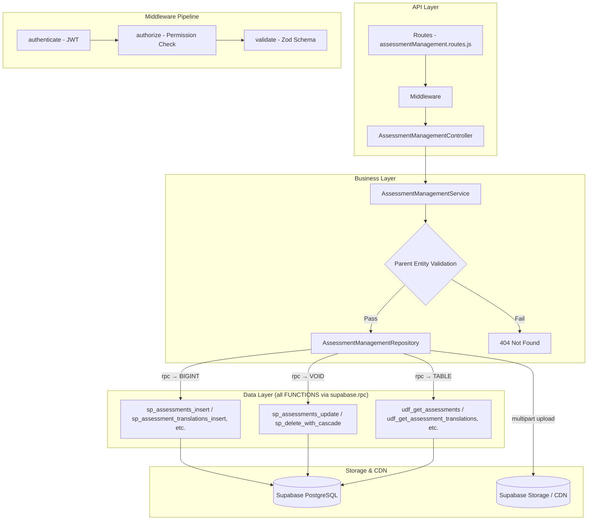

# GrowUpMore API — Phase 11: Assessment Management Module

## Postman Testing Guide

**Base URL:** `http://localhost:5001`
**API Prefix:** `/api/v1/assessment-management`
**Content-Type:** `application/json` or `multipart/form-data` for file uploads
**Authentication:** All endpoints require `Bearer <access_token>` in Authorization header

---

## Architecture Flow



---

## Prerequisites

Before testing, ensure:

1. **Authentication**: Login via `POST /api/v1/auth/login` to obtain `access_token`
2. **Permissions**: Run `phase11_assessment_management_permissions_seed.sql` in Supabase SQL Editor
3. **Master Data**: Ensure Languages, Chapters, Modules, Courses exist (from earlier phases)
4. **File Storage**: Supabase Storage buckets configured for assessment media (images, attachments, solutions, videos)
5. **Course Structure**: At least one active course with chapters and modules exists

---

## Complete Endpoint Reference

### Test Order (follow this sequence in Postman)

| # | Endpoint | Permission | Purpose |
|---|----------|-----------|---------|
| 1 | `POST /assessments` | `assessment.create` | Create assessment |
| 2 | `GET /assessments` | `assessment.read` | List all assessments with filters |
| 3 | `GET /assessments/:id` | `assessment.read` | Get assessment by ID |
| 4 | `PATCH /assessments/:id` | `assessment.update` | Update assessment details |
| 5 | `DELETE /assessments/:id` | `assessment.delete` | Soft delete assessment |
| 6 | `POST /assessments/:id/restore` | `assessment.update` | Restore soft-deleted assessment |
| 7 | `POST /assessment-translations` | `assessment_translation.create` | Create assessment translation (multipart) |
| 8 | `GET /assessment-translations/:id` | `assessment_translation.read` | Get translation by ID |
| 9 | `PATCH /assessment-translations/:id` | `assessment_translation.update` | Update translation (multipart) |
| 10 | `DELETE /assessment-translations/:id` | `assessment_translation.delete` | Soft delete translation |
| 11 | `POST /assessment-translations/:id/restore` | `assessment_translation.update` | Restore translation |
| 12 | `POST /assessment-attachments` | `assessment_attachment.create` | Create attachment (multipart) |
| 13 | `GET /assessment-attachments` | `assessment_attachment.read` | List attachments with filters |
| 14 | `GET /assessment-attachments/:id` | `assessment_attachment.read` | Get attachment by ID |
| 15 | `PATCH /assessment-attachments/:id` | `assessment_attachment.update` | Update attachment (multipart) |
| 16 | `DELETE /assessment-attachments/:id` | `assessment_attachment.delete` | Soft delete attachment |
| 17 | `POST /assessment-attachments/:id/restore` | `assessment_attachment.update` | Restore attachment |
| 18 | `POST /assessment-attachment-translations` | `assessment_attachment_translation.create` | Create attachment translation |
| 19 | `GET /assessment-attachment-translations/:id` | `assessment_attachment_translation.read` | Get attachment translation by ID |
| 20 | `PATCH /assessment-attachment-translations/:id` | `assessment_attachment_translation.update` | Update attachment translation |
| 21 | `DELETE /assessment-attachment-translations/:id` | `assessment_attachment_translation.delete` | Soft delete attachment translation |
| 22 | `POST /assessment-attachment-translations/:id/restore` | `assessment_attachment_translation.update` | Restore attachment translation |
| 23 | `POST /assessment-solutions` | `assessment_solution.create` | Create solution (multipart with file/video) |
| 24 | `GET /assessment-solutions` | `assessment_solution.read` | List solutions with filters |
| 25 | `GET /assessment-solutions/:id` | `assessment_solution.read` | Get solution by ID |
| 26 | `PATCH /assessment-solutions/:id` | `assessment_solution.update` | Update solution (multipart) |
| 27 | `DELETE /assessment-solutions/:id` | `assessment_solution.delete` | Soft delete solution |
| 28 | `POST /assessment-solutions/:id/restore` | `assessment_solution.update` | Restore solution |
| 29 | `POST /assessment-solution-translations` | `assessment_solution_translation.create` | Create solution translation (multipart) |
| 30 | `GET /assessment-solution-translations/:id` | `assessment_solution_translation.read` | Get solution translation by ID |
| 31 | `PATCH /assessment-solution-translations/:id` | `assessment_solution_translation.update` | Update solution translation (multipart) |
| 32 | `DELETE /assessment-solution-translations/:id` | `assessment_solution_translation.delete` | Soft delete solution translation |
| 33 | `POST /assessment-solution-translations/:id/restore` | `assessment_solution_translation.update` | Restore solution translation |

---

## Common Headers (All Requests)

| Key | Value |
|-----|-------|
| Authorization | Bearer `<access_token>` |
| Content-Type | `application/json` (default) or `multipart/form-data` (for file/image uploads) |

> **File Uploads Note:** Endpoints that accept multipart form-data will process file uploads (image1, image2, file, video, videoThumbnail). Files are stored in Supabase Storage and returned as secure download URLs. Max file size is typically 50MB per file.

---

## 1. ASSESSMENTS

### 1.1 Create Assessment

**`POST /api/v1/assessment-management/assessments`**

**Permission:** `assessment.create`

**Headers:**
```
Authorization: Bearer {{access_token}}
Content-Type: application/json
```

**Request Body:**

| Field | Type | Required | Description |
|-------|------|----------|-------------|
| assessmentType | string | Yes | Type of assessment (quiz, coding, project, assignment, etc.) |
| assessmentScope | string | Yes | Scope of assessment (chapter, module, course) |
| chapterId | number | Conditional | Required if assessmentScope is 'chapter' |
| moduleId | number | Conditional | Required if assessmentScope is 'module' |
| courseId | number | Conditional | Required if assessmentScope is 'course' |
| contentType | string | Yes | Type of content (theory, practical, capstone, etc.) |
| code | string | Yes | Unique assessment code |
| points | number | Yes | Maximum points for assessment |
| difficultyLevel | string | Yes | Level of difficulty (easy, medium, hard, expert) |
| dueDays | number | No | Days to complete from start (0-365) |
| estimatedHours | number | No | Estimated time to complete (decimal hours) |
| isMandatory | boolean | No | Whether assessment is mandatory (default: false) |
| displayOrder | number | No | Order of display in list (default: 0) |
| isActive | boolean | No | Active status (default: true) |

**Example Request:**
```json
{
  "assessmentType": "coding",
  "assessmentScope": "module",
  "moduleId": 1,
  "contentType": "practical",
  "code": "MOD-1-ASS-001",
  "points": 100,
  "difficultyLevel": "medium",
  "dueDays": 7,
  "estimatedHours": 2.5,
  "isMandatory": true,
  "displayOrder": 1,
  "isActive": true
}
```

**Expected Response (201):**
```json
{
  "success": true,
  "message": "Assessment created successfully",
  "data": {
    "id": 1
  }
}
```

**Postman Tests:**
```javascript
pm.test("Status is 201", () => pm.response.to.have.status(201));
const json = pm.response.json();
pm.test("Has assessment ID", () => pm.expect(json.data.id).to.be.a("number"));
pm.collectionVariables.set("assessmentId", json.data.id);
```

---

### 1.2 List Assessments

**`GET /api/v1/assessment-management/assessments`**

**Permission:** `assessment.read`

**Headers:**
```
Authorization: Bearer {{access_token}}
```

**Query Parameters:**

| Parameter | Type | Default | Description |
|-----------|------|---------|-------------|
| `page` | number | 1 | Page number |
| `limit` | number | 20 | Items per page |
| `search` | string | — | Search by code or name |
| `sortBy` | string | id | Sort column (id, code, points, difficultyLevel, etc.) |
| `sortDir` | string | ASC | Sort direction (ASC/DESC) |
| `assessmentType` | string | — | Filter by type (quiz, coding, project, assignment, etc.) |
| `assessmentScope` | string | — | Filter by scope (chapter, module, course) |
| `contentType` | string | — | Filter by content type (theory, practical, capstone, etc.) |
| `difficultyLevel` | string | — | Filter by difficulty (easy, medium, hard, expert) |
| `chapterId` | number | — | Filter by chapter ID |
| `moduleId` | number | — | Filter by module ID |
| `courseId` | number | — | Filter by course ID |
| `isMandatory` | boolean | — | Filter by mandatory status |
| `isActive` | boolean | — | Filter by active status |
| `languageId` | number | — | Filter by language (for translations) |

**Example:** `GET /api/v1/assessment-management/assessments?page=1&limit=20&assessmentScope=module&difficultyLevel=medium&isActive=true`

**Expected Response (200):**
```json
{
  "success": true,
  "message": "Assessments retrieved successfully",
  "data": [
    {
      "id": 1,
      "assessment_type": "coding",
      "assessment_scope": "module",
      "module_id": 1,
      "chapter_id": null,
      "course_id": null,
      "content_type": "practical",
      "code": "MOD-1-ASS-001",
      "points": 100,
      "difficulty_level": "medium",
      "due_days": 7,
      "estimated_hours": 2.5,
      "is_mandatory": true,
      "display_order": 1,
      "is_active": true,
      "created_at": "2026-04-05T10:30:00Z",
      "updated_at": "2026-04-05T10:30:00Z",
      "deleted_at": null,
      "total_count": 15
    }
  ],
  "meta": {
    "page": 1,
    "limit": 20,
    "totalCount": 15,
    "totalPages": 1
  }
}
```

---

### 1.3 Get Assessment by ID

**`GET /api/v1/assessment-management/assessments/:id`**

**Permission:** `assessment.read`

**Headers:**
```
Authorization: Bearer {{access_token}}
```

**Example:** `GET /api/v1/assessment-management/assessments/{{assessmentId}}`

**Expected Response (200):**
```json
{
  "success": true,
  "message": "Assessment retrieved successfully",
  "data": {
    "id": 1,
    "assessment_type": "coding",
    "assessment_scope": "module",
    "module_id": 1,
    "module_name": "Variables and Data Types",
    "chapter_id": 5,
    "chapter_name": "Fundamentals",
    "course_id": null,
    "content_type": "practical",
    "code": "MOD-1-ASS-001",
    "points": 100,
    "difficulty_level": "medium",
    "due_days": 7,
    "estimated_hours": 2.5,
    "is_mandatory": true,
    "display_order": 1,
    "is_active": true,
    "created_at": "2026-04-05T10:30:00Z",
    "updated_at": "2026-04-05T10:30:00Z",
    "created_by": 1,
    "updated_by": 1
  }
}
```

---

### 1.4 Update Assessment

**`PATCH /api/v1/assessment-management/assessments/:id`**

**Permission:** `assessment.update`

**Headers:**
```
Authorization: Bearer {{access_token}}
Content-Type: application/json
```

**Request Body (partial update allowed):**
```json
{
  "points": 150,
  "dueDays": 10,
  "estimatedHours": 3,
  "difficultyLevel": "hard",
  "displayOrder": 2,
  "isActive": true
}
```

**Expected Response (200):**
```json
{
  "success": true,
  "message": "Assessment updated successfully",
  "data": {
    "id": 1
  }
}
```

---

### 1.5 Delete Assessment

**`DELETE /api/v1/assessment-management/assessments/:id`**

**Permission:** `assessment.delete`

**Headers:**
```
Authorization: Bearer {{access_token}}
```

**Example:** `DELETE /api/v1/assessment-management/assessments/{{assessmentId}}`

**Expected Response (200):**
```json
{
  "success": true,
  "message": "Assessment deleted successfully"
}
```

---

### 1.6 Restore Assessment

**`POST /api/v1/assessment-management/assessments/:id/restore`**

**Permission:** `assessment.update`

**Headers:**
```
Authorization: Bearer {{access_token}}
Content-Type: application/json
```

**Request Body:**
```json
{
  "restoreTranslations": true
}
```

**Expected Response (200):**
```json
{
  "success": true,
  "message": "Assessment restored successfully",
  "data": {
    "id": 1,
    "restoredTranslationCount": 3
  }
}
```

---

## 2. ASSESSMENT TRANSLATIONS

### 2.1 Create Assessment Translation

**`POST /api/v1/assessment-management/assessment-translations`**

**Permission:** `assessment_translation.create`

**Headers:**
```
Authorization: Bearer {{access_token}}
Content-Type: multipart/form-data
```

**Form-data Fields:**

| Field | Type | Required | Description |
|-------|------|----------|-------------|
| translationData | text | Yes | JSON object with translation details |
| image1 | file | No | First image (JPG, PNG, WebP, max 5MB) |
| image2 | file | No | Second image (JPG, PNG, WebP, max 5MB) |

**translationData JSON Structure:**

| Field | Type | Required | Description |
|-------|------|----------|-------------|
| assessmentId | number | Yes | ID of assessment |
| languageId | number | Yes | ID of language |
| title | string | Yes | Assessment title in target language |
| description | string | No | Detailed description |
| instructions | string | No | Instructions for completing assessment |
| techStack | array | No | JSON array of tech stack used (e.g., ["Node.js", "Express"]) |
| learningOutcomes | array | No | JSON array of learning outcomes |
| tags | array | No | JSON array of tags |
| seoTitle | string | No | SEO title |
| seoDescription | string | No | SEO description |
| seoKeywords | string | No | Comma-separated SEO keywords |

**Example Request (Form-data):**

```
Key: translationData (form field, type: text)
Value: {
  "assessmentId": 1,
  "languageId": 1,
  "title": "JavaScript Coding Assessment",
  "description": "Comprehensive assessment covering JavaScript fundamentals and advanced concepts",
  "instructions": "Complete all 5 coding challenges within the time limit. Submit your code via GitHub.",
  "techStack": ["JavaScript", "Node.js", "Express"],
  "learningOutcomes": ["Master JavaScript concepts", "Build real-world applications", "Write clean code"],
  "tags": ["javascript", "coding", "intermediate"],
  "seoTitle": "JavaScript Coding Assessment - GrowUpMore",
  "seoDescription": "Test your JavaScript skills with our comprehensive coding assessment",
  "seoKeywords": "javascript, coding, assessment, practice"
}

Key: image1 (file, type: file)
Value: [IMAGE file - JPG/PNG/WebP, max 5MB: assessment-banner.jpg]

Key: image2 (file, type: file)
Value: [IMAGE file - JPG/PNG/WebP, max 5MB: assessment-icon.png]
```

**Expected Response (201):**
```json
{
  "success": true,
  "message": "Assessment translation created successfully",
  "data": {
    "id": 5,
    "image1Url": "https://storage.supabase.co/assessments/images/assessment-banner-uuid.jpg",
    "image2Url": "https://storage.supabase.co/assessments/images/assessment-icon-uuid.png"
  }
}
```

**Postman Tests:**
```javascript
pm.test("Status is 201", () => pm.response.to.have.status(201));
const json = pm.response.json();
pm.test("Has translation ID", () => pm.expect(json.data.id).to.be.a("number"));
pm.collectionVariables.set("assessmentTranslationId", json.data.id);
```

---

### 2.2 Get Assessment Translation by ID

**`GET /api/v1/assessment-management/assessment-translations/:id`**

**Permission:** `assessment_translation.read`

**Headers:**
```
Authorization: Bearer {{access_token}}
```

**Example:** `GET /api/v1/assessment-management/assessment-translations/{{assessmentTranslationId}}`

**Expected Response (200):**
```json
{
  "success": true,
  "message": "Assessment translation retrieved successfully",
  "data": {
    "id": 5,
    "assessment_id": 1,
    "language_id": 1,
    "language_name": "English",
    "title": "JavaScript Coding Assessment",
    "description": "Comprehensive assessment covering JavaScript fundamentals and advanced concepts",
    "instructions": "Complete all 5 coding challenges within the time limit. Submit your code via GitHub.",
    "tech_stack": ["JavaScript", "Node.js", "Express"],
    "learning_outcomes": ["Master JavaScript concepts", "Build real-world applications", "Write clean code"],
    "tags": ["javascript", "coding", "intermediate"],
    "image1_url": "https://storage.supabase.co/assessments/images/assessment-banner-uuid.jpg",
    "image2_url": "https://storage.supabase.co/assessments/images/assessment-icon-uuid.png",
    "seo_title": "JavaScript Coding Assessment - GrowUpMore",
    "seo_description": "Test your JavaScript skills with our comprehensive coding assessment",
    "seo_keywords": "javascript, coding, assessment, practice",
    "created_at": "2026-04-05T10:30:00Z",
    "updated_at": "2026-04-05T10:30:00Z"
  }
}
```

---

### 2.3 Update Assessment Translation

**`PATCH /api/v1/assessment-management/assessment-translations/:id`**

**Permission:** `assessment_translation.update`

**Headers:**
```
Authorization: Bearer {{access_token}}
Content-Type: multipart/form-data
```

**Form-data Fields (all optional):**

```
Key: translationData (form field, type: text)
Value: {
  "title": "Updated JavaScript Assessment Title",
  "description": "Updated description",
  "tags": ["javascript", "coding", "advanced"]
}

Key: image1 (file, type: file)
Value: [IMAGE file - optional]

Key: image2 (file, type: file)
Value: [IMAGE file - optional]
```

**Expected Response (200):**
```json
{
  "success": true,
  "message": "Assessment translation updated successfully",
  "data": {
    "id": 5
  }
}
```

---

### 2.4 Delete Assessment Translation

**`DELETE /api/v1/assessment-management/assessment-translations/:id`**

**Permission:** `assessment_translation.delete`

**Headers:**
```
Authorization: Bearer {{access_token}}
```

**Example:** `DELETE /api/v1/assessment-management/assessment-translations/{{assessmentTranslationId}}`

**Expected Response (200):**
```json
{
  "success": true,
  "message": "Assessment translation deleted successfully"
}
```

---

### 2.5 Restore Assessment Translation

**`POST /api/v1/assessment-management/assessment-translations/:id/restore`**

**Permission:** `assessment_translation.update`

**Headers:**
```
Authorization: Bearer {{access_token}}
Content-Type: application/json
```

**Expected Response (200):**
```json
{
  "success": true,
  "message": "Assessment translation restored successfully",
  "data": {
    "id": 5
  }
}
```

---

## 3. ASSESSMENT ATTACHMENTS

### 3.1 Create Assessment Attachment

**`POST /api/v1/assessment-management/assessment-attachments`**

**Permission:** `assessment_attachment.create`

**Headers:**
```
Authorization: Bearer {{access_token}}
Content-Type: multipart/form-data
```

**Form-data Fields:**

| Field | Type | Required | Description |
|-------|------|----------|-------------|
| attachmentData | text | Yes | JSON object with attachment details |
| file | file | Yes | Attachment file (PDF, DOC, ZIP, max 50MB) |

**attachmentData JSON Structure:**

| Field | Type | Required | Description |
|-------|------|----------|-------------|
| assessmentId | number | Yes | ID of assessment |
| attachmentType | string | Yes | Type of attachment (resource, rubric, template, sample, etc.) |
| githubUrl | string | No | GitHub repository URL (if applicable) |
| fileName | string | Yes | Display name for the file |
| displayOrder | number | No | Order of display (default: 0) |
| isActive | boolean | No | Active status (default: true) |

**Example Request:**

```
Key: attachmentData (form field, type: text)
Value: {
  "assessmentId": 1,
  "attachmentType": "resource",
  "fileName": "Assessment-Template-Starter-Code.zip",
  "githubUrl": "https://github.com/growupmore/assessment-templates",
  "displayOrder": 1,
  "isActive": true
}

Key: file (file, type: file)
Value: [FILE - ZIP, PDF, or DOC, max 50MB: assessment-template.zip]
```

**Expected Response (201):**
```json
{
  "success": true,
  "message": "Assessment attachment created successfully",
  "data": {
    "id": 8,
    "fileUrl": "https://storage.supabase.co/assessments/attachments/assessment-template-uuid.zip"
  }
}
```

**Postman Tests:**
```javascript
pm.test("Status is 201", () => pm.response.to.have.status(201));
const json = pm.response.json();
pm.test("Has attachment ID", () => pm.expect(json.data.id).to.be.a("number"));
pm.collectionVariables.set("assessmentAttachmentId", json.data.id);
```

---

### 3.2 List Assessment Attachments

**`GET /api/v1/assessment-management/assessment-attachments`**

**Permission:** `assessment_attachment.read`

**Headers:**
```
Authorization: Bearer {{access_token}}
```

**Query Parameters:**

| Parameter | Type | Default | Description |
|-----------|------|---------|-------------|
| `page` | number | 1 | Page number |
| `limit` | number | 20 | Items per page |
| `assessmentId` | number | — | Filter by assessment ID |
| `languageId` | number | — | Filter by language |
| `attachmentType` | string | — | Filter by attachment type (resource, rubric, template, sample) |
| `isActive` | boolean | — | Filter by active status |
| `search` | string | — | Search by file name |
| `sortBy` | string | id | Sort column |
| `sortDir` | string | ASC | Sort direction |

**Example:** `GET /api/v1/assessment-management/assessment-attachments?assessmentId={{assessmentId}}&attachmentType=resource&isActive=true`

**Expected Response (200):**
```json
{
  "success": true,
  "message": "Assessment attachments retrieved successfully",
  "data": [
    {
      "id": 8,
      "assessment_id": 1,
      "attachment_type": "resource",
      "file_name": "Assessment-Template-Starter-Code.zip",
      "file_url": "https://storage.supabase.co/assessments/attachments/assessment-template-uuid.zip",
      "github_url": "https://github.com/growupmore/assessment-templates",
      "display_order": 1,
      "is_active": true,
      "created_at": "2026-04-05T10:30:00Z",
      "total_count": 3
    }
  ],
  "meta": {
    "page": 1,
    "limit": 20,
    "totalCount": 3,
    "totalPages": 1
  }
}
```

---

### 3.3 Get Assessment Attachment by ID

**`GET /api/v1/assessment-management/assessment-attachments/:id`**

**Permission:** `assessment_attachment.read`

**Headers:**
```
Authorization: Bearer {{access_token}}
```

**Example:** `GET /api/v1/assessment-management/assessment-attachments/{{assessmentAttachmentId}}`

**Expected Response (200):**
```json
{
  "success": true,
  "message": "Assessment attachment retrieved successfully",
  "data": {
    "id": 8,
    "assessment_id": 1,
    "assessment_code": "MOD-1-ASS-001",
    "attachment_type": "resource",
    "file_name": "Assessment-Template-Starter-Code.zip",
    "file_url": "https://storage.supabase.co/assessments/attachments/assessment-template-uuid.zip",
    "file_size_bytes": 5242880,
    "github_url": "https://github.com/growupmore/assessment-templates",
    "display_order": 1,
    "is_active": true,
    "created_at": "2026-04-05T10:30:00Z",
    "updated_at": "2026-04-05T10:30:00Z"
  }
}
```

---

### 3.4 Update Assessment Attachment

**`PATCH /api/v1/assessment-management/assessment-attachments/:id`**

**Permission:** `assessment_attachment.update`

**Headers:**
```
Authorization: Bearer {{access_token}}
Content-Type: multipart/form-data
```

**Form-data Fields (all optional):**

```
Key: attachmentData (form field, type: text)
Value: {
  "attachmentType": "template",
  "fileName": "Updated-Template-Name.zip",
  "displayOrder": 2,
  "isActive": true
}

Key: file (file, type: file)
Value: [FILE - optional new file]
```

**Expected Response (200):**
```json
{
  "success": true,
  "message": "Assessment attachment updated successfully",
  "data": {
    "id": 8
  }
}
```

---

### 3.5 Delete Assessment Attachment

**`DELETE /api/v1/assessment-management/assessment-attachments/:id`**

**Permission:** `assessment_attachment.delete`

**Headers:**
```
Authorization: Bearer {{access_token}}
```

**Example:** `DELETE /api/v1/assessment-management/assessment-attachments/{{assessmentAttachmentId}}`

**Expected Response (200):**
```json
{
  "success": true,
  "message": "Assessment attachment deleted successfully"
}
```

---

### 3.6 Restore Assessment Attachment

**`POST /api/v1/assessment-management/assessment-attachments/:id/restore`**

**Permission:** `assessment_attachment.update`

**Headers:**
```
Authorization: Bearer {{access_token}}
Content-Type: application/json
```

**Request Body:**
```json
{
  "restoreTranslations": true
}
```

**Expected Response (200):**
```json
{
  "success": true,
  "message": "Assessment attachment restored successfully",
  "data": {
    "id": 8,
    "restoredTranslationCount": 2
  }
}
```

---

## 4. ASSESSMENT ATTACHMENT TRANSLATIONS

### 4.1 Create Assessment Attachment Translation

**`POST /api/v1/assessment-management/assessment-attachment-translations`**

**Permission:** `assessment_attachment_translation.create`

**Headers:**
```
Authorization: Bearer {{access_token}}
Content-Type: application/json
```

**Request Body:**

| Field | Type | Required | Description |
|-------|------|----------|-------------|
| assessmentAttachmentId | number | Yes | ID of assessment attachment |
| languageId | number | Yes | ID of language |
| title | string | Yes | Translated title |
| description | string | No | Translated description |

**Example Request:**
```json
{
  "assessmentAttachmentId": 8,
  "languageId": 2,
  "title": "Plantilla de Evaluación - Código de Inicio",
  "description": "Plantilla para comenzar la evaluación con código de inicio"
}
```

**Expected Response (201):**
```json
{
  "success": true,
  "message": "Assessment attachment translation created successfully",
  "data": {
    "id": 12
  }
}
```

---

### 4.2 Get Assessment Attachment Translation by ID

**`GET /api/v1/assessment-management/assessment-attachment-translations/:id`**

**Permission:** `assessment_attachment_translation.read`

**Headers:**
```
Authorization: Bearer {{access_token}}
```

**Example:** `GET /api/v1/assessment-management/assessment-attachment-translations/{{attachmentTranslationId}}`

**Expected Response (200):**
```json
{
  "success": true,
  "message": "Assessment attachment translation retrieved successfully",
  "data": {
    "id": 12,
    "assessment_attachment_id": 8,
    "language_id": 2,
    "language_name": "Spanish",
    "title": "Plantilla de Evaluación - Código de Inicio",
    "description": "Plantilla para comenzar la evaluación con código de inicio",
    "created_at": "2026-04-05T10:30:00Z",
    "updated_at": "2026-04-05T10:30:00Z"
  }
}
```

---

### 4.3 Update Assessment Attachment Translation

**`PATCH /api/v1/assessment-management/assessment-attachment-translations/:id`**

**Permission:** `assessment_attachment_translation.update`

**Headers:**
```
Authorization: Bearer {{access_token}}
Content-Type: application/json
```

**Request Body (partial update allowed):**
```json
{
  "title": "Updated Spanish Title",
  "description": "Updated description"
}
```

**Expected Response (200):**
```json
{
  "success": true,
  "message": "Assessment attachment translation updated successfully",
  "data": {
    "id": 12
  }
}
```

---

### 4.4 Delete Assessment Attachment Translation

**`DELETE /api/v1/assessment-management/assessment-attachment-translations/:id`**

**Permission:** `assessment_attachment_translation.delete`

**Headers:**
```
Authorization: Bearer {{access_token}}
```

**Example:** `DELETE /api/v1/assessment-management/assessment-attachment-translations/{{attachmentTranslationId}}`

**Expected Response (200):**
```json
{
  "success": true,
  "message": "Assessment attachment translation deleted successfully"
}
```

---

### 4.5 Restore Assessment Attachment Translation

**`POST /api/v1/assessment-management/assessment-attachment-translations/:id/restore`**

**Permission:** `assessment_attachment_translation.update`

**Headers:**
```
Authorization: Bearer {{access_token}}
Content-Type: application/json
```

**Expected Response (200):**
```json
{
  "success": true,
  "message": "Assessment attachment translation restored successfully",
  "data": {
    "id": 12
  }
}
```

---

## 5. ASSESSMENT SOLUTIONS

### 5.1 Create Assessment Solution

**`POST /api/v1/assessment-management/assessment-solutions`**

**Permission:** `assessment_solution.create`

**Headers:**
```
Authorization: Bearer {{access_token}}
Content-Type: multipart/form-data
```

**Form-data Fields:**

| Field | Type | Required | Description |
|-------|------|----------|-------------|
| solutionData | text | Yes | JSON object with solution details |
| file | file | No | Solution file (PDF, DOC, ZIP, max 50MB) |
| video | file | No | Solution video (MP4, WebM, max 100MB) |

**solutionData JSON Structure:**

| Field | Type | Required | Description |
|-------|------|----------|-------------|
| assessmentId | number | Yes | ID of assessment |
| solutionType | string | Yes | Type of solution (code, document, video, hybrid) |
| githubUrl | string | No | GitHub repository URL |
| fileName | string | No | File name (if file provided) |
| videoDurationSeconds | number | No | Duration of video in seconds |
| displayOrder | number | No | Order of display (default: 0) |
| isActive | boolean | No | Active status (default: true) |

**Example Request:**

```
Key: solutionData (form field, type: text)
Value: {
  "assessmentId": 1,
  "solutionType": "hybrid",
  "githubUrl": "https://github.com/growupmore/solutions/assessment-001",
  "fileName": "complete-solution.zip",
  "videoDurationSeconds": 600,
  "displayOrder": 1,
  "isActive": true
}

Key: file (file, type: file)
Value: [FILE - ZIP/PDF/DOC, max 50MB: complete-solution.zip]

Key: video (file, type: file)
Value: [VIDEO - MP4/WebM, max 100MB: solution-walkthrough.mp4]
```

**Expected Response (201):**
```json
{
  "success": true,
  "message": "Assessment solution created successfully",
  "data": {
    "id": 3,
    "fileUrl": "https://storage.supabase.co/assessments/solutions/complete-solution-uuid.zip",
    "videoUrl": "https://storage.supabase.co/assessments/solutions/solution-walkthrough-uuid.mp4"
  }
}
```

**Postman Tests:**
```javascript
pm.test("Status is 201", () => pm.response.to.have.status(201));
const json = pm.response.json();
pm.test("Has solution ID", () => pm.expect(json.data.id).to.be.a("number"));
pm.collectionVariables.set("assessmentSolutionId", json.data.id);
```

---

### 5.2 List Assessment Solutions

**`GET /api/v1/assessment-management/assessment-solutions`**

**Permission:** `assessment_solution.read`

**Headers:**
```
Authorization: Bearer {{access_token}}
```

**Query Parameters:**

| Parameter | Type | Default | Description |
|-----------|------|---------|-------------|
| `page` | number | 1 | Page number |
| `limit` | number | 20 | Items per page |
| `assessmentId` | number | — | Filter by assessment ID |
| `solutionType` | string | — | Filter by solution type (code, document, video, hybrid) |
| `isActive` | boolean | — | Filter by active status |
| `search` | string | — | Search by file name |
| `sortBy` | string | id | Sort column |
| `sortDir` | string | ASC | Sort direction |

**Example:** `GET /api/v1/assessment-management/assessment-solutions?assessmentId={{assessmentId}}&solutionType=hybrid`

**Expected Response (200):**
```json
{
  "success": true,
  "message": "Assessment solutions retrieved successfully",
  "data": [
    {
      "id": 3,
      "assessment_id": 1,
      "solution_type": "hybrid",
      "file_name": "complete-solution.zip",
      "file_url": "https://storage.supabase.co/assessments/solutions/complete-solution-uuid.zip",
      "video_url": "https://storage.supabase.co/assessments/solutions/solution-walkthrough-uuid.mp4",
      "video_duration_seconds": 600,
      "github_url": "https://github.com/growupmore/solutions/assessment-001",
      "display_order": 1,
      "is_active": true,
      "created_at": "2026-04-05T10:30:00Z",
      "total_count": 2
    }
  ],
  "meta": {
    "page": 1,
    "limit": 20,
    "totalCount": 2,
    "totalPages": 1
  }
}
```

---

### 5.3 Get Assessment Solution by ID

**`GET /api/v1/assessment-management/assessment-solutions/:id`**

**Permission:** `assessment_solution.read`

**Headers:**
```
Authorization: Bearer {{access_token}}
```

**Example:** `GET /api/v1/assessment-management/assessment-solutions/{{assessmentSolutionId}}`

**Expected Response (200):**
```json
{
  "success": true,
  "message": "Assessment solution retrieved successfully",
  "data": {
    "id": 3,
    "assessment_id": 1,
    "assessment_code": "MOD-1-ASS-001",
    "solution_type": "hybrid",
    "file_name": "complete-solution.zip",
    "file_url": "https://storage.supabase.co/assessments/solutions/complete-solution-uuid.zip",
    "file_size_bytes": 10485760,
    "video_url": "https://storage.supabase.co/assessments/solutions/solution-walkthrough-uuid.mp4",
    "video_duration_seconds": 600,
    "video_size_bytes": 52428800,
    "github_url": "https://github.com/growupmore/solutions/assessment-001",
    "display_order": 1,
    "is_active": true,
    "created_at": "2026-04-05T10:30:00Z",
    "updated_at": "2026-04-05T10:30:00Z"
  }
}
```

---

### 5.4 Update Assessment Solution

**`PATCH /api/v1/assessment-management/assessment-solutions/:id`**

**Permission:** `assessment_solution.update`

**Headers:**
```
Authorization: Bearer {{access_token}}
Content-Type: multipart/form-data
```

**Form-data Fields (all optional):**

```
Key: solutionData (form field, type: text)
Value: {
  "solutionType": "code",
  "fileName": "updated-solution.zip",
  "videoDurationSeconds": 720,
  "displayOrder": 2,
  "isActive": true
}

Key: file (file, type: file)
Value: [FILE - optional new file]

Key: video (file, type: file)
Value: [VIDEO - optional new video]
```

**Expected Response (200):**
```json
{
  "success": true,
  "message": "Assessment solution updated successfully",
  "data": {
    "id": 3
  }
}
```

---

### 5.5 Delete Assessment Solution

**`DELETE /api/v1/assessment-management/assessment-solutions/:id`**

**Permission:** `assessment_solution.delete`

**Headers:**
```
Authorization: Bearer {{access_token}}
```

**Example:** `DELETE /api/v1/assessment-management/assessment-solutions/{{assessmentSolutionId}}`

**Expected Response (200):**
```json
{
  "success": true,
  "message": "Assessment solution deleted successfully"
}
```

---

### 5.6 Restore Assessment Solution

**`POST /api/v1/assessment-management/assessment-solutions/:id/restore`**

**Permission:** `assessment_solution.update`

**Headers:**
```
Authorization: Bearer {{access_token}}
Content-Type: application/json
```

**Request Body:**
```json
{
  "restoreTranslations": true
}
```

**Expected Response (200):**
```json
{
  "success": true,
  "message": "Assessment solution restored successfully",
  "data": {
    "id": 3,
    "restoredTranslationCount": 2
  }
}
```

---

## 6. ASSESSMENT SOLUTION TRANSLATIONS

### 6.1 Create Assessment Solution Translation

**`POST /api/v1/assessment-management/assessment-solution-translations`**

**Permission:** `assessment_solution_translation.create`

**Headers:**
```
Authorization: Bearer {{access_token}}
Content-Type: multipart/form-data
```

**Form-data Fields:**

| Field | Type | Required | Description |
|-------|------|----------|-------------|
| translationData | text | Yes | JSON object with translation details |
| videoThumbnail | file | No | Thumbnail image for video (JPG, PNG, max 5MB) |

**translationData JSON Structure:**

| Field | Type | Required | Description |
|-------|------|----------|-------------|
| assessmentSolutionId | number | Yes | ID of assessment solution |
| languageId | number | Yes | ID of language |
| title | string | Yes | Solution title in target language |
| description | string | No | Detailed description |
| videoTitle | string | No | Video title |
| videoDescription | string | No | Video description |

**Example Request:**

```
Key: translationData (form field, type: text)
Value: {
  "assessmentSolutionId": 3,
  "languageId": 1,
  "title": "Complete Solution with Code Walkthrough",
  "description": "This solution includes complete code implementation and detailed explanation",
  "videoTitle": "Solution Walkthrough - JavaScript Assessment",
  "videoDescription": "Step-by-step walkthrough of the complete solution"
}

Key: videoThumbnail (file, type: file)
Value: [IMAGE file - JPG/PNG, max 5MB: solution-thumbnail.jpg]
```

**Expected Response (201):**
```json
{
  "success": true,
  "message": "Assessment solution translation created successfully",
  "data": {
    "id": 6,
    "videoThumbnailUrl": "https://storage.supabase.co/assessments/thumbnails/solution-thumbnail-uuid.jpg"
  }
}
```

**Postman Tests:**
```javascript
pm.test("Status is 201", () => pm.response.to.have.status(201));
const json = pm.response.json();
pm.test("Has solution translation ID", () => pm.expect(json.data.id).to.be.a("number"));
pm.collectionVariables.set("assessmentSolutionTranslationId", json.data.id);
```

---

### 6.2 Get Assessment Solution Translation by ID

**`GET /api/v1/assessment-management/assessment-solution-translations/:id`**

**Permission:** `assessment_solution_translation.read`

**Headers:**
```
Authorization: Bearer {{access_token}}
```

**Example:** `GET /api/v1/assessment-management/assessment-solution-translations/{{assessmentSolutionTranslationId}}`

**Expected Response (200):**
```json
{
  "success": true,
  "message": "Assessment solution translation retrieved successfully",
  "data": {
    "id": 6,
    "assessment_solution_id": 3,
    "language_id": 1,
    "language_name": "English",
    "title": "Complete Solution with Code Walkthrough",
    "description": "This solution includes complete code implementation and detailed explanation",
    "video_title": "Solution Walkthrough - JavaScript Assessment",
    "video_description": "Step-by-step walkthrough of the complete solution",
    "video_thumbnail_url": "https://storage.supabase.co/assessments/thumbnails/solution-thumbnail-uuid.jpg",
    "created_at": "2026-04-05T10:30:00Z",
    "updated_at": "2026-04-05T10:30:00Z"
  }
}
```

---

### 6.3 Update Assessment Solution Translation

**`PATCH /api/v1/assessment-management/assessment-solution-translations/:id`**

**Permission:** `assessment_solution_translation.update`

**Headers:**
```
Authorization: Bearer {{access_token}}
Content-Type: multipart/form-data
```

**Form-data Fields (all optional):**

```
Key: translationData (form field, type: text)
Value: {
  "title": "Updated Solution Title",
  "description": "Updated description",
  "videoTitle": "Updated Video Title"
}

Key: videoThumbnail (file, type: file)
Value: [IMAGE file - optional]
```

**Expected Response (200):**
```json
{
  "success": true,
  "message": "Assessment solution translation updated successfully",
  "data": {
    "id": 6
  }
}
```

---

### 6.4 Delete Assessment Solution Translation

**`DELETE /api/v1/assessment-management/assessment-solution-translations/:id`**

**Permission:** `assessment_solution_translation.delete`

**Headers:**
```
Authorization: Bearer {{access_token}}
```

**Example:** `DELETE /api/v1/assessment-management/assessment-solution-translations/{{assessmentSolutionTranslationId}}`

**Expected Response (200):**
```json
{
  "success": true,
  "message": "Assessment solution translation deleted successfully"
}
```

---

### 6.5 Restore Assessment Solution Translation

**`POST /api/v1/assessment-management/assessment-solution-translations/:id/restore`**

**Permission:** `assessment_solution_translation.update`

**Headers:**
```
Authorization: Bearer {{access_token}}
Content-Type: application/json
```

**Expected Response (200):**
```json
{
  "success": true,
  "message": "Assessment solution translation restored successfully",
  "data": {
    "id": 6
  }
}
```

---

## Error Responses

All endpoints follow standard error response format:

### 400 Bad Request (Validation Error)
```json
{
  "success": false,
  "message": "Validation failed",
  "details": [
    {
      "field": "assessmentType",
      "message": "Assessment type is required"
    }
  ]
}
```

### 401 Unauthorized
```json
{
  "success": false,
  "message": "Unauthorized - Invalid or missing token"
}
```

### 403 Forbidden
```json
{
  "success": false,
  "message": "Permission denied - User lacks required permission",
  "requiredPermission": "assessment.create"
}
```

### 404 Not Found
```json
{
  "success": false,
  "message": "Assessment not found"
}
```

### 409 Conflict
```json
{
  "success": false,
  "message": "Duplicate assessment code"
}
```

### 422 Unprocessable Entity
```json
{
  "success": false,
  "message": "Invalid request - Parent entity not found",
  "details": {
    "moduleId": 999,
    "reason": "Module does not exist"
  }
}
```

### 429 Too Many Requests
```json
{
  "success": false,
  "message": "Rate limit exceeded - Try again in 60 seconds"
}
```

### 500 Internal Server Error
```json
{
  "success": false,
  "message": "Internal server error",
  "requestId": "uuid-for-debugging"
}
```

---

## Postman Collection Setup

### Step 1: Set Base Variables

In Postman Collection Variables, set:
```
base_url: http://localhost:5001
api_prefix: /api/v1/assessment-management
access_token: <your_token_from_login>
```

### Step 2: Create Pre-request Script

```javascript
// Set Authorization header with Bearer token
pm.request.headers.add({
  key: 'Authorization',
  value: 'Bearer {{access_token}}'
});

// Set Content-Type for JSON requests (default)
if (pm.request.body.mode !== 'formdata') {
  pm.request.headers.add({
    key: 'Content-Type',
    value: 'application/json'
  });
}
```

### Step 3: Save IDs for Dependent Requests

Each create endpoint should save the ID to collection variables:

```javascript
const json = pm.response.json();
if (json.data && json.data.id) {
  pm.collectionVariables.set("assessmentId", json.data.id);
}
```

---

## Testing Workflow

1. **Authenticate** - Login to get `access_token`
2. **Create Assessment** - Save the assessment ID
3. **Create Assessment Translation** - Use the saved assessment ID
4. **Create Assessment Attachments** - Use the saved assessment ID
5. **Create Assessment Solutions** - Use the saved assessment ID
6. **Create Solution Translations** - Use the saved solution ID
7. **List & Get** operations for verification
8. **Update** assessments and translations
9. **Delete & Restore** operations last

> **Note:** All delete operations are soft deletes by default. Use the restore endpoint to recover deleted data.

---

## Rate Limiting

- **Authentication Endpoints:** 5 requests per minute per IP
- **Create/Update Endpoints:** 20 requests per minute per user
- **List/Read Endpoints:** 100 requests per minute per user
- **Delete Endpoints:** 10 requests per minute per user

Rate limit headers returned in all responses:
```
X-RateLimit-Limit: 100
X-RateLimit-Remaining: 95
X-RateLimit-Reset: 1712313000
```

---

## File Upload Guidelines

### Supported File Types

| Endpoint | Field | Type | Max Size | Formats |
|----------|-------|------|----------|---------|
| Assessment Translation | image1, image2 | Image | 5MB | JPG, PNG, WebP |
| Attachment | file | Document | 50MB | PDF, DOC, ZIP, DOCX |
| Solution | file | Document | 50MB | PDF, ZIP, DOC, DOCX |
| Solution | video | Video | 100MB | MP4, WebM |
| Solution Translation | videoThumbnail | Image | 5MB | JPG, PNG, WebP |

### Upload Handling

1. Files are scanned for viruses using ClamAV
2. Files are stored in Supabase Storage with UUID filenames
3. Secure download URLs are returned in response
4. Original file extensions are preserved
5. File metadata (size, MIME type) is stored in database

---

## Best Practices

1. **Always use Bearer token** in Authorization header
2. **Validate parent entities** exist before creating children
3. **Use languageId = 1** (English) for default translations
4. **Save IDs** from create responses for dependent operations
5. **Use pagination** for list endpoints (page, limit)
6. **Check timestamps** to verify updates
7. **Implement retry logic** for rate-limited requests (429)
8. **Test error scenarios** using invalid IDs
9. **Keep assessment code unique** to avoid conflicts
10. **Use meaningful display order** for sorting

---

## Changelog

| Version | Date | Changes |
|---------|------|---------|
| 1.0.0 | 2026-04-05 | Initial release - Assessment Management Phase 11 |

---

**Document Version:** 1.0.0
**Last Updated:** 2026-04-05
**Author:** GrowUpMore API Team
