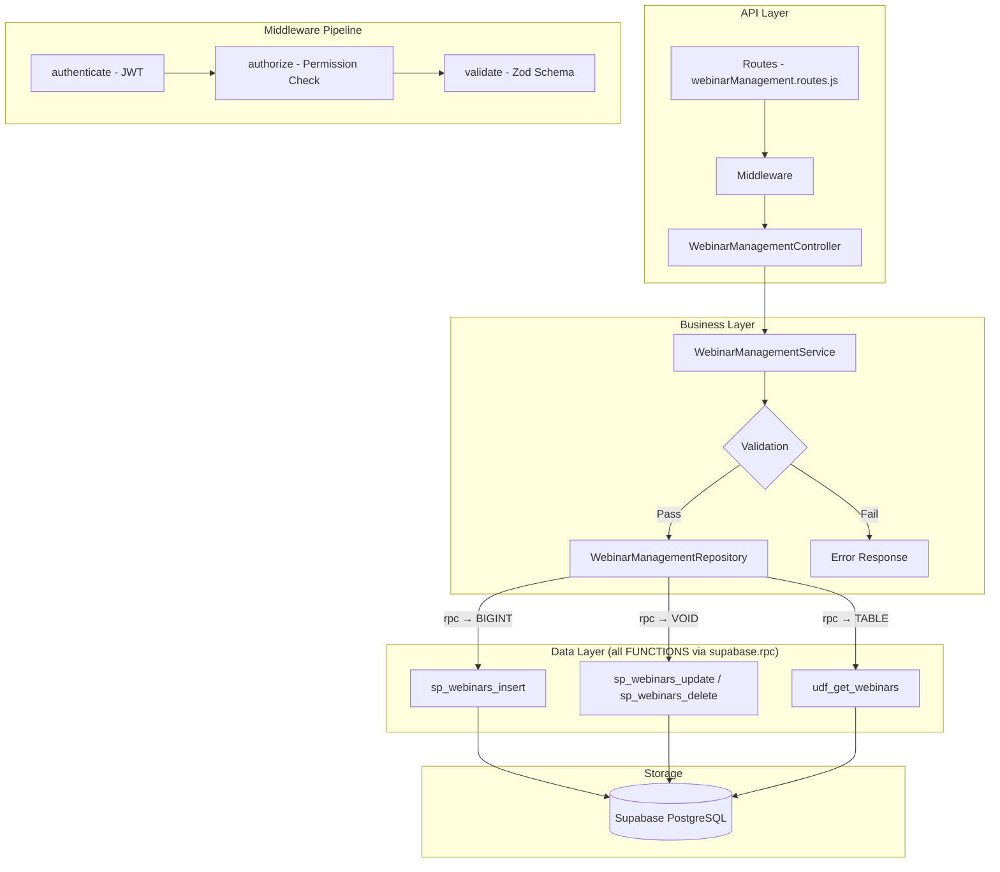

# GrowUpMore API — Webinar Management Module

## Postman Testing Guide

**Base URL:** `http://localhost:5001`
**API Prefix:** `/api/v1/webinar-management`
**Content-Type:** `application/json`
**Authentication:** All endpoints require `Bearer <access_token>` in Authorization header

---

## Architecture Flow



---

## Prerequisites

Before testing, ensure:

1. **Authentication**: Login via `POST /api/v1/auth/login` to obtain `access_token`
2. **Permissions**: Ensure webinar permissions are set up (webinar.create, webinar.read, webinar.update, webinar.delete)
3. **Instructor Account**: At least one active instructor user account exists
4. **Course Setup**: Optional - courses and chapters should exist if linking webinars to them

---

## Complete Endpoint Reference

### Test Order (follow this sequence in Postman)

| # | Endpoint | Permission | Purpose |
|---|----------|-----------|---------|
| 1 | `POST /webinars` | `webinar.create` | Create a webinar |
| 2 | `GET /webinars` | `webinar.read` | List all webinars with filters |
| 3 | `GET /webinars/:id` | `webinar.read` | Get webinar by ID |
| 4 | `PATCH /webinars/:id` | `webinar.update` | Update webinar details |
| 5 | `DELETE /webinars/:id` | `webinar.delete` | Soft delete webinar |
| 6 | `POST /webinars/:id/restore` | `webinar.update` | Restore soft-deleted webinar |

---

## Common Headers (All Requests)

| Key | Value |
|-----|-------|
| Authorization | Bearer `<access_token>` |
| Content-Type | `application/json` |

---

## 1. WEBINARS

### 1.1 Create Webinar

**`POST /api/v1/webinar-management/webinars`**

**Permission:** `webinar.create`

**Headers:**
```
Authorization: Bearer {{access_token}}
Content-Type: application/json
```

**Request Body:**

| Field | Type | Required | Description |
|-------|------|----------|-------------|
| webinarOwner | string | No | Owner type (default: 'system') |
| instructorId | number | No | ID of the webinar instructor |
| courseId | number | No | ID of associated course |
| chapterId | number | No | ID of associated chapter |
| code | string | No | Unique webinar code |
| slug | string | No | URL-friendly slug |
| isFree | boolean | No | Whether webinar is free (default: false) |
| price | number | No | Price (default: 0.00) |
| scheduledAt | timestamp | No | When the webinar is scheduled |
| durationMinutes | number | No | Duration in minutes |
| maxAttendees | number | No | Maximum number of attendees |
| registeredCount | number | No | Current registration count (default: 0) |
| meetingPlatform | string | No | Platform type (default: 'zoom') |
| meetingUrl | string | No | URL to join the webinar |
| meetingId | string | No | Meeting platform ID |
| meetingPassword | string | No | Meeting password if required |
| recordingUrl | string | No | URL to webinar recording |
| webinarStatus | string | No | scheduled, live, completed, cancelled, postponed (default: 'scheduled') |
| displayOrder | number | No | Display order (default: 0) |
| isActive | boolean | No | Active status (default: true) |

**Example Request:**
```json
{
  "webinarOwner": "instructor",
  "instructorId": 1,
  "courseId": 1,
  "chapterId": 1,
  "code": "WEB20260405001",
  "slug": "introduction-to-web-design",
  "isFree": false,
  "price": 49.99,
  "scheduledAt": "2026-04-15T14:00:00Z",
  "durationMinutes": 90,
  "maxAttendees": 100,
  "registeredCount": 0,
  "meetingPlatform": "zoom",
  "meetingUrl": "https://zoom.us/j/1234567890",
  "meetingId": "1234567890",
  "meetingPassword": "abc123",
  "recordingUrl": "https://recordings.example.com/webinar001",
  "webinarStatus": "scheduled",
  "displayOrder": 1,
  "isActive": true
}
```

**Expected Response (201):**
```json
{
  "success": true,
  "message": "Webinar created successfully",
  "data": {
    "id": 1
  }
}
```

**Postman Tests:**
```javascript
pm.test("Status is 201", () => pm.response.to.have.status(201));
const json = pm.response.json();
pm.test("Has webinar ID", () => pm.expect(json.data.id).to.be.a("number"));
pm.collectionVariables.set("webinarId", json.data.id);
```

---

### 1.2 List Webinars

**`GET /api/v1/webinar-management/webinars`**

**Permission:** `webinar.read`

**Headers:**
```
Authorization: Bearer {{access_token}}
Content-Type: application/json
```

**Query Parameters:**

| Parameter | Type | Required | Description |
|-----------|------|----------|-------------|
| page | number | No | Page number (default: 1) |
| limit | number | No | Results per page (default: 20) |
| search | string | No | Search by code or slug |
| sortBy | string | No | Sort field (default: 'webinar_scheduled_at') |
| sortDir | string | No | ASC or DESC (default: 'DESC') |
| webinarOwner | string | No | Filter by owner type |
| webinarStatus | string | No | Filter by status (scheduled, live, completed, cancelled, postponed) |
| meetingPlatform | string | No | Filter by platform |
| courseId | number | No | Filter by course ID |
| chapterId | number | No | Filter by chapter ID |
| instructorId | number | No | Filter by instructor ID |
| isFree | boolean | No | Filter by free/paid status |
| isActive | boolean | No | Filter by active status |

**Example Request:**
```
GET /api/v1/webinar-management/webinars?page=1&limit=20&webinarStatus=scheduled&sortBy=scheduledAt&sortDir=DESC
```

**Expected Response (200):**
```json
{
  "success": true,
  "message": "Webinars retrieved successfully",
  "data": [
    {
      "id": 1,
      "webinarOwner": "instructor",
      "instructorId": 1,
      "courseId": 1,
      "chapterId": 1,
      "code": "WEB20260405001",
      "slug": "introduction-to-web-design",
      "isFree": false,
      "price": 49.99,
      "scheduledAt": "2026-04-15T14:00:00Z",
      "durationMinutes": 90,
      "maxAttendees": 100,
      "registeredCount": 25,
      "meetingPlatform": "zoom",
      "meetingUrl": "https://zoom.us/j/1234567890",
      "meetingId": "1234567890",
      "meetingPassword": "abc123",
      "recordingUrl": "https://recordings.example.com/webinar001",
      "webinarStatus": "scheduled",
      "displayOrder": 1,
      "isActive": true,
      "createdAt": "2026-04-05T10:30:00Z",
      "updatedAt": "2026-04-05T10:30:00Z"
    }
  ],
  "pagination": {
    "page": 1,
    "limit": 20,
    "total": 1,
    "pages": 1
  }
}
```

**Postman Tests:**
```javascript
pm.test("Status is 200", () => pm.response.to.have.status(200));
const json = pm.response.json();
pm.test("Data is array", () => pm.expect(json.data).to.be.an("array"));
if (json.data.length > 0) {
  pm.collectionVariables.set("webinarId", json.data[0].id);
}
```

---

### 1.3 Get Webinar by ID

**`GET /api/v1/webinar-management/webinars/:id`**

**Permission:** `webinar.read`

**Headers:**
```
Authorization: Bearer {{access_token}}
Content-Type: application/json
```

**Example Request:**
```
GET /api/v1/webinar-management/webinars/1
```

**Expected Response (200):**
```json
{
  "success": true,
  "message": "Webinar retrieved successfully",
  "data": {
    "id": 1,
    "webinarOwner": "instructor",
    "instructorId": 1,
    "courseId": 1,
    "chapterId": 1,
    "code": "WEB20260405001",
    "slug": "introduction-to-web-design",
    "isFree": false,
    "price": 49.99,
    "scheduledAt": "2026-04-15T14:00:00Z",
    "durationMinutes": 90,
    "maxAttendees": 100,
    "registeredCount": 25,
    "meetingPlatform": "zoom",
    "meetingUrl": "https://zoom.us/j/1234567890",
    "meetingId": "1234567890",
    "meetingPassword": "abc123",
    "recordingUrl": "https://recordings.example.com/webinar001",
    "webinarStatus": "scheduled",
    "displayOrder": 1,
    "isActive": true,
    "createdAt": "2026-04-05T10:30:00Z",
    "updatedAt": "2026-04-05T10:30:00Z"
  }
}
```

**Postman Tests:**
```javascript
pm.test("Status is 200", () => pm.response.to.have.status(200));
const json = pm.response.json();
pm.test("Has webinar data", () => pm.expect(json.data.id).to.exist);
pm.test("Webinar ID matches", () => pm.expect(json.data.id).to.equal(parseInt(pm.variables.get("webinarId"))));
```

---

### 1.4 Update Webinar

**`PATCH /api/v1/webinar-management/webinars/:id`**

**Permission:** `webinar.update`

**Headers:**
```
Authorization: Bearer {{access_token}}
Content-Type: application/json
```

**Request Body:**

| Field | Type | Required | Description |
|-------|------|----------|-------------|
| webinarOwner | string | No | Owner type |
| instructorId | number | No | Instructor ID |
| courseId | number | No | Course ID |
| chapterId | number | No | Chapter ID |
| code | string | No | Webinar code |
| slug | string | No | URL slug |
| isFree | boolean | No | Free status |
| price | number | No | Price |
| scheduledAt | timestamp | No | Scheduled time |
| durationMinutes | number | No | Duration in minutes |
| maxAttendees | number | No | Max attendees |
| registeredCount | number | No | Registered count |
| meetingPlatform | string | No | Platform |
| meetingUrl | string | No | Meeting URL |
| meetingId | string | No | Meeting ID |
| meetingPassword | string | No | Meeting password |
| recordingUrl | string | No | Recording URL |
| webinarStatus | string | No | Status |
| displayOrder | number | No | Display order |
| isActive | boolean | No | Active status |

**Example Request:**
```json
{
  "price": 59.99,
  "maxAttendees": 150,
  "webinarStatus": "ongoing",
  "recordingUrl": "https://recordings.example.com/webinar001-final",
  "isActive": true
}
```

**Expected Response (200):**
```json
{
  "success": true,
  "message": "Webinar updated successfully",
  "data": {
    "id": 1,
    "webinarOwner": "instructor",
    "instructorId": 1,
    "courseId": 1,
    "chapterId": 1,
    "code": "WEB20260405001",
    "slug": "introduction-to-web-design",
    "isFree": false,
    "price": 59.99,
    "scheduledAt": "2026-04-15T14:00:00Z",
    "durationMinutes": 90,
    "maxAttendees": 150,
    "registeredCount": 25,
    "meetingPlatform": "zoom",
    "meetingUrl": "https://zoom.us/j/1234567890",
    "meetingId": "1234567890",
    "meetingPassword": "abc123",
    "recordingUrl": "https://recordings.example.com/webinar001-final",
    "webinarStatus": "ongoing",
    "displayOrder": 1,
    "isActive": true,
    "createdAt": "2026-04-05T10:30:00Z",
    "updatedAt": "2026-04-05T12:45:00Z"
  }
}
```

**Postman Tests:**
```javascript
pm.test("Status is 200", () => pm.response.to.have.status(200));
const json = pm.response.json();
pm.test("Price updated", () => pm.expect(json.data.price).to.equal(59.99));
pm.test("Status updated", () => pm.expect(json.data.webinarStatus).to.equal("ongoing"));
```

---

### 1.5 Delete Webinar

**`DELETE /api/v1/webinar-management/webinars/:id`**

**Permission:** `webinar.delete`

**Headers:**
```
Authorization: Bearer {{access_token}}
Content-Type: application/json
```

**Example Request:**
```
DELETE /api/v1/webinar-management/webinars/1
```

**Expected Response (200):**
```json
{
  "success": true,
  "message": "Webinar deleted successfully",
  "data": {
    "id": 1,
    "deletedAt": "2026-04-05T13:00:00Z"
  }
}
```

**Postman Tests:**
```javascript
pm.test("Status is 200", () => pm.response.to.have.status(200));
const json = pm.response.json();
pm.test("Deleted webinar ID matches", () => pm.expect(json.data.id).to.equal(parseInt(pm.variables.get("webinarId"))));
pm.test("Has deletedAt timestamp", () => pm.expect(json.data.deletedAt).to.exist);
```

---

### 1.6 Restore Webinar

**`POST /api/v1/webinar-management/webinars/:id/restore`**

**Permission:** `webinar.update`

**Headers:**
```
Authorization: Bearer {{access_token}}
Content-Type: application/json
```

**Request Body:**
```json
{}
```

**Example Request:**
```
POST /api/v1/webinar-management/webinars/1/restore
```

**Expected Response (200):**
```json
{
  "success": true,
  "message": "Webinar restored successfully",
  "data": {
    "id": 1,
    "webinarOwner": "instructor",
    "instructorId": 1,
    "courseId": 1,
    "chapterId": 1,
    "code": "WEB20260405001",
    "slug": "introduction-to-web-design",
    "isFree": false,
    "price": 59.99,
    "scheduledAt": "2026-04-15T14:00:00Z",
    "durationMinutes": 90,
    "maxAttendees": 150,
    "registeredCount": 25,
    "meetingPlatform": "zoom",
    "meetingUrl": "https://zoom.us/j/1234567890",
    "meetingId": "1234567890",
    "meetingPassword": "abc123",
    "recordingUrl": "https://recordings.example.com/webinar001-final",
    "webinarStatus": "ongoing",
    "displayOrder": 1,
    "isActive": true,
    "createdAt": "2026-04-05T10:30:00Z",
    "updatedAt": "2026-04-05T13:05:00Z",
    "restoredAt": "2026-04-05T13:05:00Z"
  }
}
```

**Postman Tests:**
```javascript
pm.test("Status is 200", () => pm.response.to.have.status(200));
const json = pm.response.json();
pm.test("Has restoredAt timestamp", () => pm.expect(json.data.restoredAt).to.exist);
pm.test("Webinar is active", () => pm.expect(json.data.isActive).to.equal(true));
```

---

## Error Responses

### 400 Bad Request
```json
{
  "success": false,
  "message": "Validation error",
  "errors": [
    {
      "field": "price",
      "message": "Price must be a non-negative number"
    }
  ]
}
```

### 401 Unauthorized
```json
{
  "success": false,
  "message": "Unauthorized. Invalid or missing access token."
}
```

### 403 Forbidden
```json
{
  "success": false,
  "message": "You do not have permission to perform this action."
}
```

### 404 Not Found
```json
{
  "success": false,
  "message": "Webinar not found."
}
```

### 500 Internal Server Error
```json
{
  "success": false,
  "message": "An unexpected error occurred. Please try again later."
}
```
