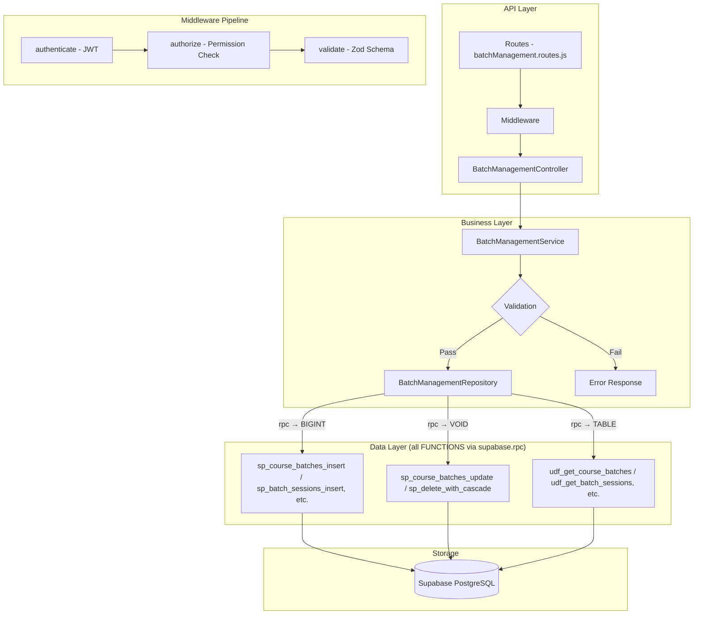

# GrowUpMore API — Batch Management Module

## Postman Testing Guide

**Base URL:** `http://localhost:5001`
**API Prefix:** `/api/v1/batch-management`
**Content-Type:** `application/json`
**Authentication:** All endpoints require `Bearer <access_token>` in Authorization header

---

## Architecture Flow



---

## Prerequisites

Before testing, ensure:

1. **Authentication**: Login via `POST /api/v1/auth/login` to obtain `access_token`
2. **Permissions**: Ensure batch permissions are set up (course_batch.*, batch_translation.*, batch_session.*, batch_session_translation.*)
3. **Course Setup**: Courses must exist before creating batches
4. **Instructor Account**: At least one active instructor user account exists
5. **Languages**: Language records should exist for batch translations

---

## Complete Endpoint Reference

### Test Order (follow this sequence in Postman)

| # | Endpoint | Permission | Purpose |
|---|----------|-----------|---------|
| 1 | `POST /course-batches` | `course_batch.create` | Create a course batch |
| 2 | `GET /course-batches` | `course_batch.read` | List all course batches with filters |
| 3 | `GET /course-batches/:id` | `course_batch.read` | Get course batch by ID |
| 4 | `PATCH /course-batches/:id` | `course_batch.update` | Update course batch |
| 5 | `DELETE /course-batches/:id` | `course_batch.delete` | Soft delete course batch |
| 6 | `POST /course-batches/:id/restore` | `course_batch.update` | Restore soft-deleted course batch |
| 7 | `POST /batch-translations` | `batch_translation.create` | Create batch translation |
| 8 | `PATCH /batch-translations/:id` | `batch_translation.update` | Update batch translation |
| 9 | `DELETE /batch-translations/:id` | `batch_translation.delete` | Soft delete batch translation |
| 10 | `POST /batch-translations/:id/restore` | `batch_translation.update` | Restore batch translation |
| 11 | `POST /batch-sessions` | `batch_session.create` | Create batch session |
| 12 | `GET /batch-sessions` | `batch_session.read` | List all batch sessions with filters |
| 13 | `GET /batch-sessions/:id` | `batch_session.read` | Get batch session by ID |
| 14 | `PATCH /batch-sessions/:id` | `batch_session.update` | Update batch session |
| 15 | `DELETE /batch-sessions/:id` | `batch_session.delete` | Soft delete batch session |
| 16 | `POST /batch-sessions/:id/restore` | `batch_session.update` | Restore batch session |
| 17 | `POST /batch-session-translations` | `batch_session_translation.create` | Create batch session translation |
| 18 | `PATCH /batch-session-translations/:id` | `batch_session_translation.update` | Update batch session translation |
| 19 | `DELETE /batch-session-translations/:id` | `batch_session_translation.delete` | Soft delete batch session translation |
| 20 | `POST /batch-session-translations/:id/restore` | `batch_session_translation.update` | Restore batch session translation |

---

## Common Headers (All Requests)

| Key | Value |
|-----|-------|
| Authorization | Bearer `<access_token>` |
| Content-Type | `application/json` |

---

## 1. COURSE BATCHES

### 1.1 Create Course Batch

**`POST /api/v1/batch-management/course-batches`**

**Permission:** `course_batch.create`

**Headers:**
```
Authorization: Bearer {{access_token}}
Content-Type: application/json
```

**Request Body:**

| Field | Type | Required | Description |
|-------|------|----------|-------------|
| courseId | number | Yes | ID of the course |
| batchOwner | string | No | Owner type (default: 'system') |
| instructorId | number | No | ID of the batch instructor |
| code | string | No | Unique batch code |
| isFree | boolean | No | Whether batch is free (default: false) |
| price | number | No | Price (default: 0) |
| includesCourseAccess | boolean | No | Includes course access (default: false) |
| maxStudents | number | No | Maximum students |
| startsAt | timestamp | No | Batch start date/time |
| endsAt | timestamp | No | Batch end date/time |
| schedule | object | No | Schedule configuration |
| meetingPlatform | string | No | Platform (default: 'zoom') |
| batchStatus | string | No | upcoming, ongoing, completed, cancelled (default: 'upcoming') |
| displayOrder | number | No | Display order (default: 0) |

**Example Request:**
```json
{
  "courseId": 1,
  "batchOwner": "instructor",
  "instructorId": 1,
  "code": "BATCH20260405001",
  "isFree": false,
  "price": 199.99,
  "includesCourseAccess": true,
  "maxStudents": 50,
  "startsAt": "2026-05-01T09:00:00Z",
  "endsAt": "2026-06-30T17:00:00Z",
  "schedule": {
    "timezone": "America/New_York",
    "recurring": "weekly",
    "daysOfWeek": ["Monday", "Wednesday", "Friday"],
    "startTime": "14:00",
    "endTime": "16:00"
  },
  "meetingPlatform": "zoom",
  "batchStatus": "upcoming",
  "displayOrder": 1
}
```

**Expected Response (201):**
```json
{
  "success": true,
  "message": "Course batch created successfully",
  "data": {
    "id": 1
  }
}
```

**Postman Tests:**
```javascript
pm.test("Status is 201", () => pm.response.to.have.status(201));
const json = pm.response.json();
pm.test("Has batch ID", () => pm.expect(json.data.id).to.be.a("number"));
pm.collectionVariables.set("batchId", json.data.id);
```

---

### 1.2 List Course Batches

**`GET /api/v1/batch-management/course-batches`**

**Permission:** `course_batch.read`

**Headers:**
```
Authorization: Bearer {{access_token}}
Content-Type: application/json
```

**Query Parameters:**

| Parameter | Type | Required | Description |
|-----------|------|----------|-------------|
| page | number | No | Page number (default: 1) |
| limit | number | No | Results per page (default: 20) |
| courseId | number | No | Filter by course ID |
| batchOwner | string | No | Filter by owner type |
| batchStatus | string | No | Filter by status (upcoming, ongoing, completed, cancelled) |
| isFree | boolean | No | Filter by free/paid status |
| meetingPlatform | string | No | Filter by platform |
| instructorId | number | No | Filter by instructor ID |

**Example Request:**
```
GET /api/v1/batch-management/course-batches?page=1&limit=20&batchStatus=upcoming
```

**Expected Response (200):**
```json
{
  "success": true,
  "message": "Course batches retrieved successfully",
  "data": [
    {
      "id": 1,
      "courseId": 1,
      "batchOwner": "instructor",
      "instructorId": 1,
      "code": "BATCH20260405001",
      "isFree": false,
      "price": 199.99,
      "includesCourseAccess": true,
      "maxStudents": 50,
      "enrolledCount": 35,
      "startsAt": "2026-05-01T09:00:00Z",
      "endsAt": "2026-06-30T17:00:00Z",
      "schedule": {
        "timezone": "America/New_York",
        "recurring": "weekly",
        "daysOfWeek": ["Monday", "Wednesday", "Friday"],
        "startTime": "14:00",
        "endTime": "16:00"
      },
      "meetingPlatform": "zoom",
      "batchStatus": "upcoming",
      "displayOrder": 1,
      "createdAt": "2026-04-05T10:30:00Z",
      "updatedAt": "2026-04-05T10:30:00Z"
    }
  ],
  "pagination": {
    "page": 1,
    "limit": 20,
    "total": 1,
    "pages": 1
  }
}
```

**Postman Tests:**
```javascript
pm.test("Status is 200", () => pm.response.to.have.status(200));
const json = pm.response.json();
pm.test("Data is array", () => pm.expect(json.data).to.be.an("array"));
if (json.data.length > 0) {
  pm.collectionVariables.set("batchId", json.data[0].id);
}
```

---

### 1.3 Get Course Batch by ID

**`GET /api/v1/batch-management/course-batches/:id`**

**Permission:** `course_batch.read`

**Headers:**
```
Authorization: Bearer {{access_token}}
Content-Type: application/json
```

**Example Request:**
```
GET /api/v1/batch-management/course-batches/1
```

**Expected Response (200):**
```json
{
  "success": true,
  "message": "Course batch retrieved successfully",
  "data": {
    "id": 1,
    "courseId": 1,
    "batchOwner": "instructor",
    "instructorId": 1,
    "code": "BATCH20260405001",
    "isFree": false,
    "price": 199.99,
    "includesCourseAccess": true,
    "maxStudents": 50,
    "enrolledCount": 35,
    "startsAt": "2026-05-01T09:00:00Z",
    "endsAt": "2026-06-30T17:00:00Z",
    "schedule": {
      "timezone": "America/New_York",
      "recurring": "weekly",
      "daysOfWeek": ["Monday", "Wednesday", "Friday"],
      "startTime": "14:00",
      "endTime": "16:00"
    },
    "meetingPlatform": "zoom",
    "batchStatus": "upcoming",
    "displayOrder": 1,
    "createdAt": "2026-04-05T10:30:00Z",
    "updatedAt": "2026-04-05T10:30:00Z"
  }
}
```

**Postman Tests:**
```javascript
pm.test("Status is 200", () => pm.response.to.have.status(200));
const json = pm.response.json();
pm.test("Has batch data", () => pm.expect(json.data.id).to.exist);
pm.test("Batch ID matches", () => pm.expect(json.data.id).to.equal(parseInt(pm.variables.get("batchId"))));
```

---

### 1.4 Update Course Batch

**`PATCH /api/v1/batch-management/course-batches/:id`**

**Permission:** `course_batch.update`

**Headers:**
```
Authorization: Bearer {{access_token}}
Content-Type: application/json
```

**Request Body:**

| Field | Type | Required | Description |
|-------|------|----------|-------------|
| code | string | No | Batch code |
| isFree | boolean | No | Free status |
| price | number | No | Price |
| includesCourseAccess | boolean | No | Course access |
| maxStudents | number | No | Max students |
| startsAt | timestamp | No | Start date/time |
| endsAt | timestamp | No | End date/time |
| schedule | object | No | Schedule config |
| meetingPlatform | string | No | Platform |
| batchStatus | string | No | Status |
| displayOrder | number | No | Display order |

**Example Request:**
```json
{
  "price": 249.99,
  "maxStudents": 75,
  "batchStatus": "ongoing",
  "meetingPlatform": "google-meet"
}
```

**Expected Response (200):**
```json
{
  "success": true,
  "message": "Course batch updated successfully",
  "data": {
    "id": 1,
    "courseId": 1,
    "batchOwner": "instructor",
    "instructorId": 1,
    "code": "BATCH20260405001",
    "isFree": false,
    "price": 249.99,
    "includesCourseAccess": true,
    "maxStudents": 75,
    "enrolledCount": 35,
    "startsAt": "2026-05-01T09:00:00Z",
    "endsAt": "2026-06-30T17:00:00Z",
    "schedule": {
      "timezone": "America/New_York",
      "recurring": "weekly",
      "daysOfWeek": ["Monday", "Wednesday", "Friday"],
      "startTime": "14:00",
      "endTime": "16:00"
    },
    "meetingPlatform": "google-meet",
    "batchStatus": "ongoing",
    "displayOrder": 1,
    "createdAt": "2026-04-05T10:30:00Z",
    "updatedAt": "2026-04-05T11:00:00Z"
  }
}
```

**Postman Tests:**
```javascript
pm.test("Status is 200", () => pm.response.to.have.status(200));
const json = pm.response.json();
pm.test("Price updated", () => pm.expect(json.data.price).to.equal(249.99));
pm.test("Status updated", () => pm.expect(json.data.batchStatus).to.equal("ongoing"));
```

---

### 1.5 Delete Course Batch

**`DELETE /api/v1/batch-management/course-batches/:id`**

**Permission:** `course_batch.delete`

**Headers:**
```
Authorization: Bearer {{access_token}}
Content-Type: application/json
```

**Example Request:**
```
DELETE /api/v1/batch-management/course-batches/1
```

**Expected Response (200):**
```json
{
  "success": true,
  "message": "Course batch deleted successfully",
  "data": {
    "id": 1,
    "deletedAt": "2026-04-05T11:15:00Z"
  }
}
```

**Postman Tests:**
```javascript
pm.test("Status is 200", () => pm.response.to.have.status(200));
const json = pm.response.json();
pm.test("Deleted batch ID matches", () => pm.expect(json.data.id).to.equal(parseInt(pm.variables.get("batchId"))));
pm.test("Has deletedAt timestamp", () => pm.expect(json.data.deletedAt).to.exist);
```

---

### 1.6 Restore Course Batch

**`POST /api/v1/batch-management/course-batches/:id/restore`**

**Permission:** `course_batch.update`

**Headers:**
```
Authorization: Bearer {{access_token}}
Content-Type: application/json
```

**Request Body:**
```json
{}
```

**Example Request:**
```
POST /api/v1/batch-management/course-batches/1/restore
```

**Expected Response (200):**
```json
{
  "success": true,
  "message": "Course batch restored successfully",
  "data": {
    "id": 1,
    "courseId": 1,
    "batchOwner": "instructor",
    "instructorId": 1,
    "code": "BATCH20260405001",
    "isFree": false,
    "price": 249.99,
    "includesCourseAccess": true,
    "maxStudents": 75,
    "enrolledCount": 35,
    "startsAt": "2026-05-01T09:00:00Z",
    "endsAt": "2026-06-30T17:00:00Z",
    "schedule": {
      "timezone": "America/New_York",
      "recurring": "weekly",
      "daysOfWeek": ["Monday", "Wednesday", "Friday"],
      "startTime": "14:00",
      "endTime": "16:00"
    },
    "meetingPlatform": "google-meet",
    "batchStatus": "ongoing",
    "displayOrder": 1,
    "createdAt": "2026-04-05T10:30:00Z",
    "updatedAt": "2026-04-05T11:20:00Z",
    "restoredAt": "2026-04-05T11:20:00Z"
  }
}
```

**Postman Tests:**
```javascript
pm.test("Status is 200", () => pm.response.to.have.status(200));
const json = pm.response.json();
pm.test("Has restoredAt timestamp", () => pm.expect(json.data.restoredAt).to.exist);
```

---

## 2. BATCH TRANSLATIONS

### 2.1 Create Batch Translation

**`POST /api/v1/batch-management/batch-translations`**

**Permission:** `batch_translation.create`

**Headers:**
```
Authorization: Bearer {{access_token}}
Content-Type: application/json
```

**Request Body:**

| Field | Type | Required | Description |
|-------|------|----------|-------------|
| batchId | number | Yes | ID of the batch |
| languageId | number | Yes | ID of the language |
| title | string | Yes | Translation title |
| description | string | No | Translation description |
| shortDescription | string | No | Short description |

**Example Request:**
```json
{
  "batchId": 1,
  "languageId": 1,
  "title": "Professional Web Development Batch",
  "description": "Comprehensive batch covering HTML, CSS, JavaScript, and React frameworks. Includes live coding sessions and project work.",
  "shortDescription": "Master web development with hands-on practice"
}
```

**Expected Response (201):**
```json
{
  "success": true,
  "message": "Batch translation created successfully",
  "data": {
    "id": 1
  }
}
```

**Postman Tests:**
```javascript
pm.test("Status is 201", () => pm.response.to.have.status(201));
const json = pm.response.json();
pm.test("Has translation ID", () => pm.expect(json.data.id).to.be.a("number"));
pm.collectionVariables.set("batchTranslationId", json.data.id);
```

---

### 2.2 Update Batch Translation

**`PATCH /api/v1/batch-management/batch-translations/:id`**

**Permission:** `batch_translation.update`

**Headers:**
```
Authorization: Bearer {{access_token}}
Content-Type: application/json
```

**Request Body:**

| Field | Type | Required | Description |
|-------|------|----------|-------------|
| title | string | No | Title |
| description | string | No | Description |
| shortDescription | string | No | Short description |
| tags | array | No | Tags array |
| metaTitle | string | No | Meta title |
| metaDescription | string | No | Meta description |
| metaKeywords | string | No | Meta keywords |
| canonicalUrl | string | No | Canonical URL |
| ogSiteName | string | No | OG site name |
| ogTitle | string | No | OG title |
| ogDescription | string | No | OG description |
| ogType | string | No | OG type |
| ogImage | string | No | OG image |
| ogUrl | string | No | OG URL |
| twitterSite | string | No | Twitter site |
| twitterTitle | string | No | Twitter title |
| twitterDescription | string | No | Twitter description |
| twitterImage | string | No | Twitter image |
| twitterCard | string | No | Twitter card type |
| robotsDirective | string | No | Robots directive |
| focusKeyword | string | No | Focus keyword |
| structuredData | object | No | Structured data |
| isActive | boolean | No | Active status |

**Example Request:**
```json
{
  "title": "Updated Professional Web Development Batch",
  "description": "Enhanced batch with new modules on TypeScript and advanced React patterns",
  "metaTitle": "Advanced Web Development Batch",
  "metaDescription": "Learn advanced web development techniques"
}
```

**Expected Response (200):**
```json
{
  "success": true,
  "message": "Batch translation updated successfully",
  "data": {
    "id": 1,
    "batchId": 1,
    "languageId": 1,
    "title": "Updated Professional Web Development Batch",
    "description": "Enhanced batch with new modules on TypeScript and advanced React patterns",
    "shortDescription": "Master web development with hands-on practice",
    "metaTitle": "Advanced Web Development Batch",
    "metaDescription": "Learn advanced web development techniques",
    "createdAt": "2026-04-05T10:30:00Z",
    "updatedAt": "2026-04-05T11:00:00Z"
  }
}
```

**Postman Tests:**
```javascript
pm.test("Status is 200", () => pm.response.to.have.status(200));
const json = pm.response.json();
pm.test("Title updated", () => pm.expect(json.data.title).to.contain("Updated"));
```

---

### 2.3 Delete Batch Translation

**`DELETE /api/v1/batch-management/batch-translations/:id`**

**Permission:** `batch_translation.delete`

**Headers:**
```
Authorization: Bearer {{access_token}}
Content-Type: application/json
```

**Example Request:**
```
DELETE /api/v1/batch-management/batch-translations/1
```

**Expected Response (200):**
```json
{
  "success": true,
  "message": "Batch translation deleted successfully",
  "data": {
    "id": 1,
    "deletedAt": "2026-04-05T11:15:00Z"
  }
}
```

**Postman Tests:**
```javascript
pm.test("Status is 200", () => pm.response.to.have.status(200));
const json = pm.response.json();
pm.test("Has deletedAt timestamp", () => pm.expect(json.data.deletedAt).to.exist);
```

---

### 2.4 Restore Batch Translation

**`POST /api/v1/batch-management/batch-translations/:id/restore`**

**Permission:** `batch_translation.update`

**Headers:**
```
Authorization: Bearer {{access_token}}
Content-Type: application/json
```

**Request Body:**
```json
{}
```

**Example Request:**
```
POST /api/v1/batch-management/batch-translations/1/restore
```

**Expected Response (200):**
```json
{
  "success": true,
  "message": "Batch translation restored successfully",
  "data": {
    "id": 1,
    "batchId": 1,
    "languageId": 1,
    "title": "Updated Professional Web Development Batch",
    "description": "Enhanced batch with new modules on TypeScript and advanced React patterns",
    "shortDescription": "Master web development with hands-on practice",
    "metaTitle": "Advanced Web Development Batch",
    "metaDescription": "Learn advanced web development techniques",
    "createdAt": "2026-04-05T10:30:00Z",
    "updatedAt": "2026-04-05T11:20:00Z",
    "restoredAt": "2026-04-05T11:20:00Z"
  }
}
```

**Postman Tests:**
```javascript
pm.test("Status is 200", () => pm.response.to.have.status(200));
const json = pm.response.json();
pm.test("Has restoredAt timestamp", () => pm.expect(json.data.restoredAt).to.exist);
```

---

## 3. BATCH SESSIONS

### 3.1 Create Batch Session

**`POST /api/v1/batch-management/batch-sessions`**

**Permission:** `batch_session.create`

**Headers:**
```
Authorization: Bearer {{access_token}}
Content-Type: application/json
```

**Request Body:**

| Field | Type | Required | Description |
|-------|------|----------|-------------|
| batchId | number | Yes | ID of the batch |
| sessionNumber | number | Yes | Session number |
| sessionDate | date | No | Session date (YYYY-MM-DD) |
| scheduledAt | timestamp | No | Scheduled date/time |
| durationMinutes | number | No | Duration in minutes |
| meetingUrl | string | No | Meeting URL |
| meetingId | string | No | Meeting ID |
| recordingUrl | string | No | Recording URL |
| sessionStatus | string | No | scheduled, ongoing, completed, cancelled (default: 'scheduled') |
| displayOrder | number | No | Display order (default: 0) |

**Example Request:**
```json
{
  "batchId": 1,
  "sessionNumber": 1,
  "sessionDate": "2026-05-01",
  "scheduledAt": "2026-05-01T14:00:00Z",
  "durationMinutes": 120,
  "meetingUrl": "https://zoom.us/j/1234567890",
  "meetingId": "1234567890",
  "recordingUrl": "https://recordings.example.com/session001",
  "sessionStatus": "scheduled",
  "displayOrder": 1
}
```

**Expected Response (201):**
```json
{
  "success": true,
  "message": "Batch session created successfully",
  "data": {
    "id": 1
  }
}
```

**Postman Tests:**
```javascript
pm.test("Status is 201", () => pm.response.to.have.status(201));
const json = pm.response.json();
pm.test("Has session ID", () => pm.expect(json.data.id).to.be.a("number"));
pm.collectionVariables.set("sessionId", json.data.id);
```

---

### 3.2 List Batch Sessions

**`GET /api/v1/batch-management/batch-sessions`**

**Permission:** `batch_session.read`

**Headers:**
```
Authorization: Bearer {{access_token}}
Content-Type: application/json
```

**Query Parameters:**

| Parameter | Type | Required | Description |
|-----------|------|----------|-------------|
| page | number | No | Page number (default: 1) |
| limit | number | No | Results per page (default: 20) |
| batchId | number | No | Filter by batch ID |
| sessionStatus | string | No | Filter by status (scheduled, ongoing, completed, cancelled) |

**Example Request:**
```
GET /api/v1/batch-management/batch-sessions?batchId=1&sessionStatus=scheduled&page=1&limit=20
```

**Expected Response (200):**
```json
{
  "success": true,
  "message": "Batch sessions retrieved successfully",
  "data": [
    {
      "id": 1,
      "batchId": 1,
      "sessionNumber": 1,
      "sessionDate": "2026-05-01",
      "scheduledAt": "2026-05-01T14:00:00Z",
      "durationMinutes": 120,
      "meetingUrl": "https://zoom.us/j/1234567890",
      "meetingId": "1234567890",
      "recordingUrl": "https://recordings.example.com/session001",
      "sessionStatus": "scheduled",
      "displayOrder": 1,
      "attendanceCount": 25,
      "createdAt": "2026-04-05T10:30:00Z",
      "updatedAt": "2026-04-05T10:30:00Z"
    }
  ],
  "pagination": {
    "page": 1,
    "limit": 20,
    "total": 1,
    "pages": 1
  }
}
```

**Postman Tests:**
```javascript
pm.test("Status is 200", () => pm.response.to.have.status(200));
const json = pm.response.json();
pm.test("Data is array", () => pm.expect(json.data).to.be.an("array"));
if (json.data.length > 0) {
  pm.collectionVariables.set("sessionId", json.data[0].id);
}
```

---

### 3.3 Get Batch Session by ID

**`GET /api/v1/batch-management/batch-sessions/:id`**

**Permission:** `batch_session.read`

**Headers:**
```
Authorization: Bearer {{access_token}}
Content-Type: application/json
```

**Example Request:**
```
GET /api/v1/batch-management/batch-sessions/1
```

**Expected Response (200):**
```json
{
  "success": true,
  "message": "Batch session retrieved successfully",
  "data": {
    "id": 1,
    "batchId": 1,
    "sessionNumber": 1,
    "sessionDate": "2026-05-01",
    "scheduledAt": "2026-05-01T14:00:00Z",
    "durationMinutes": 120,
    "meetingUrl": "https://zoom.us/j/1234567890",
    "meetingId": "1234567890",
    "recordingUrl": "https://recordings.example.com/session001",
    "sessionStatus": "scheduled",
    "displayOrder": 1,
    "attendanceCount": 25,
    "createdAt": "2026-04-05T10:30:00Z",
    "updatedAt": "2026-04-05T10:30:00Z"
  }
}
```

**Postman Tests:**
```javascript
pm.test("Status is 200", () => pm.response.to.have.status(200));
const json = pm.response.json();
pm.test("Has session data", () => pm.expect(json.data.id).to.exist);
pm.test("Session ID matches", () => pm.expect(json.data.id).to.equal(parseInt(pm.variables.get("sessionId"))));
```

---

### 3.4 Update Batch Session

**`PATCH /api/v1/batch-management/batch-sessions/:id`**

**Permission:** `batch_session.update`

**Headers:**
```
Authorization: Bearer {{access_token}}
Content-Type: application/json
```

**Request Body:**

| Field | Type | Required | Description |
|-------|------|----------|-------------|
| sessionDate | date | No | Session date |
| scheduledAt | timestamp | No | Scheduled time |
| durationMinutes | number | No | Duration |
| meetingUrl | string | No | Meeting URL |
| meetingId | string | No | Meeting ID |
| recordingUrl | string | No | Recording URL |
| sessionStatus | string | No | Status |
| displayOrder | number | No | Display order |

**Example Request:**
```json
{
  "durationMinutes": 150,
  "sessionStatus": "ongoing",
  "recordingUrl": "https://recordings.example.com/session001-final"
}
```

**Expected Response (200):**
```json
{
  "success": true,
  "message": "Batch session updated successfully",
  "data": {
    "id": 1,
    "batchId": 1,
    "sessionNumber": 1,
    "sessionDate": "2026-05-01",
    "scheduledAt": "2026-05-01T14:00:00Z",
    "durationMinutes": 150,
    "meetingUrl": "https://zoom.us/j/1234567890",
    "meetingId": "1234567890",
    "recordingUrl": "https://recordings.example.com/session001-final",
    "sessionStatus": "ongoing",
    "displayOrder": 1,
    "attendanceCount": 28,
    "createdAt": "2026-04-05T10:30:00Z",
    "updatedAt": "2026-04-05T11:00:00Z"
  }
}
```

**Postman Tests:**
```javascript
pm.test("Status is 200", () => pm.response.to.have.status(200));
const json = pm.response.json();
pm.test("Duration updated", () => pm.expect(json.data.durationMinutes).to.equal(150));
pm.test("Status updated", () => pm.expect(json.data.sessionStatus).to.equal("ongoing"));
```

---

### 3.5 Delete Batch Session

**`DELETE /api/v1/batch-management/batch-sessions/:id`**

**Permission:** `batch_session.delete`

**Headers:**
```
Authorization: Bearer {{access_token}}
Content-Type: application/json
```

**Example Request:**
```
DELETE /api/v1/batch-management/batch-sessions/1
```

**Expected Response (200):**
```json
{
  "success": true,
  "message": "Batch session deleted successfully",
  "data": {
    "id": 1,
    "deletedAt": "2026-04-05T11:15:00Z"
  }
}
```

**Postman Tests:**
```javascript
pm.test("Status is 200", () => pm.response.to.have.status(200));
const json = pm.response.json();
pm.test("Deleted session ID matches", () => pm.expect(json.data.id).to.equal(parseInt(pm.variables.get("sessionId"))));
pm.test("Has deletedAt timestamp", () => pm.expect(json.data.deletedAt).to.exist);
```

---

### 3.6 Restore Batch Session

**`POST /api/v1/batch-management/batch-sessions/:id/restore`**

**Permission:** `batch_session.update`

**Headers:**
```
Authorization: Bearer {{access_token}}
Content-Type: application/json
```

**Request Body:**
```json
{}
```

**Example Request:**
```
POST /api/v1/batch-management/batch-sessions/1/restore
```

**Expected Response (200):**
```json
{
  "success": true,
  "message": "Batch session restored successfully",
  "data": {
    "id": 1,
    "batchId": 1,
    "sessionNumber": 1,
    "sessionDate": "2026-05-01",
    "scheduledAt": "2026-05-01T14:00:00Z",
    "durationMinutes": 150,
    "meetingUrl": "https://zoom.us/j/1234567890",
    "meetingId": "1234567890",
    "recordingUrl": "https://recordings.example.com/session001-final",
    "sessionStatus": "ongoing",
    "displayOrder": 1,
    "attendanceCount": 28,
    "createdAt": "2026-04-05T10:30:00Z",
    "updatedAt": "2026-04-05T11:20:00Z",
    "restoredAt": "2026-04-05T11:20:00Z"
  }
}
```

**Postman Tests:**
```javascript
pm.test("Status is 200", () => pm.response.to.have.status(200));
const json = pm.response.json();
pm.test("Has restoredAt timestamp", () => pm.expect(json.data.restoredAt).to.exist);
```

---

## 4. BATCH SESSION TRANSLATIONS

### 4.1 Create Batch Session Translation

**`POST /api/v1/batch-management/batch-session-translations`**

**Permission:** `batch_session_translation.create`

**Headers:**
```
Authorization: Bearer {{access_token}}
Content-Type: application/json
```

**Request Body:**

| Field | Type | Required | Description |
|-------|------|----------|-------------|
| batchSessionId | number | Yes | ID of the batch session |
| languageId | number | Yes | ID of the language |
| title | string | Yes | Translation title |
| description | string | No | Translation description |

**Example Request:**
```json
{
  "batchSessionId": 1,
  "languageId": 1,
  "title": "HTML & CSS Fundamentals",
  "description": "Learn the building blocks of web development. Covers semantic HTML, CSS layouts, and responsive design principles."
}
```

**Expected Response (201):**
```json
{
  "success": true,
  "message": "Batch session translation created successfully",
  "data": {
    "id": 1
  }
}
```

**Postman Tests:**
```javascript
pm.test("Status is 201", () => pm.response.to.have.status(201));
const json = pm.response.json();
pm.test("Has translation ID", () => pm.expect(json.data.id).to.be.a("number"));
pm.collectionVariables.set("sessionTranslationId", json.data.id);
```

---

### 4.2 Update Batch Session Translation

**`PATCH /api/v1/batch-management/batch-session-translations/:id`**

**Permission:** `batch_session_translation.update`

**Headers:**
```
Authorization: Bearer {{access_token}}
Content-Type: application/json
```

**Request Body:**

| Field | Type | Required | Description |
|-------|------|----------|-------------|
| title | string | No | Title |
| description | string | No | Description |
| isActive | boolean | No | Active status |

**Example Request:**
```json
{
  "title": "Advanced HTML & CSS Techniques",
  "description": "Deep dive into advanced web fundamentals including CSS Grid, Flexbox, and modern HTML features."
}
```

**Expected Response (200):**
```json
{
  "success": true,
  "message": "Batch session translation updated successfully",
  "data": {
    "id": 1,
    "batchSessionId": 1,
    "languageId": 1,
    "title": "Advanced HTML & CSS Techniques",
    "description": "Deep dive into advanced web fundamentals including CSS Grid, Flexbox, and modern HTML features.",
    "createdAt": "2026-04-05T10:30:00Z",
    "updatedAt": "2026-04-05T11:00:00Z"
  }
}
```

**Postman Tests:**
```javascript
pm.test("Status is 200", () => pm.response.to.have.status(200));
const json = pm.response.json();
pm.test("Title updated", () => pm.expect(json.data.title).to.contain("Advanced"));
```

---

### 4.3 Delete Batch Session Translation

**`DELETE /api/v1/batch-management/batch-session-translations/:id`**

**Permission:** `batch_session_translation.delete`

**Headers:**
```
Authorization: Bearer {{access_token}}
Content-Type: application/json
```

**Example Request:**
```
DELETE /api/v1/batch-management/batch-session-translations/1
```

**Expected Response (200):**
```json
{
  "success": true,
  "message": "Batch session translation deleted successfully",
  "data": {
    "id": 1,
    "deletedAt": "2026-04-05T11:15:00Z"
  }
}
```

**Postman Tests:**
```javascript
pm.test("Status is 200", () => pm.response.to.have.status(200));
const json = pm.response.json();
pm.test("Has deletedAt timestamp", () => pm.expect(json.data.deletedAt).to.exist);
```

---

### 4.4 Restore Batch Session Translation

**`POST /api/v1/batch-management/batch-session-translations/:id/restore`**

**Permission:** `batch_session_translation.update`

**Headers:**
```
Authorization: Bearer {{access_token}}
Content-Type: application/json
```

**Request Body:**
```json
{}
```

**Example Request:**
```
POST /api/v1/batch-management/batch-session-translations/1/restore
```

**Expected Response (200):**
```json
{
  "success": true,
  "message": "Batch session translation restored successfully",
  "data": {
    "id": 1,
    "batchSessionId": 1,
    "languageId": 1,
    "title": "Advanced HTML & CSS Techniques",
    "description": "Deep dive into advanced web fundamentals including CSS Grid, Flexbox, and modern HTML features.",
    "createdAt": "2026-04-05T10:30:00Z",
    "updatedAt": "2026-04-05T11:20:00Z",
    "restoredAt": "2026-04-05T11:20:00Z"
  }
}
```

**Postman Tests:**
```javascript
pm.test("Status is 200", () => pm.response.to.have.status(200));
const json = pm.response.json();
pm.test("Has restoredAt timestamp", () => pm.expect(json.data.restoredAt).to.exist);
```

---

## Error Responses

### 400 Bad Request
```json
{
  "success": false,
  "message": "Validation error",
  "errors": [
    {
      "field": "maxStudents",
      "message": "Max students must be greater than 0"
    }
  ]
}
```

### 401 Unauthorized
```json
{
  "success": false,
  "message": "Unauthorized. Invalid or missing access token."
}
```

### 403 Forbidden
```json
{
  "success": false,
  "message": "You do not have permission to perform this action."
}
```

### 404 Not Found
```json
{
  "success": false,
  "message": "Batch not found."
}
```

### 500 Internal Server Error
```json
{
  "success": false,
  "message": "An unexpected error occurred. Please try again later."
}
```
