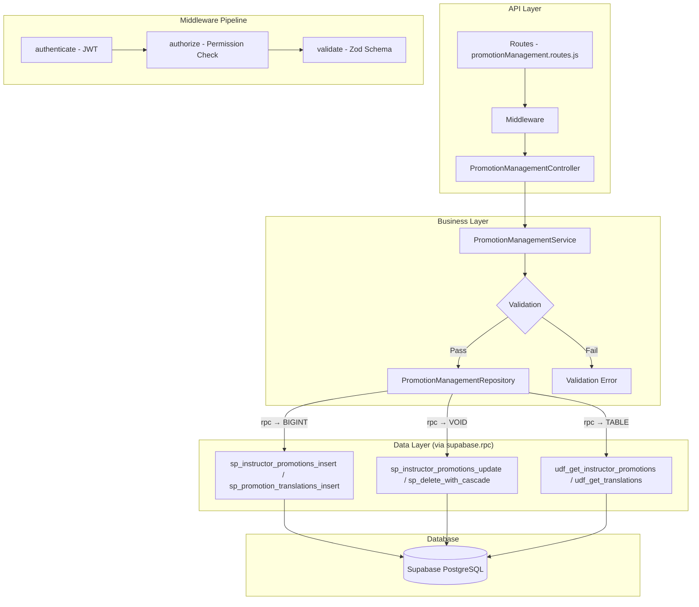

# GrowUpMore API — Promotion Management Module

## Postman Testing Guide

**Base URL:** `http://localhost:5001`
**API Prefix:** `/api/v1/promotion-management`
**Content-Type:** `application/json`
**Authentication:** All endpoints require `Bearer <access_token>` in Authorization header

---

## Architecture Flow



---

## Prerequisites

Before testing, ensure:

1. **Authentication**: Login via `POST /api/v1/auth/login` to obtain `access_token`
2. **Permissions**: Run promotion management permissions seed in Supabase SQL Editor
3. **Instructor Account**: At least one active instructor user account exists
4. **Access Control**: Verify your user role has necessary permissions (promotion.create, promotion.read, etc.)
5. **Test Data**: Have valid instructor IDs and language IDs available from earlier phases

---

## Complete Endpoint Reference

### Test Order (follow this sequence in Postman)

| # | Endpoint | Permission | Purpose |
|---|----------|-----------|---------|
| 1 | `POST /instructor-promotions` | `instructor_promotion.create` | Create instructor promotion |
| 2 | `GET /instructor-promotions` | `instructor_promotion.read` | List promotions with filters |
| 3 | `GET /instructor-promotions/:id` | `instructor_promotion.read` | Get promotion by ID |
| 4 | `PATCH /instructor-promotions/:id` | `instructor_promotion.update` | Update promotion |
| 5 | `DELETE /instructor-promotions/:id` | `instructor_promotion.delete` | Soft delete promotion |
| 6 | `POST /instructor-promotions/:id/restore` | `instructor_promotion.update` | Restore deleted promotion |
| 7 | `POST /instructor-promotion-translations` | `instructor_promotion_translation.create` | Create translation |
| 8 | `GET /instructor-promotion-translations/:id` | `instructor_promotion_translation.read` | Get translation by ID |
| 9 | `GET /instructor-promotions/:promotionId/translations` | `instructor_promotion_translation.read` | Get all translations for promotion |
| 10 | `PATCH /instructor-promotion-translations/:id` | `instructor_promotion_translation.update` | Update translation |
| 11 | `DELETE /instructor-promotion-translations/:id` | `instructor_promotion_translation.delete` | Soft delete translation |
| 12 | `POST /instructor-promotion-translations/:id/restore` | `instructor_promotion_translation.update` | Restore translation |
| 13 | `POST /instructor-promotion-courses` | `instructor_promotion_course.create` | Create promotion-course link |
| 14 | `GET /instructor-promotion-courses` | `instructor_promotion_course.read` | List promotion courses |
| 15 | `GET /instructor-promotion-courses/:id` | `instructor_promotion_course.read` | Get promotion course by ID |
| 16 | `PATCH /instructor-promotion-courses/:id` | `instructor_promotion_course.update` | Update promotion course |
| 17 | `DELETE /instructor-promotion-courses/:id` | `instructor_promotion_course.delete` | Soft delete promotion course |
| 18 | `POST /instructor-promotion-courses/:id/restore` | `instructor_promotion_course.update` | Restore promotion course |

---

## Common Headers (All Requests)

| Key | Value |
|-----|-------|
| Authorization | Bearer `<access_token>` |
| Content-Type | `application/json` |

---

## 1. INSTRUCTOR PROMOTIONS

### 1.1 Create Instructor Promotion

**`POST /api/v1/promotion-management/instructor-promotions`**

**Permission:** `instructor_promotion.create`

**Headers:**
```
Authorization: Bearer {{access_token}}
Content-Type: application/json
```

**Request Body:**

| Field | Type | Required | Description |
|-------|------|----------|-------------|
| instructorId | number | Yes | ID of the instructor |
| discountType | string | Yes | `percentage` or `fixed_amount` |
| discountValue | number | Yes | Discount value (must be positive) |
| validFrom | string (datetime) | Yes | Promotion start date (ISO 8601) |
| validUntil | string (datetime) | Yes | Promotion end date (ISO 8601) |
| promoCode | string | No | Unique promotional code |
| maxDiscountAmount | number | No | Maximum discount cap |
| minPurchaseAmount | number | No | Minimum purchase requirement |
| applicableTo | string | No | Scope: `all_my_courses`, `selected_courses` (default: `all_my_courses`) |
| usageLimit | number | No | Total usage limit |
| usagePerUser | number | No | Limit per student (default: 1) |
| promotionStatus | string | No | `draft`, `pending_approval`, `approved`, `rejected`, `active`, `inactive` (default: `draft`) |
| requiresApproval | boolean | No | Requires admin approval (default: true) |
| isActive | boolean | No | Active status (default: true) |

**Example Request:**
```json
{
  "instructorId": 2,
  "discountType": "percentage",
  "discountValue": 20,
  "validFrom": "2026-04-05T00:00:00Z",
  "validUntil": "2026-04-30T23:59:59Z",
  "promoCode": "SPRING2026",
  "maxDiscountAmount": 100,
  "minPurchaseAmount": 50,
  "applicableTo": "all_my_courses",
  "usageLimit": 500,
  "usagePerUser": 1,
  "promotionStatus": "pending_approval",
  "requiresApproval": true,
  "isActive": true
}
```

**Expected Response (201):**
```json
{
  "success": true,
  "message": "Instructor promotion created successfully",
  "data": {
    "id": 1,
    "instructorId": 2,
    "discountType": "percentage",
    "discountValue": 20,
    "validFrom": "2026-04-05T00:00:00Z",
    "validUntil": "2026-04-30T23:59:59Z",
    "promoCode": "SPRING2026",
    "maxDiscountAmount": 100,
    "minPurchaseAmount": 50,
    "applicableTo": "all_my_courses",
    "usageLimit": 500,
    "usagePerUser": 1,
    "usageCount": 0,
    "promotionStatus": "pending_approval",
    "requiresApproval": true,
    "approvedBy": null,
    "approvedAt": null,
    "rejectionReason": null,
    "isActive": true,
    "createdAt": "2026-04-05T10:30:00Z",
    "updatedAt": "2026-04-05T10:30:00Z"
  }
}
```

**Postman Tests:**
```javascript
pm.test("Status is 201", () => pm.response.to.have.status(201));
const json = pm.response.json();
pm.test("Response has promotion ID", () => pm.expect(json.data.id).to.be.a("number"));
pm.test("Promotion status is pending_approval", () => pm.expect(json.data.promotionStatus).to.equal("pending_approval"));
pm.collectionVariables.set("promotionId", json.data.id);
```

---

### 1.2 List Instructor Promotions

**`GET /api/v1/promotion-management/instructor-promotions`**

**Permission:** `instructor_promotion.read`

**Headers:**
```
Authorization: Bearer {{access_token}}
Content-Type: application/json
```

**Query Parameters:**

| Parameter | Type | Required | Description |
|-----------|------|----------|-------------|
| page | number | No | Page number (default: 1) |
| limit | number | No | Results per page (default: 20) |
| instructorId | number | No | Filter by instructor ID |
| promotionStatus | string | No | Filter by status |
| discountType | string | No | Filter by type: `percentage`, `fixed_amount` |
| applicableTo | string | No | Filter by scope |
| promoCode | string | No | Filter by promo code |
| validFromStart | string (datetime) | No | Filter promotions from date |
| validFromEnd | string (datetime) | No | Filter promotions to date |
| validUntilStart | string (datetime) | No | Filter until start date |
| validUntilEnd | string (datetime) | No | Filter until end date |
| isActive | boolean | No | Filter by active status |
| sortBy | string | No | Sort field |
| sortDir | string | No | Sort direction: `ASC` or `DESC` |

**Example Request:**
```
GET /api/v1/promotion-management/instructor-promotions?page=1&limit=10&instructorId=2&promotionStatus=approved
```

**Expected Response (200):**
```json
{
  "success": true,
  "message": "Instructor promotions retrieved successfully",
  "data": [
    {
      "id": 1,
      "instructorId": 2,
      "discountType": "percentage",
      "discountValue": 20,
      "validFrom": "2026-04-05T00:00:00Z",
      "validUntil": "2026-04-30T23:59:59Z",
      "promoCode": "SPRING2026",
      "maxDiscountAmount": 100,
      "minPurchaseAmount": 50,
      "applicableTo": "all_my_courses",
      "usageLimit": 500,
      "usagePerUser": 1,
      "usageCount": 45,
      "promotionStatus": "approved",
      "requiresApproval": true,
      "approvedBy": 1,
      "approvedAt": "2026-04-05T11:00:00Z",
      "rejectionReason": null,
      "isActive": true,
      "createdAt": "2026-04-05T10:30:00Z",
      "updatedAt": "2026-04-05T11:00:00Z"
    }
  ],
  "pagination": {
    "page": 1,
    "limit": 10,
    "total": 1,
    "pages": 1
  }
}
```

**Postman Tests:**
```javascript
pm.test("Status is 200", () => pm.response.to.have.status(200));
const json = pm.response.json();
pm.test("Response has data array", () => pm.expect(json.data).to.be.an("array"));
pm.test("Response has pagination", () => pm.expect(json.pagination).to.exist);
pm.test("Page is 1", () => pm.expect(json.pagination.page).to.equal(1));
```

---

### 1.3 Get Instructor Promotion by ID

**`GET /api/v1/promotion-management/instructor-promotions/:id`**

**Permission:** `instructor_promotion.read`

**Headers:**
```
Authorization: Bearer {{access_token}}
Content-Type: application/json
```

**Example Request:**
```
GET /api/v1/promotion-management/instructor-promotions/1
```

**Expected Response (200):**
```json
{
  "success": true,
  "message": "Instructor promotion retrieved successfully",
  "data": {
    "id": 1,
    "instructorId": 2,
    "discountType": "percentage",
    "discountValue": 20,
    "validFrom": "2026-04-05T00:00:00Z",
    "validUntil": "2026-04-30T23:59:59Z",
    "promoCode": "SPRING2026",
    "maxDiscountAmount": 100,
    "minPurchaseAmount": 50,
    "applicableTo": "all_my_courses",
    "usageLimit": 500,
    "usagePerUser": 1,
    "usageCount": 45,
    "promotionStatus": "approved",
    "requiresApproval": true,
    "approvedBy": 1,
    "approvedAt": "2026-04-05T11:00:00Z",
    "rejectionReason": null,
    "isActive": true,
    "createdAt": "2026-04-05T10:30:00Z",
    "updatedAt": "2026-04-05T11:00:00Z"
  }
}
```

**Postman Tests:**
```javascript
pm.test("Status is 200", () => pm.response.to.have.status(200));
const json = pm.response.json();
pm.test("Response has promotion data", () => pm.expect(json.data).to.exist);
pm.test("Promotion ID matches", () => pm.expect(json.data.id).to.equal(pm.collectionVariables.get("promotionId")));
```

---

### 1.4 Update Instructor Promotion

**`PATCH /api/v1/promotion-management/instructor-promotions/:id`**

**Permission:** `instructor_promotion.update`

**Headers:**
```
Authorization: Bearer {{access_token}}
Content-Type: application/json
```

**Request Body:**

| Field | Type | Required | Description |
|-------|------|----------|-------------|
| discountType | string | No | `percentage` or `fixed_amount` |
| discountValue | number | No | Discount value |
| validFrom | string (datetime) | No | Start date |
| validUntil | string (datetime) | No | End date |
| promoCode | string | No | Promotional code |
| maxDiscountAmount | number | No | Maximum discount cap |
| minPurchaseAmount | number | No | Minimum purchase |
| applicableTo | string | No | Scope |
| usageLimit | number | No | Usage limit |
| usagePerUser | number | No | Per-user limit |
| promotionStatus | string | No | Status |
| requiresApproval | boolean | No | Approval requirement |
| approvedBy | number | No | Admin ID who approved |
| approvedAt | string (datetime) | No | Approval timestamp |
| rejectionReason | string | No | Rejection reason |
| isActive | boolean | No | Active status |

**Example Request:**
```json
{
  "discountValue": 25,
  "maxDiscountAmount": 150,
  "usageLimit": 750,
  "validUntil": "2026-05-15T23:59:59Z",
  "promotionStatus": "approved",
  "approvedBy": 1,
  "approvedAt": "2026-04-05T11:00:00Z",
  "isActive": true
}
```

**Expected Response (200):**
```json
{
  "success": true,
  "message": "Instructor promotion updated successfully",
  "data": {
    "id": 1,
    "instructorId": 2,
    "discountType": "percentage",
    "discountValue": 25,
    "validFrom": "2026-04-05T00:00:00Z",
    "validUntil": "2026-05-15T23:59:59Z",
    "promoCode": "SPRING2026",
    "maxDiscountAmount": 150,
    "minPurchaseAmount": 50,
    "applicableTo": "all_my_courses",
    "usageLimit": 750,
    "usagePerUser": 1,
    "usageCount": 45,
    "promotionStatus": "approved",
    "requiresApproval": true,
    "approvedBy": 1,
    "approvedAt": "2026-04-05T11:00:00Z",
    "rejectionReason": null,
    "isActive": true,
    "createdAt": "2026-04-05T10:30:00Z",
    "updatedAt": "2026-04-05T12:00:00Z"
  }
}
```

**Postman Tests:**
```javascript
pm.test("Status is 200", () => pm.response.to.have.status(200));
const json = pm.response.json();
pm.test("Discount value updated", () => pm.expect(json.data.discountValue).to.equal(25));
pm.test("Usage limit updated", () => pm.expect(json.data.usageLimit).to.equal(750));
pm.test("Promotion status is approved", () => pm.expect(json.data.promotionStatus).to.equal("approved"));
```

---

### 1.5 Delete Instructor Promotion

**`DELETE /api/v1/promotion-management/instructor-promotions/:id`**

**Permission:** `instructor_promotion.delete`

**Headers:**
```
Authorization: Bearer {{access_token}}
Content-Type: application/json
```

**Example Request:**
```
DELETE /api/v1/promotion-management/instructor-promotions/1
```

**Expected Response (200):**
```json
{
  "success": true,
  "message": "Instructor promotion deleted successfully",
  "data": {
    "id": 1,
    "deletedAt": "2026-04-05T12:15:00Z"
  }
}
```

**Postman Tests:**
```javascript
pm.test("Status is 200", () => pm.response.to.have.status(200));
const json = pm.response.json();
pm.test("Response contains deleted ID", () => pm.expect(json.data.id).to.equal(pm.collectionVariables.get("promotionId")));
pm.test("Response contains deletedAt", () => pm.expect(json.data.deletedAt).to.exist);
```

---

### 1.6 Restore Instructor Promotion

**`POST /api/v1/promotion-management/instructor-promotions/:id/restore`**

**Permission:** `instructor_promotion.update`

**Headers:**
```
Authorization: Bearer {{access_token}}
Content-Type: application/json
```

**Request Body:**
```json
{}
```

**Example Request:**
```
POST /api/v1/promotion-management/instructor-promotions/1/restore
```

**Expected Response (200):**
```json
{
  "success": true,
  "message": "Instructor promotion restored successfully",
  "data": {
    "id": 1,
    "instructorId": 2,
    "discountType": "percentage",
    "discountValue": 25,
    "validFrom": "2026-04-05T00:00:00Z",
    "validUntil": "2026-05-15T23:59:59Z",
    "promoCode": "SPRING2026",
    "maxDiscountAmount": 150,
    "minPurchaseAmount": 50,
    "applicableTo": "all_my_courses",
    "usageLimit": 750,
    "usagePerUser": 1,
    "usageCount": 45,
    "promotionStatus": "approved",
    "requiresApproval": true,
    "approvedBy": 1,
    "approvedAt": "2026-04-05T11:00:00Z",
    "rejectionReason": null,
    "isActive": true,
    "createdAt": "2026-04-05T10:30:00Z",
    "updatedAt": "2026-04-05T12:20:00Z",
    "restoredAt": "2026-04-05T12:20:00Z"
  }
}
```

**Postman Tests:**
```javascript
pm.test("Status is 200", () => pm.response.to.have.status(200));
const json = pm.response.json();
pm.test("Response contains restoredAt", () => pm.expect(json.data.restoredAt).to.exist);
pm.test("Promotion is restored", () => pm.expect(json.data.deletedAt).to.be.undefined);
```

---

## 2. INSTRUCTOR PROMOTION TRANSLATIONS

### 2.1 Create Instructor Promotion Translation

**`POST /api/v1/promotion-management/instructor-promotion-translations`**

**Permission:** `instructor_promotion_translation.create`

**Headers:**
```
Authorization: Bearer {{access_token}}
Content-Type: application/json
```

**Request Body:**

| Field | Type | Required | Description |
|-------|------|----------|-------------|
| promotionId | number | Yes | ID of the promotion |
| languageId | number | Yes | ID of the language |
| promotionName | string | Yes | Name of the promotion (max 500 chars) |
| description | string | No | Description (max 2000 chars) |
| isActive | boolean | No | Active status (default: true) |

**Example Request:**
```json
{
  "promotionId": 1,
  "languageId": 1,
  "promotionName": "Spring 2026 Discount",
  "description": "Get 25% off on all courses this spring. Use code SPRING2026 at checkout. Valid until May 15, 2026.",
  "isActive": true
}
```

**Expected Response (201):**
```json
{
  "success": true,
  "message": "Promotion translation created successfully",
  "data": {
    "id": 1,
    "promotionId": 1,
    "languageId": 1,
    "promotionName": "Spring 2026 Discount",
    "description": "Get 25% off on all courses this spring. Use code SPRING2026 at checkout. Valid until May 15, 2026.",
    "isActive": true,
    "createdAt": "2026-04-05T10:30:00Z",
    "updatedAt": "2026-04-05T10:30:00Z"
  }
}
```

**Postman Tests:**
```javascript
pm.test("Status is 201", () => pm.response.to.have.status(201));
const json = pm.response.json();
pm.test("Has translation ID", () => pm.expect(json.data.id).to.be.a("number"));
pm.test("Promotion ID matches", () => pm.expect(json.data.promotionId).to.equal(pm.collectionVariables.get("promotionId")));
pm.collectionVariables.set("translationId", json.data.id);
```

---

### 2.2 Get Instructor Promotion Translation by ID

**`GET /api/v1/promotion-management/instructor-promotion-translations/:id`**

**Permission:** `instructor_promotion_translation.read`

**Headers:**
```
Authorization: Bearer {{access_token}}
Content-Type: application/json
```

**Example Request:**
```
GET /api/v1/promotion-management/instructor-promotion-translations/1
```

**Expected Response (200):**
```json
{
  "success": true,
  "message": "Promotion translation retrieved successfully",
  "data": {
    "id": 1,
    "promotionId": 1,
    "languageId": 1,
    "promotionName": "Spring 2026 Discount",
    "description": "Get 25% off on all courses this spring. Use code SPRING2026 at checkout. Valid until May 15, 2026.",
    "isActive": true,
    "createdAt": "2026-04-05T10:30:00Z",
    "updatedAt": "2026-04-05T10:30:00Z"
  }
}
```

**Postman Tests:**
```javascript
pm.test("Status is 200", () => pm.response.to.have.status(200));
const json = pm.response.json();
pm.test("Translation exists", () => pm.expect(json.data).to.exist);
pm.test("Translation ID matches", () => pm.expect(json.data.id).to.equal(pm.collectionVariables.get("translationId")));
```

---

### 2.3 Get Promotions Translations by Promotion ID

**`GET /api/v1/promotion-management/instructor-promotions/:promotionId/translations`**

**Permission:** `instructor_promotion_translation.read`

**Headers:**
```
Authorization: Bearer {{access_token}}
Content-Type: application/json
```

**Example Request:**
```
GET /api/v1/promotion-management/instructor-promotions/1/translations
```

**Expected Response (200):**
```json
{
  "success": true,
  "message": "Promotion translations retrieved successfully",
  "data": [
    {
      "id": 1,
      "promotionId": 1,
      "languageId": 1,
      "promotionName": "Spring 2026 Discount",
      "description": "Get 25% off on all courses this spring. Use code SPRING2026 at checkout. Valid until May 15, 2026.",
      "isActive": true,
      "createdAt": "2026-04-05T10:30:00Z",
      "updatedAt": "2026-04-05T10:30:00Z"
    }
  ]
}
```

**Postman Tests:**
```javascript
pm.test("Status is 200", () => pm.response.to.have.status(200));
const json = pm.response.json();
pm.test("Response has translations array", () => pm.expect(json.data).to.be.an("array"));
pm.test("All translations belong to promotion", () => {
  json.data.forEach(t => {
    pm.expect(t.promotionId).to.equal(pm.collectionVariables.get("promotionId"));
  });
});
```

---

### 2.4 Update Instructor Promotion Translation

**`PATCH /api/v1/promotion-management/instructor-promotion-translations/:id`**

**Permission:** `instructor_promotion_translation.update`

**Headers:**
```
Authorization: Bearer {{access_token}}
Content-Type: application/json
```

**Request Body:**

| Field | Type | Required | Description |
|-------|------|----------|-------------|
| promotionName | string | No | Name (max 500 chars) |
| description | string | No | Description (max 2000 chars) |
| isActive | boolean | No | Active status |

**Example Request:**
```json
{
  "promotionName": "Updated Spring 2026 Discount",
  "description": "Get 25% off on all courses this spring! Extended until May 15. Use code SPRING2026.",
  "isActive": true
}
```

**Expected Response (200):**
```json
{
  "success": true,
  "message": "Promotion translation updated successfully",
  "data": {
    "id": 1,
    "promotionId": 1,
    "languageId": 1,
    "promotionName": "Updated Spring 2026 Discount",
    "description": "Get 25% off on all courses this spring! Extended until May 15. Use code SPRING2026.",
    "isActive": true,
    "createdAt": "2026-04-05T10:30:00Z",
    "updatedAt": "2026-04-05T11:00:00Z"
  }
}
```

**Postman Tests:**
```javascript
pm.test("Status is 200", () => pm.response.to.have.status(200));
const json = pm.response.json();
pm.test("Name updated", () => pm.expect(json.data.promotionName).to.equal("Updated Spring 2026 Discount"));
pm.test("Description updated", () => pm.expect(json.data.description).to.include("Extended until May 15"));
```

---

### 2.5 Delete Instructor Promotion Translation

**`DELETE /api/v1/promotion-management/instructor-promotion-translations/:id`**

**Permission:** `instructor_promotion_translation.delete`

**Headers:**
```
Authorization: Bearer {{access_token}}
Content-Type: application/json
```

**Example Request:**
```
DELETE /api/v1/promotion-management/instructor-promotion-translations/1
```

**Expected Response (200):**
```json
{
  "success": true,
  "message": "Promotion translation deleted successfully",
  "data": {
    "id": 1,
    "deletedAt": "2026-04-05T11:15:00Z"
  }
}
```

**Postman Tests:**
```javascript
pm.test("Status is 200", () => pm.response.to.have.status(200));
const json = pm.response.json();
pm.test("Translation deleted", () => pm.expect(json.data.deletedAt).to.exist);
```

---

### 2.6 Restore Instructor Promotion Translation

**`POST /api/v1/promotion-management/instructor-promotion-translations/:id/restore`**

**Permission:** `instructor_promotion_translation.update`

**Headers:**
```
Authorization: Bearer {{access_token}}
Content-Type: application/json
```

**Request Body:**
```json
{}
```

**Example Request:**
```
POST /api/v1/promotion-management/instructor-promotion-translations/1/restore
```

**Expected Response (200):**
```json
{
  "success": true,
  "message": "Promotion translation restored successfully",
  "data": {
    "id": 1,
    "promotionId": 1,
    "languageId": 1,
    "promotionName": "Updated Spring 2026 Discount",
    "description": "Get 25% off on all courses this spring! Extended until May 15. Use code SPRING2026.",
    "isActive": true,
    "createdAt": "2026-04-05T10:30:00Z",
    "updatedAt": "2026-04-05T11:20:00Z",
    "restoredAt": "2026-04-05T11:20:00Z"
  }
}
```

**Postman Tests:**
```javascript
pm.test("Status is 200", () => pm.response.to.have.status(200));
const json = pm.response.json();
pm.test("Translation restored", () => pm.expect(json.data.restoredAt).to.exist);
```

---

## 3. INSTRUCTOR PROMOTION COURSES

### 3.1 Create Instructor Promotion Course

**`POST /api/v1/promotion-management/instructor-promotion-courses`**

**Permission:** `instructor_promotion_course.create`

**Headers:**
```
Authorization: Bearer {{access_token}}
Content-Type: application/json
```

**Request Body:**

| Field | Type | Required | Description |
|-------|------|----------|-------------|
| promotionId | number | Yes | ID of the promotion |
| courseId | number | Yes | ID of the course |
| displayOrder | number | No | Display order (default: 0) |
| isActive | boolean | No | Active status (default: true) |

**Example Request:**
```json
{
  "promotionId": 1,
  "courseId": 5,
  "displayOrder": 1,
  "isActive": true
}
```

**Expected Response (201):**
```json
{
  "success": true,
  "message": "Promotion course created successfully",
  "data": {
    "id": 1,
    "promotionId": 1,
    "courseId": 5,
    "displayOrder": 1,
    "isActive": true,
    "createdAt": "2026-04-05T10:30:00Z",
    "updatedAt": "2026-04-05T10:30:00Z"
  }
}
```

**Postman Tests:**
```javascript
pm.test("Status is 201", () => pm.response.to.have.status(201));
const json = pm.response.json();
pm.test("Has promotion course ID", () => pm.expect(json.data.id).to.be.a("number"));
pm.test("Promotion ID matches", () => pm.expect(json.data.promotionId).to.equal(pm.collectionVariables.get("promotionId")));
pm.collectionVariables.set("promoCourseId", json.data.id);
```

---

### 3.2 List Instructor Promotion Courses

**`GET /api/v1/promotion-management/instructor-promotion-courses`**

**Permission:** `instructor_promotion_course.read`

**Headers:**
```
Authorization: Bearer {{access_token}}
Content-Type: application/json
```

**Query Parameters:**

| Parameter | Type | Required | Description |
|-----------|------|----------|-------------|
| page | number | No | Page number (default: 1) |
| limit | number | No | Results per page (default: 20) |
| promotionId | number | No | Filter by promotion ID |
| courseId | number | No | Filter by course ID |
| isActive | boolean | No | Filter by active status |
| sortBy | string | No | Sort field |
| sortDir | string | No | Sort direction: `ASC` or `DESC` |

**Example Request:**
```
GET /api/v1/promotion-management/instructor-promotion-courses?promotionId=1&isActive=true
```

**Expected Response (200):**
```json
{
  "success": true,
  "message": "Promotion courses retrieved successfully",
  "data": [
    {
      "id": 1,
      "promotionId": 1,
      "courseId": 5,
      "displayOrder": 1,
      "isActive": true,
      "createdAt": "2026-04-05T10:30:00Z",
      "updatedAt": "2026-04-05T10:30:00Z"
    },
    {
      "id": 2,
      "promotionId": 1,
      "courseId": 6,
      "displayOrder": 2,
      "isActive": true,
      "createdAt": "2026-04-05T10:35:00Z",
      "updatedAt": "2026-04-05T10:35:00Z"
    }
  ],
  "pagination": {
    "page": 1,
    "limit": 20,
    "total": 2,
    "pages": 1
  }
}
```

**Postman Tests:**
```javascript
pm.test("Status is 200", () => pm.response.to.have.status(200));
const json = pm.response.json();
pm.test("Response has courses array", () => pm.expect(json.data).to.be.an("array"));
pm.test("Response has pagination", () => pm.expect(json.pagination).to.exist);
```

---

### 3.3 Get Instructor Promotion Course by ID

**`GET /api/v1/promotion-management/instructor-promotion-courses/:id`**

**Permission:** `instructor_promotion_course.read`

**Headers:**
```
Authorization: Bearer {{access_token}}
Content-Type: application/json
```

**Example Request:**
```
GET /api/v1/promotion-management/instructor-promotion-courses/1
```

**Expected Response (200):**
```json
{
  "success": true,
  "message": "Promotion course retrieved successfully",
  "data": {
    "id": 1,
    "promotionId": 1,
    "courseId": 5,
    "displayOrder": 1,
    "isActive": true,
    "createdAt": "2026-04-05T10:30:00Z",
    "updatedAt": "2026-04-05T10:30:00Z"
  }
}
```

**Postman Tests:**
```javascript
pm.test("Status is 200", () => pm.response.to.have.status(200));
const json = pm.response.json();
pm.test("Course exists", () => pm.expect(json.data).to.exist);
pm.test("ID matches", () => pm.expect(json.data.id).to.equal(pm.collectionVariables.get("promoCourseId")));
```

---

### 3.4 Update Instructor Promotion Course

**`PATCH /api/v1/promotion-management/instructor-promotion-courses/:id`**

**Permission:** `instructor_promotion_course.update`

**Headers:**
```
Authorization: Bearer {{access_token}}
Content-Type: application/json
```

**Request Body:**

| Field | Type | Required | Description |
|-------|------|----------|-------------|
| displayOrder | number | No | Display order |
| isActive | boolean | No | Active status |

**Example Request:**
```json
{
  "displayOrder": 2,
  "isActive": true
}
```

**Expected Response (200):**
```json
{
  "success": true,
  "message": "Promotion course updated successfully",
  "data": {
    "id": 1,
    "promotionId": 1,
    "courseId": 5,
    "displayOrder": 2,
    "isActive": true,
    "createdAt": "2026-04-05T10:30:00Z",
    "updatedAt": "2026-04-05T11:00:00Z"
  }
}
```

**Postman Tests:**
```javascript
pm.test("Status is 200", () => pm.response.to.have.status(200));
const json = pm.response.json();
pm.test("Display order updated", () => pm.expect(json.data.displayOrder).to.equal(2));
```

---

### 3.5 Delete Instructor Promotion Course

**`DELETE /api/v1/promotion-management/instructor-promotion-courses/:id`**

**Permission:** `instructor_promotion_course.delete`

**Headers:**
```
Authorization: Bearer {{access_token}}
Content-Type: application/json
```

**Example Request:**
```
DELETE /api/v1/promotion-management/instructor-promotion-courses/1
```

**Expected Response (200):**
```json
{
  "success": true,
  "message": "Promotion course deleted successfully",
  "data": {
    "id": 1,
    "deletedAt": "2026-04-05T11:15:00Z"
  }
}
```

**Postman Tests:**
```javascript
pm.test("Status is 200", () => pm.response.to.have.status(200));
const json = pm.response.json();
pm.test("Course deleted", () => pm.expect(json.data.deletedAt).to.exist);
```

---

### 3.6 Restore Instructor Promotion Course

**`POST /api/v1/promotion-management/instructor-promotion-courses/:id/restore`**

**Permission:** `instructor_promotion_course.update`

**Headers:**
```
Authorization: Bearer {{access_token}}
Content-Type: application/json
```

**Request Body:**
```json
{}
```

**Example Request:**
```
POST /api/v1/promotion-management/instructor-promotion-courses/1/restore
```

**Expected Response (200):**
```json
{
  "success": true,
  "message": "Promotion course restored successfully",
  "data": {
    "id": 1,
    "promotionId": 1,
    "courseId": 5,
    "displayOrder": 2,
    "isActive": true,
    "createdAt": "2026-04-05T10:30:00Z",
    "updatedAt": "2026-04-05T11:20:00Z",
    "restoredAt": "2026-04-05T11:20:00Z"
  }
}
```

**Postman Tests:**
```javascript
pm.test("Status is 200", () => pm.response.to.have.status(200));
const json = pm.response.json();
pm.test("Course restored", () => pm.expect(json.data.restoredAt).to.exist);
```

---

## Error Responses

### 400 Bad Request
```json
{
  "success": false,
  "message": "Validation error",
  "errors": [
    {
      "field": "discountValue",
      "message": "Discount value must be positive"
    },
    {
      "field": "validUntil",
      "message": "Valid until date must be after valid from date"
    }
  ]
}
```

### 401 Unauthorized
```json
{
  "success": false,
  "message": "Unauthorized. Invalid or missing access token."
}
```

### 403 Forbidden
```json
{
  "success": false,
  "message": "You do not have permission to perform this action."
}
```

### 404 Not Found
```json
{
  "success": false,
  "message": "Promotion not found."
}
```

### 409 Conflict
```json
{
  "success": false,
  "message": "A promotion with this code already exists."
}
```

### 500 Internal Server Error
```json
{
  "success": false,
  "message": "An unexpected error occurred. Please try again later."
}
```
