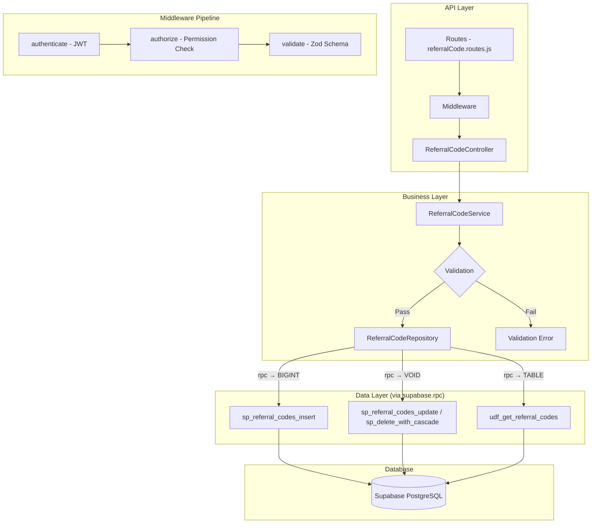

# GrowUpMore API — Referral Codes Module

## Postman Testing Guide

**Base URL:** `http://localhost:5001`
**API Prefix:** `/api/v1/referral-codes`
**Content-Type:** `application/json`
**Authentication:** All endpoints require `Bearer <access_token>` in Authorization header

---

## Architecture Flow



---

## Prerequisites

Before testing, ensure:

1. **Authentication**: Login via `POST /api/v1/auth/login` to obtain `access_token`
2. **Permissions**: Run referral code permissions seed in Supabase SQL Editor
3. **Student Accounts**: Ensure at least one active student user account exists
4. **Access Control**: Verify your user role has necessary permissions (referral_code.create, referral_code.read, etc.)
5. **Test Data**: Have valid student IDs available from earlier phases

---

## Complete Endpoint Reference

### Test Order (follow this sequence in Postman)

| # | Endpoint | Permission | Purpose |
|---|----------|-----------|---------|
| 1 | `POST /` | `referral_code.create` | Create referral code |
| 2 | `GET /` | `referral_code.read` | List referral codes with filters |
| 3 | `GET /:id` | `referral_code.read` | Get referral code by ID |
| 4 | `PATCH /:id` | `referral_code.update` | Update referral code |
| 5 | `DELETE /:id` | `referral_code.delete` | Soft delete referral code |
| 6 | `POST /:id/restore` | `referral_code.update` | Restore deleted referral code |

---

## Common Headers (All Requests)

| Key | Value |
|-----|-------|
| Authorization | Bearer `<access_token>` |
| Content-Type | `application/json` |

---

## 1. REFERRAL CODES

### 1.1 Create Referral Code

**`POST /api/v1/referral-codes/`**

**Permission:** `referral_code.create`

**Headers:**
```
Authorization: Bearer {{access_token}}
Content-Type: application/json
```

**Request Body:**

| Field | Type | Required | Description |
|-------|------|----------|-------------|
| studentId | number | Yes | ID of the student creating the referral code |
| referralCode | string | Yes | Unique referral code string (max 100 chars) |
| discountPercentage | number | No | Discount percentage for referred students (0-100, default: 20) |
| maxDiscountAmount | number | No | Maximum discount cap amount |
| referrerRewardPercentage | number | No | Reward percentage for referrer (0-100, default: 10) |
| referrerRewardType | string | No | Reward type: `wallet_credit`, `cash_bonus`, `discount_code`, `other` (default: `wallet_credit`) |
| isActive | boolean | No | Active status (default: true) |

**Example Request:**
```json
{
  "studentId": 3,
  "referralCode": "REF003SPRING26",
  "discountPercentage": 15,
  "maxDiscountAmount": 50,
  "referrerRewardPercentage": 10,
  "referrerRewardType": "wallet_credit",
  "isActive": true
}
```

**Expected Response (201):**
```json
{
  "success": true,
  "message": "Referral code created successfully",
  "data": {
    "id": 1,
    "studentId": 3,
    "referralCode": "REF003SPRING26",
    "discountPercentage": 15,
    "maxDiscountAmount": 50,
    "referrerRewardPercentage": 10,
    "referrerRewardType": "wallet_credit",
    "referralsCount": 0,
    "totalRewardsEarned": 0,
    "isActive": true,
    "createdAt": "2026-04-05T10:30:00Z",
    "updatedAt": "2026-04-05T10:30:00Z"
  }
}
```

**Postman Tests:**
```javascript
pm.test("Status is 201", () => pm.response.to.have.status(201));
const json = pm.response.json();
pm.test("Has referral code ID", () => pm.expect(json.data.id).to.be.a("number"));
pm.test("Referral code matches request", () => pm.expect(json.data.referralCode).to.equal("REF003SPRING26"));
pm.test("Referrals count is 0", () => pm.expect(json.data.referralsCount).to.equal(0));
pm.collectionVariables.set("referralCodeId", json.data.id);
```

---

### 1.2 List Referral Codes

**`GET /api/v1/referral-codes/`**

**Permission:** `referral_code.read`

**Headers:**
```
Authorization: Bearer {{access_token}}
Content-Type: application/json
```

**Query Parameters:**

| Parameter | Type | Required | Description |
|-----------|------|----------|-------------|
| page | number | No | Page number (default: 1) |
| limit | number | No | Results per page (default: 20) |
| studentId | number | No | Filter by student ID |
| referrerRewardType | string | No | Filter by reward type |
| isActive | boolean | No | Filter by active status |
| sortBy | string | No | Sort field: `created_at`, `referralsCount`, `totalRewardsEarned`, `discountPercentage` |
| sortDir | string | No | Sort direction: `ASC` or `DESC` (default: `DESC`) |

**Example Request:**
```
GET /api/v1/referral-codes/?page=1&limit=10&isActive=true&sortBy=referralsCount&sortDir=DESC
```

**Expected Response (200):**
```json
{
  "success": true,
  "message": "Referral codes retrieved successfully",
  "data": [
    {
      "id": 1,
      "studentId": 3,
      "referralCode": "REF003SPRING26",
      "discountPercentage": 15,
      "maxDiscountAmount": 50,
      "referrerRewardPercentage": 10,
      "referrerRewardType": "wallet_credit",
      "referralsCount": 12,
      "totalRewardsEarned": 120,
      "isActive": true,
      "createdAt": "2026-04-05T10:30:00Z",
      "updatedAt": "2026-04-05T10:30:00Z"
    },
    {
      "id": 2,
      "studentId": 4,
      "referralCode": "REF004SPRING26",
      "discountPercentage": 20,
      "maxDiscountAmount": 75,
      "referrerRewardPercentage": 15,
      "referrerRewardType": "cash_bonus",
      "referralsCount": 8,
      "totalRewardsEarned": 120,
      "isActive": true,
      "createdAt": "2026-04-05T10:35:00Z",
      "updatedAt": "2026-04-05T10:35:00Z"
    }
  ],
  "pagination": {
    "page": 1,
    "limit": 10,
    "total": 2,
    "pages": 1
  }
}
```

**Postman Tests:**
```javascript
pm.test("Status is 200", () => pm.response.to.have.status(200));
const json = pm.response.json();
pm.test("Response has data array", () => pm.expect(json.data).to.be.an("array"));
pm.test("Response has pagination", () => pm.expect(json.pagination).to.exist);
pm.test("Page is 1", () => pm.expect(json.pagination.page).to.equal(1));
pm.test("All codes are active", () => {
  json.data.forEach(code => {
    pm.expect(code.isActive).to.be.true;
  });
});
```

---

### 1.3 Get Referral Code by ID

**`GET /api/v1/referral-codes/:id`**

**Permission:** `referral_code.read`

**Headers:**
```
Authorization: Bearer {{access_token}}
Content-Type: application/json
```

**Example Request:**
```
GET /api/v1/referral-codes/1
```

**Expected Response (200):**
```json
{
  "success": true,
  "message": "Referral code retrieved successfully",
  "data": {
    "id": 1,
    "studentId": 3,
    "referralCode": "REF003SPRING26",
    "discountPercentage": 15,
    "maxDiscountAmount": 50,
    "referrerRewardPercentage": 10,
    "referrerRewardType": "wallet_credit",
    "referralsCount": 12,
    "totalRewardsEarned": 120,
    "isActive": true,
    "createdAt": "2026-04-05T10:30:00Z",
    "updatedAt": "2026-04-05T10:30:00Z"
  }
}
```

**Postman Tests:**
```javascript
pm.test("Status is 200", () => pm.response.to.have.status(200));
const json = pm.response.json();
pm.test("Response has referral code data", () => pm.expect(json.data).to.exist);
pm.test("Code ID matches", () => pm.expect(json.data.id).to.equal(pm.collectionVariables.get("referralCodeId")));
pm.test("Has referrals count", () => pm.expect(json.data.referralsCount).to.be.a("number"));
```

---

### 1.4 Update Referral Code

**`PATCH /api/v1/referral-codes/:id`**

**Permission:** `referral_code.update`

**Headers:**
```
Authorization: Bearer {{access_token}}
Content-Type: application/json
```

**Request Body:**

| Field | Type | Required | Description |
|-------|------|----------|-------------|
| discountPercentage | number | No | Discount percentage (0-100) |
| maxDiscountAmount | number | No | Maximum discount cap |
| referrerRewardPercentage | number | No | Reward percentage (0-100) |
| referrerRewardType | string | No | Reward type: `wallet_credit`, `cash_bonus`, `discount_code`, `other` |
| isActive | boolean | No | Active status |

**Example Request:**
```json
{
  "discountPercentage": 20,
  "maxDiscountAmount": 75,
  "referrerRewardPercentage": 15,
  "referrerRewardType": "discount_code",
  "isActive": true
}
```

**Expected Response (200):**
```json
{
  "success": true,
  "message": "Referral code updated successfully",
  "data": {
    "id": 1,
    "studentId": 3,
    "referralCode": "REF003SPRING26",
    "discountPercentage": 20,
    "maxDiscountAmount": 75,
    "referrerRewardPercentage": 15,
    "referrerRewardType": "discount_code",
    "referralsCount": 12,
    "totalRewardsEarned": 120,
    "isActive": true,
    "createdAt": "2026-04-05T10:30:00Z",
    "updatedAt": "2026-04-05T12:00:00Z"
  }
}
```

**Postman Tests:**
```javascript
pm.test("Status is 200", () => pm.response.to.have.status(200));
const json = pm.response.json();
pm.test("Discount percentage updated", () => pm.expect(json.data.discountPercentage).to.equal(20));
pm.test("Max discount updated", () => pm.expect(json.data.maxDiscountAmount).to.equal(75));
pm.test("Reward type updated", () => pm.expect(json.data.referrerRewardType).to.equal("discount_code"));
```

---

### 1.5 Delete Referral Code

**`DELETE /api/v1/referral-codes/:id`**

**Permission:** `referral_code.delete`

**Headers:**
```
Authorization: Bearer {{access_token}}
Content-Type: application/json
```

**Example Request:**
```
DELETE /api/v1/referral-codes/1
```

**Expected Response (200):**
```json
{
  "success": true,
  "message": "Referral code deleted successfully",
  "data": {
    "id": 1,
    "deletedAt": "2026-04-05T12:15:00Z"
  }
}
```

**Postman Tests:**
```javascript
pm.test("Status is 200", () => pm.response.to.have.status(200));
const json = pm.response.json();
pm.test("Response contains deleted ID", () => pm.expect(json.data.id).to.equal(pm.collectionVariables.get("referralCodeId")));
pm.test("Response contains deletedAt", () => pm.expect(json.data.deletedAt).to.exist);
```

---

### 1.6 Restore Referral Code

**`POST /api/v1/referral-codes/:id/restore`**

**Permission:** `referral_code.update`

**Headers:**
```
Authorization: Bearer {{access_token}}
Content-Type: application/json
```

**Request Body:**
```json
{}
```

**Example Request:**
```
POST /api/v1/referral-codes/1/restore
```

**Expected Response (200):**
```json
{
  "success": true,
  "message": "Referral code restored successfully",
  "data": {
    "id": 1,
    "studentId": 3,
    "referralCode": "REF003SPRING26",
    "discountPercentage": 20,
    "maxDiscountAmount": 75,
    "referrerRewardPercentage": 15,
    "referrerRewardType": "discount_code",
    "referralsCount": 12,
    "totalRewardsEarned": 120,
    "isActive": true,
    "createdAt": "2026-04-05T10:30:00Z",
    "updatedAt": "2026-04-05T12:20:00Z",
    "restoredAt": "2026-04-05T12:20:00Z"
  }
}
```

**Postman Tests:**
```javascript
pm.test("Status is 200", () => pm.response.to.have.status(200));
const json = pm.response.json();
pm.test("Response contains restoredAt", () => pm.expect(json.data.restoredAt).to.exist);
pm.test("Code is restored", () => pm.expect(json.data.deletedAt).to.be.undefined);
```

---

## Common Query Use Cases

### Get Top Referrers by Count

**`GET /api/v1/referral-codes/?sortBy=referralsCount&sortDir=DESC&limit=5`**

This query returns the top 5 referrers sorted by number of successful referrals.

**Permission:** `referral_code.read`

**Example Request:**
```
GET /api/v1/referral-codes/?sortBy=referralsCount&sortDir=DESC&limit=5
```

**Expected Response (200):**
```json
{
  "success": true,
  "message": "Referral codes retrieved successfully",
  "data": [
    {
      "id": 1,
      "studentId": 3,
      "referralCode": "REF003SPRING26",
      "discountPercentage": 20,
      "maxDiscountAmount": 75,
      "referrerRewardPercentage": 15,
      "referrerRewardType": "discount_code",
      "referralsCount": 50,
      "totalRewardsEarned": 750,
      "isActive": true,
      "createdAt": "2026-04-05T10:30:00Z",
      "updatedAt": "2026-04-15T09:00:00Z"
    }
  ],
  "pagination": {
    "page": 1,
    "limit": 5,
    "total": 25,
    "pages": 5
  }
}
```

**Postman Tests:**
```javascript
pm.test("Status is 200", () => pm.response.to.have.status(200));
const json = pm.response.json();
pm.test("Limited to 5 results", () => pm.expect(json.data.length).to.be.at.most(5));
pm.test("Sorted by referrals count descending", () => {
  for (let i = 0; i < json.data.length - 1; i++) {
    pm.expect(json.data[i].referralsCount).to.be.at.least(json.data[i+1].referralsCount);
  }
});
```

---

### Get Top Reward Earners

**`GET /api/v1/referral-codes/?sortBy=totalRewardsEarned&sortDir=DESC&limit=5`**

This query returns the top 5 referrers sorted by total rewards earned.

**Permission:** `referral_code.read`

**Example Request:**
```
GET /api/v1/referral-codes/?sortBy=totalRewardsEarned&sortDir=DESC&limit=5
```

**Expected Response (200):**
```json
{
  "success": true,
  "message": "Referral codes retrieved successfully",
  "data": [
    {
      "id": 1,
      "studentId": 3,
      "referralCode": "REF003SPRING26",
      "discountPercentage": 20,
      "maxDiscountAmount": 75,
      "referrerRewardPercentage": 15,
      "referrerRewardType": "discount_code",
      "referralsCount": 50,
      "totalRewardsEarned": 750,
      "isActive": true,
      "createdAt": "2026-04-05T10:30:00Z",
      "updatedAt": "2026-04-15T09:00:00Z"
    }
  ],
  "pagination": {
    "page": 1,
    "limit": 5,
    "total": 25,
    "pages": 5
  }
}
```

**Postman Tests:**
```javascript
pm.test("Status is 200", () => pm.response.to.have.status(200));
const json = pm.response.json();
pm.test("Sorted by rewards earned descending", () => {
  for (let i = 0; i < json.data.length - 1; i++) {
    pm.expect(json.data[i].totalRewardsEarned).to.be.at.least(json.data[i+1].totalRewardsEarned);
  }
});
```

---

### Filter by Reward Type

**`GET /api/v1/referral-codes/?referrerRewardType=wallet_credit&isActive=true`**

This query returns all active referral codes that offer wallet credit rewards to referrers.

**Permission:** `referral_code.read`

**Example Request:**
```
GET /api/v1/referral-codes/?referrerRewardType=wallet_credit&isActive=true
```

**Expected Response (200):**
```json
{
  "success": true,
  "message": "Referral codes retrieved successfully",
  "data": [
    {
      "id": 1,
      "studentId": 3,
      "referralCode": "REF003SPRING26",
      "discountPercentage": 15,
      "maxDiscountAmount": 50,
      "referrerRewardPercentage": 10,
      "referrerRewardType": "wallet_credit",
      "referralsCount": 12,
      "totalRewardsEarned": 120,
      "isActive": true,
      "createdAt": "2026-04-05T10:30:00Z",
      "updatedAt": "2026-04-05T10:30:00Z"
    }
  ],
  "pagination": {
    "page": 1,
    "limit": 20,
    "total": 1,
    "pages": 1
  }
}
```

**Postman Tests:**
```javascript
pm.test("Status is 200", () => pm.response.to.have.status(200));
const json = pm.response.json();
pm.test("All codes have wallet_credit reward type", () => {
  json.data.forEach(code => {
    pm.expect(code.referrerRewardType).to.equal("wallet_credit");
  });
});
pm.test("All codes are active", () => {
  json.data.forEach(code => {
    pm.expect(code.isActive).to.be.true;
  });
});
```

---

## Referral Code Reward Type Reference

| Reward Type | Value | Description | Use Case |
|-------------|-------|-------------|----------|
| Wallet Credit | `wallet_credit` | Account credit for future purchases | General purpose rewards |
| Cash Bonus | `cash_bonus` | Direct monetary payment | Direct incentives |
| Discount Code | `discount_code` | Reusable discount coupon | Encourage repeat purchases |
| Other | `other` | Custom reward type | Flexible/Other rewards |

---

## Error Responses

### 400 Bad Request
```json
{
  "success": false,
  "message": "Validation error",
  "errors": [
    {
      "field": "discountPercentage",
      "message": "Discount percentage must be between 0 and 100"
    },
    {
      "field": "referralCode",
      "message": "Referral code must be between 1 and 100 characters"
    }
  ]
}
```

### 401 Unauthorized
```json
{
  "success": false,
  "message": "Unauthorized. Invalid or missing access token."
}
```

### 403 Forbidden
```json
{
  "success": false,
  "message": "You do not have permission to perform this action."
}
```

### 404 Not Found
```json
{
  "success": false,
  "message": "Referral code not found."
}
```

### 409 Conflict
```json
{
  "success": false,
  "message": "A referral code with this code already exists for this student."
}
```

### 500 Internal Server Error
```json
{
  "success": false,
  "message": "An unexpected error occurred. Please try again later."
}
```
