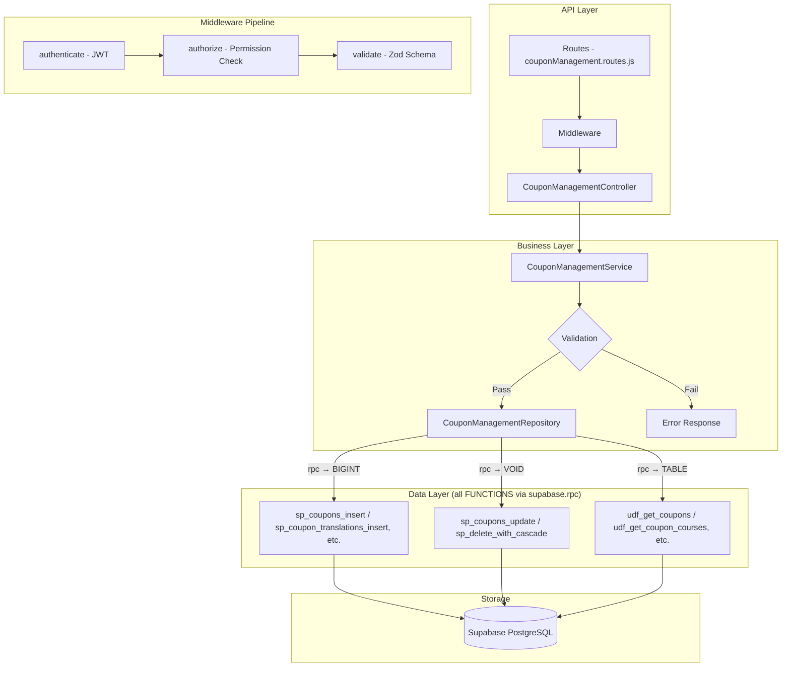

# GrowUpMore API — Coupon Management Module

## Postman Testing Guide

**Base URL:** `http://localhost:5001`
**API Prefix:** `/api/v1/coupon-management`
**Content-Type:** `application/json`
**Authentication:** All endpoints require `Bearer <access_token>` in Authorization header

---

## Architecture Flow



---

## Prerequisites

Before testing, ensure:

1. **Authentication**: Login via `POST /api/v1/auth/login` to obtain `access_token`
2. **Permissions**: Run coupon management permissions seed in Supabase SQL Editor
3. **Valid Entities**: Ensure courses, bundles, batches, and webinars exist for linking
4. **Active User**: At least one active admin/manager account exists

---

## Complete Endpoint Reference

### Test Order (follow this sequence in Postman)

| # | Endpoint | Permission | Purpose |
|---|----------|-----------|---------|
| 1 | `POST /coupons` | `coupon.create` | Create a coupon |
| 2 | `GET /coupons` | `coupon.read` | List all coupons with filters |
| 3 | `GET /coupons/:id` | `coupon.read` | Get coupon by ID |
| 4 | `PATCH /coupons/:id` | `coupon.update` | Update coupon details |
| 5 | `DELETE /coupons/:id` | `coupon.delete` | Soft delete coupon |
| 6 | `POST /coupons/:id/restore` | `coupon.update` | Restore soft-deleted coupon |
| 7 | `POST /coupon-translations` | `coupon_translation.create` | Create coupon translation |
| 8 | `PATCH /coupon-translations/:id` | `coupon_translation.update` | Update coupon translation |
| 9 | `DELETE /coupon-translations/:id` | `coupon_translation.delete` | Soft delete translation |
| 10 | `POST /coupon-translations/:id/restore` | `coupon_translation.update` | Restore translation |
| 11 | `POST /coupon-courses` | `coupon_course.create` | Create coupon-course link |
| 12 | `GET /coupon-courses` | `coupon_course.read` | List coupon-course links |
| 13 | `GET /coupon-courses/:id` | `coupon_course.read` | Get coupon-course link by ID |
| 14 | `PATCH /coupon-courses/:id` | `coupon_course.update` | Update coupon-course link |
| 15 | `DELETE /coupon-courses/:id` | `coupon_course.delete` | Soft delete single link |
| 16 | `POST /coupon-courses/bulk-delete` | `coupon_course.delete` | Bulk delete links |
| 17 | `POST /coupon-courses/:id/restore` | `coupon_course.update` | Restore single link |
| 18 | `POST /coupon-courses/bulk-restore` | `coupon_course.update` | Bulk restore links |
| 19 | `POST /coupon-bundles` | `coupon_bundle.create` | Create coupon-bundle link |
| 20 | `GET /coupon-bundles` | `coupon_bundle.read` | List coupon-bundle links |
| 21 | `GET /coupon-bundles/:id` | `coupon_bundle.read` | Get coupon-bundle link by ID |
| 22 | `PATCH /coupon-bundles/:id` | `coupon_bundle.update` | Update coupon-bundle link |
| 23 | `DELETE /coupon-bundles/:id` | `coupon_bundle.delete` | Soft delete single link |
| 24 | `POST /coupon-bundles/bulk-delete` | `coupon_bundle.delete` | Bulk delete links |
| 25 | `POST /coupon-bundles/:id/restore` | `coupon_bundle.update` | Restore single link |
| 26 | `POST /coupon-bundles/bulk-restore` | `coupon_bundle.update` | Bulk restore links |
| 27 | `POST /coupon-batches` | `coupon_batch.create` | Create coupon-batch link |
| 28 | `GET /coupon-batches` | `coupon_batch.read` | List coupon-batch links |
| 29 | `GET /coupon-batches/:id` | `coupon_batch.read` | Get coupon-batch link by ID |
| 30 | `PATCH /coupon-batches/:id` | `coupon_batch.update` | Update coupon-batch link |
| 31 | `DELETE /coupon-batches/:id` | `coupon_batch.delete` | Soft delete single link |
| 32 | `POST /coupon-batches/bulk-delete` | `coupon_batch.delete` | Bulk delete links |
| 33 | `POST /coupon-batches/:id/restore` | `coupon_batch.update` | Restore single link |
| 34 | `POST /coupon-batches/bulk-restore` | `coupon_batch.update` | Bulk restore links |
| 35 | `POST /coupon-webinars` | `coupon_webinar.create` | Create coupon-webinar link |
| 36 | `GET /coupon-webinars` | `coupon_webinar.read` | List coupon-webinar links |
| 37 | `GET /coupon-webinars/:id` | `coupon_webinar.read` | Get coupon-webinar link by ID |
| 38 | `PATCH /coupon-webinars/:id` | `coupon_webinar.update` | Update coupon-webinar link |
| 39 | `DELETE /coupon-webinars/:id` | `coupon_webinar.delete` | Soft delete single link |
| 40 | `POST /coupon-webinars/bulk-delete` | `coupon_webinar.delete` | Bulk delete links |
| 41 | `POST /coupon-webinars/:id/restore` | `coupon_webinar.update` | Restore single link |
| 42 | `POST /coupon-webinars/bulk-restore` | `coupon_webinar.update` | Bulk restore links |

---

## Common Headers (All Requests)

| Key | Value |
|-----|-------|
| Authorization | Bearer `<access_token>` |
| Content-Type | `application/json` |

---

## 1. COUPONS

### 1.1 Create Coupon

**`POST /api/v1/coupon-management/coupons`**

**Permission:** `coupon.create`

**Headers:**
```
Authorization: Bearer {{access_token}}
Content-Type: application/json
```

**Request Body:**

| Field | Type | Required | Description |
|-------|------|----------|-------------|
| code | string | Yes | Unique coupon code (max 100 chars) |
| discountType | string | Yes | `percentage` or `fixed_amount` |
| discountValue | number | Yes | Discount value (non-negative) |
| minPurchaseAmount | number | No | Minimum purchase amount for coupon to apply |
| maxDiscountAmount | number | No | Maximum discount that can be applied |
| applicableTo | string | No | `all`, `course`, `bundle`, `batch`, or `webinar` (default: `all`) |
| usageLimit | number | No | Total usage limit across all users |
| usagePerUser | number | No | Usage limit per user (default: 1) |
| validFrom | string | No | Start date (ISO 8601 datetime) |
| validUntil | string | No | End date (ISO 8601 datetime) |
| isActive | boolean | No | Active status (default: true) |

**Example Request:**
```json
{
  "code": "SUMMER2026",
  "discountType": "percentage",
  "discountValue": 25,
  "minPurchaseAmount": 150,
  "maxDiscountAmount": 75,
  "applicableTo": "course",
  "usageLimit": 1000,
  "usagePerUser": 2,
  "validFrom": "2026-06-01T00:00:00Z",
  "validUntil": "2026-08-31T23:59:59Z",
  "isActive": true
}
```

**Expected Response (201):**
```json
{
  "success": true,
  "message": "Coupon created successfully",
  "data": {
    "id": 1
  }
}
```

**Postman Tests:**
```javascript
pm.test("Status is 201", () => pm.response.to.have.status(201));
const json = pm.response.json();
pm.test("Has coupon ID", () => pm.expect(json.data.id).to.be.a("number"));
pm.collectionVariables.set("couponId", json.data.id);
```

---

### 1.2 List Coupons

**`GET /api/v1/coupon-management/coupons`**

**Permission:** `coupon.read`

**Headers:**
```
Authorization: Bearer {{access_token}}
```

**Query Parameters:**

| Parameter | Type | Default | Description |
|-----------|------|---------|-------------|
| `page` | number | 1 | Page number |
| `limit` | number | 20 | Items per page (max: 100) |
| `search` | string | — | Search by coupon code or attributes |
| `sortBy` | string | id | Sort field (id, code, discountType, createdAt) |
| `sortDir` | string | ASC | Sort direction (ASC/DESC) |
| `code` | string | — | Filter by specific coupon code |
| `discountType` | string | — | Filter by type: `percentage`, `fixed_amount` |
| `applicableTo` | string | — | Filter by applicability: `all`, `course`, `bundle`, `batch`, `webinar` |
| `isActive` | boolean | — | Filter by active status |

**Example:** `GET /api/v1/coupon-management/coupons?page=1&limit=20&discountType=percentage&isActive=true&sortBy=createdAt&sortDir=DESC`

**Expected Response (200):**
```json
{
  "success": true,
  "message": "Coupons retrieved successfully",
  "data": [
    {
      "id": 1,
      "code": "SPRING26",
      "discountType": "percentage",
      "discountValue": 15,
      "minPurchaseAmount": 100,
      "maxDiscountAmount": 50,
      "applicableTo": "all",
      "usageLimit": 500,
      "usagePerUser": 1,
      "validFrom": "2026-04-01T00:00:00Z",
      "validUntil": "2026-06-30T23:59:59Z",
      "isActive": true,
      "createdAt": "2026-04-05T10:30:00Z",
      "updatedAt": "2026-04-05T10:30:00Z"
    },
    {
      "id": 2,
      "code": "FIXED50",
      "discountType": "fixed_amount",
      "discountValue": 50,
      "minPurchaseAmount": 200,
      "maxDiscountAmount": null,
      "applicableTo": "course",
      "usageLimit": 300,
      "usagePerUser": 2,
      "validFrom": "2026-04-01T00:00:00Z",
      "validUntil": "2026-05-31T23:59:59Z",
      "isActive": true,
      "createdAt": "2026-04-04T14:20:00Z",
      "updatedAt": "2026-04-04T14:20:00Z"
    }
  ],
  "pagination": {
    "page": 1,
    "limit": 20,
    "total": 45,
    "pages": 3
  }
}
```

**Postman Tests:**
```javascript
pm.test("Status is 200", () => pm.response.to.have.status(200));
const json = pm.response.json();
pm.test("Data is array", () => pm.expect(json.data).to.be.an("array"));
pm.test("Has pagination", () => pm.expect(json.pagination).to.exist);
```

---

### 1.3 Get Coupon by ID

**`GET /api/v1/coupon-management/coupons/:id`**

**Permission:** `coupon.read`

**Headers:**
```
Authorization: Bearer {{access_token}}
```

**Example:** `GET /api/v1/coupon-management/coupons/{{couponId}}`

**Expected Response (200):**
```json
{
  "success": true,
  "message": "Coupon retrieved successfully",
  "data": {
    "id": 1,
    "code": "SPRING26",
    "discountType": "percentage",
    "discountValue": 15,
    "minPurchaseAmount": 100,
    "maxDiscountAmount": 50,
    "applicableTo": "all",
    "usageLimit": 500,
    "usagePerUser": 1,
    "validFrom": "2026-04-01T00:00:00Z",
    "validUntil": "2026-06-30T23:59:59Z",
    "isActive": true,
    "createdAt": "2026-04-05T10:30:00Z",
    "updatedAt": "2026-04-05T10:30:00Z"
  }
}
```

**Postman Tests:**
```javascript
pm.test("Status is 200", () => pm.response.to.have.status(200));
const json = pm.response.json();
pm.test("Has coupon code", () => pm.expect(json.data.code).to.exist);
```

---

### 1.4 Update Coupon

**`PATCH /api/v1/coupon-management/coupons/:id`**

**Permission:** `coupon.update`

**Headers:**
```
Authorization: Bearer {{access_token}}
Content-Type: application/json
```

**Request Body:**

| Field | Type | Required | Description |
|-------|------|----------|-------------|
| discountValue | number | No | Discount value (non-negative) |
| minPurchaseAmount | number | No | Minimum purchase amount |
| maxDiscountAmount | number | No | Maximum discount amount |
| usageLimit | number | No | Total usage limit |
| usagePerUser | number | No | Usage limit per user |
| validFrom | string | No | Start date (ISO 8601 datetime) |
| validUntil | string | No | End date (ISO 8601 datetime) |
| isActive | boolean | No | Active status |

**Example Request:**
```json
{
  "discountValue": 30,
  "minPurchaseAmount": 200,
  "maxDiscountAmount": 100,
  "usageLimit": 800,
  "usagePerUser": 3,
  "validUntil": "2026-09-30T23:59:59Z",
  "isActive": true
}
```

**Expected Response (200):**
```json
{
  "success": true,
  "message": "Coupon updated successfully",
  "data": {
    "id": 1
  }
}
```

**Postman Tests:**
```javascript
pm.test("Status is 200", () => pm.response.to.have.status(200));
const json = pm.response.json();
pm.test("Has ID in response", () => pm.expect(json.data.id).to.equal(parseInt(pm.request.url.split('/').pop())));
```

---

### 1.5 Delete Coupon

**`DELETE /api/v1/coupon-management/coupons/:id`**

**Permission:** `coupon.delete`

**Headers:**
```
Authorization: Bearer {{access_token}}
```

**Example:** `DELETE /api/v1/coupon-management/coupons/{{couponId}}`

**Expected Response (200):**
```json
{
  "success": true,
  "message": "Coupon deleted successfully",
  "data": {}
}
```

**Postman Tests:**
```javascript
pm.test("Status is 200", () => pm.response.to.have.status(200));
pm.test("Success flag is true", () => pm.expect(pm.response.json().success).to.be.true);
```

---

### 1.6 Restore Coupon

**`POST /api/v1/coupon-management/coupons/:id/restore`**

**Permission:** `coupon.update`

**Headers:**
```
Authorization: Bearer {{access_token}}
Content-Type: application/json
```

**Request Body:**

| Field | Type | Required | Description |
|-------|------|----------|-------------|
| restoreTranslations | boolean | No | Whether to restore related translations (default: false) |

**Example Request:**
```json
{
  "restoreTranslations": false
}
```

**Expected Response (200):**
```json
{
  "success": true,
  "message": "Coupon restored successfully",
  "data": {
    "id": 1
  }
}
```

**Postman Tests:**
```javascript
pm.test("Status is 200", () => pm.response.to.have.status(200));
const json = pm.response.json();
pm.test("Restore successful", () => pm.expect(json.success).to.be.true);
```

---

## 2. COUPON TRANSLATIONS

### 2.1 Create Coupon Translation

**`POST /api/v1/coupon-management/coupon-translations`**

**Permission:** `coupon_translation.create`

**Headers:**
```
Authorization: Bearer {{access_token}}
Content-Type: application/json
```

**Request Body:**

| Field | Type | Required | Description |
|-------|------|----------|-------------|
| couponId | number | Yes | ID of the coupon |
| languageId | number | Yes | ID of the language |
| title | string | Yes | Translation title (max 500 chars) |
| description | string | No | Translation description (max 5000 chars) |
| isActive | boolean | No | Active status (default: true) |

**Example Request:**
```json
{
  "couponId": 1,
  "languageId": 2,
  "title": "Descuento de Primavera",
  "description": "Obtén un 15% de descuento en todos los cursos durante la primavera de 2026",
  "isActive": true
}
```

**Expected Response (201):**
```json
{
  "success": true,
  "message": "Coupon translation created successfully",
  "data": {
    "id": 1
  }
}
```

**Postman Tests:**
```javascript
pm.test("Status is 201", () => pm.response.to.have.status(201));
const json = pm.response.json();
pm.test("Has translation ID", () => pm.expect(json.data.id).to.be.a("number"));
pm.collectionVariables.set("translationId", json.data.id);
```

---

### 2.2 Update Coupon Translation

**`PATCH /api/v1/coupon-management/coupon-translations/:id`**

**Permission:** `coupon_translation.update`

**Headers:**
```
Authorization: Bearer {{access_token}}
Content-Type: application/json
```

**Request Body:**

| Field | Type | Required | Description |
|-------|------|----------|-------------|
| title | string | No | Translation title (max 500 chars) |
| description | string | No | Translation description (max 5000 chars) |
| isActive | boolean | No | Active status |

**Example Request:**
```json
{
  "title": "Oferta de Primavera",
  "description": "Consigue un descuento especial del 15% en cursos seleccionados",
  "isActive": true
}
```

**Expected Response (200):**
```json
{
  "success": true,
  "message": "Coupon translation updated successfully",
  "data": {
    "id": 1
  }
}
```

**Postman Tests:**
```javascript
pm.test("Status is 200", () => pm.response.to.have.status(200));
const json = pm.response.json();
pm.test("Update successful", () => pm.expect(json.success).to.be.true);
```

---

### 2.3 Delete Coupon Translation

**`DELETE /api/v1/coupon-management/coupon-translations/:id`**

**Permission:** `coupon_translation.delete`

**Headers:**
```
Authorization: Bearer {{access_token}}
```

**Example:** `DELETE /api/v1/coupon-management/coupon-translations/{{translationId}}`

**Expected Response (200):**
```json
{
  "success": true,
  "message": "Coupon translation deleted successfully",
  "data": {}
}
```

**Postman Tests:**
```javascript
pm.test("Status is 200", () => pm.response.to.have.status(200));
pm.test("Success flag is true", () => pm.expect(pm.response.json().success).to.be.true);
```

---

### 2.4 Restore Coupon Translation

**`POST /api/v1/coupon-management/coupon-translations/:id/restore`**

**Permission:** `coupon_translation.update`

**Headers:**
```
Authorization: Bearer {{access_token}}
Content-Type: application/json
```

**Request Body:**

| Field | Type | Required | Description |
|-------|------|----------|-------------|
| (empty) | — | — | No body required |

**Example Request:**
```json
{}
```

**Expected Response (200):**
```json
{
  "success": true,
  "message": "Coupon translation restored successfully",
  "data": {
    "id": 1
  }
}
```

**Postman Tests:**
```javascript
pm.test("Status is 200", () => pm.response.to.have.status(200));
const json = pm.response.json();
pm.test("Restore successful", () => pm.expect(json.success).to.be.true);
```

---

## 3. COUPON COURSES

### 3.1 Create Coupon-Course Link

**`POST /api/v1/coupon-management/coupon-courses`**

**Permission:** `coupon_course.create`

**Headers:**
```
Authorization: Bearer {{access_token}}
Content-Type: application/json
```

**Request Body:**

| Field | Type | Required | Description |
|-------|------|----------|-------------|
| couponId | number | Yes | ID of the coupon |
| courseId | number | Yes | ID of the course |
| displayOrder | number | No | Display order (default: 0) |
| isActive | boolean | No | Active status (default: true) |

**Example Request:**
```json
{
  "couponId": 1,
  "courseId": 501,
  "displayOrder": 1,
  "isActive": true
}
```

**Expected Response (201):**
```json
{
  "success": true,
  "message": "Coupon course created successfully",
  "data": {
    "id": 1
  }
}
```

**Postman Tests:**
```javascript
pm.test("Status is 201", () => pm.response.to.have.status(201));
const json = pm.response.json();
pm.test("Has coupon-course ID", () => pm.expect(json.data.id).to.be.a("number"));
pm.collectionVariables.set("couponCourseId", json.data.id);
```

---

### 3.2 List Coupon-Course Links

**`GET /api/v1/coupon-management/coupon-courses`**

**Permission:** `coupon_course.read`

**Headers:**
```
Authorization: Bearer {{access_token}}
```

**Query Parameters:**

| Parameter | Type | Default | Description |
|-----------|------|---------|-------------|
| `page` | number | 1 | Page number |
| `limit` | number | 20 | Items per page |
| `search` | string | — | Search by coupon code or course name |
| `sortBy` | string | display_order | Sort field |
| `sortDir` | string | ASC | Sort direction (ASC/DESC) |
| `couponId` | number | — | Filter by coupon ID |
| `courseId` | number | — | Filter by course ID |
| `isActive` | boolean | — | Filter by active status |

**Example:** `GET /api/v1/coupon-management/coupon-courses?page=1&limit=20&couponId={{couponId}}&sortBy=display_order&sortDir=ASC`

**Expected Response (200):**
```json
{
  "success": true,
  "message": "Coupon courses retrieved successfully",
  "data": [
    {
      "id": 1,
      "couponId": 1,
      "courseId": 501,
      "displayOrder": 1,
      "isActive": true,
      "createdAt": "2026-04-05T10:40:00Z",
      "updatedAt": "2026-04-05T10:40:00Z"
    },
    {
      "id": 2,
      "couponId": 1,
      "courseId": 502,
      "displayOrder": 2,
      "isActive": true,
      "createdAt": "2026-04-05T10:45:00Z",
      "updatedAt": "2026-04-05T10:45:00Z"
    }
  ],
  "pagination": {
    "page": 1,
    "limit": 20,
    "total": 2,
    "pages": 1
  }
}
```

**Postman Tests:**
```javascript
pm.test("Status is 200", () => pm.response.to.have.status(200));
const json = pm.response.json();
pm.test("Data is array", () => pm.expect(json.data).to.be.an("array"));
```

---

### 3.3 Get Coupon-Course by ID

**`GET /api/v1/coupon-management/coupon-courses/:id`**

**Permission:** `coupon_course.read`

**Headers:**
```
Authorization: Bearer {{access_token}}
```

**Example:** `GET /api/v1/coupon-management/coupon-courses/{{couponCourseId}}`

**Expected Response (200):**
```json
{
  "success": true,
  "message": "Coupon course retrieved successfully",
  "data": {
    "id": 1,
    "couponId": 1,
    "courseId": 501,
    "displayOrder": 1,
    "isActive": true,
    "createdAt": "2026-04-05T10:40:00Z",
    "updatedAt": "2026-04-05T10:40:00Z"
  }
}
```

**Postman Tests:**
```javascript
pm.test("Status is 200", () => pm.response.to.have.status(200));
const json = pm.response.json();
pm.test("Data has couponId", () => pm.expect(json.data.couponId).to.exist);
```

---

### 3.4 Update Coupon-Course Link

**`PATCH /api/v1/coupon-management/coupon-courses/:id`**

**Permission:** `coupon_course.update`

**Headers:**
```
Authorization: Bearer {{access_token}}
Content-Type: application/json
```

**Request Body:**

| Field | Type | Required | Description |
|-------|------|----------|-------------|
| displayOrder | number | No | Display order |
| isActive | boolean | No | Active status |

**Example Request:**
```json
{
  "displayOrder": 2,
  "isActive": true
}
```

**Expected Response (200):**
```json
{
  "success": true,
  "message": "Coupon course updated successfully",
  "data": {
    "id": 1
  }
}
```

**Postman Tests:**
```javascript
pm.test("Status is 200", () => pm.response.to.have.status(200));
pm.test("Update successful", () => pm.expect(pm.response.json().success).to.be.true);
```

---

### 3.5 Delete Coupon-Course Link

**`DELETE /api/v1/coupon-management/coupon-courses/:id`**

**Permission:** `coupon_course.delete`

**Headers:**
```
Authorization: Bearer {{access_token}}
```

**Example:** `DELETE /api/v1/coupon-management/coupon-courses/{{couponCourseId}}`

**Expected Response (200):**
```json
{
  "success": true,
  "message": "Coupon course deleted successfully",
  "data": {}
}
```

**Postman Tests:**
```javascript
pm.test("Status is 200", () => pm.response.to.have.status(200));
pm.test("Success flag is true", () => pm.expect(pm.response.json().success).to.be.true);
```

---

### 3.6 Bulk Delete Coupon-Course Links

**`POST /api/v1/coupon-management/coupon-courses/bulk-delete`**

**Permission:** `coupon_course.delete`

**Headers:**
```
Authorization: Bearer {{access_token}}
Content-Type: application/json
```

**Request Body:**

| Field | Type | Required | Description |
|-------|------|----------|-------------|
| ids | array | Yes | Array of coupon-course IDs to delete |

**Example Request:**
```json
{
  "ids": [1, 2, 3]
}
```

**Expected Response (200):**
```json
{
  "success": true,
  "message": "Coupon courses deleted successfully",
  "data": {
    "deletedCount": 3
  }
}
```

**Postman Tests:**
```javascript
pm.test("Status is 200", () => pm.response.to.have.status(200));
const json = pm.response.json();
pm.test("Has deletedCount", () => pm.expect(json.data.deletedCount).to.be.a("number"));
```

---

### 3.7 Restore Coupon-Course Link

**`POST /api/v1/coupon-management/coupon-courses/:id/restore`**

**Permission:** `coupon_course.update`

**Headers:**
```
Authorization: Bearer {{access_token}}
Content-Type: application/json
```

**Request Body:**

| Field | Type | Required | Description |
|-------|------|----------|-------------|
| (empty) | — | — | No body required |

**Example Request:**
```json
{}
```

**Expected Response (200):**
```json
{
  "success": true,
  "message": "Coupon course restored successfully",
  "data": {
    "id": 1
  }
}
```

**Postman Tests:**
```javascript
pm.test("Status is 200", () => pm.response.to.have.status(200));
pm.test("Restore successful", () => pm.expect(pm.response.json().success).to.be.true);
```

---

### 3.8 Bulk Restore Coupon-Course Links

**`POST /api/v1/coupon-management/coupon-courses/bulk-restore`**

**Permission:** `coupon_course.update`

**Headers:**
```
Authorization: Bearer {{access_token}}
Content-Type: application/json
```

**Request Body:**

| Field | Type | Required | Description |
|-------|------|----------|-------------|
| ids | array | Yes | Array of coupon-course IDs to restore |

**Example Request:**
```json
{
  "ids": [1, 2, 3]
}
```

**Expected Response (200):**
```json
{
  "success": true,
  "message": "Coupon courses restored successfully",
  "data": {
    "restoredCount": 3
  }
}
```

**Postman Tests:**
```javascript
pm.test("Status is 200", () => pm.response.to.have.status(200));
const json = pm.response.json();
pm.test("Has restoredCount", () => pm.expect(json.data.restoredCount).to.be.a("number"));
```

---

## 4. COUPON BUNDLES

### 4.1 Create Coupon-Bundle Link

**`POST /api/v1/coupon-management/coupon-bundles`**

**Permission:** `coupon_bundle.create`

**Headers:**
```
Authorization: Bearer {{access_token}}
Content-Type: application/json
```

**Request Body:**

| Field | Type | Required | Description |
|-------|------|----------|-------------|
| couponId | number | Yes | ID of the coupon |
| bundleId | number | Yes | ID of the bundle |
| displayOrder | number | No | Display order (default: 0) |
| isActive | boolean | No | Active status (default: true) |

**Example Request:**
```json
{
  "couponId": 1,
  "bundleId": 201,
  "displayOrder": 1,
  "isActive": true
}
```

**Expected Response (201):**
```json
{
  "success": true,
  "message": "Coupon bundle created successfully",
  "data": {
    "id": 1
  }
}
```

**Postman Tests:**
```javascript
pm.test("Status is 201", () => pm.response.to.have.status(201));
const json = pm.response.json();
pm.test("Has coupon-bundle ID", () => pm.expect(json.data.id).to.be.a("number"));
```

---

### 4.2 List Coupon-Bundle Links

**`GET /api/v1/coupon-management/coupon-bundles`**

**Permission:** `coupon_bundle.read`

**Headers:**
```
Authorization: Bearer {{access_token}}
```

**Query Parameters:**

| Parameter | Type | Default | Description |
|-----------|------|---------|-------------|
| `page` | number | 1 | Page number |
| `limit` | number | 20 | Items per page |
| `search` | string | — | Search by coupon code or bundle name |
| `sortBy` | string | display_order | Sort field |
| `sortDir` | string | ASC | Sort direction (ASC/DESC) |
| `couponId` | number | — | Filter by coupon ID |
| `bundleId` | number | — | Filter by bundle ID |
| `isActive` | boolean | — | Filter by active status |

**Example:** `GET /api/v1/coupon-management/coupon-bundles?page=1&limit=20&couponId={{couponId}}&sortBy=display_order&sortDir=ASC`

**Expected Response (200):**
```json
{
  "success": true,
  "message": "Coupon bundles retrieved successfully",
  "data": [
    {
      "id": 1,
      "couponId": 1,
      "bundleId": 201,
      "displayOrder": 1,
      "isActive": true,
      "createdAt": "2026-04-05T11:00:00Z",
      "updatedAt": "2026-04-05T11:00:00Z"
    }
  ],
  "pagination": {
    "page": 1,
    "limit": 20,
    "total": 1,
    "pages": 1
  }
}
```

**Postman Tests:**
```javascript
pm.test("Status is 200", () => pm.response.to.have.status(200));
const json = pm.response.json();
pm.test("Data is array", () => pm.expect(json.data).to.be.an("array"));
```

---

### 4.3 Get Coupon-Bundle by ID

**`GET /api/v1/coupon-management/coupon-bundles/:id`**

**Permission:** `coupon_bundle.read`

**Headers:**
```
Authorization: Bearer {{access_token}}
```

**Example:** `GET /api/v1/coupon-management/coupon-bundles/{{couponBundleId}}`

**Expected Response (200):**
```json
{
  "success": true,
  "message": "Coupon bundle retrieved successfully",
  "data": {
    "id": 1,
    "couponId": 1,
    "bundleId": 201,
    "displayOrder": 1,
    "isActive": true,
    "createdAt": "2026-04-05T11:00:00Z",
    "updatedAt": "2026-04-05T11:00:00Z"
  }
}
```

**Postman Tests:**
```javascript
pm.test("Status is 200", () => pm.response.to.have.status(200));
const json = pm.response.json();
pm.test("Data has bundleId", () => pm.expect(json.data.bundleId).to.exist);
```

---

### 4.4 Update Coupon-Bundle Link

**`PATCH /api/v1/coupon-management/coupon-bundles/:id`**

**Permission:** `coupon_bundle.update`

**Headers:**
```
Authorization: Bearer {{access_token}}
Content-Type: application/json
```

**Request Body:**

| Field | Type | Required | Description |
|-------|------|----------|-------------|
| displayOrder | number | No | Display order |
| isActive | boolean | No | Active status |

**Example Request:**
```json
{
  "displayOrder": 2,
  "isActive": true
}
```

**Expected Response (200):**
```json
{
  "success": true,
  "message": "Coupon bundle updated successfully",
  "data": {
    "id": 1
  }
}
```

**Postman Tests:**
```javascript
pm.test("Status is 200", () => pm.response.to.have.status(200));
pm.test("Update successful", () => pm.expect(pm.response.json().success).to.be.true);
```

---

### 4.5 Delete Coupon-Bundle Link

**`DELETE /api/v1/coupon-management/coupon-bundles/:id`**

**Permission:** `coupon_bundle.delete`

**Headers:**
```
Authorization: Bearer {{access_token}}
```

**Example:** `DELETE /api/v1/coupon-management/coupon-bundles/{{couponBundleId}}`

**Expected Response (200):**
```json
{
  "success": true,
  "message": "Coupon bundle deleted successfully",
  "data": {}
}
```

**Postman Tests:**
```javascript
pm.test("Status is 200", () => pm.response.to.have.status(200));
pm.test("Success flag is true", () => pm.expect(pm.response.json().success).to.be.true);
```

---

### 4.6 Bulk Delete Coupon-Bundle Links

**`POST /api/v1/coupon-management/coupon-bundles/bulk-delete`**

**Permission:** `coupon_bundle.delete`

**Headers:**
```
Authorization: Bearer {{access_token}}
Content-Type: application/json
```

**Request Body:**

| Field | Type | Required | Description |
|-------|------|----------|-------------|
| ids | array | Yes | Array of coupon-bundle IDs to delete |

**Example Request:**
```json
{
  "ids": [1, 2, 3]
}
```

**Expected Response (200):**
```json
{
  "success": true,
  "message": "Coupon bundles deleted successfully",
  "data": {
    "deletedCount": 3
  }
}
```

**Postman Tests:**
```javascript
pm.test("Status is 200", () => pm.response.to.have.status(200));
const json = pm.response.json();
pm.test("Has deletedCount", () => pm.expect(json.data.deletedCount).to.be.a("number"));
```

---

### 4.7 Restore Coupon-Bundle Link

**`POST /api/v1/coupon-management/coupon-bundles/:id/restore`**

**Permission:** `coupon_bundle.update`

**Headers:**
```
Authorization: Bearer {{access_token}}
Content-Type: application/json
```

**Request Body:**

| Field | Type | Required | Description |
|-------|------|----------|-------------|
| (empty) | — | — | No body required |

**Example Request:**
```json
{}
```

**Expected Response (200):**
```json
{
  "success": true,
  "message": "Coupon bundle restored successfully",
  "data": {
    "id": 1
  }
}
```

**Postman Tests:**
```javascript
pm.test("Status is 200", () => pm.response.to.have.status(200));
pm.test("Restore successful", () => pm.expect(pm.response.json().success).to.be.true);
```

---

### 4.8 Bulk Restore Coupon-Bundle Links

**`POST /api/v1/coupon-management/coupon-bundles/bulk-restore`**

**Permission:** `coupon_bundle.update`

**Headers:**
```
Authorization: Bearer {{access_token}}
Content-Type: application/json
```

**Request Body:**

| Field | Type | Required | Description |
|-------|------|----------|-------------|
| ids | array | Yes | Array of coupon-bundle IDs to restore |

**Example Request:**
```json
{
  "ids": [1, 2, 3]
}
```

**Expected Response (200):**
```json
{
  "success": true,
  "message": "Coupon bundles restored successfully",
  "data": {
    "restoredCount": 3
  }
}
```

**Postman Tests:**
```javascript
pm.test("Status is 200", () => pm.response.to.have.status(200));
const json = pm.response.json();
pm.test("Has restoredCount", () => pm.expect(json.data.restoredCount).to.be.a("number"));
```

---

## 5. COUPON BATCHES

### 5.1 Create Coupon-Batch Link

**`POST /api/v1/coupon-management/coupon-batches`**

**Permission:** `coupon_batch.create`

**Headers:**
```
Authorization: Bearer {{access_token}}
Content-Type: application/json
```

**Request Body:**

| Field | Type | Required | Description |
|-------|------|----------|-------------|
| couponId | number | Yes | ID of the coupon |
| batchId | number | Yes | ID of the batch |
| displayOrder | number | No | Display order (default: 0) |
| isActive | boolean | No | Active status (default: true) |

**Example Request:**
```json
{
  "couponId": 1,
  "batchId": 301,
  "displayOrder": 1,
  "isActive": true
}
```

**Expected Response (201):**
```json
{
  "success": true,
  "message": "Coupon batch created successfully",
  "data": {
    "id": 1
  }
}
```

**Postman Tests:**
```javascript
pm.test("Status is 201", () => pm.response.to.have.status(201));
const json = pm.response.json();
pm.test("Has coupon-batch ID", () => pm.expect(json.data.id).to.be.a("number"));
```

---

### 5.2 List Coupon-Batch Links

**`GET /api/v1/coupon-management/coupon-batches`**

**Permission:** `coupon_batch.read`

**Headers:**
```
Authorization: Bearer {{access_token}}
```

**Query Parameters:**

| Parameter | Type | Default | Description |
|-----------|------|---------|-------------|
| `page` | number | 1 | Page number |
| `limit` | number | 20 | Items per page |
| `search` | string | — | Search by coupon code or batch name |
| `sortBy` | string | display_order | Sort field |
| `sortDir` | string | ASC | Sort direction (ASC/DESC) |
| `couponId` | number | — | Filter by coupon ID |
| `batchId` | number | — | Filter by batch ID |
| `isActive` | boolean | — | Filter by active status |

**Example:** `GET /api/v1/coupon-management/coupon-batches?page=1&limit=20&couponId={{couponId}}&sortBy=display_order&sortDir=ASC`

**Expected Response (200):**
```json
{
  "success": true,
  "message": "Coupon batches retrieved successfully",
  "data": [
    {
      "id": 1,
      "couponId": 1,
      "batchId": 301,
      "displayOrder": 1,
      "isActive": true,
      "createdAt": "2026-04-05T11:30:00Z",
      "updatedAt": "2026-04-05T11:30:00Z"
    }
  ],
  "pagination": {
    "page": 1,
    "limit": 20,
    "total": 1,
    "pages": 1
  }
}
```

**Postman Tests:**
```javascript
pm.test("Status is 200", () => pm.response.to.have.status(200));
const json = pm.response.json();
pm.test("Data is array", () => pm.expect(json.data).to.be.an("array"));
```

---

### 5.3 Get Coupon-Batch by ID

**`GET /api/v1/coupon-management/coupon-batches/:id`**

**Permission:** `coupon_batch.read`

**Headers:**
```
Authorization: Bearer {{access_token}}
```

**Example:** `GET /api/v1/coupon-management/coupon-batches/{{couponBatchId}}`

**Expected Response (200):**
```json
{
  "success": true,
  "message": "Coupon batch retrieved successfully",
  "data": {
    "id": 1,
    "couponId": 1,
    "batchId": 301,
    "displayOrder": 1,
    "isActive": true,
    "createdAt": "2026-04-05T11:30:00Z",
    "updatedAt": "2026-04-05T11:30:00Z"
  }
}
```

**Postman Tests:**
```javascript
pm.test("Status is 200", () => pm.response.to.have.status(200));
const json = pm.response.json();
pm.test("Data has batchId", () => pm.expect(json.data.batchId).to.exist);
```

---

### 5.4 Update Coupon-Batch Link

**`PATCH /api/v1/coupon-management/coupon-batches/:id`**

**Permission:** `coupon_batch.update`

**Headers:**
```
Authorization: Bearer {{access_token}}
Content-Type: application/json
```

**Request Body:**

| Field | Type | Required | Description |
|-------|------|----------|-------------|
| displayOrder | number | No | Display order |
| isActive | boolean | No | Active status |

**Example Request:**
```json
{
  "displayOrder": 2,
  "isActive": true
}
```

**Expected Response (200):**
```json
{
  "success": true,
  "message": "Coupon batch updated successfully",
  "data": {
    "id": 1
  }
}
```

**Postman Tests:**
```javascript
pm.test("Status is 200", () => pm.response.to.have.status(200));
pm.test("Update successful", () => pm.expect(pm.response.json().success).to.be.true);
```

---

### 5.5 Delete Coupon-Batch Link

**`DELETE /api/v1/coupon-management/coupon-batches/:id`**

**Permission:** `coupon_batch.delete`

**Headers:**
```
Authorization: Bearer {{access_token}}
```

**Example:** `DELETE /api/v1/coupon-management/coupon-batches/{{couponBatchId}}`

**Expected Response (200):**
```json
{
  "success": true,
  "message": "Coupon batch deleted successfully",
  "data": {}
}
```

**Postman Tests:**
```javascript
pm.test("Status is 200", () => pm.response.to.have.status(200));
pm.test("Success flag is true", () => pm.expect(pm.response.json().success).to.be.true);
```

---

### 5.6 Bulk Delete Coupon-Batch Links

**`POST /api/v1/coupon-management/coupon-batches/bulk-delete`**

**Permission:** `coupon_batch.delete`

**Headers:**
```
Authorization: Bearer {{access_token}}
Content-Type: application/json
```

**Request Body:**

| Field | Type | Required | Description |
|-------|------|----------|-------------|
| ids | array | Yes | Array of coupon-batch IDs to delete |

**Example Request:**
```json
{
  "ids": [1, 2, 3]
}
```

**Expected Response (200):**
```json
{
  "success": true,
  "message": "Coupon batches deleted successfully",
  "data": {
    "deletedCount": 3
  }
}
```

**Postman Tests:**
```javascript
pm.test("Status is 200", () => pm.response.to.have.status(200));
const json = pm.response.json();
pm.test("Has deletedCount", () => pm.expect(json.data.deletedCount).to.be.a("number"));
```

---

### 5.7 Restore Coupon-Batch Link

**`POST /api/v1/coupon-management/coupon-batches/:id/restore`**

**Permission:** `coupon_batch.update`

**Headers:**
```
Authorization: Bearer {{access_token}}
Content-Type: application/json
```

**Request Body:**

| Field | Type | Required | Description |
|-------|------|----------|-------------|
| (empty) | — | — | No body required |

**Example Request:**
```json
{}
```

**Expected Response (200):**
```json
{
  "success": true,
  "message": "Coupon batch restored successfully",
  "data": {
    "id": 1
  }
}
```

**Postman Tests:**
```javascript
pm.test("Status is 200", () => pm.response.to.have.status(200));
pm.test("Restore successful", () => pm.expect(pm.response.json().success).to.be.true);
```

---

### 5.8 Bulk Restore Coupon-Batch Links

**`POST /api/v1/coupon-management/coupon-batches/bulk-restore`**

**Permission:** `coupon_batch.update`

**Headers:**
```
Authorization: Bearer {{access_token}}
Content-Type: application/json
```

**Request Body:**

| Field | Type | Required | Description |
|-------|------|----------|-------------|
| ids | array | Yes | Array of coupon-batch IDs to restore |

**Example Request:**
```json
{
  "ids": [1, 2, 3]
}
```

**Expected Response (200):**
```json
{
  "success": true,
  "message": "Coupon batches restored successfully",
  "data": {
    "restoredCount": 3
  }
}
```

**Postman Tests:**
```javascript
pm.test("Status is 200", () => pm.response.to.have.status(200));
const json = pm.response.json();
pm.test("Has restoredCount", () => pm.expect(json.data.restoredCount).to.be.a("number"));
```

---

## 6. COUPON WEBINARS

### 6.1 Create Coupon-Webinar Link

**`POST /api/v1/coupon-management/coupon-webinars`**

**Permission:** `coupon_webinar.create`

**Headers:**
```
Authorization: Bearer {{access_token}}
Content-Type: application/json
```

**Request Body:**

| Field | Type | Required | Description |
|-------|------|----------|-------------|
| couponId | number | Yes | ID of the coupon |
| webinarId | number | Yes | ID of the webinar |
| displayOrder | number | No | Display order (default: 0) |
| isActive | boolean | No | Active status (default: true) |

**Example Request:**
```json
{
  "couponId": 1,
  "webinarId": 401,
  "displayOrder": 1,
  "isActive": true
}
```

**Expected Response (201):**
```json
{
  "success": true,
  "message": "Coupon webinar created successfully",
  "data": {
    "id": 1
  }
}
```

**Postman Tests:**
```javascript
pm.test("Status is 201", () => pm.response.to.have.status(201));
const json = pm.response.json();
pm.test("Has coupon-webinar ID", () => pm.expect(json.data.id).to.be.a("number"));
```

---

### 6.2 List Coupon-Webinar Links

**`GET /api/v1/coupon-management/coupon-webinars`**

**Permission:** `coupon_webinar.read`

**Headers:**
```
Authorization: Bearer {{access_token}}
```

**Query Parameters:**

| Parameter | Type | Default | Description |
|-----------|------|---------|-------------|
| `page` | number | 1 | Page number |
| `limit` | number | 20 | Items per page |
| `search` | string | — | Search by coupon code or webinar name |
| `sortBy` | string | display_order | Sort field |
| `sortDir` | string | ASC | Sort direction (ASC/DESC) |
| `couponId` | number | — | Filter by coupon ID |
| `webinarId` | number | — | Filter by webinar ID |
| `isActive` | boolean | — | Filter by active status |

**Example:** `GET /api/v1/coupon-management/coupon-webinars?page=1&limit=20&couponId={{couponId}}&sortBy=display_order&sortDir=ASC`

**Expected Response (200):**
```json
{
  "success": true,
  "message": "Coupon webinars retrieved successfully",
  "data": [
    {
      "id": 1,
      "couponId": 1,
      "webinarId": 401,
      "displayOrder": 1,
      "isActive": true,
      "createdAt": "2026-04-05T12:00:00Z",
      "updatedAt": "2026-04-05T12:00:00Z"
    }
  ],
  "pagination": {
    "page": 1,
    "limit": 20,
    "total": 1,
    "pages": 1
  }
}
```

**Postman Tests:**
```javascript
pm.test("Status is 200", () => pm.response.to.have.status(200));
const json = pm.response.json();
pm.test("Data is array", () => pm.expect(json.data).to.be.an("array"));
```

---

### 6.3 Get Coupon-Webinar by ID

**`GET /api/v1/coupon-management/coupon-webinars/:id`**

**Permission:** `coupon_webinar.read`

**Headers:**
```
Authorization: Bearer {{access_token}}
```

**Example:** `GET /api/v1/coupon-management/coupon-webinars/{{couponWebinarId}}`

**Expected Response (200):**
```json
{
  "success": true,
  "message": "Coupon webinar retrieved successfully",
  "data": {
    "id": 1,
    "couponId": 1,
    "webinarId": 401,
    "displayOrder": 1,
    "isActive": true,
    "createdAt": "2026-04-05T12:00:00Z",
    "updatedAt": "2026-04-05T12:00:00Z"
  }
}
```

**Postman Tests:**
```javascript
pm.test("Status is 200", () => pm.response.to.have.status(200));
const json = pm.response.json();
pm.test("Data has webinarId", () => pm.expect(json.data.webinarId).to.exist);
```

---

### 6.4 Update Coupon-Webinar Link

**`PATCH /api/v1/coupon-management/coupon-webinars/:id`**

**Permission:** `coupon_webinar.update`

**Headers:**
```
Authorization: Bearer {{access_token}}
Content-Type: application/json
```

**Request Body:**

| Field | Type | Required | Description |
|-------|------|----------|-------------|
| displayOrder | number | No | Display order |
| isActive | boolean | No | Active status |

**Example Request:**
```json
{
  "displayOrder": 2,
  "isActive": true
}
```

**Expected Response (200):**
```json
{
  "success": true,
  "message": "Coupon webinar updated successfully",
  "data": {
    "id": 1
  }
}
```

**Postman Tests:**
```javascript
pm.test("Status is 200", () => pm.response.to.have.status(200));
pm.test("Update successful", () => pm.expect(pm.response.json().success).to.be.true);
```

---

### 6.5 Delete Coupon-Webinar Link

**`DELETE /api/v1/coupon-management/coupon-webinars/:id`**

**Permission:** `coupon_webinar.delete`

**Headers:**
```
Authorization: Bearer {{access_token}}
```

**Example:** `DELETE /api/v1/coupon-management/coupon-webinars/{{couponWebinarId}}`

**Expected Response (200):**
```json
{
  "success": true,
  "message": "Coupon webinar deleted successfully",
  "data": {}
}
```

**Postman Tests:**
```javascript
pm.test("Status is 200", () => pm.response.to.have.status(200));
pm.test("Success flag is true", () => pm.expect(pm.response.json().success).to.be.true);
```

---

### 6.6 Bulk Delete Coupon-Webinar Links

**`POST /api/v1/coupon-management/coupon-webinars/bulk-delete`**

**Permission:** `coupon_webinar.delete`

**Headers:**
```
Authorization: Bearer {{access_token}}
Content-Type: application/json
```

**Request Body:**

| Field | Type | Required | Description |
|-------|------|----------|-------------|
| ids | array | Yes | Array of coupon-webinar IDs to delete |

**Example Request:**
```json
{
  "ids": [1, 2, 3]
}
```

**Expected Response (200):**
```json
{
  "success": true,
  "message": "Coupon webinars deleted successfully",
  "data": {
    "deletedCount": 3
  }
}
```

**Postman Tests:**
```javascript
pm.test("Status is 200", () => pm.response.to.have.status(200));
const json = pm.response.json();
pm.test("Has deletedCount", () => pm.expect(json.data.deletedCount).to.be.a("number"));
```

---

### 6.7 Restore Coupon-Webinar Link

**`POST /api/v1/coupon-management/coupon-webinars/:id/restore`**

**Permission:** `coupon_webinar.update`

**Headers:**
```
Authorization: Bearer {{access_token}}
Content-Type: application/json
```

**Request Body:**

| Field | Type | Required | Description |
|-------|------|----------|-------------|
| (empty) | — | — | No body required |

**Example Request:**
```json
{}
```

**Expected Response (200):**
```json
{
  "success": true,
  "message": "Coupon webinar restored successfully",
  "data": {
    "id": 1
  }
}
```

**Postman Tests:**
```javascript
pm.test("Status is 200", () => pm.response.to.have.status(200));
pm.test("Restore successful", () => pm.expect(pm.response.json().success).to.be.true);
```

---

### 6.8 Bulk Restore Coupon-Webinar Links

**`POST /api/v1/coupon-management/coupon-webinars/bulk-restore`**

**Permission:** `coupon_webinar.update`

**Headers:**
```
Authorization: Bearer {{access_token}}
Content-Type: application/json
```

**Request Body:**

| Field | Type | Required | Description |
|-------|------|----------|-------------|
| ids | array | Yes | Array of coupon-webinar IDs to restore |

**Example Request:**
```json
{
  "ids": [1, 2, 3]
}
```

**Expected Response (200):**
```json
{
  "success": true,
  "message": "Coupon webinars restored successfully",
  "data": {
    "restoredCount": 3
  }
}
```

**Postman Tests:**
```javascript
pm.test("Status is 200", () => pm.response.to.have.status(200));
const json = pm.response.json();
pm.test("Has restoredCount", () => pm.expect(json.data.restoredCount).to.be.a("number"));
```

---

## Permission Matrix

| Action | Coupon | Translation | Course | Bundle | Batch | Webinar |
|--------|--------|-------------|--------|--------|-------|---------|
| **Create** | `coupon.create` | `coupon_translation.create` | `coupon_course.create` | `coupon_bundle.create` | `coupon_batch.create` | `coupon_webinar.create` |
| **Read** | `coupon.read` | — | `coupon_course.read` | `coupon_bundle.read` | `coupon_batch.read` | `coupon_webinar.read` |
| **Update** | `coupon.update` | `coupon_translation.update` | `coupon_course.update` | `coupon_bundle.update` | `coupon_batch.update` | `coupon_webinar.update` |
| **Delete** | `coupon.delete` | `coupon_translation.delete` | `coupon_course.delete` | `coupon_bundle.delete` | `coupon_batch.delete` | `coupon_webinar.delete` |
