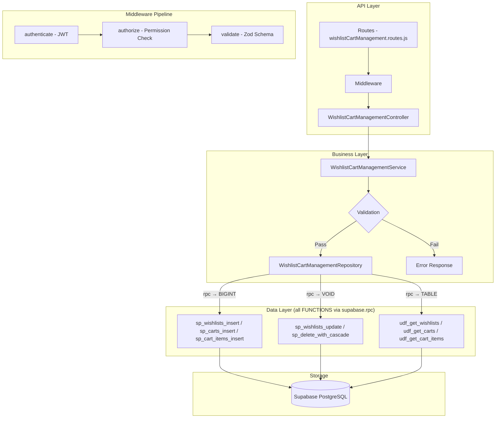

# GrowUpMore API — Wishlist & Cart Management Module

## Postman Testing Guide

**Base URL:** `http://localhost:5001`
**API Prefix:** `/api/v1/wishlist-cart-management`
**Content-Type:** `application/json`
**Authentication:** All endpoints require `Bearer <access_token>` in Authorization header

---

## Architecture Flow



---

## Prerequisites

Before testing, ensure:

1. **Authentication**: Login via `POST /api/v1/auth/login` to obtain `access_token`
2. **Permissions**: Run wishlist-cart management permissions seed in Supabase SQL Editor
3. **Valid Students**: At least one active student user account exists
4. **Valid Items**: Courses, bundles, batches, and webinars exist in the system

---

## Complete Endpoint Reference

### Test Order (follow this sequence in Postman)

| # | Endpoint | Permission | Purpose |
|---|----------|-----------|---------|
| 1 | `POST /wishlists` | `wishlist.create` | Create a wishlist entry |
| 2 | `GET /wishlists` | `wishlist.read` | List all wishlist entries with filters |
| 3 | `GET /wishlists/:id` | `wishlist.read` | Get wishlist by ID |
| 4 | `PATCH /wishlists/:id` | `wishlist.update` | Update wishlist entry |
| 5 | `DELETE /wishlists/:id` | `wishlist.delete` | Soft delete wishlist |
| 6 | `POST /wishlists/:id/restore` | `wishlist.update` | Restore soft-deleted wishlist |
| 7 | `POST /wishlists/bulk-delete` | `wishlist.delete` | Bulk delete wishlist entries |
| 8 | `POST /wishlists/bulk-restore` | `wishlist.update` | Bulk restore wishlist entries |
| 9 | `POST /carts` | `cart.create` | Create a shopping cart |
| 10 | `GET /carts` | `cart.read` | List all carts with filters |
| 11 | `GET /carts/:id` | `cart.read` | Get cart by ID |
| 12 | `PATCH /carts/:id` | `cart.update` | Update cart details |
| 13 | `DELETE /carts/:id` | `cart.delete` | Soft delete cart |
| 14 | `POST /carts/:id/restore` | `cart.update` | Restore soft-deleted cart |
| 15 | `POST /cart-items` | `cart_item.create` | Create a cart item |
| 16 | `GET /cart-items` | `cart_item.read` | List all cart items with filters |
| 17 | `GET /cart-items/:id` | `cart_item.read` | Get cart item by ID |
| 18 | `PATCH /cart-items/:id` | `cart_item.update` | Update cart item |
| 19 | `DELETE /cart-items/:id` | `cart_item.delete` | Soft delete cart item |
| 20 | `POST /cart-items/:id/restore` | `cart_item.update` | Restore soft-deleted cart item |

---

## Common Headers (All Requests)

| Key | Value |
|-----|-------|
| Authorization | Bearer `<access_token>` |
| Content-Type | `application/json` |

---

## 1. WISHLISTS

### 1.1 Create Wishlist

**`POST /api/v1/wishlist-cart-management/wishlists`**

**Permission:** `wishlist.create`

**Headers:**
```
Authorization: Bearer {{access_token}}
Content-Type: application/json
```

**Request Body:**

| Field | Type | Required | Description |
|-------|------|----------|-------------|
| studentId | number | Yes | ID of the student |
| itemType | string | Yes | Type of item: `course`, `bundle`, `batch`, or `webinar` |
| courseId | number | No | Course ID (if itemType is course) |
| bundleId | number | No | Bundle ID (if itemType is bundle) |
| batchId | number | No | Batch ID (if itemType is batch) |
| webinarId | number | No | Webinar ID (if itemType is webinar) |
| isActive | boolean | No | Active status (default: true) |

**Example Request:**
```json
{
  "studentId": 1001,
  "itemType": "course",
  "courseId": 501,
  "bundleId": null,
  "batchId": null,
  "webinarId": null,
  "isActive": true
}
```

**Expected Response (201):**
```json
{
  "success": true,
  "message": "Wishlist created successfully",
  "data": {
    "id": 1
  }
}
```

**Postman Tests:**
```javascript
pm.test("Status is 201", () => pm.response.to.have.status(201));
const json = pm.response.json();
pm.test("Has wishlist ID", () => pm.expect(json.data.id).to.be.a("number"));
pm.collectionVariables.set("wishlistId", json.data.id);
```

---

### 1.2 List Wishlists

**`GET /api/v1/wishlist-cart-management/wishlists`**

**Permission:** `wishlist.read`

**Headers:**
```
Authorization: Bearer {{access_token}}
```

**Query Parameters:**

| Parameter | Type | Default | Description |
|-----------|------|---------|-------------|
| `page` | number | 1 | Page number |
| `limit` | number | 20 | Items per page |
| `search` | string | — | Search term (max 100 characters) |
| `sortBy` | string | createdAt | Sort field (createdAt, updatedAt, studentId, itemType) |
| `sortDir` | string | DESC | Sort direction (ASC/DESC) |
| `studentId` | number | — | Filter by student ID |
| `itemType` | string | — | Filter by item type: `course`, `bundle`, `batch`, `webinar` |
| `courseId` | number | — | Filter by course ID |
| `bundleId` | number | — | Filter by bundle ID |
| `batchId` | number | — | Filter by batch ID |
| `webinarId` | number | — | Filter by webinar ID |
| `isActive` | boolean | — | Filter by active status |

**Example:** `GET /api/v1/wishlist-cart-management/wishlists?page=1&limit=10&studentId=1001&sortBy=createdAt&sortDir=DESC`

**Expected Response (200):**
```json
{
  "success": true,
  "message": "Wishlists retrieved successfully",
  "data": [
    {
      "id": 1,
      "studentId": 1001,
      "itemType": "course",
      "courseId": 501,
      "bundleId": null,
      "batchId": null,
      "webinarId": null,
      "isActive": true,
      "createdAt": "2026-04-06T10:30:00Z",
      "updatedAt": "2026-04-06T10:30:00Z"
    },
    {
      "id": 2,
      "studentId": 1001,
      "itemType": "bundle",
      "courseId": null,
      "bundleId": 201,
      "batchId": null,
      "webinarId": null,
      "isActive": true,
      "createdAt": "2026-04-05T14:20:00Z",
      "updatedAt": "2026-04-05T14:20:00Z"
    }
  ],
  "pagination": {
    "page": 1,
    "limit": 10,
    "total": 3,
    "pages": 1
  }
}
```

**Postman Tests:**
```javascript
pm.test("Status is 200", () => pm.response.to.have.status(200));
const json = pm.response.json();
pm.test("Data is array", () => pm.expect(json.data).to.be.an("array"));
pm.test("Has pagination", () => pm.expect(json.pagination).to.exist);
```

---

### 1.3 Get Wishlist by ID

**`GET /api/v1/wishlist-cart-management/wishlists/:id`**

**Permission:** `wishlist.read`

**Headers:**
```
Authorization: Bearer {{access_token}}
```

**Example:** `GET /api/v1/wishlist-cart-management/wishlists/{{wishlistId}}`

**Expected Response (200):**
```json
{
  "success": true,
  "message": "Wishlist retrieved successfully",
  "data": {
    "id": 1,
    "studentId": 1001,
    "itemType": "course",
    "courseId": 501,
    "bundleId": null,
    "batchId": null,
    "webinarId": null,
    "isActive": true,
    "createdAt": "2026-04-06T10:30:00Z",
    "updatedAt": "2026-04-06T10:30:00Z"
  }
}
```

**Postman Tests:**
```javascript
pm.test("Status is 200", () => pm.response.to.have.status(200));
const json = pm.response.json();
pm.test("Has item data", () => pm.expect(json.data.itemType).to.exist);
```

---

### 1.4 Update Wishlist

**`PATCH /api/v1/wishlist-cart-management/wishlists/:id`**

**Permission:** `wishlist.update`

**Headers:**
```
Authorization: Bearer {{access_token}}
Content-Type: application/json
```

**Request Body:**

| Field | Type | Required | Description |
|-------|------|----------|-------------|
| isActive | boolean | No | Active status |

**Example Request:**
```json
{
  "isActive": false
}
```

**Expected Response (200):**
```json
{
  "success": true,
  "message": "Wishlist updated successfully",
  "data": {
    "id": 1
  }
}
```

**Postman Tests:**
```javascript
pm.test("Status is 200", () => pm.response.to.have.status(200));
const json = pm.response.json();
pm.test("Has ID in response", () => pm.expect(json.data.id).to.exist);
```

---

### 1.5 Delete Wishlist

**`DELETE /api/v1/wishlist-cart-management/wishlists/:id`**

**Permission:** `wishlist.delete`

**Headers:**
```
Authorization: Bearer {{access_token}}
```

**Example:** `DELETE /api/v1/wishlist-cart-management/wishlists/{{wishlistId}}`

**Expected Response (200):**
```json
{
  "success": true,
  "message": "Wishlist deleted successfully",
  "data": {}
}
```

**Postman Tests:**
```javascript
pm.test("Status is 200", () => pm.response.to.have.status(200));
pm.test("Success flag is true", () => pm.expect(pm.response.json().success).to.be.true);
```

---

### 1.6 Restore Wishlist

**`POST /api/v1/wishlist-cart-management/wishlists/:id/restore`**

**Permission:** `wishlist.update`

**Headers:**
```
Authorization: Bearer {{access_token}}
Content-Type: application/json
```

**Request Body:**

| Field | Type | Required | Description |
|-------|------|----------|-------------|
| (empty) | — | — | No body required |

**Example Request:**
```json
{}
```

**Expected Response (200):**
```json
{
  "success": true,
  "message": "Wishlist restored successfully",
  "data": {
    "id": 1
  }
}
```

**Postman Tests:**
```javascript
pm.test("Status is 200", () => pm.response.to.have.status(200));
pm.test("Restore successful", () => pm.expect(pm.response.json().success).to.be.true);
```

---

### 1.7 Bulk Delete Wishlists

**`POST /api/v1/wishlist-cart-management/wishlists/bulk-delete`**

**Permission:** `wishlist.delete`

**Headers:**
```
Authorization: Bearer {{access_token}}
Content-Type: application/json
```

**Request Body:**

| Field | Type | Required | Description |
|-------|------|----------|-------------|
| ids | array | Yes | Array of wishlist IDs to delete |

**Example Request:**
```json
{
  "ids": [1, 2, 3]
}
```

**Expected Response (200):**
```json
{
  "success": true,
  "message": "Wishlists deleted successfully",
  "data": {
    "deletedCount": 3
  }
}
```

**Postman Tests:**
```javascript
pm.test("Status is 200", () => pm.response.to.have.status(200));
const json = pm.response.json();
pm.test("Has deletedCount", () => pm.expect(json.data.deletedCount).to.be.a("number"));
```

---

### 1.8 Bulk Restore Wishlists

**`POST /api/v1/wishlist-cart-management/wishlists/bulk-restore`**

**Permission:** `wishlist.update`

**Headers:**
```
Authorization: Bearer {{access_token}}
Content-Type: application/json
```

**Request Body:**

| Field | Type | Required | Description |
|-------|------|----------|-------------|
| ids | array | Yes | Array of wishlist IDs to restore |

**Example Request:**
```json
{
  "ids": [1, 2, 3]
}
```

**Expected Response (200):**
```json
{
  "success": true,
  "message": "Wishlists restored successfully",
  "data": {
    "restoredCount": 3
  }
}
```

**Postman Tests:**
```javascript
pm.test("Status is 200", () => pm.response.to.have.status(200));
const json = pm.response.json();
pm.test("Has restoredCount", () => pm.expect(json.data.restoredCount).to.be.a("number"));
```

---

## 2. CARTS

### 2.1 Create Cart

**`POST /api/v1/wishlist-cart-management/carts`**

**Permission:** `cart.create`

**Headers:**
```
Authorization: Bearer {{access_token}}
Content-Type: application/json
```

**Request Body:**

| Field | Type | Required | Description |
|-------|------|----------|-------------|
| studentId | number | Yes | ID of the student |
| currency | string | No | Currency code (default: `INR`) |
| expiresAt | string | No | Cart expiration date (ISO 8601 datetime) |

**Example Request:**
```json
{
  "studentId": 1001,
  "currency": "INR",
  "expiresAt": "2026-04-13T23:59:59Z"
}
```

**Expected Response (201):**
```json
{
  "success": true,
  "message": "Cart created successfully",
  "data": {
    "id": 100
  }
}
```

**Postman Tests:**
```javascript
pm.test("Status is 201", () => pm.response.to.have.status(201));
const json = pm.response.json();
pm.test("Has cart ID", () => pm.expect(json.data.id).to.be.a("number"));
pm.collectionVariables.set("cartId", json.data.id);
```

---

### 2.2 List Carts

**`GET /api/v1/wishlist-cart-management/carts`**

**Permission:** `cart.read`

**Headers:**
```
Authorization: Bearer {{access_token}}
```

**Query Parameters:**

| Parameter | Type | Default | Description |
|-----------|------|---------|-------------|
| `page` | number | 1 | Page number |
| `limit` | number | 20 | Items per page |
| `search` | string | — | Search term (max 100 characters) |
| `sortBy` | string | createdAt | Sort field (createdAt, updatedAt, studentId, totalAmount) |
| `sortDir` | string | DESC | Sort direction (ASC/DESC) |
| `studentId` | number | — | Filter by student ID |
| `cartStatus` | string | — | Filter by cart status (active, abandoned, converted, expired) |
| `couponId` | number | — | Filter by coupon ID |
| `isActive` | boolean | — | Filter by active status |

**Example:** `GET /api/v1/wishlist-cart-management/carts?page=1&limit=10&studentId=1001&cartStatus=active`

**Expected Response (200):**
```json
{
  "success": true,
  "message": "Carts retrieved successfully",
  "data": [
    {
      "id": 100,
      "studentId": 1001,
      "currency": "INR",
      "couponId": null,
      "subtotal": 2999,
      "discountAmount": 300,
      "totalAmount": 2699,
      "cartStatus": "active",
      "convertedAt": null,
      "expiresAt": "2026-04-13T23:59:59Z",
      "isActive": true,
      "createdAt": "2026-04-06T10:45:00Z",
      "updatedAt": "2026-04-06T11:20:00Z"
    },
    {
      "id": 101,
      "studentId": 1001,
      "currency": "INR",
      "couponId": 25,
      "subtotal": 5999,
      "discountAmount": 600,
      "totalAmount": 5399,
      "cartStatus": "active",
      "convertedAt": null,
      "expiresAt": "2026-04-10T23:59:59Z",
      "isActive": true,
      "createdAt": "2026-04-05T15:30:00Z",
      "updatedAt": "2026-04-05T16:00:00Z"
    }
  ],
  "pagination": {
    "page": 1,
    "limit": 10,
    "total": 2,
    "pages": 1
  }
}
```

**Postman Tests:**
```javascript
pm.test("Status is 200", () => pm.response.to.have.status(200));
const json = pm.response.json();
pm.test("Data is array", () => pm.expect(json.data).to.be.an("array"));
```

---

### 2.3 Get Cart by ID

**`GET /api/v1/wishlist-cart-management/carts/:id`**

**Permission:** `cart.read`

**Headers:**
```
Authorization: Bearer {{access_token}}
```

**Example:** `GET /api/v1/wishlist-cart-management/carts/{{cartId}}`

**Expected Response (200):**
```json
{
  "success": true,
  "message": "Cart retrieved successfully",
  "data": {
    "id": 100,
    "studentId": 1001,
    "currency": "INR",
    "couponId": null,
    "subtotal": 2999,
    "discountAmount": 300,
    "totalAmount": 2699,
    "cartStatus": "active",
    "convertedAt": null,
    "expiresAt": "2026-04-13T23:59:59Z",
    "isActive": true,
    "createdAt": "2026-04-06T10:45:00Z",
    "updatedAt": "2026-04-06T11:20:00Z"
  }
}
```

**Postman Tests:**
```javascript
pm.test("Status is 200", () => pm.response.to.have.status(200));
const json = pm.response.json();
pm.test("Has totalAmount", () => pm.expect(json.data.totalAmount).to.be.a("number"));
```

---

### 2.4 Update Cart

**`PATCH /api/v1/wishlist-cart-management/carts/:id`**

**Permission:** `cart.update`

**Headers:**
```
Authorization: Bearer {{access_token}}
Content-Type: application/json
```

**Request Body:**

| Field | Type | Required | Description |
|-------|------|----------|-------------|
| couponId | number | No | Coupon ID to apply to cart |
| subtotal | number | No | Subtotal amount |
| discountAmount | number | No | Discount amount |
| totalAmount | number | No | Total amount after discount |
| cartStatus | string | No | Cart status (active, abandoned, converted, expired) |
| convertedAt | string | No | Conversion timestamp |
| expiresAt | string | No | Expiration timestamp |

**Example Request:**
```json
{
  "couponId": 25,
  "subtotal": 2999,
  "discountAmount": 300,
  "totalAmount": 2699,
  "cartStatus": "active",
  "convertedAt": null,
  "expiresAt": "2026-04-13T23:59:59Z"
}
```

**Expected Response (200):**
```json
{
  "success": true,
  "message": "Cart updated successfully",
  "data": {
    "id": 100
  }
}
```

**Postman Tests:**
```javascript
pm.test("Status is 200", () => pm.response.to.have.status(200));
pm.test("Update successful", () => pm.expect(pm.response.json().success).to.be.true);
```

---

### 2.5 Delete Cart

**`DELETE /api/v1/wishlist-cart-management/carts/:id`**

**Permission:** `cart.delete`

**Headers:**
```
Authorization: Bearer {{access_token}}
```

**Example:** `DELETE /api/v1/wishlist-cart-management/carts/{{cartId}}`

**Expected Response (200):**
```json
{
  "success": true,
  "message": "Cart deleted successfully",
  "data": {}
}
```

**Postman Tests:**
```javascript
pm.test("Status is 200", () => pm.response.to.have.status(200));
pm.test("Success flag is true", () => pm.expect(pm.response.json().success).to.be.true);
```

---

### 2.6 Restore Cart

**`POST /api/v1/wishlist-cart-management/carts/:id/restore`**

**Permission:** `cart.update`

**Headers:**
```
Authorization: Bearer {{access_token}}
Content-Type: application/json
```

**Request Body:**

| Field | Type | Required | Description |
|-------|------|----------|-------------|
| (empty) | — | — | No body required |

**Example Request:**
```json
{}
```

**Expected Response (200):**
```json
{
  "success": true,
  "message": "Cart restored successfully",
  "data": {
    "id": 100
  }
}
```

**Postman Tests:**
```javascript
pm.test("Status is 200", () => pm.response.to.have.status(200));
pm.test("Restore successful", () => pm.expect(pm.response.json().success).to.be.true);
```

---

## 3. CART ITEMS

### 3.1 Create Cart Item

**`POST /api/v1/wishlist-cart-management/cart-items`**

**Permission:** `cart_item.create`

**Headers:**
```
Authorization: Bearer {{access_token}}
Content-Type: application/json
```

**Request Body:**

| Field | Type | Required | Description |
|-------|------|----------|-------------|
| cartId | number | Yes | ID of the cart |
| itemType | string | Yes | Type of item: `course`, `bundle`, `batch`, or `webinar` |
| courseId | number | No | Course ID (if itemType is course) |
| bundleId | number | No | Bundle ID (if itemType is bundle) |
| batchId | number | No | Batch ID (if itemType is batch) |
| webinarId | number | No | Webinar ID (if itemType is webinar) |
| displayOrder | number | No | Display order (default: 0) |

**Example Request:**
```json
{
  "cartId": 100,
  "itemType": "course",
  "courseId": 501,
  "bundleId": null,
  "batchId": null,
  "webinarId": null,
  "displayOrder": 1
}
```

**Expected Response (201):**
```json
{
  "success": true,
  "message": "Cart item created successfully",
  "data": {
    "id": 1000
  }
}
```

**Postman Tests:**
```javascript
pm.test("Status is 201", () => pm.response.to.have.status(201));
const json = pm.response.json();
pm.test("Has cart item ID", () => pm.expect(json.data.id).to.be.a("number"));
pm.collectionVariables.set("cartItemId", json.data.id);
```

---

### 3.2 List Cart Items

**`GET /api/v1/wishlist-cart-management/cart-items`**

**Permission:** `cart_item.read`

**Headers:**
```
Authorization: Bearer {{access_token}}
```

**Query Parameters:**

| Parameter | Type | Default | Description |
|-----------|------|---------|-------------|
| `page` | number | 1 | Page number |
| `limit` | number | 20 | Items per page |
| `search` | string | — | Search term (max 100 characters) |
| `sortBy` | string | displayOrder | Sort field (createdAt, updatedAt, displayOrder, cartId) |
| `sortDir` | string | ASC | Sort direction (ASC/DESC) |
| `cartId` | number | — | Filter by cart ID |
| `itemType` | string | — | Filter by item type: `course`, `bundle`, `batch`, `webinar` |
| `courseId` | number | — | Filter by course ID |
| `bundleId` | number | — | Filter by bundle ID |
| `batchId` | number | — | Filter by batch ID |
| `webinarId` | number | — | Filter by webinar ID |
| `isActive` | boolean | — | Filter by active status |

**Example:** `GET /api/v1/wishlist-cart-management/cart-items?page=1&limit=10&cartId=100&sortBy=displayOrder&sortDir=ASC`

**Expected Response (200):**
```json
{
  "success": true,
  "message": "Cart items retrieved successfully",
  "data": [
    {
      "id": 1000,
      "cartId": 100,
      "itemType": "course",
      "courseId": 501,
      "bundleId": null,
      "batchId": null,
      "webinarId": null,
      "price": 999,
      "displayOrder": 1,
      "isActive": true,
      "createdAt": "2026-04-06T11:00:00Z",
      "updatedAt": "2026-04-06T11:00:00Z"
    },
    {
      "id": 1001,
      "cartId": 100,
      "itemType": "bundle",
      "courseId": null,
      "bundleId": 201,
      "batchId": null,
      "webinarId": null,
      "price": 2000,
      "displayOrder": 2,
      "isActive": true,
      "createdAt": "2026-04-06T11:05:00Z",
      "updatedAt": "2026-04-06T11:05:00Z"
    },
    {
      "id": 1002,
      "cartId": 100,
      "itemType": "webinar",
      "courseId": null,
      "bundleId": null,
      "batchId": null,
      "webinarId": 301,
      "price": 499,
      "displayOrder": 3,
      "isActive": true,
      "createdAt": "2026-04-06T11:10:00Z",
      "updatedAt": "2026-04-06T11:10:00Z"
    }
  ],
  "pagination": {
    "page": 1,
    "limit": 10,
    "total": 3,
    "pages": 1
  }
}
```

**Postman Tests:**
```javascript
pm.test("Status is 200", () => pm.response.to.have.status(200));
const json = pm.response.json();
pm.test("Data is array", () => pm.expect(json.data).to.be.an("array"));
```

---

### 3.3 Get Cart Item by ID

**`GET /api/v1/wishlist-cart-management/cart-items/:id`**

**Permission:** `cart_item.read`

**Headers:**
```
Authorization: Bearer {{access_token}}
```

**Example:** `GET /api/v1/wishlist-cart-management/cart-items/{{cartItemId}}`

**Expected Response (200):**
```json
{
  "success": true,
  "message": "Cart item retrieved successfully",
  "data": {
    "id": 1000,
    "cartId": 100,
    "itemType": "course",
    "courseId": 501,
    "bundleId": null,
    "batchId": null,
    "webinarId": null,
    "price": 999,
    "displayOrder": 1,
    "isActive": true,
    "createdAt": "2026-04-06T11:00:00Z",
    "updatedAt": "2026-04-06T11:00:00Z"
  }
}
```

**Postman Tests:**
```javascript
pm.test("Status is 200", () => pm.response.to.have.status(200));
const json = pm.response.json();
pm.test("Has price", () => pm.expect(json.data.price).to.be.a("number"));
```

---

### 3.4 Update Cart Item

**`PATCH /api/v1/wishlist-cart-management/cart-items/:id`**

**Permission:** `cart_item.update`

**Headers:**
```
Authorization: Bearer {{access_token}}
Content-Type: application/json
```

**Request Body:**

| Field | Type | Required | Description |
|-------|------|----------|-------------|
| price | number | No | Item price |
| displayOrder | number | No | Display order |

**Example Request:**
```json
{
  "price": 1099,
  "displayOrder": 2
}
```

**Expected Response (200):**
```json
{
  "success": true,
  "message": "Cart item updated successfully",
  "data": {
    "id": 1000
  }
}
```

**Postman Tests:**
```javascript
pm.test("Status is 200", () => pm.response.to.have.status(200));
pm.test("Update successful", () => pm.expect(pm.response.json().success).to.be.true);
```

---

### 3.5 Delete Cart Item

**`DELETE /api/v1/wishlist-cart-management/cart-items/:id`**

**Permission:** `cart_item.delete`

**Headers:**
```
Authorization: Bearer {{access_token}}
```

**Example:** `DELETE /api/v1/wishlist-cart-management/cart-items/{{cartItemId}}`

**Expected Response (200):**
```json
{
  "success": true,
  "message": "Cart item deleted successfully",
  "data": {}
}
```

**Postman Tests:**
```javascript
pm.test("Status is 200", () => pm.response.to.have.status(200));
pm.test("Success flag is true", () => pm.expect(pm.response.json().success).to.be.true);
```

---

### 3.6 Restore Cart Item

**`POST /api/v1/wishlist-cart-management/cart-items/:id/restore`**

**Permission:** `cart_item.update`

**Headers:**
```
Authorization: Bearer {{access_token}}
Content-Type: application/json
```

**Request Body:**

| Field | Type | Required | Description |
|-------|------|----------|-------------|
| (empty) | — | — | No body required |

**Example Request:**
```json
{}
```

**Expected Response (200):**
```json
{
  "success": true,
  "message": "Cart item restored successfully",
  "data": {
    "id": 1000
  }
}
```

**Postman Tests:**
```javascript
pm.test("Status is 200", () => pm.response.to.have.status(200));
pm.test("Restore successful", () => pm.expect(pm.response.json().success).to.be.true);
```

---

## Entity Relationships

### Wishlist
- Represents items (courses, bundles, batches, webinars) that students save for later
- Each wishlist entry is associated with a single student and one item
- Supports soft delete and restore operations
- Stateful: can be marked as active or inactive

### Cart
- Represents a shopping cart for a student
- Contains multiple cart items
- Tracks pricing information: subtotal, discount amount, and total amount
- Can have an associated coupon
- Supports expiration dates for cart validity
- Supports soft delete and restore operations

### Cart Item
- Individual items added to a cart
- References a cart and one specific item (course, bundle, batch, or webinar)
- Tracks price and display order
- Supports soft delete and restore operations

### Relationships
```
Student
  └── Wishlists (many)
  └── Carts (many)
       └── Cart Items (many)
```

---

## Item Types

| Item Type | Description | Use Case |
|-----------|-------------|----------|
| **course** | Single course | Individual course purchase |
| **bundle** | Collection of courses | Package deals |
| **batch** | Course batch/cohort | Time-based course offerings |
| **webinar** | Live or recorded webinar | Interactive learning sessions |

---

## Cart Status Values

| Status | Description |
|--------|-------------|
| **active** | Cart is active and can be modified |
| **abandoned** | Cart has been abandoned by student |
| **converted** | Cart has been converted to an order |
| **expired** | Cart has exceeded expiration date |

---

## Permission Matrix

| Action | Wishlist | Cart | Cart Item |
|--------|----------|------|-----------|
| **Create** | `wishlist.create` | `cart.create` | `cart_item.create` |
| **Read** | `wishlist.read` | `cart.read` | `cart_item.read` |
| **Update** | `wishlist.update` | `cart.update` | `cart_item.update` |
| **Delete** | `wishlist.delete` | `cart.delete` | `cart_item.delete` |
