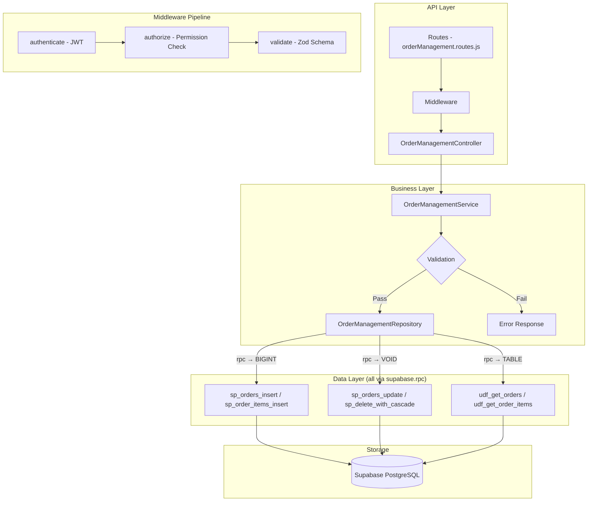

# GrowUpMore API — Order Management Module

## Postman Testing Guide

**Base URL:** `http://localhost:5001`
**API Prefix:** `/api/v1/order-management`
**Content-Type:** `application/json`
**Authentication:** All endpoints require `Bearer <access_token>` in Authorization header

---

## Architecture Flow



---

## Prerequisites

Before testing, ensure:

1. **Authentication**: Login via `POST /api/v1/auth/login` to obtain `access_token`
2. **Permissions**: Run order management permissions seed script in Supabase SQL Editor
3. **Student Accounts**: At least one active student user account exists
4. **Cart Data**: Ensure cart records exist if testing with cartId references
5. **Coupon Codes**: Optional coupon codes configured if testing discount flows

---

## Complete Endpoint Reference

### Test Order (follow this sequence in Postman)

| # | Endpoint | Permission | Purpose |
|---|----------|-----------|---------|
| 1 | `POST /orders` | `order.create` | Create a new order |
| 2 | `GET /orders` | `order.read` | List all orders with filters and pagination |
| 3 | `GET /orders/:id` | `order.read` | Get order by ID |
| 4 | `PATCH /orders/:id` | `order.update` | Update order details |
| 5 | `DELETE /orders/:id` | `order.delete` | Soft delete order |
| 6 | `POST /orders/:id/restore` | `order.update` | Restore soft-deleted order |
| 7 | `POST /order-items` | `order_item.create` | Create order item |
| 8 | `GET /order-items/:id` | `order_item.read` | Get order item by ID |
| 9 | `PATCH /order-items/:id` | `order_item.update` | Update order item |
| 10 | `DELETE /order-items/:id` | `order_item.delete` | Soft delete order item |
| 11 | `POST /order-items/:id/restore` | `order_item.update` | Restore order item |

---

## Common Headers (All Requests)

| Key | Value |
|-----|-------|
| Authorization | Bearer `<access_token>` |
| Content-Type | `application/json` |

---

## 1. ORDERS

### 1.1 Create Order

**`POST /api/v1/order-management/orders`**

**Permission:** `order.create`

**Headers:**
```
Authorization: Bearer {{access_token}}
Content-Type: application/json
```

**Request Body:**

| Field | Type | Required | Description |
|-------|------|----------|-------------|
| studentId | number | Yes | ID of the student placing the order |
| orderNumber | string | No | Unique order reference number |
| cartId | number | No | Associated cart ID |
| orderStatus | string | No | pending, processing, completed, failed, cancelled, refunded (default: pending) |
| subtotal | number | No | Order subtotal before tax and discount |
| discountAmount | number | No | Total discount applied |
| taxAmount | number | No | Tax amount |
| totalAmount | number | No | Final total amount |
| currency | string | No | Currency code (default: INR) |
| couponId | number | No | Applied coupon ID |
| couponCode | string | No | Applied coupon code |
| paymentMethod | string | No | credit_card, debit_card, upi, wallet, net_banking |
| paymentGateway | string | No | razorpay, stripe, paypal, instamojo |
| gatewayTransactionId | string | No | Transaction ID from payment gateway |
| gatewayResponse | object | No | Full gateway response object |
| billingName | string | No | Billing contact name |
| billingEmail | string | No | Billing email address |
| billingPhone | string | No | Billing phone number |
| notes | string | No | Additional order notes |

**Example Request:**
```json
{
  "studentId": 1001,
  "orderNumber": "ORD-2026-04-001",
  "cartId": 50,
  "orderStatus": "pending",
  "subtotal": 5000.00,
  "discountAmount": 500.00,
  "taxAmount": 450.00,
  "totalAmount": 4950.00,
  "currency": "INR",
  "couponId": 123,
  "couponCode": "SPRING26",
  "paymentMethod": "credit_card",
  "paymentGateway": "razorpay",
  "gatewayTransactionId": "txn_1A2B3C4D5E6F7G8H",
  "gatewayResponse": {
    "status": "authorized",
    "amount": 495000,
    "currency": "INR"
  },
  "billingName": "John Doe",
  "billingEmail": "john.doe@example.com",
  "billingPhone": "+91-9876543210",
  "notes": "Priority order"
}
```

**Expected Response (201):**
```json
{
  "success": true,
  "message": "Order created successfully",
  "data": {
    "id": 2501,
    "studentId": 1001,
    "orderNumber": "ORD-2026-04-001",
    "cartId": 50,
    "orderStatus": "pending",
    "subtotal": 5000.00,
    "discountAmount": 500.00,
    "taxAmount": 450.00,
    "totalAmount": 4950.00,
    "currency": "INR",
    "couponId": 123,
    "couponCode": "SPRING26",
    "paymentMethod": "credit_card",
    "paymentGateway": "razorpay",
    "gatewayTransactionId": "txn_1A2B3C4D5E6F7G8H",
    "gatewayResponse": {
      "status": "authorized",
      "amount": 495000,
      "currency": "INR"
    },
    "paidAt": null,
    "refundedAt": null,
    "refundAmount": null,
    "refundReason": null,
    "billingName": "John Doe",
    "billingEmail": "john.doe@example.com",
    "billingPhone": "+91-9876543210",
    "notes": "Priority order",
    "isActive": true,
    "createdAt": "2026-04-06T10:30:00Z",
    "updatedAt": "2026-04-06T10:30:00Z"
  }
}
```

**Postman Tests:**
```javascript
pm.test("Status is 201", () => pm.response.to.have.status(201));
const json = pm.response.json();
pm.test("Has order ID", () => pm.expect(json.data.id).to.be.a("number"));
pm.test("Order status is pending", () => pm.expect(json.data.orderStatus).to.equal("pending"));
pm.collectionVariables.set("orderId", json.data.id);
```

---

### 1.2 List Orders

**`GET /api/v1/order-management/orders`**

**Permission:** `order.read`

**Headers:**
```
Authorization: Bearer {{access_token}}
```

**Query Parameters:**

| Parameter | Type | Required | Description |
|-----------|------|----------|-------------|
| page | number | No | Page number (default: 1) |
| limit | number | No | Results per page (default: 20) |
| studentId | number | No | Filter by student ID |
| orderStatus | string | No | Filter by status: pending, processing, completed, failed, cancelled, refunded |
| paymentMethod | string | No | Filter by payment method |
| paymentGateway | string | No | Filter by payment gateway |
| couponId | number | No | Filter by coupon ID |
| dateFrom | string | No | Filter orders from date (ISO 8601) |
| dateTo | string | No | Filter orders until date (ISO 8601) |
| isActive | boolean | No | Filter by active status |
| searchTerm | string | No | Search in order notes or order number |
| sortBy | string | No | Sort field: created_at, orderNumber, totalAmount, orderStatus |
| sortDir | string | No | Sort direction: ASC or DESC |

**Example:**
```
GET /api/v1/order-management/orders?page=1&limit=10&orderStatus=completed&sortBy=created_at&sortDir=DESC
```

**Expected Response (200):**
```json
{
  "success": true,
  "message": "Orders retrieved successfully",
  "data": [
    {
      "id": 2501,
      "studentId": 1001,
      "orderNumber": "ORD-2026-04-001",
      "cartId": 50,
      "orderStatus": "completed",
      "subtotal": 5000.00,
      "discountAmount": 500.00,
      "taxAmount": 450.00,
      "totalAmount": 4950.00,
      "currency": "INR",
      "couponId": 123,
      "couponCode": "SPRING26",
      "paymentMethod": "credit_card",
      "paymentGateway": "razorpay",
      "gatewayTransactionId": "txn_1A2B3C4D5E6F7G8H",
      "gatewayResponse": {
        "status": "captured",
        "amount": 495000,
        "currency": "INR"
      },
      "paidAt": "2026-04-06T10:35:00Z",
      "refundedAt": null,
      "refundAmount": null,
      "refundReason": null,
      "billingName": "John Doe",
      "billingEmail": "john.doe@example.com",
      "billingPhone": "+91-9876543210",
      "notes": "Priority order",
      "isActive": true,
      "createdAt": "2026-04-06T10:30:00Z",
      "updatedAt": "2026-04-06T10:35:00Z"
    }
  ],
  "pagination": {
    "page": 1,
    "limit": 10,
    "total": 28,
    "pages": 3
  }
}
```

**Postman Tests:**
```javascript
pm.test("Status is 200", () => pm.response.to.have.status(200));
const json = pm.response.json();
pm.test("Data is array", () => pm.expect(json.data).to.be.an("array"));
pm.test("Has pagination", () => pm.expect(json.pagination).to.be.an("object"));
```

---

### 1.3 Get Order by ID

**`GET /api/v1/order-management/orders/:id`**

**Permission:** `order.read`

**Headers:**
```
Authorization: Bearer {{access_token}}
```

**Example:**
```
GET /api/v1/order-management/orders/2501
```

**Expected Response (200):**
```json
{
  "success": true,
  "message": "Order retrieved successfully",
  "data": {
    "id": 2501,
    "studentId": 1001,
    "orderNumber": "ORD-2026-04-001",
    "cartId": 50,
    "orderStatus": "completed",
    "subtotal": 5000.00,
    "discountAmount": 500.00,
    "taxAmount": 450.00,
    "totalAmount": 4950.00,
    "currency": "INR",
    "couponId": 123,
    "couponCode": "SPRING26",
    "paymentMethod": "credit_card",
    "paymentGateway": "razorpay",
    "gatewayTransactionId": "txn_1A2B3C4D5E6F7G8H",
    "gatewayResponse": {
      "status": "captured",
      "amount": 495000,
      "currency": "INR"
    },
    "paidAt": "2026-04-06T10:35:00Z",
    "refundedAt": null,
    "refundAmount": null,
    "refundReason": null,
    "billingName": "John Doe",
    "billingEmail": "john.doe@example.com",
    "billingPhone": "+91-9876543210",
    "notes": "Priority order",
    "isActive": true,
    "createdAt": "2026-04-06T10:30:00Z",
    "updatedAt": "2026-04-06T10:35:00Z"
  }
}
```

**Postman Tests:**
```javascript
pm.test("Status is 200", () => pm.response.to.have.status(200));
const json = pm.response.json();
pm.test("Order has correct ID", () => pm.expect(json.data.id).to.equal(2501));
pm.test("Order has studentId", () => pm.expect(json.data.studentId).to.be.a("number"));
```

---

### 1.4 Update Order

**`PATCH /api/v1/order-management/orders/:id`**

**Permission:** `order.update`

**Headers:**
```
Authorization: Bearer {{access_token}}
Content-Type: application/json
```

**Request Body:**

| Field | Type | Required | Description |
|-------|------|----------|-------------|
| orderStatus | string | No | New order status |
| subtotal | number | No | Updated subtotal |
| discountAmount | number | No | Updated discount |
| taxAmount | number | No | Updated tax |
| totalAmount | number | No | Updated total |
| currency | string | No | Currency code |
| paymentMethod | string | No | Payment method |
| paymentGateway | string | No | Payment gateway |
| gatewayTransactionId | string | No | Transaction ID |
| gatewayResponse | object | No | Gateway response |
| paidAt | string | No | Payment timestamp |
| billingName | string | No | Billing name |
| billingEmail | string | No | Billing email |
| billingPhone | string | No | Billing phone |
| notes | string | No | Order notes |

**Example Request:**
```json
{
  "orderStatus": "processing",
  "subtotal": 5000.00,
  "discountAmount": 500.00,
  "taxAmount": 450.00,
  "totalAmount": 4950.00,
  "currency": "INR",
  "paymentMethod": "credit_card",
  "paymentGateway": "razorpay",
  "gatewayTransactionId": "txn_1A2B3C4D5E6F7G8H",
  "gatewayResponse": {
    "status": "captured",
    "amount": 495000,
    "currency": "INR"
  },
  "paidAt": "2026-04-06T10:35:00Z",
  "billingName": "John Doe",
  "billingEmail": "john.doe@example.com",
  "billingPhone": "+91-9876543210",
  "notes": "Updated notes"
}
```

**Expected Response (200):**
```json
{
  "success": true,
  "message": "Order updated successfully",
  "data": {
    "id": 2501,
    "studentId": 1001,
    "orderNumber": "ORD-2026-04-001",
    "cartId": 50,
    "orderStatus": "processing",
    "subtotal": 5000.00,
    "discountAmount": 500.00,
    "taxAmount": 450.00,
    "totalAmount": 4950.00,
    "currency": "INR",
    "couponId": 123,
    "couponCode": "SPRING26",
    "paymentMethod": "credit_card",
    "paymentGateway": "razorpay",
    "gatewayTransactionId": "txn_1A2B3C4D5E6F7G8H",
    "gatewayResponse": {
      "status": "captured",
      "amount": 495000,
      "currency": "INR"
    },
    "paidAt": "2026-04-06T10:35:00Z",
    "refundedAt": null,
    "refundAmount": null,
    "refundReason": null,
    "billingName": "John Doe",
    "billingEmail": "john.doe@example.com",
    "billingPhone": "+91-9876543210",
    "notes": "Updated notes",
    "isActive": true,
    "createdAt": "2026-04-06T10:30:00Z",
    "updatedAt": "2026-04-06T11:45:00Z"
  }
}
```

**Postman Tests:**
```javascript
pm.test("Status is 200", () => pm.response.to.have.status(200));
const json = pm.response.json();
pm.test("Order status updated", () => pm.expect(json.data.orderStatus).to.equal("processing"));
pm.test("Updated timestamp present", () => pm.expect(json.data.updatedAt).to.be.a("string"));
```

---

### 1.5 Delete Order

**`DELETE /api/v1/order-management/orders/:id`**

**Permission:** `order.delete`

**Headers:**
```
Authorization: Bearer {{access_token}}
```

**Example:**
```
DELETE /api/v1/order-management/orders/2501
```

**Expected Response (200):**
```json
{
  "success": true,
  "message": "Order deleted successfully",
  "data": {
    "id": 2501,
    "deletedAt": "2026-04-06T12:00:00Z"
  }
}
```

**Postman Tests:**
```javascript
pm.test("Status is 200", () => pm.response.to.have.status(200));
const json = pm.response.json();
pm.test("Has deletedAt timestamp", () => pm.expect(json.data.deletedAt).to.be.a("string"));
```

---

### 1.6 Restore Order

**`POST /api/v1/order-management/orders/:id/restore`**

**Permission:** `order.update`

**Headers:**
```
Authorization: Bearer {{access_token}}
Content-Type: application/json
```

**Request Body:**

| Field | Type | Required | Description |
|-------|------|----------|-------------|
| restoreItems | boolean | No | Whether to restore associated order items (default: false) |

**Example Request:**
```json
{
  "restoreItems": false
}
```

**Expected Response (200):**
```json
{
  "success": true,
  "message": "Order restored successfully",
  "data": {
    "id": 2501,
    "studentId": 1001,
    "orderNumber": "ORD-2026-04-001",
    "cartId": 50,
    "orderStatus": "completed",
    "subtotal": 5000.00,
    "discountAmount": 500.00,
    "taxAmount": 450.00,
    "totalAmount": 4950.00,
    "currency": "INR",
    "couponId": 123,
    "couponCode": "SPRING26",
    "paymentMethod": "credit_card",
    "paymentGateway": "razorpay",
    "gatewayTransactionId": "txn_1A2B3C4D5E6F7G8H",
    "gatewayResponse": {
      "status": "captured",
      "amount": 495000,
      "currency": "INR"
    },
    "paidAt": "2026-04-06T10:35:00Z",
    "refundedAt": null,
    "refundAmount": null,
    "refundReason": null,
    "billingName": "John Doe",
    "billingEmail": "john.doe@example.com",
    "billingPhone": "+91-9876543210",
    "notes": "Priority order",
    "isActive": true,
    "createdAt": "2026-04-06T10:30:00Z",
    "updatedAt": "2026-04-06T12:05:00Z",
    "restoredAt": "2026-04-06T12:05:00Z"
  }
}
```

**Postman Tests:**
```javascript
pm.test("Status is 200", () => pm.response.to.have.status(200));
const json = pm.response.json();
pm.test("Has restoredAt timestamp", () => pm.expect(json.data.restoredAt).to.be.a("string"));
pm.test("Restore successful", () => pm.expect(json.success).to.be.true);
```

---

## 2. ORDER ITEMS

### 2.1 Create Order Item

**`POST /api/v1/order-management/order-items`**

**Permission:** `order_item.create`

**Headers:**
```
Authorization: Bearer {{access_token}}
Content-Type: application/json
```

**Request Body:**

| Field | Type | Required | Description |
|-------|------|----------|-------------|
| orderId | number | Yes | ID of the parent order |
| itemType | string | Yes | course, bundle, batch, or webinar |
| courseId | number | No | Course ID (required if itemType is course) |
| bundleId | number | No | Bundle ID (required if itemType is bundle) |
| batchId | number | No | Batch ID (required if itemType is batch) |
| webinarId | number | No | Webinar ID (required if itemType is webinar) |
| price | number | No | Item price |
| discountAmount | number | No | Discount applied to item |
| finalPrice | number | No | Final price after discount |

**Example Request:**
```json
{
  "orderId": 2501,
  "itemType": "course",
  "courseId": 301,
  "price": 2500.00,
  "discountAmount": 250.00,
  "finalPrice": 2250.00
}
```

**Expected Response (201):**
```json
{
  "success": true,
  "message": "Order item created successfully",
  "data": {
    "id": 3001,
    "orderId": 2501,
    "itemType": "course",
    "courseId": 301,
    "bundleId": null,
    "batchId": null,
    "webinarId": null,
    "price": 2500.00,
    "discountAmount": 250.00,
    "finalPrice": 2250.00,
    "isActive": true,
    "createdAt": "2026-04-06T10:30:00Z",
    "updatedAt": "2026-04-06T10:30:00Z"
  }
}
```

**Postman Tests:**
```javascript
pm.test("Status is 201", () => pm.response.to.have.status(201));
const json = pm.response.json();
pm.test("Has order item ID", () => pm.expect(json.data.id).to.be.a("number"));
pm.test("Item type is course", () => pm.expect(json.data.itemType).to.equal("course"));
pm.collectionVariables.set("orderItemId", json.data.id);
```

---

### 2.2 Get Order Item by ID

**`GET /api/v1/order-management/order-items/:id`**

**Permission:** `order_item.read`

**Headers:**
```
Authorization: Bearer {{access_token}}
```

**Example:**
```
GET /api/v1/order-management/order-items/3001
```

**Expected Response (200):**
```json
{
  "success": true,
  "message": "Order item retrieved successfully",
  "data": {
    "id": 3001,
    "orderId": 2501,
    "itemType": "course",
    "courseId": 301,
    "bundleId": null,
    "batchId": null,
    "webinarId": null,
    "price": 2500.00,
    "discountAmount": 250.00,
    "finalPrice": 2250.00,
    "isActive": true,
    "createdAt": "2026-04-06T10:30:00Z",
    "updatedAt": "2026-04-06T10:30:00Z"
  }
}
```

**Postman Tests:**
```javascript
pm.test("Status is 200", () => pm.response.to.have.status(200));
const json = pm.response.json();
pm.test("Item has correct ID", () => pm.expect(json.data.id).to.equal(3001));
```

---

### 2.3 Update Order Item

**`PATCH /api/v1/order-management/order-items/:id`**

**Permission:** `order_item.update`

**Headers:**
```
Authorization: Bearer {{access_token}}
Content-Type: application/json
```

**Request Body:**

| Field | Type | Required | Description |
|-------|------|----------|-------------|
| price | number | No | Updated item price |
| discountAmount | number | No | Updated discount amount |
| finalPrice | number | No | Updated final price |
| isActive | boolean | No | Active status |

**Example Request:**
```json
{
  "price": 2500.00,
  "discountAmount": 300.00,
  "finalPrice": 2200.00,
  "isActive": true
}
```

**Expected Response (200):**
```json
{
  "success": true,
  "message": "Order item updated successfully",
  "data": {
    "id": 3001,
    "orderId": 2501,
    "itemType": "course",
    "courseId": 301,
    "bundleId": null,
    "batchId": null,
    "webinarId": null,
    "price": 2500.00,
    "discountAmount": 300.00,
    "finalPrice": 2200.00,
    "isActive": true,
    "createdAt": "2026-04-06T10:30:00Z",
    "updatedAt": "2026-04-06T11:45:00Z"
  }
}
```

**Postman Tests:**
```javascript
pm.test("Status is 200", () => pm.response.to.have.status(200));
const json = pm.response.json();
pm.test("Discount updated", () => pm.expect(json.data.discountAmount).to.equal(300.00));
```

---

### 2.4 Delete Order Item

**`DELETE /api/v1/order-management/order-items/:id`**

**Permission:** `order_item.delete`

**Headers:**
```
Authorization: Bearer {{access_token}}
```

**Example:**
```
DELETE /api/v1/order-management/order-items/3001
```

**Expected Response (200):**
```json
{
  "success": true,
  "message": "Order item deleted successfully",
  "data": {
    "id": 3001,
    "deletedAt": "2026-04-06T12:00:00Z"
  }
}
```

**Postman Tests:**
```javascript
pm.test("Status is 200", () => pm.response.to.have.status(200));
const json = pm.response.json();
pm.test("Has deletedAt timestamp", () => pm.expect(json.data.deletedAt).to.be.a("string"));
```

---

### 2.5 Restore Order Item

**`POST /api/v1/order-management/order-items/:id/restore`**

**Permission:** `order_item.update`

**Headers:**
```
Authorization: Bearer {{access_token}}
Content-Type: application/json
```

**Example:**
```
POST /api/v1/order-management/order-items/3001/restore
```

**Request Body:**
```json
{}
```

**Expected Response (200):**
```json
{
  "success": true,
  "message": "Order item restored successfully",
  "data": {
    "id": 3001,
    "orderId": 2501,
    "itemType": "course",
    "courseId": 301,
    "bundleId": null,
    "batchId": null,
    "webinarId": null,
    "price": 2500.00,
    "discountAmount": 300.00,
    "finalPrice": 2200.00,
    "isActive": true,
    "createdAt": "2026-04-06T10:30:00Z",
    "updatedAt": "2026-04-06T12:05:00Z",
    "restoredAt": "2026-04-06T12:05:00Z"
  }
}
```

**Postman Tests:**
```javascript
pm.test("Status is 200", () => pm.response.to.have.status(200));
const json = pm.response.json();
pm.test("Has restoredAt timestamp", () => pm.expect(json.data.restoredAt).to.be.a("string"));
```

---

## Error Responses

### 400 Bad Request
```json
{
  "success": false,
  "message": "Validation error",
  "errors": [
    {
      "field": "studentId",
      "message": "Student ID is required"
    },
    {
      "field": "totalAmount",
      "message": "Total amount must be greater than or equal to 0"
    }
  ]
}
```

### 401 Unauthorized
```json
{
  "success": false,
  "message": "Unauthorized. Invalid or missing access token."
}
```

### 403 Forbidden
```json
{
  "success": false,
  "message": "You do not have permission to perform this action."
}
```

### 404 Not Found
```json
{
  "success": false,
  "message": "Order not found."
}
```

### 409 Conflict
```json
{
  "success": false,
  "message": "Order number already exists for this order."
}
```

### 500 Internal Server Error
```json
{
  "success": false,
  "message": "An unexpected error occurred. Please try again later."
}
```

---

## Order Status Flow

The order lifecycle follows these transitions:

```
Pending
  ↓
Processing
  ├→ Completed (order fulfilled)
  ├→ Failed (payment failed)
  └→ Cancelled (order cancelled before processing)

Completed
  ├→ Refunded (full refund issued)
  └→ Active (waiting for fulfillment)

Cancelled / Refunded / Failed
  ↓
Deleted (soft delete)
  ↓
Restored (can be restored if needed)
```

### Status Definitions

| Status | Description |
|--------|-------------|
| **Pending** | Order created but payment not yet processed |
| **Processing** | Payment received, order is being prepared |
| **Completed** | Order fulfilled and delivered to student |
| **Failed** | Payment processing failed |
| **Cancelled** | Order cancelled by student or admin |
| **Refunded** | Order refunded to student |

---

## Order Item Type Definitions

| Item Type | Description | Required Field |
|-----------|-------------|-----------------|
| **course** | Single course purchase | courseId |
| **bundle** | Bundle of multiple courses | bundleId |
| **batch** | Batch/cohort access | batchId |
| **webinar** | Webinar/live session access | webinarId |

---

## Payment Method Examples

| Method | Description |
|--------|-------------|
| **credit_card** | Credit card payment |
| **debit_card** | Debit card payment |
| **upi** | UPI payment (India) |
| **wallet** | Digital wallet |
| **net_banking** | Net banking transfer |

---

## Payment Gateway Examples

| Gateway | Description |
|---------|-------------|
| **razorpay** | Razorpay payment gateway |
| **stripe** | Stripe payment gateway |
| **paypal** | PayPal gateway |
| **instamojo** | Instamojo gateway |

---
