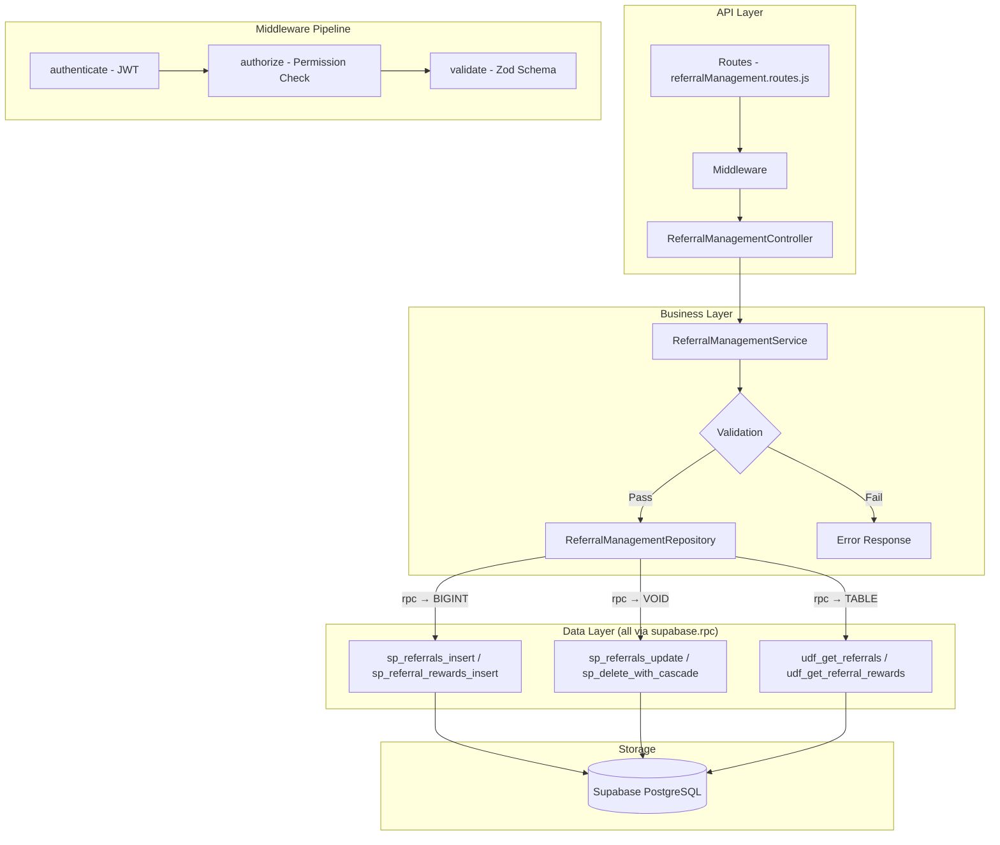

# GrowUpMore API — Referral Management Module

## Postman Testing Guide

**Base URL:** `http://localhost:5001`
**API Prefix:** `/api/v1/referral-management`
**Content-Type:** `application/json`
**Authentication:** All endpoints require `Bearer <access_token>` in Authorization header

---

## Architecture Flow



---

## Prerequisites

Before testing, ensure:

1. **Authentication**: Login via `POST /api/v1/auth/login` to obtain `access_token`
2. **Permissions**: Run referral management permissions seed script in Supabase SQL Editor
3. **Referral Codes**: At least one active referral code exists
4. **Student Accounts**: Multiple student accounts created for referral testing
5. **Orders**: Sample orders in the system for referral validation

---

## Complete Endpoint Reference

### Test Order (follow this sequence in Postman)

| # | Endpoint | Permission | Purpose |
|---|----------|-----------|---------|
| 1 | `POST /referrals` | `referral.create` | Create a new referral |
| 2 | `GET /referrals` | `referral.read` | List all referrals with filters |
| 3 | `GET /referrals/:id` | `referral.read` | Get referral by ID |
| 4 | `PATCH /referrals/:id` | `referral.update` | Update referral status |
| 5 | `DELETE /referrals/:id` | `referral.delete` | Soft delete referral |
| 6 | `POST /referrals/:id/restore` | `referral.delete` | Restore referral |
| 7 | `POST /referral-rewards` | `referral_reward.create` | Create reward for referrer |
| 8 | `GET /referral-rewards` | `referral_reward.read` | List all rewards with filters |
| 9 | `GET /referral-rewards/:id` | `referral_reward.read` | Get reward by ID |
| 10 | `PATCH /referral-rewards/:id` | `referral_reward.update` | Update reward status |
| 11 | `DELETE /referral-rewards/:id` | `referral_reward.delete` | Soft delete reward |
| 12 | `POST /referral-rewards/:id/restore` | `referral_reward.delete` | Restore reward |

---

## Common Headers (All Requests)

| Key | Value |
|-----|-------|
| Authorization | Bearer `<access_token>` |
| Content-Type | `application/json` |

---

## 1. REFERRALS

### 1.1 Create Referral

**`POST /api/v1/referral-management/referrals`**

**Permission:** `referral.create`

**Headers:**
```
Authorization: Bearer {{access_token}}
Content-Type: application/json
```

**Request Body:**

| Field | Type | Required | Description |
|-------|------|----------|-------------|
| referralCodeId | number | Yes | ID of the referral code being used |
| referredStudentId | number | Yes | ID of the student being referred |
| referralStatus | string | No | pending, completed, expired, rejected (default: pending) |
| orderId | number | No | Associated order ID |

**Example Request:**
```json
{
  "referralCodeId": 1001,
  "referredStudentId": 2001,
  "referralStatus": "pending",
  "orderId": 5001
}
```

**Expected Response (201):**
```json
{
  "success": true,
  "message": "Referral created successfully",
  "data": {
    "id": 1,
    "referralCodeId": 1001,
    "referredStudentId": 2001,
    "referralStatus": "pending",
    "orderId": 5001,
    "discountAmount": 0,
    "referrerRewardAmount": 0,
    "referrerRewardStatus": "pending",
    "completedAt": null,
    "isActive": true,
    "createdAt": "2026-04-06T10:30:00Z",
    "updatedAt": "2026-04-06T10:30:00Z"
  }
}
```

**Postman Tests:**
```javascript
pm.test("Status is 201", () => pm.response.to.have.status(201));
const json = pm.response.json();
pm.test("Has referral ID", () => pm.expect(json.data.id).to.be.a("number"));
pm.test("Status is pending", () => pm.expect(json.data.referralStatus).to.equal("pending"));
pm.collectionVariables.set("referralId", json.data.id);
```

---

### 1.2 List Referrals

**`GET /api/v1/referral-management/referrals`**

**Permission:** `referral.read`

**Headers:**
```
Authorization: Bearer {{access_token}}
```

**Query Parameters:**

| Parameter | Type | Required | Description |
|-----------|------|----------|-------------|
| id | number | No | Filter by referral ID |
| referralCodeId | number | No | Filter by referral code ID |
| referredStudentId | number | No | Filter by referred student ID |
| referralStatus | string | No | Filter by status: pending, completed, expired, rejected |
| referrerRewardStatus | string | No | Filter by reward status: pending, awarded, rejected |
| sortBy | string | No | Sort field: created_at, referralStatus, discountAmount, referrerRewardAmount |
| sortDir | string | No | Sort direction: ASC or DESC |
| page | number | No | Page number (default: 1) |
| limit | number | No | Results per page (default: 20, max: 100) |

**Example:**
```
GET /api/v1/referral-management/referrals?page=1&limit=10&referralStatus=completed&sortBy=created_at&sortDir=DESC
```

**Expected Response (200):**
```json
{
  "success": true,
  "message": "Referrals retrieved successfully",
  "data": [
    {
      "id": 1,
      "referralCodeId": 1001,
      "referredStudentId": 2001,
      "referralStatus": "completed",
      "orderId": 5001,
      "discountAmount": 15.00,
      "referrerRewardAmount": 50.00,
      "referrerRewardStatus": "awarded",
      "completedAt": "2026-04-05T14:30:00Z",
      "isActive": true,
      "createdAt": "2026-04-05T10:30:00Z",
      "updatedAt": "2026-04-05T14:30:00Z"
    },
    {
      "id": 2,
      "referralCodeId": 1001,
      "referredStudentId": 2002,
      "referralStatus": "completed",
      "orderId": 5002,
      "discountAmount": 15.00,
      "referrerRewardAmount": 50.00,
      "referrerRewardStatus": "awarded",
      "completedAt": "2026-04-05T15:45:00Z",
      "isActive": true,
      "createdAt": "2026-04-05T11:00:00Z",
      "updatedAt": "2026-04-05T15:45:00Z"
    }
  ],
  "pagination": {
    "page": 1,
    "limit": 10,
    "total": 3,
    "pages": 1
  }
}
```

**Postman Tests:**
```javascript
pm.test("Status is 200", () => pm.response.to.have.status(200));
const json = pm.response.json();
pm.test("Data is array", () => pm.expect(json.data).to.be.an("array"));
pm.test("Has pagination", () => pm.expect(json.pagination).to.be.an("object"));
```

---

### 1.3 Get Referral by ID

**`GET /api/v1/referral-management/referrals/:id`**

**Permission:** `referral.read`

**Headers:**
```
Authorization: Bearer {{access_token}}
```

**Example:**
```
GET /api/v1/referral-management/referrals/1
```

**Expected Response (200):**
```json
{
  "success": true,
  "message": "Referral retrieved successfully",
  "data": {
    "id": 1,
    "referralCodeId": 1001,
    "referredStudentId": 2001,
    "referralStatus": "completed",
    "orderId": 5001,
    "discountAmount": 15.00,
    "referrerRewardAmount": 50.00,
    "referrerRewardStatus": "awarded",
    "completedAt": "2026-04-05T14:30:00Z",
    "isActive": true,
    "createdAt": "2026-04-05T10:30:00Z",
    "updatedAt": "2026-04-05T14:30:00Z"
  }
}
```

**Postman Tests:**
```javascript
pm.test("Status is 200", () => pm.response.to.have.status(200));
const json = pm.response.json();
pm.test("Referral has correct ID", () => pm.expect(json.data.id).to.equal(1));
```

---

### 1.4 Update Referral

**`PATCH /api/v1/referral-management/referrals/:id`**

**Permission:** `referral.update`

**Headers:**
```
Authorization: Bearer {{access_token}}
Content-Type: application/json
```

**Request Body:**

| Field | Type | Required | Description |
|-------|------|----------|-------------|
| referralStatus | string | No | New referral status |
| discountAmount | number | No | Discount amount given to referred student |
| referrerRewardAmount | number | No | Reward amount for referrer |
| referrerRewardStatus | string | No | Referrer reward status |
| completedAt | string | No | Completion timestamp |
| isActive | boolean | No | Active status |

**Example Request:**
```json
{
  "referralStatus": "completed",
  "discountAmount": 15.00,
  "referrerRewardAmount": 50.00,
  "referrerRewardStatus": "awarded",
  "completedAt": "2026-04-05T14:30:00Z",
  "isActive": true
}
```

**Expected Response (200):**
```json
{
  "success": true,
  "message": "Referral updated successfully",
  "data": {
    "id": 1,
    "referralCodeId": 1001,
    "referredStudentId": 2001,
    "referralStatus": "completed",
    "orderId": 5001,
    "discountAmount": 15.00,
    "referrerRewardAmount": 50.00,
    "referrerRewardStatus": "awarded",
    "completedAt": "2026-04-05T14:30:00Z",
    "isActive": true,
    "createdAt": "2026-04-05T10:30:00Z",
    "updatedAt": "2026-04-06T11:00:00Z"
  }
}
```

**Postman Tests:**
```javascript
pm.test("Status is 200", () => pm.response.to.have.status(200));
const json = pm.response.json();
pm.test("Status updated", () => pm.expect(json.data.referralStatus).to.equal("completed"));
```

---

### 1.5 Delete Referral

**`DELETE /api/v1/referral-management/referrals/:id`**

**Permission:** `referral.delete`

**Headers:**
```
Authorization: Bearer {{access_token}}
```

**Example:**
```
DELETE /api/v1/referral-management/referrals/1
```

**Expected Response (200):**
```json
{
  "success": true,
  "message": "Referral deleted successfully",
  "data": {
    "id": 1,
    "deletedAt": "2026-04-06T12:00:00Z"
  }
}
```

**Postman Tests:**
```javascript
pm.test("Status is 200", () => pm.response.to.have.status(200));
const json = pm.response.json();
pm.test("Has deletedAt timestamp", () => pm.expect(json.data.deletedAt).to.be.a("string"));
```

---

### 1.6 Restore Referral

**`POST /api/v1/referral-management/referrals/:id/restore`**

**Permission:** `referral.delete`

**Headers:**
```
Authorization: Bearer {{access_token}}
Content-Type: application/json
```

**Example:**
```
POST /api/v1/referral-management/referrals/1/restore
```

**Request Body:**
```json
{}
```

**Expected Response (200):**
```json
{
  "success": true,
  "message": "Referral restored successfully",
  "data": {
    "id": 1,
    "referralCodeId": 1001,
    "referredStudentId": 2001,
    "referralStatus": "completed",
    "orderId": 5001,
    "discountAmount": 15.00,
    "referrerRewardAmount": 50.00,
    "referrerRewardStatus": "awarded",
    "completedAt": "2026-04-05T14:30:00Z",
    "isActive": true,
    "createdAt": "2026-04-05T10:30:00Z",
    "updatedAt": "2026-04-06T12:05:00Z",
    "restoredAt": "2026-04-06T12:05:00Z"
  }
}
```

**Postman Tests:**
```javascript
pm.test("Status is 200", () => pm.response.to.have.status(200));
const json = pm.response.json();
pm.test("Has restoredAt timestamp", () => pm.expect(json.data.restoredAt).to.be.a("string"));
```

---

## 2. REFERRAL REWARDS

### 2.1 Create Referral Reward

**`POST /api/v1/referral-management/referral-rewards`**

**Permission:** `referral_reward.create`

**Headers:**
```
Authorization: Bearer {{access_token}}
Content-Type: application/json
```

**Request Body:**

| Field | Type | Required | Description |
|-------|------|----------|-------------|
| referralId | number | Yes | ID of the referral |
| studentId | number | Yes | ID of the student receiving the reward (referrer) |
| rewardAmount | number | Yes | Amount of the reward |
| rewardType | string | No | wallet_credit, discount_code, course_access, cash (default: wallet_credit) |
| discountCode | string | No | Discount code if applicable |
| expiresAt | string | No | Reward expiration timestamp (ISO 8601) |

**Example Request:**
```json
{
  "referralId": 1,
  "studentId": 1001,
  "rewardAmount": 50.00,
  "rewardType": "wallet_credit",
  "discountCode": "REWARD50SPRING26",
  "expiresAt": "2026-05-06T23:59:59Z"
}
```

**Expected Response (201):**
```json
{
  "success": true,
  "message": "Referral reward created successfully",
  "data": {
    "id": 100,
    "referralId": 1,
    "studentId": 1001,
    "rewardAmount": 50.00,
    "rewardType": "wallet_credit",
    "discountCode": "REWARD50SPRING26",
    "rewardStatus": "pending",
    "creditedAt": null,
    "redeemedAt": null,
    "expiresAt": "2026-05-06T23:59:59Z",
    "isActive": true,
    "createdAt": "2026-04-06T10:45:00Z",
    "updatedAt": "2026-04-06T10:45:00Z"
  }
}
```

**Postman Tests:**
```javascript
pm.test("Status is 201", () => pm.response.to.have.status(201));
const json = pm.response.json();
pm.test("Has reward ID", () => pm.expect(json.data.id).to.be.a("number"));
pm.test("Status is pending", () => pm.expect(json.data.rewardStatus).to.equal("pending"));
pm.collectionVariables.set("rewardId", json.data.id);
```

---

### 2.2 List Referral Rewards

**`GET /api/v1/referral-management/referral-rewards`**

**Permission:** `referral_reward.read`

**Headers:**
```
Authorization: Bearer {{access_token}}
```

**Query Parameters:**

| Parameter | Type | Required | Description |
|-----------|------|----------|-------------|
| id | number | No | Filter by reward ID |
| referralId | number | No | Filter by referral ID |
| studentId | number | No | Filter by student ID |
| rewardType | string | No | Filter by type: wallet_credit, discount_code, course_access, cash |
| rewardStatus | string | No | Filter by status: pending, credited, redeemed, expired |
| sortBy | string | No | Sort field: created_at, rewardAmount, rewardStatus, expiresAt |
| sortDir | string | No | Sort direction: ASC or DESC |
| page | number | No | Page number (default: 1) |
| limit | number | No | Results per page (default: 20, max: 100) |

**Example:**
```
GET /api/v1/referral-management/referral-rewards?page=1&limit=10&rewardType=wallet_credit&rewardStatus=pending&sortBy=created_at&sortDir=DESC
```

**Expected Response (200):**
```json
{
  "success": true,
  "message": "Referral rewards retrieved successfully",
  "data": [
    {
      "id": 100,
      "referralId": 1,
      "studentId": 1001,
      "rewardAmount": 50.00,
      "rewardType": "wallet_credit",
      "discountCode": "REWARD50SPRING26",
      "rewardStatus": "credited",
      "creditedAt": "2026-04-06T11:00:00Z",
      "redeemedAt": null,
      "expiresAt": "2026-05-06T23:59:59Z",
      "isActive": true,
      "createdAt": "2026-04-06T10:45:00Z",
      "updatedAt": "2026-04-06T11:00:00Z"
    },
    {
      "id": 101,
      "referralId": 2,
      "studentId": 1001,
      "rewardAmount": 50.00,
      "rewardType": "wallet_credit",
      "discountCode": "REWARD50SPRING26B",
      "rewardStatus": "redeemed",
      "creditedAt": "2026-04-05T15:50:00Z",
      "redeemedAt": "2026-04-05T18:30:00Z",
      "expiresAt": "2026-05-05T23:59:59Z",
      "isActive": true,
      "createdAt": "2026-04-05T11:20:00Z",
      "updatedAt": "2026-04-05T18:30:00Z"
    }
  ],
  "pagination": {
    "page": 1,
    "limit": 10,
    "total": 3,
    "pages": 1
  }
}
```

**Postman Tests:**
```javascript
pm.test("Status is 200", () => pm.response.to.have.status(200));
const json = pm.response.json();
pm.test("Data is array", () => pm.expect(json.data).to.be.an("array"));
pm.test("Has pagination", () => pm.expect(json.pagination).to.be.an("object"));
```

---

### 2.3 Get Referral Reward by ID

**`GET /api/v1/referral-management/referral-rewards/:id`**

**Permission:** `referral_reward.read`

**Headers:**
```
Authorization: Bearer {{access_token}}
```

**Example:**
```
GET /api/v1/referral-management/referral-rewards/100
```

**Expected Response (200):**
```json
{
  "success": true,
  "message": "Referral reward retrieved successfully",
  "data": {
    "id": 100,
    "referralId": 1,
    "studentId": 1001,
    "rewardAmount": 50.00,
    "rewardType": "wallet_credit",
    "discountCode": "REWARD50SPRING26",
    "rewardStatus": "credited",
    "creditedAt": "2026-04-06T11:00:00Z",
    "redeemedAt": null,
    "expiresAt": "2026-05-06T23:59:59Z",
    "isActive": true,
    "createdAt": "2026-04-06T10:45:00Z",
    "updatedAt": "2026-04-06T11:00:00Z"
  }
}
```

**Postman Tests:**
```javascript
pm.test("Status is 200", () => pm.response.to.have.status(200));
const json = pm.response.json();
pm.test("Reward has correct ID", () => pm.expect(json.data.id).to.equal(100));
```

---

### 2.4 Update Referral Reward

**`PATCH /api/v1/referral-management/referral-rewards/:id`**

**Permission:** `referral_reward.update`

**Headers:**
```
Authorization: Bearer {{access_token}}
Content-Type: application/json
```

**Request Body:**

| Field | Type | Required | Description |
|-------|------|----------|-------------|
| rewardType | string | No | Type of reward |
| rewardAmount | number | No | Reward amount |
| discountCode | string | No | Discount code |
| rewardStatus | string | No | Reward status |
| creditedAt | string | No | Credit timestamp |
| redeemedAt | string | No | Redemption timestamp |
| isActive | boolean | No | Active status |

**Example Request:**
```json
{
  "rewardType": "wallet_credit",
  "rewardAmount": 50.00,
  "discountCode": "REWARD50SPRING26",
  "rewardStatus": "credited",
  "creditedAt": "2026-04-06T11:00:00Z",
  "redeemedAt": null,
  "isActive": true
}
```

**Expected Response (200):**
```json
{
  "success": true,
  "message": "Referral reward updated successfully",
  "data": {
    "id": 100,
    "referralId": 1,
    "studentId": 1001,
    "rewardAmount": 50.00,
    "rewardType": "wallet_credit",
    "discountCode": "REWARD50SPRING26",
    "rewardStatus": "credited",
    "creditedAt": "2026-04-06T11:00:00Z",
    "redeemedAt": null,
    "expiresAt": "2026-05-06T23:59:59Z",
    "isActive": true,
    "createdAt": "2026-04-06T10:45:00Z",
    "updatedAt": "2026-04-06T12:15:00Z"
  }
}
```

**Postman Tests:**
```javascript
pm.test("Status is 200", () => pm.response.to.have.status(200));
const json = pm.response.json();
pm.test("Status updated", () => pm.expect(json.data.rewardStatus).to.equal("credited"));
```

---

### 2.5 Delete Referral Reward

**`DELETE /api/v1/referral-management/referral-rewards/:id`**

**Permission:** `referral_reward.delete`

**Headers:**
```
Authorization: Bearer {{access_token}}
```

**Example:**
```
DELETE /api/v1/referral-management/referral-rewards/100
```

**Expected Response (200):**
```json
{
  "success": true,
  "message": "Referral reward deleted successfully",
  "data": {
    "id": 100,
    "deletedAt": "2026-04-06T12:30:00Z"
  }
}
```

**Postman Tests:**
```javascript
pm.test("Status is 200", () => pm.response.to.have.status(200));
const json = pm.response.json();
pm.test("Has deletedAt timestamp", () => pm.expect(json.data.deletedAt).to.be.a("string"));
```

---

### 2.6 Restore Referral Reward

**`POST /api/v1/referral-management/referral-rewards/:id/restore`**

**Permission:** `referral_reward.delete`

**Headers:**
```
Authorization: Bearer {{access_token}}
Content-Type: application/json
```

**Example:**
```
POST /api/v1/referral-management/referral-rewards/100/restore
```

**Request Body:**
```json
{}
```

**Expected Response (200):**
```json
{
  "success": true,
  "message": "Referral reward restored successfully",
  "data": {
    "id": 100,
    "referralId": 1,
    "studentId": 1001,
    "rewardAmount": 50.00,
    "rewardType": "wallet_credit",
    "discountCode": "REWARD50SPRING26",
    "rewardStatus": "credited",
    "creditedAt": "2026-04-06T11:00:00Z",
    "redeemedAt": null,
    "expiresAt": "2026-05-06T23:59:59Z",
    "isActive": true,
    "createdAt": "2026-04-06T10:45:00Z",
    "updatedAt": "2026-04-06T12:35:00Z",
    "restoredAt": "2026-04-06T12:35:00Z"
  }
}
```

**Postman Tests:**
```javascript
pm.test("Status is 200", () => pm.response.to.have.status(200));
const json = pm.response.json();
pm.test("Has restoredAt timestamp", () => pm.expect(json.data.restoredAt).to.be.a("string"));
```

---

## Error Responses

### 400 Bad Request
```json
{
  "success": false,
  "message": "Validation error",
  "errors": [
    {
      "field": "referralCodeId",
      "message": "referralCodeId must be a valid BigInt"
    },
    {
      "field": "referredStudentId",
      "message": "referredStudentId must be a valid BigInt"
    }
  ]
}
```

### 401 Unauthorized
```json
{
  "success": false,
  "message": "Unauthorized. Invalid or missing access token."
}
```

### 403 Forbidden
```json
{
  "success": false,
  "message": "You do not have permission to perform this action."
}
```

### 404 Not Found
```json
{
  "success": false,
  "message": "Referral not found."
}
```

### 409 Conflict
```json
{
  "success": false,
  "message": "This referral has already been completed."
}
```

### 500 Internal Server Error
```json
{
  "success": false,
  "message": "An unexpected error occurred. Please try again later."
}
```

---

## Referral Status Flow

The referral lifecycle follows these transitions:

```
Created (pending)
  ↓
In Progress
  ↓
Completed (discount applied, reward awarded)
  ├→ Expired (referral period ended)
  └→ Rejected (referral conditions not met)

Deleted (soft delete)
  ↓
Restored (can be restored if needed)
```

### Referral Status Definitions

| Status | Description |
|--------|-------------|
| **pending** | Referral has been created but not yet completed |
| **completed** | Referral has been completed, discount and reward applied |
| **expired** | Referral period has ended without completion |
| **rejected** | Referral was rejected due to policy violations or conditions not met |

### Referrer Reward Status Definitions

| Status | Description |
|--------|-------------|
| **pending** | Referral reward is waiting to be processed |
| **awarded** | Referral reward has been credited to the referrer's account |
| **rejected** | Referral reward was rejected and not awarded |

---

## Referral Reward Status Flow

The referral reward lifecycle follows these transitions:

```
Created (pending)
  ↓
Credited (reward is available)
  ├→ Redeemed (student has used the reward)
  ├→ Expired (reward expiry date passed)
  └→ Cancelled (reward was cancelled)

Deleted (soft delete)
  ↓
Restored (can be restored if needed)
```

### Referral Reward Status Definitions

| Status | Description |
|--------|-------------|
| **pending** | Reward is created but not yet credited |
| **credited** | Reward has been credited to the student's account |
| **redeemed** | Reward has been successfully redeemed by the student |
| **expired** | Reward has expired and can no longer be redeemed |

### Reward Type Definitions

| Reward Type | Description | Use Case |
|------------|-------------|----------|
| **wallet_credit** | Account credit that can be used for purchases | Direct monetary rewards for referrers |
| **discount_code** | Discount code for future purchases | Encourage repeat purchases |
| **course_access** | Free access to specific courses | Drive engagement in course offerings |
| **cash** | Cash rewards sent to student account | Direct monetary incentives |

---
