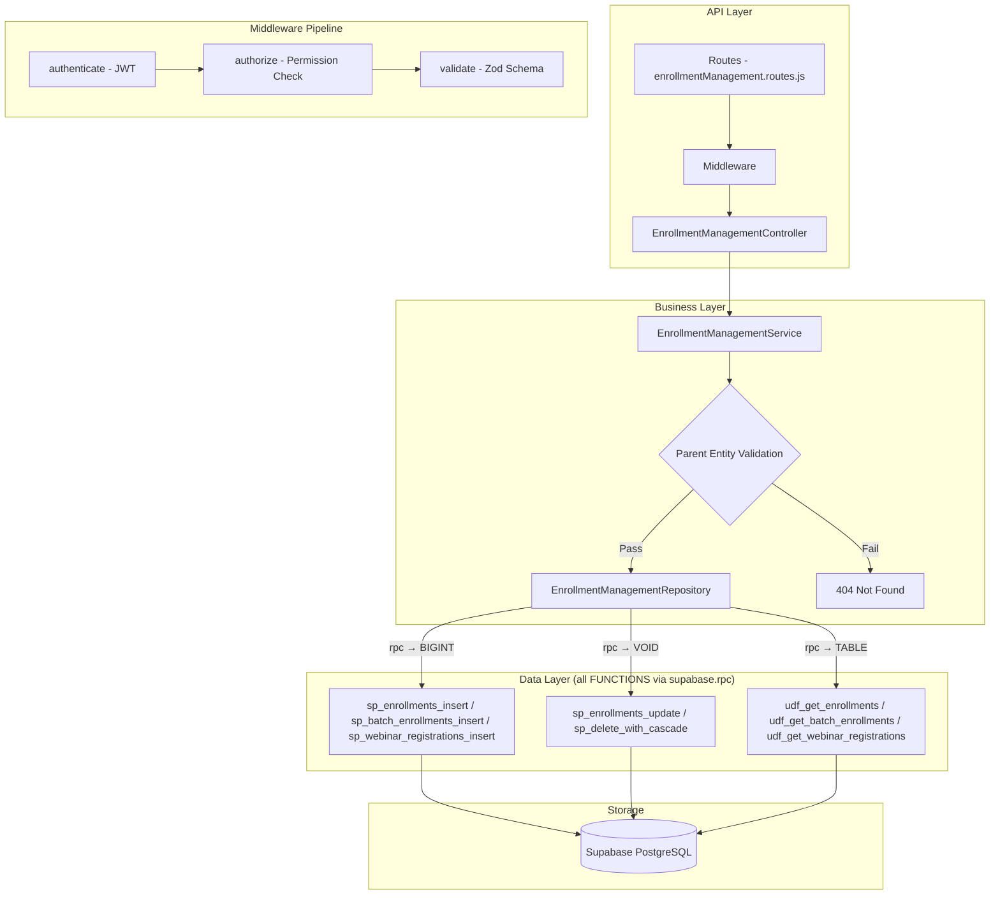

# GrowUpMore API — Enrollment Management Module

## Postman Testing Guide

**Base URL:** `http://localhost:5001`
**API Prefix:** `/api/v1/enrollment-management`
**Content-Type:** `application/json`
**Authentication:** All endpoints require `Bearer <access_token>` in Authorization header

---

## Architecture Flow



---

## Prerequisites

Before testing, ensure:

1. **Authentication**: Login via `POST /api/v1/auth/login` to obtain `access_token`
2. **Permissions**: Run `phase21_enrollment_management_permissions_seed.sql` in Supabase SQL Editor
3. **Master Data**: Students, Courses, Batches, Bundles, and Orders exist (from earlier phases)
4. **Parent Records**: Parent entities (students, courses, batches, bundles) must exist before creating enrollments

---

## Complete Endpoint Reference

### Test Order (follow this sequence in Postman)

| # | Endpoint | Permission | Purpose |
|---|----------|-----------|---------|
| 1 | `GET /enrollments` | `enrollment.read` | List all enrollments with filters |
| 2 | `POST /enrollments` | `enrollment.create` | Create a course enrollment |
| 3 | `PATCH /enrollments/:id` | `enrollment.update` | Update enrollment details |
| 4 | `DELETE /enrollments/:id` | `enrollment.delete` | Soft delete enrollment |
| 5 | `POST /enrollments/:id/restore` | `enrollment.delete` | Restore soft-deleted enrollment |
| 6 | `POST /enrollments/bulk-delete` | `enrollment.delete` | Bulk delete enrollments |
| 7 | `POST /enrollments/bulk-restore` | `enrollment.delete` | Bulk restore enrollments |
| 8 | `GET /batch-enrollments` | `batch_enrollment.read` | List all batch enrollments |
| 9 | `POST /batch-enrollments` | `batch_enrollment.create` | Create batch enrollment |
| 10 | `PATCH /batch-enrollments/:id` | `batch_enrollment.update` | Update batch enrollment |
| 11 | `DELETE /batch-enrollments/:id` | `batch_enrollment.delete` | Soft delete batch enrollment |
| 12 | `POST /batch-enrollments/:id/restore` | `batch_enrollment.delete` | Restore batch enrollment |
| 13 | `POST /batch-enrollments/bulk-delete` | `batch_enrollment.delete` | Bulk delete batch enrollments |
| 14 | `POST /batch-enrollments/bulk-restore` | `batch_enrollment.delete` | Bulk restore batch enrollments |
| 15 | `GET /webinar-registrations` | `webinar_registration.read` | List all webinar registrations |
| 16 | `POST /webinar-registrations` | `webinar_registration.create` | Create webinar registration |
| 17 | `PATCH /webinar-registrations/:id` | `webinar_registration.update` | Update webinar registration |
| 18 | `DELETE /webinar-registrations/:id` | `webinar_registration.delete` | Soft delete webinar registration |
| 19 | `POST /webinar-registrations/:id/restore` | `webinar_registration.delete` | Restore webinar registration |
| 20 | `POST /webinar-registrations/bulk-delete` | `webinar_registration.delete` | Bulk delete webinar registrations |
| 21 | `POST /webinar-registrations/bulk-restore` | `webinar_registration.delete` | Bulk restore webinar registrations |

---

## Common Headers (All Requests)

| Key | Value |
|-----|-------|
| Authorization | Bearer `<access_token>` |
| Content-Type | `application/json` |

---

## 1. ENROLLMENTS

### 1.1 List Enrollments

**`GET /api/v1/enrollment-management/enrollments`**

**Permission:** `enrollment.read`

**Headers:**
```
Authorization: Bearer {{access_token}}
Content-Type: application/json
```

**Query Parameters:**

| Parameter | Type | Description |
|-----------|------|-------------|
| page | integer | Page number (default: 1) |
| limit | integer | Results per page (default: 20, max: 100) |
| studentId | integer | Filter by student ID |
| courseId | integer | Filter by course ID |
| status | string | Filter by enrollment status |
| sourceType | string | Filter by source type: `direct`, `referral`, `batch`, `bundle`, `promotion` |
| bundleId | integer | Filter by bundle ID |
| batchId | integer | Filter by batch ID |
| orderId | integer | Filter by order ID |
| isActive | boolean | Filter by active status |
| isDeleted | boolean | Include deleted records (default: false) |
| searchTerm | string | Search in student/course names |
| sortBy | string | Sort field (default: `enrolled_at`) |
| sortDir | string | Sort direction: `ASC` or `DESC` (default: DESC) |

**Example:**
```
GET /api/v1/enrollment-management/enrollments?page=1&limit=10&status=active&sortBy=enrolled_at&sortDir=DESC
```

**Expected Response (200):**
```json
{
  "success": true,
  "message": "Enrollments retrieved successfully",
  "data": [
    {
      "id": 1,
      "studentId": 101,
      "courseId": 501,
      "sourceType": "direct",
      "bundleId": null,
      "batchId": null,
      "orderId": 2001,
      "orderItemId": null,
      "enrollmentStatus": "active",
      "enrolledAt": "2026-04-01T10:30:00Z",
      "expiresAt": "2027-04-01T23:59:59Z",
      "accessStartsAt": "2026-04-01T00:00:00Z",
      "accessEndsAt": "2027-04-01T23:59:59Z",
      "isActive": true,
      "createdAt": "2026-04-01T10:30:00Z",
      "updatedAt": "2026-04-01T10:30:00Z"
    },
    {
      "id": 2,
      "studentId": 102,
      "courseId": 502,
      "sourceType": "batch",
      "bundleId": null,
      "batchId": 301,
      "orderId": 2002,
      "orderItemId": 5001,
      "enrollmentStatus": "active",
      "enrolledAt": "2026-03-15T14:20:00Z",
      "expiresAt": "2026-08-15T23:59:59Z",
      "accessStartsAt": "2026-03-15T00:00:00Z",
      "accessEndsAt": "2026-08-15T23:59:59Z",
      "isActive": true,
      "createdAt": "2026-03-15T14:20:00Z",
      "updatedAt": "2026-03-15T14:20:00Z"
    }
  ],
  "pagination": {
    "page": 1,
    "limit": 10,
    "total": 150,
    "pages": 15
  }
}
```

**Postman Tests:**
```javascript
pm.test("Status is 200", () => pm.response.to.have.status(200));
const json = pm.response.json();
pm.test("Response has data array", () => pm.expect(json.data).to.be.an("array"));
pm.test("Pagination info exists", () => pm.expect(json.pagination).to.exist);
if (json.data.length > 0) {
  pm.collectionVariables.set("enrollmentId", json.data[0].id);
}
```

---

### 1.2 Create Enrollment

**`POST /api/v1/enrollment-management/enrollments`**

**Permission:** `enrollment.create`

**Headers:**
```
Authorization: Bearer {{access_token}}
Content-Type: application/json
```

**Request Body:**

| Field | Type | Required | Description |
|-------|------|----------|-------------|
| studentId | integer | Yes | ID of the student |
| courseId | integer | Yes | ID of the course |
| sourceType | string | No | Enrollment source: `direct`, `referral`, `batch`, `bundle`, `promotion` (default: `direct`) |
| bundleId | integer | No | Bundle ID if enrolled via bundle |
| batchId | integer | No | Batch ID if enrolled via batch |
| orderId | integer | No | Order ID associated with enrollment |
| orderItemId | integer | No | Order item ID |
| enrollmentStatus | string | No | Status: `active`, `paused`, `completed`, `expired` (default: `active`) |
| enrolledAt | timestamp | No | Enrollment timestamp (ISO 8601) |
| expiresAt | timestamp | No | Expiration timestamp (ISO 8601) |
| accessStartsAt | timestamp | No | Access start timestamp (ISO 8601) |
| accessEndsAt | timestamp | No | Access end timestamp (ISO 8601) |

**Example Request:**
```json
{
  "studentId": 101,
  "courseId": 501,
  "sourceType": "direct",
  "bundleId": null,
  "batchId": null,
  "orderId": 2001,
  "orderItemId": null,
  "enrollmentStatus": "active",
  "enrolledAt": "2026-04-01T10:30:00Z",
  "expiresAt": "2027-04-01T23:59:59Z",
  "accessStartsAt": "2026-04-01T00:00:00Z",
  "accessEndsAt": "2027-04-01T23:59:59Z"
}
```

**Expected Response (201):**
```json
{
  "success": true,
  "message": "Enrollment created successfully",
  "data": {
    "id": 1,
    "studentId": 101,
    "courseId": 501,
    "sourceType": "direct",
    "bundleId": null,
    "batchId": null,
    "orderId": 2001,
    "orderItemId": null,
    "enrollmentStatus": "active",
    "enrolledAt": "2026-04-01T10:30:00Z",
    "expiresAt": "2027-04-01T23:59:59Z",
    "accessStartsAt": "2026-04-01T00:00:00Z",
    "accessEndsAt": "2027-04-01T23:59:59Z",
    "isActive": true,
    "createdAt": "2026-04-01T10:30:00Z",
    "updatedAt": "2026-04-01T10:30:00Z"
  }
}
```

**Postman Tests:**
```javascript
pm.test("Status is 201", () => pm.response.to.have.status(201));
const json = pm.response.json();
pm.test("Has enrollment ID", () => pm.expect(json.data.id).to.be.a("number"));
pm.test("Enrollment status is active", () => pm.expect(json.data.enrollmentStatus).to.equal("active"));
pm.collectionVariables.set("enrollmentId", json.data.id);
```

---

### 1.3 Update Enrollment

**`PATCH /api/v1/enrollment-management/enrollments/:id`**

**Permission:** `enrollment.update`

**Headers:**
```
Authorization: Bearer {{access_token}}
Content-Type: application/json
```

**Example:** `PATCH /api/v1/enrollment-management/enrollments/{{enrollmentId}}`

**Request Body:**

| Field | Type | Required | Description |
|-------|------|----------|-------------|
| enrollmentStatus | string | No | New enrollment status |
| expiresAt | timestamp | No | New expiration timestamp |
| accessStartsAt | timestamp | No | New access start timestamp |
| accessEndsAt | timestamp | No | New access end timestamp |

**Example Request:**
```json
{
  "enrollmentStatus": "paused",
  "expiresAt": "2027-06-01T23:59:59Z",
  "accessStartsAt": "2026-04-15T00:00:00Z",
  "accessEndsAt": "2027-06-01T23:59:59Z"
}
```

**Expected Response (200):**
```json
{
  "success": true,
  "message": "Enrollment updated successfully",
  "data": {
    "id": 1,
    "studentId": 101,
    "courseId": 501,
    "sourceType": "direct",
    "bundleId": null,
    "batchId": null,
    "orderId": 2001,
    "orderItemId": null,
    "enrollmentStatus": "paused",
    "enrolledAt": "2026-04-01T10:30:00Z",
    "expiresAt": "2027-06-01T23:59:59Z",
    "accessStartsAt": "2026-04-15T00:00:00Z",
    "accessEndsAt": "2027-06-01T23:59:59Z",
    "isActive": true,
    "createdAt": "2026-04-01T10:30:00Z",
    "updatedAt": "2026-04-05T15:45:00Z"
  }
}
```

**Postman Tests:**
```javascript
pm.test("Status is 200", () => pm.response.to.have.status(200));
const json = pm.response.json();
pm.test("Enrollment status updated to paused", () => pm.expect(json.data.enrollmentStatus).to.equal("paused"));
pm.test("UpdatedAt timestamp changed", () => pm.expect(json.data.updatedAt).to.exist);
```

---

### 1.4 Delete Enrollment

**`DELETE /api/v1/enrollment-management/enrollments/:id`**

**Permission:** `enrollment.delete`

**Headers:**
```
Authorization: Bearer {{access_token}}
```

**Example:** `DELETE /api/v1/enrollment-management/enrollments/{{enrollmentId}}`

**Expected Response (200):**
```json
{
  "success": true,
  "message": "Enrollment deleted successfully",
  "data": {
    "id": 1,
    "deletedAt": "2026-04-05T12:00:00Z"
  }
}
```

**Postman Tests:**
```javascript
pm.test("Status is 200", () => pm.response.to.have.status(200));
const json = pm.response.json();
pm.test("Has deleted ID", () => pm.expect(json.data.id).to.be.a("number"));
pm.test("Has deletedAt timestamp", () => pm.expect(json.data.deletedAt).to.exist);
```

---

### 1.5 Restore Enrollment

**`POST /api/v1/enrollment-management/enrollments/:id/restore`**

**Permission:** `enrollment.delete`

**Headers:**
```
Authorization: Bearer {{access_token}}
Content-Type: application/json
```

**Example:** `POST /api/v1/enrollment-management/enrollments/{{enrollmentId}}/restore`

**Request Body:**
```json
{}
```

**Expected Response (200):**
```json
{
  "success": true,
  "message": "Enrollment restored successfully",
  "data": {
    "id": 1,
    "studentId": 101,
    "courseId": 501,
    "sourceType": "direct",
    "bundleId": null,
    "batchId": null,
    "orderId": 2001,
    "orderItemId": null,
    "enrollmentStatus": "paused",
    "enrolledAt": "2026-04-01T10:30:00Z",
    "expiresAt": "2027-06-01T23:59:59Z",
    "accessStartsAt": "2026-04-15T00:00:00Z",
    "accessEndsAt": "2027-06-01T23:59:59Z",
    "isActive": true,
    "createdAt": "2026-04-01T10:30:00Z",
    "updatedAt": "2026-04-05T15:45:00Z",
    "restoredAt": "2026-04-06T09:00:00Z"
  }
}
```

**Postman Tests:**
```javascript
pm.test("Status is 200", () => pm.response.to.have.status(200));
const json = pm.response.json();
pm.test("Enrollment restored with restoredAt timestamp", () => pm.expect(json.data.restoredAt).to.exist);
```

---

### 1.6 Bulk Delete Enrollments

**`POST /api/v1/enrollment-management/enrollments/bulk-delete`**

**Permission:** `enrollment.delete`

**Headers:**
```
Authorization: Bearer {{access_token}}
Content-Type: application/json
```

**Request Body:**

| Field | Type | Required | Description |
|-------|------|----------|-------------|
| ids | array | Yes | Array of enrollment IDs to delete |

**Example Request:**
```json
{
  "ids": [1, 2, 5, 7]
}
```

**Expected Response (200):**
```json
{
  "success": true,
  "message": "Enrollments deleted successfully",
  "data": {
    "deletedCount": 4,
    "deletedIds": [1, 2, 5, 7],
    "deletedAt": "2026-04-06T12:00:00Z"
  }
}
```

**Postman Tests:**
```javascript
pm.test("Status is 200", () => pm.response.to.have.status(200));
const json = pm.response.json();
pm.test("Deleted count matches request", () => pm.expect(json.data.deletedCount).to.equal(4));
pm.test("Deleted IDs array exists", () => pm.expect(json.data.deletedIds).to.be.an("array"));
```

---

### 1.7 Bulk Restore Enrollments

**`POST /api/v1/enrollment-management/enrollments/bulk-restore`**

**Permission:** `enrollment.delete`

**Headers:**
```
Authorization: Bearer {{access_token}}
Content-Type: application/json
```

**Request Body:**

| Field | Type | Required | Description |
|-------|------|----------|-------------|
| ids | array | Yes | Array of enrollment IDs to restore |

**Example Request:**
```json
{
  "ids": [1, 2, 5, 7]
}
```

**Expected Response (200):**
```json
{
  "success": true,
  "message": "Enrollments restored successfully",
  "data": {
    "restoredCount": 4,
    "restoredIds": [1, 2, 5, 7],
    "restoredAt": "2026-04-06T12:15:00Z"
  }
}
```

**Postman Tests:**
```javascript
pm.test("Status is 200", () => pm.response.to.have.status(200));
const json = pm.response.json();
pm.test("Restored count matches request", () => pm.expect(json.data.restoredCount).to.equal(4));
pm.test("Restored IDs array exists", () => pm.expect(json.data.restoredIds).to.be.an("array"));
```

---

## 2. BATCH ENROLLMENTS

### 2.1 List Batch Enrollments

**`GET /api/v1/enrollment-management/batch-enrollments`**

**Permission:** `batch_enrollment.read`

**Headers:**
```
Authorization: Bearer {{access_token}}
Content-Type: application/json
```

**Query Parameters:**

| Parameter | Type | Description |
|-----------|------|-------------|
| page | integer | Page number (default: 1) |
| limit | integer | Results per page (default: 20, max: 100) |
| studentId | integer | Filter by student ID |
| batchId | integer | Filter by batch ID |
| status | string | Filter by enrollment status |
| orderId | integer | Filter by order ID |
| isActive | boolean | Filter by active status |
| isDeleted | boolean | Include deleted records (default: false) |
| searchTerm | string | Search in names |
| sortBy | string | Sort field (default: `enrolled_at`) |
| sortDir | string | Sort direction: `ASC` or `DESC` (default: DESC) |

**Example:**
```
GET /api/v1/enrollment-management/batch-enrollments?page=1&limit=10&batchId=301
```

**Expected Response (200):**
```json
{
  "success": true,
  "message": "Batch enrollments retrieved successfully",
  "data": [
    {
      "id": 1,
      "batchId": 301,
      "studentId": 101,
      "orderId": 2001,
      "enrollmentStatus": "active",
      "enrolledAt": "2026-03-15T10:00:00Z",
      "completedAt": null,
      "isActive": true,
      "createdAt": "2026-03-15T10:00:00Z",
      "updatedAt": "2026-03-15T10:00:00Z"
    }
  ],
  "pagination": {
    "page": 1,
    "limit": 10,
    "total": 50,
    "pages": 5
  }
}
```

**Postman Tests:**
```javascript
pm.test("Status is 200", () => pm.response.to.have.status(200));
const json = pm.response.json();
pm.test("Response has data array", () => pm.expect(json.data).to.be.an("array"));
if (json.data.length > 0) {
  pm.collectionVariables.set("batchEnrollmentId", json.data[0].id);
}
```

---

### 2.2 Create Batch Enrollment

**`POST /api/v1/enrollment-management/batch-enrollments`**

**Permission:** `batch_enrollment.create`

**Headers:**
```
Authorization: Bearer {{access_token}}
Content-Type: application/json
```

**Request Body:**

| Field | Type | Required | Description |
|-------|------|----------|-------------|
| batchId | integer | Yes | ID of the batch |
| studentId | integer | Yes | ID of the student |
| orderId | integer | No | Order ID |
| enrollmentStatus | string | No | Status: `active`, `paused`, `completed` (default: `active`) |
| enrolledAt | timestamp | No | Enrollment timestamp (ISO 8601) |
| completedAt | timestamp | No | Completion timestamp (ISO 8601) |

**Example Request:**
```json
{
  "batchId": 301,
  "studentId": 101,
  "orderId": 2001,
  "enrollmentStatus": "active",
  "enrolledAt": "2026-03-15T10:00:00Z",
  "completedAt": null
}
```

**Expected Response (201):**
```json
{
  "success": true,
  "message": "Batch enrollment created successfully",
  "data": {
    "id": 1,
    "batchId": 301,
    "studentId": 101,
    "orderId": 2001,
    "enrollmentStatus": "active",
    "enrolledAt": "2026-03-15T10:00:00Z",
    "completedAt": null,
    "isActive": true,
    "createdAt": "2026-03-15T10:00:00Z",
    "updatedAt": "2026-03-15T10:00:00Z"
  }
}
```

**Postman Tests:**
```javascript
pm.test("Status is 201", () => pm.response.to.have.status(201));
const json = pm.response.json();
pm.test("Has batch enrollment ID", () => pm.expect(json.data.id).to.be.a("number"));
pm.collectionVariables.set("batchEnrollmentId", json.data.id);
```

---

### 2.3 Update Batch Enrollment

**`PATCH /api/v1/enrollment-management/batch-enrollments/:id`**

**Permission:** `batch_enrollment.update`

**Headers:**
```
Authorization: Bearer {{access_token}}
Content-Type: application/json
```

**Example:** `PATCH /api/v1/enrollment-management/batch-enrollments/{{batchEnrollmentId}}`

**Request Body:**

| Field | Type | Required | Description |
|-------|------|----------|-------------|
| enrollmentStatus | string | No | New enrollment status |
| completedAt | timestamp | No | Completion timestamp |

**Example Request:**
```json
{
  "enrollmentStatus": "completed",
  "completedAt": "2026-06-15T18:00:00Z"
}
```

**Expected Response (200):**
```json
{
  "success": true,
  "message": "Batch enrollment updated successfully",
  "data": {
    "id": 1,
    "batchId": 301,
    "studentId": 101,
    "orderId": 2001,
    "enrollmentStatus": "completed",
    "enrolledAt": "2026-03-15T10:00:00Z",
    "completedAt": "2026-06-15T18:00:00Z",
    "isActive": true,
    "createdAt": "2026-03-15T10:00:00Z",
    "updatedAt": "2026-06-15T18:00:00Z"
  }
}
```

**Postman Tests:**
```javascript
pm.test("Status is 200", () => pm.response.to.have.status(200));
const json = pm.response.json();
pm.test("Status updated to completed", () => pm.expect(json.data.enrollmentStatus).to.equal("completed"));
```

---

### 2.4 Delete Batch Enrollment

**`DELETE /api/v1/enrollment-management/batch-enrollments/:id`**

**Permission:** `batch_enrollment.delete`

**Headers:**
```
Authorization: Bearer {{access_token}}
```

**Example:** `DELETE /api/v1/enrollment-management/batch-enrollments/{{batchEnrollmentId}}`

**Expected Response (200):**
```json
{
  "success": true,
  "message": "Batch enrollment deleted successfully",
  "data": {
    "id": 1,
    "deletedAt": "2026-04-06T14:00:00Z"
  }
}
```

**Postman Tests:**
```javascript
pm.test("Status is 200", () => pm.response.to.have.status(200));
const json = pm.response.json();
pm.test("Has deletedAt timestamp", () => pm.expect(json.data.deletedAt).to.exist);
```

---

### 2.5 Restore Batch Enrollment

**`POST /api/v1/enrollment-management/batch-enrollments/:id/restore`**

**Permission:** `batch_enrollment.delete`

**Headers:**
```
Authorization: Bearer {{access_token}}
Content-Type: application/json
```

**Example:** `POST /api/v1/enrollment-management/batch-enrollments/{{batchEnrollmentId}}/restore`

**Request Body:**
```json
{}
```

**Expected Response (200):**
```json
{
  "success": true,
  "message": "Batch enrollment restored successfully",
  "data": {
    "id": 1,
    "batchId": 301,
    "studentId": 101,
    "orderId": 2001,
    "enrollmentStatus": "completed",
    "enrolledAt": "2026-03-15T10:00:00Z",
    "completedAt": "2026-06-15T18:00:00Z",
    "isActive": true,
    "createdAt": "2026-03-15T10:00:00Z",
    "updatedAt": "2026-06-15T18:00:00Z",
    "restoredAt": "2026-04-06T14:30:00Z"
  }
}
```

**Postman Tests:**
```javascript
pm.test("Status is 200", () => pm.response.to.have.status(200));
const json = pm.response.json();
pm.test("Has restoredAt timestamp", () => pm.expect(json.data.restoredAt).to.exist);
```

---

### 2.6 Bulk Delete Batch Enrollments

**`POST /api/v1/enrollment-management/batch-enrollments/bulk-delete`**

**Permission:** `batch_enrollment.delete`

**Headers:**
```
Authorization: Bearer {{access_token}}
Content-Type: application/json
```

**Request Body:**

| Field | Type | Required | Description |
|-------|------|----------|-------------|
| ids | array | Yes | Array of batch enrollment IDs to delete |

**Example Request:**
```json
{
  "ids": [1, 2, 3]
}
```

**Expected Response (200):**
```json
{
  "success": true,
  "message": "Batch enrollments deleted successfully",
  "data": {
    "deletedCount": 3,
    "deletedIds": [1, 2, 3],
    "deletedAt": "2026-04-06T14:45:00Z"
  }
}
```

**Postman Tests:**
```javascript
pm.test("Status is 200", () => pm.response.to.have.status(200));
const json = pm.response.json();
pm.test("Deleted count is correct", () => pm.expect(json.data.deletedCount).to.equal(3));
```

---

### 2.7 Bulk Restore Batch Enrollments

**`POST /api/v1/enrollment-management/batch-enrollments/bulk-restore`**

**Permission:** `batch_enrollment.delete`

**Headers:**
```
Authorization: Bearer {{access_token}}
Content-Type: application/json
```

**Request Body:**

| Field | Type | Required | Description |
|-------|------|----------|-------------|
| ids | array | Yes | Array of batch enrollment IDs to restore |

**Example Request:**
```json
{
  "ids": [1, 2, 3]
}
```

**Expected Response (200):**
```json
{
  "success": true,
  "message": "Batch enrollments restored successfully",
  "data": {
    "restoredCount": 3,
    "restoredIds": [1, 2, 3],
    "restoredAt": "2026-04-06T15:00:00Z"
  }
}
```

**Postman Tests:**
```javascript
pm.test("Status is 200", () => pm.response.to.have.status(200));
const json = pm.response.json();
pm.test("Restored count is correct", () => pm.expect(json.data.restoredCount).to.equal(3));
```

---

## 3. WEBINAR REGISTRATIONS

### 3.1 List Webinar Registrations

**`GET /api/v1/enrollment-management/webinar-registrations`**

**Permission:** `webinar_registration.read`

**Headers:**
```
Authorization: Bearer {{access_token}}
Content-Type: application/json
```

**Query Parameters:**

| Parameter | Type | Description |
|-----------|------|-------------|
| page | integer | Page number (default: 1) |
| limit | integer | Results per page (default: 20) |
| studentId | integer | Filter by student ID |
| webinarId | integer | Filter by webinar ID |
| registrationStatus | string | Filter by status |
| isActive | boolean | Filter by active status |
| isDeleted | boolean | Include deleted records |
| sortBy | string | Sort field (default: `registered_at`) |
| sortDir | string | Sort direction: `ASC` or `DESC` |

**Example:**
```
GET /api/v1/enrollment-management/webinar-registrations?page=1&limit=20&webinarId=101
```

**Expected Response (200):**
```json
{
  "success": true,
  "message": "Webinar registrations retrieved successfully",
  "data": [
    {
      "id": 1,
      "webinarId": 101,
      "studentId": 101,
      "registrationStatus": "registered",
      "registeredAt": "2026-04-01T09:00:00Z",
      "attendedAt": null,
      "isActive": true,
      "createdAt": "2026-04-01T09:00:00Z",
      "updatedAt": "2026-04-01T09:00:00Z"
    }
  ],
  "pagination": {
    "page": 1,
    "limit": 20,
    "total": 15,
    "pages": 1
  }
}
```

**Postman Tests:**
```javascript
pm.test("Status is 200", () => pm.response.to.have.status(200));
const json = pm.response.json();
pm.test("Response has data array", () => pm.expect(json.data).to.be.an("array"));
if (json.data.length > 0) {
  pm.collectionVariables.set("webinarRegistrationId", json.data[0].id);
}
```

---

### 3.2 Create Webinar Registration

**`POST /api/v1/enrollment-management/webinar-registrations`**

**Permission:** `webinar_registration.create`

**Headers:**
```
Authorization: Bearer {{access_token}}
Content-Type: application/json
```

**Request Body:**

| Field | Type | Required | Description |
|-------|------|----------|-------------|
| webinarId | integer | Yes | ID of the webinar |
| studentId | integer | Yes | ID of the student |
| registrationStatus | string | No | Status: `registered`, `attended`, `no-show` (default: `registered`) |
| registeredAt | timestamp | No | Registration timestamp (ISO 8601) |
| attendedAt | timestamp | No | Attendance timestamp (ISO 8601) |

**Example Request:**
```json
{
  "webinarId": 101,
  "studentId": 101,
  "registrationStatus": "registered",
  "registeredAt": "2026-04-01T09:00:00Z",
  "attendedAt": null
}
```

**Expected Response (201):**
```json
{
  "success": true,
  "message": "Webinar registration created successfully",
  "data": {
    "id": 1,
    "webinarId": 101,
    "studentId": 101,
    "registrationStatus": "registered",
    "registeredAt": "2026-04-01T09:00:00Z",
    "attendedAt": null,
    "isActive": true,
    "createdAt": "2026-04-01T09:00:00Z",
    "updatedAt": "2026-04-01T09:00:00Z"
  }
}
```

**Postman Tests:**
```javascript
pm.test("Status is 201", () => pm.response.to.have.status(201));
const json = pm.response.json();
pm.test("Has webinar registration ID", () => pm.expect(json.data.id).to.be.a("number"));
pm.collectionVariables.set("webinarRegistrationId", json.data.id);
```

---

### 3.3 Update Webinar Registration

**`PATCH /api/v1/enrollment-management/webinar-registrations/:id`**

**Permission:** `webinar_registration.update`

**Headers:**
```
Authorization: Bearer {{access_token}}
Content-Type: application/json
```

**Example:** `PATCH /api/v1/enrollment-management/webinar-registrations/{{webinarRegistrationId}}`

**Request Body:**

| Field | Type | Required | Description |
|-------|------|----------|-------------|
| registrationStatus | string | No | New registration status |
| attendedAt | timestamp | No | Attendance timestamp |

**Example Request:**
```json
{
  "registrationStatus": "attended",
  "attendedAt": "2026-04-05T11:00:00Z"
}
```

**Expected Response (200):**
```json
{
  "success": true,
  "message": "Webinar registration updated successfully",
  "data": {
    "id": 1,
    "webinarId": 101,
    "studentId": 101,
    "registrationStatus": "attended",
    "registeredAt": "2026-04-01T09:00:00Z",
    "attendedAt": "2026-04-05T11:00:00Z",
    "isActive": true,
    "createdAt": "2026-04-01T09:00:00Z",
    "updatedAt": "2026-04-05T11:00:00Z"
  }
}
```

**Postman Tests:**
```javascript
pm.test("Status is 200", () => pm.response.to.have.status(200));
const json = pm.response.json();
pm.test("Registration status updated to attended", () => pm.expect(json.data.registrationStatus).to.equal("attended"));
```

---

### 3.4 Delete Webinar Registration

**`DELETE /api/v1/enrollment-management/webinar-registrations/:id`**

**Permission:** `webinar_registration.delete`

**Headers:**
```
Authorization: Bearer {{access_token}}
```

**Example:** `DELETE /api/v1/enrollment-management/webinar-registrations/{{webinarRegistrationId}}`

**Expected Response (200):**
```json
{
  "success": true,
  "message": "Webinar registration deleted successfully",
  "data": {
    "id": 1,
    "deletedAt": "2026-04-06T16:00:00Z"
  }
}
```

**Postman Tests:**
```javascript
pm.test("Status is 200", () => pm.response.to.have.status(200));
const json = pm.response.json();
pm.test("Has deletedAt timestamp", () => pm.expect(json.data.deletedAt).to.exist);
```

---

### 3.5 Restore Webinar Registration

**`POST /api/v1/enrollment-management/webinar-registrations/:id/restore`**

**Permission:** `webinar_registration.update`

**Headers:**
```
Authorization: Bearer {{access_token}}
Content-Type: application/json
```

**Example:** `POST /api/v1/enrollment-management/webinar-registrations/{{webinarRegistrationId}}/restore`

**Request Body:**
```json
{}
```

**Expected Response (200):**
```json
{
  "success": true,
  "message": "Webinar registration restored successfully",
  "data": {
    "id": 1,
    "webinarId": 101,
    "studentId": 101,
    "registrationStatus": "attended",
    "registeredAt": "2026-04-01T09:00:00Z",
    "attendedAt": "2026-04-05T11:00:00Z",
    "isActive": true,
    "createdAt": "2026-04-01T09:00:00Z",
    "updatedAt": "2026-04-05T11:00:00Z",
    "restoredAt": "2026-04-06T16:30:00Z"
  }
}
```

**Postman Tests:**
```javascript
pm.test("Status is 200", () => pm.response.to.have.status(200));
const json = pm.response.json();
pm.test("Has restoredAt timestamp", () => pm.expect(json.data.restoredAt).to.exist);
```

---

### 3.6 Bulk Delete Webinar Registrations

**`POST /api/v1/enrollment-management/webinar-registrations/bulk-delete`**

**Permission:** `webinar_registration.delete`

**Headers:**
```
Authorization: Bearer {{access_token}}
Content-Type: application/json
```

**Request Body:**

| Field | Type | Required | Description |
|-------|------|----------|-------------|
| ids | array | Yes | Array of webinar registration IDs to delete |

**Example Request:**
```json
{
  "ids": [1, 2, 3, 4]
}
```

**Expected Response (200):**
```json
{
  "success": true,
  "message": "Webinar registrations deleted successfully",
  "data": {
    "deletedCount": 4,
    "deletedIds": [1, 2, 3, 4],
    "deletedAt": "2026-04-06T17:00:00Z"
  }
}
```

**Postman Tests:**
```javascript
pm.test("Status is 200", () => pm.response.to.have.status(200));
const json = pm.response.json();
pm.test("Deleted count is correct", () => pm.expect(json.data.deletedCount).to.equal(4));
```

---

### 3.7 Bulk Restore Webinar Registrations

**`POST /api/v1/enrollment-management/webinar-registrations/bulk-restore`**

**Permission:** `webinar_registration.update`

**Headers:**
```
Authorization: Bearer {{access_token}}
Content-Type: application/json
```

**Request Body:**

| Field | Type | Required | Description |
|-------|------|----------|-------------|
| ids | array | Yes | Array of webinar registration IDs to restore |

**Example Request:**
```json
{
  "ids": [1, 2, 3, 4]
}
```

**Expected Response (200):**
```json
{
  "success": true,
  "message": "Webinar registrations restored successfully",
  "data": {
    "restoredCount": 4,
    "restoredIds": [1, 2, 3, 4],
    "restoredAt": "2026-04-06T17:30:00Z"
  }
}
```

**Postman Tests:**
```javascript
pm.test("Status is 200", () => pm.response.to.have.status(200));
const json = pm.response.json();
pm.test("Restored count is correct", () => pm.expect(json.data.restoredCount).to.equal(4));
```

---

## Error Responses

### 400 Bad Request
```json
{
  "success": false,
  "message": "Validation error",
  "errors": [
    {
      "field": "studentId",
      "message": "Student ID must be a positive integer"
    }
  ]
}
```

### 401 Unauthorized
```json
{
  "success": false,
  "message": "Unauthorized. Invalid or missing access token."
}
```

### 403 Forbidden
```json
{
  "success": false,
  "message": "You do not have permission to perform this action."
}
```

### 404 Not Found
```json
{
  "success": false,
  "message": "Enrollment not found."
}
```

### 409 Conflict
```json
{
  "success": false,
  "message": "Student is already enrolled in this course."
}
```

### 500 Internal Server Error
```json
{
  "success": false,
  "message": "An unexpected error occurred. Please try again later."
}
```
