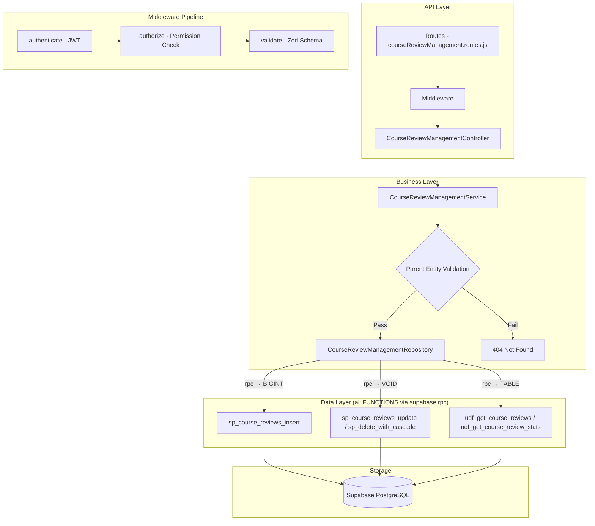

# GrowUpMore API — Course Review Management Module

## Postman Testing Guide

**Base URL:** `http://localhost:5001`
**API Prefix:** `/api/v1/course-review-management`
**Content-Type:** `application/json`
**Authentication:** All endpoints require `Bearer <access_token>` in Authorization header

---

## Architecture Flow



---

## Prerequisites

Before testing, ensure:

1. **Authentication**: Login via `POST /api/v1/auth/login` to obtain `access_token`
2. **Permissions**: Run `phase22_course_review_management_permissions_seed.sql` in Supabase SQL Editor
3. **Master Data**: Students, Courses, and Enrollments exist (from earlier phases)
4. **Parent Records**: Students must be enrolled in courses before leaving reviews

---

## Complete Endpoint Reference

### Test Order (follow this sequence in Postman)

| # | Endpoint | Permission | Purpose |
|---|----------|-----------|---------|
| 1 | `GET /course-reviews` | `course_review.read` | List all course reviews with filters |
| 2 | `POST /course-reviews` | `course_review.create` | Create a new course review |
| 3 | `GET /course-reviews/:id` | `course_review.read` | Get review by ID |
| 4 | `PATCH /course-reviews/:id` | `course_review.update` | Update review details |
| 5 | `DELETE /course-reviews/:id` | `course_review.delete` | Soft delete review |
| 6 | `POST /course-reviews/:id/restore` | `course_review.update` | Restore soft-deleted review |
| 7 | `POST /course-reviews/bulk-delete` | `course_review.delete` | Bulk delete reviews |
| 8 | `POST /course-reviews/bulk-restore` | `course_review.update` | Bulk restore reviews |

---

## Common Headers (All Requests)

| Key | Value |
|-----|-------|
| Authorization | Bearer `<access_token>` |
| Content-Type | `application/json` |

---

## 1. COURSE REVIEWS

### 1.1 List Course Reviews

**`GET /api/v1/course-review-management/course-reviews`**

**Permission:** `course_review.read`

**Headers:**
```
Authorization: Bearer {{access_token}}
Content-Type: application/json
```

**Query Parameters:**

| Parameter | Type | Description |
|-----------|------|-------------|
| page | integer | Page number (default: 1) |
| limit | integer | Results per page (default: 20, max: 100) |
| studentId | integer | Filter by student ID |
| courseId | integer | Filter by course ID |
| enrollmentId | integer | Filter by enrollment ID |
| rating | integer | Filter by exact rating (1-5) |
| minRating | integer | Filter by minimum rating (1-5) |
| maxRating | integer | Filter by maximum rating (1-5) |
| reviewStatus | string | Filter by status: `pending`, `approved`, `rejected`, `flagged` |
| isVerifiedPurchase | boolean | Filter by verified purchase status |
| isActive | boolean | Filter by active status |
| searchTerm | string | Search in title and review text |
| sortBy | string | Sort field (default: `reviewed_at`) |
| sortDir | string | Sort direction: `ASC` or `DESC` (default: ASC) |

**Example:**
```
GET /api/v1/course-review-management/course-reviews?page=1&limit=10&courseId=501&reviewStatus=approved&sortBy=rating&sortDir=DESC
```

**Expected Response (200):**
```json
{
  "success": true,
  "message": "Course reviews retrieved successfully",
  "data": [
    {
      "id": 1,
      "studentId": 1001,
      "courseId": 5001,
      "enrollmentId": 8001,
      "rating": 5,
      "title": "Excellent Course Content",
      "reviewText": "This course was incredibly well-structured and the instructor explained complex concepts in an easy-to-understand manner. Highly recommended for beginners.",
      "reviewStatus": "approved",
      "isVerifiedPurchase": true,
      "helpfulCount": 24,
      "reportedCount": 0,
      "approvedBy": 2001,
      "approvedAt": "2026-04-06T11:00:00Z",
      "isActive": true,
      "createdAt": "2026-04-06T10:30:00Z",
      "updatedAt": "2026-04-06T11:00:00Z"
    },
    {
      "id": 2,
      "studentId": 1002,
      "courseId": 5001,
      "enrollmentId": 8002,
      "rating": 4,
      "title": "Great Learning Experience",
      "reviewText": "Very informative with practical examples. Only minor improvements needed in the pacing of some modules.",
      "reviewStatus": "approved",
      "isVerifiedPurchase": true,
      "helpfulCount": 18,
      "reportedCount": 1,
      "approvedBy": 2001,
      "approvedAt": "2026-04-06T11:15:00Z",
      "isActive": true,
      "createdAt": "2026-04-06T10:45:00Z",
      "updatedAt": "2026-04-06T11:15:00Z"
    }
  ],
  "pagination": {
    "page": 1,
    "limit": 10,
    "total": 18,
    "pages": 2
  }
}
```

**Postman Tests:**
```javascript
pm.test("Status is 200", () => pm.response.to.have.status(200));
const json = pm.response.json();
pm.test("Response has data array", () => pm.expect(json.data).to.be.an("array"));
pm.test("Pagination info exists", () => pm.expect(json.pagination).to.exist);
if (json.data.length > 0) {
  pm.collectionVariables.set("courseReviewId", json.data[0].id);
}
```

---

### 1.2 Create Course Review

**`POST /api/v1/course-review-management/course-reviews`**

**Permission:** `course_review.create`

**Headers:**
```
Authorization: Bearer {{access_token}}
Content-Type: application/json
```

**Request Body:**

| Field | Type | Required | Description |
|-------|------|----------|-------------|
| studentId | integer | Yes | ID of the student |
| courseId | integer | Yes | ID of the course |
| enrollmentId | integer | Yes | ID of the enrollment |
| rating | integer | Yes | Rating from 1 to 5 |
| title | string | No | Review title/headline (max 500 chars) |
| reviewText | string | No | Full review content (max 5000 chars) |
| isVerifiedPurchase | boolean | No | Whether student is verified purchaser (default: true) |

**Example Request:**
```json
{
  "studentId": 1001,
  "courseId": 5001,
  "enrollmentId": 8001,
  "rating": 5,
  "title": "Excellent Course Content",
  "reviewText": "This course was incredibly well-structured and the instructor explained complex concepts in an easy-to-understand manner. Highly recommended for beginners.",
  "isVerifiedPurchase": true
}
```

**Expected Response (201):**
```json
{
  "success": true,
  "message": "Course review created successfully",
  "data": {
    "id": 1,
    "studentId": 1001,
    "courseId": 5001,
    "enrollmentId": 8001,
    "rating": 5,
    "title": "Excellent Course Content",
    "reviewText": "This course was incredibly well-structured and the instructor explained complex concepts in an easy-to-understand manner. Highly recommended for beginners.",
    "reviewStatus": "pending",
    "isVerifiedPurchase": true,
    "helpfulCount": 0,
    "reportedCount": 0,
    "approvedBy": null,
    "approvedAt": null,
    "isActive": true,
    "createdAt": "2026-04-06T10:30:00Z",
    "updatedAt": "2026-04-06T10:30:00Z"
  }
}
```

**Postman Tests:**
```javascript
pm.test("Status is 201", () => pm.response.to.have.status(201));
const json = pm.response.json();
pm.test("Has review ID", () => pm.expect(json.data.id).to.be.a("number"));
pm.test("Review status is pending", () => pm.expect(json.data.reviewStatus).to.equal("pending"));
pm.test("Rating matches request", () => pm.expect(json.data.rating).to.equal(5));
pm.collectionVariables.set("courseReviewId", json.data.id);
```

---

### 1.3 Get Course Review by ID

**`GET /api/v1/course-review-management/course-reviews/:id`**

**Permission:** `course_review.read`

**Headers:**
```
Authorization: Bearer {{access_token}}
Content-Type: application/json
```

**Example:** `GET /api/v1/course-review-management/course-reviews/{{courseReviewId}}`

**Expected Response (200):**
```json
{
  "success": true,
  "message": "Course review retrieved successfully",
  "data": {
    "id": 1,
    "studentId": 1001,
    "courseId": 5001,
    "enrollmentId": 8001,
    "rating": 5,
    "title": "Excellent Course Content",
    "reviewText": "This course was incredibly well-structured and the instructor explained complex concepts in an easy-to-understand manner. Highly recommended for beginners.",
    "reviewStatus": "approved",
    "isVerifiedPurchase": true,
    "helpfulCount": 24,
    "reportedCount": 0,
    "approvedBy": 2001,
    "approvedAt": "2026-04-06T11:00:00Z",
    "isActive": true,
    "createdAt": "2026-04-06T10:30:00Z",
    "updatedAt": "2026-04-06T11:00:00Z"
  }
}
```

**Postman Tests:**
```javascript
pm.test("Status is 200", () => pm.response.to.have.status(200));
const json = pm.response.json();
pm.test("Review ID matches request", () => pm.expect(json.data.id).to.be.a("number"));
pm.test("Has review details", () => pm.expect(json.data.title).to.exist);
```

---

### 1.4 Update Course Review

**`PATCH /api/v1/course-review-management/course-reviews/:id`**

**Permission:** `course_review.update`

**Headers:**
```
Authorization: Bearer {{access_token}}
Content-Type: application/json
```

**Example:** `PATCH /api/v1/course-review-management/course-reviews/{{courseReviewId}}`

**Request Body:**

| Field | Type | Required | Description |
|-------|------|----------|-------------|
| rating | integer | No | Updated rating (1-5) |
| title | string | No | Updated title (max 500 chars) |
| reviewText | string | No | Updated review text (max 5000 chars) |
| reviewStatus | string | No | Status: `pending`, `approved`, `rejected`, `flagged` |
| isVerifiedPurchase | boolean | No | Verified purchase status |
| helpfulCount | integer | No | Count of helpful votes |
| reportedCount | integer | No | Count of reports |
| approvedBy | integer | No | ID of approving user |
| approvedAt | timestamp | No | Approval timestamp (ISO 8601) |

**Example Request:**
```json
{
  "rating": 5,
  "title": "Updated: Excellent Course Content",
  "reviewText": "This course was incredibly well-structured and the instructor explained complex concepts in an easy-to-understand manner. I've now completed the advanced modules and recommend this to everyone.",
  "reviewStatus": "approved",
  "isVerifiedPurchase": true,
  "helpfulCount": 35,
  "reportedCount": 0,
  "approvedBy": 2001,
  "approvedAt": "2026-04-06T11:00:00Z"
}
```

**Expected Response (200):**
```json
{
  "success": true,
  "message": "Course review updated successfully",
  "data": {
    "id": 1,
    "studentId": 1001,
    "courseId": 5001,
    "enrollmentId": 8001,
    "rating": 5,
    "title": "Updated: Excellent Course Content",
    "reviewText": "This course was incredibly well-structured and the instructor explained complex concepts in an easy-to-understand manner. I've now completed the advanced modules and recommend this to everyone.",
    "reviewStatus": "approved",
    "isVerifiedPurchase": true,
    "helpfulCount": 35,
    "reportedCount": 0,
    "approvedBy": 2001,
    "approvedAt": "2026-04-06T11:00:00Z",
    "isActive": true,
    "createdAt": "2026-04-06T10:30:00Z",
    "updatedAt": "2026-04-06T14:30:00Z"
  }
}
```

**Postman Tests:**
```javascript
pm.test("Status is 200", () => pm.response.to.have.status(200));
const json = pm.response.json();
pm.test("Status updated to approved", () => pm.expect(json.data.reviewStatus).to.equal("approved"));
pm.test("Helpful count updated", () => pm.expect(json.data.helpfulCount).to.equal(35));
pm.test("UpdatedAt timestamp changed", () => pm.expect(json.data.updatedAt).to.exist);
```

---

### 1.5 Delete Course Review

**`DELETE /api/v1/course-review-management/course-reviews/:id`**

**Permission:** `course_review.delete`

**Headers:**
```
Authorization: Bearer {{access_token}}
```

**Example:** `DELETE /api/v1/course-review-management/course-reviews/{{courseReviewId}}`

**Expected Response (200):**
```json
{
  "success": true,
  "message": "Course review deleted successfully",
  "data": {
    "id": 1,
    "deletedAt": "2026-04-06T15:00:00Z"
  }
}
```

**Postman Tests:**
```javascript
pm.test("Status is 200", () => pm.response.to.have.status(200));
const json = pm.response.json();
pm.test("Has deleted ID", () => pm.expect(json.data.id).to.be.a("number"));
pm.test("Has deletedAt timestamp", () => pm.expect(json.data.deletedAt).to.exist);
```

---

### 1.6 Restore Course Review

**`POST /api/v1/course-review-management/course-reviews/:id/restore`**

**Permission:** `course_review.update`

**Headers:**
```
Authorization: Bearer {{access_token}}
Content-Type: application/json
```

**Example:** `POST /api/v1/course-review-management/course-reviews/{{courseReviewId}}/restore`

**Request Body:**
```json
{}
```

**Expected Response (200):**
```json
{
  "success": true,
  "message": "Course review restored successfully",
  "data": {
    "id": 1,
    "studentId": 1001,
    "courseId": 5001,
    "enrollmentId": 8001,
    "rating": 5,
    "title": "Updated: Excellent Course Content",
    "reviewText": "This course was incredibly well-structured and the instructor explained complex concepts in an easy-to-understand manner. I've now completed the advanced modules and recommend this to everyone.",
    "reviewStatus": "approved",
    "isVerifiedPurchase": true,
    "helpfulCount": 35,
    "reportedCount": 0,
    "approvedBy": 2001,
    "approvedAt": "2026-04-06T11:00:00Z",
    "isActive": true,
    "createdAt": "2026-04-06T10:30:00Z",
    "updatedAt": "2026-04-06T14:30:00Z",
    "restoredAt": "2026-04-06T15:15:00Z"
  }
}
```

**Postman Tests:**
```javascript
pm.test("Status is 200", () => pm.response.to.have.status(200));
const json = pm.response.json();
pm.test("Review restored with restoredAt timestamp", () => pm.expect(json.data.restoredAt).to.exist);
pm.test("Data integrity maintained", () => pm.expect(json.data.id).to.be.a("number"));
```

---

### 1.7 Bulk Delete Course Reviews

**`POST /api/v1/course-review-management/course-reviews/bulk-delete`**

**Permission:** `course_review.delete`

**Headers:**
```
Authorization: Bearer {{access_token}}
Content-Type: application/json
```

**Request Body:**

| Field | Type | Required | Description |
|-------|------|----------|-------------|
| ids | array | Yes | Array of review IDs to delete |

**Example Request:**
```json
{
  "ids": [1, 2, 5, 7]
}
```

**Expected Response (200):**
```json
{
  "success": true,
  "message": "Course reviews deleted successfully",
  "data": {
    "deletedCount": 4,
    "deletedIds": [1, 2, 5, 7],
    "deletedAt": "2026-04-06T15:30:00Z"
  }
}
```

**Postman Tests:**
```javascript
pm.test("Status is 200", () => pm.response.to.have.status(200));
const json = pm.response.json();
pm.test("Deleted count matches request", () => pm.expect(json.data.deletedCount).to.equal(4));
pm.test("Deleted IDs array matches request", () => {
  pm.expect(json.data.deletedIds).to.be.an("array");
  pm.expect(json.data.deletedIds).to.have.lengthOf(4);
});
```

---

### 1.8 Bulk Restore Course Reviews

**`POST /api/v1/course-review-management/course-reviews/bulk-restore`**

**Permission:** `course_review.update`

**Headers:**
```
Authorization: Bearer {{access_token}}
Content-Type: application/json
```

**Request Body:**

| Field | Type | Required | Description |
|-------|------|----------|-------------|
| ids | array | Yes | Array of review IDs to restore |

**Example Request:**
```json
{
  "ids": [1, 2, 5, 7]
}
```

**Expected Response (200):**
```json
{
  "success": true,
  "message": "Course reviews restored successfully",
  "data": {
    "restoredCount": 4,
    "restoredIds": [1, 2, 5, 7],
    "restoredAt": "2026-04-06T15:45:00Z"
  }
}
```

**Postman Tests:**
```javascript
pm.test("Status is 200", () => pm.response.to.have.status(200));
const json = pm.response.json();
pm.test("Restored count matches request", () => pm.expect(json.data.restoredCount).to.equal(4));
pm.test("Restored IDs array matches request", () => {
  pm.expect(json.data.restoredIds).to.be.an("array");
  pm.expect(json.data.restoredIds).to.have.lengthOf(4);
});
```

---

## Advanced Use Cases

### Get Highest-Rated Reviews for a Course

**`GET /api/v1/course-review-management/course-reviews?courseId=5001&rating=5&reviewStatus=approved&sortBy=helpfulCount&sortDir=DESC&limit=10`**

This query returns the top 10 most helpful 5-star reviews for a specific course.

**Expected Response (200):**
```json
{
  "success": true,
  "message": "Course reviews retrieved successfully",
  "data": [
    {
      "id": 1,
      "studentId": 1001,
      "courseId": 5001,
      "enrollmentId": 8001,
      "rating": 5,
      "title": "Excellent Course Content",
      "reviewText": "This course was incredibly well-structured and the instructor explained complex concepts in an easy-to-understand manner. Highly recommended for beginners.",
      "reviewStatus": "approved",
      "isVerifiedPurchase": true,
      "helpfulCount": 45,
      "reportedCount": 0,
      "approvedBy": 2001,
      "approvedAt": "2026-04-06T11:00:00Z",
      "isActive": true,
      "createdAt": "2026-04-06T10:30:00Z",
      "updatedAt": "2026-04-06T11:00:00Z"
    },
    {
      "id": 4,
      "studentId": 1004,
      "courseId": 5001,
      "enrollmentId": 8004,
      "rating": 5,
      "title": "Best Course I've Taken",
      "reviewText": "Outstanding quality and very practical knowledge. The instructor is responsive and the community forums are active and helpful.",
      "reviewStatus": "approved",
      "isVerifiedPurchase": true,
      "helpfulCount": 38,
      "reportedCount": 0,
      "approvedBy": 2002,
      "approvedAt": "2026-04-06T11:45:00Z",
      "isActive": true,
      "createdAt": "2026-04-06T11:15:00Z",
      "updatedAt": "2026-04-06T11:45:00Z"
    }
  ],
  "pagination": {
    "page": 1,
    "limit": 10,
    "total": 15,
    "pages": 2
  }
}
```

### Get Pending Reviews for Approval

**`GET /api/v1/course-review-management/course-reviews?reviewStatus=pending&isActive=true&sortBy=createdAt&sortDir=ASC&limit=20`**

This query returns all pending reviews that need approval, sorted by oldest first.

**Expected Response (200):**
```json
{
  "success": true,
  "message": "Course reviews retrieved successfully",
  "data": [
    {
      "id": 15,
      "studentId": 1015,
      "courseId": 5003,
      "enrollmentId": 8015,
      "rating": 3,
      "title": "Average Course",
      "reviewText": "The content is okay but some modules could be better explained. More examples would help.",
      "reviewStatus": "pending",
      "isVerifiedPurchase": true,
      "helpfulCount": 0,
      "reportedCount": 0,
      "approvedBy": null,
      "approvedAt": null,
      "isActive": true,
      "createdAt": "2026-04-06T14:00:00Z",
      "updatedAt": "2026-04-06T14:00:00Z"
    },
    {
      "id": 16,
      "studentId": 1016,
      "courseId": 5002,
      "enrollmentId": 8016,
      "rating": 4,
      "title": "Really Good",
      "reviewText": "Learned a lot from this course. The instructor knows the material well.",
      "reviewStatus": "pending",
      "isVerifiedPurchase": true,
      "helpfulCount": 0,
      "reportedCount": 0,
      "approvedBy": null,
      "approvedAt": null,
      "isActive": true,
      "createdAt": "2026-04-06T14:15:00Z",
      "updatedAt": "2026-04-06T14:15:00Z"
    }
  ],
  "pagination": {
    "page": 1,
    "limit": 20,
    "total": 5,
    "pages": 1
  }
}
```

### Get Reviews by a Specific Student

**`GET /api/v1/course-review-management/course-reviews?studentId=1001&reviewStatus=approved&sortBy=createdAt&sortDir=DESC`**

This query returns all approved reviews written by a specific student, most recent first.

**Expected Response (200):**
```json
{
  "success": true,
  "message": "Course reviews retrieved successfully",
  "data": [
    {
      "id": 1,
      "studentId": 1001,
      "courseId": 5001,
      "enrollmentId": 8001,
      "rating": 5,
      "title": "Excellent Course Content",
      "reviewText": "This course was incredibly well-structured and the instructor explained complex concepts in an easy-to-understand manner. Highly recommended for beginners.",
      "reviewStatus": "approved",
      "isVerifiedPurchase": true,
      "helpfulCount": 45,
      "reportedCount": 0,
      "approvedBy": 2001,
      "approvedAt": "2026-04-06T11:00:00Z",
      "isActive": true,
      "createdAt": "2026-04-06T10:30:00Z",
      "updatedAt": "2026-04-06T11:00:00Z"
    },
    {
      "id": 9,
      "studentId": 1001,
      "courseId": 5004,
      "enrollmentId": 8009,
      "rating": 4,
      "title": "Good Learning Experience",
      "reviewText": "Well-designed course with good content. Took me longer than expected but very worthwhile.",
      "reviewStatus": "approved",
      "isVerifiedPurchase": true,
      "helpfulCount": 8,
      "reportedCount": 0,
      "approvedBy": 2003,
      "approvedAt": "2026-04-05T16:30:00Z",
      "isActive": true,
      "createdAt": "2026-04-05T15:00:00Z",
      "updatedAt": "2026-04-05T16:30:00Z"
    }
  ],
  "pagination": {
    "page": 1,
    "limit": 20,
    "total": 2,
    "pages": 1
  }
}
```

### Filter by Rating Range

**`GET /api/v1/course-review-management/course-reviews?courseId=5001&minRating=4&maxRating=5&reviewStatus=approved&isVerifiedPurchase=true`**

This query returns all approved reviews with ratings between 4-5 stars from verified purchases.

**Expected Response (200):**
```json
{
  "success": true,
  "message": "Course reviews retrieved successfully",
  "data": [
    {
      "id": 1,
      "studentId": 1001,
      "courseId": 5001,
      "enrollmentId": 8001,
      "rating": 5,
      "title": "Excellent Course Content",
      "reviewText": "This course was incredibly well-structured and the instructor explained complex concepts in an easy-to-understand manner. Highly recommended for beginners.",
      "reviewStatus": "approved",
      "isVerifiedPurchase": true,
      "helpfulCount": 45,
      "reportedCount": 0,
      "approvedBy": 2001,
      "approvedAt": "2026-04-06T11:00:00Z",
      "isActive": true,
      "createdAt": "2026-04-06T10:30:00Z",
      "updatedAt": "2026-04-06T11:00:00Z"
    },
    {
      "id": 2,
      "studentId": 1002,
      "courseId": 5001,
      "enrollmentId": 8002,
      "rating": 4,
      "title": "Great Learning Experience",
      "reviewText": "Very informative with practical examples. Only minor improvements needed in the pacing of some modules.",
      "reviewStatus": "approved",
      "isVerifiedPurchase": true,
      "helpfulCount": 18,
      "reportedCount": 1,
      "approvedBy": 2001,
      "approvedAt": "2026-04-06T11:15:00Z",
      "isActive": true,
      "createdAt": "2026-04-06T10:45:00Z",
      "updatedAt": "2026-04-06T11:15:00Z"
    }
  ],
  "pagination": {
    "page": 1,
    "limit": 20,
    "total": 14,
    "pages": 1
  }
}
```

---

## Error Responses

### 400 Bad Request
```json
{
  "success": false,
  "message": "Validation error",
  "errors": [
    {
      "field": "rating",
      "message": "Rating must be between 1 and 5"
    },
    {
      "field": "title",
      "message": "Title must not exceed 500 characters"
    }
  ]
}
```

### 401 Unauthorized
```json
{
  "success": false,
  "message": "Unauthorized. Invalid or missing access token."
}
```

### 403 Forbidden
```json
{
  "success": false,
  "message": "You do not have permission to perform this action."
}
```

### 404 Not Found
```json
{
  "success": false,
  "message": "Course review not found."
}
```

### 409 Conflict
```json
{
  "success": false,
  "message": "A review for this enrollment already exists."
}
```

### 500 Internal Server Error
```json
{
  "success": false,
  "message": "An unexpected error occurred. Please try again later."
}
```

---

## Course Review Status Flow

The course review lifecycle follows these transitions:

```
Created (pending)
  ↓
Pending (awaiting approval)
  ├→ Approved (visible in course)
  ├→ Rejected (not visible)
  └→ Flagged (requires review)

Approved
  ├→ Active (publicly visible)
  └→ Inactive (hidden)

Deleted (soft delete)
  ↓
Restored (can be restored if needed)
```

### Status Definitions

| Status | Description |
|--------|-------------|
| **Pending** | Review awaiting moderator approval |
| **Approved** | Review has been approved and is publicly visible |
| **Rejected** | Review was rejected and is not visible to users |
| **Flagged** | Review has been reported and flagged for further review |
| **Active** | Review is currently displayed on the course page |
| **Inactive** | Review exists but is hidden from public view |
| **Deleted** | Review has been soft-deleted and is not visible in normal queries |

---

## Review Field Definitions

| Field | Type | Description | Constraints |
|-------|------|-------------|-------------|
| **id** | integer | Unique review identifier | Auto-generated |
| **studentId** | integer | ID of the student who wrote the review | Required, positive |
| **courseId** | integer | ID of the course being reviewed | Required, positive |
| **enrollmentId** | integer | ID of the enrollment for this course | Required, positive |
| **rating** | integer | Star rating given by student | Required, 1-5 |
| **title** | string | Review headline/title | Optional, max 500 chars |
| **reviewText** | string | Full review content | Optional, max 5000 chars |
| **reviewStatus** | string | Current approval status | pending, approved, rejected, flagged |
| **isVerifiedPurchase** | boolean | Whether student verified as course purchaser | Default: true |
| **helpfulCount** | integer | Number of users who marked as helpful | Non-negative, default: 0 |
| **reportedCount** | integer | Number of users who reported the review | Non-negative, default: 0 |
| **approvedBy** | integer | User ID of approver | Optional |
| **approvedAt** | string | ISO 8601 timestamp of approval | Optional, ISO format |
| **isActive** | boolean | Whether review is actively displayed | Default: true |
| **createdAt** | string | ISO 8601 creation timestamp | Auto-generated |
| **updatedAt** | string | ISO 8601 last update timestamp | Auto-generated |
| **restoredAt** | string | ISO 8601 restoration timestamp | Only present if restored |
