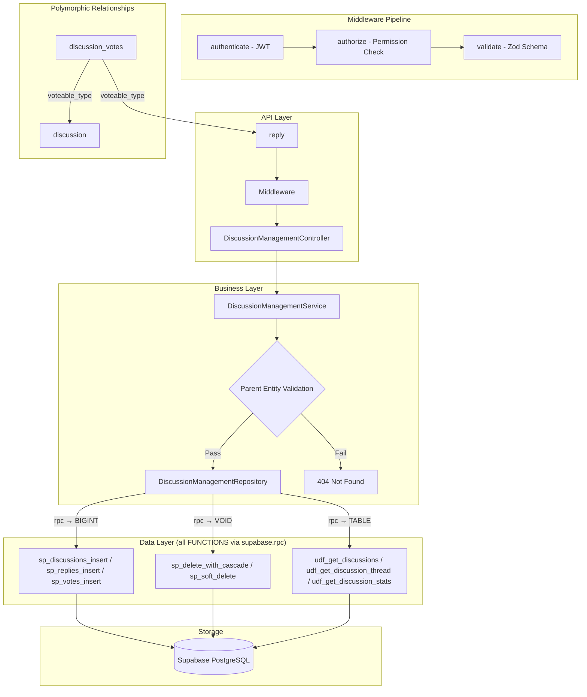

# GrowUpMore API — Discussion Management Module

## Postman Testing Guide

**Base URL:** `http://localhost:5001`
**API Prefix:** `/api/v1/discussion-management`
**Content-Type:** `application/json`
**Authentication:** All endpoints require `Bearer <access_token>` in Authorization header

---

## Architecture Flow



---

## Prerequisites

Before testing, ensure:

1. **Authentication**: Login via `POST /api/v1/auth/login` to obtain `access_token`
2. **Permissions**: Run `phase23_discussion_management_permissions_seed.sql` in Supabase SQL Editor
3. **Master Data**: Students, Courses, and Chapters exist (from earlier phases)
4. **Enrollment**: Students must be enrolled in courses to create discussions
5. **Database Schema**: All tables (discussions, discussion_replies, discussion_votes) exist with proper constraints

---

## Complete Endpoint Reference

### Test Order (follow this sequence in Postman)

| # | Endpoint | Permission | Purpose |
|---|----------|-----------|---------|
| 1 | `GET /discussions` | `discussion.read` | List discussions with filters |
| 2 | `GET /discussions/thread` | `discussion.read` | Get hierarchical discussion thread |
| 3 | `POST /discussions` | `discussion.create` | Create new discussion |
| 4 | `GET /discussions/:id` | `discussion.read` | Get single discussion |
| 5 | `PATCH /discussions/:id` | `discussion.update` | Update discussion |
| 6 | `GET /discussions/:discussionId/replies` | `discussion_reply.read` | List replies for discussion |
| 7 | `POST /discussions/:discussionId/replies` | `discussion_reply.create` | Create reply |
| 8 | `GET /replies/:id` | `discussion_reply.read` | Get single reply |
| 9 | `PATCH /replies/:id` | `discussion_reply.update` | Update reply |
| 10 | `POST /votes` | `discussion_vote.create` | Create vote (upvote/downvote) |
| 11 | `GET /votes` | `discussion_vote.read` | List votes |
| 12 | `GET /votes/:id` | `discussion_vote.read` | Get single vote |
| 13 | `PATCH /votes/:id` | `discussion_vote.update` | Update vote |
| 14 | `DELETE /discussions/:id` | `discussion.delete` | Soft delete discussion |
| 15 | `POST /discussions/:id/restore` | `discussion.update` | Restore discussion |
| 16 | `DELETE /replies/:id` | `discussion_reply.delete` | Soft delete reply |
| 17 | `POST /replies/:id/restore` | `discussion_reply.update` | Restore reply |
| 18 | `DELETE /votes/:id` | `discussion_vote.delete` | Soft delete vote |
| 19 | `POST /votes/:id/restore` | `discussion_vote.update` | Restore vote |
| 20 | `POST /discussions/bulk-delete` | `discussion.delete` | Bulk delete discussions |
| 21 | `POST /discussions/bulk-restore` | `discussion.update` | Bulk restore discussions |
| 22 | `POST /replies/bulk-delete` | `discussion_reply.delete` | Bulk delete replies |
| 23 | `POST /replies/bulk-restore` | `discussion_reply.update` | Bulk restore replies |

---

## Common Headers (All Requests)

| Key | Value |
|-----|-------|
| Authorization | Bearer `<access_token>` |
| Content-Type | `application/json` |

---

## 1. DISCUSSIONS

### 1.1 List Discussions

**`GET /api/v1/discussion-management/discussions`**

**Permission:** `discussion.read`

**Headers:**
```
Authorization: Bearer {{access_token}}
Content-Type: application/json
```

**Query Parameters:**

| Parameter | Type | Description |
|-----------|------|-------------|
| page | integer | Page number (default: 1) |
| limit | integer | Results per page (default: 20, max: 100) |
| courseId | integer | Filter by course ID |
| chapterId | integer | Filter by chapter ID |
| userId | integer | Filter by discussion creator user ID |
| discussionType | string | Filter by type: `question`, `discussion` |
| isPinned | boolean | Filter by pinned status |
| isResolved | boolean | Filter by resolved status |
| isActive | boolean | Filter by active status |
| searchTerm | string | Search in title and body |
| sortBy | string | Sort field (default: `createdAt`) |
| sortDir | string | Sort direction: `ASC` or `DESC` (default: DESC) |

**Example:**
```
GET /api/v1/discussion-management/discussions?page=1&limit=10&courseId=5001&discussionType=question&isPinned=true&sortBy=upvoteCount&sortDir=DESC
```

**Expected Response (200):**
```json
{
  "success": true,
  "message": "Discussions retrieved successfully",
  "data": [
    {
      "id": 1001,
      "courseId": 5001,
      "chapterId": 6001,
      "userId": 1001,
      "title": "How to solve logarithmic equations?",
      "body": "I'm struggling with logarithmic equations. Can someone explain the steps?",
      "discussionType": "question",
      "isPinned": true,
      "isResolved": false,
      "upvoteCount": 5,
      "replyCount": 3,
      "isActive": true,
      "createdAt": "2026-04-05T10:30:00Z",
      "updatedAt": "2026-04-05T14:20:00Z"
    },
    {
      "id": 1002,
      "courseId": 5001,
      "chapterId": 6001,
      "userId": 1002,
      "title": "Different approaches to quadratic functions",
      "body": "Let's discuss various methods for solving quadratic equations. What works best for you?",
      "discussionType": "discussion",
      "isPinned": false,
      "isResolved": false,
      "upvoteCount": 8,
      "replyCount": 7,
      "isActive": true,
      "createdAt": "2026-04-04T15:45:00Z",
      "updatedAt": "2026-04-05T09:15:00Z"
    }
  ],
  "pagination": {
    "page": 1,
    "limit": 10,
    "total": 24,
    "pages": 3
  }
}
```

**Postman Tests:**
```javascript
pm.test("Status is 200", () => pm.response.to.have.status(200));
const json = pm.response.json();
pm.test("Response has data array", () => pm.expect(json.data).to.be.an("array"));
pm.test("Pagination info exists", () => pm.expect(json.pagination).to.exist);
if (json.data.length > 0) {
  pm.collectionVariables.set("discussionId", json.data[0].id);
}
```

---

### 1.2 Get Discussion Thread (Hierarchical)

**`GET /api/v1/discussion-management/discussions/thread`**

**Permission:** `discussion.read`

**Headers:**
```
Authorization: Bearer {{access_token}}
Content-Type: application/json
```

**Query Parameters:**

| Parameter | Type | Description |
|-----------|------|-------------|
| courseId | integer | Required - Filter by course ID |

**Example:**
```
GET /api/v1/discussion-management/discussions/thread?courseId=5001
```

**Expected Response (200):**
```json
{
  "success": true,
  "message": "Discussion thread retrieved successfully",
  "data": [
    {
      "id": 1001,
      "courseId": 5001,
      "chapterId": 6001,
      "userId": 1001,
      "title": "How to solve logarithmic equations?",
      "body": "I'm struggling with logarithmic equations. Can someone explain the steps?",
      "discussionType": "question",
      "isPinned": true,
      "isResolved": false,
      "upvoteCount": 5,
      "replyCount": 3,
      "isActive": true,
      "createdAt": "2026-04-05T10:30:00Z",
      "updatedAt": "2026-04-05T14:20:00Z",
      "replies": [
        {
          "id": 2001,
          "discussionId": 1001,
          "parentReplyId": null,
          "userId": 1003,
          "body": "You can use logarithm properties to simplify the equation first.",
          "isAcceptedAnswer": true,
          "upvoteCount": 8,
          "createdAt": "2026-04-05T11:00:00Z",
          "updatedAt": "2026-04-05T14:20:00Z",
          "isActive": true,
          "replies": [
            {
              "id": 2002,
              "discussionId": 1001,
              "parentReplyId": 2001,
              "userId": 1001,
              "body": "Thanks! That helped a lot. Can you explain the change of base formula?",
              "isAcceptedAnswer": false,
              "upvoteCount": 2,
              "createdAt": "2026-04-05T11:30:00Z",
              "updatedAt": "2026-04-05T11:30:00Z",
              "isActive": true,
              "replies": []
            }
          ]
        },
        {
          "id": 2003,
          "discussionId": 1001,
          "parentReplyId": null,
          "userId": 1004,
          "body": "There's a great tutorial on Khan Academy about this topic.",
          "isAcceptedAnswer": false,
          "upvoteCount": 3,
          "createdAt": "2026-04-05T12:15:00Z",
          "updatedAt": "2026-04-05T12:15:00Z",
          "isActive": true,
          "replies": []
        }
      ]
    },
    {
      "id": 1002,
      "courseId": 5001,
      "chapterId": 6001,
      "userId": 1002,
      "title": "Different approaches to quadratic functions",
      "body": "Let's discuss various methods for solving quadratic equations.",
      "discussionType": "discussion",
      "isPinned": false,
      "isResolved": false,
      "upvoteCount": 8,
      "replyCount": 2,
      "isActive": true,
      "createdAt": "2026-04-04T15:45:00Z",
      "updatedAt": "2026-04-05T09:15:00Z",
      "replies": []
    }
  ]
}
```

**Postman Tests:**
```javascript
pm.test("Status is 200", () => pm.response.to.have.status(200));
const json = pm.response.json();
pm.test("Response has data array", () => pm.expect(json.data).to.be.an("array"));
pm.test("Discussions have nested replies", () => {
  if (json.data.length > 0 && json.data[0].replies) {
    pm.expect(json.data[0].replies).to.be.an("array");
  }
});
```

---

### 1.3 Create Discussion

**`POST /api/v1/discussion-management/discussions`**

**Permission:** `discussion.create`

**Headers:**
```
Authorization: Bearer {{access_token}}
Content-Type: application/json
```

**Request Body:**

| Field | Type | Required | Description |
|-------|------|----------|-------------|
| courseId | integer | Yes | ID of the course |
| title | string | Yes | Discussion title (max 255 chars) |
| body | string | Yes | Discussion content (max 10000 chars) |
| chapterId | integer | No | ID of the chapter (nullable) |
| discussionType | string | No | Type: `question` or `discussion` (default: `discussion`) |
| isPinned | boolean | No | Whether discussion is pinned (default: false) |
| isResolved | boolean | No | Whether question is resolved (default: false) |

**Example Request:**
```json
{
  "courseId": 5001,
  "chapterId": 6001,
  "title": "How to solve logarithmic equations?",
  "body": "I'm struggling with logarithmic equations. Can someone explain the steps involved?",
  "discussionType": "question",
  "isPinned": false,
  "isResolved": false
}
```

**Expected Response (201):**
```json
{
  "success": true,
  "message": "Discussion created successfully",
  "data": {
    "id": 1001,
    "courseId": 5001,
    "chapterId": 6001,
    "userId": 1001,
    "title": "How to solve logarithmic equations?",
    "body": "I'm struggling with logarithmic equations. Can someone explain the steps involved?",
    "discussionType": "question",
    "isPinned": false,
    "isResolved": false,
    "upvoteCount": 0,
    "replyCount": 0,
    "isActive": true,
    "createdAt": "2026-04-06T10:30:00Z",
    "updatedAt": "2026-04-06T10:30:00Z"
  }
}
```

**Postman Tests:**
```javascript
pm.test("Status is 201", () => pm.response.to.have.status(201));
const json = pm.response.json();
pm.test("Has discussion ID", () => pm.expect(json.data.id).to.be.a("number"));
pm.test("Discussion type matches request", () => pm.expect(json.data.discussionType).to.equal("question"));
pm.test("Reply count initialized to 0", () => pm.expect(json.data.replyCount).to.equal(0));
pm.collectionVariables.set("discussionId", json.data.id);
```

---

### 1.4 Get Single Discussion

**`GET /api/v1/discussion-management/discussions/:id`**

**Permission:** `discussion.read`

**Headers:**
```
Authorization: Bearer {{access_token}}
Content-Type: application/json
```

**Example:** `GET /api/v1/discussion-management/discussions/{{discussionId}}`

**Expected Response (200):**
```json
{
  "success": true,
  "message": "Discussion retrieved successfully",
  "data": {
    "id": 1001,
    "courseId": 5001,
    "chapterId": 6001,
    "userId": 1001,
    "title": "How to solve logarithmic equations?",
    "body": "I'm struggling with logarithmic equations. Can someone explain the steps involved?",
    "discussionType": "question",
    "isPinned": false,
    "isResolved": false,
    "upvoteCount": 5,
    "replyCount": 3,
    "isActive": true,
    "createdAt": "2026-04-06T10:30:00Z",
    "updatedAt": "2026-04-06T14:20:00Z"
  }
}
```

**Postman Tests:**
```javascript
pm.test("Status is 200", () => pm.response.to.have.status(200));
const json = pm.response.json();
pm.test("Discussion ID matches request", () => pm.expect(json.data.id).to.be.a("number"));
pm.test("Has discussion details", () => pm.expect(json.data.title).to.exist);
```

---

### 1.5 Update Discussion

**`PATCH /api/v1/discussion-management/discussions/:id`**

**Permission:** `discussion.update`

**Headers:**
```
Authorization: Bearer {{access_token}}
Content-Type: application/json
```

**Example:** `PATCH /api/v1/discussion-management/discussions/{{discussionId}}`

**Request Body:**

| Field | Type | Required | Description |
|-------|------|----------|-------------|
| title | string | No | Updated title |
| body | string | No | Updated body content |
| chapterId | integer | No | Updated chapter ID |
| discussionType | string | No | Updated type: `question` or `discussion` |
| isPinned | boolean | No | Update pinned status |
| isResolved | boolean | No | Update resolved status |
| upvoteCount | integer | No | Update upvote count |
| replyCount | integer | No | Update reply count |

**Example Request:**
```json
{
  "title": "How to solve logarithmic equations? (SOLVED)",
  "isResolved": true,
  "upvoteCount": 8
}
```

**Expected Response (200):**
```json
{
  "success": true,
  "message": "Discussion updated successfully",
  "data": {
    "id": 1001,
    "courseId": 5001,
    "chapterId": 6001,
    "userId": 1001,
    "title": "How to solve logarithmic equations? (SOLVED)",
    "body": "I'm struggling with logarithmic equations. Can someone explain the steps involved?",
    "discussionType": "question",
    "isPinned": false,
    "isResolved": true,
    "upvoteCount": 8,
    "replyCount": 3,
    "isActive": true,
    "createdAt": "2026-04-06T10:30:00Z",
    "updatedAt": "2026-04-06T15:45:00Z"
  }
}
```

**Postman Tests:**
```javascript
pm.test("Status is 200", () => pm.response.to.have.status(200));
const json = pm.response.json();
pm.test("Title updated", () => pm.expect(json.data.title).to.include("SOLVED"));
pm.test("isResolved updated to true", () => pm.expect(json.data.isResolved).to.equal(true));
pm.test("UpdatedAt timestamp changed", () => pm.expect(json.data.updatedAt).to.exist);
```

---

### 1.6 Delete Discussion (Soft Delete)

**`DELETE /api/v1/discussion-management/discussions/:id`**

**Permission:** `discussion.delete`

**Headers:**
```
Authorization: Bearer {{access_token}}
```

**Example:** `DELETE /api/v1/discussion-management/discussions/{{discussionId}}`

**Expected Response (200):**
```json
{
  "success": true,
  "message": "Discussion deleted successfully",
  "data": {
    "id": 1001,
    "deletedAt": "2026-04-06T16:00:00Z"
  }
}
```

**Postman Tests:**
```javascript
pm.test("Status is 200", () => pm.response.to.have.status(200));
const json = pm.response.json();
pm.test("Has deleted ID", () => pm.expect(json.data.id).to.be.a("number"));
pm.test("Has deletedAt timestamp", () => pm.expect(json.data.deletedAt).to.exist);
```

---

### 1.7 Restore Discussion

**`POST /api/v1/discussion-management/discussions/:id/restore`**

**Permission:** `discussion.update`

**Headers:**
```
Authorization: Bearer {{access_token}}
Content-Type: application/json
```

**Example:** `POST /api/v1/discussion-management/discussions/{{discussionId}}/restore`

**Request Body:**
```json
{}
```

**Expected Response (200):**
```json
{
  "success": true,
  "message": "Discussion restored successfully",
  "data": {
    "id": 1001,
    "courseId": 5001,
    "chapterId": 6001,
    "userId": 1001,
    "title": "How to solve logarithmic equations? (SOLVED)",
    "body": "I'm struggling with logarithmic equations. Can someone explain the steps involved?",
    "discussionType": "question",
    "isPinned": false,
    "isResolved": true,
    "upvoteCount": 8,
    "replyCount": 3,
    "isActive": true,
    "createdAt": "2026-04-06T10:30:00Z",
    "updatedAt": "2026-04-06T15:45:00Z",
    "restoredAt": "2026-04-06T16:15:00Z"
  }
}
```

**Postman Tests:**
```javascript
pm.test("Status is 200", () => pm.response.to.have.status(200));
const json = pm.response.json();
pm.test("Discussion restored with restoredAt timestamp", () => pm.expect(json.data.restoredAt).to.exist);
pm.test("Data integrity maintained", () => pm.expect(json.data.id).to.be.a("number"));
```

---

### 1.8 Bulk Delete Discussions

**`POST /api/v1/discussion-management/discussions/bulk-delete`**

**Permission:** `discussion.delete`

**Headers:**
```
Authorization: Bearer {{access_token}}
Content-Type: application/json
```

**Request Body:**

| Field | Type | Required | Description |
|-------|------|----------|-------------|
| ids | array | Yes | Array of discussion IDs to delete |

**Example Request:**
```json
{
  "ids": [1001, 1002, 1005, 1007]
}
```

**Expected Response (200):**
```json
{
  "success": true,
  "message": "Discussions deleted successfully",
  "data": {
    "deletedCount": 4,
    "deletedIds": [1001, 1002, 1005, 1007],
    "deletedAt": "2026-04-06T16:30:00Z"
  }
}
```

**Postman Tests:**
```javascript
pm.test("Status is 200", () => pm.response.to.have.status(200));
const json = pm.response.json();
pm.test("Deleted count matches request", () => pm.expect(json.data.deletedCount).to.equal(4));
pm.test("Deleted IDs array matches request", () => {
  pm.expect(json.data.deletedIds).to.be.an("array");
  pm.expect(json.data.deletedIds).to.have.lengthOf(4);
});
```

---

### 1.9 Bulk Restore Discussions

**`POST /api/v1/discussion-management/discussions/bulk-restore`**

**Permission:** `discussion.update`

**Headers:**
```
Authorization: Bearer {{access_token}}
Content-Type: application/json
```

**Request Body:**

| Field | Type | Required | Description |
|-------|------|----------|-------------|
| ids | array | Yes | Array of discussion IDs to restore |

**Example Request:**
```json
{
  "ids": [1001, 1002, 1005, 1007]
}
```

**Expected Response (200):**
```json
{
  "success": true,
  "message": "Discussions restored successfully",
  "data": {
    "restoredCount": 4,
    "restoredIds": [1001, 1002, 1005, 1007],
    "restoredAt": "2026-04-06T16:45:00Z"
  }
}
```

**Postman Tests:**
```javascript
pm.test("Status is 200", () => pm.response.to.have.status(200));
const json = pm.response.json();
pm.test("Restored count matches request", () => pm.expect(json.data.restoredCount).to.equal(4));
pm.test("Restored IDs array matches request", () => {
  pm.expect(json.data.restoredIds).to.be.an("array");
  pm.expect(json.data.restoredIds).to.have.lengthOf(4);
});
```

---

## 2. DISCUSSION REPLIES

### 2.1 List Replies for Discussion

**`GET /api/v1/discussion-management/discussions/:discussionId/replies`**

**Permission:** `discussion_reply.read`

**Headers:**
```
Authorization: Bearer {{access_token}}
Content-Type: application/json
```

**Query Parameters:**

| Parameter | Type | Description |
|-----------|------|-------------|
| page | integer | Page number (default: 1) |
| limit | integer | Results per page (default: 20, max: 100) |
| parentReplyId | integer | Filter by parent reply ID (for nested replies) |
| userId | integer | Filter by reply author user ID |
| isAcceptedAnswer | boolean | Filter by accepted answer status |
| searchTerm | string | Search in reply body |
| sortBy | string | Sort field (default: `createdAt`) |
| sortDir | string | Sort direction: `ASC` or `DESC` (default: ASC) |

**Example:** `GET /api/v1/discussion-management/discussions/{{discussionId}}/replies?page=1&limit=10&sortBy=upvoteCount&sortDir=DESC`

**Expected Response (200):**
```json
{
  "success": true,
  "message": "Replies retrieved successfully",
  "data": [
    {
      "id": 2001,
      "discussionId": 1001,
      "parentReplyId": null,
      "userId": 1003,
      "body": "You can use logarithm properties to simplify the equation first.",
      "isAcceptedAnswer": true,
      "upvoteCount": 8,
      "isActive": true,
      "createdAt": "2026-04-05T11:00:00Z",
      "updatedAt": "2026-04-05T14:20:00Z"
    },
    {
      "id": 2003,
      "discussionId": 1001,
      "parentReplyId": null,
      "userId": 1004,
      "body": "There's a great tutorial on Khan Academy about this topic.",
      "isAcceptedAnswer": false,
      "upvoteCount": 3,
      "isActive": true,
      "createdAt": "2026-04-05T12:15:00Z",
      "updatedAt": "2026-04-05T12:15:00Z"
    }
  ],
  "pagination": {
    "page": 1,
    "limit": 10,
    "total": 3,
    "pages": 1
  }
}
```

**Postman Tests:**
```javascript
pm.test("Status is 200", () => pm.response.to.have.status(200));
const json = pm.response.json();
pm.test("Response has data array", () => pm.expect(json.data).to.be.an("array"));
pm.test("Pagination info exists", () => pm.expect(json.pagination).to.exist);
if (json.data.length > 0) {
  pm.collectionVariables.set("replyId", json.data[0].id);
}
```

---

### 2.2 Create Reply

**`POST /api/v1/discussion-management/discussions/:discussionId/replies`**

**Permission:** `discussion_reply.create`

**Headers:**
```
Authorization: Bearer {{access_token}}
Content-Type: application/json
```

**Example:** `POST /api/v1/discussion-management/discussions/{{discussionId}}/replies`

**Request Body:**

| Field | Type | Required | Description |
|-------|------|----------|-------------|
| body | string | Yes | Reply content (max 10000 chars) |
| parentReplyId | integer | No | ID of parent reply (for nested replies) |
| isAcceptedAnswer | boolean | No | Mark as accepted answer (default: false) |

**Example Request:**
```json
{
  "body": "You can use logarithm properties to simplify the equation first. Here's the step-by-step approach...",
  "parentReplyId": null,
  "isAcceptedAnswer": false
}
```

**Expected Response (201):**
```json
{
  "success": true,
  "message": "Reply created successfully",
  "data": {
    "id": 2001,
    "discussionId": 1001,
    "parentReplyId": null,
    "userId": 1003,
    "body": "You can use logarithm properties to simplify the equation first. Here's the step-by-step approach...",
    "isAcceptedAnswer": false,
    "upvoteCount": 0,
    "isActive": true,
    "createdAt": "2026-04-06T11:00:00Z",
    "updatedAt": "2026-04-06T11:00:00Z"
  }
}
```

**Postman Tests:**
```javascript
pm.test("Status is 201", () => pm.response.to.have.status(201));
const json = pm.response.json();
pm.test("Has reply ID", () => pm.expect(json.data.id).to.be.a("number"));
pm.test("Discussion ID matches request", () => pm.expect(json.data.discussionId).to.be.a("number"));
pm.test("Upvote count initialized to 0", () => pm.expect(json.data.upvoteCount).to.equal(0));
pm.collectionVariables.set("replyId", json.data.id);
```

---

### 2.3 Get Single Reply

**`GET /api/v1/discussion-management/replies/:id`**

**Permission:** `discussion_reply.read`

**Headers:**
```
Authorization: Bearer {{access_token}}
Content-Type: application/json
```

**Example:** `GET /api/v1/discussion-management/replies/{{replyId}}`

**Expected Response (200):**
```json
{
  "success": true,
  "message": "Reply retrieved successfully",
  "data": {
    "id": 2001,
    "discussionId": 1001,
    "parentReplyId": null,
    "userId": 1003,
    "body": "You can use logarithm properties to simplify the equation first.",
    "isAcceptedAnswer": true,
    "upvoteCount": 8,
    "isActive": true,
    "createdAt": "2026-04-05T11:00:00Z",
    "updatedAt": "2026-04-05T14:20:00Z"
  }
}
```

**Postman Tests:**
```javascript
pm.test("Status is 200", () => pm.response.to.have.status(200));
const json = pm.response.json();
pm.test("Reply ID matches request", () => pm.expect(json.data.id).to.be.a("number"));
pm.test("Has reply body", () => pm.expect(json.data.body).to.exist);
```

---

### 2.4 Update Reply

**`PATCH /api/v1/discussion-management/replies/:id`**

**Permission:** `discussion_reply.update`

**Headers:**
```
Authorization: Bearer {{access_token}}
Content-Type: application/json
```

**Example:** `PATCH /api/v1/discussion-management/replies/{{replyId}}`

**Request Body:**

| Field | Type | Required | Description |
|-------|------|----------|-------------|
| body | string | No | Updated reply content |
| parentReplyId | integer | No | Updated parent reply ID |
| isAcceptedAnswer | boolean | No | Update accepted answer status |
| upvoteCount | integer | No | Update upvote count |

**Example Request:**
```json
{
  "body": "You can use logarithm properties to simplify the equation first. Updated with more details...",
  "isAcceptedAnswer": true,
  "upvoteCount": 12
}
```

**Expected Response (200):**
```json
{
  "success": true,
  "message": "Reply updated successfully",
  "data": {
    "id": 2001,
    "discussionId": 1001,
    "parentReplyId": null,
    "userId": 1003,
    "body": "You can use logarithm properties to simplify the equation first. Updated with more details...",
    "isAcceptedAnswer": true,
    "upvoteCount": 12,
    "isActive": true,
    "createdAt": "2026-04-05T11:00:00Z",
    "updatedAt": "2026-04-06T15:30:00Z"
  }
}
```

**Postman Tests:**
```javascript
pm.test("Status is 200", () => pm.response.to.have.status(200));
const json = pm.response.json();
pm.test("Body updated", () => pm.expect(json.data.body).to.include("Updated with more details"));
pm.test("isAcceptedAnswer updated to true", () => pm.expect(json.data.isAcceptedAnswer).to.equal(true));
pm.test("UpdatedAt timestamp changed", () => pm.expect(json.data.updatedAt).to.exist);
```

---

### 2.5 Delete Reply (Soft Delete)

**`DELETE /api/v1/discussion-management/replies/:id`**

**Permission:** `discussion_reply.delete`

**Headers:**
```
Authorization: Bearer {{access_token}}
```

**Example:** `DELETE /api/v1/discussion-management/replies/{{replyId}}`

**Expected Response (200):**
```json
{
  "success": true,
  "message": "Reply deleted successfully",
  "data": {
    "id": 2001,
    "deletedAt": "2026-04-06T16:00:00Z"
  }
}
```

**Postman Tests:**
```javascript
pm.test("Status is 200", () => pm.response.to.have.status(200));
const json = pm.response.json();
pm.test("Has deleted ID", () => pm.expect(json.data.id).to.be.a("number"));
pm.test("Has deletedAt timestamp", () => pm.expect(json.data.deletedAt).to.exist);
```

---

### 2.6 Restore Reply

**`POST /api/v1/discussion-management/replies/:id/restore`**

**Permission:** `discussion_reply.update`

**Headers:**
```
Authorization: Bearer {{access_token}}
Content-Type: application/json
```

**Example:** `POST /api/v1/discussion-management/replies/{{replyId}}/restore`

**Request Body:**
```json
{}
```

**Expected Response (200):**
```json
{
  "success": true,
  "message": "Reply restored successfully",
  "data": {
    "id": 2001,
    "discussionId": 1001,
    "parentReplyId": null,
    "userId": 1003,
    "body": "You can use logarithm properties to simplify the equation first. Updated with more details...",
    "isAcceptedAnswer": true,
    "upvoteCount": 12,
    "isActive": true,
    "createdAt": "2026-04-05T11:00:00Z",
    "updatedAt": "2026-04-06T15:30:00Z",
    "restoredAt": "2026-04-06T16:15:00Z"
  }
}
```

**Postman Tests:**
```javascript
pm.test("Status is 200", () => pm.response.to.have.status(200));
const json = pm.response.json();
pm.test("Reply restored with restoredAt timestamp", () => pm.expect(json.data.restoredAt).to.exist);
pm.test("Data integrity maintained", () => pm.expect(json.data.id).to.be.a("number"));
```

---

### 2.7 Bulk Delete Replies

**`POST /api/v1/discussion-management/replies/bulk-delete`**

**Permission:** `discussion_reply.delete`

**Headers:**
```
Authorization: Bearer {{access_token}}
Content-Type: application/json
```

**Request Body:**

| Field | Type | Required | Description |
|-------|------|----------|-------------|
| ids | array | Yes | Array of reply IDs to delete |

**Example Request:**
```json
{
  "ids": [2001, 2002, 2005, 2007]
}
```

**Expected Response (200):**
```json
{
  "success": true,
  "message": "Replies deleted successfully",
  "data": {
    "deletedCount": 4,
    "deletedIds": [2001, 2002, 2005, 2007],
    "deletedAt": "2026-04-06T16:30:00Z"
  }
}
```

**Postman Tests:**
```javascript
pm.test("Status is 200", () => pm.response.to.have.status(200));
const json = pm.response.json();
pm.test("Deleted count matches request", () => pm.expect(json.data.deletedCount).to.equal(4));
pm.test("Deleted IDs array matches request", () => {
  pm.expect(json.data.deletedIds).to.be.an("array");
  pm.expect(json.data.deletedIds).to.have.lengthOf(4);
});
```

---

### 2.8 Bulk Restore Replies

**`POST /api/v1/discussion-management/replies/bulk-restore`**

**Permission:** `discussion_reply.update`

**Headers:**
```
Authorization: Bearer {{access_token}}
Content-Type: application/json
```

**Request Body:**

| Field | Type | Required | Description |
|-------|------|----------|-------------|
| ids | array | Yes | Array of reply IDs to restore |

**Example Request:**
```json
{
  "ids": [2001, 2002, 2005, 2007]
}
```

**Expected Response (200):**
```json
{
  "success": true,
  "message": "Replies restored successfully",
  "data": {
    "restoredCount": 4,
    "restoredIds": [2001, 2002, 2005, 2007],
    "restoredAt": "2026-04-06T16:45:00Z"
  }
}
```

**Postman Tests:**
```javascript
pm.test("Status is 200", () => pm.response.to.have.status(200));
const json = pm.response.json();
pm.test("Restored count matches request", () => pm.expect(json.data.restoredCount).to.equal(4));
pm.test("Restored IDs array matches request", () => {
  pm.expect(json.data.restoredIds).to.be.an("array");
  pm.expect(json.data.restoredIds).to.have.lengthOf(4);
});
```

---

## 3. DISCUSSION VOTES

### 3.1 List Votes

**`GET /api/v1/discussion-management/votes`**

**Permission:** `discussion_vote.read`

**Headers:**
```
Authorization: Bearer {{access_token}}
Content-Type: application/json
```

**Query Parameters:**

| Parameter | Type | Description |
|-----------|------|-------------|
| page | integer | Page number (default: 1) |
| limit | integer | Results per page (default: 20, max: 100) |
| userId | integer | Filter by voter user ID |
| voteableType | string | Filter by voteable type: `discussion` or `reply` |
| discussionId | integer | Filter by discussion ID |
| replyId | integer | Filter by reply ID |
| voteType | string | Filter by vote type: `upvote` or `downvote` |
| sortBy | string | Sort field (default: `createdAt`) |
| sortDir | string | Sort direction: `ASC` or `DESC` (default: DESC) |

**Example:**
```
GET /api/v1/discussion-management/votes?page=1&limit=10&voteableType=discussion&voteType=upvote&sortBy=createdAt&sortDir=DESC
```

**Expected Response (200):**
```json
{
  "success": true,
  "message": "Votes retrieved successfully",
  "data": [
    {
      "id": 3001,
      "userId": 1002,
      "voteableType": "discussion",
      "discussionId": 1001,
      "replyId": null,
      "voteType": "upvote",
      "createdAt": "2026-04-06T12:30:00Z",
      "updatedAt": "2026-04-06T12:30:00Z",
      "isActive": true
    },
    {
      "id": 3002,
      "userId": 1003,
      "voteableType": "discussion",
      "discussionId": 1001,
      "replyId": null,
      "voteType": "upvote",
      "createdAt": "2026-04-06T13:15:00Z",
      "updatedAt": "2026-04-06T13:15:00Z",
      "isActive": true
    },
    {
      "id": 3003,
      "userId": 1001,
      "voteableType": "reply",
      "discussionId": 1001,
      "replyId": 2001,
      "voteType": "upvote",
      "createdAt": "2026-04-06T14:00:00Z",
      "updatedAt": "2026-04-06T14:00:00Z",
      "isActive": true
    }
  ],
  "pagination": {
    "page": 1,
    "limit": 10,
    "total": 42,
    "pages": 5
  }
}
```

**Postman Tests:**
```javascript
pm.test("Status is 200", () => pm.response.to.have.status(200));
const json = pm.response.json();
pm.test("Response has data array", () => pm.expect(json.data).to.be.an("array"));
pm.test("Pagination info exists", () => pm.expect(json.pagination).to.exist);
if (json.data.length > 0) {
  pm.collectionVariables.set("voteId", json.data[0].id);
}
```

---

### 3.2 Create Vote (Upvote/Downvote)

**`POST /api/v1/discussion-management/votes`**

**Permission:** `discussion_vote.create`

**Headers:**
```
Authorization: Bearer {{access_token}}
Content-Type: application/json
```

**Request Body:**

| Field | Type | Required | Description |
|-------|------|----------|-------------|
| voteableType | string | Yes | Type: `discussion` or `reply` |
| voteType | string | Yes | Vote type: `upvote` or `downvote` |
| discussionId | integer | No | Required if voteableType is `discussion` |
| replyId | integer | No | Required if voteableType is `reply` |

**Example Request (Upvote Discussion):**
```json
{
  "voteableType": "discussion",
  "voteType": "upvote",
  "discussionId": 1001
}
```

**Example Request (Upvote Reply):**
```json
{
  "voteableType": "reply",
  "voteType": "upvote",
  "replyId": 2001
}
```

**Expected Response (201):**
```json
{
  "success": true,
  "message": "Vote created successfully",
  "data": {
    "id": 3001,
    "userId": 1002,
    "voteableType": "discussion",
    "discussionId": 1001,
    "replyId": null,
    "voteType": "upvote",
    "createdAt": "2026-04-06T12:30:00Z",
    "updatedAt": "2026-04-06T12:30:00Z",
    "isActive": true
  }
}
```

**Postman Tests:**
```javascript
pm.test("Status is 201", () => pm.response.to.have.status(201));
const json = pm.response.json();
pm.test("Has vote ID", () => pm.expect(json.data.id).to.be.a("number"));
pm.test("Vote type matches request", () => pm.expect(json.data.voteType).to.equal("upvote"));
pm.test("Voteable type matches request", () => pm.expect(json.data.voteableType).to.equal("discussion"));
pm.collectionVariables.set("voteId", json.data.id);
```

---

### 3.3 Get Single Vote

**`GET /api/v1/discussion-management/votes/:id`**

**Permission:** `discussion_vote.read`

**Headers:**
```
Authorization: Bearer {{access_token}}
Content-Type: application/json
```

**Example:** `GET /api/v1/discussion-management/votes/{{voteId}}`

**Expected Response (200):**
```json
{
  "success": true,
  "message": "Vote retrieved successfully",
  "data": {
    "id": 3001,
    "userId": 1002,
    "voteableType": "discussion",
    "discussionId": 1001,
    "replyId": null,
    "voteType": "upvote",
    "createdAt": "2026-04-06T12:30:00Z",
    "updatedAt": "2026-04-06T12:30:00Z",
    "isActive": true
  }
}
```

**Postman Tests:**
```javascript
pm.test("Status is 200", () => pm.response.to.have.status(200));
const json = pm.response.json();
pm.test("Vote ID matches request", () => pm.expect(json.data.id).to.be.a("number"));
pm.test("Has vote type", () => pm.expect(json.data.voteType).to.exist);
```

---

### 3.4 Update Vote

**`PATCH /api/v1/discussion-management/votes/:id`**

**Permission:** `discussion_vote.update`

**Headers:**
```
Authorization: Bearer {{access_token}}
Content-Type: application/json
```

**Example:** `PATCH /api/v1/discussion-management/votes/{{voteId}}`

**Request Body:**

| Field | Type | Required | Description |
|-------|------|----------|-------------|
| voteType | string | No | Updated vote type: `upvote` or `downvote` |

**Example Request:**
```json
{
  "voteType": "downvote"
}
```

**Expected Response (200):**
```json
{
  "success": true,
  "message": "Vote updated successfully",
  "data": {
    "id": 3001,
    "userId": 1002,
    "voteableType": "discussion",
    "discussionId": 1001,
    "replyId": null,
    "voteType": "downvote",
    "createdAt": "2026-04-06T12:30:00Z",
    "updatedAt": "2026-04-06T14:15:00Z",
    "isActive": true
  }
}
```

**Postman Tests:**
```javascript
pm.test("Status is 200", () => pm.response.to.have.status(200));
const json = pm.response.json();
pm.test("Vote type updated to downvote", () => pm.expect(json.data.voteType).to.equal("downvote"));
pm.test("UpdatedAt timestamp changed", () => pm.expect(json.data.updatedAt).to.exist);
```

---

### 3.5 Delete Vote (Soft Delete)

**`DELETE /api/v1/discussion-management/votes/:id`**

**Permission:** `discussion_vote.delete`

**Headers:**
```
Authorization: Bearer {{access_token}}
```

**Example:** `DELETE /api/v1/discussion-management/votes/{{voteId}}`

**Expected Response (200):**
```json
{
  "success": true,
  "message": "Vote deleted successfully",
  "data": {
    "id": 3001,
    "deletedAt": "2026-04-06T16:00:00Z"
  }
}
```

**Postman Tests:**
```javascript
pm.test("Status is 200", () => pm.response.to.have.status(200));
const json = pm.response.json();
pm.test("Has deleted ID", () => pm.expect(json.data.id).to.be.a("number"));
pm.test("Has deletedAt timestamp", () => pm.expect(json.data.deletedAt).to.exist);
```

---

### 3.6 Restore Vote

**`POST /api/v1/discussion-management/votes/:id/restore`**

**Permission:** `discussion_vote.update`

**Headers:**
```
Authorization: Bearer {{access_token}}
Content-Type: application/json
```

**Example:** `POST /api/v1/discussion-management/votes/{{voteId}}/restore`

**Request Body:**
```json
{}
```

**Expected Response (200):**
```json
{
  "success": true,
  "message": "Vote restored successfully",
  "data": {
    "id": 3001,
    "userId": 1002,
    "voteableType": "discussion",
    "discussionId": 1001,
    "replyId": null,
    "voteType": "downvote",
    "createdAt": "2026-04-06T12:30:00Z",
    "updatedAt": "2026-04-06T14:15:00Z",
    "restoredAt": "2026-04-06T16:15:00Z",
    "isActive": true
  }
}
```

**Postman Tests:**
```javascript
pm.test("Status is 200", () => pm.response.to.have.status(200));
const json = pm.response.json();
pm.test("Vote restored with restoredAt timestamp", () => pm.expect(json.data.restoredAt).to.exist);
pm.test("Data integrity maintained", () => pm.expect(json.data.id).to.be.a("number"));
```

---

## Advanced Use Cases

### Get All Upvotes for a Discussion

**`GET /api/v1/discussion-management/votes?discussionId=1001&voteType=upvote&sortBy=createdAt&sortDir=DESC&limit=50`**

This query returns all upvotes for a specific discussion, most recent first.

**Expected Response (200):**
```json
{
  "success": true,
  "message": "Votes retrieved successfully",
  "data": [
    {
      "id": 3001,
      "userId": 1002,
      "voteableType": "discussion",
      "discussionId": 1001,
      "replyId": null,
      "voteType": "upvote",
      "createdAt": "2026-04-06T12:30:00Z",
      "updatedAt": "2026-04-06T12:30:00Z",
      "isActive": true
    },
    {
      "id": 3002,
      "userId": 1003,
      "voteableType": "discussion",
      "discussionId": 1001,
      "replyId": null,
      "voteType": "upvote",
      "createdAt": "2026-04-06T13:15:00Z",
      "updatedAt": "2026-04-06T13:15:00Z",
      "isActive": true
    }
  ],
  "pagination": {
    "page": 1,
    "limit": 50,
    "total": 8,
    "pages": 1
  }
}
```

### Get Accepted Answers for a Course

**`GET /api/v1/discussion-management/discussions?courseId=5001&isActive=true&sortBy=upvoteCount&sortDir=DESC&limit=20`**

Filter replies using nested thread response:
```
GET /api/v1/discussion-management/discussions/thread?courseId=5001
```

Then parse responses where `isAcceptedAnswer === true`.

### Get Most Helpful Discussions

**`GET /api/v1/discussion-management/discussions?courseId=5001&discussionType=question&isResolved=true&sortBy=replyCount&sortDir=DESC&limit=10`**

This returns resolved questions with the most replies, indicating helpful discussions.

### Track User Voting Behavior

**`GET /api/v1/discussion-management/votes?userId=1001&sortBy=createdAt&sortDir=DESC&limit=100`**

This returns all votes made by a specific user, useful for understanding user engagement.

### Find Pinned Questions in a Chapter

**`GET /api/v1/discussion-management/discussions?chapterId=6001&discussionType=question&isPinned=true&sortBy=createdAt&sortDir=DESC`**

This query returns all pinned questions in a specific chapter for easy access.

---

## Error Responses

### 400 Bad Request
```json
{
  "success": false,
  "message": "Validation error",
  "errors": [
    {
      "field": "title",
      "message": "Title must not exceed 255 characters"
    },
    {
      "field": "body",
      "message": "Body is required and must not be empty"
    }
  ]
}
```

### 401 Unauthorized
```json
{
  "success": false,
  "message": "Unauthorized. Invalid or missing access token."
}
```

### 403 Forbidden
```json
{
  "success": false,
  "message": "You do not have permission to perform this action."
}
```

### 404 Not Found
```json
{
  "success": false,
  "message": "Discussion not found."
}
```

### 409 Conflict
```json
{
  "success": false,
  "message": "A vote for this discussion by this user already exists."
}
```

### 500 Internal Server Error
```json
{
  "success": false,
  "message": "An unexpected error occurred. Please try again later."
}
```

---

## Discussion Type Flow

The discussion lifecycle follows these transitions:

```
Created
  ├→ question (requires resolution)
  │  ├→ isResolved: false (open)
  │  └→ isResolved: true (answered)
  │
  └→ discussion (general conversation)
     ├→ Active
     └→ Archived (via isPinned/isActive)

Deleted (soft delete)
  ↓
Restored (can be restored if needed)
```

### Discussion Type Definitions

| Type | Description | Can Be Resolved | Use Case |
|------|-------------|-----------------|----------|
| **question** | Seeking answer to specific problem | Yes | Student asks specific question |
| **discussion** | General conversation/debate | No | Discussion of concepts or strategies |
| **pinned** | Important discussion pinned by instructor | Either | Instructor highlights important Q&A |

---

## Reply Hierarchy & Threading

Replies support nested conversations:

```
Discussion (id: 1001)
  ├→ Reply Level 1 (parentReplyId: null)
  │  ├→ Reply Level 2 (parentReplyId: 2001)
  │  │  └→ Reply Level 3 (parentReplyId: 2002)
  │  └→ Reply Level 2 (parentReplyId: 2001)
  │
  └→ Reply Level 1 (parentReplyId: null)
     └→ Reply Level 2 (parentReplyId: 2003)
```

Only first-level replies (parentReplyId: null) appear in the main list. Nested replies are accessed through the hierarchical thread endpoint.

---

## Vote Polymorphism

The voting system supports voting on both discussions and replies through polymorphism:

```
discussion_votes table:
  - voteable_type: 'discussion' → discussion_id populated, reply_id NULL
  - voteable_type: 'reply' → reply_id populated, discussion_id NULL

CHECK constraint ensures data integrity:
  - If voteable_type='discussion', discussion_id must not be NULL
  - If voteable_type='reply', reply_id must not be NULL
```

---

## Field Definitions

### Discussion Fields

| Field | Type | Description | Constraints |
|-------|------|-------------|-------------|
| **id** | integer | Unique discussion identifier | Auto-generated |
| **courseId** | integer | ID of the course | Required, FK constraint |
| **chapterId** | integer | ID of the chapter | Optional (nullable), FK constraint |
| **userId** | integer | ID of discussion creator | Required, FK constraint |
| **title** | string | Discussion title | Required, max 255 chars |
| **body** | string | Discussion content | Required, max 10000 chars |
| **discussionType** | string | Type of discussion | CHECK: `question` or `discussion` |
| **isPinned** | boolean | Whether pinned by instructor | Default: false |
| **isResolved** | boolean | Whether question is answered | Default: false |
| **upvoteCount** | integer | Total upvotes received | Non-negative, default: 0 |
| **replyCount** | integer | Total replies received | Non-negative, default: 0 |
| **isActive** | boolean | Whether actively displayed | Default: true |
| **createdAt** | string | ISO 8601 creation timestamp | Auto-generated |
| **updatedAt** | string | ISO 8601 last update timestamp | Auto-generated |
| **deletedAt** | string | ISO 8601 deletion timestamp | Only present if deleted |
| **restoredAt** | string | ISO 8601 restoration timestamp | Only present if restored |

### Reply Fields

| Field | Type | Description | Constraints |
|-------|------|-------------|-------------|
| **id** | integer | Unique reply identifier | Auto-generated |
| **discussionId** | integer | ID of parent discussion | Required, FK constraint |
| **parentReplyId** | integer | ID of parent reply (for nesting) | Optional (nullable), self-referential FK |
| **userId** | integer | ID of reply author | Required, FK constraint |
| **body** | string | Reply content | Required, max 10000 chars |
| **isAcceptedAnswer** | boolean | Whether marked as accepted answer | Default: false |
| **upvoteCount** | integer | Total upvotes received | Non-negative, default: 0 |
| **isActive** | boolean | Whether actively displayed | Default: true |
| **createdAt** | string | ISO 8601 creation timestamp | Auto-generated |
| **updatedAt** | string | ISO 8601 last update timestamp | Auto-generated |
| **deletedAt** | string | ISO 8601 deletion timestamp | Only present if deleted |
| **restoredAt** | string | ISO 8601 restoration timestamp | Only present if restored |

### Vote Fields

| Field | Type | Description | Constraints |
|-------|------|-------------|-------------|
| **id** | integer | Unique vote identifier | Auto-generated |
| **userId** | integer | ID of voter | Required, FK constraint |
| **voteableType** | string | Type being voted on | CHECK: `discussion` or `reply` |
| **discussionId** | integer | ID of discussion (if voteableType=discussion) | Nullable, FK constraint |
| **replyId** | integer | ID of reply (if voteableType=reply) | Nullable, FK constraint |
| **voteType** | string | Type of vote | CHECK: `upvote` or `downvote` |
| **isActive** | boolean | Whether vote is active | Default: true |
| **createdAt** | string | ISO 8601 creation timestamp | Auto-generated |
| **updatedAt** | string | ISO 8601 last update timestamp | Auto-generated |
| **deletedAt** | string | ISO 8601 deletion timestamp | Only present if deleted |
| **restoredAt** | string | ISO 8601 restoration timestamp | Only present if restored |

---

## Permission Matrix

| Action | Endpoint | Permission Required |
|--------|----------|-------------------|
| List discussions | GET /discussions | `discussion.read` |
| Get thread | GET /discussions/thread | `discussion.read` |
| Get single discussion | GET /discussions/:id | `discussion.read` |
| Create discussion | POST /discussions | `discussion.create` |
| Update discussion | PATCH /discussions/:id | `discussion.update` |
| Delete discussion | DELETE /discussions/:id | `discussion.delete` |
| Restore discussion | POST /discussions/:id/restore | `discussion.update` |
| Bulk delete discussions | POST /discussions/bulk-delete | `discussion.delete` |
| Bulk restore discussions | POST /discussions/bulk-restore | `discussion.update` |
| List replies | GET /discussions/:discussionId/replies | `discussion_reply.read` |
| Get single reply | GET /replies/:id | `discussion_reply.read` |
| Create reply | POST /discussions/:discussionId/replies | `discussion_reply.create` |
| Update reply | PATCH /replies/:id | `discussion_reply.update` |
| Delete reply | DELETE /replies/:id | `discussion_reply.delete` |
| Restore reply | POST /replies/:id/restore | `discussion_reply.update` |
| Bulk delete replies | POST /replies/bulk-delete | `discussion_reply.delete` |
| Bulk restore replies | POST /replies/bulk-restore | `discussion_reply.update` |
| List votes | GET /votes | `discussion_vote.read` |
| Get single vote | GET /votes/:id | `discussion_vote.read` |
| Create vote | POST /votes | `discussion_vote.create` |
| Update vote | PATCH /votes/:id | `discussion_vote.update` |
| Delete vote | DELETE /votes/:id | `discussion_vote.delete` |
| Restore vote | POST /votes/:id/restore | `discussion_vote.update` |

---

## Cascade Operations

When soft-deleting or restoring a discussion, all associated data cascades:

- **Delete Discussion**: Soft-deletes all replies, nested replies, and all votes associated with the discussion and its replies
- **Restore Discussion**: Restores all associated replies and votes to their previous state
- **Delete Reply**: Soft-deletes all nested replies under it and all votes on the reply
- **Restore Reply**: Restores all nested replies and their votes

This ensures referential integrity while maintaining audit trails through soft deletes.

---

## Best Practices

1. **Always include courseId** when filtering discussions to maintain course isolation
2. **Use discussion/thread endpoint** for hierarchical data instead of multiple requests
3. **Check isActive flag** to respect soft-deleted records in your filtering
4. **Validate discussionType** before operations - questions and discussions have different lifecycle rules
5. **Handle polymorphic votes** carefully - always check voteableType before accessing discussionId/replyId
6. **Use pagination** for list endpoints to manage large datasets
7. **Implement proper error handling** for 409 Conflict responses when duplicate votes occur
8. **Set accepted answers** for questions to help other students find solutions quickly
9. **Pin important discussions** that have broad relevance to the course
10. **Track updatedAt timestamps** to detect concurrent modifications

---

## Testing Checklist

- [ ] Test discussion CRUD operations with all filter combinations
- [ ] Verify discussion type transitions (question → resolved, discussion → active)
- [ ] Test nested reply creation with various parentReplyId values
- [ ] Verify polymorphic voting system works for both discussions and replies
- [ ] Test cascade delete/restore for discussions with replies and votes
- [ ] Validate permission checks for all endpoints
- [ ] Test bulk operations with edge cases (empty arrays, non-existent IDs)
- [ ] Verify sort and pagination work correctly with complex filters
- [ ] Test thread endpoint returns proper nested hierarchy
- [ ] Verify soft delete records are excluded from normal queries
- [ ] Test concurrent vote operations (duplicate detection)
- [ ] Validate all field constraints (character limits, enum values, etc.)
- [ ] Test all error response scenarios (400, 401, 403, 404, 409, 500)
