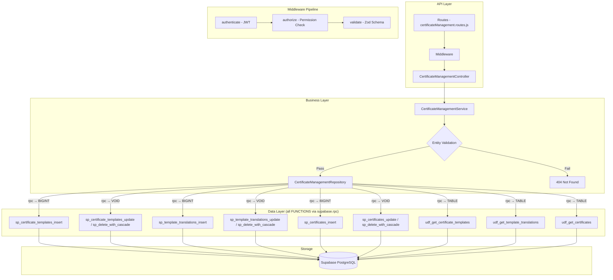

# GrowUpMore API — Certificate Management Module

## Postman Testing Guide

**Base URL:** `http://localhost:5001`
**API Prefix:** `/api/v1/certificate-management`
**Content-Type:** `application/json`
**Authentication:** All endpoints require `Bearer <access_token>` in Authorization header

---

## Architecture Flow



---

## Prerequisites

Before testing, ensure:

1. **Authentication**: Login via `POST /api/v1/auth/login` to obtain `access_token`
2. **Permissions**: Run `phase24_certificate_management_permissions_seed.sql` in Supabase SQL Editor
3. **Master Data**: Students, Courses, and Enrollments exist (from earlier phases)
4. **Parent Records**:
   - Certificate Templates must be created before creating Certificates
   - Template Translations require valid Certificate Templates
   - Certificates require valid Students, Courses, and Enrollments

---

## Complete Endpoint Reference

### Test Order (follow this sequence in Postman)

| # | Endpoint | Permission | Purpose |
|---|----------|-----------|---------|
| 1 | `GET /certificate-templates` | `certificate_template.read` | List all certificate templates |
| 2 | `POST /certificate-templates` | `certificate_template.create` | Create a new certificate template |
| 3 | `GET /certificate-templates/:id` | `certificate_template.read` | Get template by ID |
| 4 | `PATCH /certificate-templates/:id` | `certificate_template.update` | Update template details |
| 5 | `POST /certificate-templates/:id/translations` | `certificate_template_translation.create` | Create template translation |
| 6 | `PATCH /template-translations/:id` | `certificate_template_translation.update` | Update translation |
| 7 | `DELETE /template-translations/:id` | `certificate_template_translation.delete` | Delete translation |
| 8 | `POST /template-translations/:id/restore` | `certificate_template_translation.update` | Restore translation |
| 9 | `DELETE /certificate-templates/:id` | `certificate_template.delete` | Soft delete template and translations |
| 10 | `POST /certificate-templates/:id/restore` | `certificate_template.update` | Restore template and translations |
| 11 | `GET /certificates` | `certificate.read` | List all certificates |
| 12 | `POST /certificates` | `certificate.create` | Create a new certificate |
| 13 | `GET /certificates/:id` | `certificate.read` | Get certificate by ID |
| 14 | `PATCH /certificates/:id` | `certificate.update` | Update certificate details |
| 15 | `DELETE /certificates/:id` | `certificate.delete` | Soft delete certificate |
| 16 | `POST /certificates/:id/restore` | `certificate.update` | Restore certificate |
| 17 | `POST /certificates/bulk-delete` | `certificate.delete` | Bulk delete certificates |
| 18 | `POST /certificates/bulk-restore` | `certificate.update` | Bulk restore certificates |

---

## Common Headers (All Requests)

| Key | Value |
|-----|-------|
| Authorization | Bearer `<access_token>` |
| Content-Type | `application/json` |

---

## 1. CERTIFICATE TEMPLATES

### 1.1 List Certificate Templates

**`GET /api/v1/certificate-management/certificate-templates`**

**Permission:** `certificate_template.read`

**Headers:**
```
Authorization: Bearer {{access_token}}
Content-Type: application/json
```

**Query Parameters:**

| Parameter | Type | Description |
|-----------|------|-------------|
| certificateTemplateId | integer | Filter by template ID |
| languageId | integer | Filter by language ID |
| templateType | string | Filter by type: `completion`, `excellence`, `participation` |
| isDefault | boolean | Filter by default template flag |
| isActive | boolean | Filter by active status |
| searchTerm | string | Search in code and other fields |
| sortTable | string | Not actively used, for frontend compatibility |
| sortBy | string | Sort field (default: `code`) |
| sortDir | string | Sort direction: `ASC` or `DESC` (default: ASC) |
| page | integer | Page number (default: 1) |
| limit | integer | Results per page (default: 20, max: 100) |

**Example:**
```
GET /api/v1/certificate-management/certificate-templates?page=1&limit=10&templateType=completion&isActive=true&sortBy=code&sortDir=ASC
```

**Expected Response (200):**
```json
{
  "success": true,
  "message": "Certificate templates retrieved successfully",
  "data": [
    {
      "id": 1001,
      "code": "CERT_COMPLETION_BASIC",
      "templateType": "completion",
      "templateFileUrl": "https://storage.example.com/templates/completion-basic.pdf",
      "isDefault": true,
      "isActive": true,
      "createdAt": "2026-04-01T08:00:00Z",
      "updatedAt": "2026-04-01T08:00:00Z"
    },
    {
      "id": 1002,
      "code": "CERT_EXCELLENCE_HONOR",
      "templateType": "excellence",
      "templateFileUrl": "https://storage.example.com/templates/excellence-honor.pdf",
      "isDefault": false,
      "isActive": true,
      "createdAt": "2026-04-02T08:00:00Z",
      "updatedAt": "2026-04-02T08:00:00Z"
    },
    {
      "id": 1003,
      "code": "CERT_PARTICIPATION_AWARD",
      "templateType": "participation",
      "templateFileUrl": "https://storage.example.com/templates/participation-award.pdf",
      "isDefault": false,
      "isActive": true,
      "createdAt": "2026-04-03T08:00:00Z",
      "updatedAt": "2026-04-03T08:00:00Z"
    }
  ],
  "pagination": {
    "page": 1,
    "limit": 10,
    "total": 3,
    "pages": 1
  }
}
```

**Postman Tests:**
```javascript
pm.test("Status is 200", () => pm.response.to.have.status(200));
const json = pm.response.json();
pm.test("Response has data array", () => pm.expect(json.data).to.be.an("array"));
pm.test("Pagination info exists", () => pm.expect(json.pagination).to.exist);
if (json.data.length > 0) {
  pm.collectionVariables.set("certificateTemplateId", json.data[0].id);
}
```

---

### 1.2 Create Certificate Template

**`POST /api/v1/certificate-management/certificate-templates`**

**Permission:** `certificate_template.create`

**Headers:**
```
Authorization: Bearer {{access_token}}
Content-Type: application/json
```

**Request Body:**

| Field | Type | Required | Description |
|-------|------|----------|-------------|
| code | string | Yes | Unique template code (e.g., CERT_COMPLETION_BASIC) |
| templateType | string | No | Type: `completion`, `excellence`, `participation` (default: completion) |
| templateFileUrl | string | No | URL to the PDF template file |
| isDefault | boolean | No | Whether this is the default template (default: false) |
| isActive | boolean | No | Whether the template is active (default: true) |

**Example Request:**
```json
{
  "code": "CERT_COMPLETION_BASIC",
  "templateType": "completion",
  "templateFileUrl": "https://storage.example.com/templates/completion-basic.pdf",
  "isDefault": true,
  "isActive": true
}
```

**Expected Response (201):**
```json
{
  "success": true,
  "message": "Certificate template created successfully",
  "data": {
    "id": 1001,
    "code": "CERT_COMPLETION_BASIC",
    "templateType": "completion",
    "templateFileUrl": "https://storage.example.com/templates/completion-basic.pdf",
    "isDefault": true,
    "isActive": true,
    "createdAt": "2026-04-06T09:00:00Z",
    "updatedAt": "2026-04-06T09:00:00Z"
  }
}
```

**Postman Tests:**
```javascript
pm.test("Status is 201", () => pm.response.to.have.status(201));
const json = pm.response.json();
pm.test("Has template ID", () => pm.expect(json.data.id).to.be.a("number"));
pm.test("Template code matches request", () => pm.expect(json.data.code).to.equal("CERT_COMPLETION_BASIC"));
pm.test("Template type matches request", () => pm.expect(json.data.templateType).to.equal("completion"));
pm.collectionVariables.set("certificateTemplateId", json.data.id);
```

---

### 1.3 Get Certificate Template by ID

**`GET /api/v1/certificate-management/certificate-templates/:id`**

**Permission:** `certificate_template.read`

**Headers:**
```
Authorization: Bearer {{access_token}}
Content-Type: application/json
```

**Example:** `GET /api/v1/certificate-management/certificate-templates/{{certificateTemplateId}}`

**Expected Response (200):**
```json
{
  "success": true,
  "message": "Certificate template retrieved successfully",
  "data": {
    "id": 1001,
    "code": "CERT_COMPLETION_BASIC",
    "templateType": "completion",
    "templateFileUrl": "https://storage.example.com/templates/completion-basic.pdf",
    "isDefault": true,
    "isActive": true,
    "createdAt": "2026-04-06T09:00:00Z",
    "updatedAt": "2026-04-06T09:00:00Z"
  }
}
```

**Postman Tests:**
```javascript
pm.test("Status is 200", () => pm.response.to.have.status(200));
const json = pm.response.json();
pm.test("Template ID matches request", () => pm.expect(json.data.id).to.be.a("number"));
pm.test("Has template details", () => pm.expect(json.data.code).to.exist);
```

---

### 1.4 Update Certificate Template

**`PATCH /api/v1/certificate-management/certificate-templates/:id`**

**Permission:** `certificate_template.update`

**Headers:**
```
Authorization: Bearer {{access_token}}
Content-Type: application/json
```

**Example:** `PATCH /api/v1/certificate-management/certificate-templates/{{certificateTemplateId}}`

**Request Body:**

| Field | Type | Required | Description |
|-------|------|----------|-------------|
| code | string | No | Updated template code |
| templateType | string | No | Updated type: `completion`, `excellence`, `participation` |
| templateFileUrl | string | No | Updated template file URL |
| isDefault | boolean | No | Updated default flag |
| isActive | boolean | No | Updated active status |

**Example Request:**
```json
{
  "templateFileUrl": "https://storage.example.com/templates/completion-basic-v2.pdf",
  "isDefault": false
}
```

**Expected Response (200):**
```json
{
  "success": true,
  "message": "Certificate template updated successfully",
  "data": {
    "id": 1001,
    "code": "CERT_COMPLETION_BASIC",
    "templateType": "completion",
    "templateFileUrl": "https://storage.example.com/templates/completion-basic-v2.pdf",
    "isDefault": false,
    "isActive": true,
    "createdAt": "2026-04-06T09:00:00Z",
    "updatedAt": "2026-04-06T10:30:00Z"
  }
}
```

**Postman Tests:**
```javascript
pm.test("Status is 200", () => pm.response.to.have.status(200));
const json = pm.response.json();
pm.test("Template file URL updated", () => pm.expect(json.data.templateFileUrl).to.include("v2"));
pm.test("isDefault flag updated", () => pm.expect(json.data.isDefault).to.equal(false));
pm.test("UpdatedAt timestamp changed", () => pm.expect(json.data.updatedAt).to.exist);
```

---

## 2. TEMPLATE TRANSLATIONS

### 2.1 Create Template Translation

**`POST /api/v1/certificate-management/certificate-templates/:templateId/translations`**

**Permission:** `certificate_template_translation.create`

**Headers:**
```
Authorization: Bearer {{access_token}}
Content-Type: application/json
```

**Example:** `POST /api/v1/certificate-management/certificate-templates/{{certificateTemplateId}}/translations`

**Request Body:**

| Field | Type | Required | Description |
|-------|------|----------|-------------|
| certificateTemplateId | integer | Yes | ID of the certificate template |
| languageId | integer | Yes | ID of the language |
| title | string | Yes | Translated certificate title (max 255 chars) |
| description | string | No | Translated description (max 1000 chars) |
| congratulationsText | string | No | Translated congratulations text (max 500 chars) |
| footerText | string | No | Translated footer text (max 500 chars) |
| isActive | boolean | No | Whether translation is active (default: true) |

**Example Request:**
```json
{
  "certificateTemplateId": 1001,
  "languageId": 1,
  "title": "Certificate of Completion",
  "description": "This certificate is awarded to recognize successful completion of the course.",
  "congratulationsText": "Congratulations on completing this course!",
  "footerText": "Valid from April 6, 2026",
  "isActive": true
}
```

**Expected Response (201):**
```json
{
  "success": true,
  "message": "Template translation created successfully",
  "data": {
    "id": 2001,
    "certificateTemplateId": 1001,
    "languageId": 1,
    "title": "Certificate of Completion",
    "description": "This certificate is awarded to recognize successful completion of the course.",
    "congratulationsText": "Congratulations on completing this course!",
    "footerText": "Valid from April 6, 2026",
    "isActive": true,
    "createdAt": "2026-04-06T10:00:00Z",
    "updatedAt": "2026-04-06T10:00:00Z"
  }
}
```

**Postman Tests:**
```javascript
pm.test("Status is 201", () => pm.response.to.have.status(201));
const json = pm.response.json();
pm.test("Has translation ID", () => pm.expect(json.data.id).to.be.a("number"));
pm.test("Title matches request", () => pm.expect(json.data.title).to.equal("Certificate of Completion"));
pm.test("LanguageId matches request", () => pm.expect(json.data.languageId).to.equal(1));
pm.collectionVariables.set("templateTranslationId", json.data.id);
```

---

### 2.2 Update Template Translation

**`PATCH /api/v1/certificate-management/template-translations/:id`**

**Permission:** `certificate_template_translation.update`

**Headers:**
```
Authorization: Bearer {{access_token}}
Content-Type: application/json
```

**Example:** `PATCH /api/v1/certificate-management/template-translations/{{templateTranslationId}}`

**Request Body:**

| Field | Type | Required | Description |
|-------|------|----------|-------------|
| title | string | No | Updated title (max 255 chars) |
| description | string | No | Updated description (max 1000 chars) |
| congratulationsText | string | No | Updated congratulations text (max 500 chars) |
| footerText | string | No | Updated footer text (max 500 chars) |
| isActive | boolean | No | Updated active status |

**Example Request:**
```json
{
  "congratulationsText": "Congratulations on successfully completing this amazing course!",
  "footerText": "Valid from April 6, 2026 onwards"
}
```

**Expected Response (200):**
```json
{
  "success": true,
  "message": "Template translation updated successfully",
  "data": {
    "id": 2001,
    "certificateTemplateId": 1001,
    "languageId": 1,
    "title": "Certificate of Completion",
    "description": "This certificate is awarded to recognize successful completion of the course.",
    "congratulationsText": "Congratulations on successfully completing this amazing course!",
    "footerText": "Valid from April 6, 2026 onwards",
    "isActive": true,
    "createdAt": "2026-04-06T10:00:00Z",
    "updatedAt": "2026-04-06T11:00:00Z"
  }
}
```

**Postman Tests:**
```javascript
pm.test("Status is 200", () => pm.response.to.have.status(200));
const json = pm.response.json();
pm.test("Congratulations text updated", () => pm.expect(json.data.congratulationsText).to.include("amazing"));
pm.test("Footer text updated", () => pm.expect(json.data.footerText).to.include("onwards"));
```

---

### 2.3 Delete Template Translation

**`DELETE /api/v1/certificate-management/template-translations/:id`**

**Permission:** `certificate_template_translation.delete`

**Headers:**
```
Authorization: Bearer {{access_token}}
```

**Example:** `DELETE /api/v1/certificate-management/template-translations/{{templateTranslationId}}`

**Expected Response (200):**
```json
{
  "success": true,
  "message": "Template translation deleted successfully",
  "data": {
    "id": 2001,
    "deletedAt": "2026-04-06T12:00:00Z"
  }
}
```

**Postman Tests:**
```javascript
pm.test("Status is 200", () => pm.response.to.have.status(200));
const json = pm.response.json();
pm.test("Has deleted ID", () => pm.expect(json.data.id).to.be.a("number"));
pm.test("Has deletedAt timestamp", () => pm.expect(json.data.deletedAt).to.exist);
```

---

### 2.4 Restore Template Translation

**`POST /api/v1/certificate-management/template-translations/:id/restore`**

**Permission:** `certificate_template_translation.update`

**Headers:**
```
Authorization: Bearer {{access_token}}
Content-Type: application/json
```

**Example:** `POST /api/v1/certificate-management/template-translations/{{templateTranslationId}}/restore`

**Request Body:**
```json
{}
```

**Expected Response (200):**
```json
{
  "success": true,
  "message": "Template translation restored successfully",
  "data": {
    "id": 2001,
    "certificateTemplateId": 1001,
    "languageId": 1,
    "title": "Certificate of Completion",
    "description": "This certificate is awarded to recognize successful completion of the course.",
    "congratulationsText": "Congratulations on successfully completing this amazing course!",
    "footerText": "Valid from April 6, 2026 onwards",
    "isActive": true,
    "createdAt": "2026-04-06T10:00:00Z",
    "updatedAt": "2026-04-06T11:00:00Z",
    "restoredAt": "2026-04-06T12:15:00Z"
  }
}
```

**Postman Tests:**
```javascript
pm.test("Status is 200", () => pm.response.to.have.status(200));
const json = pm.response.json();
pm.test("Translation restored with restoredAt", () => pm.expect(json.data.restoredAt).to.exist);
pm.test("Data integrity maintained", () => pm.expect(json.data.id).to.be.a("number"));
```

---

### 2.5 Delete Certificate Template (Cascades to Translations)

**`DELETE /api/v1/certificate-management/certificate-templates/:id`**

**Permission:** `certificate_template.delete`

**Headers:**
```
Authorization: Bearer {{access_token}}
```

**Example:** `DELETE /api/v1/certificate-management/certificate-templates/{{certificateTemplateId}}`

**Expected Response (200):**
```json
{
  "success": true,
  "message": "Certificate template deleted successfully",
  "data": {
    "id": 1001,
    "deletedAt": "2026-04-06T12:30:00Z",
    "translationsDeleted": 1
  }
}
```

**Postman Tests:**
```javascript
pm.test("Status is 200", () => pm.response.to.have.status(200));
const json = pm.response.json();
pm.test("Has deleted template ID", () => pm.expect(json.data.id).to.be.a("number"));
pm.test("Has cascading deletion count", () => pm.expect(json.data.translationsDeleted).to.exist);
```

---

### 2.6 Restore Certificate Template

**`POST /api/v1/certificate-management/certificate-templates/:id/restore`**

**Permission:** `certificate_template.update`

**Headers:**
```
Authorization: Bearer {{access_token}}
Content-Type: application/json
```

**Example:** `POST /api/v1/certificate-management/certificate-templates/{{certificateTemplateId}}/restore`

**Request Body:**
```json
{}
```

**Expected Response (200):**
```json
{
  "success": true,
  "message": "Certificate template restored successfully",
  "data": {
    "id": 1001,
    "code": "CERT_COMPLETION_BASIC",
    "templateType": "completion",
    "templateFileUrl": "https://storage.example.com/templates/completion-basic-v2.pdf",
    "isDefault": false,
    "isActive": true,
    "createdAt": "2026-04-06T09:00:00Z",
    "updatedAt": "2026-04-06T10:30:00Z",
    "restoredAt": "2026-04-06T12:45:00Z",
    "translationsRestored": 1
  }
}
```

**Postman Tests:**
```javascript
pm.test("Status is 200", () => pm.response.to.have.status(200));
const json = pm.response.json();
pm.test("Template restored with restoredAt", () => pm.expect(json.data.restoredAt).to.exist);
pm.test("Cascading restoration count exists", () => pm.expect(json.data.translationsRestored).to.exist);
```

---

## 3. CERTIFICATES

### 3.1 List Certificates

**`GET /api/v1/certificate-management/certificates`**

**Permission:** `certificate.read`

**Headers:**
```
Authorization: Bearer {{access_token}}
Content-Type: application/json
```

**Query Parameters:**

| Parameter | Type | Description |
|-----------|------|-------------|
| studentId | integer | Filter by student ID |
| courseId | integer | Filter by course ID |
| certificateNumber | string | Filter by certificate number |
| templateId | integer | Filter by template ID |
| isActive | boolean | Filter by active status |
| issuedAfter | string | Filter certificates issued after date (ISO 8601) |
| issuedBefore | string | Filter certificates issued before date (ISO 8601) |
| searchTerm | string | Search in certificate number and snapshots |
| sortBy | string | Sort field (default: `issued_at`) |
| sortDir | string | Sort direction: `ASC` or `DESC` (default: DESC) |
| page | integer | Page number (default: 1) |
| limit | integer | Results per page (default: 20, max: 100) |

**Example:**
```
GET /api/v1/certificate-management/certificates?page=1&limit=10&courseId=5001&isActive=true&sortBy=issued_at&sortDir=DESC
```

**Expected Response (200):**
```json
{
  "success": true,
  "message": "Certificates retrieved successfully",
  "data": [
    {
      "id": 3001,
      "studentId": 1001,
      "courseId": 5001,
      "enrollmentId": 8001,
      "certificateTemplateId": 1001,
      "certificateNumber": "CERT-2026-000001",
      "studentNameSnapshot": "John Doe",
      "courseTitleSnapshot": "Advanced JavaScript Programming",
      "verificationUrl": "https://certificates.example.com/verify/CERT-2026-000001",
      "pdfUrl": "https://storage.example.com/certificates/CERT-2026-000001.pdf",
      "issuedAt": "2026-04-06T09:30:00Z",
      "isActive": true,
      "createdAt": "2026-04-06T09:30:00Z",
      "updatedAt": "2026-04-06T09:30:00Z"
    },
    {
      "id": 3002,
      "studentId": 1002,
      "courseId": 5001,
      "enrollmentId": 8002,
      "certificateTemplateId": 1001,
      "certificateNumber": "CERT-2026-000002",
      "studentNameSnapshot": "Jane Smith",
      "courseTitleSnapshot": "Advanced JavaScript Programming",
      "verificationUrl": "https://certificates.example.com/verify/CERT-2026-000002",
      "pdfUrl": "https://storage.example.com/certificates/CERT-2026-000002.pdf",
      "issuedAt": "2026-04-06T10:15:00Z",
      "isActive": true,
      "createdAt": "2026-04-06T10:15:00Z",
      "updatedAt": "2026-04-06T10:15:00Z"
    }
  ],
  "pagination": {
    "page": 1,
    "limit": 10,
    "total": 2,
    "pages": 1
  }
}
```

**Postman Tests:**
```javascript
pm.test("Status is 200", () => pm.response.to.have.status(200));
const json = pm.response.json();
pm.test("Response has data array", () => pm.expect(json.data).to.be.an("array"));
pm.test("Pagination info exists", () => pm.expect(json.pagination).to.exist);
if (json.data.length > 0) {
  pm.collectionVariables.set("certificateId", json.data[0].id);
}
```

---

### 3.2 Create Certificate

**`POST /api/v1/certificate-management/certificates`**

**Permission:** `certificate.create`

**Headers:**
```
Authorization: Bearer {{access_token}}
Content-Type: application/json
```

**Request Body:**

| Field | Type | Required | Description |
|-------|------|----------|-------------|
| studentId | integer | Yes | ID of the student |
| courseId | integer | Yes | ID of the course |
| enrollmentId | integer | Yes | ID of the enrollment |
| certificateTemplateId | integer | Yes | ID of the certificate template |
| certificateNumber | string | No | Unique certificate number (auto-generated if not provided) |
| studentNameSnapshot | string | No | Student name snapshot (auto-populated if not provided) |
| courseTitleSnapshot | string | No | Course title snapshot (auto-populated if not provided) |
| verificationUrl | string | No | URL for verification |
| pdfUrl | string | No | URL to the generated PDF |
| issuedAt | string | No | ISO 8601 timestamp of issuance (default: current time) |

**Example Request:**
```json
{
  "studentId": 1001,
  "courseId": 5001,
  "enrollmentId": 8001,
  "certificateTemplateId": 1001,
  "certificateNumber": "CERT-2026-000001",
  "studentNameSnapshot": "John Doe",
  "courseTitleSnapshot": "Advanced JavaScript Programming",
  "verificationUrl": "https://certificates.example.com/verify/CERT-2026-000001",
  "pdfUrl": "https://storage.example.com/certificates/CERT-2026-000001.pdf",
  "issuedAt": "2026-04-06T09:30:00Z"
}
```

**Expected Response (201):**
```json
{
  "success": true,
  "message": "Certificate created successfully",
  "data": {
    "id": 3001,
    "studentId": 1001,
    "courseId": 5001,
    "enrollmentId": 8001,
    "certificateTemplateId": 1001,
    "certificateNumber": "CERT-2026-000001",
    "studentNameSnapshot": "John Doe",
    "courseTitleSnapshot": "Advanced JavaScript Programming",
    "verificationUrl": "https://certificates.example.com/verify/CERT-2026-000001",
    "pdfUrl": "https://storage.example.com/certificates/CERT-2026-000001.pdf",
    "issuedAt": "2026-04-06T09:30:00Z",
    "isActive": true,
    "createdAt": "2026-04-06T09:30:00Z",
    "updatedAt": "2026-04-06T09:30:00Z"
  }
}
```

**Postman Tests:**
```javascript
pm.test("Status is 201", () => pm.response.to.have.status(201));
const json = pm.response.json();
pm.test("Has certificate ID", () => pm.expect(json.data.id).to.be.a("number"));
pm.test("Certificate number matches request", () => pm.expect(json.data.certificateNumber).to.equal("CERT-2026-000001"));
pm.test("Student name snapshot matches", () => pm.expect(json.data.studentNameSnapshot).to.equal("John Doe"));
pm.collectionVariables.set("certificateId", json.data.id);
```

---

### 3.3 Get Certificate by ID

**`GET /api/v1/certificate-management/certificates/:id`**

**Permission:** `certificate.read`

**Headers:**
```
Authorization: Bearer {{access_token}}
Content-Type: application/json
```

**Example:** `GET /api/v1/certificate-management/certificates/{{certificateId}}`

**Expected Response (200):**
```json
{
  "success": true,
  "message": "Certificate retrieved successfully",
  "data": {
    "id": 3001,
    "studentId": 1001,
    "courseId": 5001,
    "enrollmentId": 8001,
    "certificateTemplateId": 1001,
    "certificateNumber": "CERT-2026-000001",
    "studentNameSnapshot": "John Doe",
    "courseTitleSnapshot": "Advanced JavaScript Programming",
    "verificationUrl": "https://certificates.example.com/verify/CERT-2026-000001",
    "pdfUrl": "https://storage.example.com/certificates/CERT-2026-000001.pdf",
    "issuedAt": "2026-04-06T09:30:00Z",
    "isActive": true,
    "createdAt": "2026-04-06T09:30:00Z",
    "updatedAt": "2026-04-06T09:30:00Z"
  }
}
```

**Postman Tests:**
```javascript
pm.test("Status is 200", () => pm.response.to.have.status(200));
const json = pm.response.json();
pm.test("Certificate ID matches request", () => pm.expect(json.data.id).to.be.a("number"));
pm.test("Has certificate details", () => pm.expect(json.data.certificateNumber).to.exist);
```

---

### 3.4 Update Certificate

**`PATCH /api/v1/certificate-management/certificates/:id`**

**Permission:** `certificate.update`

**Headers:**
```
Authorization: Bearer {{access_token}}
Content-Type: application/json
```

**Example:** `PATCH /api/v1/certificate-management/certificates/{{certificateId}}`

**Request Body:**

| Field | Type | Required | Description |
|-------|------|----------|-------------|
| verificationUrl | string | No | Updated verification URL |
| pdfUrl | string | No | Updated PDF URL |
| issuedAt | string | No | Updated issuance timestamp (ISO 8601) |
| isActive | boolean | No | Updated active status |

**Example Request:**
```json
{
  "pdfUrl": "https://storage.example.com/certificates/CERT-2026-000001-final.pdf",
  "issuedAt": "2026-04-06T09:45:00Z"
}
```

**Expected Response (200):**
```json
{
  "success": true,
  "message": "Certificate updated successfully",
  "data": {
    "id": 3001,
    "studentId": 1001,
    "courseId": 5001,
    "enrollmentId": 8001,
    "certificateTemplateId": 1001,
    "certificateNumber": "CERT-2026-000001",
    "studentNameSnapshot": "John Doe",
    "courseTitleSnapshot": "Advanced JavaScript Programming",
    "verificationUrl": "https://certificates.example.com/verify/CERT-2026-000001",
    "pdfUrl": "https://storage.example.com/certificates/CERT-2026-000001-final.pdf",
    "issuedAt": "2026-04-06T09:45:00Z",
    "isActive": true,
    "createdAt": "2026-04-06T09:30:00Z",
    "updatedAt": "2026-04-06T11:00:00Z"
  }
}
```

**Postman Tests:**
```javascript
pm.test("Status is 200", () => pm.response.to.have.status(200));
const json = pm.response.json();
pm.test("PDF URL updated", () => pm.expect(json.data.pdfUrl).to.include("final"));
pm.test("Issued at timestamp updated", () => pm.expect(json.data.issuedAt).to.equal("2026-04-06T09:45:00Z"));
pm.test("UpdatedAt timestamp changed", () => pm.expect(json.data.updatedAt).to.exist);
```

---

### 3.5 Delete Certificate

**`DELETE /api/v1/certificate-management/certificates/:id`**

**Permission:** `certificate.delete`

**Headers:**
```
Authorization: Bearer {{access_token}}
```

**Example:** `DELETE /api/v1/certificate-management/certificates/{{certificateId}}`

**Expected Response (200):**
```json
{
  "success": true,
  "message": "Certificate deleted successfully",
  "data": {
    "id": 3001,
    "deletedAt": "2026-04-06T12:00:00Z"
  }
}
```

**Postman Tests:**
```javascript
pm.test("Status is 200", () => pm.response.to.have.status(200));
const json = pm.response.json();
pm.test("Has deleted ID", () => pm.expect(json.data.id).to.be.a("number"));
pm.test("Has deletedAt timestamp", () => pm.expect(json.data.deletedAt).to.exist);
```

---

### 3.6 Restore Certificate

**`POST /api/v1/certificate-management/certificates/:id/restore`**

**Permission:** `certificate.update`

**Headers:**
```
Authorization: Bearer {{access_token}}
Content-Type: application/json
```

**Example:** `POST /api/v1/certificate-management/certificates/{{certificateId}}/restore`

**Request Body:**
```json
{}
```

**Expected Response (200):**
```json
{
  "success": true,
  "message": "Certificate restored successfully",
  "data": {
    "id": 3001,
    "studentId": 1001,
    "courseId": 5001,
    "enrollmentId": 8001,
    "certificateTemplateId": 1001,
    "certificateNumber": "CERT-2026-000001",
    "studentNameSnapshot": "John Doe",
    "courseTitleSnapshot": "Advanced JavaScript Programming",
    "verificationUrl": "https://certificates.example.com/verify/CERT-2026-000001",
    "pdfUrl": "https://storage.example.com/certificates/CERT-2026-000001-final.pdf",
    "issuedAt": "2026-04-06T09:45:00Z",
    "isActive": true,
    "createdAt": "2026-04-06T09:30:00Z",
    "updatedAt": "2026-04-06T11:00:00Z",
    "restoredAt": "2026-04-06T12:15:00Z"
  }
}
```

**Postman Tests:**
```javascript
pm.test("Status is 200", () => pm.response.to.have.status(200));
const json = pm.response.json();
pm.test("Certificate restored with restoredAt", () => pm.expect(json.data.restoredAt).to.exist);
pm.test("Data integrity maintained", () => pm.expect(json.data.id).to.be.a("number"));
```

---

### 3.7 Bulk Delete Certificates

**`POST /api/v1/certificate-management/certificates/bulk-delete`**

**Permission:** `certificate.delete`

**Headers:**
```
Authorization: Bearer {{access_token}}
Content-Type: application/json
```

**Request Body:**

| Field | Type | Required | Description |
|-------|------|----------|-------------|
| ids | array | Yes | Array of certificate IDs to delete |

**Example Request:**
```json
{
  "ids": [3001, 3002, 3005, 3007]
}
```

**Expected Response (200):**
```json
{
  "success": true,
  "message": "Certificates deleted successfully",
  "data": {
    "deletedCount": 4,
    "deletedIds": [3001, 3002, 3005, 3007],
    "deletedAt": "2026-04-06T12:30:00Z"
  }
}
```

**Postman Tests:**
```javascript
pm.test("Status is 200", () => pm.response.to.have.status(200));
const json = pm.response.json();
pm.test("Deleted count matches request", () => pm.expect(json.data.deletedCount).to.equal(4));
pm.test("Deleted IDs array matches request", () => {
  pm.expect(json.data.deletedIds).to.be.an("array");
  pm.expect(json.data.deletedIds).to.have.lengthOf(4);
});
```

---

### 3.8 Bulk Restore Certificates

**`POST /api/v1/certificate-management/certificates/bulk-restore`**

**Permission:** `certificate.update`

**Headers:**
```
Authorization: Bearer {{access_token}}
Content-Type: application/json
```

**Request Body:**

| Field | Type | Required | Description |
|-------|------|----------|-------------|
| ids | array | Yes | Array of certificate IDs to restore |

**Example Request:**
```json
{
  "ids": [3001, 3002, 3005, 3007]
}
```

**Expected Response (200):**
```json
{
  "success": true,
  "message": "Certificates restored successfully",
  "data": {
    "restoredCount": 4,
    "restoredIds": [3001, 3002, 3005, 3007],
    "restoredAt": "2026-04-06T12:45:00Z"
  }
}
```

**Postman Tests:**
```javascript
pm.test("Status is 200", () => pm.response.to.have.status(200));
const json = pm.response.json();
pm.test("Restored count matches request", () => pm.expect(json.data.restoredCount).to.equal(4));
pm.test("Restored IDs array matches request", () => {
  pm.expect(json.data.restoredIds).to.be.an("array");
  pm.expect(json.data.restoredIds).to.have.lengthOf(4);
});
```

---

## Advanced Use Cases

### Issue Certificates for Course Completion

**`POST /api/v1/certificate-management/certificates`** (bulk operation with multiple POST requests)

This workflow issues completion certificates to all students who have completed a course.

**Sequence:**
1. Get certificate template for course completions
2. Create certificate for each student who completed the course
3. Generate PDF for each certificate

**Example Requests:**
```json
[
  {
    "studentId": 1001,
    "courseId": 5001,
    "enrollmentId": 8001,
    "certificateTemplateId": 1001,
    "certificateNumber": "CERT-2026-000001",
    "studentNameSnapshot": "John Doe",
    "courseTitleSnapshot": "Advanced JavaScript Programming"
  },
  {
    "studentId": 1002,
    "courseId": 5001,
    "enrollmentId": 8002,
    "certificateTemplateId": 1001,
    "certificateNumber": "CERT-2026-000002",
    "studentNameSnapshot": "Jane Smith",
    "courseTitleSnapshot": "Advanced JavaScript Programming"
  }
]
```

### Get Certificates Issued in Date Range

**`GET /api/v1/certificate-management/certificates?issuedAfter=2026-04-01T00:00:00Z&issuedBefore=2026-04-06T23:59:59Z&sortBy=issued_at&sortDir=DESC`**

This query returns all certificates issued within a specific date range.

**Expected Response (200):**
```json
{
  "success": true,
  "message": "Certificates retrieved successfully",
  "data": [
    {
      "id": 3002,
      "studentId": 1002,
      "courseId": 5001,
      "enrollmentId": 8002,
      "certificateTemplateId": 1001,
      "certificateNumber": "CERT-2026-000002",
      "studentNameSnapshot": "Jane Smith",
      "courseTitleSnapshot": "Advanced JavaScript Programming",
      "verificationUrl": "https://certificates.example.com/verify/CERT-2026-000002",
      "pdfUrl": "https://storage.example.com/certificates/CERT-2026-000002.pdf",
      "issuedAt": "2026-04-06T10:15:00Z",
      "isActive": true,
      "createdAt": "2026-04-06T10:15:00Z",
      "updatedAt": "2026-04-06T10:15:00Z"
    },
    {
      "id": 3001,
      "studentId": 1001,
      "courseId": 5001,
      "enrollmentId": 8001,
      "certificateTemplateId": 1001,
      "certificateNumber": "CERT-2026-000001",
      "studentNameSnapshot": "John Doe",
      "courseTitleSnapshot": "Advanced JavaScript Programming",
      "verificationUrl": "https://certificates.example.com/verify/CERT-2026-000001",
      "pdfUrl": "https://storage.example.com/certificates/CERT-2026-000001-final.pdf",
      "issuedAt": "2026-04-06T09:45:00Z",
      "isActive": true,
      "createdAt": "2026-04-06T09:30:00Z",
      "updatedAt": "2026-04-06T11:00:00Z"
    }
  ],
  "pagination": {
    "page": 1,
    "limit": 20,
    "total": 2,
    "pages": 1
  }
}
```

### Get Student's Certificates

**`GET /api/v1/certificate-management/certificates?studentId=1001&isActive=true&sortBy=issued_at&sortDir=DESC`**

This query returns all certificates earned by a specific student.

**Expected Response (200):**
```json
{
  "success": true,
  "message": "Certificates retrieved successfully",
  "data": [
    {
      "id": 3001,
      "studentId": 1001,
      "courseId": 5001,
      "enrollmentId": 8001,
      "certificateTemplateId": 1001,
      "certificateNumber": "CERT-2026-000001",
      "studentNameSnapshot": "John Doe",
      "courseTitleSnapshot": "Advanced JavaScript Programming",
      "verificationUrl": "https://certificates.example.com/verify/CERT-2026-000001",
      "pdfUrl": "https://storage.example.com/certificates/CERT-2026-000001-final.pdf",
      "issuedAt": "2026-04-06T09:45:00Z",
      "isActive": true,
      "createdAt": "2026-04-06T09:30:00Z",
      "updatedAt": "2026-04-06T11:00:00Z"
    },
    {
      "id": 3003,
      "studentId": 1001,
      "courseId": 5002,
      "enrollmentId": 8003,
      "certificateTemplateId": 1002,
      "certificateNumber": "CERT-2026-000005",
      "studentNameSnapshot": "John Doe",
      "courseTitleSnapshot": "Python for Data Science",
      "verificationUrl": "https://certificates.example.com/verify/CERT-2026-000005",
      "pdfUrl": "https://storage.example.com/certificates/CERT-2026-000005.pdf",
      "issuedAt": "2026-04-05T14:30:00Z",
      "isActive": true,
      "createdAt": "2026-04-05T14:30:00Z",
      "updatedAt": "2026-04-05T14:30:00Z"
    }
  ],
  "pagination": {
    "page": 1,
    "limit": 20,
    "total": 2,
    "pages": 1
  }
}
```

---

## Error Responses

### 400 Bad Request
```json
{
  "success": false,
  "message": "Validation error",
  "errors": [
    {
      "field": "code",
      "message": "Code must be unique and contain only uppercase letters, numbers, and underscores"
    },
    {
      "field": "templateType",
      "message": "Template type must be one of: completion, excellence, participation"
    }
  ]
}
```

### 401 Unauthorized
```json
{
  "success": false,
  "message": "Unauthorized. Invalid or missing access token."
}
```

### 403 Forbidden
```json
{
  "success": false,
  "message": "You do not have permission to perform this action."
}
```

### 404 Not Found
```json
{
  "success": false,
  "message": "Certificate template not found."
}
```

### 409 Conflict
```json
{
  "success": false,
  "message": "A certificate already exists for this enrollment."
}
```

### 500 Internal Server Error
```json
{
  "success": false,
  "message": "An unexpected error occurred. Please try again later."
}
```

---

## Certificate Lifecycle

The certificate management system follows these primary workflows:

```
Template Setup
  ├→ Create Certificate Template
  ├→ Add Translations (multiple languages)
  └→ Activate for use

Certificate Issuance
  ├→ Create Certificate
  ├→ Generate PDF
  ├→ Create Verification URL
  └→ Mark as Active

Certificate Management
  ├→ Update Certificate Details
  ├→ Reissue (update PDF, verification URL)
  ├→ Deactivate (soft delete)
  └→ Restore if needed
```

### Template Status Definitions

| Status | Description |
|--------|-------------|
| **Active** | Template is available for creating new certificates |
| **Inactive** | Template exists but is not available for new certificates |
| **Deleted** | Template has been soft-deleted and is hidden |

### Certificate Status Definitions

| Status | Description |
|--------|-------------|
| **Active** | Certificate is valid and publicly displayable |
| **Inactive** | Certificate exists but is hidden from public view |
| **Deleted** | Certificate has been soft-deleted and is not visible |

---

## Field Definitions

### Certificate Template Fields

| Field | Type | Description | Constraints |
|-------|------|-------------|-------------|
| **id** | integer | Unique template identifier | Auto-generated |
| **code** | string | Unique template code | Required, unique, max 255 chars |
| **templateType** | string | Type of certificate | completion, excellence, participation |
| **templateFileUrl** | string | URL to PDF template | Optional, max 2000 chars |
| **isDefault** | boolean | Whether this is the default template | Default: false |
| **isActive** | boolean | Whether template is active | Default: true |
| **createdAt** | string | ISO 8601 creation timestamp | Auto-generated |
| **updatedAt** | string | ISO 8601 last update timestamp | Auto-generated |
| **restoredAt** | string | ISO 8601 restoration timestamp | Only if restored |

### Template Translation Fields

| Field | Type | Description | Constraints |
|-------|------|-------------|-------------|
| **id** | integer | Unique translation identifier | Auto-generated |
| **certificateTemplateId** | integer | ID of parent template | Required, positive |
| **languageId** | integer | ID of language | Required, positive |
| **title** | string | Translated certificate title | Required, max 255 chars |
| **description** | string | Translated description | Optional, max 1000 chars |
| **congratulationsText** | string | Translated congratulations text | Optional, max 500 chars |
| **footerText** | string | Translated footer text | Optional, max 500 chars |
| **isActive** | boolean | Whether translation is active | Default: true |
| **createdAt** | string | ISO 8601 creation timestamp | Auto-generated |
| **updatedAt** | string | ISO 8601 last update timestamp | Auto-generated |
| **restoredAt** | string | ISO 8601 restoration timestamp | Only if restored |

### Certificate Fields

| Field | Type | Description | Constraints |
|-------|------|-------------|-------------|
| **id** | integer | Unique certificate identifier | Auto-generated |
| **studentId** | integer | ID of the student | Required, positive |
| **courseId** | integer | ID of the course | Required, positive |
| **enrollmentId** | integer | ID of the enrollment | Required, positive |
| **certificateTemplateId** | integer | ID of the template used | Required, positive |
| **certificateNumber** | string | Unique certificate number | Optional, max 255 chars, auto-generated if not provided |
| **studentNameSnapshot** | string | Student name at issuance | Optional, max 500 chars |
| **courseTitleSnapshot** | string | Course title at issuance | Optional, max 500 chars |
| **verificationUrl** | string | URL for certificate verification | Optional, max 2000 chars |
| **pdfUrl** | string | URL to the generated PDF | Optional, max 2000 chars |
| **issuedAt** | string | ISO 8601 issuance timestamp | Optional, defaults to current time |
| **isActive** | boolean | Whether certificate is active | Default: true |
| **createdAt** | string | ISO 8601 creation timestamp | Auto-generated |
| **updatedAt** | string | ISO 8601 last update timestamp | Auto-generated |
| **restoredAt** | string | ISO 8601 restoration timestamp | Only if restored |

---

## Postman Collection Setup

To use these endpoints in Postman:

1. **Create a Collection**: Import the certificate-management endpoints
2. **Set Base Variables**:
   - `base_url`: `http://localhost:5001`
   - `access_token`: Obtained from auth login
3. **Pre-request Scripts**: Add authentication header automatically
4. **Tests**: Use provided test scripts in each endpoint for validation

### Example Pre-request Script (Collection Level)
```javascript
// Automatically add Bearer token to all requests
if (pm.collectionVariables.get("access_token")) {
  pm.request.headers.add({
    key: "Authorization",
    value: `Bearer ${pm.collectionVariables.get("access_token")}`
  });
}
```

### Save Response to Variable
```javascript
// After successful template creation
const json = pm.response.json();
if (json.data && json.data.id) {
  pm.collectionVariables.set("certificateTemplateId", json.data.id);
}
```
