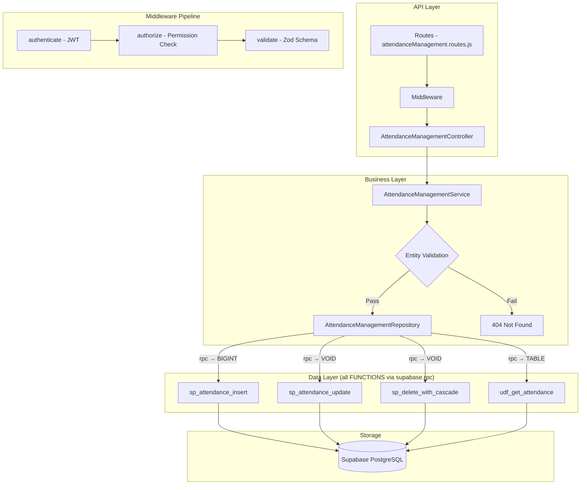

# GrowUpMore API — Attendance Management Module

## Postman Testing Guide

**Base URL:** `http://localhost:5001`
**API Prefix:** `/api/v1/attendance-management`
**Content-Type:** `application/json`
**Authentication:** All endpoints require `Bearer <access_token>` in Authorization header

---

## Architecture Flow



---

## Prerequisites

Before testing, ensure:

1. **Authentication**: Login via `POST /api/v1/auth/login` to obtain `access_token`
2. **Permissions**: Run `phase25_attendance_management_permissions_seed.sql` in Supabase SQL Editor
3. **Master Data**: Students, Batch Sessions, and Webinars exist (from earlier phases)
4. **Parent Records**:
   - Students must be created before creating attendance records
   - Batch Sessions must exist for batch_session attendance type
   - Webinars must exist for webinar attendance type

---

## Complete Endpoint Reference

### Test Order (follow this sequence in Postman)

| # | Endpoint | Permission | Purpose |
|---|----------|-----------|---------|
| 1 | `POST /attendance` | `attendance.create` | Create attendance record |
| 2 | `GET /attendance` | `attendance.read` | List all attendance with filters |
| 3 | `GET /attendance/:id` | `attendance.read` | Get attendance by ID |
| 4 | `PATCH /attendance/:id` | `attendance.update` | Update attendance details |
| 5 | `DELETE /attendance/:id` | `attendance.delete` | Soft delete attendance |
| 6 | `POST /attendance/:id/restore` | `attendance.update` | Restore attendance |
| 7 | `POST /attendance/bulk-delete` | `attendance.delete` | Bulk delete attendance |
| 8 | `POST /attendance/bulk-restore` | `attendance.update` | Bulk restore attendance |

---

## Common Headers (All Requests)

| Key | Value |
|-----|-------|
| Authorization | Bearer `<access_token>` |
| Content-Type | `application/json` |

---

## 1. ATTENDANCES

### 1.1 Create Attendance

**`POST /api/v1/attendance-management/attendance`**

**Permission:** `attendance.create`

**Headers:**
```
Authorization: Bearer {{access_token}}
Content-Type: application/json
```

**Request Body:**

| Field | Type | Required | Description |
|-------|------|----------|-------------|
| studentId | integer | Yes | ID of the student |
| attendanceType | string | Yes | Type: `batch_session` or `webinar` |
| batchSessionId | integer | Conditional | Required if `attendanceType="batch_session"` |
| webinarId | integer | Conditional | Required if `attendanceType="webinar"` |
| status | string | No | Status: `present`, `absent`, `late`, `excused` (default: `present`) |
| joinedAt | timestamp | No | When student joined (ISO 8601) |
| leftAt | timestamp | No | When student left (ISO 8601) |
| durationAttendedSeconds | integer | No | Total attendance duration in seconds |

**Note on polymorphic design:** If `attendanceType="batch_session"`, provide `batchSessionId` and leave `webinarId` null. If `attendanceType="webinar"`, provide `webinarId` and leave `batchSessionId` null.

**Example Request (Batch Session):**
```json
{
  "studentId": 5,
  "attendanceType": "batch_session",
  "batchSessionId": 12,
  "status": "present",
  "joinedAt": "2026-04-06T09:00:00Z",
  "leftAt": "2026-04-06T10:30:00Z",
  "durationAttendedSeconds": 5400
}
```

**Expected Response (201):**
```json
{
  "success": true,
  "message": "Attendance created successfully",
  "data": {
    "id": 87
  }
}
```

**Postman Tests:**
```javascript
pm.test("Status is 201", () => pm.response.to.have.status(201));
const json = pm.response.json();
pm.test("Has attendance ID", () => pm.expect(json.data.id).to.be.a("number"));
pm.collectionVariables.set("attendanceId", json.data.id);
```

---

### 1.2 List Attendance

**`GET /api/v1/attendance-management/attendance`**

**Permission:** `attendance.read`

**Headers:**
```
Authorization: Bearer {{access_token}}
Content-Type: application/json
```

**Query Parameters:**

| Parameter | Type | Description |
|-----------|------|-------------|
| studentId | integer | Filter by student ID |
| attendanceType | string | Filter by type: `batch_session` or `webinar` |
| batchSessionId | integer | Filter by batch session ID |
| webinarId | integer | Filter by webinar ID |
| status | string | Filter by status: `present`, `absent`, `late`, `excused` |
| startDate | string (ISO 8601) | Filter records created from this date |
| endDate | string (ISO 8601) | Filter records created until this date |
| sortBy | string | Sort field (default: `created_at`) |
| sortDir | string | Sort direction: `ASC` or `DESC` (default: ASC) |
| page | integer | Page number (default: 1) |
| limit | integer | Results per page (default: 20, max: 100) |

**Example:**
```
GET /api/v1/attendance-management/attendance?studentId=5&status=present&page=1&limit=10
```

**Expected Response (200):**
```json
{
  "success": true,
  "message": "Attendance records retrieved successfully",
  "data": [
    {
      "id": 87,
      "studentId": 5,
      "attendanceType": "batch_session",
      "batchSessionId": 12,
      "webinarId": null,
      "status": "present",
      "joinedAt": "2026-04-06T09:00:00Z",
      "leftAt": "2026-04-06T10:30:00Z",
      "durationAttendedSeconds": 5400,
      "createdAt": "2026-04-06T14:22:15Z",
      "updatedAt": "2026-04-06T14:22:15Z",
      "deletedAt": null
    },
    {
      "id": 88,
      "studentId": 5,
      "attendanceType": "webinar",
      "batchSessionId": null,
      "webinarId": 8,
      "status": "late",
      "joinedAt": "2026-04-06T15:10:00Z",
      "leftAt": "2026-04-06T16:45:00Z",
      "durationAttendedSeconds": 5100,
      "createdAt": "2026-04-06T14:23:45Z",
      "updatedAt": "2026-04-06T14:23:45Z",
      "deletedAt": null
    }
  ],
  "pagination": {
    "page": 1,
    "limit": 10,
    "total": 2,
    "pages": 1
  }
}
```

**Postman Tests:**
```javascript
pm.test("Status is 200", () => pm.response.to.have.status(200));
const json = pm.response.json();
pm.test("Response has data array", () => pm.expect(json.data).to.be.an("array"));
pm.test("Pagination info exists", () => pm.expect(json.pagination).to.exist);
```

---

### 1.3 Get Attendance by ID

**`GET /api/v1/attendance-management/attendance/:id`**

**Permission:** `attendance.read`

**Headers:**
```
Authorization: Bearer {{access_token}}
Content-Type: application/json
```

**Example:** `GET /api/v1/attendance-management/attendance/{{attendanceId}}`

**Expected Response (200):**
```json
{
  "success": true,
  "message": "Attendance record retrieved successfully",
  "data": {
    "id": 87,
    "studentId": 5,
    "attendanceType": "batch_session",
    "batchSessionId": 12,
    "webinarId": null,
    "status": "present",
    "joinedAt": "2026-04-06T09:00:00Z",
    "leftAt": "2026-04-06T10:30:00Z",
    "durationAttendedSeconds": 5400,
    "createdAt": "2026-04-06T14:22:15Z",
    "updatedAt": "2026-04-06T14:22:15Z",
    "deletedAt": null
  }
}
```

**Postman Tests:**
```javascript
pm.test("Status is 200", () => pm.response.to.have.status(200));
const json = pm.response.json();
pm.test("Attendance ID matches request", () => pm.expect(json.data.id).to.be.a("number"));
```

---

### 1.4 Update Attendance

**`PATCH /api/v1/attendance-management/attendance/:id`**

**Permission:** `attendance.update`

**Headers:**
```
Authorization: Bearer {{access_token}}
Content-Type: application/json
```

**Example:** `PATCH /api/v1/attendance-management/attendance/{{attendanceId}}`

**Request Body:**

| Field | Type | Required | Description |
|-------|------|----------|-------------|
| status | string | No | New status: `present`, `absent`, `late`, `excused` |
| joinedAt | timestamp | No | Updated join time (ISO 8601) |
| leftAt | timestamp | No | Updated leave time (ISO 8601) |
| durationAttendedSeconds | integer | No | Updated duration in seconds |

**Example Request:**
```json
{
  "status": "late",
  "joinedAt": "2026-04-06T09:05:00Z",
  "leftAt": "2026-04-06T10:35:00Z"
}
```

**Expected Response (200):**
```json
{
  "success": true,
  "message": "Attendance updated successfully",
  "data": {
    "id": 87,
    "studentId": 5,
    "attendanceType": "batch_session",
    "batchSessionId": 12,
    "webinarId": null,
    "status": "late",
    "joinedAt": "2026-04-06T09:05:00Z",
    "leftAt": "2026-04-06T10:35:00Z",
    "durationAttendedSeconds": 5400,
    "createdAt": "2026-04-06T14:22:15Z",
    "updatedAt": "2026-04-06T14:26:00Z",
    "deletedAt": null
  }
}
```

**Postman Tests:**
```javascript
pm.test("Status is 200", () => pm.response.to.have.status(200));
const json = pm.response.json();
pm.test("Status updated correctly", () => pm.expect(json.data.status).to.equal("late"));
```

---

### 1.5 Delete Attendance

**`DELETE /api/v1/attendance-management/attendance/:id`**

**Permission:** `attendance.delete`

**Headers:**
```
Authorization: Bearer {{access_token}}
```

**Example:** `DELETE /api/v1/attendance-management/attendance/{{attendanceId}}`

**Expected Response (200):**
```json
{
  "success": true,
  "message": "Attendance deleted successfully",
  "data": {
    "id": 87,
    "deletedAt": "2026-04-06T14:28:00Z"
  }
}
```

**Postman Tests:**
```javascript
pm.test("Status is 200", () => pm.response.to.have.status(200));
const json = pm.response.json();
pm.test("Has deleted ID", () => pm.expect(json.data.id).to.be.a("number"));
```

---

### 1.6 Restore Attendance

**`POST /api/v1/attendance-management/attendance/:id/restore`**

**Permission:** `attendance.update`

**Headers:**
```
Authorization: Bearer {{access_token}}
Content-Type: application/json
```

**Example:** `POST /api/v1/attendance-management/attendance/{{attendanceId}}/restore`

**Request Body:**
```json
{}
```

**Expected Response (200):**
```json
{
  "success": true,
  "message": "Attendance restored successfully",
  "data": {
    "id": 87,
    "studentId": 5,
    "attendanceType": "batch_session",
    "batchSessionId": 12,
    "webinarId": null,
    "status": "present",
    "joinedAt": "2026-04-06T09:00:00Z",
    "leftAt": "2026-04-06T10:30:00Z",
    "durationAttendedSeconds": 5400,
    "createdAt": "2026-04-06T14:22:15Z",
    "updatedAt": "2026-04-06T14:29:00Z",
    "deletedAt": null
  }
}
```

**Postman Tests:**
```javascript
pm.test("Status is 200", () => pm.response.to.have.status(200));
const json = pm.response.json();
pm.test("Restored with deletedAt null", () => pm.expect(json.data.deletedAt).to.be.null);
```

---

### 1.7 Bulk Delete Attendance

**`POST /api/v1/attendance-management/attendance/bulk-delete`**

**Permission:** `attendance.delete`

**Headers:**
```
Authorization: Bearer {{access_token}}
Content-Type: application/json
```

**Request Body:**

| Field | Type | Required | Description |
|-------|------|----------|-------------|
| ids | array | Yes | Array of attendance record IDs to delete |

**Example Request:**
```json
{
  "ids": [87, 88, 89]
}
```

**Expected Response (200):**
```json
{
  "success": true,
  "message": "Bulk delete completed successfully",
  "data": {
    "deleted": 3,
    "deletedIds": [87, 88, 89],
    "failed": 0,
    "failedIds": []
  }
}
```

**Postman Tests:**
```javascript
pm.test("Status is 200", () => pm.response.to.have.status(200));
const json = pm.response.json();
pm.test("Deletion count correct", () => pm.expect(json.data.deleted).to.equal(3));
```

---

### 1.8 Bulk Restore Attendance

**`POST /api/v1/attendance-management/attendance/bulk-restore`**

**Permission:** `attendance.update`

**Headers:**
```
Authorization: Bearer {{access_token}}
Content-Type: application/json
```

**Request Body:**

| Field | Type | Required | Description |
|-------|------|----------|-------------|
| ids | array | Yes | Array of attendance record IDs to restore |

**Example Request:**
```json
{
  "ids": [87, 88, 89]
}
```

**Expected Response (200):**
```json
{
  "success": true,
  "message": "Bulk restore completed successfully",
  "data": {
    "restored": 3,
    "restoredIds": [87, 88, 89],
    "conflicts": 0,
    "conflictIds": []
  }
}
```

**Postman Tests:**
```javascript
pm.test("Status is 200", () => pm.response.to.have.status(200));
const json = pm.response.json();
pm.test("Restoration count correct", () => pm.expect(json.data.restored).to.equal(3));
```


---

## Error Responses

### Authentication/Authorization Errors

**401 Unauthorized (No token):**
```json
{
  "success": false,
  "error": "No authorization token provided",
  "statusCode": 401
}
```

**403 Forbidden (Permission denied):**
```json
{
  "success": false,
  "error": "You do not have permission to perform this action",
  "statusCode": 403,
  "requiredPermission": "attendance.create"
}
```

### Validation Errors

**400 Bad Request (Missing required field):**
```json
{
  "success": false,
  "error": "Validation failed",
  "statusCode": 400,
  "details": {
    "field": "studentId",
    "message": "studentId is required"
  }
}
```

**400 Bad Request (Invalid attendance type):**
```json
{
  "success": false,
  "error": "Validation failed",
  "statusCode": 400,
  "details": {
    "field": "attendanceType",
    "message": "attendanceType must be either \"batch_session\" or \"webinar\""
  }
}
```

### Resource Not Found

**404 Not Found (Attendance record):**
```json
{
  "success": false,
  "error": "Attendance record not found",
  "statusCode": 404
}
```

**404 Not Found (Student doesn't exist):**
```json
{
  "success": false,
  "error": "Referenced student does not exist",
  "statusCode": 404,
  "details": {
    "field": "studentId",
    "value": 999
  }
}
```

**404 Not Found (Batch session doesn't exist):**
```json
{
  "success": false,
  "error": "Referenced batch session does not exist",
  "statusCode": 404,
  "details": {
    "field": "batchSessionId",
    "value": 999
  }
}
```

---

---

## Sample Test Scenarios

### Scenario 1: Complete Batch Session Attendance Workflow

1. Create attendance for student in batch session
2. Verify record created with status=present
3. Update status to late and add timing info
4. List and verify filters work correctly
5. Delete the record (soft delete)
6. Restore and verify restoration

### Scenario 2: Webinar Attendance with Multiple Students

1. Create attendance for 3 different students in same webinar
2. List all webinar attendance (attendanceType=webinar)
3. Filter by status (e.g., status=late)
4. Update one record's timing information
5. Bulk delete all three records
6. Bulk restore and verify all restored

---

## Limitations & Best Practices

### Limitations

1. **No cascade delete**: Deleting a student or session does NOT automatically delete attendance records
2. **Polymorphic constraint**: Once created, attendanceType cannot be changed; delete and recreate instead
3. **Date range filters**: startDate and endDate filter based on createdAt, not joinedAt/leftAt
4. **Conflict detection**: Only performed on restore operations, not on create or update

### Best Practices

1. **Always set timing fields**: Include joinedAt, leftAt, and durationAttendedSeconds for accurate reporting
2. **Validate before bulk operations**: Check all IDs exist first using GET list before bulk operations
3. **Use date filters wisely**: Date filters operate on createdAt field; use batchSessionId or webinarId for session-specific queries
4. **Test with correct permissions**: Ensure test user has all four permissions: create, read, update, delete

---

## Integration Notes

### Related Modules

- **Phase 3 - Student Management**: Students referenced in attendance records
- **Phase 18 - Batch Session Management**: Batch sessions for polymorphic attendance
- **Phase 20 - Webinar Management**: Webinars for polymorphic attendance
- **Phase 21 - Enrollment Management**: Can link enrollments to attendance for analytics

### Data Dependencies

```
Attendance
  ├─ StudentId (required) → Students table
  ├─ BatchSessionId (conditional) → BatchSessions table
  └─ WebinarId (conditional) → Webinars table
```

---

## Version History

| Version | Date | Changes |
|---------|------|---------|
| 1.0 | 2026-04-06 | Initial documentation for Phase 25 Attendance Management |

---

## Support & References

- **API Base**: `http://localhost:5001/api/v1`
- **Attendance Endpoint**: `/attendance-management`
- **Database**: Supabase PostgreSQL
- **Authentication**: JWT Bearer tokens from Auth Module

For additional support, refer to the GrowUpMore API documentation or contact the development team.
