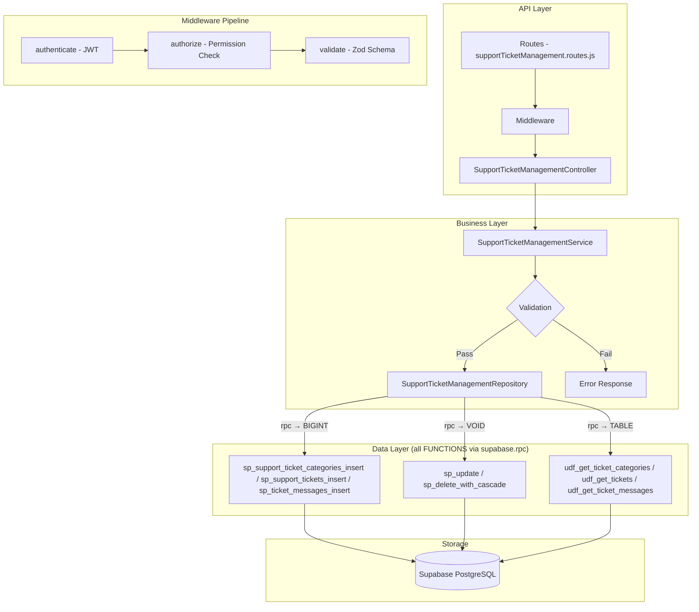

# GrowUpMore API — Support Ticket Management Module

## Postman Testing Guide

**Base URL:** `http://localhost:5001`
**API Prefix:** `/api/v1/support-ticket-management`
**Content-Type:** `application/json`
**Authentication:** All endpoints require `Bearer <access_token>` in Authorization header

---

## Architecture Flow



---

## Prerequisites

Before testing, ensure:

1. **Authentication**: Login via `POST /api/v1/auth/login` to obtain `access_token`
2. **Permissions**: Ensure ticket permissions are set up (ticket_category.*, ticket.*, ticket_message.*)
3. **User Accounts**: At least one admin/support staff and regular user account exists
4. **Languages**: Language records should exist for multi-language support
5. **Related Modules**: Optional - courses, batches, webinars, and orders should exist for ticket linking

---

## Complete Endpoint Reference

### Test Order (follow this sequence in Postman)

| # | Endpoint | Permission | Purpose |
|---|----------|-----------|---------|
| 1 | `POST /ticket-categories` | `ticket_category.create` | Create ticket category |
| 2 | `GET /ticket-categories` | `ticket_category.read` | List ticket categories |
| 3 | `GET /ticket-categories/:id` | `ticket_category.read` | Get category by ID |
| 4 | `PATCH /ticket-categories/:id` | `ticket_category.update` | Update category |
| 5 | `POST /ticket-categories/:categoryId/translations` | `ticket_category.create` | Create category translation |
| 6 | `PATCH /category-translations/:id` | `ticket_category.update` | Update translation |
| 7 | `DELETE /category-translations/:id` | `ticket_category.delete` | Delete translation |
| 8 | `POST /category-translations/:id/restore` | `ticket_category.update` | Restore translation |
| 9 | `DELETE /ticket-categories/:id` | `ticket_category.delete` | Soft delete category |
| 10 | `POST /ticket-categories/:id/restore` | `ticket_category.update` | Restore category |
| 11 | `POST /tickets` | `ticket.create` | Create ticket |
| 12 | `GET /tickets` | `ticket.read` | List tickets |
| 13 | `GET /tickets/:id` | `ticket.read` | Get ticket by ID |
| 14 | `PATCH /tickets/:id` | `ticket.update` | Update ticket |
| 15 | `POST /tickets/:ticketId/messages` | `ticket_message.create` | Add ticket message |
| 16 | `POST /tickets/:ticketId/translations` | `ticket.create` | Create ticket translation |
| 17 | `PATCH /ticket-translations/:id` | `ticket.update` | Update translation |
| 18 | `DELETE /ticket-translations/:id` | `ticket.delete` | Delete translation |
| 19 | `POST /ticket-translations/:id/restore` | `ticket.update` | Restore translation |
| 20 | `DELETE /tickets/:id` | `ticket.delete` | Soft delete ticket |
| 21 | `POST /tickets/:id/restore` | `ticket.update` | Restore ticket |
| 22 | `GET /ticket-messages` | `ticket_message.read` | List ticket messages |
| 23 | `GET /ticket-messages/:id` | `ticket_message.read` | Get message by ID |
| 24 | `PATCH /ticket-messages/:id` | `ticket_message.update` | Update message |
| 25 | `POST /ticket-messages/:messageId/translations` | `ticket_message.create` | Create message translation |
| 26 | `PATCH /message-translations/:id` | `ticket_message.update` | Update message translation |
| 27 | `DELETE /message-translations/:id` | `ticket_message.delete` | Delete message translation |
| 28 | `POST /message-translations/:id/restore` | `ticket_message.update` | Restore message translation |
| 29 | `DELETE /ticket-messages/:id` | `ticket_message.delete` | Soft delete message |
| 30 | `POST /ticket-messages/:id/restore` | `ticket_message.update` | Restore message |

---

## Common Headers (All Requests)

| Key | Value |
|-----|-------|
| Authorization | Bearer `<access_token>` |
| Content-Type | `application/json` |

---

## Field Definitions

### Ticket Type Enum
- `complaint` - User complaint about course or service
- `request` - Feature or support request
- `suggestion` - Feedback or improvement suggestion
- `feedback` - General feedback

### Ticket Priority Enum
- `low` - Can be addressed in normal workflow
- `medium` - Should be addressed within 1-2 business days
- `high` - Should be addressed within 24 hours
- `urgent` - Requires immediate attention

### Ticket Status Enum
- `open` - Initial state, awaiting review
- `in_progress` - Being actively handled
- `awaiting_response` - Waiting for user response
- `resolved` - Issue has been resolved
- `closed` - Ticket is closed
- `reopened` - Previously resolved ticket reopened

### Attachment Type Enum
- `image` - Image file (PNG, JPG, etc.)
- `pdf` - PDF document
- `document` - Document file (DOCX, XLSX, etc.)
- `video` - Video file
- `other` - Other file types

### Satisfaction Rating
- `1` - Very Dissatisfied
- `2` - Dissatisfied
- `3` - Neutral
- `4` - Satisfied
- `5` - Very Satisfied

---

## 1. TICKET CATEGORIES

### 1.1 Create Ticket Category

**`POST /api/v1/support-ticket-management/ticket-categories`**

**Permission:** `ticket_category.create`

**Headers:**
```
Authorization: Bearer {{access_token}}
Content-Type: application/json
```

**Request Body:**

| Field | Type | Required | Description |
|-------|------|----------|-------------|
| name | string | Yes | Category name |
| code | string | No | Unique category code |
| parentCategoryId | number | No | Parent category ID for hierarchical structure |
| displayOrder | number | No | Display order (default: 0) |
| icon | string | No | Icon identifier/URL |
| isActive | boolean | No | Active status (default: true) |

**Example Request:**
```json
{
  "name": "Technical Issues",
  "code": "TECH_ISSUE",
  "parentCategoryId": null,
  "displayOrder": 1,
  "icon": "fa-bug",
  "isActive": true
}
```

**Expected Response (201):**
```json
{
  "success": true,
  "message": "Ticket category created successfully",
  "data": {
    "id": 1
  }
}
```

**Postman Tests:**
```javascript
pm.test("Status is 201", () => pm.response.to.have.status(201));
const json = pm.response.json();
pm.test("Has category ID", () => pm.expect(json.data.id).to.be.a("number"));
pm.collectionVariables.set("categoryId", json.data.id);
```

---

### 1.2 List Ticket Categories

**`GET /api/v1/support-ticket-management/ticket-categories`**

**Permission:** `ticket_category.read`

**Headers:**
```
Authorization: Bearer {{access_token}}
Content-Type: application/json
```

**Query Parameters:**

| Parameter | Type | Required | Description |
|-----------|------|----------|-------------|
| parentCategoryId | number | No | Filter by parent category |
| isActive | boolean | No | Filter by active status |
| searchTerm | string | No | Search in category name/code |
| sortBy | string | No | Sort field (name, code, displayOrder, createdAt) |
| sortDir | string | No | Sort direction (asc, desc) |
| page | number | No | Page number (default: 1) |
| limit | number | No | Results per page (default: 20) |

**Example Request:**
```
GET /api/v1/support-ticket-management/ticket-categories?page=1&limit=20&isActive=true
```

**Expected Response (200):**
```json
{
  "success": true,
  "message": "Ticket categories retrieved successfully",
  "data": [
    {
      "id": 1,
      "name": "Technical Issues",
      "code": "TECH_ISSUE",
      "parentCategoryId": null,
      "displayOrder": 1,
      "icon": "fa-bug",
      "isActive": true,
      "createdAt": "2026-04-06T10:30:00Z",
      "updatedAt": "2026-04-06T10:30:00Z"
    }
  ],
  "pagination": {
    "page": 1,
    "limit": 20,
    "total": 1,
    "pages": 1
  }
}
```

**Postman Tests:**
```javascript
pm.test("Status is 200", () => pm.response.to.have.status(200));
const json = pm.response.json();
pm.test("Data is array", () => pm.expect(json.data).to.be.an("array"));
pm.test("Has pagination", () => pm.expect(json.pagination).to.exist);
```

---

### 1.3 Get Ticket Category by ID

**`GET /api/v1/support-ticket-management/ticket-categories/:id`**

**Permission:** `ticket_category.read`

**Headers:**
```
Authorization: Bearer {{access_token}}
Content-Type: application/json
```

**Path Parameters:**

| Parameter | Type | Required | Description |
|-----------|------|----------|-------------|
| id | number | Yes | Category ID |

**Example Request:**
```
GET /api/v1/support-ticket-management/ticket-categories/1
```

**Expected Response (200):**
```json
{
  "success": true,
  "message": "Ticket category retrieved successfully",
  "data": {
    "id": 1,
    "name": "Technical Issues",
    "code": "TECH_ISSUE",
    "parentCategoryId": null,
    "displayOrder": 1,
    "icon": "fa-bug",
    "isActive": true,
    "translations": [
      {
        "id": 1,
        "languageId": 1,
        "name": "Technical Issues",
        "description": "Issues related to technical problems",
        "isActive": true
      }
    ],
    "createdAt": "2026-04-06T10:30:00Z",
    "updatedAt": "2026-04-06T10:30:00Z"
  }
}
```

**Postman Tests:**
```javascript
pm.test("Status is 200", () => pm.response.to.have.status(200));
const json = pm.response.json();
pm.test("Has category data", () => pm.expect(json.data.id).to.equal(1));
pm.test("Has translations array", () => pm.expect(json.data.translations).to.be.an("array"));
```

---

### 1.4 Update Ticket Category

**`PATCH /api/v1/support-ticket-management/ticket-categories/:id`**

**Permission:** `ticket_category.update`

**Headers:**
```
Authorization: Bearer {{access_token}}
Content-Type: application/json
```

**Path Parameters:**

| Parameter | Type | Required | Description |
|-----------|------|----------|-------------|
| id | number | Yes | Category ID |

**Request Body (all fields optional):**

| Field | Type | Description |
|-------|------|-------------|
| name | string | Category name |
| code | string | Category code |
| parentCategoryId | number | Parent category ID |
| displayOrder | number | Display order |
| icon | string | Icon identifier |
| isActive | boolean | Active status |

**Example Request:**
```json
{
  "name": "Technical Issues - Updated",
  "displayOrder": 2,
  "isActive": true
}
```

**Expected Response (200):**
```json
{
  "success": true,
  "message": "Ticket category updated successfully",
  "data": {
    "id": 1
  }
}
```

**Postman Tests:**
```javascript
pm.test("Status is 200", () => pm.response.to.have.status(200));
const json = pm.response.json();
pm.test("Update confirmed", () => pm.expect(json.data.id).to.equal(1));
```

---

### 1.5 Create Category Translation

**`POST /api/v1/support-ticket-management/ticket-categories/:categoryId/translations`**

**Permission:** `ticket_category.create`

**Headers:**
```
Authorization: Bearer {{access_token}}
Content-Type: application/json
```

**Path Parameters:**

| Parameter | Type | Required | Description |
|-----------|------|----------|-------------|
| categoryId | number | Yes | Category ID |

**Request Body:**

| Field | Type | Required | Description |
|-------|------|----------|-------------|
| languageId | number | Yes | Language ID |
| name | string | Yes | Translated category name |
| description | string | No | Translated description |
| isActive | boolean | No | Active status (default: true) |

**Example Request:**
```json
{
  "languageId": 1,
  "name": "Problemas Técnicos",
  "description": "Problemas relacionados con dificultades técnicas",
  "isActive": true
}
```

**Expected Response (201):**
```json
{
  "success": true,
  "message": "Category translation created successfully",
  "data": {
    "id": 1
  }
}
```

**Postman Tests:**
```javascript
pm.test("Status is 201", () => pm.response.to.have.status(201));
const json = pm.response.json();
pm.collectionVariables.set("categoryTranslationId", json.data.id);
```

---

### 1.6 Update Category Translation

**`PATCH /api/v1/support-ticket-management/category-translations/:id`**

**Permission:** `ticket_category.update`

**Headers:**
```
Authorization: Bearer {{access_token}}
Content-Type: application/json
```

**Path Parameters:**

| Parameter | Type | Required | Description |
|-----------|------|----------|-------------|
| id | number | Yes | Translation ID |

**Request Body (all fields optional):**

| Field | Type | Description |
|-------|------|-------------|
| name | string | Translated name |
| description | string | Translated description |
| isActive | boolean | Active status |

**Example Request:**
```json
{
  "name": "Problemas Técnicos - Actualizado",
  "isActive": true
}
```

**Expected Response (200):**
```json
{
  "success": true,
  "message": "Category translation updated successfully",
  "data": {
    "id": 1
  }
}
```

---

### 1.7 Delete Category Translation

**`DELETE /api/v1/support-ticket-management/category-translations/:id`**

**Permission:** `ticket_category.delete`

**Headers:**
```
Authorization: Bearer {{access_token}}
Content-Type: application/json
```

**Path Parameters:**

| Parameter | Type | Required | Description |
|-----------|------|----------|-------------|
| id | number | Yes | Translation ID |

**Expected Response (200):**
```json
{
  "success": true,
  "message": "Category translation deleted successfully"
}
```

**Postman Tests:**
```javascript
pm.test("Status is 200", () => pm.response.to.have.status(200));
pm.test("Has success message", () => pm.expect(pm.response.json().success).to.be.true);
```

---

### 1.8 Restore Category Translation

**`POST /api/v1/support-ticket-management/category-translations/:id/restore`**

**Permission:** `ticket_category.update`

**Headers:**
```
Authorization: Bearer {{access_token}}
Content-Type: application/json
```

**Path Parameters:**

| Parameter | Type | Required | Description |
|-----------|------|----------|-------------|
| id | number | Yes | Translation ID |

**Expected Response (200):**
```json
{
  "success": true,
  "message": "Category translation restored successfully",
  "data": {
    "id": 1
  }
}
```

---

### 1.9 Delete Ticket Category

**`DELETE /api/v1/support-ticket-management/ticket-categories/:id`**

**Permission:** `ticket_category.delete`

**Headers:**
```
Authorization: Bearer {{access_token}}
Content-Type: application/json
```

**Path Parameters:**

| Parameter | Type | Required | Description |
|-----------|------|----------|-------------|
| id | number | Yes | Category ID |

**Note:** Cascades deletion to translations.

**Expected Response (200):**
```json
{
  "success": true,
  "message": "Ticket category deleted successfully"
}
```

---

### 1.10 Restore Ticket Category

**`POST /api/v1/support-ticket-management/ticket-categories/:id/restore`**

**Permission:** `ticket_category.update`

**Headers:**
```
Authorization: Bearer {{access_token}}
Content-Type: application/json
```

**Path Parameters:**

| Parameter | Type | Required | Description |
|-----------|------|----------|-------------|
| id | number | Yes | Category ID |

**Expected Response (200):**
```json
{
  "success": true,
  "message": "Ticket category restored successfully",
  "data": {
    "id": 1
  }
}
```

---

## 2. TICKETS

### 2.1 Create Ticket

**`POST /api/v1/support-ticket-management/tickets`**

**Permission:** `ticket.create`

**Headers:**
```
Authorization: Bearer {{access_token}}
Content-Type: application/json
```

**Request Body:**

| Field | Type | Required | Description |
|-------|------|----------|-------------|
| raisedBy | number | Yes | User ID who raised the ticket |
| subject | string | Yes | Ticket subject/title |
| categoryId | number | No | Ticket category ID |
| assignedTo | number | No | User ID of assigned support staff |
| ticketType | string | No | complaint, request, suggestion, feedback (default: 'complaint') |
| priority | string | No | low, medium, high, urgent (default: 'medium') |
| ticketStatus | string | No | open, in_progress, awaiting_response, resolved, closed, reopened (default: 'open') |
| courseId | number | No | Related course ID |
| batchId | number | No | Related batch ID |
| webinarId | number | No | Related webinar ID |
| orderId | number | No | Related order ID |

**Example Request:**
```json
{
  "raisedBy": 123,
  "subject": "Cannot access course content",
  "categoryId": 1,
  "assignedTo": 456,
  "ticketType": "complaint",
  "priority": "high",
  "ticketStatus": "open",
  "courseId": 5,
  "batchId": null,
  "webinarId": null,
  "orderId": null
}
```

**Expected Response (201):**
```json
{
  "success": true,
  "message": "Ticket created successfully",
  "data": {
    "id": 1
  }
}
```

**Postman Tests:**
```javascript
pm.test("Status is 201", () => pm.response.to.have.status(201));
const json = pm.response.json();
pm.test("Has ticket ID", () => pm.expect(json.data.id).to.be.a("number"));
pm.collectionVariables.set("ticketId", json.data.id);
```

---

### 2.2 List Tickets

**`GET /api/v1/support-ticket-management/tickets`**

**Permission:** `ticket.read`

**Headers:**
```
Authorization: Bearer {{access_token}}
Content-Type: application/json
```

**Query Parameters:**

| Parameter | Type | Required | Description |
|-----------|------|----------|-------------|
| raisedBy | number | No | Filter by user who raised ticket |
| assignedTo | number | No | Filter by assigned staff |
| categoryId | number | No | Filter by category |
| ticketType | string | No | Filter by type (complaint, request, suggestion, feedback) |
| priority | string | No | Filter by priority (low, medium, high, urgent) |
| ticketStatus | string | No | Filter by status |
| courseId | number | No | Filter by related course |
| batchId | number | No | Filter by related batch |
| webinarId | number | No | Filter by related webinar |
| orderId | number | No | Filter by related order |
| isActive | boolean | No | Filter by active status |
| searchTerm | string | No | Search in subject |
| sortBy | string | No | Sort field (subject, priority, createdAt, updatedAt) |
| sortDir | string | No | Sort direction (asc, desc) |
| page | number | No | Page number (default: 1) |
| limit | number | No | Results per page (default: 20) |

**Example Request:**
```
GET /api/v1/support-ticket-management/tickets?page=1&limit=20&priority=high&ticketStatus=open
```

**Expected Response (200):**
```json
{
  "success": true,
  "message": "Tickets retrieved successfully",
  "data": [
    {
      "id": 1,
      "raisedBy": 123,
      "subject": "Cannot access course content",
      "categoryId": 1,
      "assignedTo": 456,
      "ticketType": "complaint",
      "priority": "high",
      "ticketStatus": "open",
      "courseId": 5,
      "batchId": null,
      "webinarId": null,
      "orderId": null,
      "firstResponseAt": null,
      "resolvedAt": null,
      "closedAt": null,
      "satisfactionRating": null,
      "isActive": true,
      "createdAt": "2026-04-06T10:30:00Z",
      "updatedAt": "2026-04-06T10:30:00Z"
    }
  ],
  "pagination": {
    "page": 1,
    "limit": 20,
    "total": 1,
    "pages": 1
  }
}
```

**Postman Tests:**
```javascript
pm.test("Status is 200", () => pm.response.to.have.status(200));
const json = pm.response.json();
pm.test("Data is array", () => pm.expect(json.data).to.be.an("array"));
pm.test("Has pagination", () => pm.expect(json.pagination).to.exist);
```

---

### 2.3 Get Ticket by ID

**`GET /api/v1/support-ticket-management/tickets/:id`**

**Permission:** `ticket.read`

**Headers:**
```
Authorization: Bearer {{access_token}}
Content-Type: application/json
```

**Path Parameters:**

| Parameter | Type | Required | Description |
|-----------|------|----------|-------------|
| id | number | Yes | Ticket ID |

**Example Request:**
```
GET /api/v1/support-ticket-management/tickets/1
```

**Expected Response (200):**
```json
{
  "success": true,
  "message": "Ticket retrieved successfully",
  "data": {
    "id": 1,
    "raisedBy": 123,
    "subject": "Cannot access course content",
    "categoryId": 1,
    "assignedTo": 456,
    "ticketType": "complaint",
    "priority": "high",
    "ticketStatus": "open",
    "courseId": 5,
    "batchId": null,
    "webinarId": null,
    "orderId": null,
    "firstResponseAt": null,
    "resolvedAt": null,
    "closedAt": null,
    "satisfactionRating": null,
    "isActive": true,
    "messages": [
      {
        "id": 1,
        "messageBody": "I have been unable to access the course materials",
        "attachmentUrl": null,
        "attachmentType": null,
        "senderId": 123,
        "isInternalNote": false,
        "createdAt": "2026-04-06T10:30:00Z"
      }
    ],
    "translations": [
      {
        "id": 1,
        "languageId": 1,
        "description": "Cannot access course content",
        "resolutionNotes": null,
        "isActive": true
      }
    ],
    "createdAt": "2026-04-06T10:30:00Z",
    "updatedAt": "2026-04-06T10:30:00Z"
  }
}
```

**Postman Tests:**
```javascript
pm.test("Status is 200", () => pm.response.to.have.status(200));
const json = pm.response.json();
pm.test("Has ticket data", () => pm.expect(json.data.id).to.equal(1));
pm.test("Has messages array", () => pm.expect(json.data.messages).to.be.an("array"));
pm.test("Has translations array", () => pm.expect(json.data.translations).to.be.an("array"));
```

---

### 2.4 Update Ticket

**`PATCH /api/v1/support-ticket-management/tickets/:id`**

**Permission:** `ticket.update`

**Headers:**
```
Authorization: Bearer {{access_token}}
Content-Type: application/json
```

**Path Parameters:**

| Parameter | Type | Required | Description |
|-----------|------|----------|-------------|
| id | number | Yes | Ticket ID |

**Request Body (all fields optional):**

| Field | Type | Description |
|-------|------|-------------|
| subject | string | Ticket subject |
| priority | string | Priority level |
| ticketStatus | string | Current status |
| assignedTo | number | Assigned staff user ID |
| categoryId | number | Category ID |
| ticketType | string | Ticket type |
| courseId | number | Related course ID |
| batchId | number | Related batch ID |
| webinarId | number | Related webinar ID |
| orderId | number | Related order ID |
| firstResponseAt | timestamp | First response timestamp |
| resolvedAt | timestamp | Resolution timestamp |
| closedAt | timestamp | Closure timestamp |
| satisfactionRating | number | Rating 1-5 |
| isActive | boolean | Active status |

**Example Request:**
```json
{
  "ticketStatus": "in_progress",
  "assignedTo": 456,
  "priority": "high"
}
```

**Expected Response (200):**
```json
{
  "success": true,
  "message": "Ticket updated successfully",
  "data": {
    "id": 1
  }
}
```

**Postman Tests:**
```javascript
pm.test("Status is 200", () => pm.response.to.have.status(200));
const json = pm.response.json();
pm.test("Update confirmed", () => pm.expect(json.data.id).to.equal(1));
```

---

### 2.5 Add Message to Ticket

**`POST /api/v1/support-ticket-management/tickets/:ticketId/messages`**

**Permission:** `ticket_message.create`

**Headers:**
```
Authorization: Bearer {{access_token}}
Content-Type: application/json
```

**Path Parameters:**

| Parameter | Type | Required | Description |
|-----------|------|----------|-------------|
| ticketId | number | Yes | Ticket ID |

**Request Body:**

| Field | Type | Required | Description |
|-------|------|----------|-------------|
| messageBody | string | Yes | Message content |
| attachmentUrl | string | No | URL to attachment |
| attachmentType | string | No | image, pdf, document, video, other |
| isInternalNote | boolean | No | Whether this is internal note (default: false) |

**Example Request:**
```json
{
  "messageBody": "I've checked your account and found the issue. Let me escalate this.",
  "attachmentUrl": null,
  "attachmentType": null,
  "isInternalNote": false
}
```

**Expected Response (201):**
```json
{
  "success": true,
  "message": "Ticket message created successfully",
  "data": {
    "id": 1
  }
}
```

**Postman Tests:**
```javascript
pm.test("Status is 201", () => pm.response.to.have.status(201));
const json = pm.response.json();
pm.collectionVariables.set("messageId", json.data.id);
```

---

### 2.6 Create Ticket Translation

**`POST /api/v1/support-ticket-management/tickets/:ticketId/translations`**

**Permission:** `ticket.create`

**Headers:**
```
Authorization: Bearer {{access_token}}
Content-Type: application/json
```

**Path Parameters:**

| Parameter | Type | Required | Description |
|-----------|------|----------|-------------|
| ticketId | number | Yes | Ticket ID |

**Request Body:**

| Field | Type | Required | Description |
|-------|------|----------|-------------|
| languageId | number | Yes | Language ID |
| description | string | Yes | Translated description |
| resolutionNotes | string | No | Translated resolution notes |
| isActive | boolean | No | Active status (default: true) |

**Example Request:**
```json
{
  "languageId": 1,
  "description": "No puedo acceder al contenido del curso",
  "resolutionNotes": "Se proporcionó acceso manual a los materiales del curso",
  "isActive": true
}
```

**Expected Response (201):**
```json
{
  "success": true,
  "message": "Ticket translation created successfully",
  "data": {
    "id": 1
  }
}
```

---

### 2.7 Update Ticket Translation

**`PATCH /api/v1/support-ticket-management/ticket-translations/:id`**

**Permission:** `ticket.update`

**Headers:**
```
Authorization: Bearer {{access_token}}
Content-Type: application/json
```

**Path Parameters:**

| Parameter | Type | Required | Description |
|-----------|------|----------|-------------|
| id | number | Yes | Translation ID |

**Request Body (all fields optional):**

| Field | Type | Description |
|-------|------|-------------|
| description | string | Translated description |
| resolutionNotes | string | Translated resolution notes |
| isActive | boolean | Active status |

**Example Request:**
```json
{
  "description": "No puedo acceder al contenido del curso - Actualizado",
  "isActive": true
}
```

**Expected Response (200):**
```json
{
  "success": true,
  "message": "Ticket translation updated successfully",
  "data": {
    "id": 1
  }
}
```

---

### 2.8 Delete Ticket Translation

**`DELETE /api/v1/support-ticket-management/ticket-translations/:id`**

**Permission:** `ticket.delete`

**Headers:**
```
Authorization: Bearer {{access_token}}
Content-Type: application/json
```

**Path Parameters:**

| Parameter | Type | Required | Description |
|-----------|------|----------|-------------|
| id | number | Yes | Translation ID |

**Expected Response (200):**
```json
{
  "success": true,
  "message": "Ticket translation deleted successfully"
}
```

---

### 2.9 Restore Ticket Translation

**`POST /api/v1/support-ticket-management/ticket-translations/:id/restore`**

**Permission:** `ticket.update`

**Headers:**
```
Authorization: Bearer {{access_token}}
Content-Type: application/json
```

**Path Parameters:**

| Parameter | Type | Required | Description |
|-----------|------|----------|-------------|
| id | number | Yes | Translation ID |

**Expected Response (200):**
```json
{
  "success": true,
  "message": "Ticket translation restored successfully",
  "data": {
    "id": 1
  }
}
```

---

### 2.10 Delete Ticket

**`DELETE /api/v1/support-ticket-management/tickets/:id`**

**Permission:** `ticket.delete`

**Headers:**
```
Authorization: Bearer {{access_token}}
Content-Type: application/json
```

**Path Parameters:**

| Parameter | Type | Required | Description |
|-----------|------|----------|-------------|
| id | number | Yes | Ticket ID |

**Note:** Cascades deletion to messages and translations.

**Expected Response (200):**
```json
{
  "success": true,
  "message": "Ticket deleted successfully"
}
```

---

### 2.11 Restore Ticket

**`POST /api/v1/support-ticket-management/tickets/:id/restore`**

**Permission:** `ticket.update`

**Headers:**
```
Authorization: Bearer {{access_token}}
Content-Type: application/json
```

**Path Parameters:**

| Parameter | Type | Required | Description |
|-----------|------|----------|-------------|
| id | number | Yes | Ticket ID |

**Expected Response (200):**
```json
{
  "success": true,
  "message": "Ticket restored successfully",
  "data": {
    "id": 1
  }
}
```

---

## 3. TICKET MESSAGES

### 3.1 List Ticket Messages

**`GET /api/v1/support-ticket-management/ticket-messages`**

**Permission:** `ticket_message.read`

**Headers:**
```
Authorization: Bearer {{access_token}}
Content-Type: application/json
```

**Query Parameters:**

| Parameter | Type | Required | Description |
|-----------|------|----------|-------------|
| ticketId | number | No | Filter by ticket ID |
| senderId | number | No | Filter by sender user ID |
| isInternalNote | boolean | No | Filter by internal note status |
| isActive | boolean | No | Filter by active status |
| searchTerm | string | No | Search in message body |
| sortBy | string | No | Sort field (createdAt, updatedAt) |
| sortDir | string | No | Sort direction (asc, desc) |
| page | number | No | Page number (default: 1) |
| limit | number | No | Results per page (default: 20) |

**Example Request:**
```
GET /api/v1/support-ticket-management/ticket-messages?ticketId=1&page=1&limit=20
```

**Expected Response (200):**
```json
{
  "success": true,
  "message": "Ticket messages retrieved successfully",
  "data": [
    {
      "id": 1,
      "ticketId": 1,
      "messageBody": "I have been unable to access the course materials",
      "attachmentUrl": null,
      "attachmentType": null,
      "senderId": 123,
      "isInternalNote": false,
      "isActive": true,
      "createdAt": "2026-04-06T10:30:00Z",
      "updatedAt": "2026-04-06T10:30:00Z"
    }
  ],
  "pagination": {
    "page": 1,
    "limit": 20,
    "total": 1,
    "pages": 1
  }
}
```

**Postman Tests:**
```javascript
pm.test("Status is 200", () => pm.response.to.have.status(200));
const json = pm.response.json();
pm.test("Data is array", () => pm.expect(json.data).to.be.an("array"));
pm.test("Has pagination", () => pm.expect(json.pagination).to.exist);
```

---

### 3.2 Get Ticket Message by ID

**`GET /api/v1/support-ticket-management/ticket-messages/:id`**

**Permission:** `ticket_message.read`

**Headers:**
```
Authorization: Bearer {{access_token}}
Content-Type: application/json
```

**Path Parameters:**

| Parameter | Type | Required | Description |
|-----------|------|----------|-------------|
| id | number | Yes | Message ID |

**Example Request:**
```
GET /api/v1/support-ticket-management/ticket-messages/1
```

**Expected Response (200):**
```json
{
  "success": true,
  "message": "Ticket message retrieved successfully",
  "data": {
    "id": 1,
    "ticketId": 1,
    "messageBody": "I have been unable to access the course materials",
    "attachmentUrl": null,
    "attachmentType": null,
    "senderId": 123,
    "isInternalNote": false,
    "isActive": true,
    "translations": [
      {
        "id": 1,
        "languageId": 1,
        "messageBody": "No he podido acceder a los materiales del curso",
        "isActive": true
      }
    ],
    "createdAt": "2026-04-06T10:30:00Z",
    "updatedAt": "2026-04-06T10:30:00Z"
  }
}
```

**Postman Tests:**
```javascript
pm.test("Status is 200", () => pm.response.to.have.status(200));
const json = pm.response.json();
pm.test("Has message data", () => pm.expect(json.data.id).to.equal(1));
pm.test("Has translations", () => pm.expect(json.data.translations).to.be.an("array"));
```

---

### 3.3 Update Ticket Message

**`PATCH /api/v1/support-ticket-management/ticket-messages/:id`**

**Permission:** `ticket_message.update`

**Headers:**
```
Authorization: Bearer {{access_token}}
Content-Type: application/json
```

**Path Parameters:**

| Parameter | Type | Required | Description |
|-----------|------|----------|-------------|
| id | number | Yes | Message ID |

**Request Body (all fields optional):**

| Field | Type | Description |
|-------|------|-------------|
| messageBody | string | Updated message content |
| attachmentUrl | string | Attachment URL |
| attachmentType | string | Attachment type |
| isInternalNote | boolean | Internal note flag |
| isActive | boolean | Active status |

**Example Request:**
```json
{
  "messageBody": "I have been unable to access the course materials - This is still an issue"
}
```

**Expected Response (200):**
```json
{
  "success": true,
  "message": "Ticket message updated successfully",
  "data": {
    "id": 1
  }
}
```

---

### 3.4 Create Message Translation

**`POST /api/v1/support-ticket-management/ticket-messages/:messageId/translations`**

**Permission:** `ticket_message.create`

**Headers:**
```
Authorization: Bearer {{access_token}}
Content-Type: application/json
```

**Path Parameters:**

| Parameter | Type | Required | Description |
|-----------|------|----------|-------------|
| messageId | number | Yes | Message ID |

**Request Body:**

| Field | Type | Required | Description |
|-------|------|----------|-------------|
| languageId | number | Yes | Language ID |
| messageBody | string | Yes | Translated message |
| isActive | boolean | No | Active status (default: true) |

**Example Request:**
```json
{
  "languageId": 1,
  "messageBody": "No he podido acceder a los materiales del curso",
  "isActive": true
}
```

**Expected Response (201):**
```json
{
  "success": true,
  "message": "Message translation created successfully",
  "data": {
    "id": 1
  }
}
```

---

### 3.5 Update Message Translation

**`PATCH /api/v1/support-ticket-management/message-translations/:id`**

**Permission:** `ticket_message.update`

**Headers:**
```
Authorization: Bearer {{access_token}}
Content-Type: application/json
```

**Path Parameters:**

| Parameter | Type | Required | Description |
|-----------|------|----------|-------------|
| id | number | Yes | Translation ID |

**Request Body (all fields optional):**

| Field | Type | Description |
|-------|------|-------------|
| messageBody | string | Translated message |
| isActive | boolean | Active status |

**Example Request:**
```json
{
  "messageBody": "No he podido acceder a los materiales del curso - Actualizado",
  "isActive": true
}
```

**Expected Response (200):**
```json
{
  "success": true,
  "message": "Message translation updated successfully",
  "data": {
    "id": 1
  }
}
```

---

### 3.6 Delete Message Translation

**`DELETE /api/v1/support-ticket-management/message-translations/:id`**

**Permission:** `ticket_message.delete`

**Headers:**
```
Authorization: Bearer {{access_token}}
Content-Type: application/json
```

**Path Parameters:**

| Parameter | Type | Required | Description |
|-----------|------|----------|-------------|
| id | number | Yes | Translation ID |

**Expected Response (200):**
```json
{
  "success": true,
  "message": "Message translation deleted successfully"
}
```

---

### 3.7 Restore Message Translation

**`POST /api/v1/support-ticket-management/message-translations/:id/restore`**

**Permission:** `ticket_message.update`

**Headers:**
```
Authorization: Bearer {{access_token}}
Content-Type: application/json
```

**Path Parameters:**

| Parameter | Type | Required | Description |
|-----------|------|----------|-------------|
| id | number | Yes | Translation ID |

**Expected Response (200):**
```json
{
  "success": true,
  "message": "Message translation restored successfully",
  "data": {
    "id": 1
  }
}
```

---

### 3.8 Delete Ticket Message

**`DELETE /api/v1/support-ticket-management/ticket-messages/:id`**

**Permission:** `ticket_message.delete`

**Headers:**
```
Authorization: Bearer {{access_token}}
Content-Type: application/json
```

**Path Parameters:**

| Parameter | Type | Required | Description |
|-----------|------|----------|-------------|
| id | number | Yes | Message ID |

**Note:** Cascades deletion to translations.

**Expected Response (200):**
```json
{
  "success": true,
  "message": "Ticket message deleted successfully"
}
```

---

### 3.9 Restore Ticket Message

**`POST /api/v1/support-ticket-management/ticket-messages/:id/restore`**

**Permission:** `ticket_message.update`

**Headers:**
```
Authorization: Bearer {{access_token}}
Content-Type: application/json
```

**Path Parameters:**

| Parameter | Type | Required | Description |
|-----------|------|----------|-------------|
| id | number | Yes | Message ID |

**Expected Response (200):**
```json
{
  "success": true,
  "message": "Ticket message restored successfully",
  "data": {
    "id": 1
  }
}
```

---

## Error Responses

All endpoints follow standard error response format:

### 400 - Bad Request
```json
{
  "success": false,
  "message": "Validation error or malformed request",
  "errors": [
    {
      "field": "name",
      "message": "Name is required"
    }
  ]
}
```

### 401 - Unauthorized
```json
{
  "success": false,
  "message": "Authentication failed - invalid or expired token",
  "error": "UNAUTHORIZED"
}
```

### 403 - Forbidden
```json
{
  "success": false,
  "message": "Permission denied - insufficient permissions",
  "error": "FORBIDDEN",
  "requiredPermission": "ticket.create"
}
```

### 404 - Not Found
```json
{
  "success": false,
  "message": "Resource not found",
  "error": "NOT_FOUND"
}
```

### 409 - Conflict
```json
{
  "success": false,
  "message": "Ticket category with this code already exists",
  "error": "DUPLICATE_CODE"
}
```

### 500 - Internal Server Error
```json
{
  "success": false,
  "message": "Internal server error",
  "error": "SERVER_ERROR"
}
```

---

## Postman Collection Setup

### Environment Variables

Add these to your Postman environment:

```javascript
{
  "base_url": "http://localhost:5001",
  "api_v1": "/api/v1",
  "access_token": "your_jwt_token_here",
  "categoryId": "",
  "ticketId": "",
  "messageId": ""
}
```

### Pre-request Script (for all requests)

```javascript
// Set Authorization header if token exists
if (pm.environment.get('access_token')) {
    pm.request.headers.add({
        key: 'Authorization',
        value: 'Bearer ' + pm.environment.get('access_token')
    });
}

// Set default Content-Type
pm.request.headers.add({
    key: 'Content-Type',
    value: 'application/json'
});
```

### Common Test Script

Add this to folder or collection level tests:

```javascript
// Response format validation
pm.test("Response has success field", () => {
    const json = pm.response.json();
    pm.expect(json).to.have.property('success');
});

pm.test("Response has message field", () => {
    const json = pm.response.json();
    pm.expect(json).to.have.property('message');
});

// Status code tests are added per endpoint
```

---

## Workflow Examples

### Create Complete Support Ticket Workflow

1. **Create ticket category**
   - `POST /ticket-categories` with name, code
   - Save category ID to variable

2. **Create ticket**
   - `POST /tickets` with raisedBy, subject, categoryId
   - Save ticket ID to variable

3. **Add initial message**
   - `POST /tickets/:ticketId/messages` with messageBody
   - Save message ID to variable

4. **Assign and update status**
   - `PATCH /tickets/:id` update assignedTo, ticketStatus to in_progress

5. **Add support response message**
   - `POST /tickets/:ticketId/messages` from support staff
   - Update ticketStatus to awaiting_response

6. **Mark resolved**
   - `PATCH /tickets/:id` set ticketStatus to resolved, resolvedAt timestamp

7. **Closure with rating**
   - `PATCH /tickets/:id` set ticketStatus to closed, satisfactionRating

### Multi-Language Support Workflow

1. **Create primary ticket category**
   - `POST /ticket-categories` (English)

2. **Create translations for multiple languages**
   - `POST /ticket-categories/:categoryId/translations` (Spanish)
   - `POST /ticket-categories/:categoryId/translations` (French)
   - Repeat for each language

3. **Query by language** (update search to include language filters based on implementation)

4. **Update translations independently**
   - `PATCH /category-translations/:id` for specific language version

---

## Testing Checklist

- [ ] Can create ticket categories with and without hierarchy
- [ ] Can list categories with filters and pagination
- [ ] Can create category translations for multiple languages
- [ ] Can create tickets with all statuses
- [ ] Can filter tickets by type, priority, status, and relationships
- [ ] Can add messages to tickets (visible and internal notes)
- [ ] Can update ticket status through lifecycle (open→in_progress→resolved→closed)
- [ ] Can assign tickets to support staff
- [ ] Can soft delete and restore all entities
- [ ] Can handle hierarchical categories correctly
- [ ] Cascade deletion works for related messages and translations
- [ ] Pagination works correctly with various limits
- [ ] Search/filter functionality works across all entities
- [ ] Multi-language translations don't interfere with each other
- [ ] Satisfaction rating validation (1-5 range)
- [ ] Internal notes are marked correctly
- [ ] Attachment types are validated
- [ ] Permissions are enforced for all operations
- [ ] Timestamps (firstResponseAt, resolvedAt, closedAt) are set appropriately

---

## Common Issues & Solutions

**Issue: Ticket not found after creation**
- Ensure the ticket ID from creation response is used correctly
- Check that the ticket hasn't been soft deleted

**Issue: Category translation not appearing**
- Verify the language ID exists
- Check that isActive is set to true
- Ensure the parent category is active

**Issue: Cannot assign ticket to user**
- Verify the user ID exists in the system
- Check that the user has appropriate role/permissions
- Ensure assignedTo is a valid user ID

**Issue: Cascade deletion not working**
- Verify soft delete is being used (DELETE endpoint)
- Check database logs for constraints
- Ensure all related entities are properly structured

**Issue: Pagination not returning expected results**
- Verify page and limit parameters are numbers
- Check that limit is within acceptable range
- Ensure search filters don't exclude all results

---

## Performance Notes

- Hierarchical categories support up to 3 levels deep (parent→child→grandchild)
- Large ticket lists recommend pagination with limit <= 100
- Filtering on multiple criteria may impact response time; index important fields
- Translations are lazy-loaded; use selective population if possible
- Internal notes are visible only to staff with ticket.read permission
- Consider caching frequently-accessed categories in client

---

## Security Considerations

- All endpoints require valid Bearer token authentication
- Permissions are checked per operation (create, read, update, delete)
- Soft deletes ensure data recovery without permanent loss
- User can only see tickets they raised or are assigned to (implement row-level security)
- Internal notes should only be visible to support staff
- Satisfaction ratings should only be editable by ticket raiser or admin

---

## Version History

**v1.0** - Initial API Documentation (Phase 25)
- Ticket categories (hierarchical, multi-language)
- Ticket lifecycle management
- Ticket messages with internal notes
- Multi-language support for all entities
- Soft delete/restore functionality
