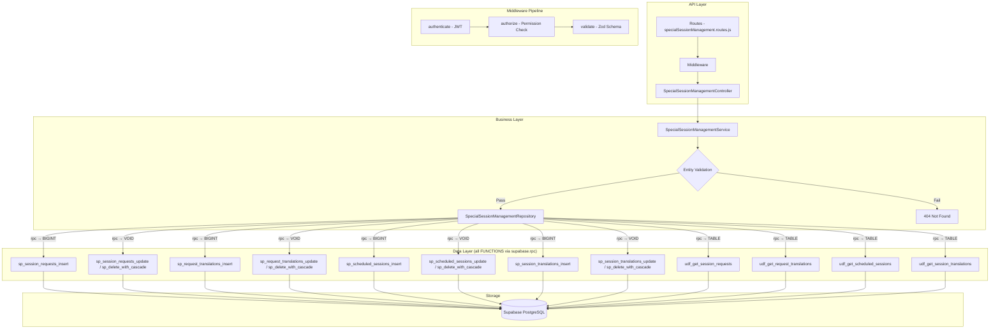

# GrowUpMore API — Special Session Management Module

## Postman Testing Guide

**Base URL:** `http://localhost:5001`
**API Prefix:** `/api/v1/special-session-management`
**Content-Type:** `application/json`
**Authentication:** All endpoints require `Bearer <access_token>` in Authorization header

---

## Architecture Flow



---

## Prerequisites

Before testing, ensure:

1. **Authentication**: Login via `POST /api/v1/auth/login` to obtain `access_token`
2. **Permissions**: Run `phase26_special_sessions_permissions_seed.sql` in Supabase SQL Editor
3. **Master Data**: Students, Instructors, and Courses exist (from earlier phases)
4. **Parent Records**:
   - Session Requests require valid Students and optionally Instructors and Courses
   - Session Request Translations require valid Session Requests
   - Scheduled Sessions require valid Session Requests, Students, and Instructors
   - Scheduled Session Translations require valid Scheduled Sessions

---

## Complete Endpoint Reference

### Test Order (follow this sequence in Postman)

| # | Endpoint | Permission | Purpose |
|---|----------|-----------|---------|
| 1 | `GET /session-requests` | `session_request.read` | List all session requests |
| 2 | `POST /session-requests` | `session_request.create` | Create a new session request |
| 3 | `GET /session-requests/:id` | `session_request.read` | Get session request by ID |
| 4 | `PATCH /session-requests/:id` | `session_request.update` | Update session request |
| 5 | `POST /session-requests/:id/translations` | `session_request.create` | Create request translation |
| 6 | `PATCH /request-translations/:id` | `session_request.update` | Update request translation |
| 7 | `DELETE /request-translations/:id` | `session_request.delete` | Delete request translation |
| 8 | `POST /request-translations/:id/restore` | `session_request.delete` | Restore request translation |
| 9 | `GET /session-requests/json` | `session_request.read` | List requests as JSON hierarchy |
| 10 | `POST /session-requests/bulk-delete` | `session_request.delete` | Bulk delete session requests |
| 11 | `POST /session-requests/bulk-restore` | `session_request.delete` | Bulk restore session requests |
| 12 | `DELETE /session-requests/:id` | `session_request.delete` | Soft delete session request |
| 13 | `POST /session-requests/:id/restore` | `session_request.delete` | Restore session request |
| 14 | `GET /scheduled-sessions` | `scheduled_session.read` | List all scheduled sessions |
| 15 | `POST /scheduled-sessions` | `scheduled_session.create` | Create a new scheduled session |
| 16 | `GET /scheduled-sessions/:id` | `scheduled_session.read` | Get scheduled session by ID |
| 17 | `PATCH /scheduled-sessions/:id` | `scheduled_session.update` | Update scheduled session |
| 18 | `POST /scheduled-sessions/:id/translations` | `scheduled_session.create` | Create session translation |
| 19 | `PATCH /session-translations/:id` | `scheduled_session.update` | Update session translation |
| 20 | `DELETE /session-translations/:id` | `scheduled_session.delete` | Delete session translation |
| 21 | `POST /session-translations/:id/restore` | `scheduled_session.delete` | Restore session translation |
| 22 | `GET /scheduled-sessions/json` | `scheduled_session.read` | List sessions as JSON hierarchy |
| 23 | `POST /scheduled-sessions/bulk-delete` | `scheduled_session.delete` | Bulk delete scheduled sessions |
| 24 | `POST /scheduled-sessions/bulk-restore` | `scheduled_session.delete` | Bulk restore scheduled sessions |
| 25 | `DELETE /scheduled-sessions/:id` | `scheduled_session.delete` | Soft delete scheduled session |
| 26 | `POST /scheduled-sessions/:id/restore` | `scheduled_session.delete` | Restore scheduled session |

---

## Common Headers (All Requests)

| Key | Value |
|-----|-------|
| Authorization | Bearer `<access_token>` |
| Content-Type | `application/json` |

---

## 1. SESSION REQUESTS

### 1.1 List Session Requests

**`GET /api/v1/special-session-management/session-requests`**

**Permission:** `session_request.read`

**Headers:**
```
Authorization: Bearer {{access_token}}
Content-Type: application/json
```

**Query Parameters:**

| Parameter | Type | Description |
|-----------|------|-------------|
| page | integer | Page number (default: 1) |
| limit | integer | Results per page (default: 20, max: 100) |
| studentId | integer | Filter by student ID |
| instructorId | integer | Filter by instructor ID |
| courseId | integer | Filter by course ID |
| requestType | string | Filter by type: `one_on_one`, `group`, `doubt_clearing`, `mentoring`, `career_guidance` |
| requestStatus | string | Filter by status: `pending`, `approved`, `scheduled`, `completed`, `rejected`, `cancelled` |
| isActive | boolean | Filter by active status |
| searchTerm | string | Search term |
| sortBy | string | Sort field (default: `created_at`) |
| sortDir | string | Sort direction: `ASC` or `DESC` (default: DESC) |

**Example:**
```
GET /api/v1/special-session-management/session-requests?page=1&limit=10&requestStatus=pending&sortBy=created_at&sortDir=DESC
```

**Expected Response (200):**
```json
{
  "success": true,
  "message": "Session requests retrieved successfully",
  "data": [
    {
      "id": 5001,
      "studentId": 101,
      "instructorId": 201,
      "courseId": 501,
      "requestType": "one_on_one",
      "requestStatus": "pending",
      "preferredDate": "2026-04-10",
      "preferredTimeSlot": "10:00-11:00",
      "durationMinutes": 60,
      "isFree": false,
      "price": 500.00,
      "isActive": true,
      "createdAt": "2026-04-06T08:00:00Z",
      "updatedAt": "2026-04-06T08:00:00Z"
    },
    {
      "id": 5002,
      "studentId": 102,
      "instructorId": 202,
      "courseId": 502,
      "requestType": "group",
      "requestStatus": "approved",
      "preferredDate": "2026-04-12",
      "preferredTimeSlot": "14:00-15:00",
      "durationMinutes": 90,
      "isFree": true,
      "price": 0.00,
      "isActive": true,
      "createdAt": "2026-04-05T09:30:00Z",
      "updatedAt": "2026-04-05T09:30:00Z"
    }
  ],
  "pagination": {
    "page": 1,
    "limit": 10,
    "total": 25,
    "pages": 3
  }
}
```

**Postman Tests:**
```javascript
pm.test("Status is 200", () => pm.response.to.have.status(200));
const json = pm.response.json();
pm.test("Response has data array", () => pm.expect(json.data).to.be.an("array"));
pm.test("Pagination info exists", () => pm.expect(json.pagination).to.exist);
if (json.data.length > 0) {
  pm.collectionVariables.set("sessionRequestId", json.data[0].id);
}
```

---

### 1.2 Create Session Request

**`POST /api/v1/special-session-management/session-requests`**

**Permission:** `session_request.create`

**Headers:**
```
Authorization: Bearer {{access_token}}
Content-Type: application/json
```

**Request Body:**

| Field | Type | Required | Description |
|-------|------|----------|-------------|
| studentId | integer | Yes | ID of the student |
| instructorId | integer | No | ID of the instructor |
| courseId | integer | No | ID of the course |
| requestType | string | No | Type: `one_on_one`, `group`, `doubt_clearing`, `mentoring`, `career_guidance` (default: `one_on_one`) |
| preferredDate | string | No | Preferred date (YYYY-MM-DD format) |
| preferredTimeSlot | string | No | Preferred time slot (max 100 chars) |
| durationMinutes | integer | No | Duration in minutes (default: 60) |
| isFree | boolean | No | Whether session is free (default: false) |
| price | number | No | Price of the session (default: 0.00) |

**Example Request:**
```json
{
  "studentId": 101,
  "instructorId": 201,
  "courseId": 501,
  "requestType": "one_on_one",
  "preferredDate": "2026-04-10",
  "preferredTimeSlot": "10:00-11:00",
  "durationMinutes": 60,
  "isFree": false,
  "price": 500.00
}
```

**Expected Response (201):**
```json
{
  "success": true,
  "message": "Session request created successfully",
  "data": {
    "id": 5001,
    "studentId": 101,
    "instructorId": 201,
    "courseId": 501,
    "requestType": "one_on_one",
    "requestStatus": "pending",
    "preferredDate": "2026-04-10",
    "preferredTimeSlot": "10:00-11:00",
    "durationMinutes": 60,
    "isFree": false,
    "price": 500.00,
    "isActive": true,
    "createdAt": "2026-04-06T08:00:00Z",
    "updatedAt": "2026-04-06T08:00:00Z"
  }
}
```

**Postman Tests:**
```javascript
pm.test("Status is 201", () => pm.response.to.have.status(201));
const json = pm.response.json();
pm.test("Has session request ID", () => pm.expect(json.data.id).to.be.a("number"));
pm.test("Request type matches", () => pm.expect(json.data.requestType).to.equal("one_on_one"));
pm.test("Initial status is pending", () => pm.expect(json.data.requestStatus).to.equal("pending"));
pm.collectionVariables.set("sessionRequestId", json.data.id);
```

---

### 1.3 Get Session Request by ID

**`GET /api/v1/special-session-management/session-requests/:id`**

**Permission:** `session_request.read`

**Headers:**
```
Authorization: Bearer {{access_token}}
Content-Type: application/json
```

**Example:** `GET /api/v1/special-session-management/session-requests/{{sessionRequestId}}`

**Expected Response (200):**
```json
{
  "success": true,
  "message": "Session request retrieved successfully",
  "data": {
    "id": 5001,
    "studentId": 101,
    "instructorId": 201,
    "courseId": 501,
    "requestType": "one_on_one",
    "requestStatus": "pending",
    "preferredDate": "2026-04-10",
    "preferredTimeSlot": "10:00-11:00",
    "durationMinutes": 60,
    "isFree": false,
    "price": 500.00,
    "isActive": true,
    "createdAt": "2026-04-06T08:00:00Z",
    "updatedAt": "2026-04-06T08:00:00Z"
  }
}
```

**Postman Tests:**
```javascript
pm.test("Status is 200", () => pm.response.to.have.status(200));
const json = pm.response.json();
pm.test("Session request ID matches", () => pm.expect(json.data.id).to.be.a("number"));
pm.test("Has all required fields", () => pm.expect(json.data.studentId).to.exist);
```

---

### 1.4 Update Session Request

**`PATCH /api/v1/special-session-management/session-requests/:id`**

**Permission:** `session_request.update`

**Headers:**
```
Authorization: Bearer {{access_token}}
Content-Type: application/json
```

**Example:** `PATCH /api/v1/special-session-management/session-requests/{{sessionRequestId}}`

**Request Body:**

| Field | Type | Required | Description |
|-------|------|----------|-------------|
| instructorId | integer | No | Updated instructor ID |
| courseId | integer | No | Updated course ID |
| requestType | string | No | Updated type |
| preferredDate | string | No | Updated preferred date |
| preferredTimeSlot | string | No | Updated time slot |
| durationMinutes | integer | No | Updated duration |
| isFree | boolean | No | Updated free flag |
| price | number | No | Updated price |
| requestStatus | string | No | Updated status: `pending`, `approved`, `scheduled`, `completed`, `rejected`, `cancelled` |
| rejectionReason | string | No | Reason for rejection (max 1000 chars) |

**Example Request:**
```json
{
  "requestStatus": "approved",
  "preferredTimeSlot": "14:00-15:00"
}
```

**Expected Response (200):**
```json
{
  "success": true,
  "message": "Session request updated successfully",
  "data": {
    "id": 5001,
    "studentId": 101,
    "instructorId": 201,
    "courseId": 501,
    "requestType": "one_on_one",
    "requestStatus": "approved",
    "preferredDate": "2026-04-10",
    "preferredTimeSlot": "14:00-15:00",
    "durationMinutes": 60,
    "isFree": false,
    "price": 500.00,
    "isActive": true,
    "createdAt": "2026-04-06T08:00:00Z",
    "updatedAt": "2026-04-06T09:30:00Z"
  }
}
```

**Postman Tests:**
```javascript
pm.test("Status is 200", () => pm.response.to.have.status(200));
const json = pm.response.json();
pm.test("Request status updated", () => pm.expect(json.data.requestStatus).to.equal("approved"));
pm.test("Time slot updated", () => pm.expect(json.data.preferredTimeSlot).to.equal("14:00-15:00"));
pm.test("UpdatedAt timestamp changed", () => pm.expect(json.data.updatedAt).to.exist);
```

---

## 2. SESSION REQUEST TRANSLATIONS

### 2.1 Create Session Request Translation

**`POST /api/v1/special-session-management/session-requests/:sessionRequestId/translations`**

**Permission:** `session_request.create`

**Headers:**
```
Authorization: Bearer {{access_token}}
Content-Type: application/json
```

**Example:** `POST /api/v1/special-session-management/session-requests/{{sessionRequestId}}/translations`

**Request Body:**

| Field | Type | Required | Description |
|-------|------|----------|-------------|
| languageId | integer | Yes | ID of the language |
| topic | string | Yes | Translated topic (max 1000 chars) |
| description | string | No | Translated description (max 5000 chars) |

**Example Request:**
```json
{
  "languageId": 1,
  "topic": "Advanced JavaScript Concepts",
  "description": "A comprehensive session covering closures, prototypes, and async patterns in JavaScript."
}
```

**Expected Response (201):**
```json
{
  "success": true,
  "message": "Session request translation created successfully",
  "data": {
    "id": 6001,
    "sessionRequestId": 5001,
    "languageId": 1,
    "topic": "Advanced JavaScript Concepts",
    "description": "A comprehensive session covering closures, prototypes, and async patterns in JavaScript.",
    "isActive": true,
    "createdAt": "2026-04-06T09:00:00Z",
    "updatedAt": "2026-04-06T09:00:00Z"
  }
}
```

**Postman Tests:**
```javascript
pm.test("Status is 201", () => pm.response.to.have.status(201));
const json = pm.response.json();
pm.test("Has translation ID", () => pm.expect(json.data.id).to.be.a("number"));
pm.test("Topic matches request", () => pm.expect(json.data.topic).to.equal("Advanced JavaScript Concepts"));
pm.collectionVariables.set("sessionRequestTranslationId", json.data.id);
```

---

### 2.2 Update Session Request Translation

**`PATCH /api/v1/special-session-management/request-translations/:id`**

**Permission:** `session_request.update`

**Headers:**
```
Authorization: Bearer {{access_token}}
Content-Type: application/json
```

**Example:** `PATCH /api/v1/special-session-management/request-translations/{{sessionRequestTranslationId}}`

**Request Body:**

| Field | Type | Required | Description |
|-------|------|----------|-------------|
| topic | string | No | Updated topic |
| description | string | No | Updated description |

**Example Request:**
```json
{
  "description": "An advanced session covering closures, prototypes, async/await, and advanced patterns in JavaScript."
}
```

**Expected Response (200):**
```json
{
  "success": true,
  "message": "Session request translation updated successfully",
  "data": {
    "id": 6001,
    "sessionRequestId": 5001,
    "languageId": 1,
    "topic": "Advanced JavaScript Concepts",
    "description": "An advanced session covering closures, prototypes, async/await, and advanced patterns in JavaScript.",
    "isActive": true,
    "createdAt": "2026-04-06T09:00:00Z",
    "updatedAt": "2026-04-06T10:15:00Z"
  }
}
```

**Postman Tests:**
```javascript
pm.test("Status is 200", () => pm.response.to.have.status(200));
const json = pm.response.json();
pm.test("Description updated", () => pm.expect(json.data.description).to.include("async/await"));
pm.test("UpdatedAt timestamp changed", () => pm.expect(json.data.updatedAt).to.exist);
```

---

### 2.3 Delete Session Request Translation

**`DELETE /api/v1/special-session-management/request-translations/:id`**

**Permission:** `session_request.delete`

**Headers:**
```
Authorization: Bearer {{access_token}}
```

**Example:** `DELETE /api/v1/special-session-management/request-translations/{{sessionRequestTranslationId}}`

**Expected Response (200):**
```json
{
  "success": true,
  "message": "Session request translation deleted successfully",
  "data": {
    "id": 6001,
    "deletedAt": "2026-04-06T11:00:00Z"
  }
}
```

**Postman Tests:**
```javascript
pm.test("Status is 200", () => pm.response.to.have.status(200));
const json = pm.response.json();
pm.test("Has deleted ID", () => pm.expect(json.data.id).to.be.a("number"));
pm.test("Has deletedAt timestamp", () => pm.expect(json.data.deletedAt).to.exist);
```

---

### 2.4 Restore Session Request Translation

**`POST /api/v1/special-session-management/request-translations/:id/restore`**

**Permission:** `session_request.delete`

**Headers:**
```
Authorization: Bearer {{access_token}}
Content-Type: application/json
```

**Example:** `POST /api/v1/special-session-management/request-translations/{{sessionRequestTranslationId}}/restore`

**Request Body:**
```json
{}
```

**Expected Response (200):**
```json
{
  "success": true,
  "message": "Session request translation restored successfully",
  "data": {
    "id": 6001,
    "sessionRequestId": 5001,
    "languageId": 1,
    "topic": "Advanced JavaScript Concepts",
    "description": "An advanced session covering closures, prototypes, async/await, and advanced patterns in JavaScript.",
    "isActive": true,
    "createdAt": "2026-04-06T09:00:00Z",
    "updatedAt": "2026-04-06T10:15:00Z",
    "restoredAt": "2026-04-06T11:30:00Z"
  }
}
```

**Postman Tests:**
```javascript
pm.test("Status is 200", () => pm.response.to.have.status(200));
const json = pm.response.json();
pm.test("Translation restored with restoredAt", () => pm.expect(json.data.restoredAt).to.exist);
pm.test("Data integrity maintained", () => pm.expect(json.data.id).to.be.a("number"));
```

---

### 2.5 List Session Requests as JSON

**`GET /api/v1/special-session-management/session-requests/json`**

**Permission:** `session_request.read`

**Headers:**
```
Authorization: Bearer {{access_token}}
Content-Type: application/json
```

**Query Parameters:**

| Parameter | Type | Description |
|-----------|------|-------------|
| courseId | integer | Filter by course ID (optional) |

**Example:** `GET /api/v1/special-session-management/session-requests/json?courseId=501`

**Expected Response (200):**
```json
{
  "success": true,
  "message": "Session requests JSON retrieved successfully",
  "data": [
    {
      "id": 5001,
      "studentId": 101,
      "courseId": 501,
      "requestType": "one_on_one",
      "requestStatus": "approved",
      "translations": [
        {
          "id": 6001,
          "languageId": 1,
          "topic": "Advanced JavaScript Concepts",
          "description": "An advanced session covering closures, prototypes, async/await, and advanced patterns."
        }
      ]
    }
  ]
}
```

**Postman Tests:**
```javascript
pm.test("Status is 200", () => pm.response.to.have.status(200));
const json = pm.response.json();
pm.test("Response has data array", () => pm.expect(json.data).to.be.an("array"));
pm.test("Each item has translations array", () => {
  if (json.data.length > 0) {
    pm.expect(json.data[0].translations).to.be.an("array");
  }
});
```

---

### 2.6 Bulk Delete Session Requests

**`POST /api/v1/special-session-management/session-requests/bulk-delete`**

**Permission:** `session_request.delete`

**Headers:**
```
Authorization: Bearer {{access_token}}
Content-Type: application/json
```

**Request Body:**

| Field | Type | Required | Description |
|-------|------|----------|-------------|
| ids | array | Yes | Array of session request IDs to delete (min 1) |

**Example Request:**
```json
{
  "ids": [5001, 5002, 5003]
}
```

**Expected Response (200):**
```json
{
  "success": true,
  "message": "Session requests deleted successfully",
  "data": {
    "deletedCount": 3,
    "deletedAt": "2026-04-06T12:00:00Z"
  }
}
```

**Postman Tests:**
```javascript
pm.test("Status is 200", () => pm.response.to.have.status(200));
const json = pm.response.json();
pm.test("Has deleted count", () => pm.expect(json.data.deletedCount).to.be.a("number"));
pm.test("Count is 3", () => pm.expect(json.data.deletedCount).to.equal(3));
```

---

### 2.7 Bulk Restore Session Requests

**`POST /api/v1/special-session-management/session-requests/bulk-restore`**

**Permission:** `session_request.delete`

**Headers:**
```
Authorization: Bearer {{access_token}}
Content-Type: application/json
```

**Request Body:**

| Field | Type | Required | Description |
|-------|------|----------|-------------|
| ids | array | Yes | Array of session request IDs to restore |

**Example Request:**
```json
{
  "ids": [5001, 5002, 5003]
}
```

**Expected Response (200):**
```json
{
  "success": true,
  "message": "Session requests restored successfully",
  "data": {
    "restoredCount": 3,
    "restoredAt": "2026-04-06T12:15:00Z"
  }
}
```

**Postman Tests:**
```javascript
pm.test("Status is 200", () => pm.response.to.have.status(200));
const json = pm.response.json();
pm.test("Has restored count", () => pm.expect(json.data.restoredCount).to.be.a("number"));
pm.test("Count is 3", () => pm.expect(json.data.restoredCount).to.equal(3));
```

---

### 2.8 Delete Session Request

**`DELETE /api/v1/special-session-management/session-requests/:id`**

**Permission:** `session_request.delete`

**Headers:**
```
Authorization: Bearer {{access_token}}
```

**Example:** `DELETE /api/v1/special-session-management/session-requests/{{sessionRequestId}}`

**Expected Response (200):**
```json
{
  "success": true,
  "message": "Session request deleted successfully",
  "data": {
    "id": 5001,
    "deletedAt": "2026-04-06T12:30:00Z"
  }
}
```

**Postman Tests:**
```javascript
pm.test("Status is 200", () => pm.response.to.have.status(200));
const json = pm.response.json();
pm.test("Has deleted ID", () => pm.expect(json.data.id).to.be.a("number"));
pm.test("Has deletedAt timestamp", () => pm.expect(json.data.deletedAt).to.exist);
```

---

### 2.9 Restore Session Request

**`POST /api/v1/special-session-management/session-requests/:id/restore`**

**Permission:** `session_request.delete`

**Headers:**
```
Authorization: Bearer {{access_token}}
Content-Type: application/json
```

**Example:** `POST /api/v1/special-session-management/session-requests/{{sessionRequestId}}/restore`

**Request Body:**
```json
{}
```

**Expected Response (200):**
```json
{
  "success": true,
  "message": "Session request restored successfully",
  "data": {
    "id": 5001,
    "studentId": 101,
    "instructorId": 201,
    "courseId": 501,
    "requestType": "one_on_one",
    "requestStatus": "approved",
    "preferredDate": "2026-04-10",
    "preferredTimeSlot": "14:00-15:00",
    "durationMinutes": 60,
    "isFree": false,
    "price": 500.00,
    "isActive": true,
    "createdAt": "2026-04-06T08:00:00Z",
    "updatedAt": "2026-04-06T09:30:00Z",
    "restoredAt": "2026-04-06T12:45:00Z"
  }
}
```

**Postman Tests:**
```javascript
pm.test("Status is 200", () => pm.response.to.have.status(200));
const json = pm.response.json();
pm.test("Session request restored with restoredAt", () => pm.expect(json.data.restoredAt).to.exist);
pm.test("Data integrity maintained", () => pm.expect(json.data.id).to.be.a("number"));
```

---

## 3. SCHEDULED SESSIONS

### 3.1 List Scheduled Sessions

**`GET /api/v1/special-session-management/scheduled-sessions`**

**Permission:** `scheduled_session.read`

**Headers:**
```
Authorization: Bearer {{access_token}}
Content-Type: application/json
```

**Query Parameters:**

| Parameter | Type | Description |
|-----------|------|-------------|
| page | integer | Page number (default: 1) |
| limit | integer | Results per page (default: 20, max: 100) |
| studentId | integer | Filter by student ID |
| instructorId | integer | Filter by instructor ID |
| sessionRequestId | integer | Filter by session request ID |
| sessionStatus | string | Filter by status: `scheduled`, `in_progress`, `completed`, `cancelled`, `no_show` |
| meetingPlatform | string | Filter by platform: `zoom`, `google_meet`, `teams`, `custom` |
| isActive | boolean | Filter by active status |
| searchTerm | string | Search term |
| sortBy | string | Sort field (default: `scheduled_at`) |
| sortDir | string | Sort direction: `ASC` or `DESC` (default: DESC) |

**Example:**
```
GET /api/v1/special-session-management/scheduled-sessions?page=1&limit=10&sessionStatus=scheduled&sortBy=scheduled_at&sortDir=ASC
```

**Expected Response (200):**
```json
{
  "success": true,
  "message": "Scheduled sessions retrieved successfully",
  "data": [
    {
      "id": 7001,
      "studentId": 101,
      "instructorId": 201,
      "sessionRequestId": 5001,
      "orderId": 8001,
      "scheduledAt": "2026-04-10T10:00:00Z",
      "endedAt": null,
      "durationMinutes": 60,
      "sessionStatus": "scheduled",
      "meetingUrl": "https://zoom.us/j/123456789",
      "meetingPlatform": "zoom",
      "meetingId": "123456789",
      "meetingPassword": "pass123",
      "recordingUrl": null,
      "rating": null,
      "cancelledBy": null,
      "cancellationReason": null,
      "isActive": true,
      "createdAt": "2026-04-06T08:00:00Z",
      "updatedAt": "2026-04-06T08:00:00Z"
    }
  ],
  "pagination": {
    "page": 1,
    "limit": 10,
    "total": 15,
    "pages": 2
  }
}
```

**Postman Tests:**
```javascript
pm.test("Status is 200", () => pm.response.to.have.status(200));
const json = pm.response.json();
pm.test("Response has data array", () => pm.expect(json.data).to.be.an("array"));
pm.test("Pagination info exists", () => pm.expect(json.pagination).to.exist);
if (json.data.length > 0) {
  pm.collectionVariables.set("scheduledSessionId", json.data[0].id);
}
```

---

### 3.2 Create Scheduled Session

**`POST /api/v1/special-session-management/scheduled-sessions`**

**Permission:** `scheduled_session.create`

**Headers:**
```
Authorization: Bearer {{access_token}}
Content-Type: application/json
```

**Request Body:**

| Field | Type | Required | Description |
|-------|------|----------|-------------|
| studentId | integer | Yes | ID of the student |
| instructorId | integer | Yes | ID of the instructor |
| scheduledAt | string | Yes | Scheduled timestamp (ISO 8601) |
| sessionRequestId | integer | No | ID of the session request |
| orderId | integer | No | ID of the order |
| durationMinutes | integer | No | Duration in minutes (default: 60) |
| meetingUrl | string | No | Meeting URL |
| meetingPlatform | string | No | Platform: `zoom`, `google_meet`, `teams`, `custom` |
| meetingId | string | No | Meeting ID (max 500 chars) |
| meetingPassword | string | No | Meeting password (max 500 chars) |

**Example Request:**
```json
{
  "studentId": 101,
  "instructorId": 201,
  "scheduledAt": "2026-04-10T10:00:00Z",
  "sessionRequestId": 5001,
  "orderId": 8001,
  "durationMinutes": 60,
  "meetingUrl": "https://zoom.us/j/123456789",
  "meetingPlatform": "zoom",
  "meetingId": "123456789",
  "meetingPassword": "pass123"
}
```

**Expected Response (201):**
```json
{
  "success": true,
  "message": "Scheduled session created successfully",
  "data": {
    "id": 7001,
    "studentId": 101,
    "instructorId": 201,
    "sessionRequestId": 5001,
    "orderId": 8001,
    "scheduledAt": "2026-04-10T10:00:00Z",
    "endedAt": null,
    "durationMinutes": 60,
    "sessionStatus": "scheduled",
    "meetingUrl": "https://zoom.us/j/123456789",
    "meetingPlatform": "zoom",
    "meetingId": "123456789",
    "meetingPassword": "pass123",
    "recordingUrl": null,
    "rating": null,
    "cancelledBy": null,
    "cancellationReason": null,
    "isActive": true,
    "createdAt": "2026-04-06T08:00:00Z",
    "updatedAt": "2026-04-06T08:00:00Z"
  }
}
```

**Postman Tests:**
```javascript
pm.test("Status is 201", () => pm.response.to.have.status(201));
const json = pm.response.json();
pm.test("Has scheduled session ID", () => pm.expect(json.data.id).to.be.a("number"));
pm.test("Initial status is scheduled", () => pm.expect(json.data.sessionStatus).to.equal("scheduled"));
pm.test("Meeting platform matches", () => pm.expect(json.data.meetingPlatform).to.equal("zoom"));
pm.collectionVariables.set("scheduledSessionId", json.data.id);
```

---

### 3.3 Get Scheduled Session by ID

**`GET /api/v1/special-session-management/scheduled-sessions/:id`**

**Permission:** `scheduled_session.read`

**Headers:**
```
Authorization: Bearer {{access_token}}
Content-Type: application/json
```

**Example:** `GET /api/v1/special-session-management/scheduled-sessions/{{scheduledSessionId}}`

**Expected Response (200):**
```json
{
  "success": true,
  "message": "Scheduled session retrieved successfully",
  "data": {
    "id": 7001,
    "studentId": 101,
    "instructorId": 201,
    "sessionRequestId": 5001,
    "orderId": 8001,
    "scheduledAt": "2026-04-10T10:00:00Z",
    "endedAt": null,
    "durationMinutes": 60,
    "sessionStatus": "scheduled",
    "meetingUrl": "https://zoom.us/j/123456789",
    "meetingPlatform": "zoom",
    "meetingId": "123456789",
    "meetingPassword": "pass123",
    "recordingUrl": null,
    "rating": null,
    "cancelledBy": null,
    "cancellationReason": null,
    "isActive": true,
    "createdAt": "2026-04-06T08:00:00Z",
    "updatedAt": "2026-04-06T08:00:00Z"
  }
}
```

**Postman Tests:**
```javascript
pm.test("Status is 200", () => pm.response.to.have.status(200));
const json = pm.response.json();
pm.test("Scheduled session ID matches", () => pm.expect(json.data.id).to.be.a("number"));
pm.test("Has all required fields", () => pm.expect(json.data.studentId).to.exist);
```

---

### 3.4 Update Scheduled Session

**`PATCH /api/v1/special-session-management/scheduled-sessions/:id`**

**Permission:** `scheduled_session.update`

**Headers:**
```
Authorization: Bearer {{access_token}}
Content-Type: application/json
```

**Example:** `PATCH /api/v1/special-session-management/scheduled-sessions/{{scheduledSessionId}}`

**Request Body:**

| Field | Type | Required | Description |
|-------|------|----------|-------------|
| scheduledAt | string | No | Updated scheduled timestamp |
| durationMinutes | integer | No | Updated duration |
| endedAt | string | No | Session end timestamp |
| meetingUrl | string | No | Updated meeting URL |
| meetingPlatform | string | No | Updated meeting platform |
| meetingId | string | No | Updated meeting ID |
| meetingPassword | string | No | Updated meeting password |
| sessionStatus | string | No | Updated status: `scheduled`, `in_progress`, `completed`, `cancelled`, `no_show` |
| recordingUrl | string | No | Recording URL |
| rating | integer | No | Rating (1-5) |
| cancelledBy | integer | No | User ID who cancelled |
| cancellationReason | string | No | Reason for cancellation (max 1000 chars) |

**Example Request:**
```json
{
  "sessionStatus": "completed",
  "endedAt": "2026-04-10T11:00:00Z",
  "recordingUrl": "https://zoom.us/recording/abc123",
  "rating": 5
}
```

**Expected Response (200):**
```json
{
  "success": true,
  "message": "Scheduled session updated successfully",
  "data": {
    "id": 7001,
    "studentId": 101,
    "instructorId": 201,
    "sessionRequestId": 5001,
    "orderId": 8001,
    "scheduledAt": "2026-04-10T10:00:00Z",
    "endedAt": "2026-04-10T11:00:00Z",
    "durationMinutes": 60,
    "sessionStatus": "completed",
    "meetingUrl": "https://zoom.us/j/123456789",
    "meetingPlatform": "zoom",
    "meetingId": "123456789",
    "meetingPassword": "pass123",
    "recordingUrl": "https://zoom.us/recording/abc123",
    "rating": 5,
    "cancelledBy": null,
    "cancellationReason": null,
    "isActive": true,
    "createdAt": "2026-04-06T08:00:00Z",
    "updatedAt": "2026-04-06T11:00:00Z"
  }
}
```

**Postman Tests:**
```javascript
pm.test("Status is 200", () => pm.response.to.have.status(200));
const json = pm.response.json();
pm.test("Session status updated to completed", () => pm.expect(json.data.sessionStatus).to.equal("completed"));
pm.test("Recording URL added", () => pm.expect(json.data.recordingUrl).to.include("recording"));
pm.test("Rating set to 5", () => pm.expect(json.data.rating).to.equal(5));
```

---

## 4. SCHEDULED SESSION TRANSLATIONS

### 4.1 Create Scheduled Session Translation

**`POST /api/v1/special-session-management/scheduled-sessions/:scheduledSessionId/translations`**

**Permission:** `scheduled_session.create`

**Headers:**
```
Authorization: Bearer {{access_token}}
Content-Type: application/json
```

**Example:** `POST /api/v1/special-session-management/scheduled-sessions/{{scheduledSessionId}}/translations`

**Request Body:**

| Field | Type | Required | Description |
|-------|------|----------|-------------|
| languageId | integer | Yes | ID of the language |
| instructorNotes | string | No | Instructor notes (max 5000 chars) |
| studentFeedback | string | No | Student feedback (max 5000 chars) |

**Example Request:**
```json
{
  "languageId": 1,
  "instructorNotes": "Student demonstrated strong understanding of closures and async patterns. Recommended additional practice with promise chains.",
  "studentFeedback": "Great session! The explanations were clear and examples were very helpful."
}
```

**Expected Response (201):**
```json
{
  "success": true,
  "message": "Scheduled session translation created successfully",
  "data": {
    "id": 9001,
    "scheduledSessionId": 7001,
    "languageId": 1,
    "instructorNotes": "Student demonstrated strong understanding of closures and async patterns. Recommended additional practice with promise chains.",
    "studentFeedback": "Great session! The explanations were clear and examples were very helpful.",
    "isActive": true,
    "createdAt": "2026-04-10T11:00:00Z",
    "updatedAt": "2026-04-10T11:00:00Z"
  }
}
```

**Postman Tests:**
```javascript
pm.test("Status is 201", () => pm.response.to.have.status(201));
const json = pm.response.json();
pm.test("Has translation ID", () => pm.expect(json.data.id).to.be.a("number"));
pm.test("Instructor notes match", () => pm.expect(json.data.instructorNotes).to.include("closures"));
pm.collectionVariables.set("scheduledSessionTranslationId", json.data.id);
```

---

### 4.2 Update Scheduled Session Translation

**`PATCH /api/v1/special-session-management/session-translations/:id`**

**Permission:** `scheduled_session.update`

**Headers:**
```
Authorization: Bearer {{access_token}}
Content-Type: application/json
```

**Example:** `PATCH /api/v1/special-session-management/session-translations/{{scheduledSessionTranslationId}}`

**Request Body:**

| Field | Type | Required | Description |
|-------|------|----------|-------------|
| instructorNotes | string | No | Updated instructor notes |
| studentFeedback | string | No | Updated student feedback |

**Example Request:**
```json
{
  "instructorNotes": "Student demonstrated excellent understanding of closures, async patterns, and promise chains. Ready for advanced topics."
}
```

**Expected Response (200):**
```json
{
  "success": true,
  "message": "Scheduled session translation updated successfully",
  "data": {
    "id": 9001,
    "scheduledSessionId": 7001,
    "languageId": 1,
    "instructorNotes": "Student demonstrated excellent understanding of closures, async patterns, and promise chains. Ready for advanced topics.",
    "studentFeedback": "Great session! The explanations were clear and examples were very helpful.",
    "isActive": true,
    "createdAt": "2026-04-10T11:00:00Z",
    "updatedAt": "2026-04-10T12:00:00Z"
  }
}
```

**Postman Tests:**
```javascript
pm.test("Status is 200", () => pm.response.to.have.status(200));
const json = pm.response.json();
pm.test("Instructor notes updated", () => pm.expect(json.data.instructorNotes).to.include("promise chains"));
pm.test("UpdatedAt timestamp changed", () => pm.expect(json.data.updatedAt).to.exist);
```

---

### 4.3 Delete Scheduled Session Translation

**`DELETE /api/v1/special-session-management/session-translations/:id`**

**Permission:** `scheduled_session.delete`

**Headers:**
```
Authorization: Bearer {{access_token}}
```

**Example:** `DELETE /api/v1/special-session-management/session-translations/{{scheduledSessionTranslationId}}`

**Expected Response (200):**
```json
{
  "success": true,
  "message": "Scheduled session translation deleted successfully",
  "data": {
    "id": 9001,
    "deletedAt": "2026-04-10T12:30:00Z"
  }
}
```

**Postman Tests:**
```javascript
pm.test("Status is 200", () => pm.response.to.have.status(200));
const json = pm.response.json();
pm.test("Has deleted ID", () => pm.expect(json.data.id).to.be.a("number"));
pm.test("Has deletedAt timestamp", () => pm.expect(json.data.deletedAt).to.exist);
```

---

### 4.4 Restore Scheduled Session Translation

**`POST /api/v1/special-session-management/session-translations/:id/restore`**

**Permission:** `scheduled_session.delete`

**Headers:**
```
Authorization: Bearer {{access_token}}
Content-Type: application/json
```

**Example:** `POST /api/v1/special-session-management/session-translations/{{scheduledSessionTranslationId}}/restore`

**Request Body:**
```json
{}
```

**Expected Response (200):**
```json
{
  "success": true,
  "message": "Scheduled session translation restored successfully",
  "data": {
    "id": 9001,
    "scheduledSessionId": 7001,
    "languageId": 1,
    "instructorNotes": "Student demonstrated excellent understanding of closures, async patterns, and promise chains. Ready for advanced topics.",
    "studentFeedback": "Great session! The explanations were clear and examples were very helpful.",
    "isActive": true,
    "createdAt": "2026-04-10T11:00:00Z",
    "updatedAt": "2026-04-10T12:00:00Z",
    "restoredAt": "2026-04-10T13:00:00Z"
  }
}
```

**Postman Tests:**
```javascript
pm.test("Status is 200", () => pm.response.to.have.status(200));
const json = pm.response.json();
pm.test("Translation restored with restoredAt", () => pm.expect(json.data.restoredAt).to.exist);
pm.test("Data integrity maintained", () => pm.expect(json.data.id).to.be.a("number"));
```

---

### 4.5 List Scheduled Sessions as JSON

**`GET /api/v1/special-session-management/scheduled-sessions/json`**

**Permission:** `scheduled_session.read`

**Headers:**
```
Authorization: Bearer {{access_token}}
Content-Type: application/json
```

**Query Parameters:**

| Parameter | Type | Description |
|-----------|------|-------------|
| instructorId | integer | Filter by instructor ID (optional) |

**Example:** `GET /api/v1/special-session-management/scheduled-sessions/json?instructorId=201`

**Expected Response (200):**
```json
{
  "success": true,
  "message": "Scheduled sessions JSON retrieved successfully",
  "data": [
    {
      "id": 7001,
      "studentId": 101,
      "instructorId": 201,
      "scheduledAt": "2026-04-10T10:00:00Z",
      "sessionStatus": "completed",
      "translations": [
        {
          "id": 9001,
          "languageId": 1,
          "instructorNotes": "Student demonstrated excellent understanding of closures, async patterns, and promise chains.",
          "studentFeedback": "Great session! The explanations were clear and examples were very helpful."
        }
      ]
    }
  ]
}
```

**Postman Tests:**
```javascript
pm.test("Status is 200", () => pm.response.to.have.status(200));
const json = pm.response.json();
pm.test("Response has data array", () => pm.expect(json.data).to.be.an("array"));
pm.test("Each item has translations array", () => {
  if (json.data.length > 0) {
    pm.expect(json.data[0].translations).to.be.an("array");
  }
});
```

---

### 4.6 Bulk Delete Scheduled Sessions

**`POST /api/v1/special-session-management/scheduled-sessions/bulk-delete`**

**Permission:** `scheduled_session.delete`

**Headers:**
```
Authorization: Bearer {{access_token}}
Content-Type: application/json
```

**Request Body:**

| Field | Type | Required | Description |
|-------|------|----------|-------------|
| ids | array | Yes | Array of scheduled session IDs to delete (min 1) |

**Example Request:**
```json
{
  "ids": [7001, 7002, 7003]
}
```

**Expected Response (200):**
```json
{
  "success": true,
  "message": "Scheduled sessions deleted successfully",
  "data": {
    "deletedCount": 3,
    "deletedAt": "2026-04-10T14:00:00Z"
  }
}
```

**Postman Tests:**
```javascript
pm.test("Status is 200", () => pm.response.to.have.status(200));
const json = pm.response.json();
pm.test("Has deleted count", () => pm.expect(json.data.deletedCount).to.be.a("number"));
pm.test("Count is 3", () => pm.expect(json.data.deletedCount).to.equal(3));
```

---

### 4.7 Bulk Restore Scheduled Sessions

**`POST /api/v1/special-session-management/scheduled-sessions/bulk-restore`**

**Permission:** `scheduled_session.delete`

**Headers:**
```
Authorization: Bearer {{access_token}}
Content-Type: application/json
```

**Request Body:**

| Field | Type | Required | Description |
|-------|------|----------|-------------|
| ids | array | Yes | Array of scheduled session IDs to restore |

**Example Request:**
```json
{
  "ids": [7001, 7002, 7003]
}
```

**Expected Response (200):**
```json
{
  "success": true,
  "message": "Scheduled sessions restored successfully",
  "data": {
    "restoredCount": 3,
    "restoredAt": "2026-04-10T14:15:00Z"
  }
}
```

**Postman Tests:**
```javascript
pm.test("Status is 200", () => pm.response.to.have.status(200));
const json = pm.response.json();
pm.test("Has restored count", () => pm.expect(json.data.restoredCount).to.be.a("number"));
pm.test("Count is 3", () => pm.expect(json.data.restoredCount).to.equal(3));
```

---

### 4.8 Delete Scheduled Session

**`DELETE /api/v1/special-session-management/scheduled-sessions/:id`**

**Permission:** `scheduled_session.delete`

**Headers:**
```
Authorization: Bearer {{access_token}}
```

**Example:** `DELETE /api/v1/special-session-management/scheduled-sessions/{{scheduledSessionId}}`

**Expected Response (200):**
```json
{
  "success": true,
  "message": "Scheduled session deleted successfully",
  "data": {
    "id": 7001,
    "deletedAt": "2026-04-10T14:30:00Z"
  }
}
```

**Postman Tests:**
```javascript
pm.test("Status is 200", () => pm.response.to.have.status(200));
const json = pm.response.json();
pm.test("Has deleted ID", () => pm.expect(json.data.id).to.be.a("number"));
pm.test("Has deletedAt timestamp", () => pm.expect(json.data.deletedAt).to.exist);
```

---

### 4.9 Restore Scheduled Session

**`POST /api/v1/special-session-management/scheduled-sessions/:id/restore`**

**Permission:** `scheduled_session.delete`

**Headers:**
```
Authorization: Bearer {{access_token}}
Content-Type: application/json
```

**Example:** `POST /api/v1/special-session-management/scheduled-sessions/{{scheduledSessionId}}/restore`

**Request Body:**
```json
{}
```

**Expected Response (200):**
```json
{
  "success": true,
  "message": "Scheduled session restored successfully",
  "data": {
    "id": 7001,
    "studentId": 101,
    "instructorId": 201,
    "sessionRequestId": 5001,
    "orderId": 8001,
    "scheduledAt": "2026-04-10T10:00:00Z",
    "endedAt": "2026-04-10T11:00:00Z",
    "durationMinutes": 60,
    "sessionStatus": "completed",
    "meetingUrl": "https://zoom.us/j/123456789",
    "meetingPlatform": "zoom",
    "meetingId": "123456789",
    "meetingPassword": "pass123",
    "recordingUrl": "https://zoom.us/recording/abc123",
    "rating": 5,
    "cancelledBy": null,
    "cancellationReason": null,
    "isActive": true,
    "createdAt": "2026-04-06T08:00:00Z",
    "updatedAt": "2026-04-06T11:00:00Z",
    "restoredAt": "2026-04-10T14:45:00Z"
  }
}
```

**Postman Tests:**
```javascript
pm.test("Status is 200", () => pm.response.to.have.status(200));
const json = pm.response.json();
pm.test("Scheduled session restored with restoredAt", () => pm.expect(json.data.restoredAt).to.exist);
pm.test("Data integrity maintained", () => pm.expect(json.data.id).to.be.a("number"));
```

---

## Enum Reference

### Request Types
- `one_on_one` - One-on-one session between student and instructor
- `group` - Group session with multiple students
- `doubt_clearing` - Session focused on clearing doubts
- `mentoring` - Mentoring session
- `career_guidance` - Career guidance session

### Request Status
- `pending` - Request awaiting approval
- `approved` - Request has been approved
- `scheduled` - Request has been scheduled as a session
- `completed` - Session request has been completed
- `rejected` - Request has been rejected
- `cancelled` - Request has been cancelled

### Session Status
- `scheduled` - Session is scheduled
- `in_progress` - Session is currently in progress
- `completed` - Session has been completed
- `cancelled` - Session has been cancelled
- `no_show` - Student did not show up for the session

### Meeting Platforms
- `zoom` - Zoom meeting platform
- `google_meet` - Google Meet platform
- `teams` - Microsoft Teams platform
- `custom` - Custom meeting platform

---

## Testing Checklist

- [ ] Authenticate and obtain `access_token`
- [ ] Run permissions seed in Supabase
- [ ] List session requests (filter by various criteria)
- [ ] Create a session request
- [ ] Get session request by ID
- [ ] Update session request (change status, time slot, etc.)
- [ ] Create session request translation
- [ ] Update session request translation
- [ ] Delete and restore session request translation
- [ ] Bulk delete and restore session requests
- [ ] List scheduled sessions
- [ ] Create a scheduled session
- [ ] Get scheduled session by ID
- [ ] Update scheduled session (mark as completed, add rating, etc.)
- [ ] Create scheduled session translation
- [ ] Update scheduled session translation
- [ ] Delete and restore scheduled session translation
- [ ] Verify JSON endpoints return hierarchical data
- [ ] Test error scenarios (invalid IDs, missing required fields)
- [ ] Verify pagination works correctly
- [ ] Confirm timestamps are in ISO 8601 format

---

## Common Error Responses

### 400 Bad Request
```json
{
  "success": false,
  "message": "Validation failed",
  "errors": [
    {
      "field": "studentId",
      "message": "Student ID must be a positive integer"
    }
  ]
}
```

### 401 Unauthorized
```json
{
  "success": false,
  "message": "Unauthorized - Invalid or missing access token"
}
```

### 403 Forbidden
```json
{
  "success": false,
  "message": "Access denied - Insufficient permissions"
}
```

### 404 Not Found
```json
{
  "success": false,
  "message": "Session request not found"
}
```

### 409 Conflict
```json
{
  "success": false,
  "message": "Resource already exists or conflict detected"
}
```

### 500 Internal Server Error
```json
{
  "success": false,
  "message": "Internal server error occurred"
}
```

---

## Notes

- All timestamps should be in ISO 8601 format (e.g., `2026-04-06T09:00:00Z`)
- All IDs in responses are returned as integers
- Pagination uses `page` (1-indexed) and `limit` parameters
- Soft deletes preserve data; use restore endpoints to recover deleted records
- Meeting platforms are optional; custom meetings can be specified
- Session ratings are integers from 1 to 5
- Instructor notes and feedback can contain up to 5000 characters each
