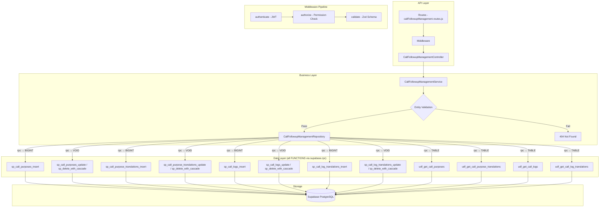

# GrowUpMore API — Call Follow-up Management Module

## Postman Testing Guide

**Base URL:** `http://localhost:5001`
**API Prefix:** `/api/v1/call-followup-management`
**Content-Type:** `application/json`
**Authentication:** All endpoints require `Bearer <access_token>` in Authorization header

---

## Architecture Flow



---

## Prerequisites

Before testing, ensure:

1. **Authentication**: Login via `POST /api/v1/auth/login` to obtain `access_token`
2. **Permissions**: Run `phase27_call_follow_ups_permissions_seed.sql` in Supabase SQL Editor
3. **Master Data**: Students, Users (call agents), and Courses exist (from earlier phases)
4. **Parent Records**:
   - Call Purposes must be created before creating Call Logs
   - Call Purpose Translations require valid Call Purposes
   - Call Logs require valid Students and Users (calledBy)
   - Call Log Translations require valid Call Logs

---

## Complete Endpoint Reference

### Test Order (follow this sequence in Postman)

| # | Endpoint | Permission | Purpose |
|---|----------|-----------|---------|
| 1 | `GET /call-purposes` | `call_purpose.read` | List all call purposes |
| 2 | `POST /call-purposes` | `call_purpose.create` | Create a new call purpose |
| 3 | `GET /call-purposes/:id` | `call_purpose.read` | Get call purpose by ID |
| 4 | `PATCH /call-purposes/:id` | `call_purpose.update` | Update call purpose details |
| 5 | `POST /call-purposes/:id/translations` | `call_purpose.create` | Create purpose translation |
| 6 | `PATCH /purpose-translations/:id` | `call_purpose.update` | Update translation |
| 7 | `DELETE /purpose-translations/:id` | `call_purpose.delete` | Delete translation |
| 8 | `POST /purpose-translations/:id/restore` | `call_purpose.delete` | Restore translation |
| 9 | `DELETE /call-purposes/:id` | `call_purpose.delete` | Soft delete purpose |
| 10 | `POST /call-purposes/:id/restore` | `call_purpose.delete` | Restore purpose |
| 11 | `GET /call-purposes/json` | `call_purpose.read` | Get purposes as JSON |
| 12 | `POST /call-purposes/bulk-delete` | `call_purpose.delete` | Bulk delete purposes |
| 13 | `POST /call-purposes/bulk-restore` | `call_purpose.delete` | Bulk restore purposes |
| 14 | `GET /call-logs` | `call_log.read` | List all call logs |
| 15 | `POST /call-logs` | `call_log.create` | Create a new call log |
| 16 | `GET /call-logs/:id` | `call_log.read` | Get call log by ID |
| 17 | `PATCH /call-logs/:id` | `call_log.update` | Update call log details |
| 18 | `POST /call-logs/:id/translations` | `call_log.create` | Create log translation |
| 19 | `PATCH /log-translations/:id` | `call_log.update` | Update log translation |
| 20 | `DELETE /log-translations/:id` | `call_log.delete` | Delete log translation |
| 21 | `POST /log-translations/:id/restore` | `call_log.delete` | Restore log translation |
| 22 | `DELETE /call-logs/:id` | `call_log.delete` | Soft delete call log |
| 23 | `POST /call-logs/:id/restore` | `call_log.delete` | Restore call log |
| 24 | `GET /call-logs/json` | `call_log.read` | Get logs as JSON |
| 25 | `POST /call-logs/bulk-delete` | `call_log.delete` | Bulk delete logs |
| 26 | `POST /call-logs/bulk-restore` | `call_log.delete` | Bulk restore logs |

---

## Common Headers (All Requests)

| Key | Value |
|-----|-------|
| Authorization | Bearer `<access_token>` |
| Content-Type | `application/json` |

---

## 1. CALL PURPOSES

### 1.1 List Call Purposes

**`GET /api/v1/call-followup-management/call-purposes`**

**Permission:** `call_purpose.read`

**Headers:**
```
Authorization: Bearer {{access_token}}
Content-Type: application/json
```

**Query Parameters:**

| Parameter | Type | Description |
|-----------|------|-------------|
| page | integer | Page number (default: 1) |
| limit | integer | Results per page (default: 25, max: 100) |
| search | string | Search term for name/code |
| sortBy | string | Sort field (default: `display_order`) |
| sortDir | string | Sort direction: `ASC` or `DESC` (default: ASC) |

**Example:**
```
GET /api/v1/call-followup-management/call-purposes?page=1&limit=10&search=feedback&sortBy=display_order&sortDir=ASC
```

**Expected Response (200):**
```json
{
  "success": true,
  "message": "Call purposes retrieved successfully",
  "data": [
    {
      "id": 1,
      "name": "Admission Inquiry",
      "code": "ADMISSION_INQUIRY",
      "displayOrder": 1,
      "isActive": true,
      "createdAt": "2026-04-01T08:00:00Z",
      "updatedAt": "2026-04-01T08:00:00Z"
    },
    {
      "id": 2,
      "name": "Course Feedback",
      "code": "FEEDBACK",
      "displayOrder": 2,
      "isActive": true,
      "createdAt": "2026-04-02T08:00:00Z",
      "updatedAt": "2026-04-02T08:00:00Z"
    }
  ],
  "pagination": {
    "page": 1,
    "limit": 10,
    "total": 2,
    "pages": 1
  }
}
```

**Postman Tests:**
```javascript
pm.test("Status is 200", () => pm.response.to.have.status(200));
const json = pm.response.json();
pm.test("Response has data array", () => pm.expect(json.data).to.be.an("array"));
pm.test("Pagination info exists", () => pm.expect(json.pagination).to.exist);
if (json.data.length > 0) {
  pm.collectionVariables.set("callPurposeId", json.data[0].id);
}
```

---

### 1.2 Create Call Purpose

**`POST /api/v1/call-followup-management/call-purposes`**

**Permission:** `call_purpose.create`

**Headers:**
```
Authorization: Bearer {{access_token}}
Content-Type: application/json
```

**Request Body:**

| Field | Type | Required | Description |
|-------|------|----------|-------------|
| name | string | Yes | Purpose name (max 500 chars) |
| code | string | No | Purpose code (max 100 chars) |
| displayOrder | number | No | Display order (default: 0) |
| isActive | boolean | No | Whether purpose is active (default: true) |

**Example Request:**
```json
{
  "name": "Admission Inquiry",
  "code": "ADMISSION_INQUIRY",
  "displayOrder": 1,
  "isActive": true
}
```

**Expected Response (201):**
```json
{
  "success": true,
  "message": "Call purpose created successfully",
  "data": {
    "id": 1,
    "name": "Admission Inquiry",
    "code": "ADMISSION_INQUIRY",
    "displayOrder": 1,
    "isActive": true,
    "createdAt": "2026-04-06T09:00:00Z",
    "updatedAt": "2026-04-06T09:00:00Z"
  }
}
```

**Postman Tests:**
```javascript
pm.test("Status is 201", () => pm.response.to.have.status(201));
const json = pm.response.json();
pm.test("Has purpose ID", () => pm.expect(json.data.id).to.be.a("number"));
pm.test("Name matches request", () => pm.expect(json.data.name).to.equal("Admission Inquiry"));
pm.collectionVariables.set("callPurposeId", json.data.id);
```

---

### 1.3 Get Call Purpose by ID

**`GET /api/v1/call-followup-management/call-purposes/:id`**

**Permission:** `call_purpose.read`

**Headers:**
```
Authorization: Bearer {{access_token}}
Content-Type: application/json
```

**Example:** `GET /api/v1/call-followup-management/call-purposes/{{callPurposeId}}`

**Expected Response (200):**
```json
{
  "success": true,
  "message": "Call purpose retrieved successfully",
  "data": {
    "id": 1,
    "name": "Admission Inquiry",
    "code": "ADMISSION_INQUIRY",
    "displayOrder": 1,
    "isActive": true,
    "createdAt": "2026-04-06T09:00:00Z",
    "updatedAt": "2026-04-06T09:00:00Z"
  }
}
```

**Postman Tests:**
```javascript
pm.test("Status is 200", () => pm.response.to.have.status(200));
const json = pm.response.json();
pm.test("Has purpose data", () => pm.expect(json.data.id).to.be.a("number"));
pm.test("Data has required fields", () => pm.expect(json.data.name).to.exist);
```

---

### 1.4 Update Call Purpose

**`PATCH /api/v1/call-followup-management/call-purposes/:id`**

**Permission:** `call_purpose.update`

**Headers:**
```
Authorization: Bearer {{access_token}}
Content-Type: application/json
```

**Example:** `PATCH /api/v1/call-followup-management/call-purposes/{{callPurposeId}}`

**Request Body:**

| Field | Type | Required | Description |
|-------|------|----------|-------------|
| name | string | No | Updated purpose name |
| code | string | No | Updated purpose code |
| displayOrder | number | No | Updated display order |
| isActive | boolean | No | Updated active status |

**Example Request:**
```json
{
  "displayOrder": 2,
  "isActive": true
}
```

**Expected Response (200):**
```json
{
  "success": true,
  "message": "Call purpose updated successfully",
  "data": {
    "id": 1,
    "name": "Admission Inquiry",
    "code": "ADMISSION_INQUIRY",
    "displayOrder": 2,
    "isActive": true,
    "createdAt": "2026-04-06T09:00:00Z",
    "updatedAt": "2026-04-06T10:30:00Z"
  }
}
```

**Postman Tests:**
```javascript
pm.test("Status is 200", () => pm.response.to.have.status(200));
const json = pm.response.json();
pm.test("Display order updated", () => pm.expect(json.data.displayOrder).to.equal(2));
pm.test("UpdatedAt timestamp changed", () => pm.expect(json.data.updatedAt).to.exist);
```

---

## 2. CALL PURPOSE TRANSLATIONS

### 2.1 Create Call Purpose Translation

**`POST /api/v1/call-followup-management/call-purposes/:callPurposeId/translations`**

**Permission:** `call_purpose.create`

**Headers:**
```
Authorization: Bearer {{access_token}}
Content-Type: application/json
```

**Example:** `POST /api/v1/call-followup-management/call-purposes/{{callPurposeId}}/translations`

**Request Body:**

| Field | Type | Required | Description |
|-------|------|----------|-------------|
| languageId | integer | Yes | ID of the language |
| name | string | Yes | Translated purpose name (max 500 chars) |
| description | string | No | Translated description (max 2000 chars) |

**Example Request:**
```json
{
  "languageId": 1,
  "name": "Consulta de Admisión",
  "description": "Llamada de seguimiento para consultas de admisión"
}
```

**Expected Response (201):**
```json
{
  "success": true,
  "message": "Call purpose translation created successfully",
  "data": {
    "id": 101,
    "callPurposeId": 1,
    "languageId": 1,
    "name": "Consulta de Admisión",
    "description": "Llamada de seguimiento para consultas de admisión",
    "createdAt": "2026-04-06T10:00:00Z",
    "updatedAt": "2026-04-06T10:00:00Z"
  }
}
```

**Postman Tests:**
```javascript
pm.test("Status is 201", () => pm.response.to.have.status(201));
const json = pm.response.json();
pm.test("Has translation ID", () => pm.expect(json.data.id).to.be.a("number"));
pm.test("Name matches request", () => pm.expect(json.data.name).to.equal("Consulta de Admisión"));
pm.collectionVariables.set("purposeTranslationId", json.data.id);
```

---

### 2.2 Update Call Purpose Translation

**`PATCH /api/v1/call-followup-management/purpose-translations/:id`**

**Permission:** `call_purpose.update`

**Headers:**
```
Authorization: Bearer {{access_token}}
Content-Type: application/json
```

**Example:** `PATCH /api/v1/call-followup-management/purpose-translations/{{purposeTranslationId}}`

**Request Body:**

| Field | Type | Required | Description |
|-------|------|----------|-------------|
| name | string | No | Updated translated name |
| description | string | No | Updated translated description |

**Example Request:**
```json
{
  "description": "Llamada de seguimiento para nuevas consultas de admisión"
}
```

**Expected Response (200):**
```json
{
  "success": true,
  "message": "Call purpose translation updated successfully",
  "data": {
    "id": 101,
    "callPurposeId": 1,
    "languageId": 1,
    "name": "Consulta de Admisión",
    "description": "Llamada de seguimiento para nuevas consultas de admisión",
    "createdAt": "2026-04-06T10:00:00Z",
    "updatedAt": "2026-04-06T11:00:00Z"
  }
}
```

**Postman Tests:**
```javascript
pm.test("Status is 200", () => pm.response.to.have.status(200));
const json = pm.response.json();
pm.test("Description updated", () => pm.expect(json.data.description).to.include("nuevas"));
```

---

### 2.3 Delete Call Purpose Translation

**`DELETE /api/v1/call-followup-management/purpose-translations/:id`**

**Permission:** `call_purpose.delete`

**Headers:**
```
Authorization: Bearer {{access_token}}
```

**Example:** `DELETE /api/v1/call-followup-management/purpose-translations/{{purposeTranslationId}}`

**Expected Response (200):**
```json
{
  "success": true,
  "message": "Call purpose translation deleted successfully",
  "data": {
    "id": 101,
    "deletedAt": "2026-04-06T12:00:00Z"
  }
}
```

**Postman Tests:**
```javascript
pm.test("Status is 200", () => pm.response.to.have.status(200));
const json = pm.response.json();
pm.test("Has deleted ID", () => pm.expect(json.data.id).to.be.a("number"));
pm.test("Has deletedAt timestamp", () => pm.expect(json.data.deletedAt).to.exist);
```

---

### 2.4 Restore Call Purpose Translation

**`POST /api/v1/call-followup-management/purpose-translations/:id/restore`**

**Permission:** `call_purpose.delete`

**Headers:**
```
Authorization: Bearer {{access_token}}
Content-Type: application/json
```

**Example:** `POST /api/v1/call-followup-management/purpose-translations/{{purposeTranslationId}}/restore`

**Request Body:**
```json
{}
```

**Expected Response (200):**
```json
{
  "success": true,
  "message": "Call purpose translation restored successfully",
  "data": {
    "id": 101,
    "callPurposeId": 1,
    "languageId": 1,
    "name": "Consulta de Admisión",
    "description": "Llamada de seguimiento para nuevas consultas de admisión",
    "createdAt": "2026-04-06T10:00:00Z",
    "updatedAt": "2026-04-06T11:00:00Z",
    "restoredAt": "2026-04-06T12:15:00Z"
  }
}
```

**Postman Tests:**
```javascript
pm.test("Status is 200", () => pm.response.to.have.status(200));
const json = pm.response.json();
pm.test("Translation restored with restoredAt", () => pm.expect(json.data.restoredAt).to.exist);
```

---

### 2.5 Delete Call Purpose (Cascades to Translations)

**`DELETE /api/v1/call-followup-management/call-purposes/:id`**

**Permission:** `call_purpose.delete`

**Headers:**
```
Authorization: Bearer {{access_token}}
```

**Example:** `DELETE /api/v1/call-followup-management/call-purposes/{{callPurposeId}}`

**Expected Response (200):**
```json
{
  "success": true,
  "message": "Call purpose deleted successfully",
  "data": {
    "id": 1,
    "deletedAt": "2026-04-06T12:00:00Z"
  }
}
```

**Postman Tests:**
```javascript
pm.test("Status is 200", () => pm.response.to.have.status(200));
const json = pm.response.json();
pm.test("Soft delete successful", () => pm.expect(json.data.deletedAt).to.exist);
```

---

### 2.6 Restore Call Purpose

**`POST /api/v1/call-followup-management/call-purposes/:id/restore`**

**Permission:** `call_purpose.delete`

**Headers:**
```
Authorization: Bearer {{access_token}}
Content-Type: application/json
```

**Example:** `POST /api/v1/call-followup-management/call-purposes/{{callPurposeId}}/restore`

**Request Body:**
```json
{}
```

**Expected Response (200):**
```json
{
  "success": true,
  "message": "Call purpose restored successfully",
  "data": {
    "id": 1,
    "name": "Admission Inquiry",
    "code": "ADMISSION_INQUIRY",
    "displayOrder": 2,
    "isActive": true,
    "createdAt": "2026-04-06T09:00:00Z",
    "updatedAt": "2026-04-06T10:30:00Z",
    "restoredAt": "2026-04-06T12:15:00Z"
  }
}
```

**Postman Tests:**
```javascript
pm.test("Status is 200", () => pm.response.to.have.status(200));
const json = pm.response.json();
pm.test("Purpose restored", () => pm.expect(json.data.restoredAt).to.exist);
```

---

### 2.7 Get Call Purposes as JSON

**`GET /api/v1/call-followup-management/call-purposes/json`**

**Permission:** `call_purpose.read`

**Headers:**
```
Authorization: Bearer {{access_token}}
Content-Type: application/json
```

**Expected Response (200):**
```json
{
  "success": true,
  "message": "Call purposes retrieved successfully",
  "data": {
    "1": {
      "id": 1,
      "name": "Admission Inquiry",
      "code": "ADMISSION_INQUIRY",
      "displayOrder": 1,
      "isActive": true
    },
    "2": {
      "id": 2,
      "name": "Course Feedback",
      "code": "FEEDBACK",
      "displayOrder": 2,
      "isActive": true
    }
  }
}
```

**Postman Tests:**
```javascript
pm.test("Status is 200", () => pm.response.to.have.status(200));
const json = pm.response.json();
pm.test("Data is object", () => pm.expect(json.data).to.be.an("object"));
```

---

### 2.8 Bulk Delete Call Purposes

**`POST /api/v1/call-followup-management/call-purposes/bulk-delete`**

**Permission:** `call_purpose.delete`

**Headers:**
```
Authorization: Bearer {{access_token}}
Content-Type: application/json
```

**Request Body:**

| Field | Type | Required | Description |
|-------|------|----------|-------------|
| ids | array | Yes | Array of purpose IDs to delete |

**Example Request:**
```json
{
  "ids": [1, 2]
}
```

**Expected Response (200):**
```json
{
  "success": true,
  "message": "Call purposes deleted successfully",
  "data": {
    "deletedCount": 2,
    "deletedIds": [1, 2]
  }
}
```

**Postman Tests:**
```javascript
pm.test("Status is 200", () => pm.response.to.have.status(200));
const json = pm.response.json();
pm.test("Deleted count matches request", () => pm.expect(json.data.deletedCount).to.equal(2));
```

---

### 2.9 Bulk Restore Call Purposes

**`POST /api/v1/call-followup-management/call-purposes/bulk-restore`**

**Permission:** `call_purpose.delete`

**Headers:**
```
Authorization: Bearer {{access_token}}
Content-Type: application/json
```

**Request Body:**

| Field | Type | Required | Description |
|-------|------|----------|-------------|
| ids | array | Yes | Array of purpose IDs to restore |

**Example Request:**
```json
{
  "ids": [1, 2]
}
```

**Expected Response (200):**
```json
{
  "success": true,
  "message": "Call purposes restored successfully",
  "data": {
    "restoredCount": 2,
    "restoredIds": [1, 2]
  }
}
```

**Postman Tests:**
```javascript
pm.test("Status is 200", () => pm.response.to.have.status(200));
const json = pm.response.json();
pm.test("Restored count matches request", () => pm.expect(json.data.restoredCount).to.equal(2));
```

---

## 3. CALL LOGS

### 3.1 List Call Logs

**`GET /api/v1/call-followup-management/call-logs`**

**Permission:** `call_log.read`

**Headers:**
```
Authorization: Bearer {{access_token}}
Content-Type: application/json
```

**Query Parameters:**

| Parameter | Type | Description |
|-----------|------|-------------|
| page | integer | Page number (default: 1) |
| limit | integer | Results per page (default: 25, max: 100) |
| studentId | integer | Filter by student ID |
| calledBy | integer | Filter by user ID (call agent) |
| purposeId | integer | Filter by call purpose ID |
| callType | string | Filter by type: `outbound`, `inbound` |
| callStatus | string | Filter by status: `scheduled`, `attempted`, `connected`, `no_answer`, `busy`, `voicemail`, `completed` |
| outcome | string | Filter by outcome: `interested`, `not_interested`, `callback_requested`, `enrolled`, `issue_resolved`, `escalated`, `wrong_number`, `unreachable` |
| scheduledAfter | date | Filter for calls scheduled after date (YYYY-MM-DD) |
| scheduledBefore | date | Filter for calls scheduled before date (YYYY-MM-DD) |
| sortBy | string | Sort field (default: `created_at`) |
| sortDir | string | Sort direction: `ASC` or `DESC` (default: DESC) |

**Example:**
```
GET /api/v1/call-followup-management/call-logs?page=1&limit=10&studentId=101&callType=outbound&sortBy=created_at&sortDir=DESC
```

**Expected Response (200):**
```json
{
  "success": true,
  "message": "Call logs retrieved successfully",
  "data": [
    {
      "id": 1001,
      "studentId": 101,
      "calledBy": 501,
      "purposeId": 1,
      "previousCallId": null,
      "followUpNumber": 1,
      "callType": "outbound",
      "callStatus": "completed",
      "scheduledAt": "2026-04-05T14:00:00Z",
      "calledAt": "2026-04-05T14:05:00Z",
      "durationSeconds": 420,
      "phoneNumberUsed": "+1-555-0100",
      "courseId": 501,
      "batchId": null,
      "orderId": 2001,
      "ticketId": null,
      "outcome": "interested",
      "nextFollowUpDate": "2026-04-12",
      "nextAction": "Send course details via email",
      "isActive": true,
      "createdAt": "2026-04-05T14:05:00Z",
      "updatedAt": "2026-04-05T14:05:00Z"
    }
  ],
  "pagination": {
    "page": 1,
    "limit": 10,
    "total": 1,
    "pages": 1
  }
}
```

**Postman Tests:**
```javascript
pm.test("Status is 200", () => pm.response.to.have.status(200));
const json = pm.response.json();
pm.test("Response has data array", () => pm.expect(json.data).to.be.an("array"));
pm.test("Pagination info exists", () => pm.expect(json.pagination).to.exist);
if (json.data.length > 0) {
  pm.collectionVariables.set("callLogId", json.data[0].id);
}
```

---

### 3.2 Create Call Log

**`POST /api/v1/call-followup-management/call-logs`**

**Permission:** `call_log.create`

**Headers:**
```
Authorization: Bearer {{access_token}}
Content-Type: application/json
```

**Request Body:**

| Field | Type | Required | Description |
|-------|------|----------|-------------|
| studentId | integer | Yes | ID of the student |
| calledBy | integer | Yes | ID of user making the call |
| purposeId | integer | No | Call purpose ID |
| previousCallId | integer | No | Previous call ID (for follow-ups) |
| followUpNumber | integer | No | Follow-up sequence number (default: 1) |
| callType | string | No | Type: `outbound`, `inbound` (default: `outbound`) |
| callStatus | string | No | Status: `scheduled`, `attempted`, `connected`, `no_answer`, `busy`, `voicemail`, `completed` (default: `scheduled`) |
| scheduledAt | datetime | No | Scheduled call time (ISO 8601) |
| calledAt | datetime | No | Actual call time (ISO 8601) |
| durationSeconds | integer | No | Call duration in seconds |
| phoneNumberUsed | string | No | Phone number used (max 20 chars) |
| courseId | integer | No | Associated course ID |
| batchId | integer | No | Associated batch ID |
| orderId | integer | No | Associated order ID |
| ticketId | integer | No | Associated ticket ID |
| outcome | string | No | Outcome: `interested`, `not_interested`, `callback_requested`, `enrolled`, `issue_resolved`, `escalated`, `wrong_number`, `unreachable` |
| nextFollowUpDate | date | No | Next follow-up date (YYYY-MM-DD) |
| nextAction | string | No | Next action description (max 2000 chars) |

**Example Request:**
```json
{
  "studentId": 101,
  "calledBy": 501,
  "purposeId": 1,
  "callType": "outbound",
  "callStatus": "scheduled",
  "scheduledAt": "2026-04-05T14:00:00Z",
  "courseId": 501,
  "orderId": 2001,
  "outcome": null,
  "nextFollowUpDate": "2026-04-12",
  "nextAction": "Send course details"
}
```

**Expected Response (201):**
```json
{
  "success": true,
  "message": "Call log created successfully",
  "data": {
    "id": 1001,
    "studentId": 101,
    "calledBy": 501,
    "purposeId": 1,
    "previousCallId": null,
    "followUpNumber": 1,
    "callType": "outbound",
    "callStatus": "scheduled",
    "scheduledAt": "2026-04-05T14:00:00Z",
    "calledAt": null,
    "durationSeconds": null,
    "phoneNumberUsed": null,
    "courseId": 501,
    "batchId": null,
    "orderId": 2001,
    "ticketId": null,
    "outcome": null,
    "nextFollowUpDate": "2026-04-12",
    "nextAction": "Send course details",
    "isActive": true,
    "createdAt": "2026-04-06T09:00:00Z",
    "updatedAt": "2026-04-06T09:00:00Z"
  }
}
```

**Postman Tests:**
```javascript
pm.test("Status is 201", () => pm.response.to.have.status(201));
const json = pm.response.json();
pm.test("Has call log ID", () => pm.expect(json.data.id).to.be.a("number"));
pm.test("Student ID matches request", () => pm.expect(json.data.studentId).to.equal(101));
pm.test("Call status is scheduled", () => pm.expect(json.data.callStatus).to.equal("scheduled"));
pm.collectionVariables.set("callLogId", json.data.id);
```

---

### 3.3 Get Call Log by ID

**`GET /api/v1/call-followup-management/call-logs/:id`**

**Permission:** `call_log.read`

**Headers:**
```
Authorization: Bearer {{access_token}}
Content-Type: application/json
```

**Example:** `GET /api/v1/call-followup-management/call-logs/{{callLogId}}`

**Expected Response (200):**
```json
{
  "success": true,
  "message": "Call log retrieved successfully",
  "data": {
    "id": 1001,
    "studentId": 101,
    "calledBy": 501,
    "purposeId": 1,
    "previousCallId": null,
    "followUpNumber": 1,
    "callType": "outbound",
    "callStatus": "scheduled",
    "scheduledAt": "2026-04-05T14:00:00Z",
    "calledAt": null,
    "durationSeconds": null,
    "phoneNumberUsed": null,
    "courseId": 501,
    "batchId": null,
    "orderId": 2001,
    "ticketId": null,
    "outcome": null,
    "nextFollowUpDate": "2026-04-12",
    "nextAction": "Send course details",
    "isActive": true,
    "createdAt": "2026-04-06T09:00:00Z",
    "updatedAt": "2026-04-06T09:00:00Z"
  }
}
```

**Postman Tests:**
```javascript
pm.test("Status is 200", () => pm.response.to.have.status(200));
const json = pm.response.json();
pm.test("Has call log data", () => pm.expect(json.data.id).to.be.a("number"));
pm.test("Call log has required fields", () => pm.expect(json.data.studentId).to.exist);
```

---

### 3.4 Update Call Log

**`PATCH /api/v1/call-followup-management/call-logs/:id`**

**Permission:** `call_log.update`

**Headers:**
```
Authorization: Bearer {{access_token}}
Content-Type: application/json
```

**Example:** `PATCH /api/v1/call-followup-management/call-logs/{{callLogId}}`

**Request Body:**

| Field | Type | Required | Description |
|-------|------|----------|-------------|
| purposeId | integer | No | Call purpose ID |
| previousCallId | integer | No | Previous call ID |
| followUpNumber | integer | No | Follow-up number |
| callType | string | No | Call type |
| callStatus | string | No | Call status |
| scheduledAt | datetime | No | Scheduled time |
| calledAt | datetime | No | Actual call time |
| durationSeconds | integer | No | Duration in seconds |
| phoneNumberUsed | string | No | Phone number used |
| outcome | string | No | Call outcome |
| nextFollowUpDate | date | No | Next follow-up date |
| nextAction | string | No | Next action description |
| isActive | boolean | No | Active status |

**Example Request:**
```json
{
  "callStatus": "completed",
  "calledAt": "2026-04-05T14:05:00Z",
  "durationSeconds": 420,
  "outcome": "interested",
  "nextAction": "Send course materials via email"
}
```

**Expected Response (200):**
```json
{
  "success": true,
  "message": "Call log updated successfully",
  "data": {
    "id": 1001,
    "studentId": 101,
    "calledBy": 501,
    "purposeId": 1,
    "previousCallId": null,
    "followUpNumber": 1,
    "callType": "outbound",
    "callStatus": "completed",
    "scheduledAt": "2026-04-05T14:00:00Z",
    "calledAt": "2026-04-05T14:05:00Z",
    "durationSeconds": 420,
    "phoneNumberUsed": null,
    "courseId": 501,
    "batchId": null,
    "orderId": 2001,
    "ticketId": null,
    "outcome": "interested",
    "nextFollowUpDate": "2026-04-12",
    "nextAction": "Send course materials via email",
    "isActive": true,
    "createdAt": "2026-04-06T09:00:00Z",
    "updatedAt": "2026-04-06T10:30:00Z"
  }
}
```

**Postman Tests:**
```javascript
pm.test("Status is 200", () => pm.response.to.have.status(200));
const json = pm.response.json();
pm.test("Call status updated", () => pm.expect(json.data.callStatus).to.equal("completed"));
pm.test("Outcome updated", () => pm.expect(json.data.outcome).to.equal("interested"));
pm.test("Duration set", () => pm.expect(json.data.durationSeconds).to.equal(420));
```

---

## 4. CALL LOG TRANSLATIONS

### 4.1 Create Call Log Translation

**`POST /api/v1/call-followup-management/call-logs/:callLogId/translations`**

**Permission:** `call_log.create`

**Headers:**
```
Authorization: Bearer {{access_token}}
Content-Type: application/json
```

**Example:** `POST /api/v1/call-followup-management/call-logs/{{callLogId}}/translations`

**Request Body:**

| Field | Type | Required | Description |
|-------|------|----------|-------------|
| languageId | integer | Yes | ID of the language |
| summary | string | No | Call summary in language (max 2000 chars) |
| studentResponse | string | No | Student response in language (max 2000 chars) |
| internalNotes | string | No | Internal notes in language (max 5000 chars) |

**Example Request:**
```json
{
  "languageId": 1,
  "summary": "Estudiante interesado en la inscripción",
  "studentResponse": "El estudiante preguntó sobre plazos y costos",
  "internalNotes": "Seguimiento: enviar detalles del curso por correo"
}
```

**Expected Response (201):**
```json
{
  "success": true,
  "message": "Call log translation created successfully",
  "data": {
    "id": 201,
    "callLogId": 1001,
    "languageId": 1,
    "summary": "Estudiante interesado en la inscripción",
    "studentResponse": "El estudiante preguntó sobre plazos y costos",
    "internalNotes": "Seguimiento: enviar detalles del curso por correo",
    "createdAt": "2026-04-06T10:00:00Z",
    "updatedAt": "2026-04-06T10:00:00Z"
  }
}
```

**Postman Tests:**
```javascript
pm.test("Status is 201", () => pm.response.to.have.status(201));
const json = pm.response.json();
pm.test("Has translation ID", () => pm.expect(json.data.id).to.be.a("number"));
pm.test("Language ID matches request", () => pm.expect(json.data.languageId).to.equal(1));
pm.collectionVariables.set("callLogTranslationId", json.data.id);
```

---

### 4.2 Update Call Log Translation

**`PATCH /api/v1/call-followup-management/log-translations/:id`**

**Permission:** `call_log.update`

**Headers:**
```
Authorization: Bearer {{access_token}}
Content-Type: application/json
```

**Example:** `PATCH /api/v1/call-followup-management/log-translations/{{callLogTranslationId}}`

**Request Body:**

| Field | Type | Required | Description |
|-------|------|----------|-------------|
| summary | string | No | Updated summary |
| studentResponse | string | No | Updated student response |
| internalNotes | string | No | Updated internal notes |

**Example Request:**
```json
{
  "internalNotes": "Seguimiento completado: se enviaron todos los materiales del curso"
}
```

**Expected Response (200):**
```json
{
  "success": true,
  "message": "Call log translation updated successfully",
  "data": {
    "id": 201,
    "callLogId": 1001,
    "languageId": 1,
    "summary": "Estudiante interesado en la inscripción",
    "studentResponse": "El estudiante preguntó sobre plazos y costos",
    "internalNotes": "Seguimiento completado: se enviaron todos los materiales del curso",
    "createdAt": "2026-04-06T10:00:00Z",
    "updatedAt": "2026-04-06T11:00:00Z"
  }
}
```

**Postman Tests:**
```javascript
pm.test("Status is 200", () => pm.response.to.have.status(200));
const json = pm.response.json();
pm.test("Internal notes updated", () => pm.expect(json.data.internalNotes).to.include("completado"));
```

---

### 4.3 Delete Call Log Translation

**`DELETE /api/v1/call-followup-management/log-translations/:id`**

**Permission:** `call_log.delete`

**Headers:**
```
Authorization: Bearer {{access_token}}
```

**Example:** `DELETE /api/v1/call-followup-management/log-translations/{{callLogTranslationId}}`

**Expected Response (200):**
```json
{
  "success": true,
  "message": "Call log translation deleted successfully",
  "data": {
    "id": 201,
    "deletedAt": "2026-04-06T12:00:00Z"
  }
}
```

**Postman Tests:**
```javascript
pm.test("Status is 200", () => pm.response.to.have.status(200));
const json = pm.response.json();
pm.test("Has deleted ID", () => pm.expect(json.data.id).to.be.a("number"));
pm.test("Has deletedAt timestamp", () => pm.expect(json.data.deletedAt).to.exist);
```

---

### 4.4 Restore Call Log Translation

**`POST /api/v1/call-followup-management/log-translations/:id/restore`**

**Permission:** `call_log.delete`

**Headers:**
```
Authorization: Bearer {{access_token}}
Content-Type: application/json
```

**Example:** `POST /api/v1/call-followup-management/log-translations/{{callLogTranslationId}}/restore`

**Request Body:**
```json
{}
```

**Expected Response (200):**
```json
{
  "success": true,
  "message": "Call log translation restored successfully",
  "data": {
    "id": 201,
    "callLogId": 1001,
    "languageId": 1,
    "summary": "Estudiante interesado en la inscripción",
    "studentResponse": "El estudiante preguntó sobre plazos y costos",
    "internalNotes": "Seguimiento completado: se enviaron todos los materiales del curso",
    "createdAt": "2026-04-06T10:00:00Z",
    "updatedAt": "2026-04-06T11:00:00Z",
    "restoredAt": "2026-04-06T12:15:00Z"
  }
}
```

**Postman Tests:**
```javascript
pm.test("Status is 200", () => pm.response.to.have.status(200));
const json = pm.response.json();
pm.test("Translation restored with restoredAt", () => pm.expect(json.data.restoredAt).to.exist);
```

---

### 4.5 Delete Call Log (Cascades to Translations)

**`DELETE /api/v1/call-followup-management/call-logs/:id`**

**Permission:** `call_log.delete`

**Headers:**
```
Authorization: Bearer {{access_token}}
```

**Example:** `DELETE /api/v1/call-followup-management/call-logs/{{callLogId}}`

**Expected Response (200):**
```json
{
  "success": true,
  "message": "Call log deleted successfully",
  "data": {
    "id": 1001,
    "deletedAt": "2026-04-06T12:00:00Z"
  }
}
```

**Postman Tests:**
```javascript
pm.test("Status is 200", () => pm.response.to.have.status(200));
const json = pm.response.json();
pm.test("Soft delete successful", () => pm.expect(json.data.deletedAt).to.exist);
```

---

### 4.6 Restore Call Log

**`POST /api/v1/call-followup-management/call-logs/:id/restore`**

**Permission:** `call_log.delete`

**Headers:**
```
Authorization: Bearer {{access_token}}
Content-Type: application/json
```

**Example:** `POST /api/v1/call-followup-management/call-logs/{{callLogId}}/restore`

**Request Body:**
```json
{}
```

**Expected Response (200):**
```json
{
  "success": true,
  "message": "Call log restored successfully",
  "data": {
    "id": 1001,
    "studentId": 101,
    "calledBy": 501,
    "purposeId": 1,
    "previousCallId": null,
    "followUpNumber": 1,
    "callType": "outbound",
    "callStatus": "completed",
    "scheduledAt": "2026-04-05T14:00:00Z",
    "calledAt": "2026-04-05T14:05:00Z",
    "durationSeconds": 420,
    "phoneNumberUsed": null,
    "courseId": 501,
    "batchId": null,
    "orderId": 2001,
    "ticketId": null,
    "outcome": "interested",
    "nextFollowUpDate": "2026-04-12",
    "nextAction": "Send course materials via email",
    "isActive": true,
    "createdAt": "2026-04-06T09:00:00Z",
    "updatedAt": "2026-04-06T10:30:00Z",
    "restoredAt": "2026-04-06T12:15:00Z"
  }
}
```

**Postman Tests:**
```javascript
pm.test("Status is 200", () => pm.response.to.have.status(200));
const json = pm.response.json();
pm.test("Call log restored", () => pm.expect(json.data.restoredAt).to.exist);
```

---

### 4.7 Get Call Logs as JSON

**`GET /api/v1/call-followup-management/call-logs/json`**

**Permission:** `call_log.read`

**Headers:**
```
Authorization: Bearer {{access_token}}
Content-Type: application/json
```

**Query Parameters:**

| Parameter | Type | Description |
|-----------|------|-------------|
| studentId | integer | Filter by student ID (optional) |

**Expected Response (200):**
```json
{
  "success": true,
  "message": "Call logs retrieved successfully",
  "data": {
    "1001": {
      "id": 1001,
      "studentId": 101,
      "callType": "outbound",
      "callStatus": "completed",
      "outcome": "interested"
    },
    "1002": {
      "id": 1002,
      "studentId": 102,
      "callType": "inbound",
      "callStatus": "scheduled",
      "outcome": null
    }
  }
}
```

**Postman Tests:**
```javascript
pm.test("Status is 200", () => pm.response.to.have.status(200));
const json = pm.response.json();
pm.test("Data is object", () => pm.expect(json.data).to.be.an("object"));
```

---

### 4.8 Bulk Delete Call Logs

**`POST /api/v1/call-followup-management/call-logs/bulk-delete`**

**Permission:** `call_log.delete`

**Headers:**
```
Authorization: Bearer {{access_token}}
Content-Type: application/json
```

**Request Body:**

| Field | Type | Required | Description |
|-------|------|----------|-------------|
| ids | array | Yes | Array of call log IDs to delete |

**Example Request:**
```json
{
  "ids": [1001, 1002]
}
```

**Expected Response (200):**
```json
{
  "success": true,
  "message": "Call logs deleted successfully",
  "data": {
    "deletedCount": 2,
    "deletedIds": [1001, 1002]
  }
}
```

**Postman Tests:**
```javascript
pm.test("Status is 200", () => pm.response.to.have.status(200));
const json = pm.response.json();
pm.test("Deleted count matches request", () => pm.expect(json.data.deletedCount).to.equal(2));
```

---

### 4.9 Bulk Restore Call Logs

**`POST /api/v1/call-followup-management/call-logs/bulk-restore`**

**Permission:** `call_log.delete`

**Headers:**
```
Authorization: Bearer {{access_token}}
Content-Type: application/json
```

**Request Body:**

| Field | Type | Required | Description |
|-------|------|----------|-------------|
| ids | array | Yes | Array of call log IDs to restore |

**Example Request:**
```json
{
  "ids": [1001, 1002]
}
```

**Expected Response (200):**
```json
{
  "success": true,
  "message": "Call logs restored successfully",
  "data": {
    "restoredCount": 2,
    "restoredIds": [1001, 1002]
  }
}
```

**Postman Tests:**
```javascript
pm.test("Status is 200", () => pm.response.to.have.status(200));
const json = pm.response.json();
pm.test("Restored count matches request", () => pm.expect(json.data.restoredCount).to.equal(2));
```

---

## Enum Reference

### Call Type Values
- `outbound` - Outbound call made by staff
- `inbound` - Inbound call received from student

### Call Status Values
- `scheduled` - Call is scheduled
- `attempted` - Call was attempted
- `connected` - Call was connected
- `no_answer` - No answer from recipient
- `busy` - Line was busy
- `voicemail` - Voicemail was left
- `completed` - Call is completed

### Call Outcome Values
- `interested` - Student expressed interest
- `not_interested` - Student declined
- `callback_requested` - Student requested callback
- `enrolled` - Student enrolled in course
- `issue_resolved` - Support issue was resolved
- `escalated` - Issue escalated to management
- `wrong_number` - Invalid phone number
- `unreachable` - Contact unreachable

---

## Testing Workflow

### Standard Workflow
1. Authenticate and get `access_token`
2. Set up call purposes (1.1-1.2)
3. Create translations (2.1)
4. Create call logs (3.2)
5. Add log translations (4.1)
6. Update logs with outcomes (3.4, 4.2)
7. Test filtering and bulk operations
8. Test soft deletes and restores

### Permissions Matrix

| Action | Permission | Role Requirement |
|--------|-----------|------------------|
| List purposes | `call_purpose.read` | Advisor, Admin |
| Create purpose | `call_purpose.create` | Admin |
| Update purpose | `call_purpose.update` | Admin |
| Delete purpose | `call_purpose.delete` | Admin |
| Create log | `call_log.create` | Advisor, Admin |
| Update log | `call_log.update` | Advisor, Admin |
| Delete log | `call_log.delete` | Admin |

---

## Common Error Responses

### 400 Bad Request
```json
{
  "success": false,
  "message": "Validation error",
  "errors": [
    {
      "path": ["studentId"],
      "message": "Student ID must be a positive integer"
    }
  ]
}
```

### 403 Forbidden
```json
{
  "success": false,
  "message": "Insufficient permissions"
}
```

### 404 Not Found
```json
{
  "success": false,
  "message": "Call purpose not found"
}
```

### 500 Internal Server Error
```json
{
  "success": false,
  "message": "Internal server error",
  "errors": ["Database connection failed"]
}
```

---

## Notes

- All timestamps are in ISO 8601 format (UTC)
- Soft deletes preserve data for audit trails
- Translations allow multi-language support for purposes and notes
- Call logs track full history of student interactions
- Pagination uses standard cursor-based approach with page/limit/total/pages
- All endpoints are rate-limited to 100 requests per minute per user
