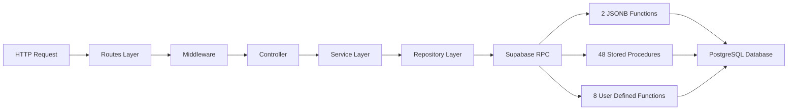

# GrowUpMore API — Blog Management Module

## Architecture Overview



## Prerequisites

- **Base URL:** `http://localhost:5001`
- **API Prefix:** `/api/v1/blog-management`
- **Authentication:** Bearer token in `Authorization` header
- **Postman Collections:** Import the Blog Management v1 collection
- **Environment Variables Required:**
  - `access_token` — Valid JWT token
  - `blogCategoryId` — Test category ID
  - `blogId` — Test blog ID
  - `contentBlockId` — Test content block ID
  - `blogTagId` — Test blog tag ID
  - `blogCommentId` — Test comment ID
  - `blogLikeId` — Test like ID
  - `blogFollowId` — Test follow ID
  - `relatedCourseId` — Test related course ID

## Complete Endpoint Reference

| # | Endpoint | Permission | Purpose |
|---|----------|-----------|---------|
| 1 | GET /blog-categories | blog_category.read | List categories with pagination |
| 2 | GET /blog-categories/json | blog_category.read | Export categories as JSON |
| 3 | POST /blog-categories/bulk-delete | blog_category.delete | Delete multiple categories |
| 4 | POST /blog-categories/bulk-restore | blog_category.restore | Restore multiple categories |
| 5 | GET /blog-categories/:id | blog_category.read | Get category by ID |
| 6 | POST /blog-categories | blog_category.create | Create new category |
| 7 | PATCH /blog-categories/:id | blog_category.update | Update category |
| 8 | DELETE /blog-categories/:id | blog_category.delete | Delete category |
| 9 | POST /blog-categories/:id/restore | blog_category.restore | Restore deleted category |
| 10 | POST /blog-categories/:categoryId/translations | blog_category.create | Create category translation |
| 11 | PATCH /category-translations/:id | blog_category.update | Update category translation |
| 12 | DELETE /category-translations/:id | blog_category.delete | Delete category translation |
| 13 | POST /category-translations/:id/restore | blog_category.restore | Restore category translation |
| 14 | GET /blogs | blog.read | List blogs with pagination |
| 15 | GET /blogs/json | blog.read | Export blogs as JSON |
| 16 | POST /blogs/bulk-delete | blog.delete | Delete multiple blogs |
| 17 | POST /blogs/bulk-restore | blog.restore | Restore multiple blogs |
| 18 | GET /blogs/:id | blog.read | Get blog by ID |
| 19 | POST /blogs | blog.create | Create new blog |
| 20 | PATCH /blogs/:id | blog.update | Update blog |
| 21 | DELETE /blogs/:id | blog.delete | Delete blog |
| 22 | POST /blogs/:id/restore | blog.restore | Restore deleted blog |
| 23 | POST /blogs/:blogId/translations | blog.create | Create blog translation |
| 24 | PATCH /blog-translations/:id | blog.update | Update blog translation |
| 25 | DELETE /blog-translations/:id | blog.delete | Delete blog translation |
| 26 | POST /blog-translations/:id/restore | blog.restore | Restore blog translation |
| 27 | GET /content-blocks | blog.read | List content blocks with pagination |
| 28 | POST /content-blocks/bulk-delete | blog.delete | Delete multiple content blocks |
| 29 | POST /content-blocks/bulk-restore | blog.restore | Restore multiple content blocks |
| 30 | GET /content-blocks/:id | blog.read | Get content block by ID |
| 31 | POST /content-blocks | blog.create | Create new content block |
| 32 | PATCH /content-blocks/:id | blog.update | Update content block |
| 33 | DELETE /content-blocks/:id | blog.delete | Delete content block |
| 34 | POST /content-blocks/:id/restore | blog.restore | Restore deleted content block |
| 35 | POST /content-blocks/:blockId/translations | blog.create | Create content block translation |
| 36 | PATCH /block-translations/:id | blog.update | Update content block translation |
| 37 | DELETE /block-translations/:id | blog.delete | Delete content block translation |
| 38 | POST /block-translations/:id/restore | blog.restore | Restore content block translation |
| 39 | GET /blog-tags | blog.read | List blog tags with pagination |
| 40 | POST /blog-tags/bulk-delete | blog.delete | Delete multiple tags |
| 41 | POST /blog-tags/bulk-restore | blog.restore | Restore multiple tags |
| 42 | GET /blog-tags/:id | blog.read | Get blog tag by ID |
| 43 | POST /blog-tags | blog.create | Create new blog tag |
| 44 | PATCH /blog-tags/:id | blog.update | Update blog tag |
| 45 | DELETE /blog-tags/:id | blog.delete | Delete blog tag |
| 46 | POST /blog-tags/:id/restore | blog.restore | Restore deleted blog tag |
| 47 | GET /blog-comments | blog_comment.read | List comments with pagination |
| 48 | POST /blog-comments/bulk-delete | blog_comment.delete | Delete multiple comments |
| 49 | POST /blog-comments/bulk-restore | blog_comment.restore | Restore multiple comments |
| 50 | GET /blog-comments/:id | blog_comment.read | Get comment by ID |
| 51 | POST /blog-comments | blog_comment.create | Create new comment |
| 52 | PATCH /blog-comments/:id | blog_comment.update | Update comment |
| 53 | DELETE /blog-comments/:id | blog_comment.delete | Delete comment |
| 54 | POST /blog-comments/:id/restore | blog_comment.restore | Restore deleted comment |
| 55 | POST /blog-comments/:commentId/translations | blog_comment.create | Create comment translation |
| 56 | PATCH /comment-translations/:id | blog_comment.update | Update comment translation |
| 57 | DELETE /comment-translations/:id | blog_comment.delete | Delete comment translation |
| 58 | POST /comment-translations/:id/restore | blog_comment.restore | Restore comment translation |
| 59 | GET /blog-likes | blog.read | List likes with pagination |
| 60 | GET /blog-likes/:id | blog.read | Get like by ID |
| 61 | POST /blog-likes | blog.create | Create new like |
| 62 | PATCH /blog-likes/:id | blog.update | Update like status |
| 63 | DELETE /blog-likes/:id | blog.delete | Delete like |
| 64 | POST /blog-likes/:id/restore | blog.restore | Restore deleted like |
| 65 | GET /blog-follows | blog.read | List follows with pagination |
| 66 | GET /blog-follows/:id | blog.read | Get follow by ID |
| 67 | POST /blog-follows | blog.create | Create new follow |
| 68 | PATCH /blog-follows/:id | blog.update | Update follow settings |
| 69 | DELETE /blog-follows/:id | blog.delete | Delete follow |
| 70 | POST /blog-follows/:id/restore | blog.restore | Restore deleted follow |
| 71 | GET /related-courses | blog.read | List related courses with pagination |
| 72 | POST /related-courses/bulk-delete | blog.delete | Delete multiple course links |
| 73 | POST /related-courses/bulk-restore | blog.restore | Restore multiple course links |
| 74 | GET /related-courses/:id | blog.read | Get related course by ID |
| 75 | POST /related-courses | blog.create | Create new related course link |
| 76 | PATCH /related-courses/:id | blog.update | Update related course link |
| 77 | DELETE /related-courses/:id | blog.delete | Delete related course link |
| 78 | POST /related-courses/:id/restore | blog.restore | Restore related course link |

## Common Headers

```
Authorization: Bearer {{access_token}}
Content-Type: application/json
Accept: application/json
```

---

## 1. BLOG CATEGORIES

### List Categories
**GET /blog-categories**

**Permission:** blog_category.read

**Headers:**
```
Authorization: Bearer {{access_token}}
Content-Type: application/json
```

**Query Parameters:**

| Parameter | Type | Description |
|-----------|------|-------------|
| page | integer | Page number (default: 1) |
| limit | integer | Items per page (default: 10) |
| parentCategoryId | integer | Filter by parent category |
| isActive | boolean | Filter by active status |
| searchTerm | string | Search in name/description |
| sortBy | string | Sort field (name, createdAt, displayOrder) |
| sortDir | string | asc or desc |

**Postman Test:**
```javascript
pm.test("Status is 200", () => pm.response.code === 200);
pm.test("Response has pagination", () => pm.response.json().pagination !== undefined);
pm.test("Items array exists", () => Array.isArray(pm.response.json().data));
```

---

### Export Categories to JSON
**GET /blog-categories/json**

**Permission:** blog_category.read

**Postman Test:**
```javascript
pm.test("Status is 200", () => pm.response.code === 200);
pm.test("Response is array", () => Array.isArray(pm.response.json()));
```

---

### Bulk Delete Categories
**POST /blog-categories/bulk-delete**

**Permission:** blog_category.delete

**Headers:**
```
Authorization: Bearer {{access_token}}
Content-Type: application/json
```

**Body:**

| Field | Type | Required | Example |
|-------|------|----------|---------|
| ids | array | Yes | [1, 2, 3] |

**Example Request:**
```json
{
  "ids": [1, 2, 3]
}
```

**Expected Response:**
```json
{
  "success": true,
  "deletedCount": 3
}
```

**Postman Test:**
```javascript
pm.test("Status is 200", () => pm.response.code === 200);
pm.test("Deleted count returned", () => pm.response.json().deletedCount > 0);
```

---

### Bulk Restore Categories
**POST /blog-categories/bulk-restore**

**Permission:** blog_category.restore

**Headers:**
```
Authorization: Bearer {{access_token}}
Content-Type: application/json
```

**Body:**

| Field | Type | Required | Example |
|-------|------|----------|---------|
| ids | array | Yes | [1, 2, 3] |

**Example Request:**
```json
{
  "ids": [1, 2, 3]
}
```

**Expected Response:**
```json
{
  "success": true,
  "restoredCount": 3
}
```

**Postman Test:**
```javascript
pm.test("Status is 200", () => pm.response.code === 200);
pm.test("Restored count returned", () => pm.response.json().restoredCount >= 0);
```

---

### Get Category by ID
**GET /blog-categories/:id**

**Permission:** blog_category.read

**Headers:**
```
Authorization: Bearer {{access_token}}
Content-Type: application/json
```

**URL Parameters:**

| Parameter | Type | Description |
|-----------|------|-------------|
| id | integer | Category ID |

**Expected Response:**
```json
{
  "id": 1,
  "name": "Technology",
  "code": "tech",
  "description": "Technology articles",
  "parentCategoryId": null,
  "displayOrder": 1,
  "icon": "icon-tech",
  "coverImageUrl": "https://example.com/image.jpg",
  "isActive": true,
  "createdAt": "2026-04-06T10:00:00Z",
  "updatedAt": "2026-04-06T10:00:00Z",
  "deletedAt": null
}
```

**Postman Test:**
```javascript
pm.test("Status is 200", () => pm.response.code === 200);
pm.test("Has id field", () => pm.response.json().id !== undefined);
pm.environment.set("blogCategoryId", pm.response.json().id);
```

---

### Create Category
**POST /blog-categories**

**Permission:** blog_category.create

**Headers:**
```
Authorization: Bearer {{access_token}}
Content-Type: application/json
```

**Body:**

| Field | Type | Required | Example |
|-------|------|----------|---------|
| name | string | Yes | "Technology" |
| code | string | No | "tech" |
| description | string | No | "Technology articles" |
| parentCategoryId | integer | No | null |
| displayOrder | integer | No | 1 |
| icon | string | No | "icon-tech" |
| coverImageUrl | string | No | "https://example.com/image.jpg" |
| isActive | boolean | No | true |

**Example Request:**
```json
{
  "name": "Technology",
  "code": "tech",
  "description": "Technology articles",
  "displayOrder": 1,
  "icon": "icon-tech",
  "coverImageUrl": "https://example.com/image.jpg",
  "isActive": true
}
```

**Expected Response:**
```json
{
  "id": 1,
  "name": "Technology",
  "code": "tech",
  "description": "Technology articles",
  "parentCategoryId": null,
  "displayOrder": 1,
  "icon": "icon-tech",
  "coverImageUrl": "https://example.com/image.jpg",
  "isActive": true,
  "createdAt": "2026-04-06T10:00:00Z",
  "updatedAt": "2026-04-06T10:00:00Z"
}
```

**Postman Test:**
```javascript
pm.test("Status is 201", () => pm.response.code === 201);
pm.test("Has created id", () => pm.response.json().id > 0);
pm.environment.set("blogCategoryId", pm.response.json().id);
```

---

### Update Category
**PATCH /blog-categories/:id**

**Permission:** blog_category.update

**Headers:**
```
Authorization: Bearer {{access_token}}
Content-Type: application/json
```

**Body:** All fields optional/nullable

| Field | Type | Example |
|-------|------|---------|
| name | string | "Updated Name" |
| code | string | "updated-code" |
| description | string | "Updated description" |
| parentCategoryId | integer | null |
| displayOrder | integer | 2 |
| icon | string | "updated-icon" |
| coverImageUrl | string | "https://example.com/new-image.jpg" |
| isActive | boolean | true |

**Example Request:**
```json
{
  "name": "Updated Technology",
  "displayOrder": 2
}
```

**Expected Response:**
```json
{
  "id": 1,
  "name": "Updated Technology",
  "code": "tech",
  "description": "Technology articles",
  "parentCategoryId": null,
  "displayOrder": 2,
  "icon": "icon-tech",
  "coverImageUrl": "https://example.com/image.jpg",
  "isActive": true,
  "createdAt": "2026-04-06T10:00:00Z",
  "updatedAt": "2026-04-06T10:01:00Z"
}
```

**Postman Test:**
```javascript
pm.test("Status is 200", () => pm.response.code === 200);
pm.test("Updated field changed", () => pm.response.json().name === "Updated Technology");
```

---

### Delete Category
**DELETE /blog-categories/:id**

**Permission:** blog_category.delete

**Headers:**
```
Authorization: Bearer {{access_token}}
Content-Type: application/json
```

**Expected Response:**
```json
{
  "success": true,
  "message": "Category deleted successfully"
}
```

**Postman Test:**
```javascript
pm.test("Status is 200", () => pm.response.code === 200);
pm.test("Success flag is true", () => pm.response.json().success === true);
```

---

### Restore Category
**POST /blog-categories/:id/restore**

**Permission:** blog_category.restore

**Headers:**
```
Authorization: Bearer {{access_token}}
Content-Type: application/json
```

**Body:**

| Field | Type | Required |
|-------|------|----------|
| (empty) | object | Yes |

**Example Request:**
```json
{}
```

**Expected Response:**
```json
{
  "id": 1,
  "name": "Technology",
  "code": "tech",
  "description": "Technology articles",
  "parentCategoryId": null,
  "displayOrder": 1,
  "icon": "icon-tech",
  "coverImageUrl": "https://example.com/image.jpg",
  "isActive": true,
  "createdAt": "2026-04-06T10:00:00Z",
  "updatedAt": "2026-04-06T10:01:00Z",
  "deletedAt": null
}
```

**Postman Test:**
```javascript
pm.test("Status is 200", () => pm.response.code === 200);
pm.test("Restored item has id", () => pm.response.json().id !== undefined);
```

---

### Create Category Translation
**POST /blog-categories/:categoryId/translations**

**Permission:** blog_category.create

**Headers:**
```
Authorization: Bearer {{access_token}}
Content-Type: application/json
```

**Body:**

| Field | Type | Required | Example |
|-------|------|----------|---------|
| languageId | integer | Yes | 2 |
| name | string | Yes | "Tecnología" |
| description | string | No | "Artículos de tecnología" |
| isActive | boolean | No | true |

**Example Request:**
```json
{
  "languageId": 2,
  "name": "Tecnología",
  "description": "Artículos de tecnología",
  "isActive": true
}
```

**Expected Response:**
```json
{
  "id": 1,
  "categoryId": 1,
  "languageId": 2,
  "name": "Tecnología",
  "description": "Artículos de tecnología",
  "isActive": true,
  "createdAt": "2026-04-06T10:00:00Z",
  "updatedAt": "2026-04-06T10:00:00Z"
}
```

**Postman Test:**
```javascript
pm.test("Status is 201", () => pm.response.code === 201);
pm.test("Has translation id", () => pm.response.json().id > 0);
```

---

### Update Category Translation
**PATCH /category-translations/:id**

**Permission:** blog_category.update

**Headers:**
```
Authorization: Bearer {{access_token}}
Content-Type: application/json
```

**Body:** All fields optional

| Field | Type | Example |
|-------|------|---------|
| name | string | "Updated Name" |
| description | string | "Updated description" |
| isActive | boolean | true |

**Example Request:**
```json
{
  "name": "Tecnología Actualizada"
}
```

**Expected Response:**
```json
{
  "id": 1,
  "categoryId": 1,
  "languageId": 2,
  "name": "Tecnología Actualizada",
  "description": "Artículos de tecnología",
  "isActive": true,
  "createdAt": "2026-04-06T10:00:00Z",
  "updatedAt": "2026-04-06T10:01:00Z"
}
```

**Postman Test:**
```javascript
pm.test("Status is 200", () => pm.response.code === 200);
pm.test("Name updated", () => pm.response.json().name === "Tecnología Actualizada");
```

---

### Delete Category Translation
**DELETE /category-translations/:id**

**Permission:** blog_category.delete

**Headers:**
```
Authorization: Bearer {{access_token}}
Content-Type: application/json
```

**Expected Response:**
```json
{
  "success": true,
  "message": "Translation deleted successfully"
}
```

**Postman Test:**
```javascript
pm.test("Status is 200", () => pm.response.code === 200);
pm.test("Success flag is true", () => pm.response.json().success === true);
```

---

### Restore Category Translation
**POST /category-translations/:id/restore**

**Permission:** blog_category.restore

**Headers:**
```
Authorization: Bearer {{access_token}}
Content-Type: application/json
```

**Body:**

| Field | Type | Required |
|-------|------|----------|
| (empty) | object | Yes |

**Example Request:**
```json
{}
```

**Expected Response:**
```json
{
  "id": 1,
  "categoryId": 1,
  "languageId": 2,
  "name": "Tecnología",
  "description": "Artículos de tecnología",
  "isActive": true,
  "createdAt": "2026-04-06T10:00:00Z",
  "updatedAt": "2026-04-06T10:01:00Z",
  "deletedAt": null
}
```

**Postman Test:**
```javascript
pm.test("Status is 200", () => pm.response.code === 200);
pm.test("Restored translation exists", () => pm.response.json().id !== undefined);
```

---

## 2. BLOGS

### List Blogs
**GET /blogs**

**Permission:** blog.read

**Headers:**
```
Authorization: Bearer {{access_token}}
Content-Type: application/json
```

**Query Parameters:**

| Parameter | Type | Description |
|-----------|------|-------------|
| page | integer | Page number (default: 1) |
| limit | integer | Items per page (default: 10) |
| authorId | integer | Filter by author |
| categoryId | integer | Filter by category |
| blogOwner | string | system or instructor |
| blogStatus | string | draft, under_review, published, archived, suspended |
| isFeatured | boolean | Filter by featured status |
| isActive | boolean | Filter by active status |
| searchTerm | string | Search in title/excerpt |
| sortBy | string | title, publishedAt, createdAt, viewCount |
| sortDir | string | asc or desc |

**Postman Test:**
```javascript
pm.test("Status is 200", () => pm.response.code === 200);
pm.test("Response has pagination", () => pm.response.json().pagination !== undefined);
pm.test("Data is array", () => Array.isArray(pm.response.json().data));
```

---

### Export Blogs to JSON
**GET /blogs/json**

**Permission:** blog.read

**Postman Test:**
```javascript
pm.test("Status is 200", () => pm.response.code === 200);
pm.test("Response is array", () => Array.isArray(pm.response.json()));
```

---

### Bulk Delete Blogs
**POST /blogs/bulk-delete**

**Permission:** blog.delete

**Headers:**
```
Authorization: Bearer {{access_token}}
Content-Type: application/json
```

**Body:**

| Field | Type | Required | Example |
|-------|------|----------|---------|
| ids | array | Yes | [1, 2, 3] |

**Example Request:**
```json
{
  "ids": [1, 2, 3]
}
```

**Expected Response:**
```json
{
  "success": true,
  "deletedCount": 3
}
```

**Postman Test:**
```javascript
pm.test("Status is 200", () => pm.response.code === 200);
pm.test("Deleted count returned", () => pm.response.json().deletedCount >= 0);
```

---

### Bulk Restore Blogs
**POST /blogs/bulk-restore**

**Permission:** blog.restore

**Headers:**
```
Authorization: Bearer {{access_token}}
Content-Type: application/json
```

**Body:**

| Field | Type | Required | Example |
|-------|------|----------|---------|
| ids | array | Yes | [1, 2, 3] |

**Example Request:**
```json
{
  "ids": [1, 2, 3]
}
```

**Expected Response:**
```json
{
  "success": true,
  "restoredCount": 3
}
```

**Postman Test:**
```javascript
pm.test("Status is 200", () => pm.response.code === 200);
pm.test("Restored count returned", () => pm.response.json().restoredCount >= 0);
```

---

### Get Blog by ID
**GET /blogs/:id**

**Permission:** blog.read

**Headers:**
```
Authorization: Bearer {{access_token}}
Content-Type: application/json
```

**URL Parameters:**

| Parameter | Type | Description |
|-----------|------|-------------|
| id | integer | Blog ID |

**Expected Response:**
```json
{
  "id": 1,
  "title": "Getting Started with React",
  "subtitle": "A beginner's guide",
  "excerpt": "Learn React basics",
  "blogOwner": "instructor",
  "authorId": 5,
  "categoryId": 1,
  "metaTitle": "React Guide",
  "metaDescription": "Learn React",
  "metaKeywords": "react, javascript",
  "coverImageUrl": "https://example.com/cover.jpg",
  "thumbnailUrl": "https://example.com/thumb.jpg",
  "readingTimeMinutes": 5,
  "blogStatus": "published",
  "publishedAt": "2026-04-06T10:00:00Z",
  "featuredUntil": null,
  "isFeatured": false,
  "isPinned": false,
  "allowComments": true,
  "viewCount": 100,
  "likeCount": 25,
  "commentCount": 5,
  "shareCount": 10,
  "requiresApproval": false,
  "approvedBy": null,
  "approvedAt": null,
  "rejectionReason": null,
  "isActive": true,
  "createdAt": "2026-04-06T10:00:00Z",
  "updatedAt": "2026-04-06T10:00:00Z",
  "deletedAt": null
}
```

**Postman Test:**
```javascript
pm.test("Status is 200", () => pm.response.code === 200);
pm.test("Has id field", () => pm.response.json().id !== undefined);
pm.environment.set("blogId", pm.response.json().id);
```

---

### Create Blog
**POST /blogs**

**Permission:** blog.create

**Headers:**
```
Authorization: Bearer {{access_token}}
Content-Type: application/json
```

**Body:**

| Field | Type | Required | Example |
|-------|------|----------|---------|
| title | string | Yes | "Getting Started with React" |
| blogOwner | string | No | "instructor" |
| authorId | integer | No | 5 |
| categoryId | integer | No | 1 |
| subtitle | string | No | "A beginner's guide" |
| excerpt | string | No | "Learn React basics" |
| metaTitle | string | No | "React Guide" |
| metaDescription | string | No | "Learn React" |
| metaKeywords | string | No | "react, javascript" |
| coverImageUrl | string | No | "https://example.com/cover.jpg" |
| thumbnailUrl | string | No | "https://example.com/thumb.jpg" |
| readingTimeMinutes | integer | No | 5 |
| blogStatus | string | No | "draft" |
| publishedAt | string | No | "2026-04-06T10:00:00Z" |
| featuredUntil | string | No | null |
| isFeatured | boolean | No | false |
| isPinned | boolean | No | false |
| allowComments | boolean | No | true |
| isActive | boolean | No | true |

**Example Request:**
```json
{
  "title": "Getting Started with React",
  "subtitle": "A beginner's guide",
  "excerpt": "Learn React basics",
  "blogOwner": "instructor",
  "authorId": 5,
  "categoryId": 1,
  "metaTitle": "React Guide",
  "metaDescription": "Learn React",
  "metaKeywords": "react, javascript",
  "coverImageUrl": "https://example.com/cover.jpg",
  "thumbnailUrl": "https://example.com/thumb.jpg",
  "readingTimeMinutes": 5,
  "blogStatus": "draft",
  "allowComments": true,
  "isActive": true
}
```

**Expected Response:**
```json
{
  "id": 1,
  "title": "Getting Started with React",
  "subtitle": "A beginner's guide",
  "excerpt": "Learn React basics",
  "blogOwner": "instructor",
  "authorId": 5,
  "categoryId": 1,
  "metaTitle": "React Guide",
  "metaDescription": "Learn React",
  "metaKeywords": "react, javascript",
  "coverImageUrl": "https://example.com/cover.jpg",
  "thumbnailUrl": "https://example.com/thumb.jpg",
  "readingTimeMinutes": 5,
  "blogStatus": "draft",
  "publishedAt": null,
  "featuredUntil": null,
  "isFeatured": false,
  "isPinned": false,
  "allowComments": true,
  "viewCount": 0,
  "likeCount": 0,
  "commentCount": 0,
  "shareCount": 0,
  "requiresApproval": false,
  "approvedBy": null,
  "approvedAt": null,
  "rejectionReason": null,
  "isActive": true,
  "createdAt": "2026-04-06T10:00:00Z",
  "updatedAt": "2026-04-06T10:00:00Z"
}
```

**Postman Test:**
```javascript
pm.test("Status is 201", () => pm.response.code === 201);
pm.test("Has created id", () => pm.response.json().id > 0);
pm.environment.set("blogId", pm.response.json().id);
```

---

### Update Blog
**PATCH /blogs/:id**

**Permission:** blog.update

**Headers:**
```
Authorization: Bearer {{access_token}}
Content-Type: application/json
```

**Body:** All fields optional

| Field | Type | Example |
|-------|------|---------|
| title | string | "Updated Title" |
| blogOwner | string | "system" |
| authorId | integer | 6 |
| categoryId | integer | 2 |
| subtitle | string | "Updated subtitle" |
| excerpt | string | "Updated excerpt" |
| metaTitle | string | "Updated Meta" |
| metaDescription | string | "Updated description" |
| metaKeywords | string | "new, keywords" |
| coverImageUrl | string | "https://example.com/new-cover.jpg" |
| thumbnailUrl | string | "https://example.com/new-thumb.jpg" |
| readingTimeMinutes | integer | 6 |
| blogStatus | string | "published" |
| publishedAt | string | "2026-04-06T11:00:00Z" |
| featuredUntil | string | null |
| isFeatured | boolean | true |
| isPinned | boolean | true |
| allowComments | boolean | false |
| viewCount | integer | 150 |
| likeCount | integer | 30 |
| commentCount | integer | 8 |
| shareCount | integer | 15 |
| requiresApproval | boolean | false |
| approvedBy | integer | 3 |
| approvedAt | string | "2026-04-06T11:00:00Z" |
| rejectionReason | string | null |
| isActive | boolean | true |

**Example Request:**
```json
{
  "title": "Updated Title",
  "blogStatus": "published",
  "isFeatured": true
}
```

**Expected Response:**
```json
{
  "id": 1,
  "title": "Updated Title",
  "subtitle": "A beginner's guide",
  "excerpt": "Learn React basics",
  "blogOwner": "instructor",
  "authorId": 5,
  "categoryId": 1,
  "metaTitle": "React Guide",
  "metaDescription": "Learn React",
  "metaKeywords": "react, javascript",
  "coverImageUrl": "https://example.com/cover.jpg",
  "thumbnailUrl": "https://example.com/thumb.jpg",
  "readingTimeMinutes": 5,
  "blogStatus": "published",
  "publishedAt": "2026-04-06T11:00:00Z",
  "featuredUntil": null,
  "isFeatured": true,
  "isPinned": false,
  "allowComments": true,
  "viewCount": 100,
  "likeCount": 25,
  "commentCount": 5,
  "shareCount": 10,
  "requiresApproval": false,
  "approvedBy": null,
  "approvedAt": null,
  "rejectionReason": null,
  "isActive": true,
  "createdAt": "2026-04-06T10:00:00Z",
  "updatedAt": "2026-04-06T11:01:00Z"
}
```

**Postman Test:**
```javascript
pm.test("Status is 200", () => pm.response.code === 200);
pm.test("Updated field changed", () => pm.response.json().title === "Updated Title");
```

---

### Delete Blog
**DELETE /blogs/:id**

**Permission:** blog.delete

**Headers:**
```
Authorization: Bearer {{access_token}}
Content-Type: application/json
```

**Expected Response:**
```json
{
  "success": true,
  "message": "Blog deleted successfully"
}
```

**Postman Test:**
```javascript
pm.test("Status is 200", () => pm.response.code === 200);
pm.test("Success flag is true", () => pm.response.json().success === true);
```

---

### Restore Blog
**POST /blogs/:id/restore**

**Permission:** blog.restore

**Headers:**
```
Authorization: Bearer {{access_token}}
Content-Type: application/json
```

**Body:**

| Field | Type | Required |
|-------|------|----------|
| (empty) | object | Yes |

**Example Request:**
```json
{}
```

**Expected Response:**
```json
{
  "id": 1,
  "title": "Getting Started with React",
  "subtitle": "A beginner's guide",
  "excerpt": "Learn React basics",
  "blogOwner": "instructor",
  "authorId": 5,
  "categoryId": 1,
  "metaTitle": "React Guide",
  "metaDescription": "Learn React",
  "metaKeywords": "react, javascript",
  "coverImageUrl": "https://example.com/cover.jpg",
  "thumbnailUrl": "https://example.com/thumb.jpg",
  "readingTimeMinutes": 5,
  "blogStatus": "published",
  "publishedAt": "2026-04-06T10:00:00Z",
  "featuredUntil": null,
  "isFeatured": false,
  "isPinned": false,
  "allowComments": true,
  "viewCount": 100,
  "likeCount": 25,
  "commentCount": 5,
  "shareCount": 10,
  "requiresApproval": false,
  "approvedBy": null,
  "approvedAt": null,
  "rejectionReason": null,
  "isActive": true,
  "createdAt": "2026-04-06T10:00:00Z",
  "updatedAt": "2026-04-06T10:01:00Z",
  "deletedAt": null
}
```

**Postman Test:**
```javascript
pm.test("Status is 200", () => pm.response.code === 200);
pm.test("Restored blog exists", () => pm.response.json().id !== undefined);
```

---

### Create Blog Translation
**POST /blogs/:blogId/translations**

**Permission:** blog.create

**Headers:**
```
Authorization: Bearer {{access_token}}
Content-Type: application/json
```

**Body:**

| Field | Type | Required | Example |
|-------|------|----------|---------|
| languageId | integer | Yes | 2 |
| title | string | Yes | "Comenzando con React" |
| subtitle | string | No | "Una guía para principiantes" |
| excerpt | string | No | "Aprende los conceptos básicos de React" |
| metaTitle | string | No | "Guía de React" |
| metaDescription | string | No | "Aprende React" |
| metaKeywords | string | No | "react, javascript" |
| isActive | boolean | No | true |

**Example Request:**
```json
{
  "languageId": 2,
  "title": "Comenzando con React",
  "subtitle": "Una guía para principiantes",
  "excerpt": "Aprende los conceptos básicos de React",
  "metaTitle": "Guía de React",
  "metaDescription": "Aprende React",
  "metaKeywords": "react, javascript",
  "isActive": true
}
```

**Expected Response:**
```json
{
  "id": 1,
  "blogId": 1,
  "languageId": 2,
  "title": "Comenzando con React",
  "subtitle": "Una guía para principiantes",
  "excerpt": "Aprende los conceptos básicos de React",
  "metaTitle": "Guía de React",
  "metaDescription": "Aprende React",
  "metaKeywords": "react, javascript",
  "isActive": true,
  "createdAt": "2026-04-06T10:00:00Z",
  "updatedAt": "2026-04-06T10:00:00Z"
}
```

**Postman Test:**
```javascript
pm.test("Status is 201", () => pm.response.code === 201);
pm.test("Has translation id", () => pm.response.json().id > 0);
```

---

### Update Blog Translation
**PATCH /blog-translations/:id**

**Permission:** blog.update

**Headers:**
```
Authorization: Bearer {{access_token}}
Content-Type: application/json
```

**Body:** All fields optional

| Field | Type | Example |
|-------|------|---------|
| title | string | "Título Actualizado" |
| subtitle | string | "Subtítulo actualizado" |
| excerpt | string | "Extracto actualizado" |
| metaTitle | string | "Meta actualizada" |
| metaDescription | string | "Descripción actualizada" |
| metaKeywords | string | "palabras, clave" |
| isActive | boolean | true |

**Example Request:**
```json
{
  "title": "Título Actualizado"
}
```

**Expected Response:**
```json
{
  "id": 1,
  "blogId": 1,
  "languageId": 2,
  "title": "Título Actualizado",
  "subtitle": "Una guía para principiantes",
  "excerpt": "Aprende los conceptos básicos de React",
  "metaTitle": "Guía de React",
  "metaDescription": "Aprende React",
  "metaKeywords": "react, javascript",
  "isActive": true,
  "createdAt": "2026-04-06T10:00:00Z",
  "updatedAt": "2026-04-06T10:01:00Z"
}
```

**Postman Test:**
```javascript
pm.test("Status is 200", () => pm.response.code === 200);
pm.test("Title updated", () => pm.response.json().title === "Título Actualizado");
```

---

### Delete Blog Translation
**DELETE /blog-translations/:id**

**Permission:** blog.delete

**Headers:**
```
Authorization: Bearer {{access_token}}
Content-Type: application/json
```

**Expected Response:**
```json
{
  "success": true,
  "message": "Translation deleted successfully"
}
```

**Postman Test:**
```javascript
pm.test("Status is 200", () => pm.response.code === 200);
pm.test("Success flag is true", () => pm.response.json().success === true);
```

---

### Restore Blog Translation
**POST /blog-translations/:id/restore**

**Permission:** blog.restore

**Headers:**
```
Authorization: Bearer {{access_token}}
Content-Type: application/json
```

**Body:**

| Field | Type | Required |
|-------|------|----------|
| (empty) | object | Yes |

**Example Request:**
```json
{}
```

**Expected Response:**
```json
{
  "id": 1,
  "blogId": 1,
  "languageId": 2,
  "title": "Comenzando con React",
  "subtitle": "Una guía para principiantes",
  "excerpt": "Aprende los conceptos básicos de React",
  "metaTitle": "Guía de React",
  "metaDescription": "Aprende React",
  "metaKeywords": "react, javascript",
  "isActive": true,
  "createdAt": "2026-04-06T10:00:00Z",
  "updatedAt": "2026-04-06T10:01:00Z",
  "deletedAt": null
}
```

**Postman Test:**
```javascript
pm.test("Status is 200", () => pm.response.code === 200);
pm.test("Restored translation exists", () => pm.response.json().id !== undefined);
```

---

## 3. CONTENT BLOCKS

### List Content Blocks
**GET /content-blocks**

**Permission:** blog.read

**Headers:**
```
Authorization: Bearer {{access_token}}
Content-Type: application/json
```

**Query Parameters:**

| Parameter | Type | Description |
|-----------|------|-------------|
| page | integer | Page number (default: 1) |
| limit | integer | Items per page (default: 10) |
| blogId | integer | Filter by blog |
| blockType | string | text, image, video, text_with_image, text_with_video, text_with_media |
| isActive | boolean | Filter by active status |
| searchTerm | string | Search in content |
| sortBy | string | blockOrder, createdAt |
| sortDir | string | asc or desc |

**Postman Test:**
```javascript
pm.test("Status is 200", () => pm.response.code === 200);
pm.test("Response has pagination", () => pm.response.json().pagination !== undefined);
pm.test("Data is array", () => Array.isArray(pm.response.json().data));
```

---

### Bulk Delete Content Blocks
**POST /content-blocks/bulk-delete**

**Permission:** blog.delete

**Headers:**
```
Authorization: Bearer {{access_token}}
Content-Type: application/json
```

**Body:**

| Field | Type | Required | Example |
|-------|------|----------|---------|
| ids | array | Yes | [1, 2, 3] |

**Example Request:**
```json
{
  "ids": [1, 2, 3]
}
```

**Expected Response:**
```json
{
  "success": true,
  "deletedCount": 3
}
```

**Postman Test:**
```javascript
pm.test("Status is 200", () => pm.response.code === 200);
pm.test("Deleted count returned", () => pm.response.json().deletedCount >= 0);
```

---

### Bulk Restore Content Blocks
**POST /content-blocks/bulk-restore**

**Permission:** blog.restore

**Headers:**
```
Authorization: Bearer {{access_token}}
Content-Type: application/json
```

**Body:**

| Field | Type | Required | Example |
|-------|------|----------|---------|
| ids | array | Yes | [1, 2, 3] |

**Example Request:**
```json
{
  "ids": [1, 2, 3]
}
```

**Expected Response:**
```json
{
  "success": true,
  "restoredCount": 3
}
```

**Postman Test:**
```javascript
pm.test("Status is 200", () => pm.response.code === 200);
pm.test("Restored count returned", () => pm.response.json().restoredCount >= 0);
```

---

### Get Content Block by ID
**GET /content-blocks/:id**

**Permission:** blog.read

**Headers:**
```
Authorization: Bearer {{access_token}}
Content-Type: application/json
```

**URL Parameters:**

| Parameter | Type | Description |
|-----------|------|-------------|
| id | integer | Content Block ID |

**Expected Response:**
```json
{
  "id": 1,
  "blogId": 1,
  "blockType": "text",
  "blockOrder": 1,
  "content": "<p>This is a text block</p>",
  "contentFormat": "html",
  "imageUrl": null,
  "imageAltText": null,
  "imageCaption": null,
  "videoUrl": null,
  "videoThumbnailUrl": null,
  "videoDurationSeconds": null,
  "mediaPosition": "left",
  "isActive": true,
  "createdAt": "2026-04-06T10:00:00Z",
  "updatedAt": "2026-04-06T10:00:00Z",
  "deletedAt": null
}
```

**Postman Test:**
```javascript
pm.test("Status is 200", () => pm.response.code === 200);
pm.test("Has id field", () => pm.response.json().id !== undefined);
pm.environment.set("contentBlockId", pm.response.json().id);
```

---

### Create Content Block
**POST /content-blocks**

**Permission:** blog.create

**Headers:**
```
Authorization: Bearer {{access_token}}
Content-Type: application/json
```

**Body:**

| Field | Type | Required | Example |
|-------|------|----------|---------|
| blogId | integer | Yes | 1 |
| blockType | string | Yes | "text" |
| blockOrder | integer | No | 1 |
| content | string | No | "<p>Block content</p>" |
| contentFormat | string | No | "html" |
| imageUrl | string | No | "https://example.com/image.jpg" |
| imageAltText | string | No | "Alt text" |
| imageCaption | string | No | "Image caption" |
| videoUrl | string | No | "https://example.com/video.mp4" |
| videoThumbnailUrl | string | No | "https://example.com/thumb.jpg" |
| videoDurationSeconds | integer | No | 60 |
| mediaPosition | string | No | "left" |
| isActive | boolean | No | true |

**Example Request:**
```json
{
  "blogId": 1,
  "blockType": "text",
  "blockOrder": 1,
  "content": "<p>This is a text block</p>",
  "contentFormat": "html",
  "mediaPosition": "left",
  "isActive": true
}
```

**Expected Response:**
```json
{
  "id": 1,
  "blogId": 1,
  "blockType": "text",
  "blockOrder": 1,
  "content": "<p>This is a text block</p>",
  "contentFormat": "html",
  "imageUrl": null,
  "imageAltText": null,
  "imageCaption": null,
  "videoUrl": null,
  "videoThumbnailUrl": null,
  "videoDurationSeconds": null,
  "mediaPosition": "left",
  "isActive": true,
  "createdAt": "2026-04-06T10:00:00Z",
  "updatedAt": "2026-04-06T10:00:00Z"
}
```

**Postman Test:**
```javascript
pm.test("Status is 201", () => pm.response.code === 201);
pm.test("Has created id", () => pm.response.json().id > 0);
pm.environment.set("contentBlockId", pm.response.json().id);
```

---

### Update Content Block
**PATCH /content-blocks/:id**

**Permission:** blog.update

**Headers:**
```
Authorization: Bearer {{access_token}}
Content-Type: application/json
```

**Body:** All fields optional

| Field | Type | Example |
|-------|------|---------|
| blockType | string | "text_with_image" |
| blockOrder | integer | 2 |
| content | string | "<p>Updated content</p>" |
| contentFormat | string | "html" |
| imageUrl | string | "https://example.com/image.jpg" |
| imageAltText | string | "Updated alt text" |
| imageCaption | string | "Updated caption" |
| videoUrl | string | "https://example.com/video.mp4" |
| videoThumbnailUrl | string | "https://example.com/thumb.jpg" |
| videoDurationSeconds | integer | 120 |
| mediaPosition | string | "right" |
| isActive | boolean | true |

**Example Request:**
```json
{
  "blockOrder": 2,
  "content": "<p>Updated content</p>"
}
```

**Expected Response:**
```json
{
  "id": 1,
  "blogId": 1,
  "blockType": "text",
  "blockOrder": 2,
  "content": "<p>Updated content</p>",
  "contentFormat": "html",
  "imageUrl": null,
  "imageAltText": null,
  "imageCaption": null,
  "videoUrl": null,
  "videoThumbnailUrl": null,
  "videoDurationSeconds": null,
  "mediaPosition": "left",
  "isActive": true,
  "createdAt": "2026-04-06T10:00:00Z",
  "updatedAt": "2026-04-06T10:01:00Z"
}
```

**Postman Test:**
```javascript
pm.test("Status is 200", () => pm.response.code === 200);
pm.test("Block order updated", () => pm.response.json().blockOrder === 2);
```

---

### Delete Content Block
**DELETE /content-blocks/:id**

**Permission:** blog.delete

**Headers:**
```
Authorization: Bearer {{access_token}}
Content-Type: application/json
```

**Expected Response:**
```json
{
  "success": true,
  "message": "Content block deleted successfully"
}
```

**Postman Test:**
```javascript
pm.test("Status is 200", () => pm.response.code === 200);
pm.test("Success flag is true", () => pm.response.json().success === true);
```

---

### Restore Content Block
**POST /content-blocks/:id/restore**

**Permission:** blog.restore

**Headers:**
```
Authorization: Bearer {{access_token}}
Content-Type: application/json
```

**Body:**

| Field | Type | Required |
|-------|------|----------|
| (empty) | object | Yes |

**Example Request:**
```json
{}
```

**Expected Response:**
```json
{
  "id": 1,
  "blogId": 1,
  "blockType": "text",
  "blockOrder": 1,
  "content": "<p>This is a text block</p>",
  "contentFormat": "html",
  "imageUrl": null,
  "imageAltText": null,
  "imageCaption": null,
  "videoUrl": null,
  "videoThumbnailUrl": null,
  "videoDurationSeconds": null,
  "mediaPosition": "left",
  "isActive": true,
  "createdAt": "2026-04-06T10:00:00Z",
  "updatedAt": "2026-04-06T10:01:00Z",
  "deletedAt": null
}
```

**Postman Test:**
```javascript
pm.test("Status is 200", () => pm.response.code === 200);
pm.test("Restored block exists", () => pm.response.json().id !== undefined);
```

---

### Create Content Block Translation
**POST /content-blocks/:blockId/translations**

**Permission:** blog.create

**Headers:**
```
Authorization: Bearer {{access_token}}
Content-Type: application/json
```

**Body:**

| Field | Type | Required | Example |
|-------|------|----------|---------|
| languageId | integer | Yes | 2 |
| content | string | No | "<p>Contenido traducido</p>" |
| imageAltText | string | No | "Texto alternativo" |
| imageCaption | string | No | "Pie de imagen" |
| isActive | boolean | No | true |

**Example Request:**
```json
{
  "languageId": 2,
  "content": "<p>Contenido traducido</p>",
  "imageAltText": "Texto alternativo",
  "imageCaption": "Pie de imagen",
  "isActive": true
}
```

**Expected Response:**
```json
{
  "id": 1,
  "blockId": 1,
  "languageId": 2,
  "content": "<p>Contenido traducido</p>",
  "imageAltText": "Texto alternativo",
  "imageCaption": "Pie de imagen",
  "isActive": true,
  "createdAt": "2026-04-06T10:00:00Z",
  "updatedAt": "2026-04-06T10:00:00Z"
}
```

**Postman Test:**
```javascript
pm.test("Status is 201", () => pm.response.code === 201);
pm.test("Has translation id", () => pm.response.json().id > 0);
```

---

### Update Content Block Translation
**PATCH /block-translations/:id**

**Permission:** blog.update

**Headers:**
```
Authorization: Bearer {{access_token}}
Content-Type: application/json
```

**Body:** All fields optional

| Field | Type | Example |
|-------|------|---------|
| content | string | "<p>Contenido actualizado</p>" |
| imageAltText | string | "Texto alternativo actualizado" |
| imageCaption | string | "Pie actualizado" |
| isActive | boolean | true |

**Example Request:**
```json
{
  "content": "<p>Contenido actualizado</p>"
}
```

**Expected Response:**
```json
{
  "id": 1,
  "blockId": 1,
  "languageId": 2,
  "content": "<p>Contenido actualizado</p>",
  "imageAltText": "Texto alternativo",
  "imageCaption": "Pie de imagen",
  "isActive": true,
  "createdAt": "2026-04-06T10:00:00Z",
  "updatedAt": "2026-04-06T10:01:00Z"
}
```

**Postman Test:**
```javascript
pm.test("Status is 200", () => pm.response.code === 200);
pm.test("Content updated", () => pm.response.json().content === "<p>Contenido actualizado</p>");
```

---

### Delete Content Block Translation
**DELETE /block-translations/:id**

**Permission:** blog.delete

**Headers:**
```
Authorization: Bearer {{access_token}}
Content-Type: application/json
```

**Expected Response:**
```json
{
  "success": true,
  "message": "Translation deleted successfully"
}
```

**Postman Test:**
```javascript
pm.test("Status is 200", () => pm.response.code === 200);
pm.test("Success flag is true", () => pm.response.json().success === true);
```

---

### Restore Content Block Translation
**POST /block-translations/:id/restore**

**Permission:** blog.restore

**Headers:**
```
Authorization: Bearer {{access_token}}
Content-Type: application/json
```

**Body:**

| Field | Type | Required |
|-------|------|----------|
| (empty) | object | Yes |

**Example Request:**
```json
{}
```

**Expected Response:**
```json
{
  "id": 1,
  "blockId": 1,
  "languageId": 2,
  "content": "<p>Contenido traducido</p>",
  "imageAltText": "Texto alternativo",
  "imageCaption": "Pie de imagen",
  "isActive": true,
  "createdAt": "2026-04-06T10:00:00Z",
  "updatedAt": "2026-04-06T10:01:00Z",
  "deletedAt": null
}
```

**Postman Test:**
```javascript
pm.test("Status is 200", () => pm.response.code === 200);
pm.test("Restored translation exists", () => pm.response.json().id !== undefined);
```

---

## 4. BLOG TAGS

### List Blog Tags
**GET /blog-tags**

**Permission:** blog.read

**Headers:**
```
Authorization: Bearer {{access_token}}
Content-Type: application/json
```

**Query Parameters:**

| Parameter | Type | Description |
|-----------|------|-------------|
| page | integer | Page number (default: 1) |
| limit | integer | Items per page (default: 10) |
| blogId | integer | Filter by blog |
| tag | string | Filter by tag name |
| isActive | boolean | Filter by active status |
| searchTerm | string | Search in tag |
| sortBy | string | tag, displayOrder, createdAt |
| sortDir | string | asc or desc |

**Postman Test:**
```javascript
pm.test("Status is 200", () => pm.response.code === 200);
pm.test("Response has pagination", () => pm.response.json().pagination !== undefined);
pm.test("Data is array", () => Array.isArray(pm.response.json().data));
```

---

### Bulk Delete Blog Tags
**POST /blog-tags/bulk-delete**

**Permission:** blog.delete

**Headers:**
```
Authorization: Bearer {{access_token}}
Content-Type: application/json
```

**Body:**

| Field | Type | Required | Example |
|-------|------|----------|---------|
| ids | array | Yes | [1, 2, 3] |

**Example Request:**
```json
{
  "ids": [1, 2, 3]
}
```

**Expected Response:**
```json
{
  "success": true,
  "deletedCount": 3
}
```

**Postman Test:**
```javascript
pm.test("Status is 200", () => pm.response.code === 200);
pm.test("Deleted count returned", () => pm.response.json().deletedCount >= 0);
```

---

### Bulk Restore Blog Tags
**POST /blog-tags/bulk-restore**

**Permission:** blog.restore

**Headers:**
```
Authorization: Bearer {{access_token}}
Content-Type: application/json
```

**Body:**

| Field | Type | Required | Example |
|-------|------|----------|---------|
| ids | array | Yes | [1, 2, 3] |

**Example Request:**
```json
{
  "ids": [1, 2, 3]
}
```

**Expected Response:**
```json
{
  "success": true,
  "restoredCount": 3
}
```

**Postman Test:**
```javascript
pm.test("Status is 200", () => pm.response.code === 200);
pm.test("Restored count returned", () => pm.response.json().restoredCount >= 0);
```

---

### Get Blog Tag by ID
**GET /blog-tags/:id**

**Permission:** blog.read

**Headers:**
```
Authorization: Bearer {{access_token}}
Content-Type: application/json
```

**URL Parameters:**

| Parameter | Type | Description |
|-----------|------|-------------|
| id | integer | Blog Tag ID |

**Expected Response:**
```json
{
  "id": 1,
  "blogId": 1,
  "tag": "javascript",
  "displayOrder": 1,
  "isActive": true,
  "createdAt": "2026-04-06T10:00:00Z",
  "updatedAt": "2026-04-06T10:00:00Z",
  "deletedAt": null
}
```

**Postman Test:**
```javascript
pm.test("Status is 200", () => pm.response.code === 200);
pm.test("Has id field", () => pm.response.json().id !== undefined);
pm.environment.set("blogTagId", pm.response.json().id);
```

---

### Create Blog Tag
**POST /blog-tags**

**Permission:** blog.create

**Headers:**
```
Authorization: Bearer {{access_token}}
Content-Type: application/json
```

**Body:**

| Field | Type | Required | Example |
|-------|------|----------|---------|
| blogId | integer | Yes | 1 |
| tag | string | Yes | "javascript" |
| displayOrder | integer | No | 1 |
| isActive | boolean | No | true |

**Example Request:**
```json
{
  "blogId": 1,
  "tag": "javascript",
  "displayOrder": 1,
  "isActive": true
}
```

**Expected Response:**
```json
{
  "id": 1,
  "blogId": 1,
  "tag": "javascript",
  "displayOrder": 1,
  "isActive": true,
  "createdAt": "2026-04-06T10:00:00Z",
  "updatedAt": "2026-04-06T10:00:00Z"
}
```

**Postman Test:**
```javascript
pm.test("Status is 201", () => pm.response.code === 201);
pm.test("Has created id", () => pm.response.json().id > 0);
pm.environment.set("blogTagId", pm.response.json().id);
```

---

### Update Blog Tag
**PATCH /blog-tags/:id**

**Permission:** blog.update

**Headers:**
```
Authorization: Bearer {{access_token}}
Content-Type: application/json
```

**Body:** All fields optional

| Field | Type | Example |
|-------|------|---------|
| tag | string | "react" |
| displayOrder | integer | 2 |
| isActive | boolean | true |

**Example Request:**
```json
{
  "tag": "react",
  "displayOrder": 2
}
```

**Expected Response:**
```json
{
  "id": 1,
  "blogId": 1,
  "tag": "react",
  "displayOrder": 2,
  "isActive": true,
  "createdAt": "2026-04-06T10:00:00Z",
  "updatedAt": "2026-04-06T10:01:00Z"
}
```

**Postman Test:**
```javascript
pm.test("Status is 200", () => pm.response.code === 200);
pm.test("Tag updated", () => pm.response.json().tag === "react");
```

---

### Delete Blog Tag
**DELETE /blog-tags/:id**

**Permission:** blog.delete

**Headers:**
```
Authorization: Bearer {{access_token}}
Content-Type: application/json
```

**Expected Response:**
```json
{
  "success": true,
  "message": "Blog tag deleted successfully"
}
```

**Postman Test:**
```javascript
pm.test("Status is 200", () => pm.response.code === 200);
pm.test("Success flag is true", () => pm.response.json().success === true);
```

---

### Restore Blog Tag
**POST /blog-tags/:id/restore**

**Permission:** blog.restore

**Headers:**
```
Authorization: Bearer {{access_token}}
Content-Type: application/json
```

**Body:**

| Field | Type | Required |
|-------|------|----------|
| (empty) | object | Yes |

**Example Request:**
```json
{}
```

**Expected Response:**
```json
{
  "id": 1,
  "blogId": 1,
  "tag": "javascript",
  "displayOrder": 1,
  "isActive": true,
  "createdAt": "2026-04-06T10:00:00Z",
  "updatedAt": "2026-04-06T10:01:00Z",
  "deletedAt": null
}
```

**Postman Test:**
```javascript
pm.test("Status is 200", () => pm.response.code === 200);
pm.test("Restored tag exists", () => pm.response.json().id !== undefined);
```

---

## 5. BLOG COMMENTS

### List Blog Comments
**GET /blog-comments**

**Permission:** blog_comment.read

**Headers:**
```
Authorization: Bearer {{access_token}}
Content-Type: application/json
```

**Query Parameters:**

| Parameter | Type | Description |
|-----------|------|-------------|
| page | integer | Page number (default: 1) |
| limit | integer | Items per page (default: 10) |
| blogId | integer | Filter by blog |
| userId | integer | Filter by user |
| parentCommentId | integer | Filter by parent comment |
| commentStatus | string | pending, approved, rejected, flagged |
| isPinned | boolean | Filter by pinned status |
| isActive | boolean | Filter by active status |
| searchTerm | string | Search in content |
| sortBy | string | createdAt, updatedAt |
| sortDir | string | asc or desc |

**Postman Test:**
```javascript
pm.test("Status is 200", () => pm.response.code === 200);
pm.test("Response has pagination", () => pm.response.json().pagination !== undefined);
pm.test("Data is array", () => Array.isArray(pm.response.json().data));
```

---

### Bulk Delete Blog Comments
**POST /blog-comments/bulk-delete**

**Permission:** blog_comment.delete

**Headers:**
```
Authorization: Bearer {{access_token}}
Content-Type: application/json
```

**Body:**

| Field | Type | Required | Example |
|-------|------|----------|---------|
| ids | array | Yes | [1, 2, 3] |

**Example Request:**
```json
{
  "ids": [1, 2, 3]
}
```

**Expected Response:**
```json
{
  "success": true,
  "deletedCount": 3
}
```

**Postman Test:**
```javascript
pm.test("Status is 200", () => pm.response.code === 200);
pm.test("Deleted count returned", () => pm.response.json().deletedCount >= 0);
```

---

### Bulk Restore Blog Comments
**POST /blog-comments/bulk-restore**

**Permission:** blog_comment.restore

**Headers:**
```
Authorization: Bearer {{access_token}}
Content-Type: application/json
```

**Body:**

| Field | Type | Required | Example |
|-------|------|----------|---------|
| ids | array | Yes | [1, 2, 3] |

**Example Request:**
```json
{
  "ids": [1, 2, 3]
}
```

**Expected Response:**
```json
{
  "success": true,
  "restoredCount": 3
}
```

**Postman Test:**
```javascript
pm.test("Status is 200", () => pm.response.code === 200);
pm.test("Restored count returned", () => pm.response.json().restoredCount >= 0);
```

---

### Get Blog Comment by ID
**GET /blog-comments/:id**

**Permission:** blog_comment.read

**Headers:**
```
Authorization: Bearer {{access_token}}
Content-Type: application/json
```

**URL Parameters:**

| Parameter | Type | Description |
|-----------|------|-------------|
| id | integer | Blog Comment ID |

**Expected Response:**
```json
{
  "id": 1,
  "blogId": 1,
  "userId": 5,
  "content": "Great article! Very helpful.",
  "parentCommentId": null,
  "commentStatus": "approved",
  "moderatedBy": null,
  "moderatedAt": null,
  "rejectionReason": null,
  "isPinned": false,
  "isAuthorReply": false,
  "isActive": true,
  "createdAt": "2026-04-06T10:00:00Z",
  "updatedAt": "2026-04-06T10:00:00Z",
  "deletedAt": null
}
```

**Postman Test:**
```javascript
pm.test("Status is 200", () => pm.response.code === 200);
pm.test("Has id field", () => pm.response.json().id !== undefined);
pm.environment.set("blogCommentId", pm.response.json().id);
```

---

### Create Blog Comment
**POST /blog-comments**

**Permission:** blog_comment.create

**Headers:**
```
Authorization: Bearer {{access_token}}
Content-Type: application/json
```

**Body:**

| Field | Type | Required | Example |
|-------|------|----------|---------|
| blogId | integer | Yes | 1 |
| content | string | Yes | "Great article!" |
| parentCommentId | integer | No | null |
| commentStatus | string | No | "pending" |
| isActive | boolean | No | true |

**Example Request:**
```json
{
  "blogId": 1,
  "content": "Great article! Very helpful.",
  "parentCommentId": null,
  "commentStatus": "pending",
  "isActive": true
}
```

**Expected Response:**
```json
{
  "id": 1,
  "blogId": 1,
  "userId": 5,
  "content": "Great article! Very helpful.",
  "parentCommentId": null,
  "commentStatus": "pending",
  "moderatedBy": null,
  "moderatedAt": null,
  "rejectionReason": null,
  "isPinned": false,
  "isAuthorReply": false,
  "isActive": true,
  "createdAt": "2026-04-06T10:00:00Z",
  "updatedAt": "2026-04-06T10:00:00Z"
}
```

**Postman Test:**
```javascript
pm.test("Status is 201", () => pm.response.code === 201);
pm.test("Has created id", () => pm.response.json().id > 0);
pm.environment.set("blogCommentId", pm.response.json().id);
```

---

### Update Blog Comment
**PATCH /blog-comments/:id**

**Permission:** blog_comment.update

**Headers:**
```
Authorization: Bearer {{access_token}}
Content-Type: application/json
```

**Body:** All fields optional

| Field | Type | Example |
|-------|------|---------|
| content | string | "Updated comment" |
| commentStatus | string | "approved" |
| moderatedBy | integer | 3 |
| moderatedAt | string | "2026-04-06T11:00:00Z" |
| rejectionReason | string | null |
| isPinned | boolean | true |
| isAuthorReply | boolean | true |
| isActive | boolean | true |

**Example Request:**
```json
{
  "commentStatus": "approved",
  "isPinned": true
}
```

**Expected Response:**
```json
{
  "id": 1,
  "blogId": 1,
  "userId": 5,
  "content": "Great article! Very helpful.",
  "parentCommentId": null,
  "commentStatus": "approved",
  "moderatedBy": null,
  "moderatedAt": null,
  "rejectionReason": null,
  "isPinned": true,
  "isAuthorReply": false,
  "isActive": true,
  "createdAt": "2026-04-06T10:00:00Z",
  "updatedAt": "2026-04-06T10:01:00Z"
}
```

**Postman Test:**
```javascript
pm.test("Status is 200", () => pm.response.code === 200);
pm.test("Comment status updated", () => pm.response.json().commentStatus === "approved");
```

---

### Delete Blog Comment
**DELETE /blog-comments/:id**

**Permission:** blog_comment.delete

**Headers:**
```
Authorization: Bearer {{access_token}}
Content-Type: application/json
```

**Expected Response:**
```json
{
  "success": true,
  "message": "Blog comment deleted successfully"
}
```

**Postman Test:**
```javascript
pm.test("Status is 200", () => pm.response.code === 200);
pm.test("Success flag is true", () => pm.response.json().success === true);
```

---

### Restore Blog Comment
**POST /blog-comments/:id/restore**

**Permission:** blog_comment.restore

**Headers:**
```
Authorization: Bearer {{access_token}}
Content-Type: application/json
```

**Body:**

| Field | Type | Required |
|-------|------|----------|
| (empty) | object | Yes |

**Example Request:**
```json
{}
```

**Expected Response:**
```json
{
  "id": 1,
  "blogId": 1,
  "userId": 5,
  "content": "Great article! Very helpful.",
  "parentCommentId": null,
  "commentStatus": "approved",
  "moderatedBy": null,
  "moderatedAt": null,
  "rejectionReason": null,
  "isPinned": false,
  "isAuthorReply": false,
  "isActive": true,
  "createdAt": "2026-04-06T10:00:00Z",
  "updatedAt": "2026-04-06T10:01:00Z",
  "deletedAt": null
}
```

**Postman Test:**
```javascript
pm.test("Status is 200", () => pm.response.code === 200);
pm.test("Restored comment exists", () => pm.response.json().id !== undefined);
```

---

### Create Blog Comment Translation
**POST /blog-comments/:commentId/translations**

**Permission:** blog_comment.create

**Headers:**
```
Authorization: Bearer {{access_token}}
Content-Type: application/json
```

**Body:**

| Field | Type | Required | Example |
|-------|------|----------|---------|
| languageId | integer | Yes | 2 |
| content | string | Yes | "¡Excelente artículo!" |
| isActive | boolean | No | true |

**Example Request:**
```json
{
  "languageId": 2,
  "content": "¡Excelente artículo! Muy útil.",
  "isActive": true
}
```

**Expected Response:**
```json
{
  "id": 1,
  "commentId": 1,
  "languageId": 2,
  "content": "¡Excelente artículo! Muy útil.",
  "isActive": true,
  "createdAt": "2026-04-06T10:00:00Z",
  "updatedAt": "2026-04-06T10:00:00Z"
}
```

**Postman Test:**
```javascript
pm.test("Status is 201", () => pm.response.code === 201);
pm.test("Has translation id", () => pm.response.json().id > 0);
```

---

### Update Blog Comment Translation
**PATCH /comment-translations/:id**

**Permission:** blog_comment.update

**Headers:**
```
Authorization: Bearer {{access_token}}
Content-Type: application/json
```

**Body:** All fields optional

| Field | Type | Example |
|-------|------|---------|
| content | string | "Contenido actualizado" |
| isActive | boolean | true |

**Example Request:**
```json
{
  "content": "¡Artículo excelente! Muy útil."
}
```

**Expected Response:**
```json
{
  "id": 1,
  "commentId": 1,
  "languageId": 2,
  "content": "¡Artículo excelente! Muy útil.",
  "isActive": true,
  "createdAt": "2026-04-06T10:00:00Z",
  "updatedAt": "2026-04-06T10:01:00Z"
}
```

**Postman Test:**
```javascript
pm.test("Status is 200", () => pm.response.code === 200);
pm.test("Content updated", () => pm.response.json().content !== "");
```

---

### Delete Blog Comment Translation
**DELETE /comment-translations/:id**

**Permission:** blog_comment.delete

**Headers:**
```
Authorization: Bearer {{access_token}}
Content-Type: application/json
```

**Expected Response:**
```json
{
  "success": true,
  "message": "Translation deleted successfully"
}
```

**Postman Test:**
```javascript
pm.test("Status is 200", () => pm.response.code === 200);
pm.test("Success flag is true", () => pm.response.json().success === true);
```

---

### Restore Blog Comment Translation
**POST /comment-translations/:id/restore**

**Permission:** blog_comment.restore

**Headers:**
```
Authorization: Bearer {{access_token}}
Content-Type: application/json
```

**Body:**

| Field | Type | Required |
|-------|------|----------|
| (empty) | object | Yes |

**Example Request:**
```json
{}
```

**Expected Response:**
```json
{
  "id": 1,
  "commentId": 1,
  "languageId": 2,
  "content": "¡Excelente artículo! Muy útil.",
  "isActive": true,
  "createdAt": "2026-04-06T10:00:00Z",
  "updatedAt": "2026-04-06T10:01:00Z",
  "deletedAt": null
}
```

**Postman Test:**
```javascript
pm.test("Status is 200", () => pm.response.code === 200);
pm.test("Restored translation exists", () => pm.response.json().id !== undefined);
```

---

## 6. BLOG LIKES

### List Blog Likes
**GET /blog-likes**

**Permission:** blog.read

**Headers:**
```
Authorization: Bearer {{access_token}}
Content-Type: application/json
```

**Query Parameters:**

| Parameter | Type | Description |
|-----------|------|-------------|
| page | integer | Page number (default: 1) |
| limit | integer | Items per page (default: 10) |
| userId | integer | Filter by user |
| blogId | integer | Filter by blog |
| commentId | integer | Filter by comment |
| likeableType | string | blog or comment |
| isActive | boolean | Filter by active status |
| sortBy | string | createdAt |
| sortDir | string | asc or desc |

**Postman Test:**
```javascript
pm.test("Status is 200", () => pm.response.code === 200);
pm.test("Response has pagination", () => pm.response.json().pagination !== undefined);
pm.test("Data is array", () => Array.isArray(pm.response.json().data));
```

---

### Get Blog Like by ID
**GET /blog-likes/:id**

**Permission:** blog.read

**Headers:**
```
Authorization: Bearer {{access_token}}
Content-Type: application/json
```

**URL Parameters:**

| Parameter | Type | Description |
|-----------|------|-------------|
| id | integer | Like ID |

**Expected Response:**
```json
{
  "id": 1,
  "userId": 5,
  "likeableType": "blog",
  "blogId": 1,
  "commentId": null,
  "isActive": true,
  "createdAt": "2026-04-06T10:00:00Z",
  "updatedAt": "2026-04-06T10:00:00Z",
  "deletedAt": null
}
```

**Postman Test:**
```javascript
pm.test("Status is 200", () => pm.response.code === 200);
pm.test("Has id field", () => pm.response.json().id !== undefined);
pm.environment.set("blogLikeId", pm.response.json().id);
```

---

### Create Blog Like
**POST /blog-likes**

**Permission:** blog.create

**Headers:**
```
Authorization: Bearer {{access_token}}
Content-Type: application/json
```

**Body:**

| Field | Type | Required | Example |
|-------|------|----------|---------|
| likeableType | string | Yes | "blog" |
| blogId | integer | Conditional | 1 |
| commentId | integer | Conditional | null |

**Example Request:**
```json
{
  "likeableType": "blog",
  "blogId": 1
}
```

**Expected Response:**
```json
{
  "id": 1,
  "userId": 5,
  "likeableType": "blog",
  "blogId": 1,
  "commentId": null,
  "isActive": true,
  "createdAt": "2026-04-06T10:00:00Z",
  "updatedAt": "2026-04-06T10:00:00Z"
}
```

**Postman Test:**
```javascript
pm.test("Status is 201", () => pm.response.code === 201);
pm.test("Has created id", () => pm.response.json().id > 0);
pm.environment.set("blogLikeId", pm.response.json().id);
```

---

### Update Blog Like
**PATCH /blog-likes/:id**

**Permission:** blog.update

**Headers:**
```
Authorization: Bearer {{access_token}}
Content-Type: application/json
```

**Body:** All fields optional

| Field | Type | Example |
|-------|------|---------|
| isActive | boolean | false |

**Example Request:**
```json
{
  "isActive": false
}
```

**Expected Response:**
```json
{
  "id": 1,
  "userId": 5,
  "likeableType": "blog",
  "blogId": 1,
  "commentId": null,
  "isActive": false,
  "createdAt": "2026-04-06T10:00:00Z",
  "updatedAt": "2026-04-06T10:01:00Z"
}
```

**Postman Test:**
```javascript
pm.test("Status is 200", () => pm.response.code === 200);
pm.test("Like status updated", () => pm.response.json().isActive === false);
```

---

### Delete Blog Like
**DELETE /blog-likes/:id**

**Permission:** blog.delete

**Headers:**
```
Authorization: Bearer {{access_token}}
Content-Type: application/json
```

**Expected Response:**
```json
{
  "success": true,
  "message": "Like deleted successfully"
}
```

**Postman Test:**
```javascript
pm.test("Status is 200", () => pm.response.code === 200);
pm.test("Success flag is true", () => pm.response.json().success === true);
```

---

### Restore Blog Like
**POST /blog-likes/:id/restore**

**Permission:** blog.restore

**Headers:**
```
Authorization: Bearer {{access_token}}
Content-Type: application/json
```

**Body:**

| Field | Type | Required |
|-------|------|----------|
| (empty) | object | Yes |

**Example Request:**
```json
{}
```

**Expected Response:**
```json
{
  "id": 1,
  "userId": 5,
  "likeableType": "blog",
  "blogId": 1,
  "commentId": null,
  "isActive": true,
  "createdAt": "2026-04-06T10:00:00Z",
  "updatedAt": "2026-04-06T10:01:00Z",
  "deletedAt": null
}
```

**Postman Test:**
```javascript
pm.test("Status is 200", () => pm.response.code === 200);
pm.test("Restored like exists", () => pm.response.json().id !== undefined);
```

---

## 7. BLOG FOLLOWS

### List Blog Follows
**GET /blog-follows**

**Permission:** blog.read

**Headers:**
```
Authorization: Bearer {{access_token}}
Content-Type: application/json
```

**Query Parameters:**

| Parameter | Type | Description |
|-----------|------|-------------|
| page | integer | Page number (default: 1) |
| limit | integer | Items per page (default: 10) |
| userId | integer | Filter by user |
| followType | string | author or category |
| authorId | integer | Filter by author |
| categoryId | integer | Filter by category |
| isActive | boolean | Filter by active status |
| sortBy | string | createdAt |
| sortDir | string | asc or desc |

**Postman Test:**
```javascript
pm.test("Status is 200", () => pm.response.code === 200);
pm.test("Response has pagination", () => pm.response.json().pagination !== undefined);
pm.test("Data is array", () => Array.isArray(pm.response.json().data));
```

---

### Get Blog Follow by ID
**GET /blog-follows/:id**

**Permission:** blog.read

**Headers:**
```
Authorization: Bearer {{access_token}}
Content-Type: application/json
```

**URL Parameters:**

| Parameter | Type | Description |
|-----------|------|-------------|
| id | integer | Follow ID |

**Expected Response:**
```json
{
  "id": 1,
  "userId": 5,
  "followType": "author",
  "authorId": 3,
  "categoryId": null,
  "notifyNewPost": true,
  "isActive": true,
  "createdAt": "2026-04-06T10:00:00Z",
  "updatedAt": "2026-04-06T10:00:00Z",
  "deletedAt": null
}
```

**Postman Test:**
```javascript
pm.test("Status is 200", () => pm.response.code === 200);
pm.test("Has id field", () => pm.response.json().id !== undefined);
pm.environment.set("blogFollowId", pm.response.json().id);
```

---

### Create Blog Follow
**POST /blog-follows**

**Permission:** blog.create

**Headers:**
```
Authorization: Bearer {{access_token}}
Content-Type: application/json
```

**Body:**

| Field | Type | Required | Example |
|-------|------|----------|---------|
| followType | string | Yes | "author" |
| authorId | integer | Conditional | 3 |
| categoryId | integer | Conditional | null |
| notifyNewPost | boolean | No | true |

**Example Request:**
```json
{
  "followType": "author",
  "authorId": 3,
  "notifyNewPost": true
}
```

**Expected Response:**
```json
{
  "id": 1,
  "userId": 5,
  "followType": "author",
  "authorId": 3,
  "categoryId": null,
  "notifyNewPost": true,
  "isActive": true,
  "createdAt": "2026-04-06T10:00:00Z",
  "updatedAt": "2026-04-06T10:00:00Z"
}
```

**Postman Test:**
```javascript
pm.test("Status is 201", () => pm.response.code === 201);
pm.test("Has created id", () => pm.response.json().id > 0);
pm.environment.set("blogFollowId", pm.response.json().id);
```

---

### Update Blog Follow
**PATCH /blog-follows/:id**

**Permission:** blog.update

**Headers:**
```
Authorization: Bearer {{access_token}}
Content-Type: application/json
```

**Body:** All fields optional

| Field | Type | Example |
|-------|------|---------|
| notifyNewPost | boolean | false |
| isActive | boolean | true |

**Example Request:**
```json
{
  "notifyNewPost": false
}
```

**Expected Response:**
```json
{
  "id": 1,
  "userId": 5,
  "followType": "author",
  "authorId": 3,
  "categoryId": null,
  "notifyNewPost": false,
  "isActive": true,
  "createdAt": "2026-04-06T10:00:00Z",
  "updatedAt": "2026-04-06T10:01:00Z"
}
```

**Postman Test:**
```javascript
pm.test("Status is 200", () => pm.response.code === 200);
pm.test("Follow settings updated", () => pm.response.json().notifyNewPost === false);
```

---

### Delete Blog Follow
**DELETE /blog-follows/:id**

**Permission:** blog.delete

**Headers:**
```
Authorization: Bearer {{access_token}}
Content-Type: application/json
```

**Expected Response:**
```json
{
  "success": true,
  "message": "Follow deleted successfully"
}
```

**Postman Test:**
```javascript
pm.test("Status is 200", () => pm.response.code === 200);
pm.test("Success flag is true", () => pm.response.json().success === true);
```

---

### Restore Blog Follow
**POST /blog-follows/:id/restore**

**Permission:** blog.restore

**Headers:**
```
Authorization: Bearer {{access_token}}
Content-Type: application/json
```

**Body:**

| Field | Type | Required |
|-------|------|----------|
| (empty) | object | Yes |

**Example Request:**
```json
{}
```

**Expected Response:**
```json
{
  "id": 1,
  "userId": 5,
  "followType": "author",
  "authorId": 3,
  "categoryId": null,
  "notifyNewPost": true,
  "isActive": true,
  "createdAt": "2026-04-06T10:00:00Z",
  "updatedAt": "2026-04-06T10:01:00Z",
  "deletedAt": null
}
```

**Postman Test:**
```javascript
pm.test("Status is 200", () => pm.response.code === 200);
pm.test("Restored follow exists", () => pm.response.json().id !== undefined);
```

---

## 8. BLOG RELATED COURSES

### List Related Courses
**GET /related-courses**

**Permission:** blog.read

**Headers:**
```
Authorization: Bearer {{access_token}}
Content-Type: application/json
```

**Query Parameters:**

| Parameter | Type | Description |
|-----------|------|-------------|
| page | integer | Page number (default: 1) |
| limit | integer | Items per page (default: 10) |
| blogId | integer | Filter by blog |
| courseId | integer | Filter by course |
| isActive | boolean | Filter by active status |
| searchTerm | string | Search in relevanceNote |
| sortBy | string | displayOrder, createdAt |
| sortDir | string | asc or desc |

**Postman Test:**
```javascript
pm.test("Status is 200", () => pm.response.code === 200);
pm.test("Response has pagination", () => pm.response.json().pagination !== undefined);
pm.test("Data is array", () => Array.isArray(pm.response.json().data));
```

---

### Bulk Delete Related Courses
**POST /related-courses/bulk-delete**

**Permission:** blog.delete

**Headers:**
```
Authorization: Bearer {{access_token}}
Content-Type: application/json
```

**Body:**

| Field | Type | Required | Example |
|-------|------|----------|---------|
| ids | array | Yes | [1, 2, 3] |

**Example Request:**
```json
{
  "ids": [1, 2, 3]
}
```

**Expected Response:**
```json
{
  "success": true,
  "deletedCount": 3
}
```

**Postman Test:**
```javascript
pm.test("Status is 200", () => pm.response.code === 200);
pm.test("Deleted count returned", () => pm.response.json().deletedCount >= 0);
```

---

### Bulk Restore Related Courses
**POST /related-courses/bulk-restore**

**Permission:** blog.restore

**Headers:**
```
Authorization: Bearer {{access_token}}
Content-Type: application/json
```

**Body:**

| Field | Type | Required | Example |
|-------|------|----------|---------|
| ids | array | Yes | [1, 2, 3] |

**Example Request:**
```json
{
  "ids": [1, 2, 3]
}
```

**Expected Response:**
```json
{
  "success": true,
  "restoredCount": 3
}
```

**Postman Test:**
```javascript
pm.test("Status is 200", () => pm.response.code === 200);
pm.test("Restored count returned", () => pm.response.json().restoredCount >= 0);
```

---

### Get Related Course by ID
**GET /related-courses/:id**

**Permission:** blog.read

**Headers:**
```
Authorization: Bearer {{access_token}}
Content-Type: application/json
```

**URL Parameters:**

| Parameter | Type | Description |
|-----------|------|-------------|
| id | integer | Related Course ID |

**Expected Response:**
```json
{
  "id": 1,
  "blogId": 1,
  "courseId": 5,
  "displayOrder": 1,
  "relevanceNote": "Covers similar JavaScript concepts",
  "isActive": true,
  "createdAt": "2026-04-06T10:00:00Z",
  "updatedAt": "2026-04-06T10:00:00Z",
  "deletedAt": null
}
```

**Postman Test:**
```javascript
pm.test("Status is 200", () => pm.response.code === 200);
pm.test("Has id field", () => pm.response.json().id !== undefined);
pm.environment.set("relatedCourseId", pm.response.json().id);
```

---

### Create Related Course
**POST /related-courses**

**Permission:** blog.create

**Headers:**
```
Authorization: Bearer {{access_token}}
Content-Type: application/json
```

**Body:**

| Field | Type | Required | Example |
|-------|------|----------|---------|
| blogId | integer | Yes | 1 |
| courseId | integer | Yes | 5 |
| displayOrder | integer | No | 1 |
| relevanceNote | string | No | "Covers similar concepts" |

**Example Request:**
```json
{
  "blogId": 1,
  "courseId": 5,
  "displayOrder": 1,
  "relevanceNote": "Covers similar JavaScript concepts"
}
```

**Expected Response:**
```json
{
  "id": 1,
  "blogId": 1,
  "courseId": 5,
  "displayOrder": 1,
  "relevanceNote": "Covers similar JavaScript concepts",
  "isActive": true,
  "createdAt": "2026-04-06T10:00:00Z",
  "updatedAt": "2026-04-06T10:00:00Z"
}
```

**Postman Test:**
```javascript
pm.test("Status is 201", () => pm.response.code === 201);
pm.test("Has created id", () => pm.response.json().id > 0);
pm.environment.set("relatedCourseId", pm.response.json().id);
```

---

### Update Related Course
**PATCH /related-courses/:id**

**Permission:** blog.update

**Headers:**
```
Authorization: Bearer {{access_token}}
Content-Type: application/json
```

**Body:** All fields optional

| Field | Type | Example |
|-------|------|---------|
| displayOrder | integer | 2 |
| relevanceNote | string | "Updated relevance note" |
| isActive | boolean | true |

**Example Request:**
```json
{
  "displayOrder": 2,
  "relevanceNote": "Essential React patterns course"
}
```

**Expected Response:**
```json
{
  "id": 1,
  "blogId": 1,
  "courseId": 5,
  "displayOrder": 2,
  "relevanceNote": "Essential React patterns course",
  "isActive": true,
  "createdAt": "2026-04-06T10:00:00Z",
  "updatedAt": "2026-04-06T10:01:00Z"
}
```

**Postman Test:**
```javascript
pm.test("Status is 200", () => pm.response.code === 200);
pm.test("Display order updated", () => pm.response.json().displayOrder === 2);
```

---

### Delete Related Course
**DELETE /related-courses/:id**

**Permission:** blog.delete

**Headers:**
```
Authorization: Bearer {{access_token}}
Content-Type: application/json
```

**Expected Response:**
```json
{
  "success": true,
  "message": "Related course deleted successfully"
}
```

**Postman Test:**
```javascript
pm.test("Status is 200", () => pm.response.code === 200);
pm.test("Success flag is true", () => pm.response.json().success === true);
```

---

### Restore Related Course
**POST /related-courses/:id/restore**

**Permission:** blog.restore

**Headers:**
```
Authorization: Bearer {{access_token}}
Content-Type: application/json
```

**Body:**

| Field | Type | Required |
|-------|------|----------|
| (empty) | object | Yes |

**Example Request:**
```json
{}
```

**Expected Response:**
```json
{
  "id": 1,
  "blogId": 1,
  "courseId": 5,
  "displayOrder": 1,
  "relevanceNote": "Covers similar JavaScript concepts",
  "isActive": true,
  "createdAt": "2026-04-06T10:00:00Z",
  "updatedAt": "2026-04-06T10:01:00Z",
  "deletedAt": null
}
```

**Postman Test:**
```javascript
pm.test("Status is 200", () => pm.response.code === 200);
pm.test("Restored course link exists", () => pm.response.json().id !== undefined);
```

---

## Error Handling

All endpoints follow standard HTTP status codes:

| Status | Meaning | Example |
|--------|---------|---------|
| 200 | OK | Successful GET, PATCH, DELETE |
| 201 | Created | Successful POST (resource creation) |
| 400 | Bad Request | Invalid query/body parameters |
| 401 | Unauthorized | Missing or invalid token |
| 403 | Forbidden | Insufficient permissions |
| 404 | Not Found | Resource doesn't exist |
| 409 | Conflict | Duplicate entry, soft-deleted conflict |
| 422 | Unprocessable Entity | Validation errors |
| 500 | Server Error | Internal server error |

**Standard Error Response:**
```json
{
  "success": false,
  "error": "Error message",
  "statusCode": 400,
  "timestamp": "2026-04-06T10:00:00Z"
}
```

---

## Testing Tips

1. **Environment Variables:** Always set `access_token` before running requests
2. **Variable Substitution:** Use `{{variableName}}` for dynamic values
3. **Sequential Testing:** Run list → create → get → update → delete → restore workflows
4. **Bulk Operations:** Test with small ID arrays (2-3 items) first
5. **Validation:** Check response status codes and data types in tests
6. **Permissions:** Test with different permission sets to validate authorization
7. **Pagination:** Verify pagination metadata (page, limit, total, pages)
8. **Soft Deletes:** Confirm deleted resources return 404 in GET, but succeed in restore
9. **Translations:** Test with multiple language IDs (1 = English, 2 = Spanish, etc.)
10. **Polymorphism:** For likes/follows, test both resource types (blog/comment, author/category)

---

## Collection Setup

Import the following into Postman:

```json
{
  "info": {
    "name": "Blog Management API v1",
    "schema": "https://schema.getpostman.com/json/collection/v2.1.0/collection.json"
  },
  "auth": {
    "type": "bearer",
    "bearer": [
      {
        "key": "token",
        "value": "{{access_token}}",
        "type": "string"
      }
    ]
  },
  "variable": [
    {
      "key": "baseUrl",
      "value": "http://localhost:5001/api/v1/blog-management"
    },
    {
      "key": "access_token",
      "value": ""
    },
    {
      "key": "blogCategoryId",
      "value": ""
    },
    {
      "key": "blogId",
      "value": ""
    },
    {
      "key": "contentBlockId",
      "value": ""
    },
    {
      "key": "blogTagId",
      "value": ""
    },
    {
      "key": "blogCommentId",
      "value": ""
    },
    {
      "key": "blogLikeId",
      "value": ""
    },
    {
      "key": "blogFollowId",
      "value": ""
    },
    {
      "key": "relatedCourseId",
      "value": ""
    }
  ]
}
```

---

## Version History

| Version | Date | Changes |
|---------|------|---------|
| 1.0 | 2026-04-06 | Initial release - Phase 28 Blog Management |
