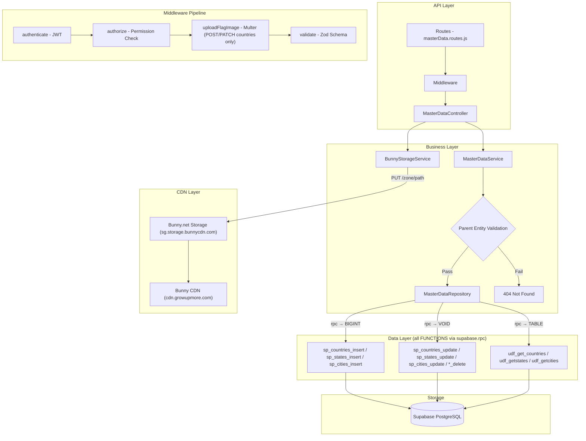
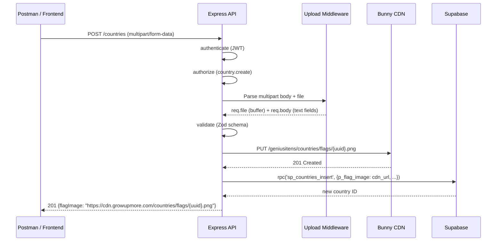

# GrowUpMore API — Master Data (Countries, States, Cities) Module

## Postman Testing Guide

**Base URL:** `http://localhost:5001`
**API Prefix:** `/api/v1/master-data`
**Content-Type:** `application/json` (or `multipart/form-data` for image uploads)
**Authentication:** All endpoints require `Bearer <access_token>` in Authorization header

---

## Architecture Flow



---

## Flag Image Upload Flow



---

## Complete Endpoint Reference

### Test Order (follow this sequence in Postman)

| # | Endpoint | Permission | Purpose |
|---|----------|------------|---------|
| 1 | `GET /api/v1/master-data/countries` | `country.read` | List all countries |
| 2 | `GET /api/v1/master-data/countries/:id` | `country.read` | Get country by ID |
| 3 | `POST /api/v1/master-data/countries` | `country.create` | Create country (with optional flag image upload) |
| 4 | `PATCH/api/v1/master-data/countries/:id` | `country.update` | Update country (with optional flag image upload) |
| 5 | `DELETE /api/v1/master-data/countries/:id` | `country.delete` | Soft-delete country (auto-cleans CDN image) |
| 6 | `POST /api/v1/master-data/countries/:id/restore` | `country.update` | Restore deleted country |
| 7 | `GET /api/v1/master-data/states` | `state.read` | List all states |
| 8 | `GET /api/v1/master-data/states/:id` | `state.read` | Get state by ID |
| 9 | `POST /api/v1/master-data/states` | `state.create` | Create state |
| 10 | `PATCH/api/v1/master-data/states/:id` | `state.update` | Update state |
| 11 | `DELETE /api/v1/master-data/states/:id` | `state.delete` | Soft-delete state |
| 12 | `POST /api/v1/master-data/states/:id/restore` | `state.update` | Restore deleted state |
| 13 | `GET /api/v1/master-data/cities` | `city.read` | List all cities |
| 14 | `GET /api/v1/master-data/cities/:id` | `city.read` | Get city by ID |
| 15 | `POST /api/v1/master-data/cities` | `city.create` | Create city |
| 16 | `PATCH/api/v1/master-data/cities/:id` | `city.update` | Update city |
| 17 | `DELETE /api/v1/master-data/cities/:id` | `city.delete` | Soft-delete city |
| 18 | `POST /api/v1/master-data/cities/:id/restore` | `city.update` | Restore deleted city |

---

## Common Headers (All Requests)

| Key | Value |
|-----|-------|
| Authorization | Bearer `<access_token>` |

> **For JSON requests:** Add `Content-Type: application/json`
>
> **For image uploads (POST/PATCH countries):** Use `Content-Type: multipart/form-data` (Postman sets this automatically when you select form-data)
>
> **Note:** Get the `access_token` from the `/api/v1/auth/login` response. Super admin or admin token is required for write operations.

---

## 1. List Countries

```
GET http://localhost:5001/api/v1/master-data/countries
```

**Permission Required:** `country.read`

**Query Parameters:**

| Parameter | Type | Default | Description |
|-----------|------|---------|-------------|
| page | integer | 1 | Page number |
| limit | integer | 20 | Items per page |
| search | string | — | Search by country name |
| sortBy | string | id | Sort field |
| sortDir | string | ASC | Sort direction (`ASC` or `DESC`) |
| iso2 | string | — | Filter by 2-letter ISO code |
| iso3 | string | — | Filter by 3-letter ISO code |
| phoneCode | string | — | Filter by phone code |
| currency | string | — | Filter by currency code |
| nationality | string | — | Filter by nationality |
| nationalLanguage | string | — | Filter by national language |
| isActive | boolean | — | Filter by active status (`true`/`false`) |

**Example with filters:**

```
GET http://localhost:5001/api/v1/master-data/countries?page=1&limit=10&iso3=IND&isActive=true
```

**Response — 200 OK:**

```json
{
  "success": true,
  "message": "Countries retrieved successfully",
  "data": [
    {
      "country_id": 1,
      "country_name": "India",
      "country_iso2": "IN",
      "country_iso3": "IND",
      "country_phone_code": "+91",
      "country_nationality": "Indian",
      "country_national_language": "Hindi",
      "country_languages": ["Hindi", "English"],
      "country_tld": ".in",
      "country_currency": "INR",
      "country_currency_name": "Indian Rupee",
      "country_currency_symbol": "₹",
      "country_flag_image": "https://cdn.growupmore.com/countries/flags/a1b2c3d4-e5f6-7890-abcd-ef1234567890.png",
      "country_is_active": true,
      "country_is_deleted": false,
      "country_created_at": "2026-01-01T00:00:00Z",
      "country_updated_at": "2026-01-01T00:00:00Z",
      "country_deleted_at": null,
      "total_count": 195
    }
  ],
  "meta": {
    "page": 1,
    "limit": 10,
    "totalCount": 195,
    "totalPages": 20
  }
}
```

**Response — 403 Forbidden (missing permission):**

```json
{
  "success": false,
  "message": "You do not have permission: country.read"
}
```

---

## 2. Get Country by ID

```
GET http://localhost:5001/api/v1/master-data/countries/1
```

**Permission Required:** `country.read`

**URL Parameters:**

| Parameter | Type | Required | Rules |
|-----------|------|----------|-------|
| id | integer | Yes | Positive integer |

**Response — 200 OK:**

```json
{
  "success": true,
  "message": "Country retrieved successfully",
  "data": {
    "country_id": 1,
    "country_name": "India",
    "country_iso2": "IN",
    "country_iso3": "IND",
    "country_phone_code": "+91",
    "country_nationality": "Indian",
    "country_national_language": "Hindi",
    "country_languages": ["Hindi", "English"],
    "country_tld": ".in",
    "country_currency": "INR",
    "country_currency_name": "Indian Rupee",
    "country_currency_symbol": "₹",
    "country_flag_image": "https://cdn.growupmore.com/countries/flags/a1b2c3d4.png",
    "country_is_active": true,
    "country_is_deleted": false,
    "country_created_at": "2026-01-01T00:00:00Z",
    "country_updated_at": null
  }
}
```

**Response — 404 Not Found:**

```json
{
  "success": false,
  "message": "Country with ID 999 not found"
}
```

---

## 3. Create Country

```
POST http://localhost:5001/api/v1/master-data/countries
```

**Permission Required:** `country.create`

> **Two options:** You can send JSON body (with a flag image URL) or multipart/form-data (to upload a flag image file directly to Bunny CDN).

### Option A — JSON Body

**Content-Type:** `application/json`

**Request Body:**

```json
{
  "name": "India",
  "iso2": "IN",
  "iso3": "IND",
  "phoneCode": "+91",
  "currency": "INR",
  "currencyName": "Indian Rupee",
  "currencySymbol": "₹",
  "nationalLanguage": "Hindi",
  "nationality": "Indian",
  "languages": ["Hindi", "English"],
  "tld": ".in",
  "flagImage": "https://example.com/flags/in.png",
  "isActive": true
}
```

### Option B — Multipart Form-Data (with image file upload)

**Content-Type:** `multipart/form-data` (auto-set by Postman)

**Postman Setup:**

1. Set method to **POST**, URL to `http://localhost:5001/api/v1/master-data/countries`
2. Go to **Body** tab → select **form-data**
3. Add text fields: `name`, `iso2`, `iso3`, `phoneCode`, etc.
4. For `flagImage`: change type dropdown to **File** → select your image file
5. For `languages`: enter a JSON string → `["Hindi","English"]`
6. For `isActive`: enter string → `true` or `false`

> **Important:** In multipart/form-data, all fields are sent as strings. The API auto-converts `isActive` from `"true"`/`"false"` to boolean, and `languages` from JSON string to array.

**Validation Rules:**

| Field | Type | Required | Rules |
|-------|------|----------|-------|
| name | string | Yes | 1-200 characters |
| iso2 | string | Yes | Exactly 2 characters (auto-uppercased) |
| iso3 | string | Yes | Exactly 3 characters (auto-uppercased) |
| phoneCode | string | No | Max 10 characters |
| currency | string | No | Max 10 characters |
| currencyName | string | No | Max 100 characters |
| currencySymbol | string | No | Max 10 characters |
| nationalLanguage | string | No | Max 100 characters |
| nationality | string | No | Max 100 characters |
| languages | string[] | No | Array of strings (or JSON string in form-data) |
| tld | string | No | Max 10 characters |
| flagImage | file / string | No | File: jpeg, png, gif, webp, svg (max 50MB). String: valid URL, max 500 chars |
| isActive | boolean | No | Default: `false` |

**Allowed Image Types:** `image/jpeg`, `image/png`, `image/gif`, `image/webp`, `image/svg+xml`

**Max File Size:** 50 MB (configurable via `MAX_FILE_SIZE_MB` in `.env`)

**Response — 201 Created:**

```json
{
  "success": true,
  "message": "Country created successfully",
  "data": {
    "country_id": 196,
    "country_name": "India",
    "country_iso2": "IN",
    "country_iso3": "IND",
    "country_phone_code": "+91",
    "country_flag_image": "https://cdn.growupmore.com/countries/flags/a1b2c3d4-e5f6-7890-abcd-ef1234567890.png",
    "country_is_active": true
  }
}
```

**Response — 400 Bad Request (invalid file type):**

```json
{
  "success": false,
  "message": "Invalid file type: application/pdf. Allowed types: image/jpeg, image/png, image/gif, image/webp, image/svg+xml"
}
```

**Response — 400 Bad Request (file too large):**

```json
{
  "success": false,
  "message": "File too large. Maximum size: 50MB"
}
```

**Response — 422 Validation Error (missing required fields):**

```json
{
  "success": false,
  "message": "Validation failed",
  "details": [
    { "field": "name", "message": "Required" },
    { "field": "iso2", "message": "String must contain exactly 2 character(s)" }
  ]
}
```

---

## 4. Update Country

```
PATCH http://localhost:5001/api/v1/master-data/countries/1
```

**Permission Required:** `country.update`

> Supports both JSON and multipart/form-data. When a new flag image is uploaded, the **old image is automatically deleted from Bunny CDN** and the CDN cache is purged.

**URL Parameters:**

| Parameter | Type | Required | Rules |
|-----------|------|----------|-------|
| id | integer | Yes | Positive integer |

**Request Body — JSON (all fields optional):**

```json
{
  "name": "Republic of India",
  "phoneCode": "+91",
  "isActive": true
}
```

**Request Body — Multipart (with new flag image):**

| Field | Value |
|-------|-------|
| name | Republic of India |
| flagImage | _(select new image file)_ |

**Validation Rules:**

| Field | Type | Required | Rules |
|-------|------|----------|-------|
| name | string | No | 1-200 characters |
| iso2 | string | No | Exactly 2 characters |
| iso3 | string | No | Exactly 3 characters |
| phoneCode | string | No | Max 10 characters |
| currency | string | No | Max 10 characters |
| currencyName | string | No | Max 100 characters |
| currencySymbol | string | No | Max 10 characters |
| nationalLanguage | string | No | Max 100 characters |
| nationality | string | No | Max 100 characters |
| languages | string[] | No | Array of strings (or JSON string in form-data) |
| tld | string | No | Max 10 characters |
| flagImage | file / string | No | New file or URL string |
| isActive | boolean | No | — |

**Response — 200 OK:**

```json
{
  "success": true,
  "message": "Country updated successfully",
  "data": {
    "country_id": 1,
    "country_name": "Republic of India",
    "country_flag_image": "https://cdn.growupmore.com/countries/flags/new-uuid.png"
  }
}
```

**Response — 404 Not Found:**

```json
{
  "success": false,
  "message": "Country with ID 999 not found"
}
```

---

## 5. Delete Country (Soft-Delete)

```
DELETE http://localhost:5001/api/v1/master-data/countries/1
```

**Permission Required:** `country.delete`

> **CDN Cleanup:** The flag image is automatically deleted from Bunny CDN when a country is deleted.

**Response — 200 OK:**

```json
{
  "success": true,
  "message": "Country deleted successfully"
}
```

**Response — 404 Not Found:**

```json
{
  "success": false,
  "message": "Country with ID 999 not found"
}
```

---

## 6. Restore Country

```
POST http://localhost:5001/api/v1/master-data/countries/1/restore
```

**Permission Required:** `country.update`

> **Note:** Restores a soft-deleted country record. No request body required.

**Response — 200 OK:**

```json
{
  "success": true,
  "message": "Country restored successfully",
  "data": {
    "id": 1
  }
}
```

**Response — 404 Not Found:**

```json
{
  "success": false,
  "message": "Country with ID 999 not found"
}
```

---

## 6. List States

```
GET http://localhost:5001/api/v1/master-data/states
```

**Permission Required:** `state.read`

**Query Parameters:**

| Parameter | Type | Default | Description |
|-----------|------|---------|-------------|
| page | integer | 1 | Page number |
| limit | integer | 20 | Items per page |
| search | string | — | Search by state/country name |
| sortBy | string | id | Sort field |
| sortDir | string | ASC | Sort direction (`ASC` or `DESC`) |
| countryIso3 | string | — | Filter by country ISO3 code |
| stateIsActive | boolean | — | Filter by active status (`true`/`false`) |

**Example — get all states of India:**

```
GET http://localhost:5001/api/v1/master-data/states?countryIso3=IND&page=1&limit=50
```

**Response — 200 OK:**

```json
{
  "success": true,
  "message": "States retrieved successfully",
  "data": [
    {
      "state_id": 1,
      "state_name": "Maharashtra",
      "state_languages": ["Marathi", "Hindi"],
      "state_website": "https://maharashtra.gov.in",
      "state_is_active": true,
      "state_is_deleted": false,
      "country_id": 1,
      "country_name": "India",
      "country_iso3": "IND",
      "total_count": 36
    }
  ],
  "meta": {
    "page": 1,
    "limit": 20,
    "totalCount": 36,
    "totalPages": 2
  }
}
```

---

## 7. Get State by ID

```
GET http://localhost:5001/api/v1/master-data/states/1
```

**Permission Required:** `state.read`

**URL Parameters:**

| Parameter | Type | Required | Rules |
|-----------|------|----------|-------|
| id | integer | Yes | Positive integer |

**Response — 200 OK:**

```json
{
  "success": true,
  "message": "State retrieved successfully",
  "data": {
    "state_id": 1,
    "state_name": "Maharashtra",
    "state_languages": ["Marathi", "Hindi"],
    "state_website": "https://maharashtra.gov.in",
    "state_is_active": true,
    "country_id": 1,
    "country_name": "India",
    "country_iso3": "IND"
  }
}
```

**Response — 404 Not Found:**

```json
{
  "success": false,
  "message": "State with ID 999 not found"
}
```

---

## 8. Create State

```
POST http://localhost:5001/api/v1/master-data/states
```

**Permission Required:** `state.create`

> **Parent validation:** The API validates that the `countryId` references an existing country before creating the state.

**Request Body:**

```json
{
  "countryId": 1,
  "name": "Maharashtra",
  "languages": ["Marathi", "Hindi"],
  "website": "https://maharashtra.gov.in",
  "isActive": true
}
```

**Validation Rules:**

| Field | Type | Required | Rules |
|-------|------|----------|-------|
| countryId | integer | Yes | Positive integer, must reference existing country |
| name | string | Yes | 1-200 characters |
| languages | string[] | No | Array of strings, default `[]` |
| website | string | No | Valid URL, max 500 characters |
| isActive | boolean | No | Default: `false` |

**Response — 201 Created:**

```json
{
  "success": true,
  "message": "State created successfully",
  "data": {
    "state_id": 37,
    "state_name": "Maharashtra",
    "state_languages": ["Marathi", "Hindi"],
    "country_id": 1,
    "country_name": "India"
  }
}
```

**Response — 404 Not Found (invalid country):**

```json
{
  "success": false,
  "message": "Country with ID 999 not found"
}
```

---

## 9. Update State

```
PATCH http://localhost:5001/api/v1/master-data/states/1
```

**Permission Required:** `state.update`

> If `countryId` is provided, the API validates that the new country exists.

**Request Body (all fields optional):**

```json
{
  "name": "Maharashtra (Updated)",
  "languages": ["Marathi", "Hindi", "English"],
  "isActive": true
}
```

**Validation Rules:**

| Field | Type | Required | Rules |
|-------|------|----------|-------|
| countryId | integer | No | Positive integer, must reference existing country |
| name | string | No | 1-200 characters |
| languages | string[] | No | Array of strings |
| website | string | No | Valid URL, max 500 characters |
| isActive | boolean | No | — |

**Response — 200 OK:**

```json
{
  "success": true,
  "message": "State updated successfully",
  "data": {
    "state_id": 1,
    "state_name": "Maharashtra (Updated)"
  }
}
```

---

## 10. Delete State (Soft-Delete)

```
DELETE http://localhost:5001/api/v1/master-data/states/1
```

**Permission Required:** `state.delete`

**Response — 200 OK:**

```json
{
  "success": true,
  "message": "State deleted successfully"
}
```

---

## 11. Restore State

```
POST http://localhost:5001/api/v1/master-data/states/1/restore
```

**Permission Required:** `state.update`

> **Note:** Restores a soft-deleted state record. No request body required.

**Response — 200 OK:**

```json
{
  "success": true,
  "message": "State restored successfully",
  "data": {
    "id": 1
  }
}
```

**Response — 404 Not Found:**

```json
{
  "success": false,
  "message": "State with ID 999 not found"
}
```

---

## 12. List Cities

```
GET http://localhost:5001/api/v1/master-data/cities
```

**Permission Required:** `city.read`

**Query Parameters:**

| Parameter | Type | Default | Description |
|-----------|------|---------|-------------|
| page | integer | 1 | Page number |
| limit | integer | 20 | Items per page |
| search | string | — | Search by city/state/country name |
| sortBy | string | id | Sort field |
| sortDir | string | ASC | Sort direction (`ASC` or `DESC`) |
| countryIso3 | string | — | Filter by country ISO3 code |
| cityTimezone | string | — | Filter by timezone |
| cityIsActive | boolean | — | Filter by active status (`true`/`false`) |

**Example — get all cities in Asia/Kolkata timezone:**

```
GET http://localhost:5001/api/v1/master-data/cities?cityTimezone=Asia/Kolkata&page=1&limit=50
```

**Response — 200 OK:**

```json
{
  "success": true,
  "message": "Cities retrieved successfully",
  "data": [
    {
      "city_id": 1,
      "city_name": "Mumbai",
      "city_phonecode": "022",
      "city_timezone": "Asia/Kolkata",
      "city_website": "https://mumbai.gov.in",
      "city_is_active": true,
      "city_is_deleted": false,
      "state_id": 1,
      "state_name": "Maharashtra",
      "country_id": 1,
      "country_name": "India",
      "country_iso3": "IND",
      "total_count": 500
    }
  ],
  "meta": {
    "page": 1,
    "limit": 20,
    "totalCount": 500,
    "totalPages": 25
  }
}
```

---

## 13. Get City by ID

```
GET http://localhost:5001/api/v1/master-data/cities/1
```

**Permission Required:** `city.read`

**URL Parameters:**

| Parameter | Type | Required | Rules |
|-----------|------|----------|-------|
| id | integer | Yes | Positive integer |

**Response — 200 OK:**

```json
{
  "success": true,
  "message": "City retrieved successfully",
  "data": {
    "city_id": 1,
    "city_name": "Mumbai",
    "city_phonecode": "022",
    "city_timezone": "Asia/Kolkata",
    "city_website": "https://mumbai.gov.in",
    "city_is_active": true,
    "state_id": 1,
    "state_name": "Maharashtra",
    "country_id": 1,
    "country_name": "India"
  }
}
```

**Response — 404 Not Found:**

```json
{
  "success": false,
  "message": "City with ID 999 not found"
}
```

---

## 14. Create City

```
POST http://localhost:5001/api/v1/master-data/cities
```

**Permission Required:** `city.create`

> **Parent validation:** The API validates that the `stateId` references an existing state before creating the city.

**Request Body:**

```json
{
  "stateId": 1,
  "name": "Mumbai",
  "phonecode": "022",
  "timezone": "Asia/Kolkata",
  "website": "https://mumbai.gov.in",
  "isActive": true
}
```

**Validation Rules:**

| Field | Type | Required | Rules |
|-------|------|----------|-------|
| stateId | integer | Yes | Positive integer, must reference existing state |
| name | string | Yes | 1-200 characters |
| phonecode | string | No | Max 10 characters |
| timezone | string | No | IANA timezone string, max 100 characters |
| website | string | No | Valid URL, max 500 characters |
| isActive | boolean | No | Default: `false` |

**Response — 201 Created:**

```json
{
  "success": true,
  "message": "City created successfully",
  "data": {
    "city_id": 501,
    "city_name": "Mumbai",
    "city_timezone": "Asia/Kolkata",
    "state_id": 1,
    "state_name": "Maharashtra",
    "country_id": 1,
    "country_name": "India"
  }
}
```

**Response — 404 Not Found (invalid state):**

```json
{
  "success": false,
  "message": "State with ID 999 not found"
}
```

---

## 15. Update City

```
PATCH http://localhost:5001/api/v1/master-data/cities/1
```

**Permission Required:** `city.update`

> If `stateId` is provided, the API validates that the new state exists.

**Request Body (all fields optional):**

```json
{
  "name": "Mumbai (Metropolitan)",
  "timezone": "Asia/Kolkata",
  "isActive": true
}
```

**Validation Rules:**

| Field | Type | Required | Rules |
|-------|------|----------|-------|
| stateId | integer | No | Positive integer, must reference existing state |
| name | string | No | 1-200 characters |
| phonecode | string | No | Max 10 characters |
| timezone | string | No | Max 100 characters |
| website | string | No | Valid URL, max 500 characters |
| isActive | boolean | No | — |

**Response — 200 OK:**

```json
{
  "success": true,
  "message": "City updated successfully",
  "data": {
    "city_id": 1,
    "city_name": "Mumbai (Metropolitan)"
  }
}
```

---

## 16. Delete City (Soft-Delete)

```
DELETE http://localhost:5001/api/v1/master-data/cities/1
```

**Permission Required:** `city.delete`

**Response — 200 OK:**

```json
{
  "success": true,
  "message": "City deleted successfully"
}
```

---

## 17. Restore City

```
POST http://localhost:5001/api/v1/master-data/cities/1/restore
```

**Permission Required:** `city.update`

> **Note:** Restores a soft-deleted city record. No request body required.

**Response — 200 OK:**

```json
{
  "success": true,
  "message": "City restored successfully",
  "data": {
    "id": 1
  }
}
```

**Response — 404 Not Found:**

```json
{
  "success": false,
  "message": "City with ID 999 not found"
}
```

---

## Bunny CDN Configuration Reference

Flag images are stored on **Bunny.net Storage** and served via **Bunny CDN**.

**Environment Variables (`.env`):**

| Variable | Value | Purpose |
|----------|-------|---------|
| `BUNNY_STORAGE_ZONE` | `geniusitens` | Storage zone name |
| `BUNNY_STORAGE_KEY` | `dee92727-...` | Storage API access key |
| `BUNNY_STORAGE_URL` | `https://sg.storage.bunnycdn.com` | Storage API endpoint (Singapore region) |
| `BUNNY_CDN_URL` | `https://cdn.growupmore.com` | Public CDN URL for serving files |
| `BUNNY_ACCOUNT_API_KEY` | `b1354be-...` | Account API key (used for cache purge) |
| `MAX_FILE_SIZE_MB` | `50` | Maximum upload file size |
| `ALLOWED_IMAGE_TYPES` | `image/jpeg,image/png,...` | Allowed MIME types |

**CDN Storage Path Convention:**

```
/{entity}/{type}/{uuid}.{ext}
```

| Entity | Type | Example CDN URL |
|--------|------|-----------------|
| countries | flags | `https://cdn.growupmore.com/countries/flags/a1b2c3d4.png` |

**Automatic CDN Cleanup:**

| Action | Behavior |
|--------|----------|
| Create country with image | Uploads to `countries/flags/{uuid}.{ext}` |
| Update country with new image | Deletes old image → uploads new image → purges CDN cache |
| Delete country | Deletes flag image from CDN → purges cache |

---

## Permissions (12 total — module: `master_data`, module_id: 2)

| Code | Name | Resource | Action | Scope |
|------|------|----------|--------|-------|
| `country.create` | Create Country | country | create | global |
| `country.read` | View Countries | country | read | global |
| `country.update` | Update Country | country | update | global |
| `country.delete` | Delete Country | country | delete | global |
| `state.create` | Create State | state | create | global |
| `state.read` | View States | state | read | global |
| `state.update` | Update State | state | update | global |
| `state.delete` | Delete State | state | delete | global |
| `city.create` | Create City | city | create | global |
| `city.read` | View Cities | city | read | global |
| `city.update` | Update City | city | update | global |
| `city.delete` | Delete City | city | delete | global |

> All permissions are auto-assigned to `super_admin` and `admin` roles via `phase02_master_data_permissions_seed.sql`.

---

## Testing Workflow

Follow this step-by-step workflow to test the complete master data API:

### Countries Test Flow

1. **List Countries** (GET /countries) - Verify permissions
2. **Create Country** (POST /countries) - Add test data with flag image
3. **Get Country by ID** (GET /countries/{id}) - Retrieve created country
4. **Update Country** (PATCH /countries/{id}) - Modify country details
5. **Delete Country** (DELETE /countries/{id}) - Soft-delete the country
6. **Restore Country** (POST /countries/{id}/restore) - Restore the deleted country

### States Test Flow

1. **List States** (GET /states) - Filter by country
2. **Create State** (POST /states) - Add state for test country
3. **Get State by ID** (GET /states/{id}) - Retrieve created state
4. **Update State** (PATCH /states/{id}) - Modify state details
5. **Delete State** (DELETE /states/{id}) - Soft-delete the state
6. **Restore State** (POST /states/{id}/restore) - Restore the deleted state

### Cities Test Flow

1. **List Cities** (GET /cities) - Filter by state/country
2. **Create City** (POST /cities) - Add city for test state
3. **Get City by ID** (GET /cities/{id}) - Retrieve created city
4. **Update City** (PATCH /cities/{id}) - Modify city details
5. **Delete City** (DELETE /cities/{id}) - Soft-delete the city
6. **Restore City** (POST /cities/{id}/restore) - Restore the deleted city

---

## Error Reference

| HTTP Code | Error Type | Common Causes |
|-----------|-----------|---------------|
| 400 | BadRequestError | Missing required fields, invalid file type, file too large |
| 401 | UnauthorizedError | Missing or expired JWT token |
| 403 | ForbiddenError | Missing permission (`country.create`, `state.read`, etc.) |
| 404 | NotFoundError | Country/state/city not found, invalid parent entity ID |
| 409 | ConflictError | Duplicate entry |
| 422 | ValidationError | Zod schema validation failure |
| 429 | TooManyRequestsError | Rate limit exceeded |
| 500 | InternalServerError | Database or server errors |

---

## Files Reference

| Layer | File | Description |
|-------|------|-------------|
| Routes | `src/api/v1/routes/masterData.routes.js` | 15 endpoints with auth + upload middleware |
| Controller | `src/api/v1/controllers/masterData.controller.js` | Handlers with Bunny CDN upload logic |
| Service | `src/services/masterData.service.js` | Business logic + parent entity validation |
| Repository | `src/repositories/masterData.repository.js` | Supabase RPC calls (12 functions) |
| Validator | `src/api/v1/validators/masterData.validator.js` | Zod schemas (JSON + multipart compatible) |
| CDN Service | `src/services/bunny.service.js` | Bunny Storage upload / delete / cache purge |
| Upload MW | `src/middleware/upload.middleware.js` | Multer memory-based file upload handling |
| Router Reg | `src/api/v1/index.js` | Mounts `/master-data` prefix |
| Permissions | `phase02_master_data_permissions_seed.sql` | 12 RBAC permissions seed data |

---

## Postman Environment Variables (Recommended)

| Variable | Initial Value | Description |
|----------|---------------|-------------|
| `base_url` | `http://localhost:5001` | API base URL |
| `access_token` | _(empty)_ | Set after login |
| `sa_token` | _(empty)_ | Super admin token for write operations |
| `test_country_id` | _(empty)_ | ID of a country created during testing |
| `test_state_id` | _(empty)_ | ID of a state created during testing |
| `test_city_id` | _(empty)_ | ID of a city created during testing |

> **Tip:** After login, use Postman's **Tests** tab to auto-set the token:
> ```js
> const response = pm.response.json();
> if (response.data?.accessToken) {
>     pm.environment.set("access_token", response.data.accessToken);
> }
> ```
