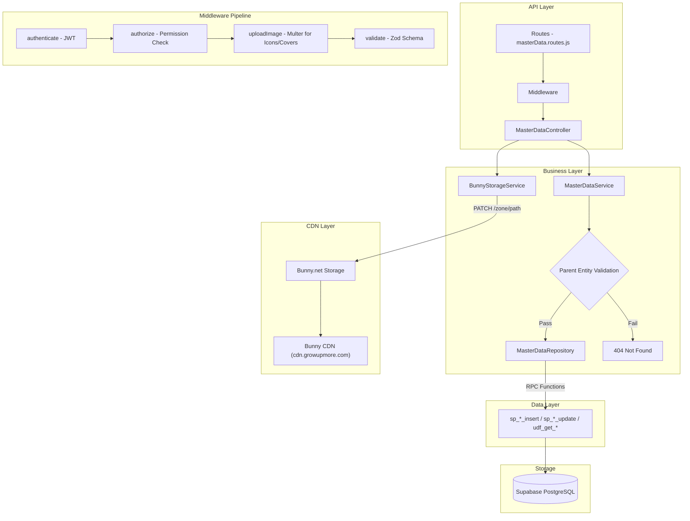

# GrowUpMore API — Master Data (Extended) Module

## Postman Testing Guide

**Base URL:** `http://localhost:5001`
**API Prefix:** `/api/v1/master-data`
**Content-Type:** `application/json` (or `multipart/form-data` for image uploads)
**Authentication:** All endpoints require `Bearer <access_token>` in Authorization header

---

## Architecture Flow



---

## Complete Endpoint Reference (66 Routes)

### Test Order

| # | Entity | Endpoint | Method | Permission | Purpose |
|---|--------|----------|--------|-----------|---------|
| 1-6 | Skills | GET, GET/:id, POST, PATCH/:id, DELETE/:id, POST/:id/restore | — | skill.* | CRUD + icon upload + restore |
| 7-12 | Languages | GET, GET/:id, POST, PATCH/:id, DELETE/:id, POST/:id/restore | — | language.* | JSON CRUD + restore |
| 13-18 | Education Levels | GET, GET/:id, POST, PATCH/:id, DELETE/:id, POST/:id/restore | — | education_level.* | JSON CRUD + restore |
| 19-24 | Document Types | GET, GET/:id, POST, PATCH/:id, DELETE/:id, POST/:id/restore | — | document_type.* | JSON CRUD + restore |
| 25-30 | Documents | GET, GET/:id, POST, PATCH/:id, DELETE/:id, POST/:id/restore | — | document.* | JSON CRUD + parent validation + restore |
| 31-36 | Designations | GET, GET/:id, POST, PATCH/:id, DELETE/:id, POST/:id/restore | — | designation.* | JSON CRUD + restore |
| 37-42 | Specializations | GET, GET/:id, POST, PATCH/:id, DELETE/:id, POST/:id/restore | — | specialization.* | CRUD + icon upload + restore |
| 43-48 | Learning Goals | GET, GET/:id, POST, PATCH/:id, DELETE/:id, POST/:id/restore | — | learning_goal.* | CRUD + icon upload + restore |
| 49-54 | Social Medias | GET, GET/:id, POST, PATCH/:id, DELETE/:id, POST/:id/restore | — | social_media.* | CRUD + icon upload + restore |
| 55-60 | Categories | GET, GET/:id, POST, PATCH/:id, DELETE/:id, POST/:id/restore | — | category.* | CRUD + dual image upload + restore |
| 61-66 | Sub Categories | GET, GET/:id, POST, PATCH/:id, DELETE/:id, POST/:id/restore | — | sub_category.* | CRUD + dual image upload + parent validation + restore |

---

## Common Headers (All Requests)

| Key | Value |
|-----|-------|
| Authorization | Bearer `<access_token>` |

**For JSON requests:** Add `Content-Type: application/json`

**For file uploads (Skills, Specializations, Learning Goals, Social Medias, Categories, Sub Categories):** Use `Content-Type: multipart/form-data` (Postman sets this automatically)

**Note:** Get `access_token` from `/api/v1/auth/login`. Super admin or admin token required for write operations.

---

## Image Upload Pattern (Skills, Specializations, Learning Goals, Social Medias, Categories, Sub Categories)

### Postman Setup for Multipart Form-Data

1. Set method to **POST** or **PATCH**, URL to endpoint
2. Go to **Body** tab → select **form-data**
3. Add text fields for all JSON properties
4. For icon/image fields: change type dropdown to **File** → select image file
5. For boolean/array fields: enter as string (e.g., `true`, `["tag1","tag2"]`)

**Allowed Image Types:** `image/jpeg`, `image/png`, `image/gif`, `image/webp`, `image/svg+xml`

**Max File Size:** 50 MB

---

## 1. Skills (Icon Upload)

### 1.1 List Skills

```
GET http://localhost:5001/api/v1/master-data/skills
```

**Permission Required:** `skill.read`

**Query Parameters:**

| Parameter | Type | Default | Description |
|-----------|------|---------|-------------|
| page | integer | 1 | Page number |
| limit | integer | 20 | Items per page |
| search | string | — | Search by name |
| sortBy | string | id | Sort field |
| sortDir | string | ASC | Sort direction |
| category | string | — | Filter by category |
| isActive | boolean | — | Filter by active status |

**Response — 200 OK:**

```json
{
  "success": true,
  "message": "Skills retrieved successfully",
  "data": [
    {
      "skill_id": 1,
      "skill_name": "JavaScript",
      "skill_category": "Programming",
      "skill_description": "JavaScript language and frameworks",
      "skill_icon_url": "https://cdn.growupmore.com/master-data/skills/icons/uuid.png",
      "skill_is_active": true,
      "total_count": 50
    }
  ],
  "meta": {
    "page": 1,
    "limit": 20,
    "totalCount": 50,
    "totalPages": 3
  }
}
```

---

### 1.2 Get Skill by ID

```
GET http://localhost:5001/api/v1/master-data/skills/1
```

**Permission Required:** `skill.read`

**Response — 200 OK:**

```json
{
  "success": true,
  "message": "Skill retrieved successfully",
  "data": {
    "skill_id": 1,
    "skill_name": "JavaScript",
    "skill_category": "Programming",
    "skill_description": "JavaScript language and frameworks",
    "skill_icon_url": "https://cdn.growupmore.com/master-data/skills/icons/uuid.png",
    "skill_is_active": true
  }
}
```

**Response — 404 Not Found:**

```json
{
  "success": false,
  "message": "Skill with ID 999 not found"
}
```

---

### 1.3 Create Skill

```
POST http://localhost:5001/api/v1/master-data/skills
```

**Permission Required:** `skill.create`

**Two options:** JSON body (with icon URL) or multipart/form-data (upload icon file).

**Option A — JSON Body:**

```json
{
  "name": "JavaScript",
  "category": "Programming",
  "description": "JavaScript language and frameworks",
  "iconUrl": "https://example.com/js.png",
  "isActive": true
}
```

**Option B — Multipart Form-Data (upload icon file):**

| Field | Value | Type |
|-------|-------|------|
| name | JavaScript | text |
| category | Programming | text |
| description | JavaScript language and frameworks | text |
| iconImage | _(select file)_ | file |
| isActive | true | text |

**Validation Rules:**

| Field | Type | Required | Rules |
|-------|------|----------|-------|
| name | string | Yes | 1-200 characters |
| category | string | No | Max 100 characters |
| description | string | No | Max 500 characters |
| iconUrl | string | No | Valid URL, max 500 chars (if not uploading file) |
| iconImage | file | No | Image file (if uploading) |
| isActive | boolean | No | Default: `false` |

**Response — 201 Created:**

```json
{
  "success": true,
  "message": "Skill created successfully",
  "data": {
    "skill_id": 51,
    "skill_name": "JavaScript",
    "skill_icon_url": "https://cdn.growupmore.com/master-data/skills/icons/uuid.png",
    "skill_is_active": true
  }
}
```

**Response — 400 Bad Request:**

```json
{
  "success": false,
  "message": "Invalid file type: application/pdf. Allowed types: image/jpeg, image/png, image/gif, image/webp, image/svg+xml"
}
```

**Response — 422 Validation Error:**

```json
{
  "success": false,
  "message": "Validation failed",
  "details": [
    { "field": "name", "message": "Required" }
  ]
}
```

---

### 1.4 Update Skill

```
PATCH http://localhost:5001/api/v1/master-data/skills/1
```

**Permission Required:** `skill.update`

**Request Body — JSON (all fields optional):**

```json
{
  "name": "JavaScript ES6",
  "category": "Programming",
  "isActive": true
}
```

**Request Body — Multipart (with new icon):**

| Field | Value |
|-------|-------|
| name | JavaScript ES6 |
| iconImage | _(select new file)_ |

**Validation Rules:** Same as Create (all optional)

**Response — 200 OK:**

```json
{
  "success": true,
  "message": "Skill updated successfully",
  "data": {
    "skill_id": 1,
    "skill_name": "JavaScript ES6"
  }
}
```

---

### 1.5 Delete Skill

```
DELETE http://localhost:5001/api/v1/master-data/skills/1
```

**Permission Required:** `skill.delete`

**Response — 200 OK:**

```json
{
  "success": true,
  "message": "Skill deleted successfully"
}
```

---

### 1.6 Restore Skill

```
POST http://localhost:5001/api/v1/master-data/skills/{id}/restore
```

**Permission Required:** `skill.update`

**Response — 200 OK:**

```json
{
  "success": true,
  "message": "Skill restored successfully",
  "data": {
    "id": 1
  }
}
```

> **Note:** Restores a soft-deleted record. No request body required.

---

## 2. Languages (JSON Only)

All language endpoints follow the same JSON pattern. No file uploads required.

### 2.1 List Languages

```
GET http://localhost:5001/api/v1/master-data/languages
```

**Permission Required:** `language.read`

**Query Parameters:**

| Parameter | Type | Default | Description |
|-----------|------|---------|-------------|
| page | integer | 1 | Page number |
| limit | integer | 20 | Items per page |
| search | string | — | Search by name |
| sortBy | string | id | Sort field |
| sortDir | string | ASC | Sort direction |
| script | string | — | Filter by script |
| isoCode | string | — | Filter by ISO code |
| isActive | boolean | — | Filter by active status |

**Response — 200 OK:**

```json
{
  "success": true,
  "message": "Languages retrieved successfully",
  "data": [
    {
      "language_id": 1,
      "language_name": "English",
      "language_native_name": "English",
      "language_iso_code": "en",
      "language_script": "Latin",
      "language_is_active": true,
      "total_count": 100
    }
  ],
  "meta": {
    "page": 1,
    "limit": 20,
    "totalCount": 100,
    "totalPages": 5
  }
}
```

---

### 2.2 Get Language by ID

```
GET http://localhost:5001/api/v1/master-data/languages/1
```

**Permission Required:** `language.read`

**Response — 200 OK:**

```json
{
  "success": true,
  "message": "Language retrieved successfully",
  "data": {
    "language_id": 1,
    "language_name": "English",
    "language_native_name": "English",
    "language_iso_code": "en",
    "language_script": "Latin",
    "language_is_active": true
  }
}
```

---

### 2.3 Create Language

```
POST http://localhost:5001/api/v1/master-data/languages
```

**Permission Required:** `language.create`

**Request Body:**

```json
{
  "name": "English",
  "nativeName": "English",
  "isoCode": "en",
  "script": "Latin",
  "isActive": true
}
```

**Validation Rules:**

| Field | Type | Required | Rules |
|-------|------|----------|-------|
| name | string | Yes | 1-100 characters |
| nativeName | string | No | Max 100 characters |
| isoCode | string | No | 2-3 characters (ISO 639) |
| script | string | No | Max 50 characters |
| isActive | boolean | No | Default: `false` |

**Response — 201 Created:**

```json
{
  "success": true,
  "message": "Language created successfully",
  "data": {
    "language_id": 101,
    "language_name": "English",
    "language_iso_code": "en"
  }
}
```

---

### 2.4 Update Language

```
PATCH http://localhost:5001/api/v1/master-data/languages/1
```

**Permission Required:** `language.update`

**Request Body (all fields optional):**

```json
{
  "name": "English (Updated)",
  "isActive": true
}
```

**Response — 200 OK:**

```json
{
  "success": true,
  "message": "Language updated successfully",
  "data": {
    "language_id": 1,
    "language_name": "English (Updated)"
  }
}
```

---

### 2.5 Delete Language

```
DELETE http://localhost:5001/api/v1/master-data/languages/1
```

**Permission Required:** `language.delete`

**Response — 200 OK:**

```json
{
  "success": true,
  "message": "Language deleted successfully"
}
```

---

### 2.6 Restore Language

```
POST http://localhost:5001/api/v1/master-data/languages/{id}/restore
```

**Permission Required:** `language.update`

**Response — 200 OK:**

```json
{
  "success": true,
  "message": "Language restored successfully",
  "data": {
    "id": 1
  }
}
```

> **Note:** Restores a soft-deleted record. No request body required.

---

## 3. Education Levels (JSON Only)

### 3.1 List Education Levels

```
GET http://localhost:5001/api/v1/master-data/education-levels
```

**Permission Required:** `education_level.read`

**Query Parameters:**

| Parameter | Type | Default | Description |
|-----------|------|---------|-------------|
| page | integer | 1 | Page number |
| limit | integer | 20 | Items per page |
| search | string | — | Search by name |
| category | string | — | Filter by category |
| isActive | boolean | — | Filter by active status |

**Response — 200 OK:**

```json
{
  "success": true,
  "message": "Education levels retrieved successfully",
  "data": [
    {
      "education_level_id": 1,
      "education_level_name": "Bachelor",
      "education_level_order": 1,
      "education_level_category": "Undergraduate",
      "education_level_abbreviation": "B",
      "education_level_description": "Bachelor's degree",
      "education_level_typical_duration": "4 years",
      "education_level_typical_age_range": "18-22",
      "education_level_is_active": true,
      "total_count": 15
    }
  ],
  "meta": {
    "page": 1,
    "limit": 20,
    "totalCount": 15,
    "totalPages": 1
  }
}
```

---

### 3.2 Get Education Level by ID

```
GET http://localhost:5001/api/v1/master-data/education-levels/1
```

**Permission Required:** `education_level.read`

**Response — 200 OK:**

```json
{
  "success": true,
  "message": "Education level retrieved successfully",
  "data": {
    "education_level_id": 1,
    "education_level_name": "Bachelor",
    "education_level_order": 1,
    "education_level_category": "Undergraduate",
    "education_level_abbreviation": "B",
    "education_level_description": "Bachelor's degree",
    "education_level_is_active": true
  }
}
```

---

### 3.3 Create Education Level

```
POST http://localhost:5001/api/v1/master-data/education-levels
```

**Permission Required:** `education_level.create`

**Request Body:**

```json
{
  "name": "Bachelor",
  "levelOrder": 1,
  "levelCategory": "Undergraduate",
  "abbreviation": "B",
  "description": "Bachelor's degree",
  "typicalDuration": "4 years",
  "typicalAgeRange": "18-22",
  "isActive": true
}
```

**Validation Rules:**

| Field | Type | Required | Rules |
|-------|------|----------|-------|
| name | string | Yes | 1-100 characters |
| levelOrder | integer | Yes | Positive integer |
| levelCategory | string | No | Max 100 characters |
| abbreviation | string | No | Max 10 characters |
| description | string | No | Max 500 characters |
| typicalDuration | string | No | Max 50 characters |
| typicalAgeRange | string | No | Max 50 characters |
| isActive | boolean | No | Default: `false` |

**Response — 201 Created:**

```json
{
  "success": true,
  "message": "Education level created successfully",
  "data": {
    "education_level_id": 16,
    "education_level_name": "Bachelor",
    "education_level_order": 1
  }
}
```

---

### 3.4 Update Education Level

```
PATCH http://localhost:5001/api/v1/master-data/education-levels/1
```

**Permission Required:** `education_level.update`

**Request Body (all fields optional):**

```json
{
  "name": "Bachelor of Science",
  "levelOrder": 2,
  "isActive": true
}
```

**Response — 200 OK:**

```json
{
  "success": true,
  "message": "Education level updated successfully",
  "data": {
    "education_level_id": 1,
    "education_level_name": "Bachelor of Science"
  }
}
```

---

### 3.5 Delete Education Level

```
DELETE http://localhost:5001/api/v1/master-data/education-levels/1
```

**Permission Required:** `education_level.delete`

**Response — 200 OK:**

```json
{
  "success": true,
  "message": "Education level deleted successfully"
}
```

---

### 3.6 Restore Education Level

```
POST http://localhost:5001/api/v1/master-data/education-levels/{id}/restore
```

**Permission Required:** `education_level.update`

**Response — 200 OK:**

```json
{
  "success": true,
  "message": "Education Level restored successfully",
  "data": {
    "id": 1
  }
}
```

> **Note:** Restores a soft-deleted record. No request body required.

---

## 4. Document Types (JSON Only)

### 4.1 List Document Types

```
GET http://localhost:5001/api/v1/master-data/document-types
```

**Permission Required:** `document_type.read`

**Query Parameters:**

| Parameter | Type | Default | Description |
|-----------|------|---------|-------------|
| page | integer | 1 | Page number |
| limit | integer | 20 | Items per page |
| search | string | — | Search by name |
| isActive | boolean | — | Filter by active status |

**Response — 200 OK:**

```json
{
  "success": true,
  "message": "Document types retrieved successfully",
  "data": [
    {
      "document_type_id": 1,
      "document_type_name": "Certificate",
      "document_type_description": "Academic certificate",
      "document_type_is_active": true,
      "total_count": 10
    }
  ],
  "meta": {
    "page": 1,
    "limit": 20,
    "totalCount": 10,
    "totalPages": 1
  }
}
```

---

### 4.2 Get Document Type by ID

```
GET http://localhost:5001/api/v1/master-data/document-types/1
```

**Permission Required:** `document_type.read`

**Response — 200 OK:**

```json
{
  "success": true,
  "message": "Document type retrieved successfully",
  "data": {
    "document_type_id": 1,
    "document_type_name": "Certificate",
    "document_type_description": "Academic certificate",
    "document_type_is_active": true
  }
}
```

---

### 4.3 Create Document Type

```
POST http://localhost:5001/api/v1/master-data/document-types
```

**Permission Required:** `document_type.create`

**Request Body:**

```json
{
  "name": "Certificate",
  "description": "Academic certificate",
  "isActive": true
}
```

**Validation Rules:**

| Field | Type | Required | Rules |
|-------|------|----------|-------|
| name | string | Yes | 1-100 characters |
| description | string | No | Max 500 characters |
| isActive | boolean | No | Default: `false` |

**Response — 201 Created:**

```json
{
  "success": true,
  "message": "Document type created successfully",
  "data": {
    "document_type_id": 11,
    "document_type_name": "Certificate"
  }
}
```

---

### 4.4 Update Document Type

```
PATCH http://localhost:5001/api/v1/master-data/document-types/1
```

**Permission Required:** `document_type.update`

**Request Body (all fields optional):**

```json
{
  "name": "Degree Certificate",
  "isActive": true
}
```

**Response — 200 OK:**

```json
{
  "success": true,
  "message": "Document type updated successfully",
  "data": {
    "document_type_id": 1,
    "document_type_name": "Degree Certificate"
  }
}
```

---

### 4.5 Delete Document Type

```
DELETE http://localhost:5001/api/v1/master-data/document-types/1
```

**Permission Required:** `document_type.delete`

**Response — 200 OK:**

```json
{
  "success": true,
  "message": "Document type deleted successfully"
}
```

---

### 4.6 Restore Document Type

```
POST http://localhost:5001/api/v1/master-data/document-types/{id}/restore
```

**Permission Required:** `document_type.update`

**Response — 200 OK:**

```json
{
  "success": true,
  "message": "Document Type restored successfully",
  "data": {
    "id": 1
  }
}
```

> **Note:** Restores a soft-deleted record. No request body required.

---

## 5. Documents (JSON Only + Parent Validation)

### 5.1 List Documents

```
GET http://localhost:5001/api/v1/master-data/documents
```

**Permission Required:** `document.read`

**Query Parameters:**

| Parameter | Type | Default | Description |
|-----------|------|---------|-------------|
| page | integer | 1 | Page number |
| limit | integer | 20 | Items per page |
| search | string | — | Search by name |
| documentTypeId | integer | — | Filter by type |
| isActive | boolean | — | Filter by active status |

**Response — 200 OK:**

```json
{
  "success": true,
  "message": "Documents retrieved successfully",
  "data": [
    {
      "document_id": 1,
      "document_name": "Diploma",
      "document_description": "Professional diploma",
      "document_type_id": 1,
      "document_type_name": "Certificate",
      "document_is_active": true,
      "total_count": 25
    }
  ],
  "meta": {
    "page": 1,
    "limit": 20,
    "totalCount": 25,
    "totalPages": 2
  }
}
```

---

### 5.2 Get Document by ID

```
GET http://localhost:5001/api/v1/master-data/documents/1
```

**Permission Required:** `document.read`

**Response — 200 OK:**

```json
{
  "success": true,
  "message": "Document retrieved successfully",
  "data": {
    "document_id": 1,
    "document_name": "Diploma",
    "document_description": "Professional diploma",
    "document_type_id": 1,
    "document_type_name": "Certificate",
    "document_is_active": true
  }
}
```

---

### 5.3 Create Document

```
POST http://localhost:5001/api/v1/master-data/documents
```

**Permission Required:** `document.create`

**Request Body:**

```json
{
  "documentTypeId": 1,
  "name": "Diploma",
  "description": "Professional diploma",
  "isActive": true
}
```

**Validation Rules:**

| Field | Type | Required | Rules |
|-------|------|----------|-------|
| documentTypeId | integer | Yes | Positive integer, must reference existing document type |
| name | string | Yes | 1-100 characters |
| description | string | No | Max 500 characters |
| isActive | boolean | No | Default: `false` |

**Response — 201 Created:**

```json
{
  "success": true,
  "message": "Document created successfully",
  "data": {
    "document_id": 26,
    "document_name": "Diploma",
    "document_type_id": 1
  }
}
```

**Response — 404 Not Found (invalid document type):**

```json
{
  "success": false,
  "message": "Document type with ID 999 not found"
}
```

---

### 5.4 Update Document

```
PATCH http://localhost:5001/api/v1/master-data/documents/1
```

**Permission Required:** `document.update`

**Request Body (all fields optional):**

```json
{
  "name": "Professional Diploma",
  "documentTypeId": 1,
  "isActive": true
}
```

**Response — 200 OK:**

```json
{
  "success": true,
  "message": "Document updated successfully",
  "data": {
    "document_id": 1,
    "document_name": "Professional Diploma"
  }
}
```

---

### 5.5 Delete Document

```
DELETE http://localhost:5001/api/v1/master-data/documents/1
```

**Permission Required:** `document.delete`

**Response — 200 OK:**

```json
{
  "success": true,
  "message": "Document deleted successfully"
}
```

---

### 5.6 Restore Document

```
POST http://localhost:5001/api/v1/master-data/documents/{id}/restore
```

**Permission Required:** `document.update`

**Response — 200 OK:**

```json
{
  "success": true,
  "message": "Document restored successfully",
  "data": {
    "id": 1
  }
}
```

> **Note:** Restores a soft-deleted record. No request body required.

---

## 6. Designations (JSON Only)

### 6.1 List Designations

```
GET http://localhost:5001/api/v1/master-data/designations
```

**Permission Required:** `designation.read`

**Query Parameters:**

| Parameter | Type | Default | Description |
|-----------|------|---------|-------------|
| page | integer | 1 | Page number |
| limit | integer | 20 | Items per page |
| search | string | — | Search by name |
| levelBand | string | — | Filter by level band |
| isActive | boolean | — | Filter by active status |

**Response — 200 OK:**

```json
{
  "success": true,
  "message": "Designations retrieved successfully",
  "data": [
    {
      "designation_id": 1,
      "designation_name": "Senior Developer",
      "designation_code": "SD",
      "designation_level": "5",
      "designation_level_band": "Senior",
      "designation_description": "Senior software developer",
      "designation_is_active": true,
      "total_count": 40
    }
  ],
  "meta": {
    "page": 1,
    "limit": 20,
    "totalCount": 40,
    "totalPages": 2
  }
}
```

---

### 6.2 Get Designation by ID

```
GET http://localhost:5001/api/v1/master-data/designations/1
```

**Permission Required:** `designation.read`

**Response — 200 OK:**

```json
{
  "success": true,
  "message": "Designation retrieved successfully",
  "data": {
    "designation_id": 1,
    "designation_name": "Senior Developer",
    "designation_code": "SD",
    "designation_level": "5",
    "designation_level_band": "Senior",
    "designation_description": "Senior software developer",
    "designation_is_active": true
  }
}
```

---

### 6.3 Create Designation

```
POST http://localhost:5001/api/v1/master-data/designations
```

**Permission Required:** `designation.create`

**Request Body:**

```json
{
  "name": "Senior Developer",
  "code": "SD",
  "level": "5",
  "levelBand": "Senior",
  "description": "Senior software developer",
  "isActive": true
}
```

**Validation Rules:**

| Field | Type | Required | Rules |
|-------|------|----------|-------|
| name | string | Yes | 1-100 characters |
| code | string | No | Max 20 characters |
| level | string | No | Max 50 characters |
| levelBand | string | No | Max 50 characters |
| description | string | No | Max 500 characters |
| isActive | boolean | No | Default: `false` |

**Response — 201 Created:**

```json
{
  "success": true,
  "message": "Designation created successfully",
  "data": {
    "designation_id": 41,
    "designation_name": "Senior Developer",
    "designation_code": "SD"
  }
}
```

---

### 6.4 Update Designation

```
PATCH http://localhost:5001/api/v1/master-data/designations/1
```

**Permission Required:** `designation.update`

**Request Body (all fields optional):**

```json
{
  "name": "Lead Developer",
  "level": "6",
  "isActive": true
}
```

**Response — 200 OK:**

```json
{
  "success": true,
  "message": "Designation updated successfully",
  "data": {
    "designation_id": 1,
    "designation_name": "Lead Developer"
  }
}
```

---

### 6.5 Delete Designation

```
DELETE http://localhost:5001/api/v1/master-data/designations/1
```

**Permission Required:** `designation.delete`

**Response — 200 OK:**

```json
{
  "success": true,
  "message": "Designation deleted successfully"
}
```

---

### 6.6 Restore Designation

```
POST http://localhost:5001/api/v1/master-data/designations/{id}/restore
```

**Permission Required:** `designation.update`

**Response — 200 OK:**

```json
{
  "success": true,
  "message": "Designation restored successfully",
  "data": {
    "id": 1
  }
}
```

> **Note:** Restores a soft-deleted record. No request body required.

---

## 7. Specializations (Icon Upload)

Specializations follow the same icon upload pattern as Skills. See section 1 for multipart form-data setup.

### 7.1 List Specializations

```
GET http://localhost:5001/api/v1/master-data/specializations
```

**Permission Required:** `specialization.read`

**Query Parameters:**

| Parameter | Type | Default | Description |
|-----------|------|---------|-------------|
| page | integer | 1 | Page number |
| limit | integer | 20 | Items per page |
| search | string | — | Search by name |
| category | string | — | Filter by category |
| isActive | boolean | — | Filter by active status |

**Response — 200 OK:**

```json
{
  "success": true,
  "message": "Specializations retrieved successfully",
  "data": [
    {
      "specialization_id": 1,
      "specialization_name": "Full Stack Development",
      "specialization_category": "Web Development",
      "specialization_description": "End-to-end web app development",
      "specialization_icon_url": "https://cdn.growupmore.com/master-data/specializations/icons/uuid.png",
      "specialization_is_active": true,
      "total_count": 30
    }
  ],
  "meta": {
    "page": 1,
    "limit": 20,
    "totalCount": 30,
    "totalPages": 2
  }
}
```

---

### 7.2 Get Specialization by ID

```
GET http://localhost:5001/api/v1/master-data/specializations/1
```

**Permission Required:** `specialization.read`

**Response — 200 OK:**

```json
{
  "success": true,
  "message": "Specialization retrieved successfully",
  "data": {
    "specialization_id": 1,
    "specialization_name": "Full Stack Development",
    "specialization_category": "Web Development",
    "specialization_description": "End-to-end web app development",
    "specialization_icon_url": "https://cdn.growupmore.com/master-data/specializations/icons/uuid.png",
    "specialization_is_active": true
  }
}
```

---

### 7.3 Create Specialization

```
POST http://localhost:5001/api/v1/master-data/specializations
```

**Permission Required:** `specialization.create`

**Request Body — JSON:**

```json
{
  "name": "Full Stack Development",
  "category": "Web Development",
  "description": "End-to-end web app development",
  "iconUrl": "https://example.com/fullstack.png",
  "isActive": true
}
```

**Request Body — Multipart (with icon file):**

| Field | Value | Type |
|-------|-------|------|
| name | Full Stack Development | text |
| category | Web Development | text |
| iconImage | _(select file)_ | file |
| isActive | true | text |

**Validation Rules:**

| Field | Type | Required | Rules |
|-------|------|----------|-------|
| name | string | Yes | 1-200 characters |
| category | string | No | Max 100 characters |
| description | string | No | Max 500 characters |
| iconUrl | string | No | Valid URL (if not uploading) |
| iconImage | file | No | Image file (if uploading) |
| isActive | boolean | No | Default: `false` |

**Response — 201 Created:**

```json
{
  "success": true,
  "message": "Specialization created successfully",
  "data": {
    "specialization_id": 31,
    "specialization_name": "Full Stack Development",
    "specialization_icon_url": "https://cdn.growupmore.com/master-data/specializations/icons/uuid.png"
  }
}
```

---

### 7.4 Update Specialization

```
PATCH http://localhost:5001/api/v1/master-data/specializations/1
```

**Permission Required:** `specialization.update`

**Request Body — JSON (all fields optional):**

```json
{
  "name": "Modern Full Stack Development",
  "isActive": true
}
```

**Request Body — Multipart (with new icon):**

| Field | Value |
|-------|-------|
| name | Modern Full Stack Development |
| iconImage | _(select new file)_ |

**Response — 200 OK:**

```json
{
  "success": true,
  "message": "Specialization updated successfully",
  "data": {
    "specialization_id": 1,
    "specialization_name": "Modern Full Stack Development"
  }
}
```

---

### 7.5 Delete Specialization

```
DELETE http://localhost:5001/api/v1/master-data/specializations/1
```

**Permission Required:** `specialization.delete`

**Response — 200 OK:**

```json
{
  "success": true,
  "message": "Specialization deleted successfully"
}
```

---

### 7.6 Restore Specialization

```
POST http://localhost:5001/api/v1/master-data/specializations/{id}/restore
```

**Permission Required:** `specialization.update`

**Response — 200 OK:**

```json
{
  "success": true,
  "message": "Specialization restored successfully",
  "data": {
    "id": 1
  }
}
```

> **Note:** Restores a soft-deleted record. No request body required.

---

## 8. Learning Goals (Icon Upload)

Learning Goals follow the same icon upload pattern as Skills and Specializations.

### 8.1 List Learning Goals

```
GET http://localhost:5001/api/v1/master-data/learning-goals
```

**Permission Required:** `learning_goal.read`

**Query Parameters:**

| Parameter | Type | Default | Description |
|-----------|------|---------|-------------|
| page | integer | 1 | Page number |
| limit | integer | 20 | Items per page |
| search | string | — | Search by name |
| isActive | boolean | — | Filter by active status |

**Response — 200 OK:**

```json
{
  "success": true,
  "message": "Learning goals retrieved successfully",
  "data": [
    {
      "learning_goal_id": 1,
      "learning_goal_name": "Master React",
      "learning_goal_description": "Become proficient in React.js",
      "learning_goal_icon_url": "https://cdn.growupmore.com/master-data/learning-goals/icons/uuid.png",
      "learning_goal_display_order": 1,
      "learning_goal_is_active": true,
      "total_count": 20
    }
  ],
  "meta": {
    "page": 1,
    "limit": 20,
    "totalCount": 20,
    "totalPages": 1
  }
}
```

---

### 8.2 Get Learning Goal by ID

```
GET http://localhost:5001/api/v1/master-data/learning-goals/1
```

**Permission Required:** `learning_goal.read`

**Response — 200 OK:**

```json
{
  "success": true,
  "message": "Learning goal retrieved successfully",
  "data": {
    "learning_goal_id": 1,
    "learning_goal_name": "Master React",
    "learning_goal_description": "Become proficient in React.js",
    "learning_goal_icon_url": "https://cdn.growupmore.com/master-data/learning-goals/icons/uuid.png",
    "learning_goal_display_order": 1,
    "learning_goal_is_active": true
  }
}
```

---

### 8.3 Create Learning Goal

```
POST http://localhost:5001/api/v1/master-data/learning-goals
```

**Permission Required:** `learning_goal.create`

**Request Body — JSON:**

```json
{
  "name": "Master React",
  "description": "Become proficient in React.js",
  "iconUrl": "https://example.com/react.png",
  "displayOrder": 1,
  "isActive": true
}
```

**Request Body — Multipart (with icon file):**

| Field | Value | Type |
|-------|-------|------|
| name | Master React | text |
| description | Become proficient in React.js | text |
| iconImage | _(select file)_ | file |
| displayOrder | 1 | text |
| isActive | true | text |

**Validation Rules:**

| Field | Type | Required | Rules |
|-------|------|----------|-------|
| name | string | Yes | 1-200 characters |
| description | string | No | Max 500 characters |
| iconUrl | string | No | Valid URL (if not uploading) |
| iconImage | file | No | Image file (if uploading) |
| displayOrder | integer | No | Positive integer |
| isActive | boolean | No | Default: `false` |

**Response — 201 Created:**

```json
{
  "success": true,
  "message": "Learning goal created successfully",
  "data": {
    "learning_goal_id": 21,
    "learning_goal_name": "Master React",
    "learning_goal_display_order": 1
  }
}
```

---

### 8.4 Update Learning Goal

```
PATCH http://localhost:5001/api/v1/master-data/learning-goals/1
```

**Permission Required:** `learning_goal.update`

**Request Body — JSON (all fields optional):**

```json
{
  "name": "Advanced React Patterns",
  "displayOrder": 2,
  "isActive": true
}
```

**Request Body — Multipart (with new icon):**

| Field | Value |
|-------|-------|
| name | Advanced React Patterns |
| iconImage | _(select new file)_ |

**Response — 200 OK:**

```json
{
  "success": true,
  "message": "Learning goal updated successfully",
  "data": {
    "learning_goal_id": 1,
    "learning_goal_name": "Advanced React Patterns"
  }
}
```

---

### 8.5 Delete Learning Goal

```
DELETE http://localhost:5001/api/v1/master-data/learning-goals/1
```

**Permission Required:** `learning_goal.delete`

**Response — 200 OK:**

```json
{
  "success": true,
  "message": "Learning goal deleted successfully"
}
```

---

### 8.6 Restore Learning Goal

```
POST http://localhost:5001/api/v1/master-data/learning-goals/{id}/restore
```

**Permission Required:** `learning_goal.update`

**Response — 200 OK:**

```json
{
  "success": true,
  "message": "Learning Goal restored successfully",
  "data": {
    "id": 1
  }
}
```

> **Note:** Restores a soft-deleted record. No request body required.

---

## 9. Social Medias (Icon Upload)

Social Medias follow the same icon upload pattern as other icon-based entities.

### 9.1 List Social Medias

```
GET http://localhost:5001/api/v1/master-data/social-medias
```

**Permission Required:** `social_media.read`

**Query Parameters:**

| Parameter | Type | Default | Description |
|-----------|------|---------|-------------|
| page | integer | 1 | Page number |
| limit | integer | 20 | Items per page |
| search | string | — | Search by name |
| platformType | string | — | Filter by platform type |
| code | string | — | Filter by code |
| isActive | boolean | — | Filter by active status |

**Response — 200 OK:**

```json
{
  "success": true,
  "message": "Social medias retrieved successfully",
  "data": [
    {
      "social_media_id": 1,
      "social_media_name": "LinkedIn",
      "social_media_code": "linkedin",
      "social_media_base_url": "https://www.linkedin.com/in/",
      "social_media_icon_url": "https://cdn.growupmore.com/master-data/social-medias/icons/uuid.png",
      "social_media_placeholder": "your-profile",
      "social_media_platform_type": "Professional Network",
      "social_media_display_order": 1,
      "social_media_is_active": true,
      "total_count": 10
    }
  ],
  "meta": {
    "page": 1,
    "limit": 20,
    "totalCount": 10,
    "totalPages": 1
  }
}
```

---

### 9.2 Get Social Media by ID

```
GET http://localhost:5001/api/v1/master-data/social-medias/1
```

**Permission Required:** `social_media.read`

**Response — 200 OK:**

```json
{
  "success": true,
  "message": "Social media retrieved successfully",
  "data": {
    "social_media_id": 1,
    "social_media_name": "LinkedIn",
    "social_media_code": "linkedin",
    "social_media_base_url": "https://www.linkedin.com/in/",
    "social_media_icon_url": "https://cdn.growupmore.com/master-data/social-medias/icons/uuid.png",
    "social_media_placeholder": "your-profile",
    "social_media_platform_type": "Professional Network",
    "social_media_is_active": true
  }
}
```

---

### 9.3 Create Social Media

```
POST http://localhost:5001/api/v1/master-data/social-medias
```

**Permission Required:** `social_media.create`

**Request Body — JSON:**

```json
{
  "name": "LinkedIn",
  "code": "linkedin",
  "baseUrl": "https://www.linkedin.com/in/",
  "iconUrl": "https://example.com/linkedin.png",
  "placeholder": "your-profile",
  "platformType": "Professional Network",
  "displayOrder": 1,
  "isActive": true
}
```

**Request Body — Multipart (with icon file):**

| Field | Value | Type |
|-------|-------|------|
| name | LinkedIn | text |
| code | linkedin | text |
| baseUrl | https://www.linkedin.com/in/ | text |
| iconImage | _(select file)_ | file |
| placeholder | your-profile | text |
| displayOrder | 1 | text |
| isActive | true | text |

**Validation Rules:**

| Field | Type | Required | Rules |
|-------|------|----------|-------|
| name | string | Yes | 1-100 characters |
| code | string | Yes | 1-50 characters (lowercase) |
| baseUrl | string | No | Valid URL |
| iconUrl | string | No | Valid URL (if not uploading) |
| iconImage | file | No | Image file (if uploading) |
| placeholder | string | No | Max 100 characters |
| platformType | string | No | Max 100 characters |
| displayOrder | integer | No | Positive integer |
| isActive | boolean | No | Default: `false` |

**Response — 201 Created:**

```json
{
  "success": true,
  "message": "Social media created successfully",
  "data": {
    "social_media_id": 11,
    "social_media_name": "LinkedIn",
    "social_media_code": "linkedin",
    "social_media_icon_url": "https://cdn.growupmore.com/master-data/social-medias/icons/uuid.png"
  }
}
```

---

### 9.4 Update Social Media

```
PATCH http://localhost:5001/api/v1/master-data/social-medias/1
```

**Permission Required:** `social_media.update`

**Request Body — JSON (all fields optional):**

```json
{
  "baseUrl": "https://linkedin.com/in/",
  "displayOrder": 2,
  "isActive": true
}
```

**Request Body — Multipart (with new icon):**

| Field | Value |
|-------|-------|
| baseUrl | https://linkedin.com/in/ |
| iconImage | _(select new file)_ |

**Response — 200 OK:**

```json
{
  "success": true,
  "message": "Social media updated successfully",
  "data": {
    "social_media_id": 1,
    "social_media_name": "LinkedIn"
  }
}
```

---

### 9.5 Delete Social Media

```
DELETE http://localhost:5001/api/v1/master-data/social-medias/1
```

**Permission Required:** `social_media.delete`

**Response — 200 OK:**

```json
{
  "success": true,
  "message": "Social media deleted successfully"
}
```

---

### 9.6 Restore Social Media

```
POST http://localhost:5001/api/v1/master-data/social-medias/{id}/restore
```

**Permission Required:** `social_media.update`

**Response — 200 OK:**

```json
{
  "success": true,
  "message": "Social Media restored successfully",
  "data": {
    "id": 1
  }
}
```

> **Note:** Restores a soft-deleted record. No request body required.

---

## 10. Categories (Icon + Cover Image Upload)

Categories support dual image uploads: icon image and cover image. Use the multipart form-data pattern below.

### 10.1 List Categories

```
GET http://localhost:5001/api/v1/master-data/categories
```

**Permission Required:** `category.read`

**Query Parameters:**

| Parameter | Type | Default | Description |
|-----------|------|---------|-------------|
| page | integer | 1 | Page number |
| limit | integer | 20 | Items per page |
| search | string | — | Search by name |
| isNew | boolean | — | Filter by new status |
| isActive | boolean | — | Filter by active status |

**Response — 200 OK:**

```json
{
  "success": true,
  "message": "Categories retrieved successfully",
  "data": [
    {
      "category_id": 1,
      "category_code": "web-dev",
      "category_slug": "web-development",
      "category_display_order": 1,
      "category_icon_image": "https://cdn.growupmore.com/master-data/categories/icons/uuid.png",
      "category_cover_image": "https://cdn.growupmore.com/master-data/categories/images/uuid.png",
      "category_is_new": false,
      "category_new_until": null,
      "category_is_active": true,
      "total_count": 15
    }
  ],
  "meta": {
    "page": 1,
    "limit": 20,
    "totalCount": 15,
    "totalPages": 1
  }
}
```

---

### 10.2 Get Category by ID

```
GET http://localhost:5001/api/v1/master-data/categories/1
```

**Permission Required:** `category.read`

**Response — 200 OK:**

```json
{
  "success": true,
  "message": "Category retrieved successfully",
  "data": {
    "category_id": 1,
    "category_code": "web-dev",
    "category_slug": "web-development",
    "category_display_order": 1,
    "category_icon_image": "https://cdn.growupmore.com/master-data/categories/icons/uuid.png",
    "category_cover_image": "https://cdn.growupmore.com/master-data/categories/images/uuid.png",
    "category_is_new": false,
    "category_is_active": true
  }
}
```

---

### 10.3 Create Category

```
POST http://localhost:5001/api/v1/master-data/categories
```

**Permission Required:** `category.create`

**Content-Type:** `multipart/form-data`

**Postman Setup:**

1. Set method to **POST**, URL to endpoint
2. Go to **Body** tab → select **form-data**
3. Add text fields: `code`, `slug`, `displayOrder`, `isNew`, `newUntil`, `isActive`
4. For `iconImage`: change type to **File** → select image file
5. For `coverImage`: change type to **File** → select image file

**Request Form-Data:**

| Field | Value | Type |
|-------|-------|------|
| code | web-dev | text |
| slug | web-development | text |
| displayOrder | 1 | text |
| iconImage | _(select file)_ | file |
| coverImage | _(select file)_ | file |
| isNew | false | text |
| isActive | true | text |

**Validation Rules:**

| Field | Type | Required | Rules |
|-------|------|----------|-------|
| code | string | Yes | 1-50 characters |
| slug | string | No | 1-100 characters |
| displayOrder | integer | No | Positive integer |
| iconImage | file | No | Image file |
| coverImage | file | No | Image file |
| isNew | boolean | No | Default: `false` |
| newUntil | ISO 8601 | No | Date string |
| isActive | boolean | No | Default: `false` |

**Response — 201 Created:**

```json
{
  "success": true,
  "message": "Category created successfully",
  "data": {
    "category_id": 16,
    "category_code": "web-dev",
    "category_slug": "web-development",
    "category_icon_image": "https://cdn.growupmore.com/master-data/categories/icons/uuid.png",
    "category_cover_image": "https://cdn.growupmore.com/master-data/categories/images/uuid.png"
  }
}
```

---

### 10.4 Update Category

```
PATCH http://localhost:5001/api/v1/master-data/categories/1
```

**Permission Required:** `category.update`

**Content-Type:** `multipart/form-data` (all fields optional)

**Postman Setup:** Same as Create above

**Request Form-Data (all optional):**

| Field | Value | Type |
|-------|-------|------|
| code | web-dev-updated | text |
| iconImage | _(select new file or omit)_ | file |
| coverImage | _(select new file or omit)_ | file |
| isActive | true | text |

**Response — 200 OK:**

```json
{
  "success": true,
  "message": "Category updated successfully",
  "data": {
    "category_id": 1,
    "category_code": "web-dev-updated"
  }
}
```

---

### 10.5 Delete Category

```
DELETE http://localhost:5001/api/v1/master-data/categories/1
```

**Permission Required:** `category.delete`

**Response — 200 OK:**

```json
{
  "success": true,
  "message": "Category deleted successfully"
}
```

---

### 10.6 Restore Category

Restores a soft-deleted category. Optionally restores associated translations.

```
POST http://localhost:5001/api/v1/master-data/categories/1/restore
```

**Permission Required:** `category.update`

**Body (optional):**

```json
{
  "restoreTranslations": true
}
```

**Field Descriptions:**

| Field | Type | Default | Description |
|-------|------|---------|-------------|
| restoreTranslations | boolean | false | If `true`, also restores soft-deleted translations associated with this category |

**Response — 200 OK:**

```json
{
  "success": true,
  "message": "Category restored successfully",
  "data": {
    "id": 1
  }
}
```

> **Note:** You can send an empty body or omit the body entirely. The endpoint defaults `restoreTranslations` to `false`.

---

## 11. Sub Categories (Icon + Cover Image Upload + Parent Validation)

Sub Categories support dual image uploads and require validation of parent category.

### 11.1 List Sub Categories

```
GET http://localhost:5001/api/v1/master-data/sub-categories
```

**Permission Required:** `sub_category.read`

**Query Parameters:**

| Parameter | Type | Default | Description |
|-----------|------|---------|-------------|
| page | integer | 1 | Page number |
| limit | integer | 20 | Items per page |
| search | string | — | Search by name |
| categoryId | integer | — | Filter by parent category |
| isNew | boolean | — | Filter by new status |
| isActive | boolean | — | Filter by active status |

**Response — 200 OK:**

```json
{
  "success": true,
  "message": "Sub categories retrieved successfully",
  "data": [
    {
      "sub_category_id": 1,
      "sub_category_code": "react",
      "sub_category_slug": "react-development",
      "sub_category_display_order": 1,
      "sub_category_icon_image": "https://cdn.growupmore.com/master-data/sub-categories/icons/uuid.png",
      "sub_category_cover_image": "https://cdn.growupmore.com/master-data/sub-categories/images/uuid.png",
      "sub_category_is_new": false,
      "sub_category_new_until": null,
      "sub_category_is_active": true,
      "category_id": 1,
      "category_code": "web-dev",
      "total_count": 50
    }
  ],
  "meta": {
    "page": 1,
    "limit": 20,
    "totalCount": 50,
    "totalPages": 3
  }
}
```

---

### 11.2 Get Sub Category by ID

```
GET http://localhost:5001/api/v1/master-data/sub-categories/1
```

**Permission Required:** `sub_category.read`

**Response — 200 OK:**

```json
{
  "success": true,
  "message": "Sub category retrieved successfully",
  "data": {
    "sub_category_id": 1,
    "sub_category_code": "react",
    "sub_category_slug": "react-development",
    "sub_category_display_order": 1,
    "sub_category_icon_image": "https://cdn.growupmore.com/master-data/sub-categories/icons/uuid.png",
    "sub_category_cover_image": "https://cdn.growupmore.com/master-data/sub-categories/images/uuid.png",
    "sub_category_is_new": false,
    "sub_category_is_active": true,
    "category_id": 1,
    "category_code": "web-dev"
  }
}
```

---

### 11.3 Create Sub Category

```
POST http://localhost:5001/api/v1/master-data/sub-categories
```

**Permission Required:** `sub_category.create`

**Content-Type:** `multipart/form-data`

**Postman Setup:**

1. Set method to **POST**, URL to endpoint
2. Go to **Body** tab → select **form-data**
3. Add text fields: `categoryId`, `code`, `slug`, `displayOrder`, `isNew`, `newUntil`, `isActive`
4. For `iconImage`: change type to **File** → select image file
5. For `coverImage`: change type to **File** → select image file

**Request Form-Data:**

| Field | Value | Type |
|-------|-------|------|
| categoryId | 1 | text |
| code | react | text |
| slug | react-development | text |
| displayOrder | 1 | text |
| iconImage | _(select file)_ | file |
| coverImage | _(select file)_ | file |
| isNew | false | text |
| isActive | true | text |

**Validation Rules:**

| Field | Type | Required | Rules |
|-------|------|----------|-------|
| categoryId | integer | Yes | Positive integer, must reference existing category |
| code | string | Yes | 1-50 characters |
| slug | string | No | 1-100 characters |
| displayOrder | integer | No | Positive integer |
| iconImage | file | No | Image file |
| coverImage | file | No | Image file |
| isNew | boolean | No | Default: `false` |
| newUntil | ISO 8601 | No | Date string |
| isActive | boolean | No | Default: `false` |

**Response — 201 Created:**

```json
{
  "success": true,
  "message": "Sub category created successfully",
  "data": {
    "sub_category_id": 51,
    "sub_category_code": "react",
    "sub_category_slug": "react-development",
    "category_id": 1
  }
}
```

**Response — 404 Not Found (invalid category):**

```json
{
  "success": false,
  "message": "Category with ID 999 not found"
}
```

---

### 11.4 Update Sub Category

```
PATCH http://localhost:5001/api/v1/master-data/sub-categories/1
```

**Permission Required:** `sub_category.update`

**Content-Type:** `multipart/form-data` (all fields optional)

**Postman Setup:** Same as Create above

**Request Form-Data (all optional):**

| Field | Value | Type |
|-------|-------|------|
| code | react-advanced | text |
| displayOrder | 2 | text |
| iconImage | _(select new file or omit)_ | file |
| coverImage | _(select new file or omit)_ | file |
| isNew | true | text |
| newUntil | 2026-12-31T23:59:59Z | text |
| isActive | true | text |

**Response — 200 OK:**

```json
{
  "success": true,
  "message": "Sub category updated successfully",
  "data": {
    "sub_category_id": 1,
    "sub_category_code": "react-advanced"
  }
}
```

---

### 11.5 Delete Sub Category

```
DELETE http://localhost:5001/api/v1/master-data/sub-categories/1
```

**Permission Required:** `sub_category.delete`

**Response — 200 OK:**

```json
{
  "success": true,
  "message": "Sub category deleted successfully"
}
```

---

### 11.6 Restore Sub Category

```
POST http://localhost:5001/api/v1/master-data/sub-categories/{id}/restore
```

**Permission Required:** `sub_category.update`

**Body (optional):**

```json
{
  "restoreTranslations": true
}
```

**Field Descriptions:**

| Field | Type | Default | Description |
|-------|------|---------|-------------|
| restoreTranslations | boolean | false | If `true`, also restores soft-deleted translations associated with this sub-category |

**Response — 200 OK:**

```json
{
  "success": true,
  "message": "Sub-Category restored successfully",
  "data": {
    "id": 1
  }
}
```

> **Note:** You can send an empty body or omit the body entirely. The endpoint defaults `restoreTranslations` to `false`.

---

## Permissions (44 total — module: `master_data`, module_id: 2)

| Code | Name | Resource | Action | Scope |
|------|------|----------|--------|-------|
| `skill.create` | Create Skill | skill | create | global |
| `skill.read` | View Skills | skill | read | global |
| `skill.update` | Update Skill | skill | update | global |
| `skill.delete` | Delete Skill | skill | delete | global |
| `language.create` | Create Language | language | create | global |
| `language.read` | View Languages | language | read | global |
| `language.update` | Update Language | language | update | global |
| `language.delete` | Delete Language | language | delete | global |
| `education_level.create` | Create Education Level | education_level | create | global |
| `education_level.read` | View Education Levels | education_level | read | global |
| `education_level.update` | Update Education Level | education_level | update | global |
| `education_level.delete` | Delete Education Level | education_level | delete | global |
| `document_type.create` | Create Document Type | document_type | create | global |
| `document_type.read` | View Document Types | document_type | read | global |
| `document_type.update` | Update Document Type | document_type | update | global |
| `document_type.delete` | Delete Document Type | document_type | delete | global |
| `document.create` | Create Document | document | create | global |
| `document.read` | View Documents | document | read | global |
| `document.update` | Update Document | document | update | global |
| `document.delete` | Delete Document | document | delete | global |
| `designation.create` | Create Designation | designation | create | global |
| `designation.read` | View Designations | designation | read | global |
| `designation.update` | Update Designation | designation | update | global |
| `designation.delete` | Delete Designation | designation | delete | global |
| `specialization.create` | Create Specialization | specialization | create | global |
| `specialization.read` | View Specializations | specialization | read | global |
| `specialization.update` | Update Specialization | specialization | update | global |
| `specialization.delete` | Delete Specialization | specialization | delete | global |
| `learning_goal.create` | Create Learning Goal | learning_goal | create | global |
| `learning_goal.read` | View Learning Goals | learning_goal | read | global |
| `learning_goal.update` | Update Learning Goal | learning_goal | update | global |
| `learning_goal.delete` | Delete Learning Goal | learning_goal | delete | global |
| `social_media.create` | Create Social Media | social_media | create | global |
| `social_media.read` | View Social Medias | social_media | read | global |
| `social_media.update` | Update Social Media | social_media | update | global |
| `social_media.delete` | Delete Social Media | social_media | delete | global |
| `category.create` | Create Category | category | create | global |
| `category.read` | View Categories | category | read | global |
| `category.update` | Update Category | category | update | global |
| `category.delete` | Delete Category | category | delete | global |
| `sub_category.create` | Create Sub Category | sub_category | create | global |
| `sub_category.read` | View Sub Categories | sub_category | read | global |
| `sub_category.update` | Update Sub Category | sub_category | update | global |
| `sub_category.delete` | Delete Sub Category | sub_category | delete | global |

All permissions auto-assigned to `super_admin` and `admin` roles via `phase02_master_data_permissions_seed.sql`.

---

## CDN Configuration Reference

Images stored on **Bunny.net Storage** and served via **Bunny CDN**.

**Environment Variables (`.env`):**

| Variable | Purpose |
|----------|---------|
| `BUNNY_STORAGE_ZONE` | Storage zone name (e.g., `geniusitens`) |
| `BUNNY_STORAGE_KEY` | Storage API access key |
| `BUNNY_STORAGE_URL` | Storage endpoint (e.g., `https://sg.storage.bunnycdn.com`) |
| `BUNNY_CDN_URL` | CDN public URL (e.g., `https://cdn.growupmore.com`) |
| `BUNNY_ACCOUNT_API_KEY` | Account API key (cache purge) |
| `MAX_FILE_SIZE_MB` | Max upload size (default: 50) |

**CDN Storage Paths:**

| Entity | Icon Path | Cover Path |
|--------|-----------|-----------|
| Skills | `master-data/skills/icons/{uuid}.png` | — |
| Specializations | `master-data/specializations/icons/{uuid}.png` | — |
| Learning Goals | `master-data/learning-goals/icons/{uuid}.png` | — |
| Social Medias | `master-data/social-medias/icons/{uuid}.png` | — |
| Categories | `master-data/categories/icons/{uuid}.png` | `master-data/categories/images/{uuid}.png` |
| Sub Categories | `master-data/sub-categories/icons/{uuid}.png` | `master-data/sub-categories/images/{uuid}.png` |

**Automatic CDN Cleanup:**

| Action | Behavior |
|--------|----------|
| Create with image | Upload to CDN |
| Update with new image | Delete old → upload new → purge cache |
| Delete | Delete image → purge cache |

---

## Error Reference

| HTTP Code | Error Type | Common Causes |
|-----------|-----------|---------------|
| 400 | BadRequestError | Invalid file type, file too large, malformed JSON |
| 401 | UnauthorizedError | Missing or expired JWT token |
| 403 | ForbiddenError | Missing permission |
| 404 | NotFoundError | Entity not found, invalid parent ID |
| 409 | ConflictError | Duplicate entry |
| 422 | ValidationError | Zod schema validation failure |
| 429 | TooManyRequestsError | Rate limit exceeded |
| 500 | InternalServerError | Database or server errors |

---

## Files Reference

| Layer | File | Description |
|-------|------|-------------|
| Routes | `src/api/v1/routes/masterData.routes.js` | 55 endpoints with auth + upload middleware |
| Controller | `src/api/v1/controllers/masterData.controller.js` | CRUD handlers with Bunny CDN logic |
| Service | `src/services/masterData.service.js` | Business logic + parent entity validation |
| Repository | `src/repositories/masterData.repository.js` | Supabase RPC calls |
| Validator | `src/api/v1/validators/masterData.validator.js` | Zod schemas (JSON + multipart) |
| CDN Service | `src/services/bunny.service.js` | Bunny Storage upload/delete/purge |
| Upload MW | `src/middleware/upload.middleware.js` | Multer memory-based file handling |
| Router Reg | `src/api/v1/index.js` | Mounts `/master-data` prefix |
| Permissions | `phase02_master_data_permissions_seed.sql` | 44 RBAC permissions seed data |

---

## Postman Environment Variables (Recommended)

| Variable | Initial Value | Description |
|----------|---------------|-------------|
| `base_url` | `http://localhost:5001` | API base URL |
| `access_token` | _(empty)_ | Set after login |
| `sa_token` | _(empty)_ | Super admin token |
| `test_skill_id` | _(empty)_ | Skill created during testing |
| `test_language_id` | _(empty)_ | Language created during testing |
| `test_category_id` | _(empty)_ | Category created during testing |
| `test_sub_category_id` | _(empty)_ | Sub category created during testing |

**Auto-set token after login using Postman Tests tab:**

```js
const response = pm.response.json();
if (response.data?.accessToken) {
    pm.environment.set("access_token", response.data.accessToken);
}
```
