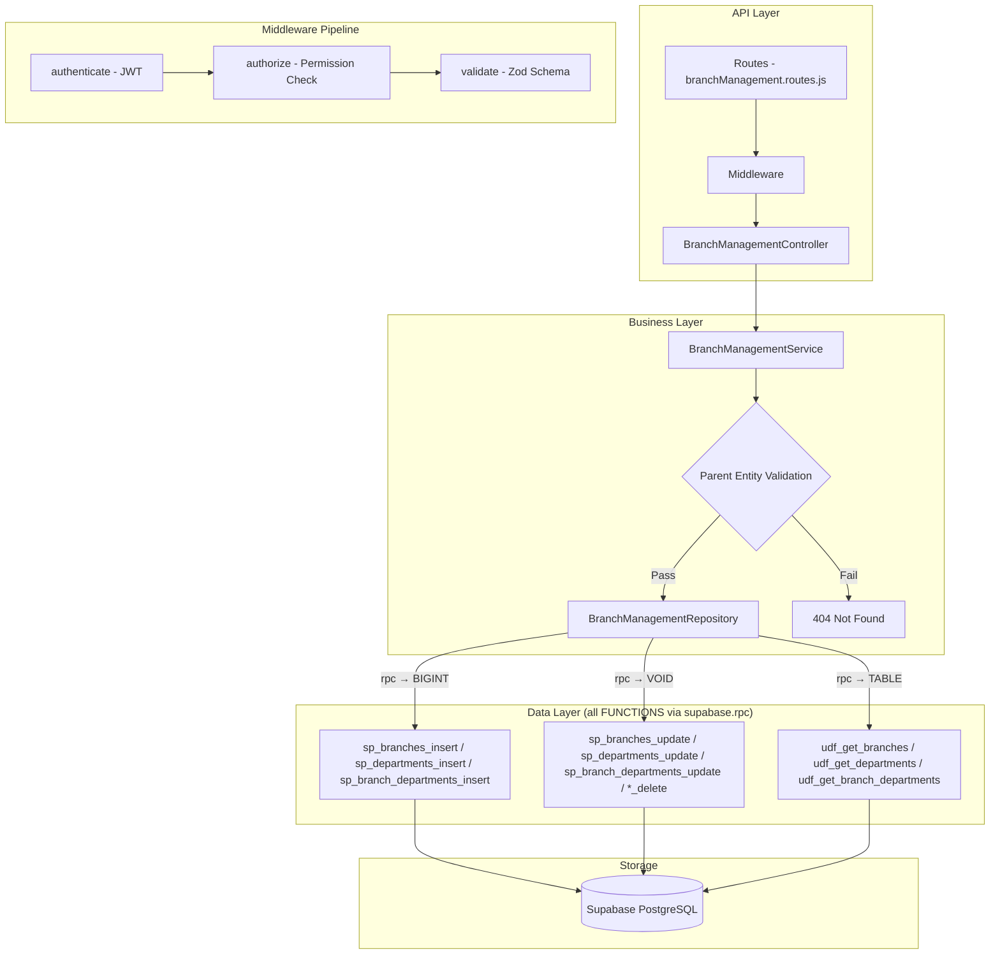

# GrowUpMore API — Branch Management (Branches, Departments, Branch Departments) Module

## Postman Testing Guide

**Base URL:** `http://localhost:5001`
**API Prefix:** `/api/v1/branch-management`
**Content-Type:** `application/json`
**Authentication:** All endpoints require `Bearer <access_token>` in Authorization header

---

## Architecture Flow



---

## Complete Endpoint Reference

### Test Order (follow this sequence in Postman)

| # | Endpoint | Permission | Purpose |
|---|----------|-----------|---------|
| 1 | `POST /branches` | `branch.create` | Create a branch (needs existing country, state, city) |
| 2 | `GET /branches` | `branch.read` | List all branches with filters |
| 3 | `GET /branches/:id` | `branch.read` | Get a single branch by ID |
| 4 | `PUT /branches/:id` | `branch.update` | Update branch details |
| 5 | `DELETE /branches/:id` | `branch.delete` | Soft-delete a branch |
| 6 | `POST /departments` | `department.create` | Create a department |
| 7 | `GET /departments` | `department.read` | List all departments with filters |
| 8 | `GET /departments/:id` | `department.read` | Get a single department by ID |
| 9 | `PUT /departments/:id` | `department.update` | Update department details |
| 10 | `DELETE /departments/:id` | `department.delete` | Soft-delete a department |
| 11 | `POST /branch-departments` | `branch_department.create` | Link branch to department |
| 12 | `GET /branch-departments` | `branch_department.read` | List all branch-department links |
| 13 | `GET /branch-departments/:id` | `branch_department.read` | Get a single link by ID |
| 14 | `PUT /branch-departments/:id` | `branch_department.update` | Update link details |
| 15 | `DELETE /branch-departments/:id` | `branch_department.delete` | Soft-delete a link |

---

## Prerequisites

Before testing, ensure:

1. **Authentication**: Login via `POST /api/v1/auth/login` to obtain `access_token`
2. **Permissions**: Run `phase03_branch_management_permissions_seed.sql` in Supabase SQL Editor
3. **Master Data**: Ensure Countries, States, Cities exist (from Phase 02) for branch creation

---

## 1. BRANCHES

### 1.1 Create Branch

**`POST /api/v1/branch-management/branches`**

**Headers:**
```
Authorization: Bearer {{access_token}}
Content-Type: application/json
```

**Body (JSON):**
```json
{
  "countryId": 1,
  "stateId": 1,
  "cityId": 1,
  "name": "Head Office - Mumbai",
  "code": "HO-MUM",
  "branchType": "office",
  "addressLine1": "123 Business Park, Andheri East",
  "addressLine2": "Tower B, 5th Floor",
  "pincode": "400069",
  "phone": "+91-22-12345678",
  "email": "mumbai@growupmore.com",
  "website": "https://growupmore.com",
  "googleMapsUrl": "https://maps.google.com/?q=19.1136,72.8697",
  "timezone": "Asia/Kolkata",
  "isActive": true
}
```

**Expected Response (201):**
```json
{
  "success": true,
  "statusCode": 201,
  "message": "Branch created successfully",
  "data": {
    "id": 1
  }
}
```

**Postman Tests:**
```javascript
pm.test("Status is 201", () => pm.response.to.have.status(201));
const json = pm.response.json();
pm.test("Has branch ID", () => pm.expect(json.data.id).to.be.a("number"));
pm.collectionVariables.set("branchId", json.data.id);
```

---

### 1.2 List Branches

**`GET /api/v1/branch-management/branches`**

**Headers:**
```
Authorization: Bearer {{access_token}}
```

**Query Parameters:**

| Parameter | Type | Default | Description |
|-----------|------|---------|-------------|
| `page` | number | 1 | Page number |
| `limit` | number | 20 | Items per page |
| `search` | string | — | Search by name or code |
| `sortBy` | string | id | Sort column |
| `sortDir` | string | ASC | Sort direction (ASC/DESC) |
| `countryId` | number | — | Filter by country |
| `stateId` | number | — | Filter by state |
| `cityId` | number | — | Filter by city |
| `branchType` | string | — | Filter by type (e.g., office, warehouse) |
| `isActive` | boolean | — | Filter by active status |

**Example:** `GET /api/v1/branch-management/branches?page=1&limit=10&branchType=office&isActive=true`

**Expected Response (200):**
```json
{
  "success": true,
  "statusCode": 200,
  "message": "Branches retrieved successfully",
  "data": [
    {
      "id": 1,
      "name": "Head Office - Mumbai",
      "code": "HO-MUM",
      "branch_type": "office",
      "country_name": "India",
      "state_name": "Maharashtra",
      "city_name": "Mumbai",
      "is_active": true,
      "total_count": 1
    }
  ],
  "meta": {
    "page": 1,
    "limit": 10,
    "totalCount": 1,
    "totalPages": 1
  }
}
```

**Postman Tests:**
```javascript
pm.test("Status is 200", () => pm.response.to.have.status(200));
const json = pm.response.json();
pm.test("Data is array", () => pm.expect(json.data).to.be.an("array"));
pm.test("Has meta pagination", () => {
    pm.expect(json.meta).to.have.property("page");
    pm.expect(json.meta).to.have.property("totalCount");
});
```

---

### 1.3 Get Branch by ID

**`GET /api/v1/branch-management/branches/:id`**

**Headers:**
```
Authorization: Bearer {{access_token}}
```

**Example:** `GET /api/v1/branch-management/branches/{{branchId}}`

**Expected Response (200):**
```json
{
  "success": true,
  "statusCode": 200,
  "message": "Branch retrieved successfully",
  "data": [
    {
      "id": 1,
      "name": "Head Office - Mumbai",
      "code": "HO-MUM",
      "branch_type": "office",
      "address_line_1": "123 Business Park, Andheri East",
      "address_line_2": "Tower B, 5th Floor",
      "pincode": "400069",
      "phone": "+91-22-12345678",
      "email": "mumbai@growupmore.com",
      "website": "https://growupmore.com",
      "google_maps_url": "https://maps.google.com/?q=19.1136,72.8697",
      "timezone": "Asia/Kolkata",
      "country_name": "India",
      "state_name": "Maharashtra",
      "city_name": "Mumbai",
      "is_active": true
    }
  ]
}
```

---

### 1.4 Update Branch

**`PUT /api/v1/branch-management/branches/:id`**

**Headers:**
```
Authorization: Bearer {{access_token}}
Content-Type: application/json
```

**Body (JSON — partial update supported):**
```json
{
  "name": "Head Office - Mumbai (Updated)",
  "phone": "+91-22-87654321",
  "branchManagerId": 1,
  "isActive": true
}
```

**Expected Response (200):**
```json
{
  "success": true,
  "statusCode": 200,
  "message": "Branch updated successfully",
  "data": null
}
```

---

### 1.5 Delete Branch

**`DELETE /api/v1/branch-management/branches/:id`**

**Headers:**
```
Authorization: Bearer {{access_token}}
```

**Expected Response (200):**
```json
{
  "success": true,
  "statusCode": 200,
  "message": "Branch deleted successfully"
}
```

---

## 2. DEPARTMENTS

### 2.1 Create Department

**`POST /api/v1/branch-management/departments`**

**Headers:**
```
Authorization: Bearer {{access_token}}
Content-Type: application/json
```

**Body (JSON):**
```json
{
  "name": "Engineering",
  "code": "ENG",
  "description": "Software engineering and product development",
  "parentDepartmentId": null,
  "isActive": true
}
```

**Expected Response (201):**
```json
{
  "success": true,
  "statusCode": 201,
  "message": "Department created successfully",
  "data": {
    "id": 1
  }
}
```

**Postman Tests:**
```javascript
pm.test("Status is 201", () => pm.response.to.have.status(201));
const json = pm.response.json();
pm.test("Has department ID", () => pm.expect(json.data.id).to.be.a("number"));
pm.collectionVariables.set("departmentId", json.data.id);
```

---

### 2.2 Create Sub-Department (child of Engineering)

**`POST /api/v1/branch-management/departments`**

**Body (JSON):**
```json
{
  "name": "Frontend Development",
  "code": "FE-DEV",
  "description": "Frontend UI/UX development team",
  "parentDepartmentId": 1,
  "isActive": true
}
```

---

### 2.3 List Departments

**`GET /api/v1/branch-management/departments`**

**Headers:**
```
Authorization: Bearer {{access_token}}
```

**Query Parameters:**

| Parameter | Type | Default | Description |
|-----------|------|---------|-------------|
| `page` | number | 1 | Page number |
| `limit` | number | 20 | Items per page |
| `search` | string | — | Search by name or code |
| `sortBy` | string | id | Sort column |
| `sortDir` | string | ASC | Sort direction (ASC/DESC) |
| `parentDepartmentId` | number | — | Filter by parent department |
| `topLevelOnly` | boolean | — | Show only top-level (no parent) departments |
| `code` | string | — | Filter by exact code |
| `isActive` | boolean | — | Filter by active status |

**Example:** `GET /api/v1/branch-management/departments?topLevelOnly=true&isActive=true`

**Expected Response (200):**
```json
{
  "success": true,
  "statusCode": 200,
  "message": "Departments retrieved successfully",
  "data": [
    {
      "id": 1,
      "name": "Engineering",
      "code": "ENG",
      "description": "Software engineering and product development",
      "parent_department_id": null,
      "is_active": true,
      "total_count": 1
    }
  ],
  "meta": {
    "page": 1,
    "limit": 20,
    "totalCount": 1,
    "totalPages": 1
  }
}
```

---

### 2.4 Get Department by ID

**`GET /api/v1/branch-management/departments/:id`**

**Example:** `GET /api/v1/branch-management/departments/{{departmentId}}`

**Expected Response (200):**
```json
{
  "success": true,
  "statusCode": 200,
  "message": "Department retrieved successfully",
  "data": [
    {
      "id": 1,
      "name": "Engineering",
      "code": "ENG",
      "description": "Software engineering and product development",
      "parent_department_id": null,
      "head_user_id": null,
      "is_active": true
    }
  ]
}
```

---

### 2.5 Update Department

**`PUT /api/v1/branch-management/departments/:id`**

**Headers:**
```
Authorization: Bearer {{access_token}}
Content-Type: application/json
```

**Body (JSON — partial update supported):**
```json
{
  "description": "Software engineering, DevOps, and product development",
  "headUserId": 1,
  "isActive": true
}
```

**Expected Response (200):**
```json
{
  "success": true,
  "statusCode": 200,
  "message": "Department updated successfully",
  "data": null
}
```

---

### 2.6 Delete Department

**`DELETE /api/v1/branch-management/departments/:id`**

**Headers:**
```
Authorization: Bearer {{access_token}}
```

**Expected Response (200):**
```json
{
  "success": true,
  "statusCode": 200,
  "message": "Department deleted successfully"
}
```

---

## 3. BRANCH DEPARTMENTS

### 3.1 Create Branch Department

**`POST /api/v1/branch-management/branch-departments`**

**Headers:**
```
Authorization: Bearer {{access_token}}
Content-Type: application/json
```

**Body (JSON):**
```json
{
  "branchId": 1,
  "departmentId": 1,
  "localHeadUserId": null,
  "employeeCapacity": 50,
  "floorOrWing": "5th Floor, Wing A",
  "extensionNumber": "5001",
  "addressLine1": "123 Business Park, Andheri East",
  "addressLine2": "Tower B",
  "pincode": "400069",
  "countryId": 1,
  "stateId": 1,
  "cityId": 1,
  "phone": "+91-22-55551234",
  "googleMapsUrl": "https://maps.google.com/?q=19.1136,72.8697",
  "isActive": true
}
```

**Expected Response (201):**
```json
{
  "success": true,
  "statusCode": 201,
  "message": "Branch Department created successfully",
  "data": {
    "id": 1
  }
}
```

**Postman Tests:**
```javascript
pm.test("Status is 201", () => pm.response.to.have.status(201));
const json = pm.response.json();
pm.test("Has branch-department ID", () => pm.expect(json.data.id).to.be.a("number"));
pm.collectionVariables.set("branchDepartmentId", json.data.id);
```

---

### 3.2 List Branch Departments

**`GET /api/v1/branch-management/branch-departments`**

**Headers:**
```
Authorization: Bearer {{access_token}}
```

**Query Parameters:**

| Parameter | Type | Default | Description |
|-----------|------|---------|-------------|
| `page` | number | 1 | Page number |
| `limit` | number | 20 | Items per page |
| `search` | string | — | Search by branch name or department name |
| `sortBy` | string | id | Sort column |
| `sortDir` | string | ASC | Sort direction (ASC/DESC) |
| `branchId` | number | — | Filter by branch |
| `departmentId` | number | — | Filter by department |
| `branchType` | string | — | Filter by branch type |
| `isActive` | boolean | — | Filter by active status |

**Example:** `GET /api/v1/branch-management/branch-departments?branchId=1&isActive=true`

**Expected Response (200):**
```json
{
  "success": true,
  "statusCode": 200,
  "message": "Branch Departments retrieved successfully",
  "data": [
    {
      "id": 1,
      "branch_id": 1,
      "branch_name": "Head Office - Mumbai",
      "department_id": 1,
      "department_name": "Engineering",
      "employee_capacity": 50,
      "floor_or_wing": "5th Floor, Wing A",
      "is_active": true,
      "total_count": 1
    }
  ],
  "meta": {
    "page": 1,
    "limit": 20,
    "totalCount": 1,
    "totalPages": 1
  }
}
```

---

### 3.3 Get Branch Department by ID

**`GET /api/v1/branch-management/branch-departments/:id`**

**Example:** `GET /api/v1/branch-management/branch-departments/{{branchDepartmentId}}`

**Expected Response (200):**
```json
{
  "success": true,
  "statusCode": 200,
  "message": "Branch Department retrieved successfully",
  "data": [
    {
      "id": 1,
      "branch_id": 1,
      "branch_name": "Head Office - Mumbai",
      "department_id": 1,
      "department_name": "Engineering",
      "local_head_user_id": null,
      "employee_capacity": 50,
      "floor_or_wing": "5th Floor, Wing A",
      "extension_number": "5001",
      "address_line_1": "123 Business Park, Andheri East",
      "address_line_2": "Tower B",
      "pincode": "400069",
      "phone": "+91-22-55551234",
      "google_maps_url": "https://maps.google.com/?q=19.1136,72.8697",
      "is_active": true
    }
  ]
}
```

---

### 3.4 Update Branch Department

**`PUT /api/v1/branch-management/branch-departments/:id`**

**Headers:**
```
Authorization: Bearer {{access_token}}
Content-Type: application/json
```

**Body (JSON — partial update supported):**
```json
{
  "employeeCapacity": 75,
  "floorOrWing": "5th & 6th Floor, Wing A",
  "localHeadUserId": 1,
  "isActive": true
}
```

**Expected Response (200):**
```json
{
  "success": true,
  "statusCode": 200,
  "message": "Branch Department updated successfully",
  "data": null
}
```

---

### 3.5 Delete Branch Department

**`DELETE /api/v1/branch-management/branch-departments/:id`**

**Headers:**
```
Authorization: Bearer {{access_token}}
```

**Expected Response (200):**
```json
{
  "success": true,
  "statusCode": 200,
  "message": "Branch Department deleted successfully"
}
```

---

## Postman Collection Variables

Set these variables in your Postman collection for easy reuse:

| Variable | Initial Value | Description |
|----------|---------------|-------------|
| `baseUrl` | `http://localhost:5001` | API base URL |
| `access_token` | *(from login)* | JWT access token |
| `branchId` | *(auto-set)* | Last created branch ID |
| `departmentId` | *(auto-set)* | Last created department ID |
| `branchDepartmentId` | *(auto-set)* | Last created branch-department ID |

---

## Error Responses

All endpoints follow a consistent error format:

**Validation Error (400):**
```json
{
  "success": false,
  "statusCode": 400,
  "message": "Validation error",
  "errors": [
    {
      "field": "name",
      "message": "String must contain at least 1 character(s)"
    }
  ]
}
```

**Unauthorized (401):**
```json
{
  "success": false,
  "statusCode": 401,
  "message": "Access token is missing or invalid"
}
```

**Forbidden (403):**
```json
{
  "success": false,
  "statusCode": 403,
  "message": "You do not have permission to perform this action"
}
```

**Not Found (404):**
```json
{
  "success": false,
  "statusCode": 404,
  "message": "Branch not found"
}
```

---

## Permission Codes Summary

| Resource | Create | Read | Update | Delete |
|----------|--------|------|--------|--------|
| Branch | `branch.create` | `branch.read` | `branch.update` | `branch.delete` |
| Department | `department.create` | `department.read` | `department.update` | `department.delete` |
| Branch Department | `branch_department.create` | `branch_department.read` | `branch_department.update` | `branch_department.delete` |

**Module:** `branch_management` (module_id = 3)

---

## Database Functions Reference

| Entity | Get | Insert | Update | Delete |
|--------|-----|--------|--------|--------|
| Branches | `udf_get_branches` | `sp_branches_insert` | `sp_branches_update` | `sp_branches_delete` |
| Departments | `udf_get_departments` | `sp_departments_insert` | `sp_departments_update` | `sp_departments_delete` |
| Branch Departments | `udf_get_branch_departments` | `sp_branch_departments_insert` | `sp_branch_departments_update` | `sp_branch_departments_delete` |
