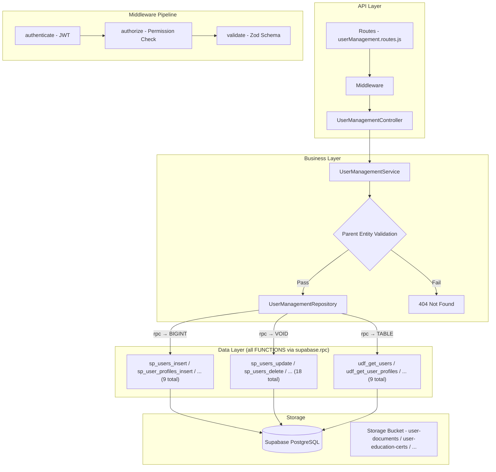

# GrowUpMore API — User Management (Users, Profiles, Education, Experience, Social Media, Skills, Languages, Documents, Projects) Module

## Postman Testing Guide

**Base URL:** `http://localhost:5001`
**API Prefix:** `/api/v1/user-management`
**Content-Type:** `application/json` or `multipart/form-data` (for file uploads)
**Authentication:** All endpoints require `Bearer <access_token>` in Authorization header

---

## Architecture Flow



---

## Complete Endpoint Reference

### Test Order (follow this sequence in Postman)

| # | Endpoint | Permission | Purpose |
|---|----------|-----------|---------|
| 1 | `POST /users` | `user.create` | Create a user (needs existing country) |
| 2 | `GET /users` | `user.read` | List all users with filters |
| 3 | `GET /users/:id` | `user.read` | Get a single user by ID |
| 4 | `PATCH/users/:id` | `user.update` | Update user details |
| 5 | `DELETE /users/:id` | `user.delete` | Soft-delete a user |
| 6 | `POST /users/:id/restore` | `user.update` | Restore a soft-deleted user |
| 7 | `POST /user-profiles` | `user_profile.create` | Create user profile with photos |
| 8 | `GET /user-profiles` | `user_profile.read` | List all profiles with filters |
| 9 | `GET /user-profiles/:id` | `user_profile.read` | Get a single profile by ID |
| 10 | `PATCH/user-profiles/:id` | `user_profile.update` | Update profile details |
| 11 | `DELETE /user-profiles/:id` | `user_profile.delete` | Soft-delete a profile |
| 12 | `POST /user-education` | `user_education.create` | Create education record with certificate |
| 13 | `GET /user-education` | `user_education.read` | List all education records with filters |
| 14 | `GET /user-education/:id` | `user_education.read` | Get a single education record by ID |
| 15 | `PATCH/user-education/:id` | `user_education.update` | Update education details |
| 16 | `DELETE /user-education/:id` | `user_education.delete` | Soft-delete education record |
| 17 | `POST /user-experience` | `user_experience.create` | Create experience record |
| 18 | `GET /user-experience` | `user_experience.read` | List all experience records with filters |
| 19 | `GET /user-experience/:id` | `user_experience.read` | Get a single experience record by ID |
| 20 | `PATCH/user-experience/:id` | `user_experience.update` | Update experience details |
| 21 | `DELETE /user-experience/:id` | `user_experience.delete` | Soft-delete experience record |
| 22 | `POST /user-social-medias` | `user_social_media.create` | Create social media record |
| 23 | `GET /user-social-medias` | `user_social_media.read` | List all social media records with filters |
| 24 | `GET /user-social-medias/:id` | `user_social_media.read` | Get a single social media record by ID |
| 25 | `PATCH/user-social-medias/:id` | `user_social_media.update` | Update social media details |
| 26 | `DELETE /user-social-medias/:id` | `user_social_media.delete` | Soft-delete social media record |
| 27 | `POST /user-skills` | `user_skill.create` | Create skill record with certificate |
| 28 | `GET /user-skills` | `user_skill.read` | List all skill records with filters |
| 29 | `GET /user-skills/:id` | `user_skill.read` | Get a single skill record by ID |
| 30 | `PATCH/user-skills/:id` | `user_skill.update` | Update skill details |
| 31 | `DELETE /user-skills/:id` | `user_skill.delete` | Soft-delete skill record |
| 32 | `POST /user-languages` | `user_language.create` | Create language record |
| 33 | `GET /user-languages` | `user_language.read` | List all language records with filters |
| 34 | `GET /user-languages/:id` | `user_language.read` | Get a single language record by ID |
| 35 | `PATCH/user-languages/:id` | `user_language.update` | Update language details |
| 36 | `DELETE /user-languages/:id` | `user_language.delete` | Soft-delete language record |
| 37 | `POST /user-documents` | `user_document.create` | Create document record with file |
| 38 | `GET /user-documents` | `user_document.read` | List all document records with filters |
| 39 | `GET /user-documents/:id` | `user_document.read` | Get a single document record by ID |
| 40 | `PATCH/user-documents/:id` | `user_document.update` | Update document details |
| 41 | `DELETE /user-documents/:id` | `user_document.delete` | Soft-delete document record |
| 42 | `POST /user-projects` | `user_project.create` | Create project record with thumbnail |
| 43 | `GET /user-projects` | `user_project.read` | List all project records with filters |
| 44 | `GET /user-projects/:id` | `user_project.read` | Get a single project record by ID |
| 45 | `PATCH/user-projects/:id` | `user_project.update` | Update project details |
| 46 | `DELETE /user-projects/:id` | `user_project.delete` | Soft-delete project record |

---

## Prerequisites

Before testing, ensure:

1. **Authentication**: Login via `POST /api/v1/auth/login` to obtain `access_token`
2. **Permissions**: Run `phase04_user_management_permissions_seed.sql` in Supabase SQL Editor
3. **Master Data**: Ensure Countries exist (from Phase 02), and Education Levels, Designations, Skills, Languages, Document Types, Social Media Platforms exist

---

## 1. USERS

### 1.1 Create User

**`POST /api/v1/user-management/users`**

**Headers:**
```
Authorization: Bearer {{access_token}}
Content-Type: application/json
```

**Body (JSON):**
```json
{
  "countryId": 1,
  "firstName": "John",
  "lastName": "Doe",
  "email": "john.doe@example.com",
  "mobile": "+91-9876543210",
  "password": "SecurePassword@123",
  "role": "user",
  "isActive": true
}
```

**Expected Response (201):**
```json
{
  "success": true,
  "statusCode": 201,
  "message": "User created successfully",
  "data": {
    "id": 1
  }
}
```

**Postman Tests:**
```javascript
pm.test("Status is 201", () => pm.response.to.have.status(201));
const json = pm.response.json();
pm.test("Has user ID", () => pm.expect(json.data.id).to.be.a("number"));
pm.collectionVariables.set("userId", json.data.id);
```

---

### 1.2 List Users

**`GET /api/v1/user-management/users`**

**Headers:**
```
Authorization: Bearer {{access_token}}
```

**Query Parameters:**

| Parameter | Type | Default | Description |
|-----------|------|---------|-------------|
| `page` | number | 1 | Page number |
| `limit` | number | 20 | Items per page |
| `search` | string | — | Search by firstName, lastName, email, or mobile |
| `sortBy` | string | id | Sort column |
| `sortDir` | string | ASC | Sort direction (ASC/DESC) |
| `role` | string | — | Filter by role |
| `countryId` | number | — | Filter by country |
| `isActive` | boolean | — | Filter by active status |
| `isEmailVerified` | boolean | — | Filter by email verification |
| `isMobileVerified` | boolean | — | Filter by mobile verification |

**Example:** `GET /api/v1/user-management/users?page=1&limit=10&role=user&isActive=true`

**Expected Response (200):**
```json
{
  "success": true,
  "statusCode": 200,
  "message": "Users retrieved successfully",
  "data": [
    {
      "id": 1,
      "first_name": "John",
      "last_name": "Doe",
      "email": "john.doe@example.com",
      "mobile": "+91-9876543210",
      "role": "user",
      "country_name": "India",
      "is_active": true,
      "is_email_verified": true,
      "is_mobile_verified": true,
      "total_count": 1
    }
  ],
  "meta": {
    "page": 1,
    "limit": 10,
    "totalCount": 1,
    "totalPages": 1
  }
}
```

**Postman Tests:**
```javascript
pm.test("Status is 200", () => pm.response.to.have.status(200));
const json = pm.response.json();
pm.test("Data is array", () => pm.expect(json.data).to.be.an("array"));
pm.test("Has meta pagination", () => {
    pm.expect(json.meta).to.have.property("page");
    pm.expect(json.meta).to.have.property("totalCount");
});
```

---

### 1.3 Get User by ID

**`GET /api/v1/user-management/users/:id`**

**Headers:**
```
Authorization: Bearer {{access_token}}
```

**Example:** `GET /api/v1/user-management/users/{{userId}}`

**Expected Response (200):**
```json
{
  "success": true,
  "statusCode": 200,
  "message": "User retrieved successfully",
  "data": [
    {
      "id": 1,
      "first_name": "John",
      "last_name": "Doe",
      "email": "john.doe@example.com",
      "mobile": "+91-9876543210",
      "role": "user",
      "country_name": "India",
      "is_active": true,
      "is_email_verified": true,
      "is_mobile_verified": true,
      "created_at": "2026-04-05T10:00:00Z",
      "updated_at": "2026-04-05T10:00:00Z"
    }
  ]
}
```

---

### 1.4 Update User

**`PATCH/api/v1/user-management/users/:id`**

**Headers:**
```
Authorization: Bearer {{access_token}}
Content-Type: application/json
```

**Body (JSON — partial update supported):**
```json
{
  "firstName": "John",
  "lastName": "Smith",
  "mobile": "+91-9876543211",
  "role": "user",
  "isActive": true
}
```

**Expected Response (200):**
```json
{
  "success": true,
  "statusCode": 200,
  "message": "User updated successfully",
  "data": null
}
```

---

### 1.5 Delete User

**`DELETE /api/v1/user-management/users/:id`**

**Headers:**
```
Authorization: Bearer {{access_token}}
```

**Expected Response (200):**
```json
{
  "success": true,
  "statusCode": 200,
  "message": "User deleted successfully"
}
```

---

### 1.6 Restore User

**Request:**
```
POST /api/v1/user-management/users/{id}/restore
```

**Headers:**
```
Authorization: Bearer {{access_token}}
Content-Type: application/json
```

**Response (200 OK):**
```json
{
  "success": true,
  "message": "User restored successfully",
  "data": {
    "id": 1
  }
}
```

> **Note:** Restores a soft-deleted user. No request body required.

---

## 2. USER PROFILES

### 2.1 Create User Profile

**`POST /api/v1/user-management/user-profiles`**

**Headers:**
```
Authorization: Bearer {{access_token}}
Content-Type: multipart/form-data
```

**Body (FormData):**
```
userId: 1 (required)
dateOfBirth: 1990-05-15
gender: male
bloodGroup: O+
maritalStatus: single
nationality: Indian
about: Software engineer with 5 years of experience in full-stack development
headline: Full Stack Developer | Cloud Architect
addressLine1: 123 Main Street
addressLine2: Apartment 456
landmark: Near City Center
countryId: 1
stateId: 1
cityId: 1
pincode: 400001
currentAddressLine1: 456 New Road
currentAddressLine2: Suite 789
currentLandmark: Business District
currentCountryId: 1
currentStateId: 1
currentCityId: 1
currentPincode: 400002
isSameAsPermanent: false
alternateEmail: john.alternative@example.com
alternateMobile: +91-9876543211
whatsappNumber: +91-9876543212
emergencyContactName: Jane Doe
emergencyContactPhone: +91-9876543213
emergencyContactRelation: Sister
aadharNumber: 1234567890123456
panNumber: ABCDE1234F
passportNumber: A12345678
bankName: ICICI Bank
bankAccountNumber: 1234567890123456
bankIfscCode: ICIC0000001
bankBranch: Andheri
bankAccountType: savings
upiId: john.doe@okhdfcbank
gstNumber: 22ABCDE1234F1Z0
preferredLanguageId: 1
timezone: Asia/Kolkata
themePreference: light
emailNotifications: true
smsNotifications: true
pushNotifications: false
isActive: true

Files:
profilePhoto: (image file)
coverPhoto: (image file)
```

**Expected Response (201):**
```json
{
  "success": true,
  "statusCode": 201,
  "message": "User profile created successfully",
  "data": {
    "id": 1
  }
}
```

**Postman Tests:**
```javascript
pm.test("Status is 201", () => pm.response.to.have.status(201));
const json = pm.response.json();
pm.test("Has profile ID", () => pm.expect(json.data.id).to.be.a("number"));
pm.collectionVariables.set("userProfileId", json.data.id);
```

---

### 2.2 List User Profiles

**`GET /api/v1/user-management/user-profiles`**

**Headers:**
```
Authorization: Bearer {{access_token}}
```

**Query Parameters:**

| Parameter | Type | Default | Description |
|-----------|------|---------|-------------|
| `page` | number | 1 | Page number |
| `limit` | number | 20 | Items per page |
| `search` | string | — | Search by name, headline, or about |
| `sortBy` | string | id | Sort column |
| `sortDir` | string | ASC | Sort direction (ASC/DESC) |
| `userId` | number | — | Filter by user ID |
| `gender` | string | — | Filter by gender |
| `bloodGroup` | string | — | Filter by blood group |
| `maritalStatus` | string | — | Filter by marital status |
| `nationality` | string | — | Filter by nationality |
| `isProfileComplete` | boolean | — | Filter by completion status |
| `countryId` | number | — | Filter by country |
| `stateId` | number | — | Filter by state |
| `cityId` | number | — | Filter by city |
| `isActive` | boolean | — | Filter by active status |

**Example:** `GET /api/v1/user-management/user-profiles?page=1&limit=10&gender=male&isActive=true`

**Expected Response (200):**
```json
{
  "success": true,
  "statusCode": 200,
  "message": "User profiles retrieved successfully",
  "data": [
    {
      "id": 1,
      "user_id": 1,
      "first_name": "John",
      "last_name": "Doe",
      "email": "john.doe@example.com",
      "gender": "male",
      "blood_group": "O+",
      "marital_status": "single",
      "nationality": "Indian",
      "headline": "Full Stack Developer | Cloud Architect",
      "about": "Software engineer with 5 years of experience in full-stack development",
      "country_name": "India",
      "state_name": "Maharashtra",
      "city_name": "Mumbai",
      "profile_photo_url": "https://...",
      "cover_photo_url": "https://...",
      "is_profile_complete": true,
      "is_active": true,
      "total_count": 1
    }
  ],
  "meta": {
    "page": 1,
    "limit": 10,
    "totalCount": 1,
    "totalPages": 1
  }
}
```

---

### 2.3 Get User Profile by ID

**`GET /api/v1/user-management/user-profiles/:id`**

**Example:** `GET /api/v1/user-management/user-profiles/{{userProfileId}}`

**Expected Response (200):**
```json
{
  "success": true,
  "statusCode": 200,
  "message": "User profile retrieved successfully",
  "data": [
    {
      "id": 1,
      "user_id": 1,
      "first_name": "John",
      "last_name": "Doe",
      "email": "john.doe@example.com",
      "date_of_birth": "1990-05-15",
      "gender": "male",
      "blood_group": "O+",
      "marital_status": "single",
      "nationality": "Indian",
      "about": "Software engineer with 5 years of experience in full-stack development",
      "headline": "Full Stack Developer | Cloud Architect",
      "address_line_1": "123 Main Street",
      "address_line_2": "Apartment 456",
      "landmark": "Near City Center",
      "pincode": "400001",
      "current_address_line_1": "456 New Road",
      "current_address_line_2": "Suite 789",
      "current_landmark": "Business District",
      "current_pincode": "400002",
      "is_same_as_permanent": false,
      "alternate_email": "john.alternative@example.com",
      "alternate_mobile": "+91-9876543211",
      "whatsapp_number": "+91-9876543212",
      "emergency_contact_name": "Jane Doe",
      "emergency_contact_phone": "+91-9876543213",
      "emergency_contact_relation": "Sister",
      "aadhar_number": "1234567890123456",
      "pan_number": "ABCDE1234F",
      "passport_number": "A12345678",
      "bank_name": "ICICI Bank",
      "bank_account_number": "1234567890123456",
      "bank_ifsc_code": "ICIC0000001",
      "bank_branch": "Andheri",
      "bank_account_type": "savings",
      "upi_id": "john.doe@okhdfcbank",
      "gst_number": "22ABCDE1234F1Z0",
      "preferred_language_name": "English",
      "timezone": "Asia/Kolkata",
      "theme_preference": "light",
      "email_notifications": true,
      "sms_notifications": true,
      "push_notifications": false,
      "profile_photo_url": "https://...",
      "cover_photo_url": "https://...",
      "is_active": true,
      "created_at": "2026-04-05T10:00:00Z",
      "updated_at": "2026-04-05T10:00:00Z"
    }
  ]
}
```

---

### 2.4 Update User Profile

**`PATCH/api/v1/user-management/user-profiles/:id`**

**Headers:**
```
Authorization: Bearer {{access_token}}
Content-Type: multipart/form-data
```

**Body (FormData — partial update supported):**
```
headline: Senior Full Stack Developer | AWS Certified Architect
about: Software engineer with 6 years of experience
themePreference: dark
emailNotifications: false
profilePhoto: (optional new image file)
```

**Expected Response (200):**
```json
{
  "success": true,
  "statusCode": 200,
  "message": "User profile updated successfully",
  "data": null
}
```

---

### 2.5 Delete User Profile

**`DELETE /api/v1/user-management/user-profiles/:id`**

**Headers:**
```
Authorization: Bearer {{access_token}}
```

**Expected Response (200):**
```json
{
  "success": true,
  "statusCode": 200,
  "message": "User profile deleted successfully"
}
```

---

## 3. USER EDUCATION

### 3.1 Create User Education

**`POST /api/v1/user-management/user-education`**

**Headers:**
```
Authorization: Bearer {{access_token}}
Content-Type: multipart/form-data
```

**Body (FormData):**
```
userId: 1 (required)
educationLevelId: 3 (required) [e.g., Bachelor's Degree]
institutionName: University of Mumbai (required)
boardOrUniversity: University of Mumbai
fieldOfStudy: Computer Science
specialization: Software Engineering
gradeOrPercentage: 85
gradeType: percentage
startDate: 2014-06-15
endDate: 2018-06-15
isCurrentlyStudying: false
isHighestQualification: true
description: Completed Bachelor of Technology in Computer Science with specialization in Software Engineering
isActive: true

Files:
certificate: (PDF or image file)
```

**Expected Response (201):**
```json
{
  "success": true,
  "statusCode": 201,
  "message": "User education record created successfully",
  "data": {
    "id": 1
  }
}
```

**Postman Tests:**
```javascript
pm.test("Status is 201", () => pm.response.to.have.status(201));
const json = pm.response.json();
pm.test("Has education ID", () => pm.expect(json.data.id).to.be.a("number"));
pm.collectionVariables.set("userEducationId", json.data.id);
```

---

### 3.2 List User Education

**`GET /api/v1/user-management/user-education`**

**Headers:**
```
Authorization: Bearer {{access_token}}
```

**Query Parameters:**

| Parameter | Type | Default | Description |
|-----------|------|---------|-------------|
| `page` | number | 1 | Page number |
| `limit` | number | 20 | Items per page |
| `search` | string | — | Search by institution or field of study |
| `sortBy` | string | id | Sort column |
| `sortDir` | string | ASC | Sort direction (ASC/DESC) |
| `userId` | number | — | Filter by user ID |
| `educationLevelId` | number | — | Filter by education level |
| `levelCategory` | string | — | Filter by category (e.g., school, diploma, degree) |
| `gradeType` | string | — | Filter by grade type |
| `isCurrentlyStudying` | boolean | — | Filter by current status |
| `isActive` | boolean | — | Filter by active status |

**Example:** `GET /api/v1/user-management/user-education?page=1&limit=10&userId=1&isActive=true`

**Expected Response (200):**
```json
{
  "success": true,
  "statusCode": 200,
  "message": "User education records retrieved successfully",
  "data": [
    {
      "id": 1,
      "user_id": 1,
      "first_name": "John",
      "last_name": "Doe",
      "education_level_name": "Bachelor's Degree",
      "level_category": "degree",
      "institution_name": "University of Mumbai",
      "field_of_study": "Computer Science",
      "specialization": "Software Engineering",
      "grade_or_percentage": 85,
      "grade_type": "percentage",
      "start_date": "2014-06-15",
      "end_date": "2018-06-15",
      "is_currently_studying": false,
      "is_highest_qualification": true,
      "is_active": true,
      "total_count": 1
    }
  ],
  "meta": {
    "page": 1,
    "limit": 10,
    "totalCount": 1,
    "totalPages": 1
  }
}
```

---

### 3.3 Get User Education by ID

**`GET /api/v1/user-management/user-education/:id`**

**Example:** `GET /api/v1/user-management/user-education/{{userEducationId}}`

**Expected Response (200):**
```json
{
  "success": true,
  "statusCode": 200,
  "message": "User education record retrieved successfully",
  "data": [
    {
      "id": 1,
      "user_id": 1,
      "first_name": "John",
      "last_name": "Doe",
      "education_level_id": 3,
      "education_level_name": "Bachelor's Degree",
      "institution_name": "University of Mumbai",
      "board_or_university": "University of Mumbai",
      "field_of_study": "Computer Science",
      "specialization": "Software Engineering",
      "grade_or_percentage": 85,
      "grade_type": "percentage",
      "start_date": "2014-06-15",
      "end_date": "2018-06-15",
      "is_currently_studying": false,
      "is_highest_qualification": true,
      "description": "Completed Bachelor of Technology in Computer Science with specialization in Software Engineering",
      "certificate_url": "https://...",
      "is_active": true,
      "created_at": "2026-04-05T10:00:00Z",
      "updated_at": "2026-04-05T10:00:00Z"
    }
  ]
}
```

---

### 3.4 Update User Education

**`PATCH/api/v1/user-management/user-education/:id`**

**Headers:**
```
Authorization: Bearer {{access_token}}
Content-Type: multipart/form-data
```

**Body (FormData — partial update supported):**
```
gradeOrPercentage: 87
specialization: Cloud Computing & Software Engineering
description: Updated description with more details
certificate: (optional new file)
```

**Expected Response (200):**
```json
{
  "success": true,
  "statusCode": 200,
  "message": "User education record updated successfully",
  "data": null
}
```

---

### 3.5 Delete User Education

**`DELETE /api/v1/user-management/user-education/:id`**

**Headers:**
```
Authorization: Bearer {{access_token}}
```

**Expected Response (200):**
```json
{
  "success": true,
  "statusCode": 200,
  "message": "User education record deleted successfully"
}
```

---

## 4. USER EXPERIENCE

### 4.1 Create User Experience

**`POST /api/v1/user-management/user-experience`**

**Headers:**
```
Authorization: Bearer {{access_token}}
Content-Type: application/json
```

**Body (JSON):**
```json
{
  "userId": 1,
  "companyName": "Tech Solutions Ltd",
  "jobTitle": "Senior Software Developer",
  "startDate": "2020-01-15",
  "designationId": 5,
  "employmentType": "full_time",
  "department": "Engineering",
  "location": "Mumbai, India",
  "workMode": "hybrid",
  "endDate": null,
  "isCurrentJob": true,
  "description": "Led development of microservices-based architecture serving 10M+ users. Mentored junior developers.",
  "keyAchievements": "Reduced API response time by 40%, Implemented CI/CD pipeline reducing deployment time by 60%",
  "skillsUsed": "Java, Spring Boot, Kubernetes, Docker, PostgreSQL",
  "salaryRange": "12-15 LPA",
  "referenceName": "John Manager",
  "referencePhone": "+91-9876543215",
  "referenceEmail": "john.manager@techsolutions.com",
  "isActive": true
}
```

**Expected Response (201):**
```json
{
  "success": true,
  "statusCode": 201,
  "message": "User experience record created successfully",
  "data": {
    "id": 1
  }
}
```

**Postman Tests:**
```javascript
pm.test("Status is 201", () => pm.response.to.have.status(201));
const json = pm.response.json();
pm.test("Has experience ID", () => pm.expect(json.data.id).to.be.a("number"));
pm.collectionVariables.set("userExperienceId", json.data.id);
```

---

### 4.2 List User Experience

**`GET /api/v1/user-management/user-experience`**

**Headers:**
```
Authorization: Bearer {{access_token}}
```

**Query Parameters:**

| Parameter | Type | Default | Description |
|-----------|------|---------|-------------|
| `page` | number | 1 | Page number |
| `limit` | number | 20 | Items per page |
| `search` | string | — | Search by company or job title |
| `sortBy` | string | id | Sort column |
| `sortDir` | string | ASC | Sort direction (ASC/DESC) |
| `userId` | number | — | Filter by user ID |
| `designationId` | number | — | Filter by designation |
| `employmentType` | string | — | Filter by employment type |
| `workMode` | string | — | Filter by work mode |
| `isCurrentJob` | boolean | — | Filter by current status |
| `isActive` | boolean | — | Filter by active status |

**Example:** `GET /api/v1/user-management/user-experience?page=1&limit=10&userId=1&isCurrentJob=true`

**Expected Response (200):**
```json
{
  "success": true,
  "statusCode": 200,
  "message": "User experience records retrieved successfully",
  "data": [
    {
      "id": 1,
      "user_id": 1,
      "first_name": "John",
      "last_name": "Doe",
      "company_name": "Tech Solutions Ltd",
      "job_title": "Senior Software Developer",
      "designation_name": "Senior Developer",
      "employment_type": "full_time",
      "work_mode": "hybrid",
      "location": "Mumbai, India",
      "start_date": "2020-01-15",
      "end_date": null,
      "is_current_job": true,
      "is_active": true,
      "total_count": 1
    }
  ],
  "meta": {
    "page": 1,
    "limit": 10,
    "totalCount": 1,
    "totalPages": 1
  }
}
```

---

### 4.3 Get User Experience by ID

**`GET /api/v1/user-management/user-experience/:id`**

**Example:** `GET /api/v1/user-management/user-experience/{{userExperienceId}}`

**Expected Response (200):**
```json
{
  "success": true,
  "statusCode": 200,
  "message": "User experience record retrieved successfully",
  "data": [
    {
      "id": 1,
      "user_id": 1,
      "first_name": "John",
      "last_name": "Doe",
      "company_name": "Tech Solutions Ltd",
      "job_title": "Senior Software Developer",
      "designation_id": 5,
      "designation_name": "Senior Developer",
      "employment_type": "full_time",
      "department": "Engineering",
      "location": "Mumbai, India",
      "work_mode": "hybrid",
      "start_date": "2020-01-15",
      "end_date": null,
      "is_current_job": true,
      "description": "Led development of microservices-based architecture serving 10M+ users. Mentored junior developers.",
      "key_achievements": "Reduced API response time by 40%, Implemented CI/CD pipeline reducing deployment time by 60%",
      "skills_used": "Java, Spring Boot, Kubernetes, Docker, PostgreSQL",
      "salary_range": "12-15 LPA",
      "reference_name": "John Manager",
      "reference_phone": "+91-9876543215",
      "reference_email": "john.manager@techsolutions.com",
      "is_active": true,
      "created_at": "2026-04-05T10:00:00Z",
      "updated_at": "2026-04-05T10:00:00Z"
    }
  ]
}
```

---

### 4.4 Update User Experience

**`PATCH/api/v1/user-management/user-experience/:id`**

**Headers:**
```
Authorization: Bearer {{access_token}}
Content-Type: application/json
```

**Body (JSON — partial update supported):**
```json
{
  "jobTitle": "Staff Software Developer",
  "description": "Led development of microservices-based architecture serving 15M+ users. Mentored team of 10 developers.",
  "keyAchievements": "Reduced API response time by 50%, Implemented CI/CD pipeline reducing deployment time by 70%"
}
```

**Expected Response (200):**
```json
{
  "success": true,
  "statusCode": 200,
  "message": "User experience record updated successfully",
  "data": null
}
```

---

### 4.5 Delete User Experience

**`DELETE /api/v1/user-management/user-experience/:id`**

**Headers:**
```
Authorization: Bearer {{access_token}}
```

**Expected Response (200):**
```json
{
  "success": true,
  "statusCode": 200,
  "message": "User experience record deleted successfully"
}
```

---

## 5. USER SOCIAL MEDIAS

### 5.1 Create User Social Media

**`POST /api/v1/user-management/user-social-medias`**

**Headers:**
```
Authorization: Bearer {{access_token}}
Content-Type: application/json
```

**Body (JSON):**
```json
{
  "userId": 1,
  "socialMediaId": 1,
  "profileUrl": "https://linkedin.com/in/johndoe",
  "username": "johndoe",
  "isPrimary": true,
  "isVerified": false,
  "isActive": true
}
```

**Expected Response (201):**
```json
{
  "success": true,
  "statusCode": 201,
  "message": "User social media record created successfully",
  "data": {
    "id": 1
  }
}
```

**Postman Tests:**
```javascript
pm.test("Status is 201", () => pm.response.to.have.status(201));
const json = pm.response.json();
pm.test("Has social media ID", () => pm.expect(json.data.id).to.be.a("number"));
pm.collectionVariables.set("userSocialMediaId", json.data.id);
```

---

### 5.2 List User Social Medias

**`GET /api/v1/user-management/user-social-medias`**

**Headers:**
```
Authorization: Bearer {{access_token}}
```

**Query Parameters:**

| Parameter | Type | Default | Description |
|-----------|------|---------|-------------|
| `page` | number | 1 | Page number |
| `limit` | number | 20 | Items per page |
| `search` | string | — | Search by username or profile URL |
| `sortBy` | string | id | Sort column |
| `sortDir` | string | ASC | Sort direction (ASC/DESC) |
| `userId` | number | — | Filter by user ID |
| `socialMediaId` | number | — | Filter by social media platform |
| `platformType` | string | — | Filter by platform name |
| `isPrimary` | boolean | — | Filter by primary status |
| `isActive` | boolean | — | Filter by active status |

**Example:** `GET /api/v1/user-management/user-social-medias?page=1&limit=10&userId=1&isPrimary=true`

**Expected Response (200):**
```json
{
  "success": true,
  "statusCode": 200,
  "message": "User social media records retrieved successfully",
  "data": [
    {
      "id": 1,
      "user_id": 1,
      "first_name": "John",
      "last_name": "Doe",
      "social_media_id": 1,
      "platform_name": "LinkedIn",
      "platform_type": "professional",
      "username": "johndoe",
      "profile_url": "https://linkedin.com/in/johndoe",
      "is_primary": true,
      "is_verified": false,
      "is_active": true,
      "total_count": 1
    }
  ],
  "meta": {
    "page": 1,
    "limit": 10,
    "totalCount": 1,
    "totalPages": 1
  }
}
```

---

### 5.3 Get User Social Media by ID

**`GET /api/v1/user-management/user-social-medias/:id`**

**Example:** `GET /api/v1/user-management/user-social-medias/{{userSocialMediaId}}`

**Expected Response (200):**
```json
{
  "success": true,
  "statusCode": 200,
  "message": "User social media record retrieved successfully",
  "data": [
    {
      "id": 1,
      "user_id": 1,
      "first_name": "John",
      "last_name": "Doe",
      "social_media_id": 1,
      "platform_name": "LinkedIn",
      "platform_type": "professional",
      "username": "johndoe",
      "profile_url": "https://linkedin.com/in/johndoe",
      "is_primary": true,
      "is_verified": false,
      "verified_at": null,
      "is_active": true,
      "created_at": "2026-04-05T10:00:00Z",
      "updated_at": "2026-04-05T10:00:00Z"
    }
  ]
}
```

---

### 5.4 Update User Social Media

**`PATCH/api/v1/user-management/user-social-medias/:id`**

**Headers:**
```
Authorization: Bearer {{access_token}}
Content-Type: application/json
```

**Body (JSON — partial update supported):**
```json
{
  "profileUrl": "https://linkedin.com/in/johndoe-updated",
  "username": "johndoe-updated",
  "isPrimary": false
}
```

**Expected Response (200):**
```json
{
  "success": true,
  "statusCode": 200,
  "message": "User social media record updated successfully",
  "data": null
}
```

---

### 5.5 Delete User Social Media

**`DELETE /api/v1/user-management/user-social-medias/:id`**

**Headers:**
```
Authorization: Bearer {{access_token}}
```

**Expected Response (200):**
```json
{
  "success": true,
  "statusCode": 200,
  "message": "User social media record deleted successfully"
}
```

---

## 6. USER SKILLS

### 6.1 Create User Skill

**`POST /api/v1/user-management/user-skills`**

**Headers:**
```
Authorization: Bearer {{access_token}}
Content-Type: multipart/form-data
```

**Body (FormData):**
```
userId: 1 (required)
skillId: 5 (required) [e.g., Java]
proficiencyLevel: advanced
yearsOfExperience: 6
isPrimary: true
endorsementCount: 45
isActive: true

Files:
certificate: (optional PDF or image file)
```

**Expected Response (201):**
```json
{
  "success": true,
  "statusCode": 201,
  "message": "User skill record created successfully",
  "data": {
    "id": 1
  }
}
```

**Postman Tests:**
```javascript
pm.test("Status is 201", () => pm.response.to.have.status(201));
const json = pm.response.json();
pm.test("Has skill ID", () => pm.expect(json.data.id).to.be.a("number"));
pm.collectionVariables.set("userSkillId", json.data.id);
```

---

### 6.2 List User Skills

**`GET /api/v1/user-management/user-skills`**

**Headers:**
```
Authorization: Bearer {{access_token}}
```

**Query Parameters:**

| Parameter | Type | Default | Description |
|-----------|------|---------|-------------|
| `page` | number | 1 | Page number |
| `limit` | number | 20 | Items per page |
| `search` | string | — | Search by skill name |
| `sortBy` | string | id | Sort column |
| `sortDir` | string | ASC | Sort direction (ASC/DESC) |
| `userId` | number | — | Filter by user ID |
| `skillId` | number | — | Filter by skill |
| `proficiencyLevel` | string | — | Filter by proficiency level |
| `skillCategory` | string | — | Filter by skill category |
| `isPrimary` | boolean | — | Filter by primary status |
| `isActive` | boolean | — | Filter by active status |

**Example:** `GET /api/v1/user-management/user-skills?page=1&limit=10&userId=1&proficiencyLevel=advanced`

**Expected Response (200):**
```json
{
  "success": true,
  "statusCode": 200,
  "message": "User skill records retrieved successfully",
  "data": [
    {
      "id": 1,
      "user_id": 1,
      "first_name": "John",
      "last_name": "Doe",
      "skill_id": 5,
      "skill_name": "Java",
      "skill_category": "Programming Language",
      "proficiency_level": "advanced",
      "years_of_experience": 6,
      "endorsement_count": 45,
      "is_primary": true,
      "is_active": true,
      "total_count": 1
    }
  ],
  "meta": {
    "page": 1,
    "limit": 10,
    "totalCount": 1,
    "totalPages": 1
  }
}
```

---

### 6.3 Get User Skill by ID

**`GET /api/v1/user-management/user-skills/:id`**

**Example:** `GET /api/v1/user-management/user-skills/{{userSkillId}}`

**Expected Response (200):**
```json
{
  "success": true,
  "statusCode": 200,
  "message": "User skill record retrieved successfully",
  "data": [
    {
      "id": 1,
      "user_id": 1,
      "first_name": "John",
      "last_name": "Doe",
      "skill_id": 5,
      "skill_name": "Java",
      "skill_category": "Programming Language",
      "proficiency_level": "advanced",
      "years_of_experience": 6,
      "endorsement_count": 45,
      "is_primary": true,
      "certificate_url": "https://...",
      "is_active": true,
      "created_at": "2026-04-05T10:00:00Z",
      "updated_at": "2026-04-05T10:00:00Z"
    }
  ]
}
```

---

### 6.4 Update User Skill

**`PATCH/api/v1/user-management/user-skills/:id`**

**Headers:**
```
Authorization: Bearer {{access_token}}
Content-Type: multipart/form-data
```

**Body (FormData — partial update supported):**
```
proficiencyLevel: expert
yearsOfExperience: 7
endorsementCount: 55
certificate: (optional new file)
```

**Expected Response (200):**
```json
{
  "success": true,
  "statusCode": 200,
  "message": "User skill record updated successfully",
  "data": null
}
```

---

### 6.5 Delete User Skill

**`DELETE /api/v1/user-management/user-skills/:id`**

**Headers:**
```
Authorization: Bearer {{access_token}}
```

**Expected Response (200):**
```json
{
  "success": true,
  "statusCode": 200,
  "message": "User skill record deleted successfully"
}
```

---

## 7. USER LANGUAGES

### 7.1 Create User Language

**`POST /api/v1/user-management/user-languages`**

**Headers:**
```
Authorization: Bearer {{access_token}}
Content-Type: application/json
```

**Body (JSON):**
```json
{
  "userId": 1,
  "languageId": 1,
  "proficiencyLevel": "fluent",
  "canRead": true,
  "canWrite": true,
  "canSpeak": true,
  "isPrimary": true,
  "isNative": true,
  "isActive": true
}
```

**Expected Response (201):**
```json
{
  "success": true,
  "statusCode": 201,
  "message": "User language record created successfully",
  "data": {
    "id": 1
  }
}
```

**Postman Tests:**
```javascript
pm.test("Status is 201", () => pm.response.to.have.status(201));
const json = pm.response.json();
pm.test("Has language ID", () => pm.expect(json.data.id).to.be.a("number"));
pm.collectionVariables.set("userLanguageId", json.data.id);
```

---

### 7.2 List User Languages

**`GET /api/v1/user-management/user-languages`**

**Headers:**
```
Authorization: Bearer {{access_token}}
```

**Query Parameters:**

| Parameter | Type | Default | Description |
|-----------|------|---------|-------------|
| `page` | number | 1 | Page number |
| `limit` | number | 20 | Items per page |
| `search` | string | — | Search by language name |
| `sortBy` | string | id | Sort column |
| `sortDir` | string | ASC | Sort direction (ASC/DESC) |
| `userId` | number | — | Filter by user ID |
| `languageId` | number | — | Filter by language |
| `proficiencyLevel` | string | — | Filter by proficiency level |
| `isPrimary` | boolean | — | Filter by primary status |
| `isNative` | boolean | — | Filter by native status |
| `isActive` | boolean | — | Filter by active status |

**Example:** `GET /api/v1/user-management/user-languages?page=1&limit=10&userId=1&isPrimary=true`

**Expected Response (200):**
```json
{
  "success": true,
  "statusCode": 200,
  "message": "User language records retrieved successfully",
  "data": [
    {
      "id": 1,
      "user_id": 1,
      "first_name": "John",
      "last_name": "Doe",
      "language_id": 1,
      "language_name": "English",
      "proficiency_level": "fluent",
      "can_read": true,
      "can_write": true,
      "can_speak": true,
      "is_primary": true,
      "is_native": true,
      "is_active": true,
      "total_count": 1
    }
  ],
  "meta": {
    "page": 1,
    "limit": 10,
    "totalCount": 1,
    "totalPages": 1
  }
}
```

---

### 7.3 Get User Language by ID

**`GET /api/v1/user-management/user-languages/:id`**

**Example:** `GET /api/v1/user-management/user-languages/{{userLanguageId}}`

**Expected Response (200):**
```json
{
  "success": true,
  "statusCode": 200,
  "message": "User language record retrieved successfully",
  "data": [
    {
      "id": 1,
      "user_id": 1,
      "first_name": "John",
      "last_name": "Doe",
      "language_id": 1,
      "language_name": "English",
      "language_code": "en",
      "proficiency_level": "fluent",
      "can_read": true,
      "can_write": true,
      "can_speak": true,
      "is_primary": true,
      "is_native": true,
      "is_active": true,
      "created_at": "2026-04-05T10:00:00Z",
      "updated_at": "2026-04-05T10:00:00Z"
    }
  ]
}
```

---

### 7.4 Update User Language

**`PATCH/api/v1/user-management/user-languages/:id`**

**Headers:**
```
Authorization: Bearer {{access_token}}
Content-Type: application/json
```

**Body (JSON — partial update supported):**
```json
{
  "proficiencyLevel": "native",
  "canRead": true,
  "canWrite": true,
  "canSpeak": true
}
```

**Expected Response (200):**
```json
{
  "success": true,
  "statusCode": 200,
  "message": "User language record updated successfully",
  "data": null
}
```

---

### 7.5 Delete User Language

**`DELETE /api/v1/user-management/user-languages/:id`**

**Headers:**
```
Authorization: Bearer {{access_token}}
```

**Expected Response (200):**
```json
{
  "success": true,
  "statusCode": 200,
  "message": "User language record deleted successfully"
}
```

---

## 8. USER DOCUMENTS

### 8.1 Create User Document

**`POST /api/v1/user-management/user-documents`**

**Headers:**
```
Authorization: Bearer {{access_token}}
Content-Type: multipart/form-data
```

**Body (FormData):**
```
userId: 1 (required)
documentTypeId: 2 (required) [e.g., Passport]
documentId: "P123456789" (required)
documentNumber: "P123456789"
fileFormat: pdf
issueDate: 2018-05-10
expiryDate: 2028-05-10
issuingAuthority: Government of India
verificationStatus: pending
isActive: true

Files:
documentFile: (PDF or image file - required)
```

**Expected Response (201):**
```json
{
  "success": true,
  "statusCode": 201,
  "message": "User document record created successfully",
  "data": {
    "id": 1
  }
}
```

**Postman Tests:**
```javascript
pm.test("Status is 201", () => pm.response.to.have.status(201));
const json = pm.response.json();
pm.test("Has document ID", () => pm.expect(json.data.id).to.be.a("number"));
pm.collectionVariables.set("userDocumentId", json.data.id);
```

---

### 8.2 List User Documents

**`GET /api/v1/user-management/user-documents`**

**Headers:**
```
Authorization: Bearer {{access_token}}
```

**Query Parameters:**

| Parameter | Type | Default | Description |
|-----------|------|---------|-------------|
| `page` | number | 1 | Page number |
| `limit` | number | 20 | Items per page |
| `search` | string | — | Search by document number or type |
| `sortBy` | string | id | Sort column |
| `sortDir` | string | ASC | Sort direction (ASC/DESC) |
| `userId` | number | — | Filter by user ID |
| `documentTypeId` | number | — | Filter by document type |
| `verificationStatus` | string | — | Filter by verification status |
| `fileFormat` | string | — | Filter by file format |
| `isActive` | boolean | — | Filter by active status |

**Example:** `GET /api/v1/user-management/user-documents?page=1&limit=10&userId=1&verificationStatus=pending`

**Expected Response (200):**
```json
{
  "success": true,
  "statusCode": 200,
  "message": "User document records retrieved successfully",
  "data": [
    {
      "id": 1,
      "user_id": 1,
      "first_name": "John",
      "last_name": "Doe",
      "document_type_id": 2,
      "document_type_name": "Passport",
      "document_id": "P123456789",
      "document_number": "P123456789",
      "file_format": "pdf",
      "issue_date": "2018-05-10",
      "expiry_date": "2028-05-10",
      "issuing_authority": "Government of India",
      "verification_status": "pending",
      "is_active": true,
      "total_count": 1
    }
  ],
  "meta": {
    "page": 1,
    "limit": 10,
    "totalCount": 1,
    "totalPages": 1
  }
}
```

---

### 8.3 Get User Document by ID

**`GET /api/v1/user-management/user-documents/:id`**

**Example:** `GET /api/v1/user-management/user-documents/{{userDocumentId}}`

**Expected Response (200):**
```json
{
  "success": true,
  "statusCode": 200,
  "message": "User document record retrieved successfully",
  "data": [
    {
      "id": 1,
      "user_id": 1,
      "first_name": "John",
      "last_name": "Doe",
      "document_type_id": 2,
      "document_type_name": "Passport",
      "document_id": "P123456789",
      "document_number": "P123456789",
      "file_format": "pdf",
      "issue_date": "2018-05-10",
      "expiry_date": "2028-05-10",
      "issuing_authority": "Government of India",
      "verification_status": "pending",
      "verified_by": null,
      "verified_at": null,
      "rejection_reason": null,
      "admin_notes": null,
      "document_file_url": "https://...",
      "is_active": true,
      "created_at": "2026-04-05T10:00:00Z",
      "updated_at": "2026-04-05T10:00:00Z"
    }
  ]
}
```

---

### 8.4 Update User Document

**`PATCH/api/v1/user-management/user-documents/:id`**

**Headers:**
```
Authorization: Bearer {{access_token}}
Content-Type: multipart/form-data
```

**Body (FormData — partial update supported):**
```
verificationStatus: verified
verifiedBy: 5 (admin user ID)
adminNotes: Document verified and approved

documentFile: (optional new file)
```

**Expected Response (200):**
```json
{
  "success": true,
  "statusCode": 200,
  "message": "User document record updated successfully",
  "data": null
}
```

---

### 8.5 Delete User Document

**`DELETE /api/v1/user-management/user-documents/:id`**

**Headers:**
```
Authorization: Bearer {{access_token}}
```

**Expected Response (200):**
```json
{
  "success": true,
  "statusCode": 200,
  "message": "User document record deleted successfully"
}
```

---

## 9. USER PROJECTS

### 9.1 Create User Project

**`POST /api/v1/user-management/user-projects`**

**Headers:**
```
Authorization: Bearer {{access_token}}
Content-Type: multipart/form-data
```

**Body (FormData):**
```
userId: 1 (required)
projectTitle: E-Commerce Platform Migration (required)
startDate: 2023-01-15 (required)
projectCode: ECOM-001
projectType: professional
description: Migrated legacy e-commerce platform from monolithic architecture to microservices with React frontend and Spring Boot backend
objectives: Improve system scalability, reduce deployment time, improve user experience
roleInProject: Tech Lead
responsibilities: Architecture design, code review, team leadership, deployment strategy
teamSize: 8
isSoloProject: false
organizationName: Tech Solutions Ltd
clientName: Online Retail Corp
industry: Retail
technologiesUsed: React, Node.js, Spring Boot, PostgreSQL, Docker, Kubernetes
toolsUsed: Git, Jenkins, Jira, Slack
programmingLanguages: JavaScript, Java
frameworks: React, Express, Spring Boot
databasesUsed: PostgreSQL, Redis
platform: Web
endDate: 2024-06-30
isOngoing: false
durationMonths: 18
projectStatus: completed
keyAchievements: Reduced API response time by 45%, Improved user conversion by 30%, Reduced deployment time from days to hours
challengesFaced: Legacy code complexity, Data migration challenges, Team coordination across timezones
lessonsLearned: Importance of backward compatibility, Value of comprehensive testing, Communication across distributed teams
impactSummary: Successfully modernized platform serving 5M+ users with 99.9% uptime
usersServed: 5000000
projectUrl: https://example.com/project
repositoryUrl: https://github.com/example/ecom-migration
demoUrl: https://demo.example.com
documentationUrl: https://docs.example.com
caseStudyUrl: https://example.com/case-study
isFeatured: true
isPublished: true
awards: Best Tech Innovation Award 2024
certifications: ISO 27001 Compliant
referenceName: Jane Client Manager
referenceEmail: jane@retailcorp.com
referencePhone: +91-9876543216
displayOrder: 1
isActive: true

Files:
thumbnail: (image file)
```

**Expected Response (201):**
```json
{
  "success": true,
  "statusCode": 201,
  "message": "User project record created successfully",
  "data": {
    "id": 1
  }
}
```

**Postman Tests:**
```javascript
pm.test("Status is 201", () => pm.response.to.have.status(201));
const json = pm.response.json();
pm.test("Has project ID", () => pm.expect(json.data.id).to.be.a("number"));
pm.collectionVariables.set("userProjectId", json.data.id);
```

---

### 9.2 List User Projects

**`GET /api/v1/user-management/user-projects`**

**Headers:**
```
Authorization: Bearer {{access_token}}
```

**Query Parameters:**

| Parameter | Type | Default | Description |
|-----------|------|---------|-------------|
| `page` | number | 1 | Page number |
| `limit` | number | 20 | Items per page |
| `search` | string | — | Search by project title or description |
| `sortBy` | string | id | Sort column |
| `sortDir` | string | ASC | Sort direction (ASC/DESC) |
| `userId` | number | — | Filter by user ID |
| `projectType` | string | — | Filter by project type |
| `projectStatus` | string | — | Filter by project status |
| `platform` | string | — | Filter by platform |
| `isOngoing` | boolean | — | Filter by ongoing status |
| `isFeatured` | boolean | — | Filter by featured status |
| `isActive` | boolean | — | Filter by active status |

**Example:** `GET /api/v1/user-management/user-projects?page=1&limit=10&userId=1&isFeatured=true`

**Expected Response (200):**
```json
{
  "success": true,
  "statusCode": 200,
  "message": "User project records retrieved successfully",
  "data": [
    {
      "id": 1,
      "user_id": 1,
      "first_name": "John",
      "last_name": "Doe",
      "project_title": "E-Commerce Platform Migration",
      "project_code": "ECOM-001",
      "project_type": "professional",
      "project_status": "completed",
      "start_date": "2023-01-15",
      "end_date": "2024-06-30",
      "is_ongoing": false,
      "duration_months": 18,
      "technologies_used": "React, Node.js, Spring Boot, PostgreSQL, Docker, Kubernetes",
      "team_size": 8,
      "platform": "Web",
      "client_name": "Online Retail Corp",
      "is_featured": true,
      "is_published": true,
      "thumbnail_url": "https://...",
      "is_active": true,
      "total_count": 1
    }
  ],
  "meta": {
    "page": 1,
    "limit": 10,
    "totalCount": 1,
    "totalPages": 1
  }
}
```

---

### 9.3 Get User Project by ID

**`GET /api/v1/user-management/user-projects/:id`**

**Example:** `GET /api/v1/user-management/user-projects/{{userProjectId}}`

**Expected Response (200):**
```json
{
  "success": true,
  "statusCode": 200,
  "message": "User project record retrieved successfully",
  "data": [
    {
      "id": 1,
      "user_id": 1,
      "first_name": "John",
      "last_name": "Doe",
      "project_title": "E-Commerce Platform Migration",
      "project_code": "ECOM-001",
      "project_type": "professional",
      "description": "Migrated legacy e-commerce platform from monolithic architecture to microservices with React frontend and Spring Boot backend",
      "objectives": "Improve system scalability, reduce deployment time, improve user experience",
      "role_in_project": "Tech Lead",
      "responsibilities": "Architecture design, code review, team leadership, deployment strategy",
      "team_size": 8,
      "is_solo_project": false,
      "organization_name": "Tech Solutions Ltd",
      "client_name": "Online Retail Corp",
      "industry": "Retail",
      "technologies_used": "React, Node.js, Spring Boot, PostgreSQL, Docker, Kubernetes",
      "tools_used": "Git, Jenkins, Jira, Slack",
      "programming_languages": "JavaScript, Java",
      "frameworks": "React, Express, Spring Boot",
      "databases_used": "PostgreSQL, Redis",
      "platform": "Web",
      "start_date": "2023-01-15",
      "end_date": "2024-06-30",
      "is_ongoing": false,
      "duration_months": 18,
      "project_status": "completed",
      "key_achievements": "Reduced API response time by 45%, Improved user conversion by 30%, Reduced deployment time from days to hours",
      "challenges_faced": "Legacy code complexity, Data migration challenges, Team coordination across timezones",
      "lessons_learned": "Importance of backward compatibility, Value of comprehensive testing, Communication across distributed teams",
      "impact_summary": "Successfully modernized platform serving 5M+ users with 99.9% uptime",
      "users_served": 5000000,
      "project_url": "https://example.com/project",
      "repository_url": "https://github.com/example/ecom-migration",
      "demo_url": "https://demo.example.com",
      "documentation_url": "https://docs.example.com",
      "case_study_url": "https://example.com/case-study",
      "is_featured": true,
      "is_published": true,
      "awards": "Best Tech Innovation Award 2024",
      "certifications": "ISO 27001 Compliant",
      "reference_name": "Jane Client Manager",
      "reference_email": "jane@retailcorp.com",
      "reference_phone": "+91-9876543216",
      "display_order": 1,
      "thumbnail_url": "https://...",
      "is_active": true,
      "created_at": "2026-04-05T10:00:00Z",
      "updated_at": "2026-04-05T10:00:00Z"
    }
  ]
}
```

---

### 9.4 Update User Project

**`PATCH/api/v1/user-management/user-projects/:id`**

**Headers:**
```
Authorization: Bearer {{access_token}}
Content-Type: multipart/form-data
```

**Body (FormData — partial update supported):**
```
keyAchievements: Reduced API response time by 50%, Improved user conversion by 35%, Reduced deployment time from days to hours
impactSummary: Successfully modernized platform serving 10M+ users with 99.95% uptime
isFeatured: true
thumbnail: (optional new image file)
```

**Expected Response (200):**
```json
{
  "success": true,
  "statusCode": 200,
  "message": "User project record updated successfully",
  "data": null
}
```

---

### 9.5 Delete User Project

**`DELETE /api/v1/user-management/user-projects/:id`**

**Headers:**
```
Authorization: Bearer {{access_token}}
```

**Expected Response (200):**
```json
{
  "success": true,
  "statusCode": 200,
  "message": "User project record deleted successfully"
}
```

---

## Postman Collection Variables

Set these variables in your Postman collection for easy reuse:

| Variable | Initial Value | Description |
|----------|---------------|-------------|
| `baseUrl` | `http://localhost:5001` | API base URL |
| `access_token` | *(from login)* | JWT access token |
| `userId` | *(auto-set)* | Last created user ID |
| `userProfileId` | *(auto-set)* | Last created user profile ID |
| `userEducationId` | *(auto-set)* | Last created user education ID |
| `userExperienceId` | *(auto-set)* | Last created user experience ID |
| `userSocialMediaId` | *(auto-set)* | Last created user social media ID |
| `userSkillId` | *(auto-set)* | Last created user skill ID |
| `userLanguageId` | *(auto-set)* | Last created user language ID |
| `userDocumentId` | *(auto-set)* | Last created user document ID |
| `userProjectId` | *(auto-set)* | Last created user project ID |

---

## Error Responses

All endpoints follow a consistent error format:

**Validation Error (400):**
```json
{
  "success": false,
  "statusCode": 400,
  "message": "Validation error",
  "errors": [
    {
      "field": "firstName",
      "message": "String must contain at least 1 character(s)"
    }
  ]
}
```

**Unauthorized (401):**
```json
{
  "success": false,
  "statusCode": 401,
  "message": "Access token is missing or invalid"
}
```

**Forbidden (403):**
```json
{
  "success": false,
  "statusCode": 403,
  "message": "You do not have permission to perform this action"
}
```

**Not Found (404):**
```json
{
  "success": false,
  "statusCode": 404,
  "message": "User not found"
}
```

**Conflict (409):**
```json
{
  "success": false,
  "statusCode": 409,
  "message": "Email already exists"
}
```

---

## Permission Codes Summary

| Resource | Create | Read | Update | Delete |
|----------|--------|------|--------|--------|
| User | `user.create` | `user.read` | `user.update` | `user.delete` |
| User Profile | `user_profile.create` | `user_profile.read` | `user_profile.update` | `user_profile.delete` |
| User Education | `user_education.create` | `user_education.read` | `user_education.update` | `user_education.delete` |
| User Experience | `user_experience.create` | `user_experience.read` | `user_experience.update` | `user_experience.delete` |
| User Social Media | `user_social_media.create` | `user_social_media.read` | `user_social_media.update` | `user_social_media.delete` |
| User Skill | `user_skill.create` | `user_skill.read` | `user_skill.update` | `user_skill.delete` |
| User Language | `user_language.create` | `user_language.read` | `user_language.update` | `user_language.delete` |
| User Document | `user_document.create` | `user_document.read` | `user_document.update` | `user_document.delete` |
| User Project | `user_project.create` | `user_project.read` | `user_project.update` | `user_project.delete` |

**Module:** `user_management` (module_id = 1)

**Total Permissions:** 36 (9 entities × 4 actions)

---

## Database Functions Reference

| Entity | Get | Insert | Update | Delete |
|--------|-----|--------|--------|--------|
| Users | `udf_get_users` | `sp_users_insert` | `sp_users_update` | `sp_users_delete` |
| User Profiles | `udf_get_user_profiles` | `sp_user_profiles_insert` | `sp_user_profiles_update` | `sp_user_profiles_delete` |
| User Education | `udf_get_user_education` | `sp_user_education_insert` | `sp_user_education_update` | `sp_user_education_delete` |
| User Experience | `udf_get_user_experience` | `sp_user_experience_insert` | `sp_user_experience_update` | `sp_user_experience_delete` |
| User Social Medias | `udf_get_user_social_medias` | `sp_user_social_medias_insert` | `sp_user_social_medias_update` | `sp_user_social_medias_delete` |
| User Skills | `udf_get_user_skills` | `sp_user_skills_insert` | `sp_user_skills_update` | `sp_user_skills_delete` |
| User Languages | `udf_get_user_languages` | `sp_user_languages_insert` | `sp_user_languages_update` | `sp_user_languages_delete` |
| User Documents | `udf_get_user_documents` | `sp_user_documents_insert` | `sp_user_documents_update` | `sp_user_documents_delete` |
| User Projects | `udf_get_user_projects` | `sp_user_projects_insert` | `sp_user_projects_update` | `sp_user_projects_delete` |
