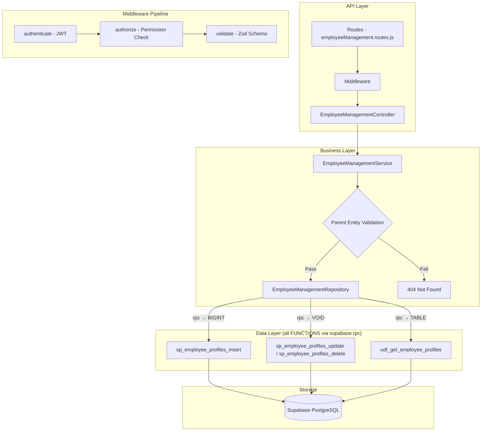

# GrowUpMore API — Employee Management Module

## Postman Testing Guide

**Base URL:** `http://localhost:5001`
**API Prefix:** `/api/v1/employee-management`
**Content-Type:** `application/json`
**Authentication:** All endpoints require `Bearer <access_token>` in Authorization header

---

## Architecture Flow



---

## Complete Endpoint Reference

### Test Order (follow this sequence in Postman)

| # | Endpoint | Permission | Purpose |
|---|----------|-----------|---------|
| 1 | `POST /employee-profiles` | `employee_profile.create` | Create an employee profile |
| 2 | `GET /employee-profiles` | `employee_profile.read` | List all employees with filters |
| 3 | `GET /employee-profiles/:id` | `employee_profile.read` | Get a single employee by ID |
| 4 | `PATCH/employee-profiles/:id` | `employee_profile.update` | Update employee details |
| 5 | `DELETE /employee-profiles/:id` | `employee_profile.delete` | Soft-delete an employee |

---

## Prerequisites

Before testing, ensure:

1. **Authentication**: Login via `POST /api/v1/auth/login` to obtain `access_token`
2. **Permissions**: Run `phase05_employee_management_permissions_seed.sql` in Supabase SQL Editor
3. **Master Data**: Ensure Users, Designations, Departments, Branches, Learning Goals exist (from earlier phases)

---

## 1. EMPLOYEE PROFILES

### 1.1 Create Employee Profile

**`POST /api/v1/employee-management/employee-profiles`**

**Headers:**
```
Authorization: Bearer {{access_token}}
Content-Type: application/json
```

**Body (JSON):**
```json
{
  "userId": 1,
  "employeeCode": "EMP-001",
  "designationId": 1,
  "departmentId": 1,
  "branchId": 1,
  "joiningDate": "2024-01-15",
  "employeeType": "full_time",
  "reportingManagerId": null,
  "confirmationDate": "2024-07-15",
  "probationEndDate": "2024-04-15",
  "contractEndDate": null,
  "workMode": "hybrid",
  "shiftType": "general",
  "shiftBranchId": 1,
  "workLocation": "Mumbai HQ",
  "weeklyOffDays": "Saturday,Sunday",
  "payGrade": "PG-3",
  "salaryCurrency": "INR",
  "ctcAnnual": 1200000,
  "basicSalaryMonthly": 75000,
  "paymentMode": "bank_transfer",
  "pfNumber": "PF-12345678",
  "esiNumber": "ESI-987654",
  "uanNumber": "UAN-123456789",
  "professionalTaxNumber": "PT-001",
  "taxRegime": "new",
  "leaveBalanceCasual": 12,
  "leaveBalanceSick": 8,
  "leaveBalanceEarned": 18,
  "leaveBalanceCompensatory": 0,
  "totalExperienceYears": 5,
  "experienceAtJoining": 3,
  "hasSystemAccess": true,
  "hasEmailAccess": true,
  "hasVpnAccess": true,
  "accessCardNumber": "AC-001",
  "laptopAssetId": "LAP-001",
  "noticePeriodDays": 30,
  "isActive": true
}
```

**Expected Response (201):**
```json
{
  "success": true,
  "statusCode": 201,
  "message": "Employee profile created successfully",
  "data": {
    "id": 1
  }
}
```

**Postman Tests:**
```javascript
pm.test("Status is 201", () => pm.response.to.have.status(201));
const json = pm.response.json();
pm.test("Has employee ID", () => pm.expect(json.data.id).to.be.a("number"));
pm.collectionVariables.set("employeeId", json.data.id);
```

---

### 1.2 Create Employee Profile (Part-Time Alternative)

**`POST /api/v1/employee-management/employee-profiles`**

**Body (JSON):**
```json
{
  "userId": 2,
  "employeeCode": "EMP-002",
  "designationId": 2,
  "departmentId": 1,
  "branchId": 1,
  "joiningDate": "2024-03-01",
  "employeeType": "part_time",
  "reportingManagerId": 1,
  "workMode": "on_site",
  "shiftType": "afternoon",
  "payGrade": "PG-2",
  "salaryCurrency": "INR",
  "ctcAnnual": 600000,
  "basicSalaryMonthly": 40000,
  "paymentMode": "bank_transfer",
  "totalExperienceYears": 2,
  "experienceAtJoining": 1,
  "hasSystemAccess": true,
  "hasEmailAccess": true,
  "hasVpnAccess": false,
  "noticePeriodDays": 15,
  "isActive": true
}
```

---

### 1.3 List Employee Profiles

**`GET /api/v1/employee-management/employee-profiles`**

**Headers:**
```
Authorization: Bearer {{access_token}}
```

**Query Parameters:**

| Parameter | Type | Default | Description |
|-----------|------|---------|-------------|
| `page` | number | 1 | Page number |
| `limit` | number | 20 | Items per page |
| `search` | string | — | Search by employee code or user name |
| `sortBy` | string | id | Sort column |
| `sortDir` | string | ASC | Sort direction (ASC/DESC) |
| `userId` | number | — | Filter by user ID |
| `employeeType` | string | — | Filter by type (full_time, part_time, contract, probation, intern, consultant, temporary, freelance) |
| `workMode` | string | — | Filter by work mode (on_site, remote, hybrid) |
| `shiftType` | string | — | Filter by shift type (general, morning, afternoon, night, rotational) |
| `payGrade` | string | — | Filter by pay grade |
| `designationId` | number | — | Filter by designation |
| `departmentId` | number | — | Filter by department |
| `branchId` | number | — | Filter by branch |
| `reportingManagerId` | number | — | Filter by reporting manager |
| `isActive` | boolean | — | Filter by active status |

**Example:** `GET /api/v1/employee-management/employee-profiles?page=1&limit=10&employeeType=full_time&isActive=true`

**Expected Response (200):**
```json
{
  "success": true,
  "statusCode": 200,
  "message": "Employee profiles retrieved successfully",
  "data": [
    {
      "id": 1,
      "user_id": 1,
      "user_name": "John Doe",
      "employee_code": "EMP-001",
      "designation_name": "Senior Engineer",
      "department_name": "Engineering",
      "branch_name": "Mumbai HQ",
      "employee_type": "full_time",
      "work_mode": "hybrid",
      "shift_type": "general",
      "pay_grade": "PG-3",
      "joining_date": "2024-01-15",
      "is_active": true,
      "total_count": 1
    }
  ],
  "meta": {
    "page": 1,
    "limit": 10,
    "totalCount": 1,
    "totalPages": 1
  }
}
```

**Postman Tests:**
```javascript
pm.test("Status is 200", () => pm.response.to.have.status(200));
const json = pm.response.json();
pm.test("Data is array", () => pm.expect(json.data).to.be.an("array"));
pm.test("Has meta pagination", () => {
    pm.expect(json.meta).to.have.property("page");
    pm.expect(json.meta).to.have.property("totalCount");
});
```

---

### 1.4 Get Employee Profile by ID

**`GET /api/v1/employee-management/employee-profiles/:id`**

**Headers:**
```
Authorization: Bearer {{access_token}}
```

**Example:** `GET /api/v1/employee-management/employee-profiles/{{employeeId}}`

**Expected Response (200):**
```json
{
  "success": true,
  "statusCode": 200,
  "message": "Employee profile retrieved successfully",
  "data": [
    {
      "id": 1,
      "user_id": 1,
      "user_name": "John Doe",
      "user_email": "john.doe@growupmore.com",
      "employee_code": "EMP-001",
      "designation_id": 1,
      "designation_name": "Senior Engineer",
      "department_id": 1,
      "department_name": "Engineering",
      "branch_id": 1,
      "branch_name": "Mumbai HQ",
      "joining_date": "2024-01-15",
      "employee_type": "full_time",
      "reporting_manager_id": null,
      "confirmation_date": "2024-07-15",
      "probation_end_date": "2024-04-15",
      "contract_end_date": null,
      "work_mode": "hybrid",
      "shift_type": "general",
      "work_location": "Mumbai HQ",
      "weekly_off_days": "Saturday,Sunday",
      "pay_grade": "PG-3",
      "salary_currency": "INR",
      "ctc_annual": 1200000,
      "basic_salary_monthly": 75000,
      "payment_mode": "bank_transfer",
      "pf_number": "PF-12345678",
      "esi_number": "ESI-987654",
      "uan_number": "UAN-123456789",
      "professional_tax_number": "PT-001",
      "tax_regime": "new",
      "leave_balance_casual": 12,
      "leave_balance_sick": 8,
      "leave_balance_earned": 18,
      "leave_balance_compensatory": 0,
      "total_experience_years": 5,
      "experience_at_joining": 3,
      "has_system_access": true,
      "has_email_access": true,
      "has_vpn_access": true,
      "access_card_number": "AC-001",
      "laptop_asset_id": "LAP-001",
      "notice_period_days": 30,
      "is_active": true
    }
  ]
}
```

---

### 1.5 Update Employee Profile

**`PATCH/api/v1/employee-management/employee-profiles/:id`**

**Headers:**
```
Authorization: Bearer {{access_token}}
Content-Type: application/json
```

**Body (JSON — partial update supported):**
```json
{
  "designationId": 3,
  "reportingManagerId": 2,
  "workMode": "remote",
  "leaveBalanceCasual": 10,
  "leaveBalanceSick": 6,
  "confirmationDate": "2024-06-15",
  "isActive": true
}
```

**Expected Response (200):**
```json
{
  "success": true,
  "statusCode": 200,
  "message": "Employee profile updated successfully",
  "data": null
}
```

**Postman Tests:**
```javascript
pm.test("Status is 200", () => pm.response.to.have.status(200));
const json = pm.response.json();
pm.test("Success is true", () => pm.expect(json.success).to.equal(true));
```

---

### 1.6 Update Employee to Inactive

**`PATCH/api/v1/employee-management/employee-profiles/:id`**

**Body (JSON):**
```json
{
  "isActive": false
}
```

---

### 1.7 Delete Employee Profile

**`DELETE /api/v1/employee-management/employee-profiles/:id`**

**Headers:**
```
Authorization: Bearer {{access_token}}
```

**Expected Response (200):**
```json
{
  "success": true,
  "statusCode": 200,
  "message": "Employee profile deleted successfully"
}
```

**Postman Tests:**
```javascript
pm.test("Status is 200", () => pm.response.to.have.status(200));
const json = pm.response.json();
pm.test("Success is true", () => pm.expect(json.success).to.equal(true));
```

---

## Postman Collection Variables

Set these variables in your Postman collection for easy reuse:

| Variable | Initial Value | Description |
|----------|---------------|-------------|
| `baseUrl` | `http://localhost:5001` | API base URL |
| `access_token` | *(from login)* | JWT access token |
| `employeeId` | *(auto-set)* | Last created employee profile ID |

---

## Error Responses

All endpoints follow a consistent error format:

**Validation Error (400):**
```json
{
  "success": false,
  "statusCode": 400,
  "message": "Validation error",
  "errors": [
    {
      "field": "employeeCode",
      "message": "String must contain at least 1 character(s)"
    },
    {
      "field": "designationId",
      "message": "Expected number, received null"
    }
  ]
}
```

**Unauthorized (401):**
```json
{
  "success": false,
  "statusCode": 401,
  "message": "Access token is missing or invalid"
}
```

**Forbidden (403):**
```json
{
  "success": false,
  "statusCode": 403,
  "message": "You do not have permission to perform this action"
}
```

**Not Found (404):**
```json
{
  "success": false,
  "statusCode": 404,
  "message": "Employee profile not found"
}
```

**Duplicate Employee Code (409):**
```json
{
  "success": false,
  "statusCode": 409,
  "message": "Employee with this code already exists"
}
```

---

## Permission Codes Summary

| Resource | Create | Read | Update | Delete |
|----------|--------|------|--------|--------|
| Employee Profile | `employee_profile.create` | `employee_profile.read` | `employee_profile.update` | `employee_profile.delete` |

**Module:** `employee_management` (module_id = 4)

---

## Database Functions Reference

| Entity | Get | Insert | Update | Delete |
|--------|-----|--------|--------|--------|
| Employee Profiles | `udf_get_employee_profiles` | `sp_employee_profiles_insert` | `sp_employee_profiles_update` | `sp_employee_profiles_delete` |
