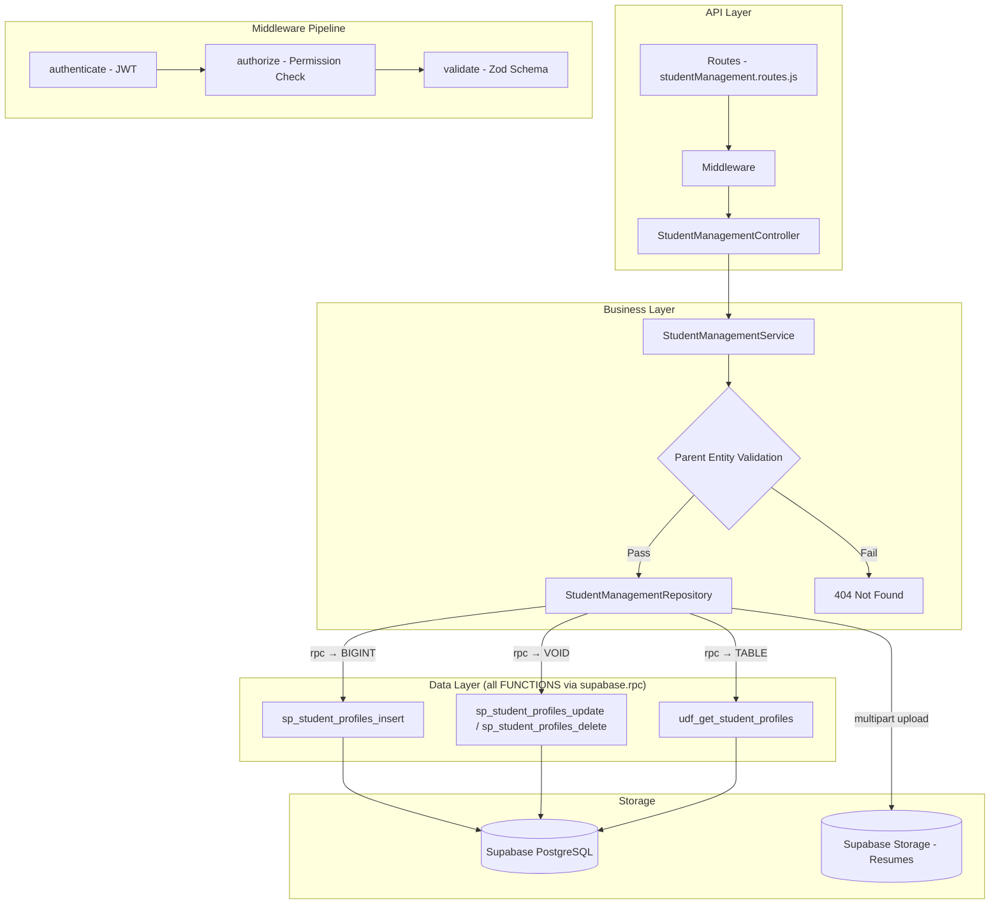

# GrowUpMore API — Student Management Module

## Postman Testing Guide

**Base URL:** `http://localhost:5001`
**API Prefix:** `/api/v1/student-management`
**Content-Type:** `application/json` or `multipart/form-data` for resume upload
**Authentication:** All endpoints require `Bearer <access_token>` in Authorization header

---

## Architecture Flow



---

## Complete Endpoint Reference

### Test Order (follow this sequence in Postman)

| # | Endpoint | Permission | Purpose |
|---|----------|-----------|---------|
| 1 | `POST /student-profiles` | `student_profile.create` | Create a student profile with optional resume |
| 2 | `GET /student-profiles` | `student_profile.read` | List all students with filters |
| 3 | `GET /student-profiles/:id` | `student_profile.read` | Get a single student by ID |
| 4 | `PATCH/student-profiles/:id` | `student_profile.update` | Update student details and resume |
| 5 | `DELETE /student-profiles/:id` | `student_profile.delete` | Soft-delete a student |
| 6 | `POST /student-profiles/:id/restore` | `student_profile.update` | Restore a soft-deleted student |

---

## Prerequisites

Before testing, ensure:

1. **Authentication**: Login via `POST /api/v1/auth/login` to obtain `access_token`
2. **Permissions**: Run `phase06_student_management_permissions_seed.sql` in Supabase SQL Editor
3. **Master Data**: Ensure Users, Education Levels, Learning Goals, Specializations, Languages exist (from earlier phases)
4. **File Storage**: Supabase Storage bucket `student-resumes` created and accessible

---

## 1. STUDENT PROFILES

### 1.1 Create Student Profile (JSON only, no resume)

**`POST /api/v1/student-management/student-profiles`**

**Headers:**
```
Authorization: Bearer {{access_token}}
Content-Type: application/json
```

**Body (JSON):**
```json
{
  "userId": 3,
  "enrollmentNumber": "STU-2024-001",
  "enrollmentDate": "2024-01-20",
  "enrollmentType": "self",
  "educationLevelId": 2,
  "currentInstitution": "Mumbai University",
  "currentFieldOfStudy": "Computer Science",
  "currentSemesterOrYear": "3rd Year",
  "expectedGraduationDate": "2026-06-30",
  "isCurrentlyStudying": true,
  "learningGoalId": 1,
  "specializationId": 1,
  "preferredLearningMode": "blended",
  "preferredLearningLanguageId": 1,
  "preferredContentType": "mixed",
  "dailyLearningHours": 3,
  "weeklyAvailableDays": 5,
  "difficultyPreference": "intermediate",
  "parentGuardianName": "Mr. Rajesh Kumar",
  "parentGuardianPhone": "+91-9876543210",
  "parentGuardianEmail": "rajesh.kumar@email.com",
  "parentGuardianRelation": "Father",
  "subscriptionPlan": "premium",
  "referredByUserId": null,
  "referralCode": null,
  "isSeekingJob": true,
  "preferredJobRoles": "Software Engineer, Full Stack Developer",
  "preferredLocations": "Mumbai, Bangalore, Pune",
  "expectedSalaryRange": "5LPA-8LPA",
  "portfolioUrl": "https://github.com/student-profile",
  "isOpenToInternship": true,
  "isOpenToFreelance": false,
  "isActive": true
}
```

**Expected Response (201):**
```json
{
  "success": true,
  "statusCode": 201,
  "message": "Student profile created successfully",
  "data": {
    "id": 1
  }
}
```

**Postman Tests:**
```javascript
pm.test("Status is 201", () => pm.response.to.have.status(201));
const json = pm.response.json();
pm.test("Has student ID", () => pm.expect(json.data.id).to.be.a("number"));
pm.collectionVariables.set("studentId", json.data.id);
```

---

### 1.2 Create Student Profile with Resume (Multipart)

**`POST /api/v1/student-management/student-profiles`**

**Headers:**
```
Authorization: Bearer {{access_token}}
Content-Type: multipart/form-data
```

**Body (Form-data):**
```
Key: studentData (form field, type: text)
Value: {
  "userId": 4,
  "enrollmentNumber": "STU-2024-002",
  "enrollmentDate": "2024-02-01",
  "enrollmentType": "corporate",
  "educationLevelId": 3,
  "currentInstitution": "IIT Bombay",
  "currentFieldOfStudy": "Electronics and Telecommunication",
  "currentSemesterOrYear": "4th Year",
  "expectedGraduationDate": "2025-06-30",
  "isCurrentlyStudying": true,
  "learningGoalId": 2,
  "specializationId": 2,
  "preferredLearningMode": "instructor_led",
  "preferredLearningLanguageId": 1,
  "preferredContentType": "video",
  "dailyLearningHours": 2,
  "weeklyAvailableDays": 4,
  "difficultyPreference": "advanced",
  "subscriptionPlan": "enterprise",
  "isSeekingJob": true,
  "preferredJobRoles": "Data Engineer, ML Engineer",
  "preferredLocations": "Bangalore",
  "expectedSalaryRange": "8LPA-12LPA",
  "portfolioUrl": "https://github.com/advanced-student",
  "isOpenToInternship": false,
  "isOpenToFreelance": true,
  "isActive": true
}

Key: resume (file, type: file)
Value: [PDF file - max 5MB: student-resume.pdf, student-resume.jpeg, student-resume.png, or student-resume.webp]
```

**Expected Response (201):**
```json
{
  "success": true,
  "statusCode": 201,
  "message": "Student profile created successfully",
  "data": {
    "id": 2,
    "resumeUrl": "https://storage.supabase.co/resumes/student-resume-uuid.pdf"
  }
}
```

---

### 1.3 List Student Profiles

**`GET /api/v1/student-management/student-profiles`**

**Headers:**
```
Authorization: Bearer {{access_token}}
```

**Query Parameters:**

| Parameter | Type | Default | Description |
|-----------|------|---------|-------------|
| `page` | number | 1 | Page number |
| `limit` | number | 20 | Items per page |
| `search` | string | — | Search by enrollment number or user name |
| `sortBy` | string | id | Sort column |
| `sortDir` | string | ASC | Sort direction (ASC/DESC) |
| `userId` | number | — | Filter by user ID |
| `enrollmentType` | string | — | Filter by enrollment type (self, corporate, scholarship, referral, trial, other) |
| `preferredLearningMode` | string | — | Filter by learning mode (self_paced, instructor_led, blended, live_online, offline_classroom) |
| `difficultyPreference` | string | — | Filter by difficulty (beginner, intermediate, advanced, expert, mixed) |
| `subscriptionPlan` | string | — | Filter by subscription plan (free, basic, premium, enterprise) |
| `educationLevelId` | number | — | Filter by education level |
| `learningGoalId` | number | — | Filter by learning goal |
| `specializationId` | number | — | Filter by specialization |
| `isCurrentlyStudying` | boolean | — | Filter by current study status |
| `isSeekingJob` | boolean | — | Filter by job-seeking status |
| `isActive` | boolean | — | Filter by active status |

**Example:** `GET /api/v1/student-management/student-profiles?page=1&limit=15&subscriptionPlan=premium&isActive=true`

**Expected Response (200):**
```json
{
  "success": true,
  "statusCode": 200,
  "message": "Student profiles retrieved successfully",
  "data": [
    {
      "id": 1,
      "user_id": 3,
      "user_name": "Priya Sharma",
      "user_email": "priya.sharma@growupmore.com",
      "enrollment_number": "STU-2024-001",
      "enrollment_type": "self",
      "education_level_name": "Bachelor's Degree",
      "specialization_name": "Web Development",
      "current_institution": "Mumbai University",
      "is_currently_studying": true,
      "learning_goal_name": "Career Transition",
      "subscription_plan": "premium",
      "is_seeking_job": true,
      "is_active": true,
      "total_count": 1
    }
  ],
  "meta": {
    "page": 1,
    "limit": 15,
    "totalCount": 1,
    "totalPages": 1
  }
}
```

**Postman Tests:**
```javascript
pm.test("Status is 200", () => pm.response.to.have.status(200));
const json = pm.response.json();
pm.test("Data is array", () => pm.expect(json.data).to.be.an("array"));
pm.test("Has meta pagination", () => {
    pm.expect(json.meta).to.have.property("page");
    pm.expect(json.meta).to.have.property("totalCount");
});
```

---

### 1.4 Get Student Profile by ID

**`GET /api/v1/student-management/student-profiles/:id`**

**Headers:**
```
Authorization: Bearer {{access_token}}
```

**Example:** `GET /api/v1/student-management/student-profiles/{{studentId}}`

**Expected Response (200):**
```json
{
  "success": true,
  "statusCode": 200,
  "message": "Student profile retrieved successfully",
  "data": [
    {
      "id": 1,
      "user_id": 3,
      "user_name": "Priya Sharma",
      "user_email": "priya.sharma@growupmore.com",
      "enrollment_number": "STU-2024-001",
      "enrollment_date": "2024-01-20",
      "enrollment_type": "self",
      "education_level_id": 2,
      "education_level_name": "Bachelor's Degree",
      "current_institution": "Mumbai University",
      "current_field_of_study": "Computer Science",
      "current_semester_or_year": "3rd Year",
      "expected_graduation_date": "2026-06-30",
      "is_currently_studying": true,
      "learning_goal_id": 1,
      "learning_goal_name": "Career Transition",
      "specialization_id": 1,
      "specialization_name": "Web Development",
      "preferred_learning_mode": "blended",
      "preferred_learning_language_id": 1,
      "preferred_content_type": "mixed",
      "daily_learning_hours": 3,
      "weekly_available_days": 5,
      "difficulty_preference": "intermediate",
      "parent_guardian_name": "Mr. Rajesh Kumar",
      "parent_guardian_phone": "+91-9876543210",
      "parent_guardian_email": "rajesh.kumar@email.com",
      "parent_guardian_relation": "Father",
      "subscription_plan": "premium",
      "referred_by_user_id": null,
      "referral_code": null,
      "is_seeking_job": true,
      "preferred_job_roles": "Software Engineer, Full Stack Developer",
      "preferred_locations": "Mumbai, Bangalore, Pune",
      "expected_salary_range": "5LPA-8LPA",
      "portfolio_url": "https://github.com/student-profile",
      "resume_url": null,
      "is_open_to_internship": true,
      "is_open_to_freelance": false,
      "is_active": true
    }
  ]
}
```

---

### 1.5 Update Student Profile

**`PATCH/api/v1/student-management/student-profiles/:id`**

**Headers:**
```
Authorization: Bearer {{access_token}}
Content-Type: application/json
```

**Body (JSON — partial update supported):**
```json
{
  "preferredLearningMode": "live_online",
  "subscriptionPlan": "enterprise",
  "isSeekingJob": true,
  "preferredJobRoles": "Senior Full Stack Developer",
  "expectedSalaryRange": "8LPA-12LPA",
  "isOpenToInternship": false,
  "dailyLearningHours": 4,
  "isActive": true
}
```

**Expected Response (200):**
```json
{
  "success": true,
  "statusCode": 200,
  "message": "Student profile updated successfully",
  "data": null
}
```

**Postman Tests:**
```javascript
pm.test("Status is 200", () => pm.response.to.have.status(200));
const json = pm.response.json();
pm.test("Success is true", () => pm.expect(json.success).to.equal(true));
```

---

### 1.6 Update Student Profile with Resume (Multipart)

**`PATCH/api/v1/student-management/student-profiles/:id`**

**Headers:**
```
Authorization: Bearer {{access_token}}
Content-Type: multipart/form-data
```

**Body (Form-data):**
```
Key: studentData (form field, type: text)
Value: {
  "preferredJobRoles": "Data Scientist, ML Engineer",
  "expectedSalaryRange": "10LPA-15LPA",
  "portfolioUrl": "https://github.com/updated-portfolio",
  "isActive": true
}

Key: resume (file, type: file)
Value: [PDF/JPEG/PNG/WebP file - max 5MB: updated-resume.pdf]
```

**Expected Response (200):**
```json
{
  "success": true,
  "statusCode": 200,
  "message": "Student profile updated successfully",
  "data": {
    "resumeUrl": "https://storage.supabase.co/resumes/updated-resume-uuid.pdf"
  }
}
```

---

### 1.7 Update Student to Inactive

**`PATCH/api/v1/student-management/student-profiles/:id`**

**Body (JSON):**
```json
{
  "isActive": false
}
```

---

### 1.8 Delete Student Profile

**`DELETE /api/v1/student-management/student-profiles/:id`**

**Headers:**
```
Authorization: Bearer {{access_token}}
```

**Expected Response (200):**
```json
{
  "success": true,
  "statusCode": 200,
  "message": "Student profile deleted successfully"
}
```

**Postman Tests:**
```javascript
pm.test("Status is 200", () => pm.response.to.have.status(200));
const json = pm.response.json();
pm.test("Success is true", () => pm.expect(json.success).to.equal(true));
```

---

### 1.9 Restore Student Profile

**Request:**
```
POST /api/v1/student-management/student-profiles/{id}/restore
```

**Headers:**
```
Authorization: Bearer {{access_token}}
Content-Type: application/json
```

**Response (200 OK):**
```json
{
  "success": true,
  "message": "Student profile restored successfully",
  "data": {
    "id": 1
  }
}
```

> **Note:** Restores a soft-deleted record. No request body required.

---

## Postman Collection Variables

Set these variables in your Postman collection for easy reuse:

| Variable | Initial Value | Description |
|----------|---------------|-------------|
| `baseUrl` | `http://localhost:5001` | API base URL |
| `access_token` | *(from login)* | JWT access token |
| `studentId` | *(auto-set)* | Last created student profile ID |

---

## Error Responses

All endpoints follow a consistent error format:

**Validation Error (400):**
```json
{
  "success": false,
  "statusCode": 400,
  "message": "Validation error",
  "errors": [
    {
      "field": "enrollmentNumber",
      "message": "String must contain at least 1 character(s)"
    },
    {
      "field": "userId",
      "message": "Expected number, received null"
    }
  ]
}
```

**File Size Error (413):**
```json
{
  "success": false,
  "statusCode": 413,
  "message": "Resume file exceeds maximum size of 5MB"
}
```

**File Type Error (400):**
```json
{
  "success": false,
  "statusCode": 400,
  "message": "Resume file must be PDF, JPEG, PNG, or WebP format"
}
```

**Unauthorized (401):**
```json
{
  "success": false,
  "statusCode": 401,
  "message": "Access token is missing or invalid"
}
```

**Forbidden (403):**
```json
{
  "success": false,
  "statusCode": 403,
  "message": "You do not have permission to perform this action"
}
```

**Not Found (404):**
```json
{
  "success": false,
  "statusCode": 404,
  "message": "Student profile not found"
}
```

**Duplicate Enrollment Number (409):**
```json
{
  "success": false,
  "statusCode": 409,
  "message": "Student with this enrollment number already exists"
}
```

---

## Permission Codes Summary

| Resource | Create | Read | Update | Delete |
|----------|--------|------|--------|--------|
| Student Profile | `student_profile.create` | `student_profile.read` | `student_profile.update` | `student_profile.delete` |

**Module:** `student_management` (module_id = 5)

---

## Database Functions Reference

| Entity | Get | Insert | Update | Delete |
|--------|-----|--------|--------|--------|
| Student Profiles | `udf_get_student_profiles` | `sp_student_profiles_insert` | `sp_student_profiles_update` | `sp_student_profiles_delete` |
