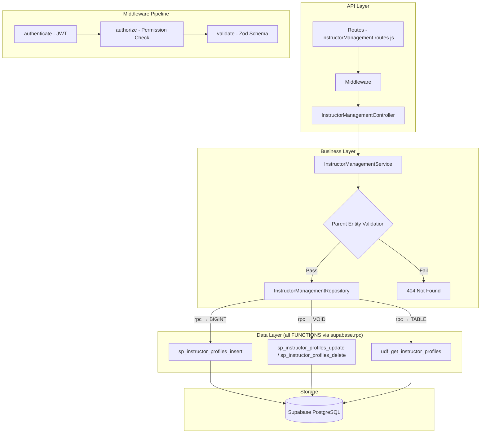

# GrowUpMore API — Instructor Management Module

## Postman Testing Guide

**Base URL:** `http://localhost:5001`
**API Prefix:** `/api/v1/instructor-management`
**Content-Type:** `application/json`
**Authentication:** All endpoints require `Bearer <access_token>` in Authorization header

---

## Architecture Flow



---

## Complete Endpoint Reference

### Test Order (follow this sequence in Postman)

| # | Endpoint | Permission | Purpose |
|---|----------|-----------|---------|
| 1 | `POST /instructor-profiles` | `instructor_profile.create` | Create an instructor profile |
| 2 | `GET /instructor-profiles` | `instructor_profile.read` | List all instructors with filters |
| 3 | `GET /instructor-profiles/:id` | `instructor_profile.read` | Get a single instructor by ID |
| 4 | `PUT /instructor-profiles/:id` | `instructor_profile.update` | Update instructor details |
| 5 | `DELETE /instructor-profiles/:id` | `instructor_profile.delete` | Soft-delete an instructor |

---

## Prerequisites

Before testing, ensure:

1. **Authentication**: Login via `POST /api/v1/auth/login` to obtain `access_token`
2. **Permissions**: Run `phase07_instructor_management_permissions_seed.sql` in Supabase SQL Editor
3. **Master Data**: Ensure Users, Designations, Departments, Branches, Specializations, Languages exist (from earlier phases)

---

## 1. INSTRUCTOR PROFILES

### 1.1 Create Instructor Profile (Internal)

**`POST /api/v1/instructor-management/instructor-profiles`**

**Headers:**
```
Authorization: Bearer {{access_token}}
Content-Type: application/json
```

**Body (JSON):**
```json
{
  "userId": 5,
  "instructorCode": "INS-001",
  "instructorType": "internal",
  "designationId": 3,
  "departmentId": 1,
  "branchId": 1,
  "joiningDate": "2023-06-01",
  "specializationId": 1,
  "secondarySpecializationId": 2,
  "teachingExperienceYears": 5,
  "industryExperienceYears": 8,
  "totalExperienceYears": 13,
  "preferredTeachingLanguageId": 1,
  "teachingMode": "hybrid",
  "instructorBio": "Passionate full-stack developer with 5+ years of teaching experience specializing in web technologies.",
  "tagline": "Expert in modern web development and mentoring",
  "demoVideoUrl": "https://youtube.com/watch?v=demo123",
  "introVideoDurationSec": 180,
  "highestQualification": "Master's in Computer Science",
  "certificationsSummary": "AWS Certified Solutions Architect, Google Cloud Associate",
  "awardsAndRecognition": "Teacher of the Year 2023",
  "isAvailable": true,
  "availableHoursPerWeek": 20,
  "availableFrom": "2024-01-01",
  "availableUntil": "2025-12-31",
  "preferredTimeSlots": "weekday evenings, weekend mornings",
  "maxConcurrentCourses": 3,
  "paymentModel": "salary",
  "revenueSharePercentage": null,
  "fixedRatePerCourse": null,
  "hourlyRate": null,
  "paymentCurrency": "INR",
  "isActive": true
}
```

**Expected Response (201):**
```json
{
  "success": true,
  "statusCode": 201,
  "message": "Instructor profile created successfully",
  "data": {
    "id": 1
  }
}
```

**Postman Tests:**
```javascript
pm.test("Status is 201", () => pm.response.to.have.status(201));
const json = pm.response.json();
pm.test("Has instructor ID", () => pm.expect(json.data.id).to.be.a("number"));
pm.collectionVariables.set("instructorId", json.data.id);
```

---

### 1.2 Create Instructor Profile (External with Revenue Share)

**`POST /api/v1/instructor-management/instructor-profiles`**

**Body (JSON):**
```json
{
  "userId": 6,
  "instructorCode": "INS-002",
  "instructorType": "external",
  "specializationId": 3,
  "teachingExperienceYears": 10,
  "industryExperienceYears": 12,
  "totalExperienceYears": 22,
  "preferredTeachingLanguageId": 1,
  "teachingMode": "online",
  "instructorBio": "Data science expert with 10+ years of experience in machine learning and analytics.",
  "tagline": "Transform data into insights",
  "demoVideoUrl": "https://youtube.com/watch?v=demo456",
  "introVideoDurationSec": 240,
  "highestQualification": "PhD in Machine Learning",
  "certificationsSummary": "TensorFlow Certified Developer, Databricks Certified",
  "awardsAndRecognition": "Best Data Science Instructor 2022, 2023",
  "isAvailable": true,
  "availableHoursPerWeek": 30,
  "availableFrom": "2024-01-15",
  "availableUntil": "2026-12-31",
  "preferredTimeSlots": "flexible",
  "maxConcurrentCourses": 5,
  "paymentModel": "revenue_share",
  "revenueSharePercentage": 40,
  "fixedRatePerCourse": null,
  "hourlyRate": null,
  "paymentCurrency": "INR",
  "isActive": true
}
```

---

### 1.3 Create Instructor Profile (External with Fixed Rate)

**`POST /api/v1/instructor-management/instructor-profiles`**

**Body (JSON):**
```json
{
  "userId": 7,
  "instructorCode": "INS-003",
  "instructorType": "external",
  "specializationId": 2,
  "teachingExperienceYears": 8,
  "industryExperienceYears": 6,
  "totalExperienceYears": 14,
  "preferredTeachingLanguageId": 1,
  "teachingMode": "recorded",
  "instructorBio": "Python and DevOps specialist with proven track record of building production systems.",
  "tagline": "Build like a Pro",
  "demoVideoUrl": "https://youtube.com/watch?v=demo789",
  "introVideoDurationSec": 150,
  "highestQualification": "Bachelor's in Engineering",
  "certificationsSummary": "Kubernetes Certified Application Developer, Docker Certified Associate",
  "awardsAndRecognition": "DevOps Community Leader",
  "isAvailable": true,
  "availableHoursPerWeek": 15,
  "availableFrom": "2024-02-01",
  "availableUntil": "2025-12-31",
  "preferredTimeSlots": "weekends",
  "maxConcurrentCourses": 2,
  "paymentModel": "fixed_per_course",
  "revenueSharePercentage": null,
  "fixedRatePerCourse": 50000,
  "hourlyRate": null,
  "paymentCurrency": "INR",
  "isActive": true
}
```

---

### 1.4 List Instructor Profiles

**`GET /api/v1/instructor-management/instructor-profiles`**

**Headers:**
```
Authorization: Bearer {{access_token}}
```

**Query Parameters:**

| Parameter | Type | Default | Description |
|-----------|------|---------|-------------|
| `page` | number | 1 | Page number |
| `limit` | number | 20 | Items per page |
| `search` | string | — | Search by instructor code or user name |
| `sortBy` | string | id | Sort column |
| `sortDir` | string | ASC | Sort direction (ASC/DESC) |
| `userId` | number | — | Filter by user ID |
| `instructorType` | string | — | Filter by type (internal, external, guest, visiting, corporate, community, other) |
| `teachingMode` | string | — | Filter by teaching mode (online, offline, hybrid, recorded) |
| `approvalStatus` | string | — | Filter by approval status (pending, approved, rejected, suspended) |
| `paymentModel` | string | — | Filter by payment model (revenue_share, fixed_per_course, hourly, salary, hybrid) |
| `badge` | string | — | Filter by badge (new, rising_star, popular, top_rated, expert, master, elite) |
| `specializationId` | number | — | Filter by specialization |
| `designationId` | number | — | Filter by designation (for internal instructors) |
| `departmentId` | number | — | Filter by department (for internal instructors) |
| `branchId` | number | — | Filter by branch (for internal instructors) |
| `isAvailable` | boolean | — | Filter by availability status |
| `isVerified` | boolean | — | Filter by verification status |
| `isFeatured` | boolean | — | Filter by featured status |
| `isActive` | boolean | — | Filter by active status |

**Example:** `GET /api/v1/instructor-management/instructor-profiles?page=1&limit=10&instructorType=external&paymentModel=revenue_share&isActive=true`

**Expected Response (200):**
```json
{
  "success": true,
  "statusCode": 200,
  "message": "Instructor profiles retrieved successfully",
  "data": [
    {
      "id": 1,
      "user_id": 5,
      "user_name": "Dr. Arun Kumar",
      "user_email": "arun.kumar@growupmore.com",
      "instructor_code": "INS-001",
      "instructor_type": "internal",
      "teaching_mode": "hybrid",
      "specialization_name": "Web Development",
      "teaching_experience_years": 5,
      "total_experience_years": 13,
      "is_available": true,
      "payment_model": "salary",
      "approval_status": "approved",
      "badge": "expert",
      "is_verified": true,
      "is_featured": true,
      "is_active": true,
      "total_count": 1
    }
  ],
  "meta": {
    "page": 1,
    "limit": 10,
    "totalCount": 1,
    "totalPages": 1
  }
}
```

**Postman Tests:**
```javascript
pm.test("Status is 200", () => pm.response.to.have.status(200));
const json = pm.response.json();
pm.test("Data is array", () => pm.expect(json.data).to.be.an("array"));
pm.test("Has meta pagination", () => {
    pm.expect(json.meta).to.have.property("page");
    pm.expect(json.meta).to.have.property("totalCount");
});
```

---

### 1.5 Get Instructor Profile by ID

**`GET /api/v1/instructor-management/instructor-profiles/:id`**

**Headers:**
```
Authorization: Bearer {{access_token}}
```

**Example:** `GET /api/v1/instructor-management/instructor-profiles/{{instructorId}}`

**Expected Response (200):**
```json
{
  "success": true,
  "statusCode": 200,
  "message": "Instructor profile retrieved successfully",
  "data": [
    {
      "id": 1,
      "user_id": 5,
      "user_name": "Dr. Arun Kumar",
      "user_email": "arun.kumar@growupmore.com",
      "instructor_code": "INS-001",
      "instructor_type": "internal",
      "designation_id": 3,
      "designation_name": "Senior Instructor",
      "department_id": 1,
      "department_name": "Engineering",
      "branch_id": 1,
      "branch_name": "Mumbai HQ",
      "joining_date": "2023-06-01",
      "specialization_id": 1,
      "specialization_name": "Web Development",
      "secondary_specialization_id": 2,
      "secondary_specialization_name": "Mobile Development",
      "teaching_experience_years": 5,
      "industry_experience_years": 8,
      "total_experience_years": 13,
      "preferred_teaching_language_id": 1,
      "teaching_mode": "hybrid",
      "instructor_bio": "Passionate full-stack developer with 5+ years of teaching experience specializing in web technologies.",
      "tagline": "Expert in modern web development and mentoring",
      "demo_video_url": "https://youtube.com/watch?v=demo123",
      "intro_video_duration_sec": 180,
      "highest_qualification": "Master's in Computer Science",
      "certifications_summary": "AWS Certified Solutions Architect, Google Cloud Associate",
      "awards_and_recognition": "Teacher of the Year 2023",
      "is_available": true,
      "available_hours_per_week": 20,
      "available_from": "2024-01-01",
      "available_until": "2025-12-31",
      "preferred_time_slots": "weekday evenings, weekend mornings",
      "max_concurrent_courses": 3,
      "payment_model": "salary",
      "revenue_share_percentage": null,
      "fixed_rate_per_course": null,
      "hourly_rate": null,
      "payment_currency": "INR",
      "approval_status": "approved",
      "badge": "expert",
      "is_verified": true,
      "is_featured": true,
      "is_active": true
    }
  ]
}
```

---

### 1.6 Update Instructor Profile

**`PUT /api/v1/instructor-management/instructor-profiles/:id`**

**Headers:**
```
Authorization: Bearer {{access_token}}
Content-Type: application/json
```

**Body (JSON — partial update supported):**
```json
{
  "teachingMode": "online",
  "isAvailable": true,
  "availableHoursPerWeek": 25,
  "maxConcurrentCourses": 4,
  "tagline": "Expert web developer & mentor",
  "awardsAndRecognition": "Teacher of the Year 2023, 2024",
  "preferredTimeSlots": "weekdays evening, weekends",
  "isActive": true
}
```

**Expected Response (200):**
```json
{
  "success": true,
  "statusCode": 200,
  "message": "Instructor profile updated successfully",
  "data": null
}
```

**Postman Tests:**
```javascript
pm.test("Status is 200", () => pm.response.to.have.status(200));
const json = pm.response.json();
pm.test("Success is true", () => pm.expect(json.success).to.equal(true));
```

---

### 1.7 Update Instructor Availability

**`PUT /api/v1/instructor-management/instructor-profiles/:id`**

**Body (JSON):**
```json
{
  "isAvailable": false,
  "availableUntil": "2024-12-31"
}
```

---

### 1.8 Update Instructor Payment Model

**`PUT /api/v1/instructor-management/instructor-profiles/:id`**

**Body (JSON):**
```json
{
  "paymentModel": "hybrid",
  "revenueSharePercentage": 35,
  "fixedRatePerCourse": 75000,
  "hourlyRate": 2500
}
```

---

### 1.9 Update Instructor to Inactive

**`PUT /api/v1/instructor-management/instructor-profiles/:id`**

**Body (JSON):**
```json
{
  "isActive": false
}
```

---

### 1.10 Delete Instructor Profile

**`DELETE /api/v1/instructor-management/instructor-profiles/:id`**

**Headers:**
```
Authorization: Bearer {{access_token}}
```

**Expected Response (200):**
```json
{
  "success": true,
  "statusCode": 200,
  "message": "Instructor profile deleted successfully"
}
```

**Postman Tests:**
```javascript
pm.test("Status is 200", () => pm.response.to.have.status(200));
const json = pm.response.json();
pm.test("Success is true", () => pm.expect(json.success).to.equal(true));
```

---

## Postman Collection Variables

Set these variables in your Postman collection for easy reuse:

| Variable | Initial Value | Description |
|----------|---------------|-------------|
| `baseUrl` | `http://localhost:5001` | API base URL |
| `access_token` | *(from login)* | JWT access token |
| `instructorId` | *(auto-set)* | Last created instructor profile ID |

---

## Error Responses

All endpoints follow a consistent error format:

**Validation Error (400):**
```json
{
  "success": false,
  "statusCode": 400,
  "message": "Validation error",
  "errors": [
    {
      "field": "instructorCode",
      "message": "String must contain at least 1 character(s)"
    },
    {
      "field": "teachingMode",
      "message": "Invalid enum value. Expected 'online' | 'offline' | 'hybrid' | 'recorded'"
    }
  ]
}
```

**Unauthorized (401):**
```json
{
  "success": false,
  "statusCode": 401,
  "message": "Access token is missing or invalid"
}
```

**Forbidden (403):**
```json
{
  "success": false,
  "statusCode": 403,
  "message": "You do not have permission to perform this action"
}
```

**Not Found (404):**
```json
{
  "success": false,
  "statusCode": 404,
  "message": "Instructor profile not found"
}
```

**Duplicate Instructor Code (409):**
```json
{
  "success": false,
  "statusCode": 409,
  "message": "Instructor with this code already exists"
}
```

**Invalid Parent Entity (404):**
```json
{
  "success": false,
  "statusCode": 404,
  "message": "Specialization not found"
}
```

---

## Permission Codes Summary

| Resource | Create | Read | Update | Delete |
|----------|--------|------|--------|--------|
| Instructor Profile | `instructor_profile.create` | `instructor_profile.read` | `instructor_profile.update` | `instructor_profile.delete` |

**Module:** `instructor_management` (module_id = 6)

---

## Database Functions Reference

| Entity | Get | Insert | Update | Delete |
|--------|-----|--------|--------|--------|
| Instructor Profiles | `udf_get_instructor_profiles` | `sp_instructor_profiles_insert` | `sp_instructor_profiles_update` | `sp_instructor_profiles_delete` |
