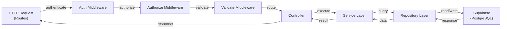

# GrowUpMore API — Material Management Module

## Postman Testing Guide

### Base Configuration

| Property | Value |
|----------|-------|
| **Base URL** | `http://localhost:5000` (local) or `https://api.growupmore.io` (production) |
| **API Prefix** | `/api/v1/material-management` |
| **Content-Type** | `application/json` |
| **Authorization** | Bearer Token (JWT) in `Authorization` header |

### Required Headers

```
Authorization: Bearer <JWT_TOKEN>
Content-Type: application/json
```

---

## Architecture Flow



---

## Endpoint Reference

| # | Method | Endpoint | Permission | Description |
|---|--------|----------|-----------|-------------|
| 1.1 | POST | `/subjects` | `subject.create` | Create new subject |
| 1.2 | GET | `/subjects` | `subject.read` | List all subjects |
| 1.3 | GET | `/subjects/:id` | `subject.read` | Get subject by ID |
| 1.4 | PATCH | `/subjects/:id` | `subject.update` | Update subject |
| 1.5 | DELETE | `/subjects/:id` | `subject.delete` | Delete subject |
| 2.1 | POST | `/chapters` | `chapter.create` | Create new chapter |
| 2.2 | GET | `/chapters` | `chapter.read` | List all chapters |
| 2.3 | GET | `/chapters/:id` | `chapter.read` | Get chapter by ID |
| 2.4 | PATCH | `/chapters/:id` | `chapter.update` | Update chapter |
| 2.5 | DELETE | `/chapters/:id` | `chapter.delete` | Delete chapter |
| 3.1 | POST | `/topics` | `topic.create` | Create new topic |
| 3.2 | GET | `/topics` | `topic.read` | List all topics |
| 3.3 | GET | `/topics/:id` | `topic.read` | Get topic by ID |
| 3.4 | PATCH | `/topics/:id` | `topic.update` | Update topic |
| 3.5 | DELETE | `/topics/:id` | `topic.delete` | Delete topic |
| 4.1 | POST | `/sub-topics` | `sub_topic.create` | Create new sub-topic |
| 4.2 | GET | `/sub-topics` | `sub_topic.read` | List all sub-topics |
| 4.3 | GET | `/sub-topics/:id` | `sub_topic.read` | Get sub-topic by ID |
| 4.4 | PATCH | `/sub-topics/:id` | `sub_topic.update` | Update sub-topic |
| 4.5 | DELETE | `/sub-topics/:id` | `sub_topic.delete` | Delete sub-topic |

---

## Prerequisites

### 1. Authentication

All requests require a valid JWT token. Ensure you have:
- Logged in via `/api/v1/auth/login`
- Copied the `accessToken` from the response
- Set it in Postman as a Bearer token in the `Authorization` header

### 2. Permissions Seed

Run the following SQL before testing:

```sql
-- Phase 08 Material Management Permissions Seed
-- Executes: phase08_material_management_permissions_seed.sql
```

This creates 16 permissions across 4 resources (subject, chapter, topic, sub_topic) and assigns them to `super_admin` and `admin` roles.

### 3. Master Data

Ensure your database contains:
- At least one `language` record (for `languageId` field)
- Optional `subject` records (for referencing in chapters)
- Difficulty levels must match enum: `easy`, `medium`, `hard`, `advanced`

---

## 1. SUBJECTS

Subjects are top-level educational categories (e.g., Mathematics, Science, History).

### 1.1 Create Subject

**Request:**
```
POST /api/v1/material-management/subjects
```

**Headers:**
```
Authorization: Bearer <JWT_TOKEN>
Content-Type: application/json
```

**Body:**
```json
{
  "name": "Mathematics",
  "description": "Comprehensive mathematics curriculum covering algebra, geometry, trigonometry, and calculus",
  "code": "MATH",
  "languageId": "f47ac10b-58cc-4372-a567-0e02b2c3d479",
  "difficultyLevel": "medium",
  "imageUrl": "https://cdn.example.com/subjects/math.png",
  "isActive": true
}
```

**Field Descriptions:**
- `name` (string, required): Subject name (max 255 characters)
- `description` (string, optional): Detailed subject description
- `code` (string, required): Unique subject code (e.g., MATH, SCI, ENG)
- `languageId` (UUID, required): Associated language ID
- `difficultyLevel` (enum, optional): easy, medium, hard, advanced
- `imageUrl` (string, optional): URL to subject thumbnail/icon
- `isActive` (boolean, default: true): Active status

**Response (201 Created):**
```json
{
  "success": true,
  "message": "Subject created successfully",
  "data": {
    "id": "550e8400-e29b-41d4-a716-446655440000",
    "name": "Mathematics",
    "description": "Comprehensive mathematics curriculum...",
    "code": "MATH",
    "languageId": "f47ac10b-58cc-4372-a567-0e02b2c3d479",
    "difficultyLevel": "medium",
    "imageUrl": "https://cdn.example.com/subjects/math.png",
    "isActive": true,
    "createdAt": "2026-04-05T10:30:00Z",
    "updatedAt": "2026-04-05T10:30:00Z"
  }
}
```

---

### 1.2 List Subjects

**Request:**
```
GET /api/v1/material-management/subjects?page=1&limit=20&search=math&sortBy=name&sortDir=asc&difficultyLevel=medium&languageId=f47ac10b-58cc-4372-a567-0e02b2c3d479&isActive=true
```

**Headers:**
```
Authorization: Bearer <JWT_TOKEN>
Content-Type: application/json
```

**Query Parameters:**
| Parameter | Type | Default | Description |
|-----------|------|---------|-------------|
| `page` | integer | 1 | Page number for pagination |
| `limit` | integer | 20 | Records per page (max 100) |
| `search` | string | - | Search by name or description |
| `sortBy` | string | createdAt | Sort field: name, code, difficultyLevel, createdAt |
| `sortDir` | string | asc | Sort direction: asc, desc |
| `difficultyLevel` | string | - | Filter: easy, medium, hard, advanced |
| `languageId` | UUID | - | Filter by language |
| `isActive` | boolean | - | Filter by active status |

**Response (200 OK):**
```json
{
  "success": true,
  "message": "Subjects retrieved successfully",
  "data": [
    {
      "id": "550e8400-e29b-41d4-a716-446655440000",
      "name": "Mathematics",
      "description": "Comprehensive mathematics curriculum...",
      "code": "MATH",
      "languageId": "f47ac10b-58cc-4372-a567-0e02b2c3d479",
      "difficultyLevel": "medium",
      "imageUrl": "https://cdn.example.com/subjects/math.png",
      "isActive": true,
      "createdAt": "2026-04-05T10:30:00Z",
      "updatedAt": "2026-04-05T10:30:00Z"
    }
  ],
  "pagination": {
    "page": 1,
    "limit": 20,
    "total": 1,
    "pages": 1
  }
}
```

---

### 1.3 Get Subject by ID

**Request:**
```
GET /api/v1/material-management/subjects/550e8400-e29b-41d4-a716-446655440000
```

**Headers:**
```
Authorization: Bearer <JWT_TOKEN>
Content-Type: application/json
```

**Response (200 OK):**
```json
{
  "success": true,
  "message": "Subject retrieved successfully",
  "data": {
    "id": "550e8400-e29b-41d4-a716-446655440000",
    "name": "Mathematics",
    "description": "Comprehensive mathematics curriculum...",
    "code": "MATH",
    "languageId": "f47ac10b-58cc-4372-a567-0e02b2c3d479",
    "difficultyLevel": "medium",
    "imageUrl": "https://cdn.example.com/subjects/math.png",
    "isActive": true,
    "createdAt": "2026-04-05T10:30:00Z",
    "updatedAt": "2026-04-05T10:30:00Z"
  }
}
```

---

### 1.4 Update Subject

**Request:**
```
PATCH /api/v1/material-management/subjects/550e8400-e29b-41d4-a716-446655440000
```

**Headers:**
```
Authorization: Bearer <JWT_TOKEN>
Content-Type: application/json
```

**Body (all fields optional):**
```json
{
  "name": "Advanced Mathematics",
  "description": "Extended mathematics curriculum with advanced topics",
  "code": "MATH-ADV",
  "difficultyLevel": "hard",
  "imageUrl": "https://cdn.example.com/subjects/math-advanced.png",
  "isActive": true
}
```

**Response (200 OK):**
```json
{
  "success": true,
  "message": "Subject updated successfully",
  "data": {
    "id": "550e8400-e29b-41d4-a716-446655440000",
    "name": "Advanced Mathematics",
    "description": "Extended mathematics curriculum with advanced topics",
    "code": "MATH-ADV",
    "languageId": "f47ac10b-58cc-4372-a567-0e02b2c3d479",
    "difficultyLevel": "hard",
    "imageUrl": "https://cdn.example.com/subjects/math-advanced.png",
    "isActive": true,
    "createdAt": "2026-04-05T10:30:00Z",
    "updatedAt": "2026-04-05T10:35:00Z"
  }
}
```

---

### 1.5 Delete Subject

**Request:**
```
DELETE /api/v1/material-management/subjects/550e8400-e29b-41d4-a716-446655440000
```

**Headers:**
```
Authorization: Bearer <JWT_TOKEN>
Content-Type: application/json
```

**Response (200 OK):**
```json
{
  "success": true,
  "message": "Subject deleted successfully",
  "data": {
    "id": "550e8400-e29b-41d4-a716-446655440000",
    "isDeleted": true,
    "deletedAt": "2026-04-05T10:36:00Z"
  }
}
```

---

## 2. CHAPTERS

Chapters are subdivisions of subjects that organize content hierarchically (e.g., Chapter 1: Algebra Basics).

### 2.1 Create Chapter

**Request:**
```
POST /api/v1/material-management/chapters
```

**Headers:**
```
Authorization: Bearer <JWT_TOKEN>
Content-Type: application/json
```

**Body:**
```json
{
  "name": "Algebra Basics",
  "description": "Introduction to algebraic expressions, equations, and problem-solving techniques",
  "code": "MATH-CH01",
  "subjectId": "550e8400-e29b-41d4-a716-446655440000",
  "chapterNumber": 1,
  "difficultyLevel": "easy",
  "sequenceOrder": 1,
  "estimatedDurationMinutes": 180,
  "imageUrl": "https://cdn.example.com/chapters/algebra-basics.png",
  "isActive": true
}
```

**Field Descriptions:**
- `name` (string, required): Chapter name (max 255 characters)
- `description` (string, optional): Detailed chapter description
- `code` (string, required): Unique chapter code within subject
- `subjectId` (UUID, required): Parent subject ID
- `chapterNumber` (integer, optional): Chapter sequence number
- `difficultyLevel` (enum, optional): easy, medium, hard, advanced
- `sequenceOrder` (integer, optional): Display order within subject
- `estimatedDurationMinutes` (integer, optional): Estimated learning time in minutes
- `imageUrl` (string, optional): Chapter thumbnail/icon URL
- `isActive` (boolean, default: true): Active status

**Response (201 Created):**
```json
{
  "success": true,
  "message": "Chapter created successfully",
  "data": {
    "id": "660e8400-e29b-41d4-a716-446655440001",
    "name": "Algebra Basics",
    "description": "Introduction to algebraic expressions...",
    "code": "MATH-CH01",
    "subjectId": "550e8400-e29b-41d4-a716-446655440000",
    "chapterNumber": 1,
    "difficultyLevel": "easy",
    "sequenceOrder": 1,
    "estimatedDurationMinutes": 180,
    "imageUrl": "https://cdn.example.com/chapters/algebra-basics.png",
    "isActive": true,
    "createdAt": "2026-04-05T10:40:00Z",
    "updatedAt": "2026-04-05T10:40:00Z"
  }
}
```

---

### 2.2 List Chapters

**Request:**
```
GET /api/v1/material-management/chapters?page=1&limit=20&search=algebra&sortBy=sequenceOrder&sortDir=asc&difficultyLevel=easy&subjectCode=MATH&subjectId=550e8400-e29b-41d4-a716-446655440000&isActive=true
```

**Headers:**
```
Authorization: Bearer <JWT_TOKEN>
Content-Type: application/json
```

**Query Parameters:**
| Parameter | Type | Default | Description |
|-----------|------|---------|-------------|
| `page` | integer | 1 | Page number for pagination |
| `limit` | integer | 20 | Records per page (max 100) |
| `search` | string | - | Search by name or description |
| `sortBy` | string | sequenceOrder | Sort field: name, code, difficultyLevel, sequenceOrder, createdAt |
| `sortDir` | string | asc | Sort direction: asc, desc |
| `difficultyLevel` | string | - | Filter: easy, medium, hard, advanced |
| `subjectCode` | string | - | Filter by subject code |
| `subjectId` | UUID | - | Filter by subject ID |
| `languageId` | UUID | - | Filter by language via subject |
| `chapterId` | UUID | - | Filter by specific chapter ID |
| `isActive` | boolean | - | Filter by active status |

**Response (200 OK):**
```json
{
  "success": true,
  "message": "Chapters retrieved successfully",
  "data": [
    {
      "id": "660e8400-e29b-41d4-a716-446655440001",
      "name": "Algebra Basics",
      "description": "Introduction to algebraic expressions...",
      "code": "MATH-CH01",
      "subjectId": "550e8400-e29b-41d4-a716-446655440000",
      "chapterNumber": 1,
      "difficultyLevel": "easy",
      "sequenceOrder": 1,
      "estimatedDurationMinutes": 180,
      "imageUrl": "https://cdn.example.com/chapters/algebra-basics.png",
      "isActive": true,
      "createdAt": "2026-04-05T10:40:00Z",
      "updatedAt": "2026-04-05T10:40:00Z"
    }
  ],
  "pagination": {
    "page": 1,
    "limit": 20,
    "total": 1,
    "pages": 1
  }
}
```

---

### 2.3 Get Chapter by ID

**Request:**
```
GET /api/v1/material-management/chapters/660e8400-e29b-41d4-a716-446655440001
```

**Headers:**
```
Authorization: Bearer <JWT_TOKEN>
Content-Type: application/json
```

**Response (200 OK):**
```json
{
  "success": true,
  "message": "Chapter retrieved successfully",
  "data": {
    "id": "660e8400-e29b-41d4-a716-446655440001",
    "name": "Algebra Basics",
    "description": "Introduction to algebraic expressions...",
    "code": "MATH-CH01",
    "subjectId": "550e8400-e29b-41d4-a716-446655440000",
    "chapterNumber": 1,
    "difficultyLevel": "easy",
    "sequenceOrder": 1,
    "estimatedDurationMinutes": 180,
    "imageUrl": "https://cdn.example.com/chapters/algebra-basics.png",
    "isActive": true,
    "createdAt": "2026-04-05T10:40:00Z",
    "updatedAt": "2026-04-05T10:40:00Z"
  }
}
```

---

### 2.4 Update Chapter

**Request:**
```
PATCH /api/v1/material-management/chapters/660e8400-e29b-41d4-a716-446655440001
```

**Headers:**
```
Authorization: Bearer <JWT_TOKEN>
Content-Type: application/json
```

**Body (all fields optional):**
```json
{
  "name": "Algebra Fundamentals",
  "description": "Comprehensive introduction to algebraic concepts",
  "code": "MATH-CH01-V2",
  "chapterNumber": 1,
  "difficultyLevel": "medium",
  "sequenceOrder": 2,
  "estimatedDurationMinutes": 240,
  "isActive": true
}
```

**Response (200 OK):**
```json
{
  "success": true,
  "message": "Chapter updated successfully",
  "data": {
    "id": "660e8400-e29b-41d4-a716-446655440001",
    "name": "Algebra Fundamentals",
    "description": "Comprehensive introduction to algebraic concepts",
    "code": "MATH-CH01-V2",
    "subjectId": "550e8400-e29b-41d4-a716-446655440000",
    "chapterNumber": 1,
    "difficultyLevel": "medium",
    "sequenceOrder": 2,
    "estimatedDurationMinutes": 240,
    "imageUrl": "https://cdn.example.com/chapters/algebra-basics.png",
    "isActive": true,
    "createdAt": "2026-04-05T10:40:00Z",
    "updatedAt": "2026-04-05T10:42:00Z"
  }
}
```

---

### 2.5 Delete Chapter

**Request:**
```
DELETE /api/v1/material-management/chapters/660e8400-e29b-41d4-a716-446655440001
```

**Headers:**
```
Authorization: Bearer <JWT_TOKEN>
Content-Type: application/json
```

**Response (200 OK):**
```json
{
  "success": true,
  "message": "Chapter deleted successfully",
  "data": {
    "id": "660e8400-e29b-41d4-a716-446655440001",
    "isDeleted": true,
    "deletedAt": "2026-04-05T10:43:00Z"
  }
}
```

---

## 3. TOPICS

Topics are detailed lessons within chapters. They can exist standalone or be nested within chapters (e.g., "Solving Linear Equations").

### 3.1 Create Topic

**Request:**
```
POST /api/v1/material-management/topics
```

**Headers:**
```
Authorization: Bearer <JWT_TOKEN>
Content-Type: application/json
```

**Body:**
```json
{
  "name": "Solving Linear Equations",
  "description": "Techniques for solving single-variable linear equations and systems",
  "code": "MATH-CH01-TOPIC01",
  "chapterId": "660e8400-e29b-41d4-a716-446655440001",
  "topicNumber": 1,
  "difficultyLevel": "easy",
  "sequenceOrder": 1,
  "estimatedDurationMinutes": 60,
  "isStandalone": false,
  "learningObjectives": [
    "Understand linear equation properties",
    "Solve one-variable equations",
    "Graph linear equations"
  ],
  "keywords": ["linear", "algebra", "equations"],
  "imageUrl": "https://cdn.example.com/topics/linear-equations.png",
  "isActive": true
}
```

**Field Descriptions:**
- `name` (string, required): Topic name (max 255 characters)
- `description` (string, optional): Detailed topic description
- `code` (string, required): Unique topic code
- `chapterId` (UUID, optional): Parent chapter ID (required if not standalone)
- `topicNumber` (integer, optional): Topic sequence number within chapter
- `difficultyLevel` (enum, optional): easy, medium, hard, advanced
- `sequenceOrder` (integer, optional): Display order
- `estimatedDurationMinutes` (integer, optional): Estimated learning time
- `isStandalone` (boolean, default: false): Can exist without chapter
- `learningObjectives` (array of strings, optional): Learning goals for this topic
- `keywords` (array of strings, optional): Search/tagging keywords
- `imageUrl` (string, optional): Topic thumbnail/icon URL
- `isActive` (boolean, default: true): Active status

**Response (201 Created):**
```json
{
  "success": true,
  "message": "Topic created successfully",
  "data": {
    "id": "770e8400-e29b-41d4-a716-446655440002",
    "name": "Solving Linear Equations",
    "description": "Techniques for solving single-variable linear equations...",
    "code": "MATH-CH01-TOPIC01",
    "chapterId": "660e8400-e29b-41d4-a716-446655440001",
    "topicNumber": 1,
    "difficultyLevel": "easy",
    "sequenceOrder": 1,
    "estimatedDurationMinutes": 60,
    "isStandalone": false,
    "learningObjectives": [
      "Understand linear equation properties",
      "Solve one-variable equations",
      "Graph linear equations"
    ],
    "keywords": ["linear", "algebra", "equations"],
    "imageUrl": "https://cdn.example.com/topics/linear-equations.png",
    "isActive": true,
    "createdAt": "2026-04-05T10:45:00Z",
    "updatedAt": "2026-04-05T10:45:00Z"
  }
}
```

---

### 3.2 List Topics

**Request:**
```
GET /api/v1/material-management/topics?page=1&limit=20&search=linear&sortBy=sequenceOrder&sortDir=asc&difficultyLevel=easy&isStandalone=false&topicId=770e8400-e29b-41d4-a716-446655440002&chapterId=660e8400-e29b-41d4-a716-446655440001&subjectId=550e8400-e29b-41d4-a716-446655440000&languageId=f47ac10b-58cc-4372-a567-0e02b2c3d479&isActive=true
```

**Headers:**
```
Authorization: Bearer <JWT_TOKEN>
Content-Type: application/json
```

**Query Parameters:**
| Parameter | Type | Default | Description |
|-----------|------|---------|-------------|
| `page` | integer | 1 | Page number for pagination |
| `limit` | integer | 20 | Records per page (max 100) |
| `search` | string | - | Search by name, description, or keywords |
| `sortBy` | string | sequenceOrder | Sort field: name, code, difficultyLevel, sequenceOrder, createdAt |
| `sortDir` | string | asc | Sort direction: asc, desc |
| `difficultyLevel` | string | - | Filter: easy, medium, hard, advanced |
| `isStandalone` | boolean | - | Filter by standalone status |
| `topicId` | UUID | - | Filter by specific topic ID |
| `chapterId` | UUID | - | Filter by chapter ID |
| `subjectId` | UUID | - | Filter by subject ID (via chapter) |
| `languageId` | UUID | - | Filter by language (via subject) |
| `isActive` | boolean | - | Filter by active status |

**Response (200 OK):**
```json
{
  "success": true,
  "message": "Topics retrieved successfully",
  "data": [
    {
      "id": "770e8400-e29b-41d4-a716-446655440002",
      "name": "Solving Linear Equations",
      "description": "Techniques for solving single-variable linear equations...",
      "code": "MATH-CH01-TOPIC01",
      "chapterId": "660e8400-e29b-41d4-a716-446655440001",
      "topicNumber": 1,
      "difficultyLevel": "easy",
      "sequenceOrder": 1,
      "estimatedDurationMinutes": 60,
      "isStandalone": false,
      "learningObjectives": [
        "Understand linear equation properties",
        "Solve one-variable equations",
        "Graph linear equations"
      ],
      "keywords": ["linear", "algebra", "equations"],
      "imageUrl": "https://cdn.example.com/topics/linear-equations.png",
      "isActive": true,
      "createdAt": "2026-04-05T10:45:00Z",
      "updatedAt": "2026-04-05T10:45:00Z"
    }
  ],
  "pagination": {
    "page": 1,
    "limit": 20,
    "total": 1,
    "pages": 1
  }
}
```

---

### 3.3 Get Topic by ID

**Request:**
```
GET /api/v1/material-management/topics/770e8400-e29b-41d4-a716-446655440002
```

**Headers:**
```
Authorization: Bearer <JWT_TOKEN>
Content-Type: application/json
```

**Response (200 OK):**
```json
{
  "success": true,
  "message": "Topic retrieved successfully",
  "data": {
    "id": "770e8400-e29b-41d4-a716-446655440002",
    "name": "Solving Linear Equations",
    "description": "Techniques for solving single-variable linear equations...",
    "code": "MATH-CH01-TOPIC01",
    "chapterId": "660e8400-e29b-41d4-a716-446655440001",
    "topicNumber": 1,
    "difficultyLevel": "easy",
    "sequenceOrder": 1,
    "estimatedDurationMinutes": 60,
    "isStandalone": false,
    "learningObjectives": [
      "Understand linear equation properties",
      "Solve one-variable equations",
      "Graph linear equations"
    ],
    "keywords": ["linear", "algebra", "equations"],
    "imageUrl": "https://cdn.example.com/topics/linear-equations.png",
    "isActive": true,
    "createdAt": "2026-04-05T10:45:00Z",
    "updatedAt": "2026-04-05T10:45:00Z"
  }
}
```

---

### 3.4 Update Topic

**Request:**
```
PATCH /api/v1/material-management/topics/770e8400-e29b-41d4-a716-446655440002
```

**Headers:**
```
Authorization: Bearer <JWT_TOKEN>
Content-Type: application/json
```

**Body (all fields optional):**
```json
{
  "name": "Linear Equations: Theory and Practice",
  "description": "Comprehensive guide to linear equations with examples and exercises",
  "code": "MATH-CH01-TOPIC01-V2",
  "topicNumber": 1,
  "difficultyLevel": "medium",
  "sequenceOrder": 2,
  "estimatedDurationMinutes": 90,
  "learningObjectives": [
    "Master linear equation properties",
    "Solve complex equations",
    "Apply to real-world problems"
  ],
  "keywords": ["linear", "algebra", "equations", "mathematics"],
  "isActive": true
}
```

**Response (200 OK):**
```json
{
  "success": true,
  "message": "Topic updated successfully",
  "data": {
    "id": "770e8400-e29b-41d4-a716-446655440002",
    "name": "Linear Equations: Theory and Practice",
    "description": "Comprehensive guide to linear equations...",
    "code": "MATH-CH01-TOPIC01-V2",
    "chapterId": "660e8400-e29b-41d4-a716-446655440001",
    "topicNumber": 1,
    "difficultyLevel": "medium",
    "sequenceOrder": 2,
    "estimatedDurationMinutes": 90,
    "isStandalone": false,
    "learningObjectives": [
      "Master linear equation properties",
      "Solve complex equations",
      "Apply to real-world problems"
    ],
    "keywords": ["linear", "algebra", "equations", "mathematics"],
    "imageUrl": "https://cdn.example.com/topics/linear-equations.png",
    "isActive": true,
    "createdAt": "2026-04-05T10:45:00Z",
    "updatedAt": "2026-04-05T10:47:00Z"
  }
}
```

---

### 3.5 Delete Topic

**Request:**
```
DELETE /api/v1/material-management/topics/770e8400-e29b-41d4-a716-446655440002
```

**Headers:**
```
Authorization: Bearer <JWT_TOKEN>
Content-Type: application/json
```

**Response (200 OK):**
```json
{
  "success": true,
  "message": "Topic deleted successfully",
  "data": {
    "id": "770e8400-e29b-41d4-a716-446655440002",
    "isDeleted": true,
    "deletedAt": "2026-04-05T10:48:00Z"
  }
}
```

---

## 4. SUB-TOPICS

Sub-Topics are granular learning units nested within Topics (e.g., "Method of Substitution", "Graphical Method").

### 4.1 Create Sub-Topic

**Request:**
```
POST /api/v1/material-management/sub-topics
```

**Headers:**
```
Authorization: Bearer <JWT_TOKEN>
Content-Type: application/json
```

**Body:**
```json
{
  "name": "Method of Substitution",
  "description": "Solving linear equations using the substitution method with step-by-step examples",
  "code": "MATH-CH01-TOPIC01-SUBTOPIC01",
  "topicId": "770e8400-e29b-41d4-a716-446655440002",
  "subTopicNumber": 1,
  "difficultyLevel": "easy",
  "sequenceOrder": 1,
  "estimatedDurationMinutes": 30,
  "learningObjectives": [
    "Understand substitution method",
    "Apply to real equations",
    "Practice with examples"
  ],
  "prerequisites": ["basic algebra"],
  "keywords": ["substitution", "method", "linear equations"],
  "videoUrl": "https://cdn.example.com/videos/substitution-method.mp4",
  "contentUrl": "https://cdn.example.com/content/substitution-guide.pdf",
  "imageUrl": "https://cdn.example.com/sub-topics/substitution-method.png",
  "isActive": true
}
```

**Field Descriptions:**
- `name` (string, required): Sub-topic name (max 255 characters)
- `description` (string, optional): Detailed description
- `code` (string, required): Unique sub-topic code
- `topicId` (UUID, required): Parent topic ID
- `subTopicNumber` (integer, optional): Sequence within topic
- `difficultyLevel` (enum, optional): easy, medium, hard, advanced
- `sequenceOrder` (integer, optional): Display order
- `estimatedDurationMinutes` (integer, optional): Estimated learning time
- `learningObjectives` (array of strings, optional): Learning outcomes
- `prerequisites` (array of strings, optional): Required prior knowledge
- `keywords` (array of strings, optional): Search keywords
- `videoUrl` (string, optional): URL to instructional video
- `contentUrl` (string, optional): URL to content materials/PDF
- `imageUrl` (string, optional): Sub-topic thumbnail/icon
- `isActive` (boolean, default: true): Active status

**Response (201 Created):**
```json
{
  "success": true,
  "message": "Sub-Topic created successfully",
  "data": {
    "id": "880e8400-e29b-41d4-a716-446655440003",
    "name": "Method of Substitution",
    "description": "Solving linear equations using the substitution method...",
    "code": "MATH-CH01-TOPIC01-SUBTOPIC01",
    "topicId": "770e8400-e29b-41d4-a716-446655440002",
    "subTopicNumber": 1,
    "difficultyLevel": "easy",
    "sequenceOrder": 1,
    "estimatedDurationMinutes": 30,
    "learningObjectives": [
      "Understand substitution method",
      "Apply to real equations",
      "Practice with examples"
    ],
    "prerequisites": ["basic algebra"],
    "keywords": ["substitution", "method", "linear equations"],
    "videoUrl": "https://cdn.example.com/videos/substitution-method.mp4",
    "contentUrl": "https://cdn.example.com/content/substitution-guide.pdf",
    "imageUrl": "https://cdn.example.com/sub-topics/substitution-method.png",
    "isActive": true,
    "createdAt": "2026-04-05T10:50:00Z",
    "updatedAt": "2026-04-05T10:50:00Z"
  }
}
```

---

### 4.2 List Sub-Topics

**Request:**
```
GET /api/v1/material-management/sub-topics?page=1&limit=20&search=substitution&sortBy=sequenceOrder&sortDir=asc&difficultyLevel=easy&topicId=770e8400-e29b-41d4-a716-446655440002&chapterId=660e8400-e29b-41d4-a716-446655440001&subjectId=550e8400-e29b-41d4-a716-446655440000&languageId=f47ac10b-58cc-4372-a567-0e02b2c3d479&isActive=true
```

**Headers:**
```
Authorization: Bearer <JWT_TOKEN>
Content-Type: application/json
```

**Query Parameters:**
| Parameter | Type | Default | Description |
|-----------|------|---------|-------------|
| `page` | integer | 1 | Page number for pagination |
| `limit` | integer | 20 | Records per page (max 100) |
| `search` | string | - | Search by name, description, or keywords |
| `sortBy` | string | sequenceOrder | Sort field: name, code, difficultyLevel, sequenceOrder, createdAt |
| `sortDir` | string | asc | Sort direction: asc, desc |
| `difficultyLevel` | string | - | Filter: easy, medium, hard, advanced |
| `topicId` | UUID | - | Filter by parent topic ID |
| `chapterId` | UUID | - | Filter by chapter ID (via topic) |
| `subjectId` | UUID | - | Filter by subject ID (via chapter) |
| `languageId` | UUID | - | Filter by language (via subject) |
| `isActive` | boolean | - | Filter by active status |

**Response (200 OK):**
```json
{
  "success": true,
  "message": "Sub-Topics retrieved successfully",
  "data": [
    {
      "id": "880e8400-e29b-41d4-a716-446655440003",
      "name": "Method of Substitution",
      "description": "Solving linear equations using the substitution method...",
      "code": "MATH-CH01-TOPIC01-SUBTOPIC01",
      "topicId": "770e8400-e29b-41d4-a716-446655440002",
      "subTopicNumber": 1,
      "difficultyLevel": "easy",
      "sequenceOrder": 1,
      "estimatedDurationMinutes": 30,
      "learningObjectives": [
        "Understand substitution method",
        "Apply to real equations",
        "Practice with examples"
      ],
      "prerequisites": ["basic algebra"],
      "keywords": ["substitution", "method", "linear equations"],
      "videoUrl": "https://cdn.example.com/videos/substitution-method.mp4",
      "contentUrl": "https://cdn.example.com/content/substitution-guide.pdf",
      "imageUrl": "https://cdn.example.com/sub-topics/substitution-method.png",
      "isActive": true,
      "createdAt": "2026-04-05T10:50:00Z",
      "updatedAt": "2026-04-05T10:50:00Z"
    }
  ],
  "pagination": {
    "page": 1,
    "limit": 20,
    "total": 1,
    "pages": 1
  }
}
```

---

### 4.3 Get Sub-Topic by ID

**Request:**
```
GET /api/v1/material-management/sub-topics/880e8400-e29b-41d4-a716-446655440003
```

**Headers:**
```
Authorization: Bearer <JWT_TOKEN>
Content-Type: application/json
```

**Response (200 OK):**
```json
{
  "success": true,
  "message": "Sub-Topic retrieved successfully",
  "data": {
    "id": "880e8400-e29b-41d4-a716-446655440003",
    "name": "Method of Substitution",
    "description": "Solving linear equations using the substitution method...",
    "code": "MATH-CH01-TOPIC01-SUBTOPIC01",
    "topicId": "770e8400-e29b-41d4-a716-446655440002",
    "subTopicNumber": 1,
    "difficultyLevel": "easy",
    "sequenceOrder": 1,
    "estimatedDurationMinutes": 30,
    "learningObjectives": [
      "Understand substitution method",
      "Apply to real equations",
      "Practice with examples"
    ],
    "prerequisites": ["basic algebra"],
    "keywords": ["substitution", "method", "linear equations"],
    "videoUrl": "https://cdn.example.com/videos/substitution-method.mp4",
    "contentUrl": "https://cdn.example.com/content/substitution-guide.pdf",
    "imageUrl": "https://cdn.example.com/sub-topics/substitution-method.png",
    "isActive": true,
    "createdAt": "2026-04-05T10:50:00Z",
    "updatedAt": "2026-04-05T10:50:00Z"
  }
}
```

---

### 4.4 Update Sub-Topic

**Request:**
```
PATCH /api/v1/material-management/sub-topics/880e8400-e29b-41d4-a716-446655440003
```

**Headers:**
```
Authorization: Bearer <JWT_TOKEN>
Content-Type: application/json
```

**Body (all fields optional):**
```json
{
  "name": "Advanced Substitution Method",
  "description": "In-depth guide to solving complex equations using substitution",
  "code": "MATH-CH01-TOPIC01-SUBTOPIC01-V2",
  "subTopicNumber": 1,
  "difficultyLevel": "medium",
  "sequenceOrder": 2,
  "estimatedDurationMinutes": 45,
  "learningObjectives": [
    "Master substitution method",
    "Solve complex multi-variable equations",
    "Apply to real-world scenarios"
  ],
  "prerequisites": ["basic algebra", "linear equations"],
  "keywords": ["substitution", "advanced", "linear equations", "systems"],
  "videoUrl": "https://cdn.example.com/videos/advanced-substitution.mp4",
  "contentUrl": "https://cdn.example.com/content/advanced-substitution.pdf",
  "isActive": true
}
```

**Response (200 OK):**
```json
{
  "success": true,
  "message": "Sub-Topic updated successfully",
  "data": {
    "id": "880e8400-e29b-41d4-a716-446655440003",
    "name": "Advanced Substitution Method",
    "description": "In-depth guide to solving complex equations...",
    "code": "MATH-CH01-TOPIC01-SUBTOPIC01-V2",
    "topicId": "770e8400-e29b-41d4-a716-446655440002",
    "subTopicNumber": 1,
    "difficultyLevel": "medium",
    "sequenceOrder": 2,
    "estimatedDurationMinutes": 45,
    "learningObjectives": [
      "Master substitution method",
      "Solve complex multi-variable equations",
      "Apply to real-world scenarios"
    ],
    "prerequisites": ["basic algebra", "linear equations"],
    "keywords": ["substitution", "advanced", "linear equations", "systems"],
    "videoUrl": "https://cdn.example.com/videos/advanced-substitution.mp4",
    "contentUrl": "https://cdn.example.com/content/advanced-substitution.pdf",
    "imageUrl": "https://cdn.example.com/sub-topics/substitution-method.png",
    "isActive": true,
    "createdAt": "2026-04-05T10:50:00Z",
    "updatedAt": "2026-04-05T10:52:00Z"
  }
}
```

---

### 4.5 Delete Sub-Topic

**Request:**
```
DELETE /api/v1/material-management/sub-topics/880e8400-e29b-41d4-a716-446655440003
```

**Headers:**
```
Authorization: Bearer <JWT_TOKEN>
Content-Type: application/json
```

**Response (200 OK):**
```json
{
  "success": true,
  "message": "Sub-Topic deleted successfully",
  "data": {
    "id": "880e8400-e29b-41d4-a716-446655440003",
    "isDeleted": true,
    "deletedAt": "2026-04-05T10:53:00Z"
  }
}
```

---

## Common Errors

| Status | Error Code | Message | Solution |
|--------|-----------|---------|----------|
| 400 | INVALID_REQUEST | Validation failed | Check request body for missing required fields |
| 401 | UNAUTHORIZED | Invalid or missing token | Ensure valid JWT is present in Authorization header |
| 403 | FORBIDDEN | Insufficient permissions | Check user role has required permission code |
| 404 | NOT_FOUND | Resource not found | Verify ID exists in database |
| 409 | CONFLICT | Duplicate code | Code must be unique within context |
| 500 | INTERNAL_ERROR | Server error | Contact support |

---

## Testing Workflow

1. **Authenticate** — POST `/api/v1/auth/login` with valid credentials
2. **Create Subject** — POST `/subjects` with complete subject data
3. **Create Chapter** — POST `/chapters` with `subjectId` reference
4. **Create Topic** — POST `/topics` with `chapterId` reference
5. **Create Sub-Topic** — POST `/sub-topics` with `topicId` reference
6. **List Entities** — GET requests with various filters and pagination
7. **Update Entities** — PATCH requests to modify specific records
8. **Delete Entities** — DELETE requests to soft-delete records

---

## Notes

- All timestamps are in ISO 8601 format (UTC)
- Soft deletes set `isDeleted = true` without removing database records
- Pagination defaults to page 1, limit 20; maximum limit is 100 records
- Search functionality is case-insensitive and searches multiple fields
- Filters are applied with AND logic unless specified otherwise
