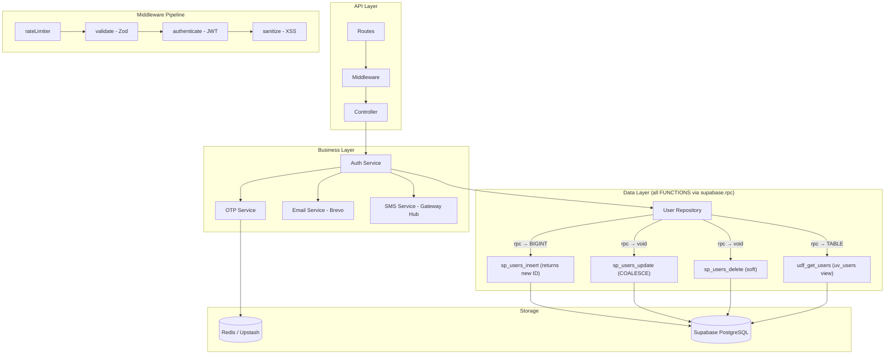
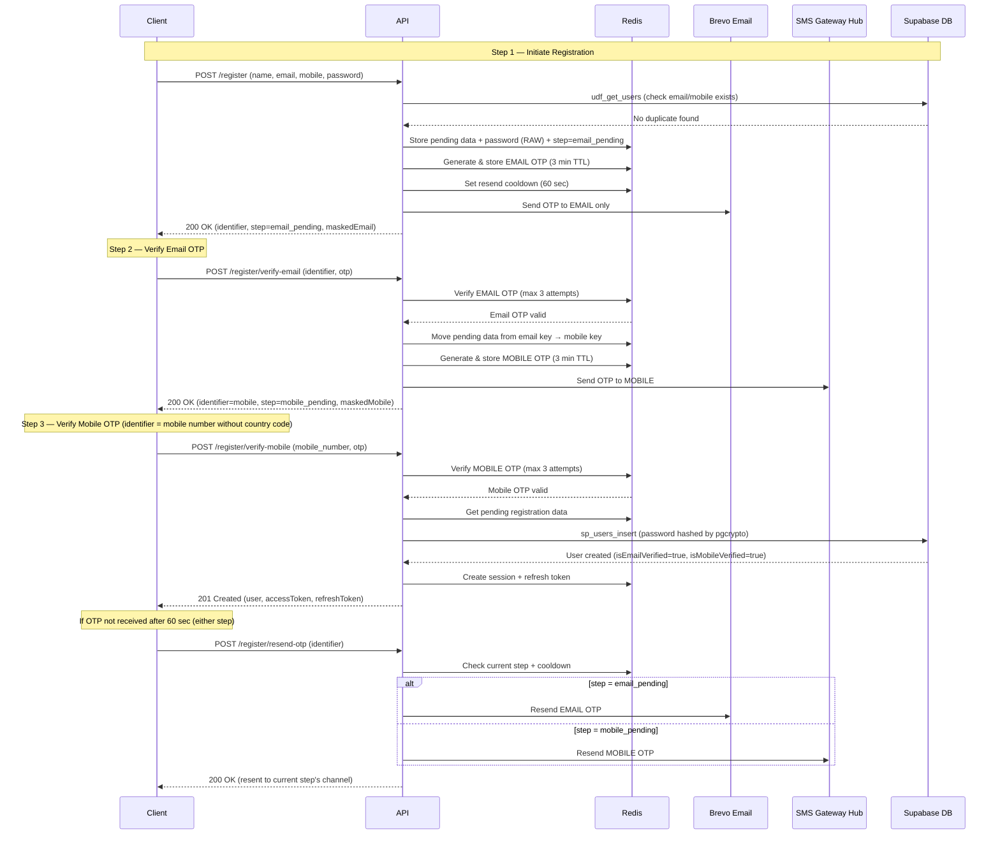
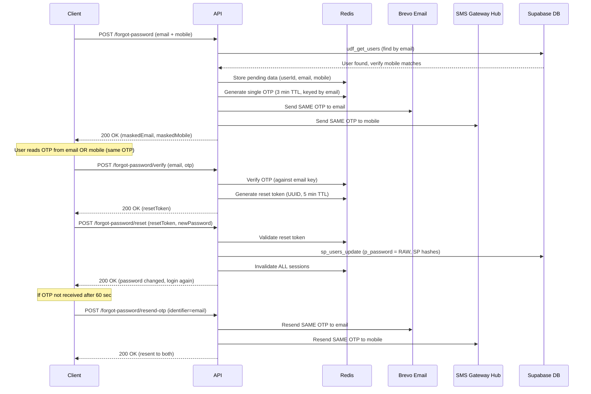
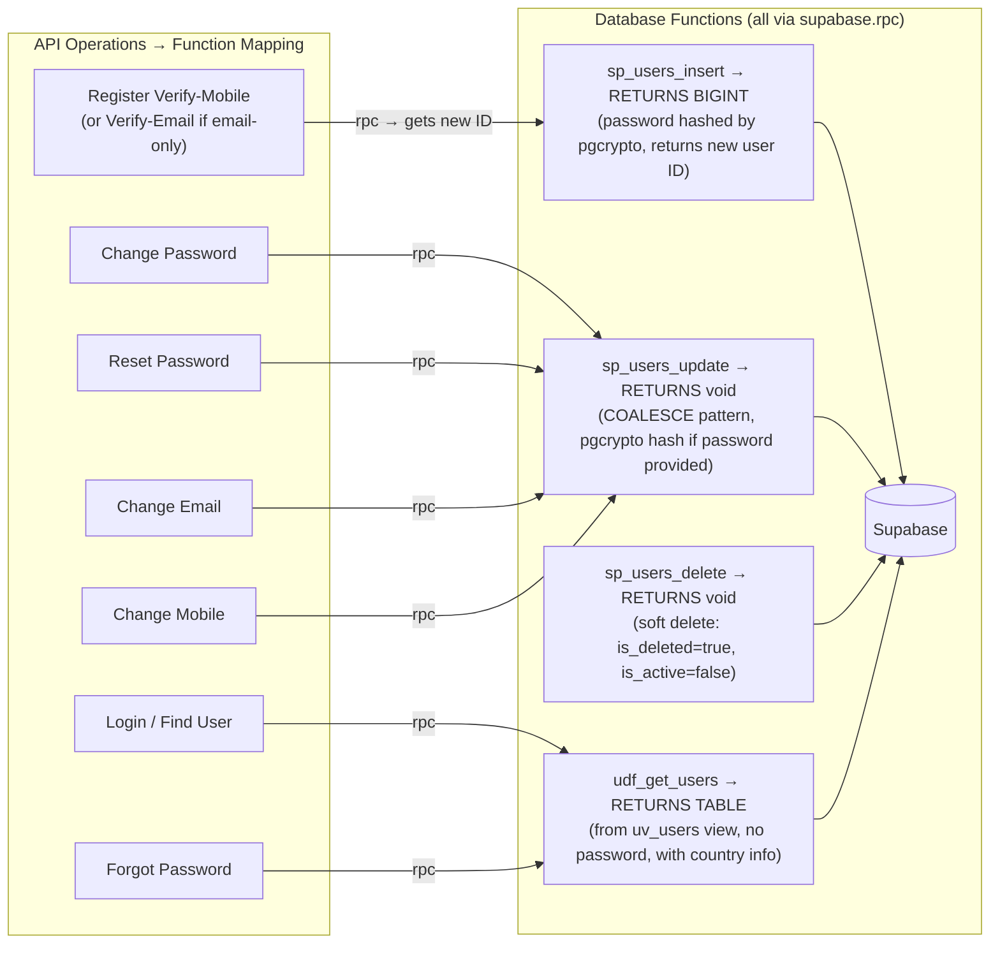
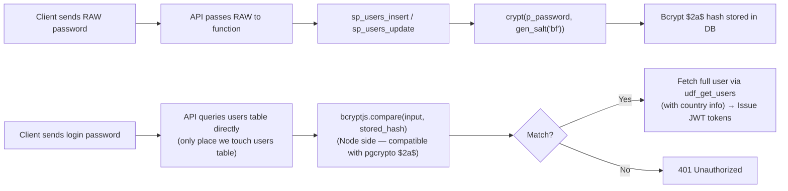

# GrowUpMore API — Phase 01: Auth & User Management

## Postman Testing Guide

**Base URL:** `http://localhost:5001`
**API Prefix:** `/api/v1`
**Content-Type:** `application/json`

---

## Architecture Flow



---

## Registration Flow (Two-Step OTP Verification)

Registration requires **both email and mobile**. Two separate OTP verifications are performed — email first, then mobile. The user is only created in the database after both are verified.



> Both email and mobile are **required**. The flow is always: `/register` → `/register/verify-email` → `/register/verify-mobile` → user created.

---

## Forgot Password Flow

> **Key concept:** A single OTP is generated and sent to **both** email and mobile. The user can read the OTP from whichever channel they prefer. Verification uses the email as the key. No separate mobile OTP verification — it's the same OTP on both channels.



---

## Complete Endpoint Reference

### Test Order (follow this sequence in Postman)

| # | Endpoint | Auth | Purpose |
|---|----------|------|---------|
| 0 | `GET /api/health` | No | Health check |
| 1 | `POST /api/v1/auth/register` | No | Start registration (sends email OTP) |
| 2 | `POST /api/v1/auth/register/resend-otp` | No | Resend current step's OTP (wait 60s) |
| 3 | `POST /api/v1/auth/register/verify-email` | No | Verify email OTP (sends mobile OTP next) |
| 4 | `POST /api/v1/auth/register/verify-mobile` | No | Verify mobile OTP, create user |
| 5 | `POST /api/v1/auth/login` | No | Login |
| 6 | `POST /api/v1/auth/refresh-token` | No | Refresh access token |
| 7 | `POST /api/v1/auth/change-password` | Yes | Change password |
| 8 | `POST /api/v1/auth/login` | No | Re-login after password change |
| 9 | `POST /api/v1/auth/change-email` | Yes | Start email change |
| 10 | `POST /api/v1/auth/change-email/verify` | Yes | Verify new email |
| 11 | `POST /api/v1/auth/login` | No | Re-login after email change |
| 12 | `POST /api/v1/auth/change-mobile` | Yes | Start mobile change |
| 13 | `POST /api/v1/auth/change-mobile/verify` | Yes | Verify new mobile |
| 14 | `POST /api/v1/auth/forgot-password` | No | Start forgot password |
| 15 | `POST /api/v1/auth/forgot-password/resend-otp` | No | Resend forgot OTP |
| 16 | `POST /api/v1/auth/forgot-password/verify` | No | Verify forgot OTP |
| 17 | `POST /api/v1/auth/forgot-password/reset` | No | Set new password |
| 18 | `POST /api/v1/auth/logout` | Yes | Logout |

---

## 0. Health Check

```
GET http://localhost:5001/api/health
```

**Headers:** None required

**Response — 200 OK:**

```json
{
  "success": true,
  "message": "GrowUpMore API is running",
  "data": {
    "environment": "development",
    "version": "v1",
    "timestamp": "2026-04-04T10:30:00.000Z",
    "uptime": "45s"
  }
}
```

---

## 1. Register — Initiate

```
POST http://localhost:5001/api/v1/auth/register
```

**Headers:**

| Key | Value |
|-----|-------|
| Content-Type | application/json |

**Request Body:**

```json
{
  "firstName": "Girish",
  "lastName": "Chaudhary",
  "email": "girish@example.com",
  "mobile": "9662278990",
  "password": "Girish@123"
}
```

> **Note:** Mobile number must be exactly **10 digits without country code**. The system automatically prepends `91` (India) before storing.

**Validation Rules:**

| Field | Type | Required | Rules |
|-------|------|----------|-------|
| firstName | string | Yes | 2-100 chars, letters/spaces/hyphens/apostrophes only |
| lastName | string | Yes | 2-100 chars, letters/spaces/hyphens/apostrophes only |
| email | string | Yes | Valid email, max 255 chars |
| mobile | string | Yes | Exactly 10 digits without country code (e.g. `9662278990`) |
| password | string | Yes | Min 8 chars, 1 lowercase, 1 uppercase, 1 digit, 1 special char |

**Response — 200 OK (email OTP sent):**

```json
{
  "success": true,
  "message": "OTP sent to your email. Please verify your email first.",
  "data": {
    "identifier": "girish@example.com",
    "maskedEmail": "gi***@example.com",
    "maskedMobile": "******8990",
    "step": "email_pending",
    "expiresInSeconds": 180,
    "resendAfterSeconds": 60
  }
}
```

**Response — 409 Conflict (email taken):**

```json
{
  "success": false,
  "message": "Email is already registered"
}
```

**Response — 409 Conflict (mobile taken):**

```json
{
  "success": false,
  "message": "Mobile number is already registered"
}
```

**Response — 422 Validation Error:**

```json
{
  "success": false,
  "message": "Validation failed",
  "details": [
    {
      "field": "password",
      "message": "Password must contain at least one uppercase letter"
    },
    {
      "field": "email",
      "message": "Either email or mobile is required"
    }
  ]
}
```

**Response — 429 Too Many Requests:**

```json
{
  "success": false,
  "message": "Too many authentication attempts. Please try again later."
}
```

---

## 2. Register — Resend OTP

```
POST http://localhost:5001/api/v1/auth/register/resend-otp
```

**Headers:**

| Key | Value |
|-----|-------|
| Content-Type | application/json |

**Request Body (email_pending step — use email as identifier):**

```json
{
  "identifier": "girish@example.com"
}
```

**Request Body (mobile_pending step — use mobile number without country code):**

```json
{
  "identifier": "9662278990"
}
```

> **Important:** After email verification, the pending data moves to a mobile-based key. So use **email** as identifier during `email_pending` step, and **mobile number (without country code)** during `mobile_pending` step.

**Validation Rules:**

| Field | Type | Required | Rules |
|-------|------|----------|-------|
| identifier | string | Yes | Email (during email_pending) or mobile without country code (during mobile_pending) |

**Response — 200 OK (email step — OTP resent to email):**

```json
{
  "success": true,
  "message": "OTP resent to your email.",
  "data": {
    "step": "email_pending",
    "maskedEmail": "gi***@example.com",
    "maskedMobile": "******8990",
    "expiresInSeconds": 180,
    "resendAfterSeconds": 60
  }
}
```

**Response — 200 OK (mobile step — OTP resent to mobile):**

```json
{
  "success": true,
  "message": "OTP resent to your mobile.",
  "data": {
    "step": "mobile_pending",
    "maskedEmail": "gi***@example.com",
    "maskedMobile": "******8990",
    "expiresInSeconds": 180,
    "resendAfterSeconds": 60
  }
}
```

**Response — 400 Bad Request (no pending registration):**

```json
{
  "success": false,
  "message": "No pending registration found. Please register again."
}
```

**Response — 429 Too Many Requests (cooldown active):**

```json
{
  "success": false,
  "message": "Please wait 45 seconds before requesting a new OTP"
}
```

---

## 3. Register — Verify Email OTP

```
POST http://localhost:5001/api/v1/auth/register/verify-email
```

**Headers:**

| Key | Value |
|-----|-------|
| Content-Type | application/json |

**Request Body:**

```json
{
  "identifier": "girish@example.com",
  "otp": "482916"
}
```

**Validation Rules:**

| Field | Type | Required | Rules |
|-------|------|----------|-------|
| identifier | string | Yes | The email used during registration |
| otp | string | Yes | Exactly 6 digits |

**Response — 200 OK (email verified, mobile OTP sent — when both email & mobile exist):**

```json
{
  "success": true,
  "message": "Email verified successfully. OTP sent to your mobile number. Use your mobile number as identifier for next steps.",
  "data": {
    "identifier": "9662278990",
    "step": "mobile_pending",
    "maskedMobile": "******8990",
    "expiresInSeconds": 180,
    "resendAfterSeconds": 60
  }
}
```

> After this response, proceed to **Step 4 (Verify Mobile OTP)** using your **mobile number (without country code)** as the `identifier`.

**Response — 400 Bad Request (expired OTP):**

```json
{
  "success": false,
  "message": "OTP has expired or was not generated. Please request a new one."
}
```

**Response — 400 Bad Request (wrong OTP):**

```json
{
  "success": false,
  "message": "Invalid OTP. 2 attempt(s) remaining."
}
```

**Response — 429 Too Many Requests (max attempts):**

```json
{
  "success": false,
  "message": "Maximum OTP attempts exceeded. Please request a new OTP."
}
```

**Response — 400 Bad Request (session expired):**

```json
{
  "success": false,
  "message": "Registration session expired. Please start the registration again."
}
```

---

## 4. Register — Verify Mobile OTP

```
POST http://localhost:5001/api/v1/auth/register/verify-mobile
```

**Headers:**

| Key | Value |
|-----|-------|
| Content-Type | application/json |

**Request Body:**

```json
{
  "identifier": "9662278990",
  "otp": "739521"
}
```

> **Note:** The `identifier` must be the **mobile number without country code** (e.g. `9662278990`, not `919662278990` or `+919662278990`). After email verification, the pending data is moved to a mobile-based key, so the mobile number becomes the identifier for this step and for resend-otp.

**Validation Rules:**

| Field | Type | Required | Rules |
|-------|------|----------|-------|
| identifier | string | Yes | Mobile number without country code |
| otp | string | Yes | Exactly 6 digits (the mobile OTP) |

**Response — 201 Created (both verified, user created + auto-login):**

```json
{
  "success": true,
  "message": "Registration successful!",
  "data": {
    "user": {
      "id": 2,
      "firstName": "Girish",
      "lastName": "Chaudhary",
      "email": "girish@example.com",
      "mobile": "919662278990",
      "role": "student",
      "isActive": true,
      "isEmailVerified": true,
      "isMobileVerified": true,
      "lastLogin": null,
      "createdAt": "2026-04-04T10:32:00.000Z",
      "country": {
        "name": "India",
        "iso2": "IN",
        "phoneCode": "91",
        "currency": "INR",
        "currencySymbol": "₹",
        "flagImage": "https://cdn.growupmore.com/flags/in.svg"
      }
    },
    "accessToken": "eyJhbGciOiJIUzI1NiIsInR5cCI6IkpXVCJ9...",
    "refreshToken": "eyJhbGciOiJIUzI1NiIsInR5cCI6IkpXVCJ9...",
    "expiresIn": "15m"
  }
}
```

**Response — 400 Bad Request (email not verified yet):**

```json
{
  "success": false,
  "message": "Please verify your email first before verifying mobile."
}
```

**Response — 400 Bad Request (expired OTP):**

```json
{
  "success": false,
  "message": "OTP has expired or was not generated. Please request a new one."
}
```

**Response — 400 Bad Request (wrong OTP):**

```json
{
  "success": false,
  "message": "Invalid OTP. 2 attempt(s) remaining."
}
```

**Response — 429 Too Many Requests (max attempts):**

```json
{
  "success": false,
  "message": "Maximum OTP attempts exceeded. Please request a new OTP."
}
```

**Response — 400 Bad Request (session expired):**

```json
{
  "success": false,
  "message": "Registration session expired. Please start the registration again."
}
```

---

## 5. Login

```
POST http://localhost:5001/api/v1/auth/login
```

**Headers:**

| Key | Value |
|-----|-------|
| Content-Type | application/json |

**Request Body (with email):**

```json
{
  "username": "girish@example.com",
  "password": "Girish@123"
}
```

**Request Body (with mobile — 10 digits, no country code):**

```json
{
  "username": "9662278990",
  "password": "Girish@123"
}
```

**Validation Rules:**

| Field | Type | Required | Rules |
|-------|------|----------|-------|
| username | string | Yes | Email or mobile number |
| password | string | Yes | Non-empty |

**Response — 200 OK (login success):**

```json
{
  "success": true,
  "message": "Login successful",
  "data": {
    "user": {
      "id": 2,
      "firstName": "Girish",
      "lastName": "Chaudhary",
      "email": "girish@example.com",
      "mobile": "919662278990",
      "role": "student",
      "isActive": true,
      "isEmailVerified": true,
      "isMobileVerified": true,
      "lastLogin": "2026-04-04T10:35:00.000Z",
      "createdAt": "2026-04-04T10:32:00.000Z",
      "country": {
        "name": "India",
        "iso2": "IN",
        "phoneCode": "91",
        "currency": "INR",
        "currencySymbol": "₹",
        "flagImage": "https://cdn.growupmore.com/flags/in.svg"
      }
    },
    "accessToken": "eyJhbGciOiJIUzI1NiIsInR5cCI6IkpXVCJ9...",
    "refreshToken": "eyJhbGciOiJIUzI1NiIsInR5cCI6IkpXVCJ9...",
    "expiresIn": "15m"
  }
}
```

**Response — 401 Unauthorized (wrong credentials):**

```json
{
  "success": false,
  "message": "Invalid credentials"
}
```

**Response — 401 Unauthorized (deactivated account):**

```json
{
  "success": false,
  "message": "Your account has been deactivated. Please contact support."
}
```

---

## 6. Refresh Token

```
POST http://localhost:5001/api/v1/auth/refresh-token
```

**Headers:**

| Key | Value |
|-----|-------|
| Content-Type | application/json |

**Request Body:**

```json
{
  "refreshToken": "eyJhbGciOiJIUzI1NiIsInR5cCI6IkpXVCJ9..."
}
```

**Validation Rules:**

| Field | Type | Required | Rules |
|-------|------|----------|-------|
| refreshToken | string | Yes | Non-empty JWT string |

**Response — 200 OK:**

```json
{
  "success": true,
  "message": "Token refreshed",
  "data": {
    "accessToken": "eyJhbGciOiJIUzI1NiIsInR5cCI6IkpXVCJ9...(new)",
    "expiresIn": "15m"
  }
}
```

**Response — 401 Unauthorized:**

```json
{
  "success": false,
  "message": "Invalid or expired refresh token"
}
```

---

## 7. Change Password (Protected)

> **How it works:** This is a protected route — user must be logged in. The `Authorization` header contains the JWT access token from login. The `authenticate` middleware extracts the `userId` from the token, so the system knows which user's password to change. The user provides both old and new passwords.

```
POST http://localhost:5001/api/v1/auth/change-password
```

**Headers:**

| Key | Value |
|-----|-------|
| Content-Type | application/json |
| Authorization | Bearer `<accessToken from login>` |

**Request Body:**

```json
{
  "oldPassword": "Girish@123",
  "newPassword": "NewGirish@456"
}
```

**Validation Rules:**

| Field | Type | Required | Rules |
|-------|------|----------|-------|
| oldPassword | string | Yes | Non-empty (current password) |
| newPassword | string | Yes | Min 8 chars, 1 lowercase, 1 uppercase, 1 digit, 1 special. Must differ from oldPassword |

**Response — 200 OK (password changed, all sessions invalidated):**

```json
{
  "success": true,
  "message": "Password changed successfully. You have been logged out from all devices. Please login again."
}
```

> After this response, the current access token becomes invalid. User must login again.

**Response — 400 Bad Request (wrong current password):**

```json
{
  "success": false,
  "message": "Current password is incorrect"
}
```

**Response — 422 Validation Error (same password):**

```json
{
  "success": false,
  "message": "Validation failed",
  "details": [
    {
      "field": "newPassword",
      "message": "New password must be different from current password"
    }
  ]
}
```

**Response — 401 Unauthorized (no token):**

```json
{
  "success": false,
  "message": "Access token is required"
}
```

**Response — 401 Unauthorized (expired token):**

```json
{
  "success": false,
  "message": "Access token has expired"
}
```

---

## 8. Change Email — Initiate (Protected)

> **How it works:** This is a protected route. The `Authorization` header contains the JWT access token from login. The `authenticate` middleware extracts the `userId` from the token, so the system knows which user's email to change — no need to send email/user ID in the body. The OTP is sent to the **new** email address to verify the user owns it.

```
POST http://localhost:5001/api/v1/auth/change-email
```

**Headers:**

| Key | Value |
|-----|-------|
| Content-Type | application/json |
| Authorization | Bearer `<accessToken from login>` |

> **Postman tip:** Set Authorization to `Bearer {{access_token}}` if using Postman environment variables.

**Request Body:**

```json
{
  "newEmail": "girish.new@example.com"
}
```

**Validation Rules:**

| Field | Type | Required | Rules |
|-------|------|----------|-------|
| newEmail | string | Yes | Valid email, max 255 chars |

**Response — 200 OK (OTP sent to NEW email):**

```json
{
  "success": true,
  "message": "OTP sent to your new email address.",
  "data": {
    "maskedEmail": "gi***@example.com",
    "expiresInSeconds": 180,
    "resendAfterSeconds": 60
  }
}
```

**Response — 400 Bad Request (same email):**

```json
{
  "success": false,
  "message": "New email is the same as your current email"
}
```

**Response — 409 Conflict (email taken):**

```json
{
  "success": false,
  "message": "This email is already registered to another account"
}
```

**Response — 401 Unauthorized (not logged in / expired token):**

```json
{
  "success": false,
  "message": "Access token is required"
}
```

---

## 9. Change Email — Verify OTP (Protected)

> **How it works:** The system verifies the OTP that was sent to the **new** email. It knows which new email to verify because it stored `{userId, newEmail}` in Redis when you initiated the change (Step 8). The `userId` comes from the JWT token in the `Authorization` header.

```
POST http://localhost:5001/api/v1/auth/change-email/verify
```

**Headers:**

| Key | Value |
|-----|-------|
| Content-Type | application/json |
| Authorization | Bearer `<accessToken from login>` |

**Request Body:**

```json
{
  "otp": "739215"
}
```

> Only the OTP is needed. The system already knows which email to update from the pending data stored in Redis (keyed by `userId` from JWT).

**Validation Rules:**

| Field | Type | Required | Rules |
|-------|------|----------|-------|
| otp | string | Yes | Exactly 6 digits |

**Response — 200 OK (email updated, all sessions invalidated):**

```json
{
  "success": true,
  "message": "Email updated successfully. You have been logged out. Please login again."
}
```

> After this response, the current access token becomes invalid. User must login again with the **new email**.

**Response — 400 Bad Request (session expired):**

```json
{
  "success": false,
  "message": "Email change session expired. Please start again."
}
```

**Response — 400 Bad Request (wrong OTP):**

```json
{
  "success": false,
  "message": "Invalid OTP. 2 attempt(s) remaining."
}
```

---

## 10. Change Mobile — Initiate (Protected)

> **How it works:** Same pattern as Change Email. The `userId` comes from the JWT token in `Authorization` header. The OTP is sent to the **new** mobile number to verify the user owns it. The system stores `{userId, newMobile}` in Redis for the verify step.

```
POST http://localhost:5001/api/v1/auth/change-mobile
```

**Headers:**

| Key | Value |
|-----|-------|
| Content-Type | application/json |
| Authorization | Bearer `<accessToken from login>` |

**Request Body:**

```json
{
  "newMobile": "9876543210"
}
```

**Validation Rules:**

| Field | Type | Required | Rules |
|-------|------|----------|-------|
| newMobile | string | Yes | Exactly 10 digits (without country code) |

**Response — 200 OK (OTP sent to NEW mobile):**

```json
{
  "success": true,
  "message": "OTP sent to your new mobile number.",
  "data": {
    "maskedMobile": "******3210",
    "expiresInSeconds": 180,
    "resendAfterSeconds": 60
  }
}
```

**Response — 400 Bad Request (same mobile):**

```json
{
  "success": false,
  "message": "New mobile number is the same as your current number"
}
```

**Response — 409 Conflict (mobile taken):**

```json
{
  "success": false,
  "message": "This mobile number is already registered to another account"
}
```

**Response — 401 Unauthorized (not logged in / expired token):**

```json
{
  "success": false,
  "message": "Access token is required"
}
```

---

## 11. Change Mobile — Verify OTP (Protected)

> **How it works:** The system verifies the OTP that was sent to the **new** mobile. It knows which new mobile to verify because it stored `{userId, newMobile}` in Redis when you initiated the change (Step 10). The `userId` comes from the JWT token in the `Authorization` header.

```
POST http://localhost:5001/api/v1/auth/change-mobile/verify
```

**Headers:**

| Key | Value |
|-----|-------|
| Content-Type | application/json |
| Authorization | Bearer `<accessToken from login>` |

**Request Body:**

```json
{
  "otp": "531842"
}
```

> Only the OTP is needed. The system already knows which mobile to update from the pending data stored in Redis (keyed by `userId` from JWT).

**Validation Rules:**

| Field | Type | Required | Rules |
|-------|------|----------|-------|
| otp | string | Yes | Exactly 6 digits |

**Response — 200 OK (mobile updated, all sessions invalidated):**

```json
{
  "success": true,
  "message": "Mobile number updated successfully. You have been logged out. Please login again."
}
```

> After this response, the current access token becomes invalid. User must login again with the **new mobile**.

---

## 12. Forgot Password — Initiate

> **How it works:** This is a public route (no login required — user forgot their password!). Both email AND mobile are required as a security measure — they must belong to the same user account. The system generates a **single OTP** and sends it to **both** email and mobile. This way the user receives the OTP on whichever channel they have access to. The OTP is stored against the email for verification in the next step.

```
POST http://localhost:5001/api/v1/auth/forgot-password
```

**Headers:**

| Key | Value |
|-----|-------|
| Content-Type | application/json |

**Request Body:**

```json
{
  "email": "girish@example.com",
  "mobile": "9662278990"
}
```

**Validation Rules:**

| Field | Type | Required | Rules |
|-------|------|----------|-------|
| email | string | Yes | Valid email |
| mobile | string | Yes | Exactly 10 digits (without country code) |

> Both email AND mobile are required. They must belong to the same user account. The same OTP is sent to both channels.

**Response — 200 OK (same OTP sent to both email and mobile):**

```json
{
  "success": true,
  "message": "OTP sent to your email and mobile.",
  "data": {
    "maskedEmail": "gi***@example.com",
    "maskedMobile": "******8990",
    "expiresInSeconds": 180,
    "resendAfterSeconds": 60
  }
}
```

**Response — 404 Not Found:**

```json
{
  "success": false,
  "message": "No account found with this email"
}
```

**Response — 400 Bad Request (mismatch):**

```json
{
  "success": false,
  "message": "Email and mobile do not match the same account"
}
```

---

## 13. Forgot Password — Resend OTP

> Resends the **same OTP** to both email and mobile again. Uses the email as identifier since the pending data is stored under the email key.

```
POST http://localhost:5001/api/v1/auth/forgot-password/resend-otp
```

**Headers:**

| Key | Value |
|-----|-------|
| Content-Type | application/json |

**Request Body:**

```json
{
  "identifier": "girish@example.com"
}
```

**Validation Rules:**

| Field | Type | Required | Rules |
|-------|------|----------|-------|
| identifier | string | Yes | The email used in forgot-password initiation |

**Response — 200 OK (OTP resent to both email and mobile):**

```json
{
  "success": true,
  "message": "OTP resent successfully.",
  "data": {
    "maskedEmail": "gi***@example.com",
    "maskedMobile": "******8990",
    "expiresInSeconds": 180,
    "resendAfterSeconds": 60
  }
}
```

**Response — 400 Bad Request:**

```json
{
  "success": false,
  "message": "No pending password reset found. Please start again."
}
```

---

## 14. Forgot Password — Verify OTP

> **How it works:** The user enters the OTP they received (on either email or mobile — it's the same OTP). The system verifies it against the email-based OTP key. On success, a `resetToken` (UUID, valid 5 minutes) is generated for the password reset step.

```
POST http://localhost:5001/api/v1/auth/forgot-password/verify
```

**Headers:**

| Key | Value |
|-----|-------|
| Content-Type | application/json |

**Request Body:**

```json
{
  "email": "girish@example.com",
  "otp": "294017"
}
```

> The `email` field is required because the OTP was generated and stored against the email. Enter the OTP received via email or mobile (both received the same OTP).

**Validation Rules:**

| Field | Type | Required | Rules |
|-------|------|----------|-------|
| email | string | Yes | The email used in forgot-password initiation |
| otp | string | Yes | Exactly 6 digits (received via email or mobile) |

**Response — 200 OK (returns reset token):**

```json
{
  "success": true,
  "message": "OTP verified. Please set your new password.",
  "data": {
    "resetToken": "a1b2c3d4-e5f6-7890-abcd-ef1234567890"
  }
}
```

> Save the `resetToken` — it's valid for 5 minutes and needed in the next step.

**Response — 400 Bad Request (wrong OTP):**

```json
{
  "success": false,
  "message": "Invalid OTP. 2 attempt(s) remaining."
}
```

---

## 15. Forgot Password — Reset (Set New Password)

```
POST http://localhost:5001/api/v1/auth/forgot-password/reset
```

**Headers:**

| Key | Value |
|-----|-------|
| Content-Type | application/json |

**Request Body:**

```json
{
  "resetToken": "a1b2c3d4-e5f6-7890-abcd-ef1234567890",
  "newPassword": "MyNewSecure@789"
}
```

**Validation Rules:**

| Field | Type | Required | Rules |
|-------|------|----------|-------|
| resetToken | string | Yes | Valid UUID (from verify step) |
| newPassword | string | Yes | Min 8 chars, 1 lowercase, 1 uppercase, 1 digit, 1 special char |

**Response — 200 OK (password reset, all sessions invalidated):**

```json
{
  "success": true,
  "message": "Password changed successfully. Please login with your new password."
}
```

> All existing sessions are invalidated. User must login again.

**Response — 400 Bad Request (expired/invalid token):**

```json
{
  "success": false,
  "message": "Reset token expired or invalid. Please start again."
}
```

---

## 16. Logout (Protected)

> **How it works:** User must be logged in. The `userId` and `sessionId` are extracted from the JWT token. Only the current session is invalidated (not all devices).

```
POST http://localhost:5001/api/v1/auth/logout
```

**Headers:**

| Key | Value |
|-----|-------|
| Authorization | Bearer `<accessToken from login>` |

**Request Body:** None (empty body is fine)

**Response — 200 OK:**

```json
{
  "success": true,
  "message": "Logged out successfully"
}
```

> Only the current session is invalidated. Other device sessions remain active.

**Response — 401 Unauthorized (already logged out / invalid token):**

```json
{
  "success": false,
  "message": "Session expired or logged out. Please login again."
}
```

---

## Common Error Responses

### 401 Unauthorized — Missing Token

```json
{
  "success": false,
  "message": "Access token is required"
}
```

### 401 Unauthorized — Expired Token

```json
{
  "success": false,
  "message": "Access token has expired"
}
```

### 401 Unauthorized — Invalid Token

```json
{
  "success": false,
  "message": "Invalid access token"
}
```

### 404 Not Found — Unknown Route

```json
{
  "success": false,
  "message": "Route not found: GET /api/v1/auth/unknown"
}
```

### 422 Validation Error — Generic

```json
{
  "success": false,
  "message": "Validation failed",
  "details": [
    {
      "field": "fieldName",
      "message": "Error description"
    }
  ]
}
```

### 429 Rate Limited

```json
{
  "success": false,
  "message": "Too many authentication attempts. Please try again later."
}
```

### 500 Internal Server Error

```json
{
  "success": false,
  "message": "Something went wrong"
}
```

---

## Postman Setup Tips

### Environment Variables

Create a Postman environment called `GrowUpMore Dev` with these variables:

| Variable | Initial Value | Description |
|----------|--------------|-------------|
| `base_url` | `http://localhost:5001` | Server URL |
| `access_token` | (empty) | Auto-set after login |
| `refresh_token` | (empty) | Auto-set after login |
| `otp_identifier` | (empty) | Email or mobile from register |
| `reset_token` | (empty) | From forgot-password verify |

### Auto-Save Tokens (Post-Response Script)

Add this to the **Tests** tab of the Login, Register Verify-Email (email-only signup), and Register Verify-Mobile requests:

```javascript
if (pm.response.code === 200 || pm.response.code === 201) {
    const body = pm.response.json();
    if (body.data && body.data.accessToken) {
        pm.environment.set("access_token", body.data.accessToken);
    }
    if (body.data && body.data.refreshToken) {
        pm.environment.set("refresh_token", body.data.refreshToken);
    }
}
```

### Auto-Attach Token

For protected routes, set the Authorization header:

```
Bearer {{access_token}}
```

### Auto-Save Reset Token

Add this to the **Tests** tab of Forgot Password Verify:

```javascript
if (pm.response.code === 200) {
    const body = pm.response.json();
    if (body.data && body.data.resetToken) {
        pm.environment.set("reset_token", body.data.resetToken);
    }
}
```

---

## Database Operations Summary

All DB operations use **FUNCTIONS** (not procedures) via `supabase.rpc()`. Each function has `SECURITY DEFINER` to bypass RLS.



### Password Flow



---

## Rate Limiting

| Route Type | Window | Max Requests |
|------------|--------|-------------|
| All `/api/*` routes | 15 minutes | 100 |
| Auth routes (`/api/v1/auth/*`) | 15 minutes | 10 |
| OTP resend | Per-key | 1 per 60 seconds |

---

## JWT Token Structure

### Access Token Payload

```json
{
  "userId": 2,
  "email": "girish@example.com",
  "mobile": "919662278990",
  "role": "student",
  "sessionId": "a1b2c3d4-e5f6-7890-abcd-ef1234567890",
  "iat": 1743763200,
  "exp": 1743764100
}
```

- **Expires:** 15 minutes
- **Used for:** All protected API requests

### Refresh Token Payload

```json
{
  "userId": 2,
  "sessionId": "a1b2c3d4-e5f6-7890-abcd-ef1234567890",
  "type": "refresh",
  "iat": 1743763200,
  "exp": 1744368000
}
```

- **Expires:** 7 days
- **Used for:** Getting a new access token without re-login

---

## OTP Configuration

| Setting | Value |
|---------|-------|
| Length | 6 digits |
| Expiry | 3 minutes |
| Max attempts | 3 |
| Resend cooldown | 60 seconds |
| Delivery channels | Email (Brevo) + SMS (SMSGatewayHub) |

---

## Redis Keys Reference

| Key Pattern | TTL | Purpose |
|-------------|-----|---------|
| `otp:registration:{email}` | 180s | Email OTP for registration |
| `otp:registration_mobile:{mobile}` | 180s | Mobile OTP for registration |
| `otp:{purpose}:{identifier}` | 180s | OTP for other purposes |
| `otp_cooldown:{purpose}:{identifier}` | 60s | Prevents resend spam |
| `otp_attempts:{purpose}:{identifier}` | 180s | Tracks verification attempts |
| `pending_reg:{identifier}` | 180s | Pending registration data (includes `step` field) |
| `pending_forgot:{email}` | 180s | Pending forgot-password data |
| `pending_change_email:{userId}` | 180s | Pending email change |
| `pending_change_mobile:{userId}` | 180s | Pending mobile change |
| `password_reset:{uuid}` | 300s | Reset token after OTP verified |
| `session:{userId}:{sessionId}` | 1800s | Active session |
| `refresh_token:{userId}:{sessionId}` | 7d | Refresh token |
