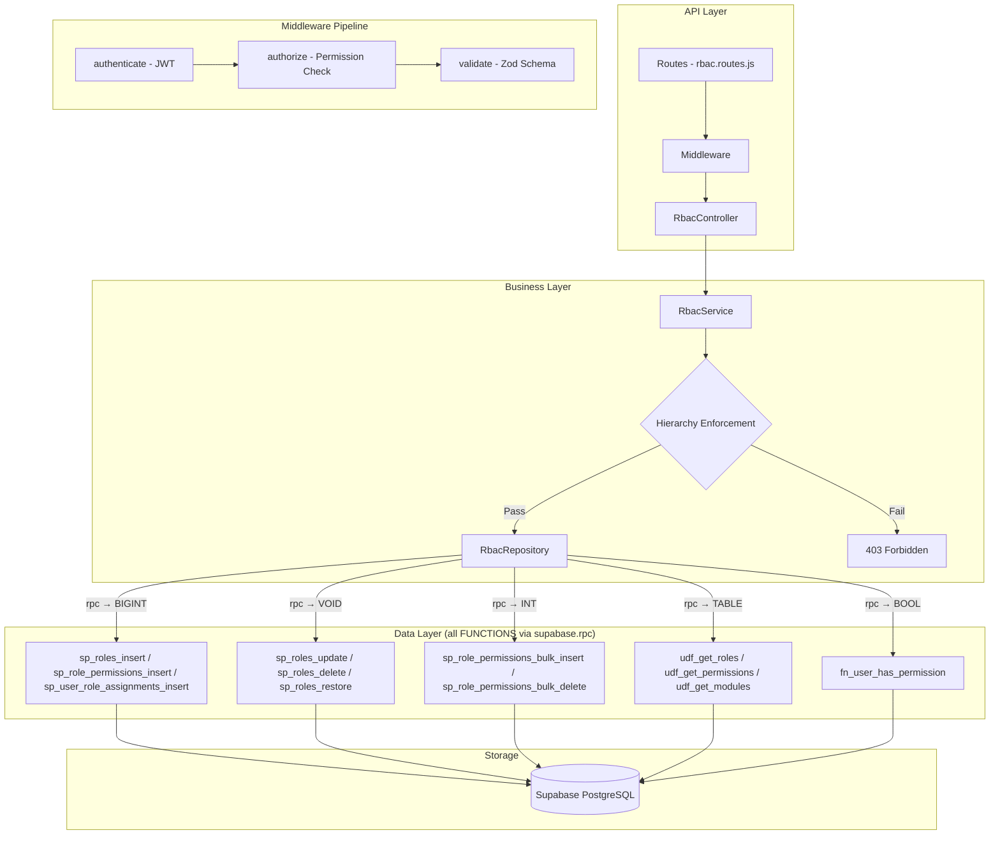
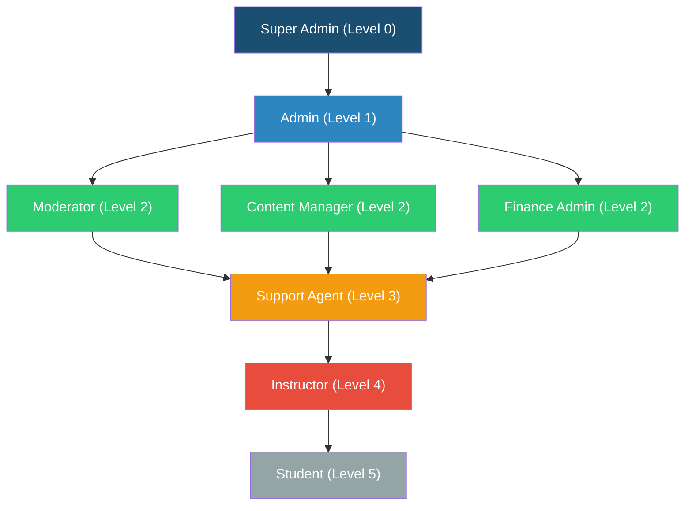

# GrowUpMore API — Roles & Permissions (RBAC) Module

## Postman Testing Guide

**Base URL:** `http://localhost:5001`
**API Prefix:** `/api/v1/rbac`
**Content-Type:** `application/json`
**Authentication:** All endpoints require `Bearer <access_token>` in Authorization header

---

## Architecture Flow



---

## Role Hierarchy



**Hierarchy Rules:**

| Role | Level | Can Create/Assign | Cannot |
|------|-------|-------------------|--------|
| Super Admin | 0 | All roles (including other super_admin & admin) | Cannot **delete/revoke** another super_admin |
| Admin | 1 | Moderator, Content Manager, Finance Admin, Support Agent, Instructor, Student | Cannot create/assign super_admin or admin |
| Moderator / Content Mgr / Finance Admin | 2 | Support Agent, Instructor, Student | Cannot manage level 2 or above |
| Support Agent | 3 | Instructor, Student | Cannot manage level 3 or above |
| Instructor | 4 | Student only | Cannot manage level 4 or above |
| Student | 5 | None | Cannot manage any roles |

---

## Complete Endpoint Reference

### Test Order (follow this sequence in Postman)

| # | Endpoint | Permission | Purpose |
|---|----------|------------|---------|
| 1 | `GET /api/v1/rbac/roles` | `role.read` | List all roles |
| 2 | `GET /api/v1/rbac/roles/:id` | `role.read` | Get role by ID |
| 3 | `POST /api/v1/rbac/roles` | `role.create` | Create a new role |
| 4 | `PUT /api/v1/rbac/roles/:id` | `role.update` | Update a role |
| 5 | `DELETE /api/v1/rbac/roles/:id` | `role.delete` | Soft-delete a role |
| 6 | `POST /api/v1/rbac/roles/:id/restore` | `role.update` | Restore a deleted role |
| 7 | `GET /api/v1/rbac/roles/:roleId/permissions` | `permission.manage` | List role permissions |
| 8 | `POST /api/v1/rbac/roles/:roleId/permissions` | `permission.manage` | Assign permission to role |
| 9 | `POST /api/v1/rbac/roles/:roleId/permissions/bulk` | `permission.manage` | Bulk assign permissions |
| 10 | `DELETE /api/v1/rbac/roles/:roleId/permissions/:permissionId` | `permission.manage` | Remove permission from role |
| 11 | `DELETE /api/v1/rbac/roles/:roleId/permissions` | `permission.manage` | Remove all permissions from role |
| 12 | `GET /api/v1/rbac/user-role-assignments` | `role.assign` | List user role assignments |
| 13 | `POST /api/v1/rbac/user-role-assignments` | `role.assign` | Assign role to user |
| 14 | `PUT /api/v1/rbac/user-role-assignments/:id` | `role.assign` | Update assignment |
| 15 | `DELETE /api/v1/rbac/user-role-assignments/:id` | `role.assign` | Revoke assignment (soft-delete) |
| 16 | `POST /api/v1/rbac/user-role-assignments/:id/restore` | `role.assign` | Restore revoked assignment |
| 17 | `GET /api/v1/rbac/permissions` | `permission.manage` | List all permissions |
| 18 | `GET /api/v1/rbac/permissions/:id` | `permission.manage` | Get permission by ID |
| 19 | `GET /api/v1/rbac/modules` | `role.read` | List all modules |
| 20 | `GET /api/v1/rbac/my-permissions` | _(authenticated)_ | Get my permissions |
| 21 | `GET /api/v1/rbac/users/:userId/permissions` | `role.read` | Get user's permissions |

---

## Common Headers (All Requests)

| Key | Value |
|-----|-------|
| Content-Type | application/json |
| Authorization | Bearer `<access_token>` |

> **Note:** Get the `access_token` from the `/api/v1/auth/login` response. Super admin token is required for most write operations.

---

## 1. List Roles

```
GET http://localhost:5001/api/v1/rbac/roles
```

**Permission Required:** `role.read`

**Query Parameters:**

| Parameter | Type | Default | Description |
|-----------|------|---------|-------------|
| page | integer | 1 | Page number |
| limit | integer | 20 | Items per page (max 100) |
| search | string | — | Search in name, code, description |
| sortBy | string | name | Sort field |
| sortDir | string | ASC | Sort direction (`ASC` or `DESC`) |
| level | integer | — | Filter by role level (0-5) |
| isSystemRole | boolean | — | Filter system roles (`true`/`false`) |
| parentRoleId | integer | — | Filter by parent role ID |
| isActive | boolean | — | Filter by active status (`true`/`false`) |

**Example with filters:**

```
GET http://localhost:5001/api/v1/rbac/roles?page=1&limit=10&level=2&isActive=true
```

**Response — 200 OK:**

```json
{
  "success": true,
  "message": "Roles retrieved successfully",
  "data": [
    {
      "role_id": 1,
      "name": "Super Admin",
      "code": "super_admin",
      "description": "Full platform access",
      "level": 0,
      "is_system_role": true,
      "is_active": true,
      "parent_role_id": null,
      "display_order": 0,
      "icon": null,
      "color": null,
      "created_at": "2026-04-04T10:00:00.000Z",
      "total_count": 8
    }
  ],
  "meta": {
    "page": 1,
    "limit": 20,
    "totalCount": 8,
    "totalPages": 1
  }
}
```

**Response — 403 Forbidden (missing permission):**

```json
{
  "success": false,
  "message": "You do not have permission: role.read"
}
```

---

## 2. Get Role by ID

```
GET http://localhost:5001/api/v1/rbac/roles/1
```

**Permission Required:** `role.read`

**URL Parameters:**

| Parameter | Type | Required | Rules |
|-----------|------|----------|-------|
| id | integer | Yes | Positive integer |

**Response — 200 OK:**

```json
{
  "success": true,
  "message": "Role retrieved successfully",
  "data": {
    "role_id": 1,
    "name": "Super Admin",
    "code": "super_admin",
    "description": "Full platform access",
    "level": 0,
    "is_system_role": true,
    "is_active": true,
    "parent_role_id": null,
    "display_order": 0,
    "icon": null,
    "color": null,
    "created_at": "2026-04-04T10:00:00.000Z",
    "updated_at": null
  }
}
```

**Response — 404 Not Found:**

```json
{
  "success": false,
  "message": "Role with ID 999 not found"
}
```

---

## 3. Create Role

```
POST http://localhost:5001/api/v1/rbac/roles
```

**Permission Required:** `role.create` (only super_admin)

**Request Body:**

```json
{
  "name": "Course Reviewer",
  "code": "course_reviewer",
  "description": "Reviews and approves course content before publishing",
  "level": 3,
  "parentRoleId": 3,
  "displayOrder": 10,
  "icon": "review",
  "color": "#3498DB",
  "isActive": true
}
```

**Validation Rules:**

| Field | Type | Required | Rules |
|-------|------|----------|-------|
| name | string | Yes | 2-100 characters |
| code | string | Yes | 2-50 chars, lowercase alphanumeric + underscore, must start with letter (regex: `^[a-z][a-z0-9_]*$`) |
| description | string | No | Max 500 characters |
| parentRoleId | integer | No | Positive integer, must reference existing role |
| level | integer | No | 0-99, default 99 |
| displayOrder | integer | No | 0 or greater, default 0 |
| icon | string | No | Max 50 characters |
| color | string | No | Max 20 characters |
| isActive | boolean | No | Default `true` |

**Response — 201 Created:**

```json
{
  "success": true,
  "message": "Role created successfully",
  "data": {
    "role_id": 9,
    "name": "Course Reviewer",
    "code": "course_reviewer",
    "level": 3
  }
}
```

**Response — 409 Conflict (duplicate code):**

```json
{
  "success": false,
  "message": "Role with code course_reviewer already exists"
}
```

**Response — 403 Forbidden (not super_admin):**

```json
{
  "success": false,
  "message": "This action requires super_admin role. User has admin role"
}
```

---

## 4. Update Role

```
PUT http://localhost:5001/api/v1/rbac/roles/9
```

**Permission Required:** `role.update` (only super_admin)

**Request Body (all fields optional):**

```json
{
  "name": "Senior Course Reviewer",
  "description": "Senior reviewer with approval authority",
  "level": 2,
  "isActive": true
}
```

**Validation Rules:**

| Field | Type | Required | Rules |
|-------|------|----------|-------|
| name | string | No | 2-100 characters |
| code | string | No | Same rules as create (cannot change system role codes) |
| description | string | No | Max 500 characters |
| parentRoleId | integer | No | Positive integer |
| level | integer | No | 0-99 |
| displayOrder | integer | No | 0 or greater |
| icon | string | No | Max 50 characters |
| color | string | No | Max 20 characters |
| isActive | boolean | No | — |

**Response — 200 OK:**

```json
{
  "success": true,
  "message": "Role updated successfully",
  "data": {
    "role_id": 9,
    "name": "Senior Course Reviewer",
    "code": "course_reviewer"
  }
}
```

**Response — 403 Forbidden (system role code change):**

```json
{
  "success": false,
  "message": "Cannot modify system role code"
}
```

---

## 5. Delete Role (Soft-Delete)

```
DELETE http://localhost:5001/api/v1/rbac/roles/9
```

**Permission Required:** `role.delete` (only super_admin)

> **Important:** System roles (super_admin, admin, moderator, content_manager, finance_admin, support_agent, instructor, student) **cannot** be deleted.

**Response — 200 OK:**

```json
{
  "success": true,
  "message": "Role deleted successfully",
  "data": null
}
```

**Response — 403 Forbidden (system role):**

```json
{
  "success": false,
  "message": "Cannot delete system roles"
}
```

**Response — 404 Not Found:**

```json
{
  "success": false,
  "message": "Role with ID 999 not found"
}
```

---

## 6. Restore Role

```
POST http://localhost:5001/api/v1/rbac/roles/9/restore
```

**Permission Required:** `role.update` (only super_admin)

**Request Body:**

```json
{
  "restorePermissions": true
}
```

**Validation Rules:**

| Field | Type | Required | Rules |
|-------|------|----------|-------|
| restorePermissions | boolean | No | Default `false`. When `true`, also restores permissions that were assigned to the role before deletion |

**Response — 200 OK:**

```json
{
  "success": true,
  "message": "Role restored successfully",
  "data": {
    "role_id": 9,
    "name": "Course Reviewer",
    "code": "course_reviewer"
  }
}
```

---

## 7. List Role Permissions

```
GET http://localhost:5001/api/v1/rbac/roles/2/permissions
```

**Permission Required:** `permission.manage`

**URL Parameters:**

| Parameter | Type | Required | Rules |
|-----------|------|----------|-------|
| roleId | integer | Yes | Positive integer |

**Query Parameters:**

| Parameter | Type | Default | Description |
|-----------|------|---------|-------------|
| page | integer | 1 | Page number |
| limit | integer | 20 | Items per page |
| search | string | — | Search in permission name/code |
| sortBy | string | name | Sort field |
| sortDir | string | ASC | Sort direction |
| moduleCode | string | — | Filter by module code |
| action | string | — | Filter by action (create/read/update/delete/manage) |
| scope | string | — | Filter by scope (`global`/`own`/`assigned`) |

**Example with filters:**

```
GET http://localhost:5001/api/v1/rbac/roles/2/permissions?moduleCode=course_management&action=read
```

**Response — 200 OK:**

```json
{
  "success": true,
  "message": "Role permissions retrieved successfully",
  "data": [
    {
      "permission_id": 5,
      "name": "Read Courses",
      "code": "course.read",
      "module_code": "course_management",
      "resource": "course",
      "action": "read",
      "scope": "global",
      "total_count": 15
    }
  ],
  "meta": {
    "page": 1,
    "limit": 20,
    "totalCount": 15,
    "totalPages": 1
  }
}
```

---

## 8. Assign Permission to Role

```
POST http://localhost:5001/api/v1/rbac/roles/2/permissions
```

**Permission Required:** `permission.manage` (only super_admin)

**Request Body:**

```json
{
  "permissionId": 42
}
```

**Validation Rules:**

| Field | Type | Required | Rules |
|-------|------|----------|-------|
| permissionId | integer | Yes | Positive integer, must reference existing permission |

**Response — 201 Created:**

```json
{
  "success": true,
  "message": "Permission assigned to role successfully",
  "data": {
    "role_permission_id": 101
  }
}
```

**Response — 404 Not Found:**

```json
{
  "success": false,
  "message": "Permission with ID 999 not found"
}
```

---

## 9. Bulk Assign Permissions to Role

```
POST http://localhost:5001/api/v1/rbac/roles/2/permissions/bulk
```

**Permission Required:** `permission.manage` (only super_admin)

**Request Body:**

```json
{
  "permissionIds": [1, 2, 3, 4, 5, 10, 15, 20]
}
```

**Validation Rules:**

| Field | Type | Required | Rules |
|-------|------|----------|-------|
| permissionIds | integer[] | Yes | Array of positive integers, minimum 1 item |

**Response — 201 Created:**

```json
{
  "success": true,
  "message": "Permissions assigned to role successfully",
  "data": {
    "count": 8
  }
}
```

---

## 10. Remove Permission from Role

```
DELETE http://localhost:5001/api/v1/rbac/roles/2/permissions/42
```

**Permission Required:** `permission.manage` (only super_admin)

**URL Parameters:**

| Parameter | Type | Required | Rules |
|-----------|------|----------|-------|
| roleId | integer | Yes | Positive integer |
| permissionId | integer | Yes | Positive integer |

**Response — 200 OK:**

```json
{
  "success": true,
  "message": "Permission removed from role successfully",
  "data": null
}
```

---

## 11. Remove All Permissions from Role

```
DELETE http://localhost:5001/api/v1/rbac/roles/9/permissions
```

**Permission Required:** `permission.manage` (only super_admin)

> **Warning:** This removes ALL permissions from the role. Use with caution.

**Response — 200 OK:**

```json
{
  "success": true,
  "message": "All permissions removed from role successfully",
  "data": null
}
```

---

## 12. List User Role Assignments

```
GET http://localhost:5001/api/v1/rbac/user-role-assignments
```

**Permission Required:** `role.assign`

**Query Parameters:**

| Parameter | Type | Default | Description |
|-----------|------|---------|-------------|
| page | integer | 1 | Page number |
| limit | integer | 20 | Items per page |
| search | string | — | Search in user name, role name |
| sortBy | string | createdAt | Sort field |
| sortDir | string | desc | Sort direction |
| userId | integer | — | Filter by user ID |
| roleId | integer | — | Filter by role ID |
| roleCode | string | — | Filter by role code (e.g. `student`) |
| contextType | string | — | Filter by context type (e.g. `course`) |

**Example — find all instructors:**

```
GET http://localhost:5001/api/v1/rbac/user-role-assignments?roleCode=instructor&page=1&limit=50
```

**Example — find all roles of a specific user:**

```
GET http://localhost:5001/api/v1/rbac/user-role-assignments?userId=25
```

**Response — 200 OK:**

```json
{
  "success": true,
  "message": "User role assignments retrieved successfully",
  "data": [
    {
      "assignment_id": 1,
      "user_id": 25,
      "role_id": 7,
      "role_code": "instructor",
      "role_name": "Instructor",
      "context_type": null,
      "context_id": null,
      "expires_at": null,
      "reason": "Promoted to instructor",
      "is_active": true,
      "created_at": "2026-04-04T10:30:00.000Z",
      "total_count": 5
    }
  ],
  "meta": {
    "page": 1,
    "limit": 20,
    "totalCount": 5,
    "totalPages": 1
  }
}
```

---

## 13. Assign Role to User

```
POST http://localhost:5001/api/v1/rbac/user-role-assignments
```

**Permission Required:** `role.assign` + hierarchy check

**Request Body (global assignment):**

```json
{
  "userId": 25,
  "roleId": 7,
  "reason": "Promoted to instructor after course completion"
}
```

**Request Body (context-scoped assignment — e.g., instructor for specific course):**

```json
{
  "userId": 25,
  "roleId": 7,
  "contextType": "course",
  "contextId": 101,
  "expiresAt": "2027-01-01T00:00:00.000Z",
  "reason": "Guest instructor for Web Dev 101"
}
```

**Validation Rules:**

| Field | Type | Required | Rules |
|-------|------|----------|-------|
| userId | integer | Yes | Positive integer |
| roleId | integer | Yes | Positive integer, must reference existing role |
| contextType | string | No | Max 50 chars. Must be paired with `contextId` |
| contextId | integer | No | Positive integer. Must be paired with `contextType` |
| expiresAt | datetime | No | ISO 8601 format (e.g. `2027-01-01T00:00:00.000Z`) |
| reason | string | No | Max 500 characters |

> **Important:** `contextType` and `contextId` must **both** be provided together or **both** be null. Providing only one will cause a validation error.

**Response — 201 Created:**

```json
{
  "success": true,
  "message": "Role assigned to user successfully",
  "data": {
    "assignment_id": 42
  }
}
```

**Response — 403 Forbidden (hierarchy violation — admin trying to assign admin):**

```json
{
  "success": false,
  "message": "Admin cannot manage admin roles"
}
```

**Response — 403 Forbidden (admin trying to assign super_admin):**

```json
{
  "success": false,
  "message": "Admin cannot manage super_admin roles"
}
```

---

## 14. Update User Role Assignment

```
PUT http://localhost:5001/api/v1/rbac/user-role-assignments/42
```

**Permission Required:** `role.assign` + hierarchy check

**Request Body (all fields optional):**

```json
{
  "expiresAt": "2027-06-01T00:00:00.000Z",
  "reason": "Extended assignment for next semester",
  "isActive": true
}
```

**Validation Rules:**

| Field | Type | Required | Rules |
|-------|------|----------|-------|
| expiresAt | datetime | No | ISO 8601 format |
| reason | string | No | Max 500 characters |
| isActive | boolean | No | — |

**Response — 200 OK:**

```json
{
  "success": true,
  "message": "User role assignment updated successfully",
  "data": {
    "assignment_id": 42
  }
}
```

---

## 15. Revoke User Role Assignment (Soft-Delete)

```
DELETE http://localhost:5001/api/v1/rbac/user-role-assignments/42
```

**Permission Required:** `role.assign` + hierarchy check

> **Important:** Super admin CANNOT revoke another super_admin's role assignment.

**Response — 200 OK:**

```json
{
  "success": true,
  "message": "User role assignment revoked successfully",
  "data": null
}
```

**Response — 403 Forbidden (SA revoking another SA):**

```json
{
  "success": false,
  "message": "Super admin cannot delete/revoke another super_admin"
}
```

---

## 16. Restore Revoked Assignment

```
POST http://localhost:5001/api/v1/rbac/user-role-assignments/42/restore
```

**Permission Required:** `role.assign`

**Response — 200 OK:**

```json
{
  "success": true,
  "message": "User role assignment restored successfully",
  "data": {
    "assignment_id": 42
  }
}
```

---

## 17. List All Permissions

```
GET http://localhost:5001/api/v1/rbac/permissions
```

**Permission Required:** `permission.manage`

**Query Parameters:**

| Parameter | Type | Default | Description |
|-----------|------|---------|-------------|
| page | integer | 1 | Page number |
| limit | integer | 20 | Items per page |
| search | string | — | Search in permission name/code/description |
| sortBy | string | name | Sort field |
| sortDir | string | ASC | Sort direction |
| moduleCode | string | — | Filter by module (e.g. `user_management`) |
| resource | string | — | Filter by resource (e.g. `user`) |
| action | string | — | Filter by action (e.g. `create`, `read`, `update`, `delete`) |
| scope | string | — | Filter by scope (`global`, `own`, `assigned`) |

**Example — get all course-related permissions:**

```
GET http://localhost:5001/api/v1/rbac/permissions?moduleCode=course_management
```

**Response — 200 OK:**

```json
{
  "success": true,
  "message": "Permissions retrieved successfully",
  "data": [
    {
      "permission_id": 1,
      "name": "Create Users",
      "code": "user.create",
      "description": "Create new user accounts",
      "module_code": "user_management",
      "resource": "user",
      "action": "create",
      "scope": "global",
      "is_active": true,
      "total_count": 100
    }
  ],
  "meta": {
    "page": 1,
    "limit": 20,
    "totalCount": 100,
    "totalPages": 5
  }
}
```

---

## 18. Get Permission by ID

```
GET http://localhost:5001/api/v1/rbac/permissions/1
```

**Permission Required:** `permission.manage`

**Response — 200 OK:**

```json
{
  "success": true,
  "message": "Permission retrieved successfully",
  "data": {
    "permission_id": 1,
    "name": "Create Users",
    "code": "user.create",
    "description": "Create new user accounts",
    "module_code": "user_management",
    "resource": "user",
    "action": "create",
    "scope": "global",
    "is_active": true
  }
}
```

---

## 19. List All Modules

```
GET http://localhost:5001/api/v1/rbac/modules
```

**Permission Required:** `role.read`

**Query Parameters:**

| Parameter | Type | Default | Description |
|-----------|------|---------|-------------|
| page | integer | 1 | Page number |
| limit | integer | 20 | Items per page |
| search | string | — | Search in module name/code |
| sortBy | string | — | Sort field |
| sortDir | string | ASC | Sort direction |
| isActive | boolean | — | Filter by active status |

**Response — 200 OK:**

```json
{
  "success": true,
  "message": "Modules retrieved successfully",
  "data": [
    {
      "module_id": 1,
      "name": "User Management",
      "code": "user_management",
      "description": "User account management",
      "is_active": true
    },
    {
      "module_id": 2,
      "name": "Course Management",
      "code": "course_management",
      "description": "Course creation and management",
      "is_active": true
    }
  ]
}
```

---

## 20. Get My Permissions

```
GET http://localhost:5001/api/v1/rbac/my-permissions
```

**Permission Required:** _(none — only authentication required)_

> **Note:** This endpoint does **not** require any specific permission. Any authenticated user can view their own permissions.

**Response — 200 OK:**

```json
{
  "success": true,
  "message": "Your permissions retrieved successfully",
  "data": [
    {
      "permission_code": "course.read",
      "permission_name": "Read Courses",
      "module_code": "course_management",
      "scope": "global"
    },
    {
      "permission_code": "enrollment.read.own",
      "permission_name": "Read Own Enrollments",
      "module_code": "enrollment",
      "scope": "own"
    }
  ]
}
```

---

## 21. Get User's Permissions

```
GET http://localhost:5001/api/v1/rbac/users/25/permissions
```

**Permission Required:** `role.read`

**URL Parameters:**

| Parameter | Type | Required | Rules |
|-----------|------|----------|-------|
| userId | integer | Yes | Positive integer |

**Response — 200 OK:**

```json
{
  "success": true,
  "message": "User permissions retrieved successfully",
  "data": [
    {
      "permission_code": "course.create",
      "permission_name": "Create Courses",
      "module_code": "course_management",
      "scope": "global"
    },
    {
      "permission_code": "course.read.own",
      "permission_name": "Read Own Courses",
      "module_code": "course_management",
      "scope": "own"
    }
  ]
}
```

---

## Authorization Middleware Reference

Three factory functions used in route definitions:

### `authorize(permissionCode)`

Checks single permission. Super admins bypass.

```js
router.get('/roles', authorize('role.read'), controller.getRoles);
```

### `authorizeAny(permissionCodes[])`

OR-logic. Passes if user has **any one** of the listed permissions.

```js
router.get('/dashboard', authorizeAny(['analytics.read', 'report.read']), controller.getDashboard);
```

### `authorizeRole(...roleCodes)`

Checks user has **any one** of the listed role codes (ignores permissions).

```js
router.post('/system/config', authorizeRole('super_admin', 'admin'), controller.updateConfig);
```

---

## Permission Code Format

```
module_code.action[.scope]
```

| Component | Values | Examples |
|-----------|--------|----------|
| module_code | 34 modules | `user_management`, `course_management`, `enrollment` |
| action | `create`, `read`, `update`, `delete`, `manage`, `assign`, `export`, `import`, `approve`, `publish` | `user.create`, `course.publish` |
| scope | `global` (default, omitted), `own`, `assigned` | `course.read.own`, `enrollment.read.assigned` |

---

## Seeded Roles Reference

| ID | Code | Level | Description |
|----|------|-------|-------------|
| 1 | `super_admin` | 0 | Full platform access |
| 2 | `admin` | 1 | Platform administration |
| 3 | `moderator` | 2 | Content moderation |
| 4 | `content_manager` | 2 | Content management |
| 5 | `finance_admin` | 2 | Financial management |
| 6 | `support_agent` | 3 | Customer support |
| 7 | `instructor` | 4 | Course creation & teaching |
| 8 | `student` | 5 | Learning & courses (auto-assigned on registration) |

---

## Error Reference

| HTTP Code | Error Type | Common Causes |
|-----------|-----------|---------------|
| 400 | BadRequestError | Missing required fields, invalid field values |
| 401 | UnauthorizedError | Missing or expired JWT token |
| 403 | ForbiddenError | Missing permission, hierarchy violation, system role protection |
| 404 | NotFoundError | Role/permission/assignment not found |
| 409 | ConflictError | Duplicate role code |
| 422 | ValidationError | Zod schema validation failure |
| 429 | TooManyRequestsError | Rate limit exceeded |
| 500 | InternalServerError | Database or server errors |

---

## Postman Environment Variables (Recommended)

| Variable | Initial Value | Description |
|----------|---------------|-------------|
| `base_url` | `http://localhost:5001` | API base URL |
| `access_token` | _(empty)_ | Set after login |
| `sa_token` | _(empty)_ | Super admin token for write operations |
| `test_role_id` | _(empty)_ | ID of a role created during testing |
| `test_assignment_id` | _(empty)_ | ID of an assignment created during testing |

> **Tip:** After login, use Postman's **Tests** tab to auto-set the token:
> ```js
> const response = pm.response.json();
> if (response.data?.accessToken) {
>     pm.environment.set("access_token", response.data.accessToken);
> }
> ```
